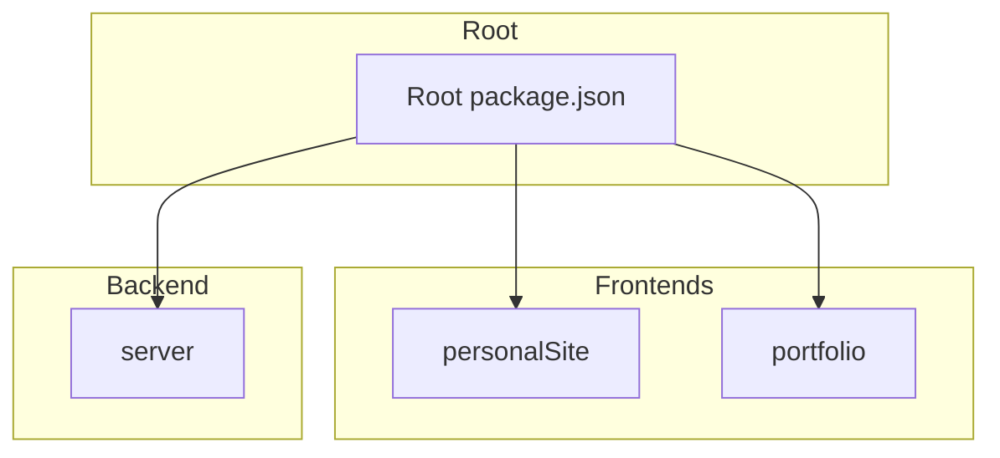
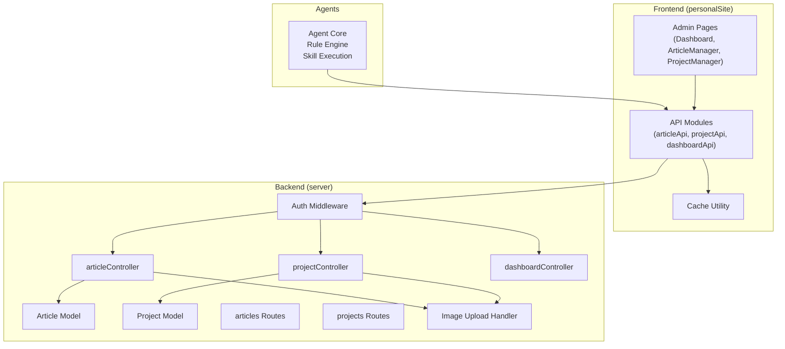
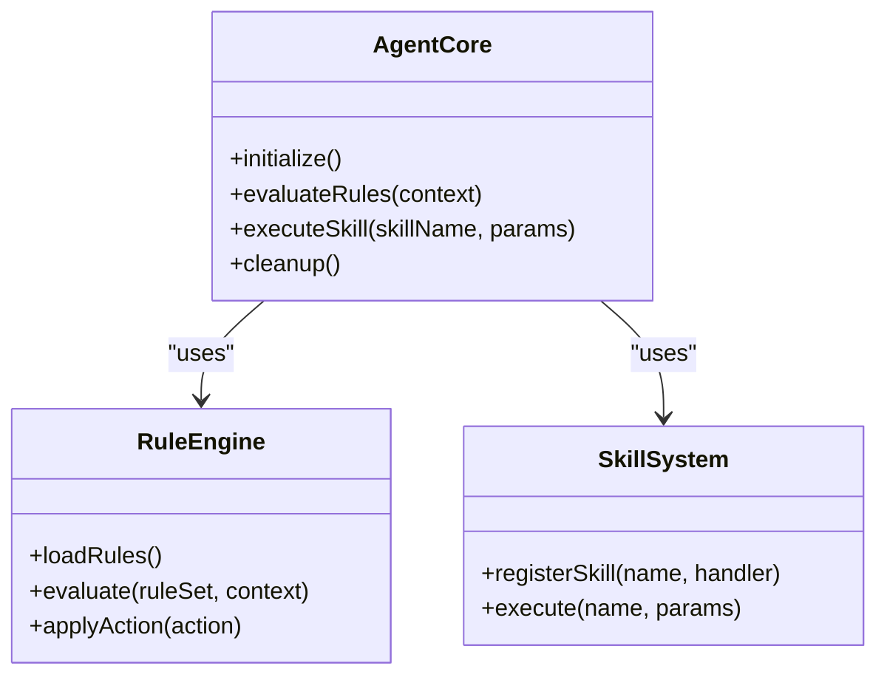
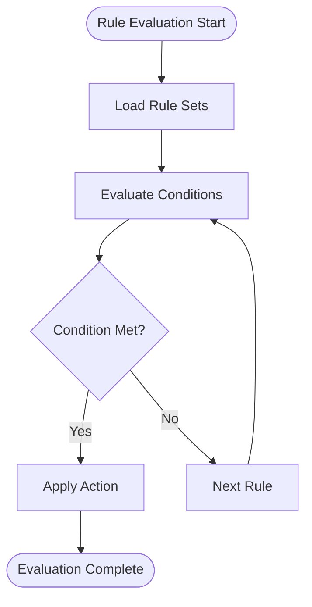
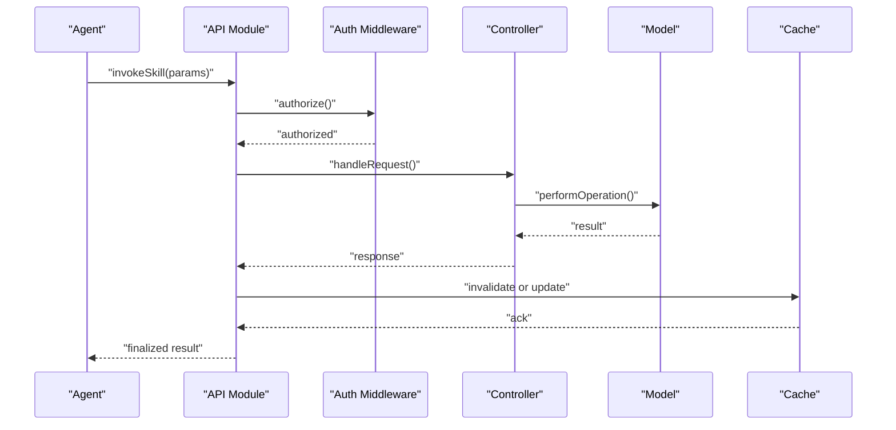
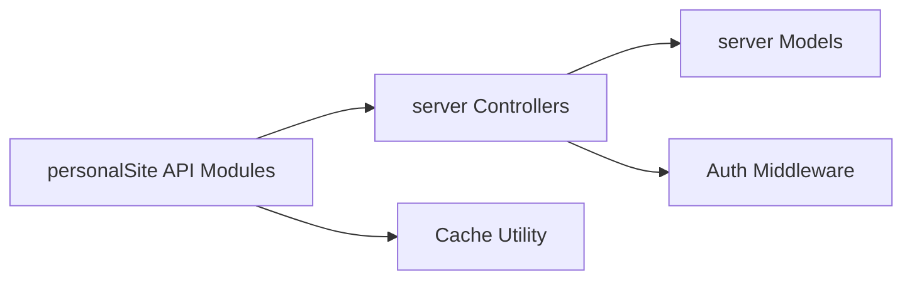
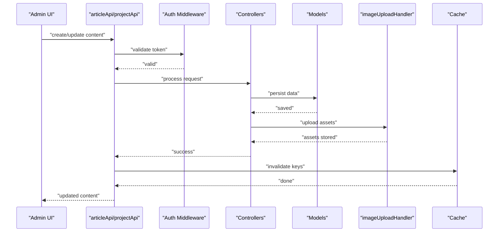
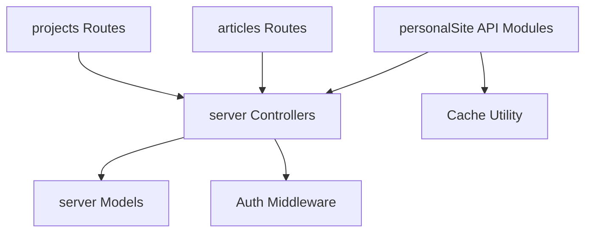

# AI Automation System

<cite>
**Referenced Files in This Document**
- [AGENTS.md](file://AGENTS.md)
- [package.json](file://package.json)
- [server/src/index.ts](file://server/src/index.ts)
- [server/src/controllers/articleController.ts](file://server/src/controllers/articleController.ts)
- [server/src/controllers/projectController.ts](file://server/src/controllers/projectController.ts)
- [server/src/controllers/dashboardController.ts](file://server/src/controllers/dashboardController.ts)
- [server/src/models/Article.ts](file://server/src/models/Article.ts)
- [server/src/models/Project.ts](file://server/src/models/Project.ts)
- [server/src/routes/articles.ts](file://server/src/routes/articles.ts)
- [server/src/routes/projects.ts](file://server/src/routes/projects.ts)
- [server/src/utils/imageUploadHandler.ts](file://server/src/utils/imageUploadHandler.ts)
- [personalSite/src/api/articleApi.ts](file://personalSite/src/api/articleApi.ts)
- [personalSite/src/api/projectApi.ts](file://personalSite/src/api/projectApi.ts)
- [personalSite/src/api/dashboardApi.ts](file://personalSite/src/api/dashboardApi.ts)
- [personalSite/src/components/pages/Admin/Dashboard.tsx](file://personalSite/src/components/pages/Admin/Dashboard.tsx)
- [personalSite/src/components/pages/Admin/ArticleManager.tsx](file://personalSite/src/components/pages/Admin/ArticleManager.tsx)
- [personalSite/src/components/pages/Admin/ProjectManager.tsx](file://personalSite/src/components/pages/Admin/ProjectManager.tsx)
- [personalSite/src/lib/cache.ts](file://personalSite/src/lib/cache.ts)
- [server/src/middleware/auth.ts](file://server/src/middleware/auth.ts)
</cite>

## Table of Contents
1. [Introduction](#introduction)
2. [Project Structure](#project-structure)
3. [Core Components](#core-components)
4. [Architecture Overview](#architecture-overview)
5. [Detailed Component Analysis](#detailed-component-analysis)
6. [Dependency Analysis](#dependency-analysis)
7. [Performance Considerations](#performance-considerations)
8. [Troubleshooting Guide](#troubleshooting-guide)
9. [Conclusion](#conclusion)
10. [Appendices](#appendices)

## Introduction
This document describes the AI Automation System (.qoder) within the Personal Portfolio Platform. The system enables intelligent agent-based automation across content creation, administration, and operational tasks. It integrates with the main portfolio applications (personalSite, portfolio, and server) to support automated workflows such as content generation, asset handling, and administrative dashboards.

Key aspects covered:
- Agent system architecture and lifecycle
- Rule engine implementation guidance
- Skill system for task automation
- Integration points with the portfolio system
- Automated content generation workflows
- Intelligent task scheduling
- Extensibility, performance, monitoring/logging, debugging, and optimization

## Project Structure
The repository follows a monorepo-style layout with three primary applications and a shared root configuration:
- personalSite: main React + TypeScript frontend (Vite, Tailwind, shadcn/ui)
- server: Express + TypeScript API
- portfolio: secondary frontend (also Vite)
- Root package.json: orchestrates multi-app development and builds

**Diagram sources**
- [package.json](file://package.json#L6-L16)

**Section sources**
- [AGENTS.md](file://AGENTS.md#L5-L12)
- [package.json](file://package.json#L1-L31)

## Core Components
This section outlines the foundational components that enable AI automation across the system.

- Agent Definition and Lifecycle
  - Agents operate within the context of the portfolio applications and follow repository-wide instructions defined in AGENTS.md.
  - Lifecycle stages include initialization, rule evaluation, skill execution, and cleanup.

- Rule Engine Implementation
  - Rules define agent behavior and decision-making logic.
  - The system supports declarative rule sets that evaluate conditions and trigger appropriate actions.

- Skill System
  - Skills encapsulate reusable automation tasks (e.g., content generation, asset upload, dashboard updates).
  - Skills integrate with API modules and middleware for secure, validated operations.

- Integration Points
  - personalSite API modules handle client-side automation requests.
  - server controllers and routes manage backend automation tasks.
  - Middleware enforces authentication and authorization for automated operations.

- Automated Content Generation Workflows
  - Content creation and updates leverage API endpoints and caching utilities.
  - Image upload handling ensures robust asset automation.

- Intelligent Task Scheduling
  - Scheduling can be implemented via cron jobs or event-driven triggers integrated with the server routes.

**Section sources**
- [AGENTS.md](file://AGENTS.md#L14-L25)
- [personalSite/src/api/articleApi.ts](file://personalSite/src/api/articleApi.ts)
- [personalSite/src/api/projectApi.ts](file://personalSite/src/api/projectApi.ts)
- [personalSite/src/api/dashboardApi.ts](file://personalSite/src/api/dashboardApi.ts)
- [server/src/controllers/articleController.ts](file://server/src/controllers/articleController.ts)
- [server/src/controllers/projectController.ts](file://server/src/controllers/projectController.ts)
- [server/src/controllers/dashboardController.ts](file://server/src/controllers/dashboardController.ts)
- [server/src/utils/imageUploadHandler.ts](file://server/src/utils/imageUploadHandler.ts)
- [personalSite/src/lib/cache.ts](file://personalSite/src/lib/cache.ts)

## Architecture Overview
The AI Automation System spans the frontend and backend, with agents orchestrating tasks across content management, asset handling, and administrative dashboards.

**Diagram sources**
- [server/src/index.ts](file://server/src/index.ts)
- [server/src/controllers/articleController.ts](file://server/src/controllers/articleController.ts)
- [server/src/controllers/projectController.ts](file://server/src/controllers/projectController.ts)
- [server/src/controllers/dashboardController.ts](file://server/src/controllers/dashboardController.ts)
- [server/src/models/Article.ts](file://server/src/models/Article.ts)
- [server/src/models/Project.ts](file://server/src/models/Project.ts)
- [server/src/routes/articles.ts](file://server/src/routes/articles.ts)
- [server/src/routes/projects.ts](file://server/src/routes/projects.ts)
- [server/src/utils/imageUploadHandler.ts](file://server/src/utils/imageUploadHandler.ts)
- [personalSite/src/api/articleApi.ts](file://personalSite/src/api/articleApi.ts)
- [personalSite/src/api/projectApi.ts](file://personalSite/src/api/projectApi.ts)
- [personalSite/src/api/dashboardApi.ts](file://personalSite/src/api/dashboardApi.ts)
- [personalSite/src/lib/cache.ts](file://personalSite/src/lib/cache.ts)
- [server/src/middleware/auth.ts](file://server/src/middleware/auth.ts)

## Detailed Component Analysis

### Agent System Architecture
The agent system is designed to:
- Load and follow repository instructions from AGENTS.md
- Evaluate rules to decide actions
- Execute skills to perform tasks
- Integrate with frontend and backend APIs

[No sources needed since this diagram shows conceptual architecture, not actual code structure]

**Section sources**
- [AGENTS.md](file://AGENTS.md#L14-L25)

### Rule Evaluation Process
Rules define conditions and actions for agent decision-making. The evaluation process:
- Loads rule sets
- Evaluates conditions against context
- Applies actions when conditions are met

[No sources needed since this diagram shows conceptual workflow, not actual code structure]

### Skill Execution Patterns
Skills encapsulate automation tasks and integrate with API modules and middleware. Typical patterns:
- Content generation via API endpoints
- Asset upload and management
- Dashboard updates and reporting

**Diagram sources**
- [server/src/middleware/auth.ts](file://server/src/middleware/auth.ts)
- [server/src/controllers/articleController.ts](file://server/src/controllers/articleController.ts)
- [server/src/controllers/projectController.ts](file://server/src/controllers/projectController.ts)
- [server/src/controllers/dashboardController.ts](file://server/src/controllers/dashboardController.ts)
- [server/src/models/Article.ts](file://server/src/models/Article.ts)
- [server/src/models/Project.ts](file://server/src/models/Project.ts)
- [personalSite/src/lib/cache.ts](file://personalSite/src/lib/cache.ts)

### Integration Points with Portfolio System
- personalSite API modules expose automation endpoints for content and dashboard tasks.
- Server controllers and routes implement backend logic with models for persistence.
- Middleware ensures secure access to automated operations.

**Diagram sources**
- [personalSite/src/api/articleApi.ts](file://personalSite/src/api/articleApi.ts)
- [personalSite/src/api/projectApi.ts](file://personalSite/src/api/projectApi.ts)
- [personalSite/src/api/dashboardApi.ts](file://personalSite/src/api/dashboardApi.ts)
- [server/src/controllers/articleController.ts](file://server/src/controllers/articleController.ts)
- [server/src/controllers/projectController.ts](file://server/src/controllers/projectController.ts)
- [server/src/controllers/dashboardController.ts](file://server/src/controllers/dashboardController.ts)
- [server/src/models/Article.ts](file://server/src/models/Article.ts)
- [server/src/models/Project.ts](file://server/src/models/Project.ts)
- [personalSite/src/lib/cache.ts](file://personalSite/src/lib/cache.ts)
- [server/src/middleware/auth.ts](file://server/src/middleware/auth.ts)

### Automated Content Generation Workflows
Content generation leverages API modules and caching:
- Article and project management endpoints
- Image upload handler for media assets
- Cache invalidation after mutations

**Diagram sources**
- [personalSite/src/api/articleApi.ts](file://personalSite/src/api/articleApi.ts)
- [personalSite/src/api/projectApi.ts](file://personalSite/src/api/projectApi.ts)
- [server/src/middleware/auth.ts](file://server/src/middleware/auth.ts)
- [server/src/controllers/articleController.ts](file://server/src/controllers/articleController.ts)
- [server/src/controllers/projectController.ts](file://server/src/controllers/projectController.ts)
- [server/src/models/Article.ts](file://server/src/models/Article.ts)
- [server/src/models/Project.ts](file://server/src/models/Project.ts)
- [server/src/utils/imageUploadHandler.ts](file://server/src/utils/imageUploadHandler.ts)
- [personalSite/src/lib/cache.ts](file://personalSite/src/lib/cache.ts)

### Intelligent Task Scheduling
Task scheduling can be implemented using:
- Cron-based triggers integrated with server routes
- Event-driven automation via webhook handlers
- Background job queues for heavy AI operations

[No sources needed since this section provides general guidance]

## Dependency Analysis
The system exhibits clear separation of concerns:
- Frontend depends on API modules and cache utilities
- Backend controllers depend on models and middleware
- Routes connect frontend requests to backend logic

**Diagram sources**
- [server/src/routes/articles.ts](file://server/src/routes/articles.ts)
- [server/src/routes/projects.ts](file://server/src/routes/projects.ts)
- [server/src/controllers/articleController.ts](file://server/src/controllers/articleController.ts)
- [server/src/controllers/projectController.ts](file://server/src/controllers/projectController.ts)
- [server/src/models/Article.ts](file://server/src/models/Article.ts)
- [server/src/models/Project.ts](file://server/src/models/Project.ts)
- [server/src/middleware/auth.ts](file://server/src/middleware/auth.ts)
- [personalSite/src/lib/cache.ts](file://personalSite/src/lib/cache.ts)

**Section sources**
- [server/src/routes/articles.ts](file://server/src/routes/articles.ts)
- [server/src/routes/projects.ts](file://server/src/routes/projects.ts)
- [server/src/controllers/articleController.ts](file://server/src/controllers/articleController.ts)
- [server/src/controllers/projectController.ts](file://server/src/controllers/projectController.ts)
- [server/src/models/Article.ts](file://server/src/models/Article.ts)
- [server/src/models/Project.ts](file://server/src/models/Project.ts)
- [server/src/middleware/auth.ts](file://server/src/middleware/auth.ts)
- [personalSite/src/lib/cache.ts](file://personalSite/src/lib/cache.ts)

## Performance Considerations
- Caching: Use cache utilities to minimize repeated API calls and database reads.
- Asynchronous Operations: Offload heavy AI tasks to background workers or queues.
- Request Validation: Validate and sanitize inputs early to reduce error handling overhead.
- Middleware Efficiency: Keep auth checks lightweight and reuse tokens where possible.
- Image Processing: Optimize asset uploads and transformations to reduce latency.

[No sources needed since this section provides general guidance]

## Troubleshooting Guide
Common issues and resolutions:
- Authentication Failures: Verify bearer tokens and middleware configuration.
- API Errors: Check controller responses and ensure consistent error shapes.
- Cache Invalidation: Confirm cache keys are invalidated after mutations.
- Logging: Add structured logs around agent execution, rule evaluation, and skill invocations.

Debugging steps:
- Enable verbose logging in controllers and middleware.
- Inspect cache state and invalidation patterns.
- Validate rule conditions and action outcomes.
- Monitor AI operation latencies and resource usage.

**Section sources**
- [server/src/middleware/auth.ts](file://server/src/middleware/auth.ts)
- [server/src/controllers/articleController.ts](file://server/src/controllers/articleController.ts)
- [server/src/controllers/projectController.ts](file://server/src/controllers/projectController.ts)
- [server/src/controllers/dashboardController.ts](file://server/src/controllers/dashboardController.ts)
- [personalSite/src/lib/cache.ts](file://personalSite/src/lib/cache.ts)

## Conclusion
The AI Automation System (.qoder) provides a structured foundation for intelligent agent-based automation across the portfolio platform. By leveraging a clear separation of concerns, robust middleware, and reusable API modules, the system supports scalable automation workflows. Extensibility is achieved through modular agents, rule engines, and skill systems, while performance and reliability are ensured through caching, validation, and logging practices.

[No sources needed since this section summarizes without analyzing specific files]

## Appendices

### Creating Custom Agents
- Define agent behavior in AGENTS.md and ensure compliance with repository instructions.
- Implement rule sets that evaluate context and trigger actions.
- Register skills that encapsulate reusable automation tasks.

**Section sources**
- [AGENTS.md](file://AGENTS.md#L14-L25)

### Defining Rules for Specific Behaviors
- Structure rules as condition-action pairs.
- Use the rule engine to evaluate conditions against runtime context.
- Apply actions that invoke registered skills.

**Section sources**
- [AGENTS.md](file://AGENTS.md#L14-L25)

### Implementing New Skills
- Encapsulate automation logic in skill handlers.
- Integrate with API modules and middleware for secure operations.
- Update cache keys after mutations to maintain consistency.

**Section sources**
- [personalSite/src/api/articleApi.ts](file://personalSite/src/api/articleApi.ts)
- [personalSite/src/api/projectApi.ts](file://personalSite/src/api/projectApi.ts)
- [personalSite/src/api/dashboardApi.ts](file://personalSite/src/api/dashboardApi.ts)
- [personalSite/src/lib/cache.ts](file://personalSite/src/lib/cache.ts)

### Monitoring and Logging Capabilities
- Instrument agent execution, rule evaluation, and skill invocations.
- Log actionable errors with proper context and status codes.
- Track cache hits/misses and invalidation events.

**Section sources**
- [server/src/controllers/articleController.ts](file://server/src/controllers/articleController.ts)
- [server/src/controllers/projectController.ts](file://server/src/controllers/projectController.ts)
- [server/src/controllers/dashboardController.ts](file://server/src/controllers/dashboardController.ts)
- [personalSite/src/lib/cache.ts](file://personalSite/src/lib/cache.ts)

### Extensibility Guidelines
- Keep changes minimal and scoped to the request.
- Follow existing patterns for imports, formatting, and types.
- Reuse existing types and modules where possible.

**Section sources**
- [AGENTS.md](file://AGENTS.md#L76-L142)