# Agent Management

<cite>
**Referenced Files in This Document**
- [AGENTS.md](file://AGENTS.md)
- [server/src/index.ts](file://server/src/index.ts)
- [server/src/controllers/authController.ts](file://server/src/controllers/authController.ts)
- [server/src/routes/interests.ts](file://server/src/routes/interests.ts)
- [personalSite/src/lib/cache.ts](file://personalSite/src/lib/cache.ts)
- [personalSite/src/api/aboutApi.ts](file://personalSite/src/api/aboutApi.ts)
- [personalSite/src/api/articleApi.ts](file://personalSite/src/api/articleApi.ts)
- [personalSite/src/components/layout/AdminLayout.tsx](file://personalSite/src/components/layout/AdminLayout.tsx)
- [personalSite/src/App.tsx](file://personalSite/src/App.tsx)
</cite>

## Table of Contents
1. [Introduction](#introduction)
2. [Project Structure](#project-structure)
3. [Core Components](#core-components)
4. [Architecture Overview](#architecture-overview)
5. [Detailed Component Analysis](#detailed-component-analysis)
6. [Dependency Analysis](#dependency-analysis)
7. [Performance Considerations](#performance-considerations)
8. [Troubleshooting Guide](#troubleshooting-guide)
9. [Conclusion](#conclusion)
10. [Appendices](#appendices)

## Introduction
This document describes the Agent Management system within the AI Automation System. It explains how agents are defined, configured, instantiated, executed, and coordinated across the system. It also documents the agent registry, communication protocols, state management, persistence, serialization/deserialization, performance monitoring, debugging, optimization, and scaling strategies. The repository’s guidance for agent workflows and operational conventions is captured in the AGENTS.md file, while the backend and frontend components demonstrate concrete patterns for agent lifecycle management and inter-agent coordination.

## Project Structure
The Agent Management system spans three primary areas:
- Backend API server: Express-based REST endpoints, middleware, and routing.
- Frontend applications: React-based dashboards and managers for administrative tasks.
- Shared conventions and utilities: Caching, API configuration, and agent workflow guidelines.

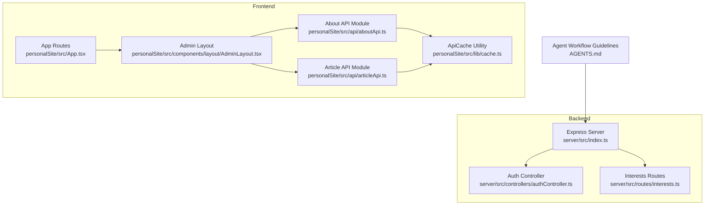

**Diagram sources**
- [server/src/index.ts](file://server/src/index.ts#L1-L158)
- [server/src/controllers/authController.ts](file://server/src/controllers/authController.ts#L1-L142)
- [server/src/routes/interests.ts](file://server/src/routes/interests.ts#L1-L35)
- [personalSite/src/lib/cache.ts](file://personalSite/src/lib/cache.ts#L1-L137)
- [personalSite/src/api/aboutApi.ts](file://personalSite/src/api/aboutApi.ts#L1-L86)
- [personalSite/src/api/articleApi.ts](file://personalSite/src/api/articleApi.ts#L1-L224)
- [personalSite/src/components/layout/AdminLayout.tsx](file://personalSite/src/components/layout/AdminLayout.tsx#L57-L106)
- [personalSite/src/App.tsx](file://personalSite/src/App.tsx#L14-L358)
- [AGENTS.md](file://AGENTS.md#L1-L163)

**Section sources**
- [AGENTS.md](file://AGENTS.md#L1-L163)
- [server/src/index.ts](file://server/src/index.ts#L1-L158)
- [personalSite/src/lib/cache.ts](file://personalSite/src/lib/cache.ts#L1-L137)

## Core Components
- Agent Registry and Lifecycle: The backend exposes REST endpoints for CRUD operations on domain resources (e.g., interests, articles). These endpoints act as the registry for agent-managed entities and define the lifecycle stages: creation, validation, persistence, retrieval, update, and deletion.
- Agent Instantiation and Execution: Frontend API modules encapsulate agent execution patterns (e.g., fetching and caching data, invalidating caches after mutations). They represent the instantiation and execution of agent tasks such as data retrieval and synchronization.
- Communication Protocols: Authentication tokens are passed via Authorization headers, and CORS is configured to allow controlled origins. Rate limiting and helmet security middleware protect the backend.
- State Management: The frontend maintains state in React components and caches API responses using an in-memory cache with TTL and pattern-based invalidation.
- Persistence and Serialization: MongoDB connectivity is established at startup; the backend persists agent-managed entities. Frontend serialization occurs via JSON for HTTP requests and responses.
- Inter-Agent Coordination: Administrative dashboards coordinate agent actions (e.g., updating articles triggers cache invalidation across related keys).
- Conflict Resolution: Cache invalidation patterns resolve conflicts between concurrent updates and stale reads.

**Section sources**
- [server/src/index.ts](file://server/src/index.ts#L1-L158)
- [server/src/controllers/authController.ts](file://server/src/controllers/authController.ts#L1-L142)
- [server/src/routes/interests.ts](file://server/src/routes/interests.ts#L1-L35)
- [personalSite/src/lib/cache.ts](file://personalSite/src/lib/cache.ts#L1-L137)
- [personalSite/src/api/aboutApi.ts](file://personalSite/src/api/aboutApi.ts#L1-L86)
- [personalSite/src/api/articleApi.ts](file://personalSite/src/api/articleApi.ts#L1-L224)

## Architecture Overview
The Agent Management architecture integrates backend endpoints, frontend dashboards, and shared utilities. Agents operate by invoking backend endpoints and coordinating with frontend caches.

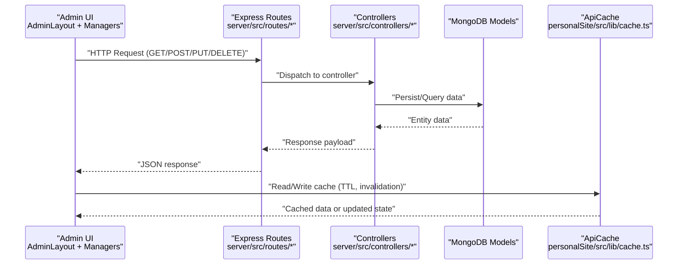

**Diagram sources**
- [server/src/index.ts](file://server/src/index.ts#L1-L158)
- [server/src/routes/interests.ts](file://server/src/routes/interests.ts#L1-L35)
- [server/src/controllers/authController.ts](file://server/src/controllers/authController.ts#L1-L142)
- [personalSite/src/lib/cache.ts](file://personalSite/src/lib/cache.ts#L1-L137)

## Detailed Component Analysis

### Backend Server Initialization and Middleware
- Security and CORS: Helmet is applied globally; CORS allows configurable origins based on environment variables and defaults. Credentials are supported.
- Rate Limiting: Requests are rate-limited to prevent abuse.
- Body Parsing: JSON and URL-encoded payloads are parsed with size limits.
- Routing: Multiple domain-specific routes are mounted under a base path.
- Health Checks: A health endpoint reports service status.
- Error Handling: Centralized error handler returns structured JSON with optional stack traces in development.

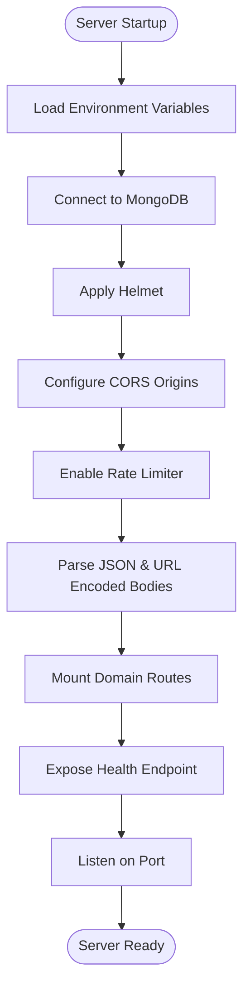

**Diagram sources**
- [server/src/index.ts](file://server/src/index.ts#L1-L158)

**Section sources**
- [server/src/index.ts](file://server/src/index.ts#L1-L158)

### Authentication Controller
- Validation: Uses express-validator to validate registration and login requests.
- User Creation: Checks for existing users by email or username, assigns roles based on environment configuration, and generates a JWT token.
- Login: Validates credentials, compares passwords, and issues a JWT token.
- Profile Retrieval: Returns user profile excluding sensitive fields.

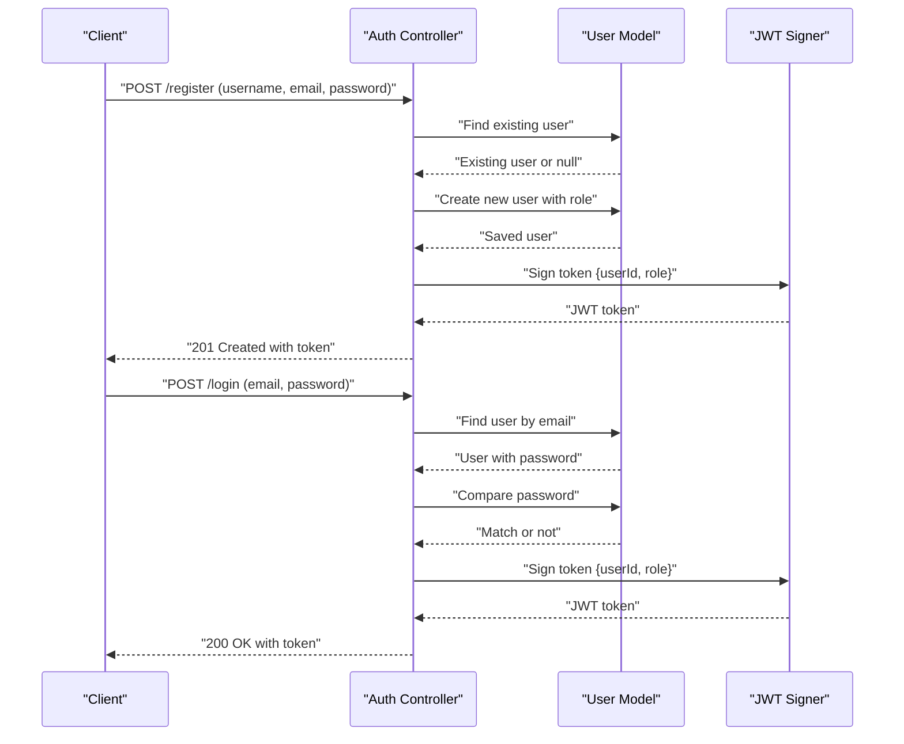

**Diagram sources**
- [server/src/controllers/authController.ts](file://server/src/controllers/authController.ts#L1-L142)

**Section sources**
- [server/src/controllers/authController.ts](file://server/src/controllers/authController.ts#L1-L142)

### Interests Resource Routes
- Public Access: Public listing endpoint is available without authentication.
- Admin Access: Admin-only endpoints require authentication and admin role.
- Operations: GET all, GET by ID, POST create, PUT update, DELETE delete.

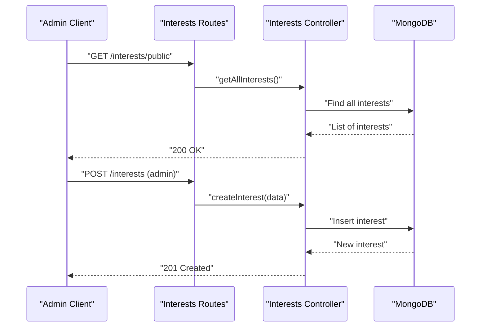

**Diagram sources**
- [server/src/routes/interests.ts](file://server/src/routes/interests.ts#L1-L35)

**Section sources**
- [server/src/routes/interests.ts](file://server/src/routes/interests.ts#L1-L35)

### Frontend Cache Utility (ApiCache)
- In-Memory Cache: Stores entries with timestamps and TTL.
- Operations: get, set, has, delete, clear, invalidate (pattern-based), stats.
- Cache Keys: Namespaced keys for articles, projects, settings, about, timeline, tech skills, interests, tech stack, dashboard, contact, and GitHub.

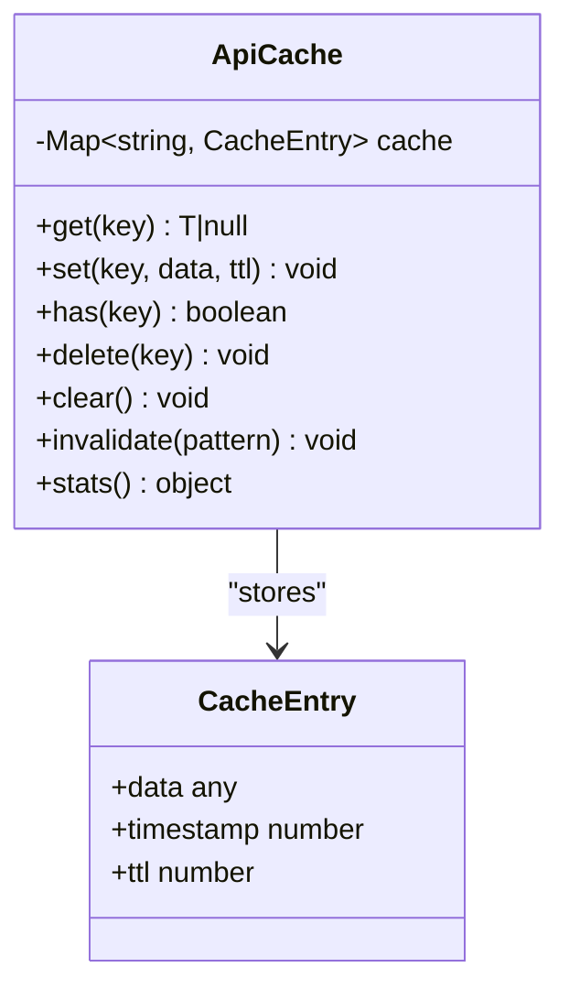

**Diagram sources**
- [personalSite/src/lib/cache.ts](file://personalSite/src/lib/cache.ts#L1-L137)

**Section sources**
- [personalSite/src/lib/cache.ts](file://personalSite/src/lib/cache.ts#L1-L137)

### About API Module
- Parallel Fetching: Retrieves timeline, tech stack categories, and interests concurrently.
- Caching: Uses cache keys for about page data with TTL.
- Prefetching: Background prefetch support for improved UX.
- Cache Invalidation: Clears about cache when needed.

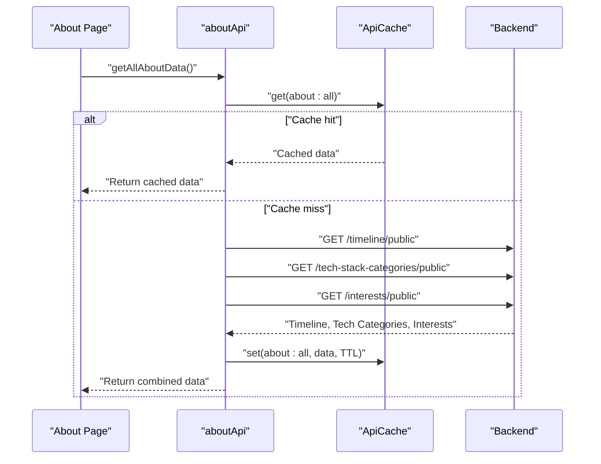

**Diagram sources**
- [personalSite/src/api/aboutApi.ts](file://personalSite/src/api/aboutApi.ts#L1-L86)
- [personalSite/src/lib/cache.ts](file://personalSite/src/lib/cache.ts#L1-L137)

**Section sources**
- [personalSite/src/api/aboutApi.ts](file://personalSite/src/api/aboutApi.ts#L1-L86)

### Article API Module
- Endpoints: Published articles, all articles (admin), by ID, create, create with image, update, update with image, delete.
- Caching: Uses cache keys for articles and invalidates caches after mutations.
- Authorization: Requires Bearer token for admin endpoints.

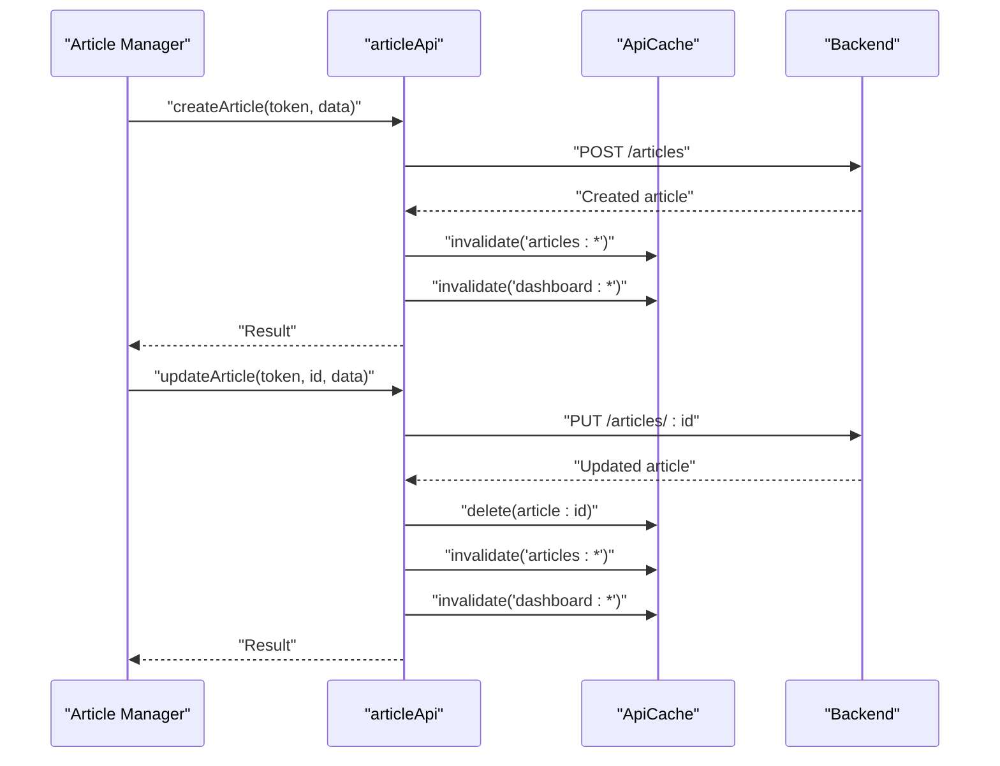

**Diagram sources**
- [personalSite/src/api/articleApi.ts](file://personalSite/src/api/articleApi.ts#L1-L224)
- [personalSite/src/lib/cache.ts](file://personalSite/src/lib/cache.ts#L1-L137)

**Section sources**
- [personalSite/src/api/articleApi.ts](file://personalSite/src/api/articleApi.ts#L1-L224)

### Admin Layout and Navigation
- Navigation Items: Includes links to admin pages such as Articles, Settings, Projects, Timeline, Tech Skills, Tech Stack, Interests, Messages, and Settings.
- Active Route Tracking: Computes active navigation item based on current location.

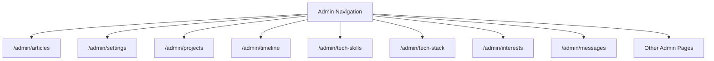

**Diagram sources**
- [personalSite/src/components/layout/AdminLayout.tsx](file://personalSite/src/components/layout/AdminLayout.tsx#L57-L106)

**Section sources**
- [personalSite/src/components/layout/AdminLayout.tsx](file://personalSite/src/components/layout/AdminLayout.tsx#L57-L106)

### Application Routes and Protected Admin Pages
- Lazy Loading: Admin pages are lazy-loaded for performance.
- Protected Routes: Admin pages are wrapped with protected route guards.
- Route Coverage: Includes routes for Articles, Settings, Projects, Timeline, Tech Skills, Tech Stack, Interests, and Messages.

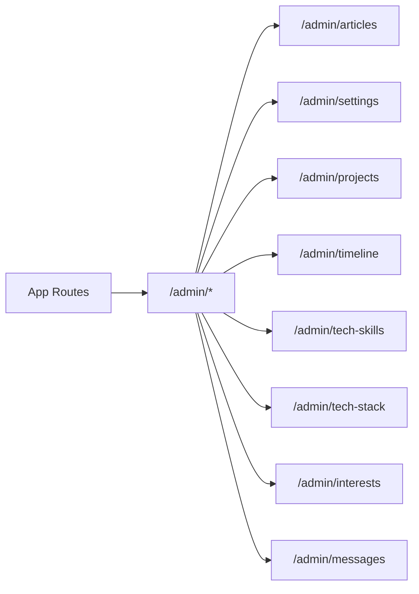

**Diagram sources**
- [personalSite/src/App.tsx](file://personalSite/src/App.tsx#L14-L358)

**Section sources**
- [personalSite/src/App.tsx](file://personalSite/src/App.tsx#L14-L358)

## Dependency Analysis
- Backend Dependencies: Express, helmet, cors, rate-limit, dotenv, MongoDB connection, express-validator for auth.
- Frontend Dependencies: React, React Router, TanStack Query (via QueryClient), and local cache utilities.
- Inter-Module Coupling:
  - Frontend API modules depend on the backend routes and share cache utilities.
  - Admin layout depends on route configuration and navigation items.
  - Cache invalidation patterns coordinate frontend state with backend mutations.

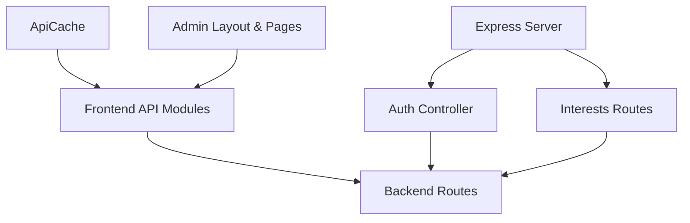

**Diagram sources**
- [server/src/index.ts](file://server/src/index.ts#L1-L158)
- [server/src/controllers/authController.ts](file://server/src/controllers/authController.ts#L1-L142)
- [server/src/routes/interests.ts](file://server/src/routes/interests.ts#L1-L35)
- [personalSite/src/lib/cache.ts](file://personalSite/src/lib/cache.ts#L1-L137)
- [personalSite/src/api/aboutApi.ts](file://personalSite/src/api/aboutApi.ts#L1-L86)
- [personalSite/src/api/articleApi.ts](file://personalSite/src/api/articleApi.ts#L1-L224)
- [personalSite/src/components/layout/AdminLayout.tsx](file://personalSite/src/components/layout/AdminLayout.tsx#L57-L106)
- [personalSite/src/App.tsx](file://personalSite/src/App.tsx#L14-L358)

**Section sources**
- [server/src/index.ts](file://server/src/index.ts#L1-L158)
- [personalSite/src/lib/cache.ts](file://personalSite/src/lib/cache.ts#L1-L137)

## Performance Considerations
- Frontend Caching:
  - TTL-based cache reduces redundant network requests.
  - Pattern-based invalidation ensures fresh data after mutations.
- Parallel Fetching:
  - About API performs parallel requests to minimize latency.
- Backend Scalability:
  - Rate limiting protects the server from overload.
  - CORS configuration supports controlled cross-origin access.
- Bundle and Render Optimization:
  - Lazy loading of admin pages improves initial load performance.

[No sources needed since this section provides general guidance]

## Troubleshooting Guide
- Authentication Failures:
  - Validate email and password formats and ensure user exists.
  - Check JWT secret and expiration settings.
- CORS Issues:
  - Verify allowed origins and credentials configuration.
- Cache Stale Data:
  - Use cache invalidation after mutations.
  - Clear cache manually if needed.
- Network Errors:
  - Inspect error responses and logs; ensure proper status codes and messages.
- Admin Route Access:
  - Confirm protected route guards and admin role checks.

**Section sources**
- [server/src/controllers/authController.ts](file://server/src/controllers/authController.ts#L1-L142)
- [server/src/index.ts](file://server/src/index.ts#L1-L158)
- [personalSite/src/lib/cache.ts](file://personalSite/src/lib/cache.ts#L1-L137)
- [personalSite/src/api/articleApi.ts](file://personalSite/src/api/articleApi.ts#L1-L224)

## Conclusion
The Agent Management system leverages a clear separation of concerns: backend endpoints manage agent-managed entities, frontend modules orchestrate agent execution and caching, and shared utilities enforce consistency and performance. By following the agent workflow recommendations and utilizing caching, authentication, and route protection, teams can reliably create, configure, and scale agent operations across the platform.

[No sources needed since this section summarizes without analyzing specific files]

## Appendices

### Agent Workflow Recommendations
- Follow repository conventions and run appropriate build/lint commands after changes.
- Prefer minimal, scoped changes and verify smallest scope first.
- Summarize behavior impact and adhere to code style and naming conventions.

**Section sources**
- [AGENTS.md](file://AGENTS.md#L149-L157)