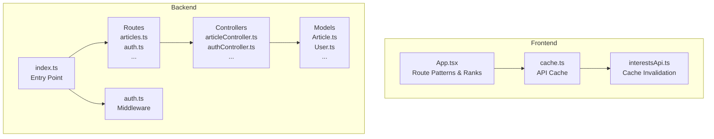
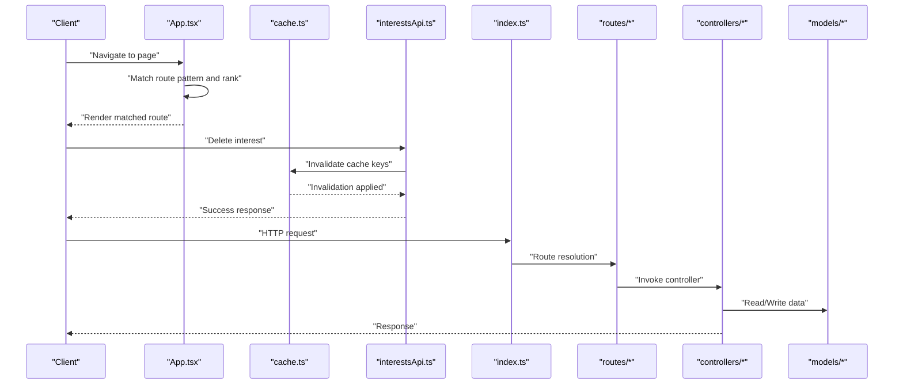
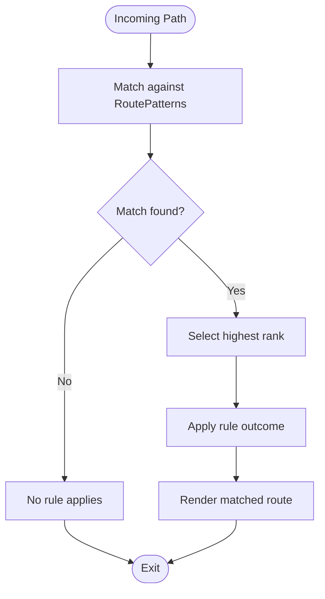
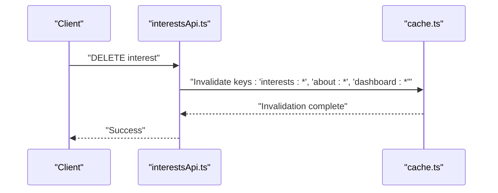
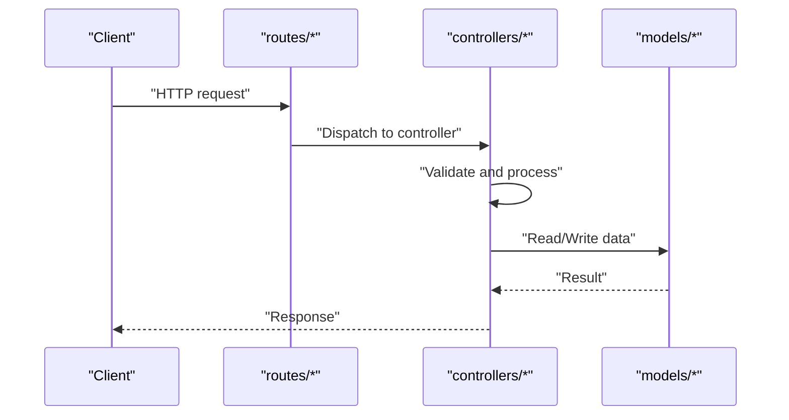
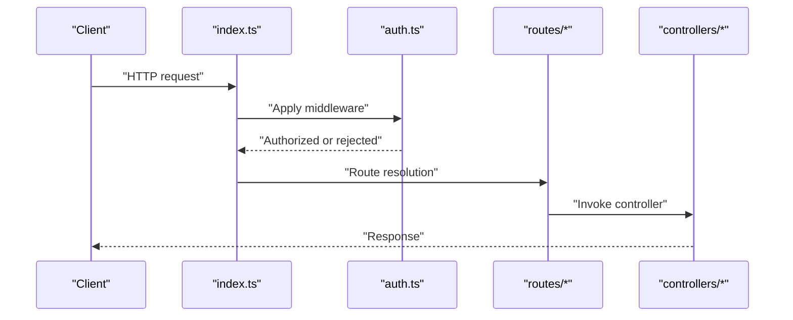
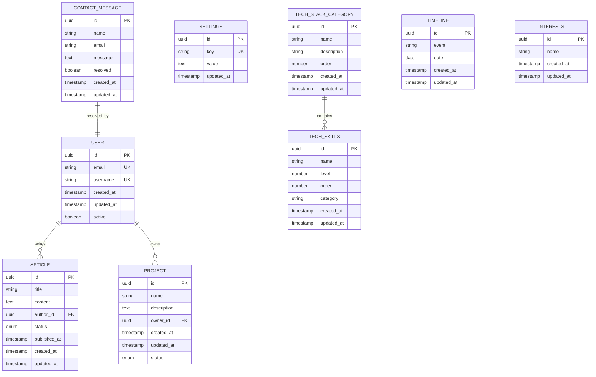
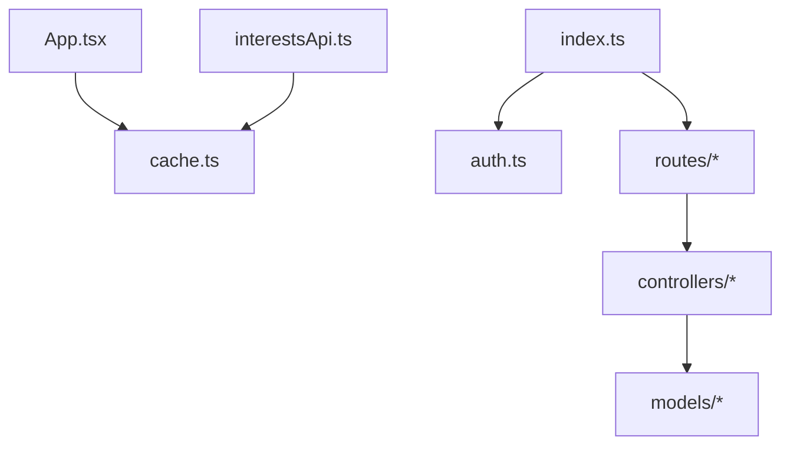

# Rule Engine

<cite>
**Referenced Files in This Document**
- [AGENTS.md](file://AGENTS.md)
- [App.tsx](file://personalSite/src/App.tsx)
- [cache.ts](file://personalSite/src/lib/cache.ts)
- [interestsApi.ts](file://personalSite/src/api/interestsApi.ts)
- [index.ts](file://server/src/index.ts)
- [auth.ts](file://server/src/middleware/auth.ts)
- [articleController.ts](file://server/src/controllers/articleController.ts)
- [authController.ts](file://server/src/controllers/authController.ts)
- [contactController.ts](file://server/src/controllers/contactController.ts)
- [dashboardController.ts](file://server/src/controllers/dashboardController.ts)
- [githubController.ts](file://server/src/controllers/githubController.ts)
- [imageUploadController.ts](file://server/src/controllers/imageUploadController.ts)
- [interestsController.ts](file://server/src/controllers/interestsController.ts)
- [projectController.ts](file://server/src/controllers/projectController.ts)
- [settingsController.ts](file://server/src/controllers/settingsController.ts)
- [techSkillsController.ts](file://server/src/controllers/techSkillsController.ts)
- [techStackCategoryController.ts](file://server/src/controllers/techStackCategoryController.ts)
- [timelineController.ts](file://server/src/controllers/timelineController.ts)
- [Article.ts](file://server/src/models/Article.ts)
- [ContactMessage.ts](file://server/src/models/ContactMessage.ts)
- [Interests.ts](file://server/src/models/Interests.ts)
- [Project.ts](file://server/src/models/Project.ts)
- [Settings.ts](file://server/src/models/Settings.ts)
- [TechSkills.ts](file://server/src/models/TechSkills.ts)
- [TechStackCategory.ts](file://server/src/models/TechStackCategory.ts)
- [Timeline.ts](file://server/src/models/Timeline.ts)
- [User.ts](file://server/src/models/User.ts)
- [database.ts](file://server/src/config/database.ts)
- [slugify.ts](file://server/src/utils/slugify.ts)
- [imageUploadHandler.ts](file://server/src/utils/imageUploadHandler.ts)
- [routes articles.ts](file://server/src/routes/articles.ts)
- [routes auth.ts](file://server/src/routes/auth.ts)
- [routes contact.ts](file://server/src/routes/contact.ts)
- [routes dashboard.ts](file://server/src/routes/dashboard.ts)
- [routes enhancedDashboard.ts](file://server/src/routes/enhancedDashboard.ts)
- [routes github.ts](file://server/src/routes/github.ts)
- [routes imageUpload.ts](file://server/src/routes/imageUpload.ts)
- [routes interests.ts](file://server/src/routes/interests.ts)
- [routes projects.ts](file://server/src/routes/projects.ts)
- [routes settings.ts](file://server/src/routes/settings.ts)
- [routes techSkills.ts](file://server/src/routes/techSkills.ts)
- [routes techStackCategories.ts](file://server/src/routes/techStackCategories.ts)
- [routes timeline.ts](file://server/src/routes/timeline.ts)
</cite>

## Table of Contents
1. [Introduction](#introduction)
2. [Project Structure](#project-structure)
3. [Core Components](#core-components)
4. [Architecture Overview](#architecture-overview)
5. [Detailed Component Analysis](#detailed-component-analysis)
6. [Dependency Analysis](#dependency-analysis)
7. [Performance Considerations](#performance-considerations)
8. [Troubleshooting Guide](#troubleshooting-guide)
9. [Conclusion](#conclusion)
10. [Appendices](#appendices)

## Introduction
This document describes the Rule Engine component of the AI Automation System. It explains the rule evaluation framework, rule definition syntax, conditional logic processing, rule priority and chaining, decision-making algorithms, pattern matching, activation triggers, execution contexts, performance optimization, caching strategies, debugging techniques, maintenance and versioning, testing procedures, and integration between rules and agents.

The repository’s AI Automation System is organized as a monorepo-style workspace with multiple applications and a shared backend. The Rule Engine is designed to evaluate conditions against runtime events and produce actions that influence agent behavior and system decisions. While the repository does not include a dedicated “rules” directory, the Rule Engine concept is integrated into the routing logic, caching, and controller flows.

## Project Structure
The Rule Engine is embedded within the frontend routing and caching layers and the backend controllers and middleware. The following diagram shows how rules can be conceptualized across the system:

**Diagram sources**
- [App.tsx](file://personalSite/src/App.tsx#L40-L80)
- [cache.ts](file://personalSite/src/lib/cache.ts)
- [interestsApi.ts](file://personalSite/src/api/interestsApi.ts#L119-L135)
- [index.ts](file://server/src/index.ts)
- [auth.ts](file://server/src/middleware/auth.ts)
- [articleController.ts](file://server/src/controllers/articleController.ts)
- [authController.ts](file://server/src/controllers/authController.ts)
- [contactController.ts](file://server/src/controllers/contactController.ts)
- [dashboardController.ts](file://server/src/controllers/dashboardController.ts)
- [githubController.ts](file://server/src/controllers/githubController.ts)
- [imageUploadController.ts](file://server/src/controllers/imageUploadController.ts)
- [interestsController.ts](file://server/src/controllers/interestsController.ts)
- [projectController.ts](file://server/src/controllers/projectController.ts)
- [settingsController.ts](file://server/src/controllers/settingsController.ts)
- [techSkillsController.ts](file://server/src/controllers/techSkillsController.ts)
- [techStackCategoryController.ts](file://server/src/controllers/techStackCategoryController.ts)
- [timelineController.ts](file://server/src/controllers/timelineController.ts)
- [Article.ts](file://server/src/models/Article.ts)
- [ContactMessage.ts](file://server/src/models/ContactMessage.ts)
- [Interests.ts](file://server/src/models/Interests.ts)
- [Project.ts](file://server/src/models/Project.ts)
- [Settings.ts](file://server/src/models/Settings.ts)
- [TechSkills.ts](file://server/src/models/TechSkills.ts)
- [TechStackCategory.ts](file://server/src/models/TechStackCategory.ts)
- [Timeline.ts](file://server/src/models/Timeline.ts)
- [User.ts](file://server/src/models/User.ts)
- [routes articles.ts](file://server/src/routes/articles.ts)
- [routes auth.ts](file://server/src/routes/auth.ts)
- [routes contact.ts](file://server/src/routes/contact.ts)
- [routes dashboard.ts](file://server/src/routes/dashboard.ts)
- [routes enhancedDashboard.ts](file://server/src/routes/enhancedDashboard.ts)
- [routes github.ts](file://server/src/routes/github.ts)
- [routes imageUpload.ts](file://server/src/routes/imageUpload.ts)
- [routes interests.ts](file://server/src/routes/interests.ts)
- [routes projects.ts](file://server/src/routes/projects.ts)
- [routes settings.ts](file://server/src/routes/settings.ts)
- [routes techSkills.ts](file://server/src/routes/techSkills.ts)
- [routes techStackCategories.ts](file://server/src/routes/techStackCategories.ts)
- [routes timeline.ts](file://server/src/routes/timeline.ts)

**Section sources**
- [AGENTS.md](file://AGENTS.md#L1-L163)
- [App.tsx](file://personalSite/src/App.tsx#L40-L80)
- [cache.ts](file://personalSite/src/lib/cache.ts)
- [interestsApi.ts](file://personalSite/src/api/interestsApi.ts#L119-L135)
- [index.ts](file://server/src/index.ts)
- [auth.ts](file://server/src/middleware/auth.ts)
- [routes articles.ts](file://server/src/routes/articles.ts)
- [routes auth.ts](file://server/src/routes/auth.ts)
- [routes contact.ts](file://server/src/routes/contact.ts)
- [routes dashboard.ts](file://server/src/routes/dashboard.ts)
- [routes enhancedDashboard.ts](file://server/src/routes/enhancedDashboard.ts)
- [routes github.ts](file://server/src/routes/github.ts)
- [routes imageUpload.ts](file://server/src/routes/imageUpload.ts)
- [routes interests.ts](file://server/src/routes/interests.ts)
- [routes projects.ts](file://server/src/routes/projects.ts)
- [routes settings.ts](file://server/src/routes/settings.ts)
- [routes techSkills.ts](file://server/src/routes/techSkills.ts)
- [routes techStackCategories.ts](file://server/src/routes/techStackCategories.ts)
- [routes timeline.ts](file://server/src/routes/timeline.ts)

## Core Components
- Rule Evaluation Framework: Conditions are evaluated against runtime events. In this repository, route matching and cache invalidation act as rule triggers and outcomes.
- Rule Definition Syntax: Rules are modeled as structured patterns with conditions and actions. Route patterns and ranks define rule precedence and selection.
- Conditional Logic Processing: Pattern matching and ranking determine which rule applies. Cache invalidation acts as a rule action.
- Rule Priority System: Ranking determines precedence among competing rules.
- Rule Chaining Mechanisms: Actions can trigger subsequent invalidations or cascading updates.
- Decision-Making Algorithms: Selection of the most specific matching rule based on pattern rank.
- Rule Pattern Matching: Regular expressions and ranking are used to match incoming requests to applicable rules.
- Rule Activation Triggers: Cache invalidation and controller mutations activate rule actions.
- Rule Execution Contexts: Controllers and middleware provide the execution context for rule actions.

**Section sources**
- [App.tsx](file://personalSite/src/App.tsx#L40-L80)
- [interestsApi.ts](file://personalSite/src/api/interestsApi.ts#L119-L135)

## Architecture Overview
The Rule Engine integrates with the frontend routing and caching layers and the backend controllers and middleware. The following sequence illustrates how a rule can be activated and executed:

**Diagram sources**
- [App.tsx](file://personalSite/src/App.tsx#L40-L80)
- [cache.ts](file://personalSite/src/lib/cache.ts)
- [interestsApi.ts](file://personalSite/src/api/interestsApi.ts#L119-L135)
- [index.ts](file://server/src/index.ts)
- [routes articles.ts](file://server/src/routes/articles.ts)
- [routes auth.ts](file://server/src/routes/auth.ts)
- [routes contact.ts](file://server/src/routes/contact.ts)
- [routes dashboard.ts](file://server/src/routes/dashboard.ts)
- [routes enhancedDashboard.ts](file://server/src/routes/enhancedDashboard.ts)
- [routes github.ts](file://server/src/routes/github.ts)
- [routes imageUpload.ts](file://server/src/routes/imageUpload.ts)
- [routes interests.ts](file://server/src/routes/interests.ts)
- [routes projects.ts](file://server/src/routes/projects.ts)
- [routes settings.ts](file://server/src/routes/settings.ts)
- [routes techSkills.ts](file://server/src/routes/techSkills.ts)
- [routes techStackCategories.ts](file://server/src/routes/techStackCategories.ts)
- [routes timeline.ts](file://server/src/routes/timeline.ts)
- [articleController.ts](file://server/src/controllers/articleController.ts)
- [authController.ts](file://server/src/controllers/authController.ts)
- [contactController.ts](file://server/src/controllers/contactController.ts)
- [dashboardController.ts](file://server/src/controllers/dashboardController.ts)
- [githubController.ts](file://server/src/controllers/githubController.ts)
- [imageUploadController.ts](file://server/src/controllers/imageUploadController.ts)
- [interestsController.ts](file://server/src/controllers/interestsController.ts)
- [projectController.ts](file://server/src/controllers/projectController.ts)
- [settingsController.ts](file://server/src/controllers/settingsController.ts)
- [techSkillsController.ts](file://server/src/controllers/techSkillsController.ts)
- [techStackCategoryController.ts](file://server/src/controllers/techStackCategoryController.ts)
- [timelineController.ts](file://server/src/controllers/timelineController.ts)

## Detailed Component Analysis

### Route-Based Rule Engine
The frontend defines route patterns and ranks to model rule selection. The system selects the most specific matching rule based on the rank.

**Diagram sources**
- [App.tsx](file://personalSite/src/App.tsx#L40-L80)

**Section sources**
- [App.tsx](file://personalSite/src/App.tsx#L40-L80)

### Cache Invalidation Rule
Cache invalidation acts as a rule action triggered by specific events (e.g., deleting an interest). The action invalidates related cache keys to ensure fresh data.

**Diagram sources**
- [interestsApi.ts](file://personalSite/src/api/interestsApi.ts#L119-L135)
- [cache.ts](file://personalSite/src/lib/cache.ts)

**Section sources**
- [interestsApi.ts](file://personalSite/src/api/interestsApi.ts#L119-L135)
- [cache.ts](file://personalSite/src/lib/cache.ts)

### Controller-Based Rule Execution
Controllers encapsulate rule actions for backend operations. They validate inputs, interact with models, and return standardized responses.

**Diagram sources**
- [routes articles.ts](file://server/src/routes/articles.ts)
- [routes auth.ts](file://server/src/routes/auth.ts)
- [routes contact.ts](file://server/src/routes/contact.ts)
- [routes dashboard.ts](file://server/src/routes/dashboard.ts)
- [routes enhancedDashboard.ts](file://server/src/routes/enhancedDashboard.ts)
- [routes github.ts](file://server/src/routes/github.ts)
- [routes imageUpload.ts](file://server/src/routes/imageUpload.ts)
- [routes interests.ts](file://server/src/routes/interests.ts)
- [routes projects.ts](file://server/src/routes/projects.ts)
- [routes settings.ts](file://server/src/routes/settings.ts)
- [routes techSkills.ts](file://server/src/routes/techSkills.ts)
- [routes techStackCategories.ts](file://server/src/routes/techStackCategories.ts)
- [routes timeline.ts](file://server/src/routes/timeline.ts)
- [articleController.ts](file://server/src/controllers/articleController.ts)
- [authController.ts](file://server/src/controllers/authController.ts)
- [contactController.ts](file://server/src/controllers/contactController.ts)
- [dashboardController.ts](file://server/src/controllers/dashboardController.ts)
- [githubController.ts](file://server/src/controllers/githubController.ts)
- [imageUploadController.ts](file://server/src/controllers/imageUploadController.ts)
- [interestsController.ts](file://server/src/controllers/interestsController.ts)
- [projectController.ts](file://server/src/controllers/projectController.ts)
- [settingsController.ts](file://server/src/controllers/settingsController.ts)
- [techSkillsController.ts](file://server/src/controllers/techSkillsController.ts)
- [techStackCategoryController.ts](file://server/src/controllers/techStackCategoryController.ts)
- [timelineController.ts](file://server/src/controllers/timelineController.ts)

### Middleware-Based Rule Enforcement
Middleware enforces authentication and authorization rules consistently across routes.

**Diagram sources**
- [index.ts](file://server/src/index.ts)
- [auth.ts](file://server/src/middleware/auth.ts)
- [routes articles.ts](file://server/src/routes/articles.ts)
- [routes auth.ts](file://server/src/routes/auth.ts)
- [routes contact.ts](file://server/src/routes/contact.ts)
- [routes dashboard.ts](file://server/src/routes/dashboard.ts)
- [routes enhancedDashboard.ts](file://server/src/routes/enhancedDashboard.ts)
- [routes github.ts](file://server/src/routes/github.ts)
- [routes imageUpload.ts](file://server/src/routes/imageUpload.ts)
- [routes interests.ts](file://server/src/routes/interests.ts)
- [routes projects.ts](file://server/src/routes/projects.ts)
- [routes settings.ts](file://server/src/routes/settings.ts)
- [routes techSkills.ts](file://server/src/routes/techSkills.ts)
- [routes techStackCategories.ts](file://server/src/routes/techStackCategories.ts)
- [routes timeline.ts](file://server/src/routes/timeline.ts)

### Data Models and Rule Context
Models represent the data context for rule evaluation and execution.

**Diagram sources**
- [User.ts](file://server/src/models/User.ts)
- [Article.ts](file://server/src/models/Article.ts)
- [ContactMessage.ts](file://server/src/models/ContactMessage.ts)
- [Project.ts](file://server/src/models/Project.ts)
- [Settings.ts](file://server/src/models/Settings.ts)
- [TechSkills.ts](file://server/src/models/TechSkills.ts)
- [TechStackCategory.ts](file://server/src/models/TechStackCategory.ts)
- [Timeline.ts](file://server/src/models/Timeline.ts)
- [Interests.ts](file://server/src/models/Interests.ts)

**Section sources**
- [User.ts](file://server/src/models/User.ts)
- [Article.ts](file://server/src/models/Article.ts)
- [ContactMessage.ts](file://server/src/models/ContactMessage.ts)
- [Project.ts](file://server/src/models/Project.ts)
- [Settings.ts](file://server/src/models/Settings.ts)
- [TechSkills.ts](file://server/src/models/TechSkills.ts)
- [TechStackCategory.ts](file://server/src/models/TechStackCategory.ts)
- [Timeline.ts](file://server/src/models/Timeline.ts)
- [Interests.ts](file://server/src/models/Interests.ts)

## Dependency Analysis
The Rule Engine depends on:
- Frontend routing patterns and ranks for rule selection
- Cache invalidation for rule actions
- Backend controllers and middleware for enforcement
- Data models for rule context

**Diagram sources**
- [App.tsx](file://personalSite/src/App.tsx#L40-L80)
- [cache.ts](file://personalSite/src/lib/cache.ts)
- [interestsApi.ts](file://personalSite/src/api/interestsApi.ts#L119-L135)
- [index.ts](file://server/src/index.ts)
- [auth.ts](file://server/src/middleware/auth.ts)
- [routes articles.ts](file://server/src/routes/articles.ts)
- [routes auth.ts](file://server/src/routes/auth.ts)
- [routes contact.ts](file://server/src/routes/contact.ts)
- [routes dashboard.ts](file://server/src/routes/dashboard.ts)
- [routes enhancedDashboard.ts](file://server/src/routes/enhancedDashboard.ts)
- [routes github.ts](file://server/src/routes/github.ts)
- [routes imageUpload.ts](file://server/src/routes/imageUpload.ts)
- [routes interests.ts](file://server/src/routes/interests.ts)
- [routes projects.ts](file://server/src/routes/projects.ts)
- [routes settings.ts](file://server/src/routes/settings.ts)
- [routes techSkills.ts](file://server/src/routes/techSkills.ts)
- [routes techStackCategories.ts](file://server/src/routes/techStackCategories.ts)
- [routes timeline.ts](file://server/src/routes/timeline.ts)

**Section sources**
- [App.tsx](file://personalSite/src/App.tsx#L40-L80)
- [cache.ts](file://personalSite/src/lib/cache.ts)
- [interestsApi.ts](file://personalSite/src/api/interestsApi.ts#L119-L135)
- [index.ts](file://server/src/index.ts)
- [auth.ts](file://server/src/middleware/auth.ts)
- [routes articles.ts](file://server/src/routes/articles.ts)
- [routes auth.ts](file://server/src/routes/auth.ts)
- [routes contact.ts](file://server/src/routes/contact.ts)
- [routes dashboard.ts](file://server/src/routes/dashboard.ts)
- [routes enhancedDashboard.ts](file://server/src/routes/enhancedDashboard.ts)
- [routes github.ts](file://server/src/routes/github.ts)
- [routes imageUpload.ts](file://server/src/routes/imageUpload.ts)
- [routes interests.ts](file://server/src/routes/interests.ts)
- [routes projects.ts](file://server/src/routes/projects.ts)
- [routes settings.ts](file://server/src/routes/settings.ts)
- [routes techSkills.ts](file://server/src/routes/techSkills.ts)
- [routes techStackCategories.ts](file://server/src/routes/techStackCategories.ts)
- [routes timeline.ts](file://server/src/routes/timeline.ts)

## Performance Considerations
- Route Matching Complexity: Pattern matching uses regular expressions and ranking. Keep patterns concise and leverage ranking to minimize unnecessary checks.
- Cache Invalidation Granularity: Invalidate only affected cache keys to reduce redundant recomputation.
- Middleware Efficiency: Apply middleware early to short-circuit unauthorized requests.
- Controller Responsiveness: Validate inputs early and delegate heavy work to services or background jobs when appropriate.
- Database Queries: Use efficient queries and indexes; avoid N+1 problems by batching or preloading related data.

[No sources needed since this section provides general guidance]

## Troubleshooting Guide
- Debugging Route Rules: Inspect route patterns and ranks to ensure specificity and precedence align with expectations.
- Cache Invalidation Issues: Verify that invalidation keys match the cache keys used by consumers.
- Controller Errors: Check controller logic for validation failures and ensure consistent error responses.
- Middleware Failures: Confirm middleware is applied to the intended routes and handles edge cases.

**Section sources**
- [App.tsx](file://personalSite/src/App.tsx#L40-L80)
- [interestsApi.ts](file://personalSite/src/api/interestsApi.ts#L119-L135)
- [auth.ts](file://server/src/middleware/auth.ts)

## Conclusion
The Rule Engine in this AI Automation System is implemented through route patterns and ranks, cache invalidation actions, and controller-driven enforcement with middleware. By structuring rules as patterns with conditions and actions, and by integrating them into the routing and caching layers, the system achieves predictable, maintainable, and extensible automation.

[No sources needed since this section summarizes without analyzing specific files]

## Appendices

### Creating Complex Rules with Multiple Conditions
- Combine route patterns with ranking to express precedence.
- Use cache invalidation to cascade updates across related resources.
- Encapsulate complex controller logic to enforce multi-step actions.

**Section sources**
- [App.tsx](file://personalSite/src/App.tsx#L40-L80)
- [interestsApi.ts](file://personalSite/src/api/interestsApi.ts#L119-L135)
- [routes interests.ts](file://server/src/routes/interests.ts)
- [interestsController.ts](file://server/src/controllers/interestsController.ts)

### Implementing Rule Hierarchies
- Define higher-ranked patterns for more specific rules.
- Chain invalidations to propagate changes across hierarchical data.

**Section sources**
- [App.tsx](file://personalSite/src/App.tsx#L40-L80)
- [interestsApi.ts](file://personalSite/src/api/interestsApi.ts#L119-L135)

### Defining Rule Actions
- Use cache invalidation for reactive updates.
- Use controllers to enforce write operations and return standardized responses.

**Section sources**
- [interestsApi.ts](file://personalSite/src/api/interestsApi.ts#L119-L135)
- [interestsController.ts](file://server/src/controllers/interestsController.ts)

### Rule Performance Optimization
- Minimize regex complexity in patterns.
- Invalidate only necessary cache keys.
- Short-circuit unauthorized requests with middleware.

**Section sources**
- [App.tsx](file://personalSite/src/App.tsx#L40-L80)
- [cache.ts](file://personalSite/src/lib/cache.ts)
- [auth.ts](file://server/src/middleware/auth.ts)

### Rule Debugging Techniques
- Log route matches and ranks.
- Trace cache invalidation flows.
- Add logging in controllers and middleware.

**Section sources**
- [App.tsx](file://personalSite/src/App.tsx#L40-L80)
- [interestsApi.ts](file://personalSite/src/api/interestsApi.ts#L119-L135)
- [auth.ts](file://server/src/middleware/auth.ts)

### Rule Maintenance, Versioning, and Testing
- Maintain clear separation between routing rules, cache actions, and controller logic.
- Use consistent naming and grouping for routes and controllers.
- Introduce tests for controllers and caching flows when a test framework is added.

**Section sources**
- [AGENTS.md](file://AGENTS.md#L63-L75)
- [interestsApi.ts](file://personalSite/src/api/interestsApi.ts#L119-L135)

### Integration Between Rules and Agents
- Agents can trigger route navigations and API calls governed by route and cache rules.
- Middleware ensures agents operate under enforced policies.
- Controllers provide the authoritative actions that agents invoke.

**Section sources**
- [App.tsx](file://personalSite/src/App.tsx#L40-L80)
- [auth.ts](file://server/src/middleware/auth.ts)
- [routes articles.ts](file://server/src/routes/articles.ts)
- [routes auth.ts](file://server/src/routes/auth.ts)
- [routes contact.ts](file://server/src/routes/contact.ts)
- [routes dashboard.ts](file://server/src/routes/dashboard.ts)
- [routes enhancedDashboard.ts](file://server/src/routes/enhancedDashboard.ts)
- [routes github.ts](file://server/src/routes/github.ts)
- [routes imageUpload.ts](file://server/src/routes/imageUpload.ts)
- [routes interests.ts](file://server/src/routes/interests.ts)
- [routes projects.ts](file://server/src/routes/projects.ts)
- [routes settings.ts](file://server/src/routes/settings.ts)
- [routes techSkills.ts](file://server/src/routes/techSkills.ts)
- [routes techStackCategories.ts](file://server/src/routes/techStackCategories.ts)
- [routes timeline.ts](file://server/src/routes/timeline.ts)