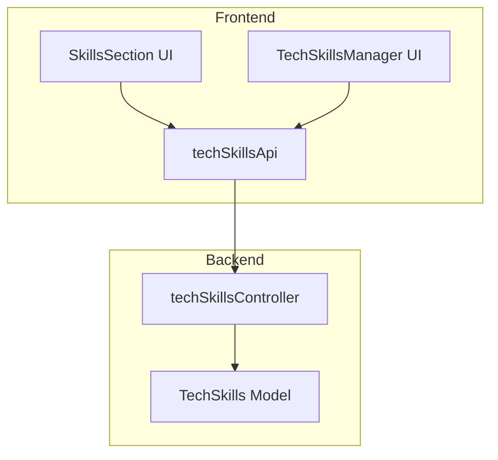
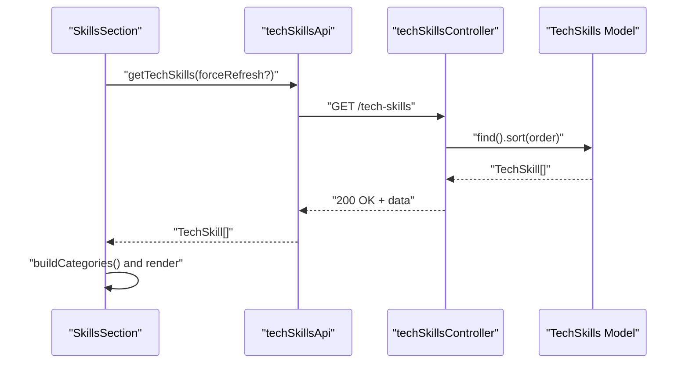
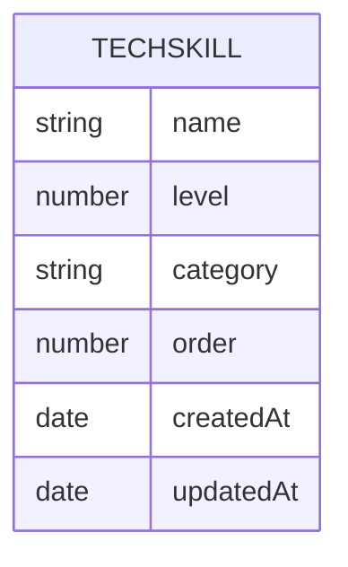
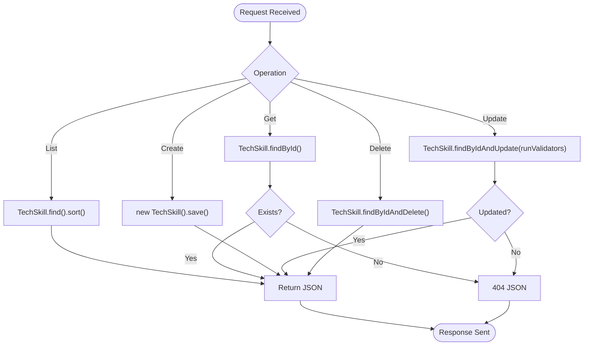
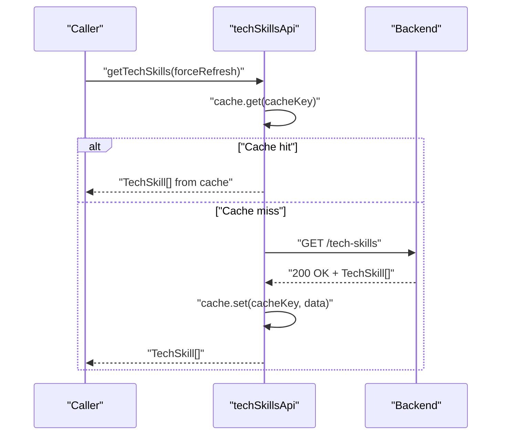
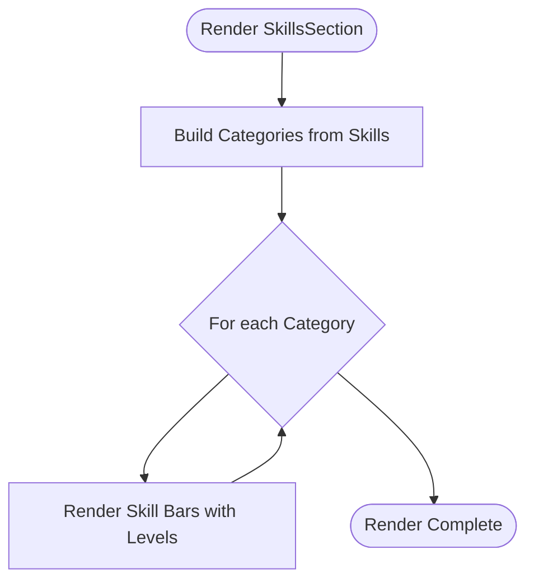
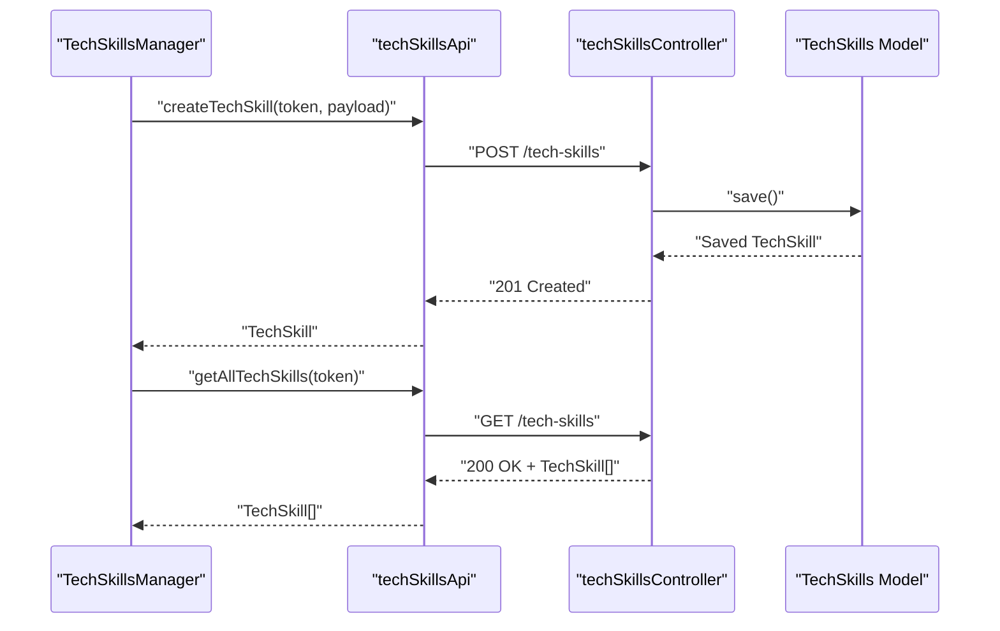
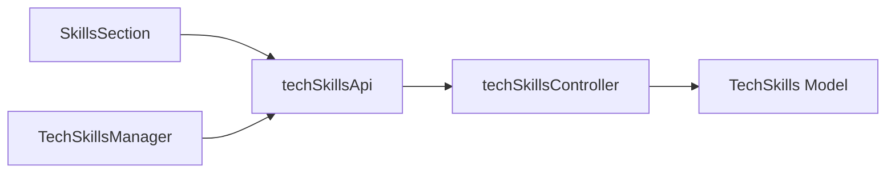

# Skill System

<cite>
**Referenced Files in This Document**
- [skills-section.tsx](file://portfolio/src/components/sections/skills-section.tsx)
- [TechSkills.ts](file://server/src/models/TechSkills.ts)
- [techSkillsController.ts](file://server/src/controllers/techSkillsController.ts)
- [techSkillsApi.ts](file://personalSite/src/api/techSkillsApi.ts)
- [TechSkillsManager.tsx](file://personalSite/src/pages/Admin/TechSkillsManager.tsx)
- [aboutApi.ts](file://personalSite/src/api/aboutApi.ts)
</cite>

## Table of Contents
1. [Introduction](#introduction)
2. [Project Structure](#project-structure)
3. [Core Components](#core-components)
4. [Architecture Overview](#architecture-overview)
5. [Detailed Component Analysis](#detailed-component-analysis)
6. [Dependency Analysis](#dependency-analysis)
7. [Performance Considerations](#performance-considerations)
8. [Troubleshooting Guide](#troubleshooting-guide)
9. [Conclusion](#conclusion)
10. [Appendices](#appendices)

## Introduction
This document describes the Skill System that powers skill representation, rendering, and management within the portfolio and personal sites. The system revolves around a data model for technical skills, a backend controller for CRUD operations, a frontend API client for data access, and UI components for displaying and editing skills. While the repository does not define a generic “Skill” abstraction or a centralized skill registry, the existing implementation demonstrates a clear pattern for modeling, validating, persisting, and consuming skills.

## Project Structure
The Skill System spans three layers:
- Data Model: Defines the schema and constraints for skills.
- Backend API: Exposes endpoints to manage skills.
- Frontend UI/API: Fetches, renders, and edits skills.

**Diagram sources**
- [skills-section.tsx](file://portfolio/src/components/sections/skills-section.tsx#L97-L141)
- [techSkillsApi.ts](file://personalSite/src/api/techSkillsApi.ts#L18-L91)
- [TechSkillsManager.tsx](file://personalSite/src/pages/Admin/TechSkillsManager.tsx#L200-L227)
- [techSkillsController.ts](file://server/src/controllers/techSkillsController.ts#L1-L86)
- [TechSkills.ts](file://server/src/models/TechSkills.ts#L1-L41)

**Section sources**
- [skills-section.tsx](file://portfolio/src/components/sections/skills-section.tsx#L97-L141)
- [techSkillsApi.ts](file://personalSite/src/api/techSkillsApi.ts#L18-L91)
- [TechSkillsManager.tsx](file://personalSite/src/pages/Admin/TechSkillsManager.tsx#L200-L227)
- [techSkillsController.ts](file://server/src/controllers/techSkillsController.ts#L1-L86)
- [TechSkills.ts](file://server/src/models/TechSkills.ts#L1-L41)

## Core Components
- Data Model: The skill entity includes name, proficiency level, optional category, ordering, and timestamps. Constraints enforce non-empty names, integer levels in [0..100], and optional category length limits.
- Backend Controller: Provides endpoints to list, retrieve, create, update, and delete skills with proper error handling and validation feedback.
- Frontend API Client: Wraps HTTP requests to the backend, supports caching, and exposes typed methods for fetching and mutating skills.
- UI Components:
  - SkillsSection: Renders a categorized, paginated display of skills with progress bars.
  - TechSkillsManager: Admin UI for adding, editing, and reordering skills.

**Section sources**
- [TechSkills.ts](file://server/src/models/TechSkills.ts#L3-L10)
- [TechSkills.ts](file://server/src/models/TechSkills.ts#L12-L36)
- [techSkillsController.ts](file://server/src/controllers/techSkillsController.ts#L4-L12)
- [techSkillsController.ts](file://server/src/controllers/techSkillsController.ts#L30-L47)
- [techSkillsController.ts](file://server/src/controllers/techSkillsController.ts#L49-L69)
- [techSkillsController.ts](file://server/src/controllers/techSkillsController.ts#L71-L86)
- [techSkillsApi.ts](file://personalSite/src/api/techSkillsApi.ts#L18-L91)
- [skills-section.tsx](file://portfolio/src/components/sections/skills-section.tsx#L62-L82)
- [skills-section.tsx](file://portfolio/src/components/sections/skills-section.tsx#L97-L141)
- [TechSkillsManager.tsx](file://personalSite/src/pages/Admin/TechSkillsManager.tsx#L200-L227)

## Architecture Overview
The system follows a layered architecture:
- Presentation Layer: UI components render skills and collect user input.
- Application Layer: API client encapsulates network logic and caching.
- Domain Layer: Controller orchestrates business logic and interacts with the data model.
- Data Layer: Mongoose model defines schema, indexes, and validation.

**Diagram sources**
- [skills-section.tsx](file://portfolio/src/components/sections/skills-section.tsx#L97-L141)
- [techSkillsApi.ts](file://personalSite/src/api/techSkillsApi.ts#L18-L36)
- [techSkillsController.ts](file://server/src/controllers/techSkillsController.ts#L4-L12)
- [TechSkills.ts](file://server/src/models/TechSkills.ts#L38-L41)

## Detailed Component Analysis

### Data Model: TechSkills
- Fields and constraints:
  - name: required, trimmed, max length 100
  - level: required, integer in [0..100]
  - category: optional, trimmed, max length 50
  - order: number, default 0
  - timestamps: createdAt, updatedAt
- Indexing: sort index on order for efficient retrieval.

**Diagram sources**
- [TechSkills.ts](file://server/src/models/TechSkills.ts#L3-L10)
- [TechSkills.ts](file://server/src/models/TechSkills.ts#L12-L36)
- [TechSkills.ts](file://server/src/models/TechSkills.ts#L38-L41)

**Section sources**
- [TechSkills.ts](file://server/src/models/TechSkills.ts#L3-L10)
- [TechSkills.ts](file://server/src/models/TechSkills.ts#L12-L36)
- [TechSkills.ts](file://server/src/models/TechSkills.ts#L38-L41)

### Backend Controller: TechSkills Management
- Endpoints:
  - GET /tech-skills: list all skills sorted by order and creation date.
  - GET /tech-skills/:id: retrieve a specific skill.
  - POST /tech-skills: create a new skill.
  - PUT /tech-skills/:id: update an existing skill.
  - DELETE /tech-skills/:id: remove a skill.
- Validation:
  - Updates run validators to ensure incoming data conforms to schema.
  - Not-found responses for missing resources.
- Error handling:
  - Centralized logging and standardized 500 responses on failures.

**Diagram sources**
- [techSkillsController.ts](file://server/src/controllers/techSkillsController.ts#L4-L12)
- [techSkillsController.ts](file://server/src/controllers/techSkillsController.ts#L14-L28)
- [techSkillsController.ts](file://server/src/controllers/techSkillsController.ts#L30-L47)
- [techSkillsController.ts](file://server/src/controllers/techSkillsController.ts#L49-L69)
- [techSkillsController.ts](file://server/src/controllers/techSkillsController.ts#L71-L86)

**Section sources**
- [techSkillsController.ts](file://server/src/controllers/techSkillsController.ts#L4-L12)
- [techSkillsController.ts](file://server/src/controllers/techSkillsController.ts#L14-L28)
- [techSkillsController.ts](file://server/src/controllers/techSkillsController.ts#L30-L47)
- [techSkillsController.ts](file://server/src/controllers/techSkillsController.ts#L49-L69)
- [techSkillsController.ts](file://server/src/controllers/techSkillsController.ts#L71-L86)

### Frontend API Client: techSkillsApi
- Responsibilities:
  - Encapsulate HTTP calls to backend endpoints.
  - Manage cache keys and invalidate cache on mutations.
  - Provide typed methods for fetching and mutating skills.
- Methods:
  - getTechSkills(forceRefresh?): returns TechSkill[]
  - getAllTechSkills(token, forceRefresh?): returns TechSkill[]
  - createTechSkill(token, payload): returns TechSkill
  - updateTechSkill(token, id, payload): returns TechSkill
  - deleteTechSkill(token, id): returns success message

**Diagram sources**
- [techSkillsApi.ts](file://personalSite/src/api/techSkillsApi.ts#L18-L36)
- [techSkillsApi.ts](file://personalSite/src/api/techSkillsApi.ts#L41-L66)
- [techSkillsApi.ts](file://personalSite/src/api/techSkillsApi.ts#L67-L91)

**Section sources**
- [techSkillsApi.ts](file://personalSite/src/api/techSkillsApi.ts#L18-L36)
- [techSkillsApi.ts](file://personalSite/src/api/techSkillsApi.ts#L41-L66)
- [techSkillsApi.ts](file://personalSite/src/api/techSkillsApi.ts#L67-L91)

### UI Component: SkillsSection
- Purpose: Render a categorized, paginated list of skills with a terminal-style header and progress bars.
- Behavior:
  - Builds categories from skill items.
  - Rounds and clamps levels to [0..100].
  - Displays a loading indicator and fallback messaging.

**Diagram sources**
- [skills-section.tsx](file://portfolio/src/components/sections/skills-section.tsx#L62-L82)
- [skills-section.tsx](file://portfolio/src/components/sections/skills-section.tsx#L97-L141)

**Section sources**
- [skills-section.tsx](file://portfolio/src/components/sections/skills-section.tsx#L62-L82)
- [skills-section.tsx](file://portfolio/src/components/sections/skills-section.tsx#L84-L95)
- [skills-section.tsx](file://portfolio/src/components/sections/skills-section.tsx#L97-L141)

### Admin UI: TechSkillsManager
- Purpose: Provide an administrative interface to manage skills.
- Features:
  - Name input with placeholder guidance.
  - Slider for proficiency level (0–100).
  - Order input for sorting.
  - Form submission triggers create/update actions via the API client.

**Diagram sources**
- [TechSkillsManager.tsx](file://personalSite/src/pages/Admin/TechSkillsManager.tsx#L200-L227)
- [techSkillsApi.ts](file://personalSite/src/api/techSkillsApi.ts#L67-L91)
- [techSkillsController.ts](file://server/src/controllers/techSkillsController.ts#L30-L47)
- [TechSkills.ts](file://server/src/models/TechSkills.ts#L38-L41)

**Section sources**
- [TechSkillsManager.tsx](file://personalSite/src/pages/Admin/TechSkillsManager.tsx#L200-L227)
- [techSkillsApi.ts](file://personalSite/src/api/techSkillsApi.ts#L67-L91)
- [techSkillsController.ts](file://server/src/controllers/techSkillsController.ts#L30-L47)

### Related Data Access: About Section Fallback
- The About section demonstrates a fallback mechanism where, if cached data is unavailable, it fetches tech stack categories and skills from public endpoints and maps them into a skills array for display.

**Section sources**
- [aboutApi.ts](file://personalSite/src/api/aboutApi.ts#L57-L86)

## Dependency Analysis
- UI depends on the API client for data.
- API client depends on backend endpoints.
- Backend controller depends on the Mongoose model.
- Model depends on Mongoose schema and indexes.

**Diagram sources**
- [skills-section.tsx](file://portfolio/src/components/sections/skills-section.tsx#L97-L141)
- [TechSkillsManager.tsx](file://personalSite/src/pages/Admin/TechSkillsManager.tsx#L200-L227)
- [techSkillsApi.ts](file://personalSite/src/api/techSkillsApi.ts#L18-L91)
- [techSkillsController.ts](file://server/src/controllers/techSkillsController.ts#L1-L86)
- [TechSkills.ts](file://server/src/models/TechSkills.ts#L1-L41)

**Section sources**
- [skills-section.tsx](file://portfolio/src/components/sections/skills-section.tsx#L97-L141)
- [TechSkillsManager.tsx](file://personalSite/src/pages/Admin/TechSkillsManager.tsx#L200-L227)
- [techSkillsApi.ts](file://personalSite/src/api/techSkillsApi.ts#L18-L91)
- [techSkillsController.ts](file://server/src/controllers/techSkillsController.ts#L1-L86)
- [TechSkills.ts](file://server/src/models/TechSkills.ts#L1-L41)

## Performance Considerations
- Sorting and indexing:
  - The model defines an index on order to optimize list retrieval.
- Caching:
  - The API client caches responses keyed by cache keys and invalidates on create/update/delete to prevent stale data.
- Rendering:
  - UI rounds and clamps levels to avoid overflow and ensure consistent bar widths.

Recommendations:
- Add pagination for large datasets.
- Consider server-side filtering by category.
- Implement debounced search in admin UI for large lists.

**Section sources**
- [TechSkills.ts](file://server/src/models/TechSkills.ts#L38-L41)
- [techSkillsApi.ts](file://personalSite/src/api/techSkillsApi.ts#L18-L36)
- [techSkillsApi.ts](file://personalSite/src/api/techSkillsApi.ts#L84-L85)
- [skills-section.tsx](file://portfolio/src/components/sections/skills-section.tsx#L66-L69)

## Troubleshooting Guide
Common issues and resolutions:
- 404 Not Found when fetching a specific skill:
  - Verify the ID exists in the database.
  - Check route parameters and controller logic.
- Validation errors on update/create:
  - Ensure name is present and within length limits.
  - Ensure level is a number in [0..100].
  - Ensure category, if provided, is within length limits.
- Cache inconsistencies:
  - Invalidate cache after mutations.
  - Use force refresh flag when necessary.
- UI rendering anomalies:
  - Confirm levels are clamped to [0..100].
  - Ensure categories are normalized before grouping.

**Section sources**
- [techSkillsController.ts](file://server/src/controllers/techSkillsController.ts#L14-L28)
- [techSkillsController.ts](file://server/src/controllers/techSkillsController.ts#L49-L69)
- [TechSkills.ts](file://server/src/models/TechSkills.ts#L12-L36)
- [techSkillsApi.ts](file://personalSite/src/api/techSkillsApi.ts#L84-L85)
- [skills-section.tsx](file://portfolio/src/components/sections/skills-section.tsx#L66-L69)

## Conclusion
The Skill System is a focused, well-structured implementation centered on a single entity (TechSkill) with clear separation of concerns across UI, API, and backend layers. It provides robust CRUD operations, validation, and caching, and offers a straightforward UI for viewing and managing skills. Extending this system to support a broader “Skill” framework would involve introducing a generic skill abstraction, a registry, and orchestration logic, while preserving the current validation, caching, and UI patterns.

## Appendices

### Skill Definition Patterns
- Entity shape: name, level, category, order, timestamps.
- Validation rules: required fields, numeric bounds, length limits.
- Indexing: sort by order for efficient retrieval.

**Section sources**
- [TechSkills.ts](file://server/src/models/TechSkills.ts#L3-L10)
- [TechSkills.ts](file://server/src/models/TechSkills.ts#L12-L36)
- [TechSkills.ts](file://server/src/models/TechSkills.ts#L38-L41)

### Execution Framework
- UI fetches data via API client.
- API client handles caching and error propagation.
- Backend controller enforces validation and returns structured responses.

**Section sources**
- [skills-section.tsx](file://portfolio/src/components/sections/skills-section.tsx#L97-L141)
- [techSkillsApi.ts](file://personalSite/src/api/techSkillsApi.ts#L18-L91)
- [techSkillsController.ts](file://server/src/controllers/techSkillsController.ts#L1-L86)

### Parameterization and Validation
- Parameters: name, level, category, order.
- Validation: enforced by schema and controller updates.

**Section sources**
- [TechSkills.ts](file://server/src/models/TechSkills.ts#L12-L36)
- [techSkillsController.ts](file://server/src/controllers/techSkillsController.ts#L49-L69)

### Result Handling
- Responses: JSON arrays for lists, individual documents for single items.
- Errors: standardized 500 messages with console logs.

**Section sources**
- [techSkillsController.ts](file://server/src/controllers/techSkillsController.ts#L4-L12)
- [techSkillsController.ts](file://server/src/controllers/techSkillsController.ts#L14-L28)
- [techSkillsController.ts](file://server/src/controllers/techSkillsController.ts#L30-L47)
- [techSkillsController.ts](file://server/src/controllers/techSkillsController.ts#L49-L69)
- [techSkillsController.ts](file://server/src/controllers/techSkillsController.ts#L71-L86)

### Examples: Implementing Custom Skills
- Content Generation:
  - Define a new skill entity (e.g., ContentSkill) with fields like title, content, tags, and metadata.
  - Add endpoints to list, create, update, and delete content skills.
  - Integrate with UI to render and edit content skills similarly to TechSkills.
- Data Processing:
  - Add a processor endpoint that accepts parameters (e.g., filters, transformations) and returns processed results.
  - Cache results keyed by input parameters to improve performance.
- System Integration:
  - Expose an integration skill with fields for service URL, credentials, and operation type.
  - Implement validation for URLs and credential formats.
  - Provide admin UI controls for configuring integrations.

[No sources needed since this section provides general guidance]

### Performance Optimization
- Database:
  - Use indexes on frequently queried fields (e.g., order, category).
- Network:
  - Leverage caching and cache invalidation on mutations.
- UI:
  - Debounce inputs in admin forms.
  - Virtualize long lists if needed.

**Section sources**
- [TechSkills.ts](file://server/src/models/TechSkills.ts#L38-L41)
- [techSkillsApi.ts](file://personalSite/src/api/techSkillsApi.ts#L18-L36)
- [techSkillsApi.ts](file://personalSite/src/api/techSkillsApi.ts#L84-L85)

### Error Handling Within Skills
- Centralize error logging and return consistent error payloads.
- Distinguish between validation errors and internal server errors.

**Section sources**
- [techSkillsController.ts](file://server/src/controllers/techSkillsController.ts#L8-L11)
- [techSkillsController.ts](file://server/src/controllers/techSkillsController.ts#L24-L27)
- [techSkillsController.ts](file://server/src/controllers/techSkillsController.ts#L43-L46)
- [techSkillsController.ts](file://server/src/controllers/techSkillsController.ts#L65-L68)
- [techSkillsController.ts](file://server/src/controllers/techSkillsController.ts#L82-L85)

### Testing Methodologies
- Unit tests for controller logic (validations, error paths).
- Integration tests for API endpoints and database interactions.
- UI tests for rendering and admin workflows.

[No sources needed since this section provides general guidance]

### Debugging and Profiling
- Enable logging in controllers and API client.
- Use browser devtools to inspect network requests and cache behavior.
- Profile UI rendering performance for large skill sets.

**Section sources**
- [techSkillsController.ts](file://server/src/controllers/techSkillsController.ts#L9-L10)
- [techSkillsController.ts](file://server/src/controllers/techSkillsController.ts#L25-L26)
- [techSkillsController.ts](file://server/src/controllers/techSkillsController.ts#L44-L45)
- [techSkillsController.ts](file://server/src/controllers/techSkillsController.ts#L66-L67)
- [techSkillsController.ts](file://server/src/controllers/techSkillsController.ts#L83-L84)

### Maintenance Procedures
- Keep schema constraints aligned with controller validations.
- Update cache keys and invalidation logic when changing endpoints.
- Review and refine UI categorization and normalization logic.

**Section sources**
- [TechSkills.ts](file://server/src/models/TechSkills.ts#L12-L36)
- [techSkillsApi.ts](file://personalSite/src/api/techSkillsApi.ts#L84-L85)
- [skills-section.tsx](file://portfolio/src/components/sections/skills-section.tsx#L62-L82)