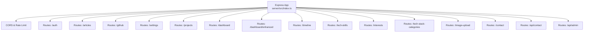
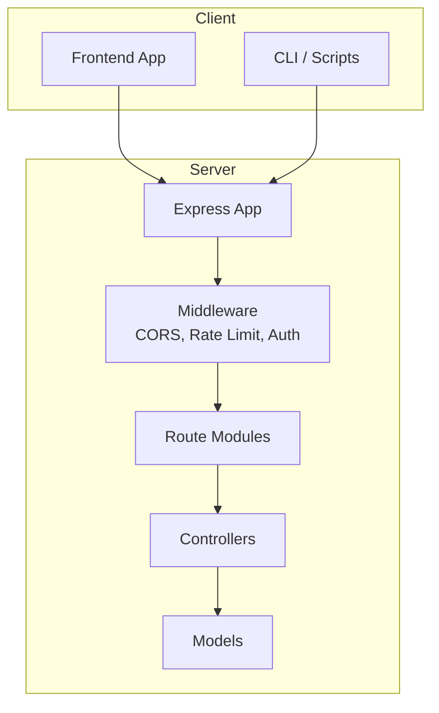
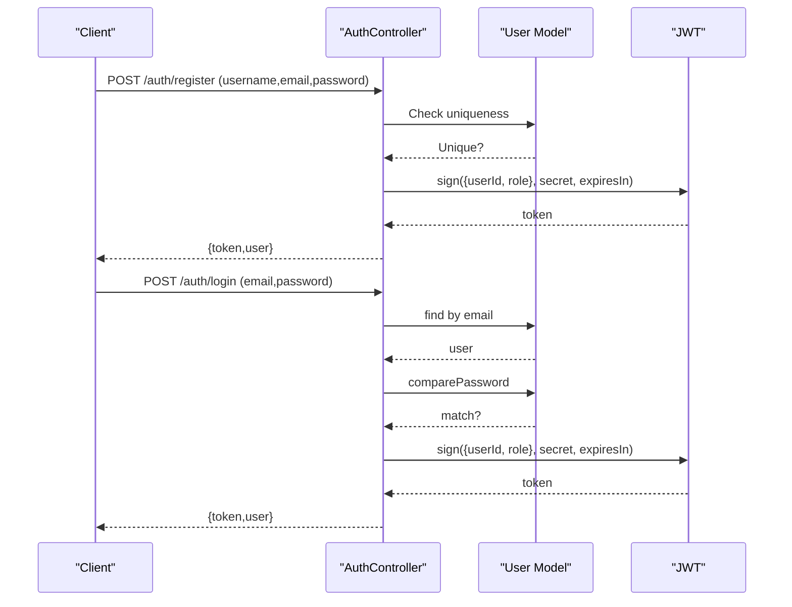
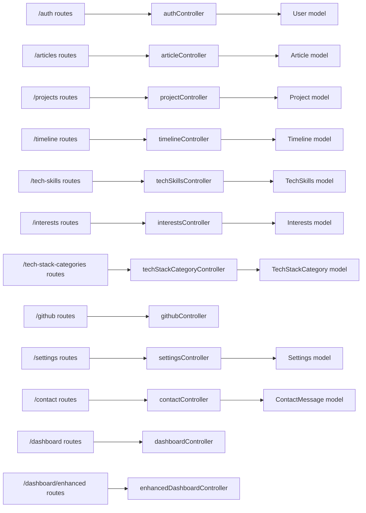

# API Reference

<cite>
**Referenced Files in This Document**
- [index.ts](file://server/src/index.ts)
- [auth.ts](file://server/src/routes/auth.ts)
- [authController.ts](file://server/src/controllers/authController.ts)
- [auth.ts](file://server/src/middleware/auth.ts)
- [User.ts](file://server/src/models/User.ts)
- [articles.ts](file://server/src/routes/articles.ts)
- [projects.ts](file://server/src/routes/projects.ts)
- [github.ts](file://server/src/routes/github.ts)
- [settings.ts](file://server/src/routes/settings.ts)
- [timeline.ts](file://server/src/routes/timeline.ts)
- [techSkills.ts](file://server/src/routes/techSkills.ts)
- [interests.ts](file://server/src/routes/interests.ts)
- [techStackCategories.ts](file://server/src/routes/techStackCategories.ts)
- [contact.ts](file://server/src/routes/contact.ts)
- [dashboard.ts](file://server/src/routes/dashboard.ts)
- [enhancedDashboard.ts](file://server/src/routes/enhancedDashboard.ts)
- [adminMessages.ts](file://server/src/routes/adminMessages.ts)
</cite>

## Table of Contents
1. [Introduction](#introduction)
2. [Project Structure](#project-structure)
3. [Core Components](#core-components)
4. [Architecture Overview](#architecture-overview)
5. [Detailed Component Analysis](#detailed-component-analysis)
6. [Dependency Analysis](#dependency-analysis)
7. [Performance Considerations](#performance-considerations)
8. [Troubleshooting Guide](#troubleshooting-guide)
9. [Conclusion](#conclusion)
10. [Appendices](#appendices)

## Introduction
This API Reference documents all RESTful endpoints for the Personal Portfolio Platform backend. It covers authentication, content management (articles, projects, timeline, settings), integrations (GitHub), administrative dashboards, and contact messaging. It also explains authentication via JWT, error handling, rate limiting, and provides practical usage examples with curl and JavaScript fetch.

## Project Structure
The backend is an Express server that mounts modular route groups under base paths. Middleware applies global security and rate limiting, while environment variables configure CORS and secrets.

**Diagram sources**
- [index.ts](file://server/src/index.ts#L1-L158)

**Section sources**
- [index.ts](file://server/src/index.ts#L1-L158)

## Core Components
- Authentication: JWT-based with bearer tokens. Admin-only endpoints require both a valid token and admin role.
- Content Management: CRUD endpoints for articles, projects, timeline items, tech skills, interests, and tech stack categories. Some endpoints support image uploads.
- Integrations: GitHub repository listing and repository details retrieval.
- Administration: Dashboard stats/analytics, seeding defaults, and contact message management.
- Contact: Public submission with rate limiting; admin endpoints to list messages and update status.

**Section sources**
- [auth.ts](file://server/src/routes/auth.ts#L1-L11)
- [authController.ts](file://server/src/controllers/authController.ts#L1-L142)
- [auth.ts](file://server/src/middleware/auth.ts#L1-L37)
- [User.ts](file://server/src/models/User.ts#L1-L58)
- [articles.ts](file://server/src/routes/articles.ts#L1-L54)
- [projects.ts](file://server/src/routes/projects.ts#L1-L71)
- [github.ts](file://server/src/routes/github.ts#L1-L9)
- [settings.ts](file://server/src/routes/settings.ts#L1-L16)
- [timeline.ts](file://server/src/routes/timeline.ts#L1-L35)
- [techSkills.ts](file://server/src/routes/techSkills.ts#L1-L35)
- [interests.ts](file://server/src/routes/interests.ts#L1-L35)
- [techStackCategories.ts](file://server/src/routes/techStackCategories.ts#L1-L35)
- [contact.ts](file://server/src/routes/contact.ts#L1-L28)
- [dashboard.ts](file://server/src/routes/dashboard.ts#L1-L21)
- [enhancedDashboard.ts](file://server/src/routes/enhancedDashboard.ts#L1-L12)
- [adminMessages.ts](file://server/src/routes/adminMessages.ts#L1-L24)

## Architecture Overview
High-level API architecture and authentication flow.

**Diagram sources**
- [index.ts](file://server/src/index.ts#L1-L158)
- [auth.ts](file://server/src/middleware/auth.ts#L1-L37)
- [authController.ts](file://server/src/controllers/authController.ts#L1-L142)
- [User.ts](file://server/src/models/User.ts#L1-L58)

## Detailed Component Analysis

### Authentication API
- Base Path: /auth
- JWT Secret: Loaded from environment variable
- Roles: admin and user
- Public endpoints: none
- Protected endpoints: profile requires a valid token; admin endpoints additionally require admin role

Endpoints
- POST /auth/register
  - Description: Registers a new user. Role is auto-assigned based on email matching admin email.
  - Request JSON: { username, email, password }
  - Response JSON: { message, token, user: { id, username, email, role } }
  - Validation: Username length and allowed characters; valid email; password minimum length.
  - Errors: 400 validation errors, 400 user exists, 500 server error.
  - Example curl: [curl register](file://server/src/controllers/authController.ts#L22-L78)
  - Example fetch: [fetch register](file://server/src/controllers/authController.ts#L22-L78)

- POST /auth/login
  - Description: Logs in an existing user and returns a JWT.
  - Request JSON: { email, password }
  - Response JSON: { message, token, user: { id, username, email, role } }
  - Errors: 400 validation errors, 401 invalid credentials, 500 server error.
  - Example curl: [curl login](file://server/src/controllers/authController.ts#L91-L132)
  - Example fetch: [fetch login](file://server/src/controllers/authController.ts#L91-L132)

- GET /auth/profile
  - Description: Returns current user profile.
  - Headers: Authorization: Bearer <token>
  - Response JSON: { username, email, role, createdAt, updatedAt }
  - Errors: 401 missing/expired token, 403 forbidden, 500 server error.
  - Example curl: [curl profile](file://server/src/controllers/authController.ts#L135-L142)
  - Example fetch: [fetch profile](file://server/src/controllers/authController.ts#L135-L142)

Authentication Flow (JWT)

**Diagram sources**
- [authController.ts](file://server/src/controllers/authController.ts#L1-L142)
- [User.ts](file://server/src/models/User.ts#L1-L58)

**Section sources**
- [auth.ts](file://server/src/routes/auth.ts#L1-L11)
- [authController.ts](file://server/src/controllers/authController.ts#L1-L142)
- [auth.ts](file://server/src/middleware/auth.ts#L1-L37)
- [User.ts](file://server/src/models/User.ts#L1-L58)

### Articles API
- Base Path: /articles
- Authentication: Public read endpoints; admin write endpoints require token and admin role
- Image Upload: Optional multipart/form-data with featuredImage (2 MB limit, images only)

Endpoints
- GET /articles
  - Description: List published articles (public).
  - Response: Array of published articles.

- GET /articles/all
  - Description: List all articles (published and drafts) for admins.
  - Headers: Authorization: Bearer <token>; Admin required.

- GET /articles/:id
  - Description: Get a single article by ID (public).

- POST /articles/
  - Description: Create a new article (admin).
  - Headers: Authorization: Bearer <token>; Admin required.

- PUT /articles/:id
  - Description: Update an article (admin).
  - Headers: Authorization: Bearer <token>; Admin required.

- DELETE /articles/:id
  - Description: Delete an article (admin).
  - Headers: Authorization: Bearer <token>; Admin required.

- POST /articles/upload
  - Description: Create article with featured image (admin).
  - Form Fields: featuredImage (image/*)
  - Headers: Authorization: Bearer <token>; Admin required.

- PUT /articles/upload/:id
  - Description: Update article with featured image (admin).
  - Form Fields: featuredImage (image/*)
  - Headers: Authorization: Bearer <token>; Admin required.

Example curl (create article):
- [curl create article](file://server/src/routes/articles.ts#L46-L48)

Example fetch (upload image):
- [fetch upload image](file://server/src/routes/articles.ts#L51-L52)

**Section sources**
- [articles.ts](file://server/src/routes/articles.ts#L1-L54)

### Projects API
- Base Path: /projects
- Authentication: Public read endpoints; admin write endpoints require token and admin role
- Image Upload: Optional multipart/form-data with thumbnail and screenshots (2 MB limit, images only)

Endpoints
- GET /projects
  - Description: List published projects (public).
  - Response: Array of published projects.

- GET /projects/all
  - Description: List all projects (admin).
  - Headers: Authorization: Bearer <token>; Admin required.

- GET /projects/slug/:slug
  - Description: Get a published project by slug (public).
  - Response: Project object.

- GET /projects/:id
  - Description: Get a project by ID (public).
  - Response: Project object.

- POST /projects/
  - Description: Create a project (admin).
  - Headers: Authorization: Bearer <token>; Admin required.

- PUT /projects/:id
  - Description: Update a project (admin).
  - Headers: Authorization: Bearer <token>; Admin required.

- DELETE /projects/:id
  - Description: Delete a project (admin).
  - Headers: Authorization: Bearer <token>; Admin required.

- POST /projects/upload
  - Description: Create project with thumbnail and screenshots (admin).
  - Form Fields: thumbnail (image/*), screenshots (multiple images/*)
  - Headers: Authorization: Bearer <token>; Admin required.

- PUT /projects/upload/:id
  - Description: Update project with thumbnail and screenshots (admin).
  - Form Fields: thumbnail (image/*), screenshots (multiple images/*)
  - Headers: Authorization: Bearer <token>; Admin required.

- POST /projects/migrate-slugs
  - Description: Backfill slugs for existing projects (admin).
  - Headers: Authorization: Bearer <token>; Admin required.

Example curl (get published projects):
- [curl get projects](file://server/src/routes/projects.ts#L37-L49)

Example fetch (upload multiple images):
- [fetch upload fields](file://server/src/routes/projects.ts#L59-L68)

**Section sources**
- [projects.ts](file://server/src/routes/projects.ts#L1-L71)

### Timeline API
- Base Path: /timeline
- Authentication: Public endpoint for listing timeline items; admin endpoints require token and admin role

Endpoints
- GET /timeline/public
  - Description: List timeline items (public).

- GET /timeline
  - Description: List all timeline items (admin).
  - Headers: Authorization: Bearer <token>; Admin required.

- GET /timeline/:id
  - Description: Get a timeline item by ID (public).

- POST /timeline/
  - Description: Create a timeline item (admin).
  - Headers: Authorization: Bearer <token>; Admin required.

- PUT /timeline/:id
  - Description: Update a timeline item (admin).
  - Headers: Authorization: Bearer <token>; Admin required.

- DELETE /timeline/:id
  - Description: Delete a timeline item (admin).
  - Headers: Authorization: Bearer <token>; Admin required.

Example curl (create timeline item):
- [curl create timeline](file://server/src/routes/timeline.ts#L27-L33)

**Section sources**
- [timeline.ts](file://server/src/routes/timeline.ts#L1-L35)

### Tech Skills API
- Base Path: /tech-skills
- Authentication: Public endpoint for listing skills; admin endpoints require token and admin role

Endpoints
- GET /tech-skills/public
  - Description: List tech skills (public).

- GET /tech-skills
  - Description: List all tech skills (admin).
  - Headers: Authorization: Bearer <token>; Admin required.

- GET /tech-skills/:id
  - Description: Get a tech skill by ID (public).

- POST /tech-skills/
  - Description: Create a tech skill (admin).
  - Headers: Authorization: Bearer <token>; Admin required.

- PUT /tech-skills/:id
  - Description: Update a tech skill (admin).
  - Headers: Authorization: Bearer <token>; Admin required.

- DELETE /tech-skills/:id
  - Description: Delete a tech skill (admin).
  - Headers: Authorization: Bearer <token>; Admin required.

Example curl (delete skill):
- [curl delete skill](file://server/src/routes/techSkills.ts#L33)

**Section sources**
- [techSkills.ts](file://server/src/routes/techSkills.ts#L1-L35)

### Interests API
- Base Path: /interests
- Authentication: Public endpoint for listing interests; admin endpoints require token and admin role

Endpoints
- GET /interests/public
  - Description: List interests (public).

- GET /interests
  - Description: List all interests (admin).
  - Headers: Authorization: Bearer <token>; Admin required.

- GET /interests/:id
  - Description: Get an interest by ID (public).

- POST /interests/
  - Description: Create an interest (admin).
  - Headers: Authorization: Bearer <token>; Admin required.

- PUT /interests/:id
  - Description: Update an interest (admin).
  - Headers: Authorization: Bearer <token>; Admin required.

- DELETE /interests/:id
  - Description: Delete an interest (admin).
  - Headers: Authorization: Bearer <token>; Admin required.

Example curl (update interest):
- [curl update interest](file://server/src/routes/interests.ts#L30-L33)

**Section sources**
- [interests.ts](file://server/src/routes/interests.ts#L1-L35)

### Tech Stack Categories API
- Base Path: /tech-stack-categories
- Authentication: Public endpoint for listing categories; admin endpoints require token and admin role

Endpoints
- GET /tech-stack-categories/public
  - Description: List categories (public).

- GET /tech-stack-categories
  - Description: List all categories (admin).
  - Headers: Authorization: Bearer <token>; Admin required.

- GET /tech-stack-categories/:id
  - Description: Get a category by ID (public).

- POST /tech-stack-categories/
  - Description: Create a category (admin).
  - Headers: Authorization: Bearer <token>; Admin required.

- PUT /tech-stack-categories/:id
  - Description: Update a category (admin).
  - Headers: Authorization: Bearer <token>; Admin required.

- DELETE /tech-stack-categories/:id
  - Description: Delete a category (admin).
  - Headers: Authorization: Bearer <token>; Admin required.

Example curl (list categories):
- [curl list categories](file://server/src/routes/techStackCategories.ts#L21)

**Section sources**
- [techStackCategories.ts](file://server/src/routes/techStackCategories.ts#L1-L35)

### Settings API
- Base Path: /settings
- Authentication: Public endpoint to read settings; admin endpoint to update settings

Endpoints
- GET /settings
  - Description: Get site settings (public).

- PUT /settings
  - Description: Update site settings (admin).
  - Headers: Authorization: Bearer <token>; Admin required.

Example curl (update settings):
- [curl update settings](file://server/src/routes/settings.ts#L14)

**Section sources**
- [settings.ts](file://server/src/routes/settings.ts#L1-L16)

### GitHub Integration API
- Base Path: /github
- Authentication: No authentication required

Endpoints
- GET /github/repos
  - Description: List repositories (public).

- GET /github/repo/:owner/:repo
  - Description: Get repository details (public).

Example curl (get repos):
- [curl get repos](file://server/src/routes/github.ts#L6)

**Section sources**
- [github.ts](file://server/src/routes/github.ts#L1-L9)

### Contact API
- Base Path: /contact
- Authentication: Public endpoint to submit messages; admin endpoints require token and admin role
- Rate Limiting: Different policies per endpoint group

Endpoints
- POST /contact
  - Description: Submit a contact message.
  - Rate Limit: 5 requests per 10 minutes per IP.
  - Response JSON: { ok: true }

- GET /contact/messages
  - Description: List all messages (admin).
  - Headers: Authorization: Bearer <token>; Admin required.

- PATCH /contact/messages/:id/status
  - Description: Update message status (admin).
  - Headers: Authorization: Bearer <token>; Admin required.

- POST /api/admin/messages/:id/reply
  - Description: Reply to a message (admin).
  - Rate Limit: 20 replies per hour per admin.
  - Headers: Authorization: Bearer <token>; Admin required.

Example curl (submit message):
- [curl submit message](file://server/src/routes/contact.ts#L22)

**Section sources**
- [contact.ts](file://server/src/routes/contact.ts#L1-L28)
- [adminMessages.ts](file://server/src/routes/adminMessages.ts#L1-L24)

### Dashboard API
- Base Path: /dashboard
- Authentication: All endpoints require admin token

Endpoints
- GET /dashboard/stats
  - Description: Get dashboard statistics (admin).

- GET /dashboard/analytics
  - Description: Get detailed analytics (admin).

- POST /dashboard/seed
  - Description: Seed database with default values (admin).

Example curl (get stats):
- [curl get stats](file://server/src/routes/dashboard.ts#L13)

**Section sources**
- [dashboard.ts](file://server/src/routes/dashboard.ts#L1-L21)

### Enhanced Dashboard API
- Base Path: /dashboard/enhanced
- Authentication: Some endpoints require token; others are public

Endpoints
- GET /dashboard/enhanced/dashboard
  - Description: Get enhanced dashboard data (admin).
  - Headers: Authorization: Bearer <token>

- GET /dashboard/enhanced/timeline
  - Description: Get timeline items (public).

- GET /dashboard/enhanced/interests
  - Description: Get interests (public).

- GET /dashboard/enhanced/tech-skills
  - Description: Get tech skills (public).

Example curl (enhanced dashboard):
- [curl enhanced dashboard](file://server/src/routes/enhancedDashboard.ts#L7)

**Section sources**
- [enhancedDashboard.ts](file://server/src/routes/enhancedDashboard.ts#L1-L12)

## Dependency Analysis
Key internal dependencies and relationships.

**Diagram sources**
- [auth.ts](file://server/src/routes/auth.ts#L1-L11)
- [articles.ts](file://server/src/routes/articles.ts#L1-L54)
- [projects.ts](file://server/src/routes/projects.ts#L1-L71)
- [timeline.ts](file://server/src/routes/timeline.ts#L1-L35)
- [techSkills.ts](file://server/src/routes/techSkills.ts#L1-L35)
- [interests.ts](file://server/src/routes/interests.ts#L1-L35)
- [techStackCategories.ts](file://server/src/routes/techStackCategories.ts#L1-L35)
- [github.ts](file://server/src/routes/github.ts#L1-L9)
- [settings.ts](file://server/src/routes/settings.ts#L1-L16)
- [contact.ts](file://server/src/routes/contact.ts#L1-L28)
- [dashboard.ts](file://server/src/routes/dashboard.ts#L1-L21)
- [enhancedDashboard.ts](file://server/src/routes/enhancedDashboard.ts#L1-L12)

**Section sources**
- [index.ts](file://server/src/index.ts#L1-L158)

## Performance Considerations
- Body Size Limits: JSON and URL-encoded bodies are limited to approximately 10 MB.
- Image Upload Limits: Featured images and project media are limited to 2 MB each; only image/* content is accepted.
- Rate Limiting:
  - Global: 100 requests per 15 minutes per IP.
  - Contact submissions: 5 per 10 minutes per IP.
  - Admin replies: 20 per hour per admin.
- CORS: Origins are dynamically determined from environment variables; ensure frontend URLs are included to avoid blocking.

[No sources needed since this section provides general guidance]

## Troubleshooting Guide
Common errors and resolutions:
- 400 Bad Request: Validation failures during registration or login; check request payload structure and constraints.
- 401 Unauthorized: Missing or invalid Authorization header; ensure Bearer token is present and valid.
- 403 Forbidden: Admin-only endpoint accessed without admin role or invalid/expired token.
- 429 Too Many Requests: Exceeded rate limits; wait for the cooldown period.
- 500 Internal Server Error: Unexpected server errors; check server logs for stack traces.

**Section sources**
- [authController.ts](file://server/src/controllers/authController.ts#L22-L78)
- [authController.ts](file://server/src/controllers/authController.ts#L91-L132)
- [auth.ts](file://server/src/middleware/auth.ts#L9-L30)
- [index.ts](file://server/src/index.ts#L88-L93)
- [contact.ts](file://server/src/routes/contact.ts#L12-L20)
- [adminMessages.ts](file://server/src/routes/adminMessages.ts#L8-L16)

## Conclusion
This API provides a comprehensive set of endpoints for managing a personal portfolio, integrating GitHub data, and supporting administrative workflows. Authentication is enforced via JWT with role-based access controls, and robust rate limiting protects server resources. Use the provided examples as templates for client integration.

[No sources needed since this section summarizes without analyzing specific files]

## Appendices

### Authentication Requirements
- Header: Authorization: Bearer <token>
- Token lifetime: 7 days
- Secret: JWT_SECRET environment variable

**Section sources**
- [authController.ts](file://server/src/controllers/authController.ts#L59-L63)
- [auth.ts](file://server/src/middleware/auth.ts#L18)

### Rate Limiting Policies
- Global: 100 requests per 15 minutes per IP
- Contact submit: 5 per 10 minutes per IP
- Admin reply: 20 per hour per admin

**Section sources**
- [index.ts](file://server/src/index.ts#L88-L93)
- [contact.ts](file://server/src/routes/contact.ts#L12-L20)
- [adminMessages.ts](file://server/src/routes/adminMessages.ts#L8-L16)

### Practical Usage Examples

curl Examples
- Register: [curl register](file://server/src/controllers/authController.ts#L22-L78)
- Login: [curl login](file://server/src/controllers/authController.ts#L91-L132)
- Get Profile: [curl profile](file://server/src/controllers/authController.ts#L135-L142)
- Create Article: [curl create article](file://server/src/routes/articles.ts#L46-L48)
- Upload Article Image: [curl upload image](file://server/src/routes/articles.ts#L51-L52)
- Create Project: [curl create project](file://server/src/routes/projects.ts#L53-L55)
- Upload Project Images: [curl upload fields](file://server/src/routes/projects.ts#L59-L68)
- Submit Contact Message: [curl submit message](file://server/src/routes/contact.ts#L22)

JavaScript fetch Examples
- Register: [fetch register](file://server/src/controllers/authController.ts#L22-L78)
- Login: [fetch login](file://server/src/controllers/authController.ts#L91-L132)
- Get Profile: [fetch profile](file://server/src/controllers/authController.ts#L135-L142)
- Create Article: [fetch create article](file://server/src/routes/articles.ts#L46-L48)
- Upload Article Image: [fetch upload image](file://server/src/routes/articles.ts#L51-L52)
- Create Project: [fetch create project](file://server/src/routes/projects.ts#L53-L55)
- Upload Project Images: [fetch upload fields](file://server/src/routes/projects.ts#L59-L68)
- Submit Contact Message: [fetch submit message](file://server/src/routes/contact.ts#L22)

### API Versioning and Compatibility
- Current base paths are stable and used across multiple resource types.
- No explicit version prefix is applied to endpoints in the current implementation.
- Recommendations:
  - Introduce a version prefix (e.g., /api/v1) to enable future breaking changes without disrupting clients.
  - Maintain backward compatibility by keeping deprecated endpoints for a deprecation period and returning appropriate warnings.

[No sources needed since this section provides general guidance]