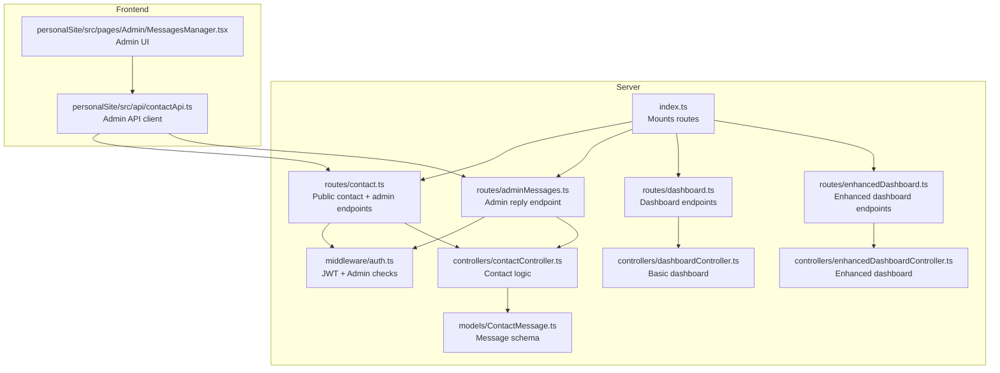
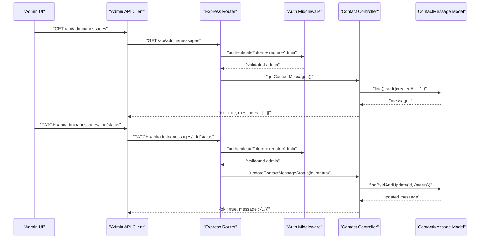
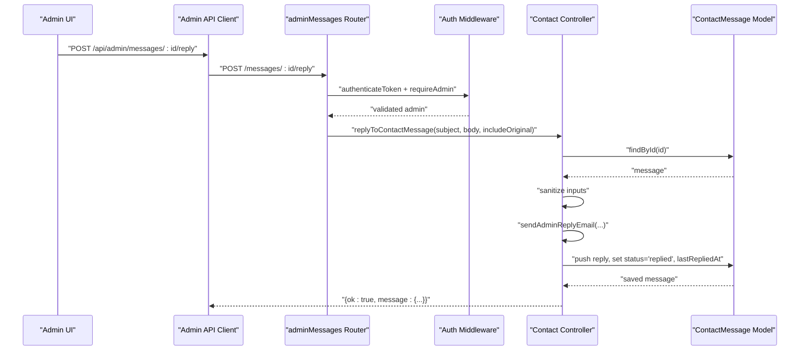
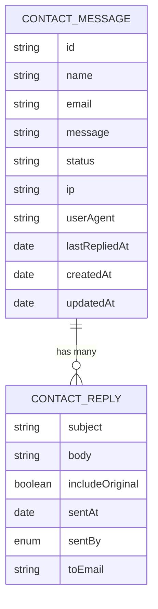
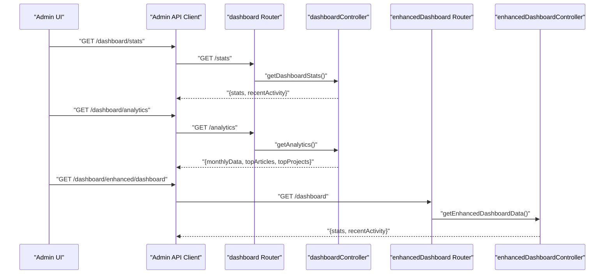
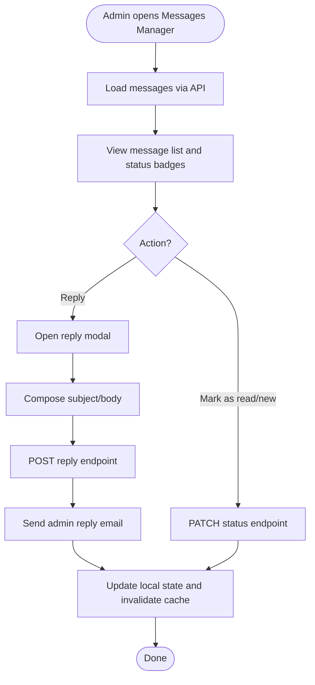
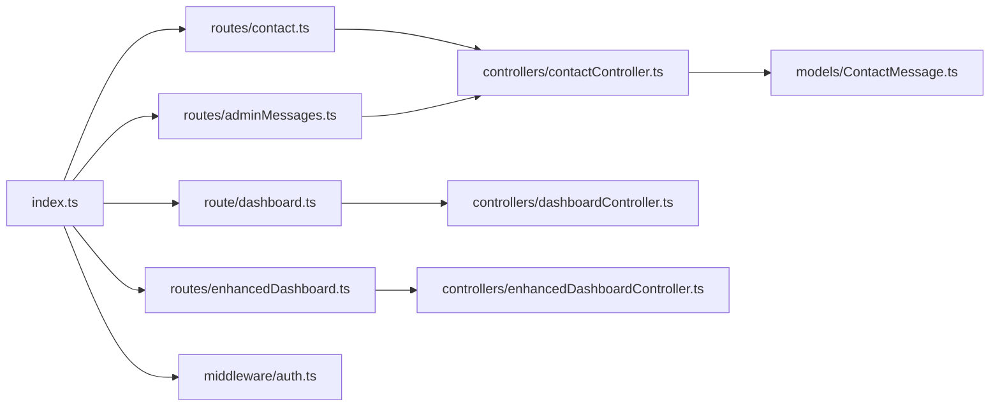

# Admin Management API

<cite>
**Referenced Files in This Document**
- [server/src/index.ts](file://server/src/index.ts)
- [server/src/routes/contact.ts](file://server/src/routes/contact.ts)
- [server/src/routes/adminMessages.ts](file://server/src/routes/adminMessages.ts)
- [server/src/controllers/contactController.ts](file://server/src/controllers/contactController.ts)
- [server/src/models/ContactMessage.ts](file://server/src/models/ContactMessage.ts)
- [server/src/middleware/auth.ts](file://server/src/middleware/auth.ts)
- [server/src/route/dashboard.ts](file://server/src/route/dashboard.ts)
- [server/src/controllers/dashboardController.ts](file://server/src/controllers/dashboardController.ts)
- [server/src/controllers/enhancedDashboardController.ts](file://server/src/controllers/enhancedDashboardController.ts)
- [server/src/routes/enhancedDashboard.ts](file://server/src/routes/enhancedDashboard.ts)
- [personalSite/src/api/contactApi.ts](file://personalSite/src/api/contactApi.ts)
- [personalSite/src/pages/Admin/MessagesManager.tsx](file://personalSite/src/pages/Admin/MessagesManager.tsx)
</cite>

## Table of Contents
1. [Introduction](#introduction)
2. [Project Structure](#project-structure)
3. [Core Components](#core-components)
4. [Architecture Overview](#architecture-overview)
5. [Detailed Component Analysis](#detailed-component-analysis)
6. [Dependency Analysis](#dependency-analysis)
7. [Performance Considerations](#performance-considerations)
8. [Troubleshooting Guide](#troubleshooting-guide)
9. [Conclusion](#conclusion)
10. [Appendices](#appendices)

## Introduction
This document provides comprehensive API documentation for administrative management endpoints focused on contact message handling and dashboard analytics. It covers:
- Message retrieval and status updates for administrators
- Automated reply workflows with rate limiting and sanitization
- Dashboard analytics endpoints for admin overview
- Security controls, rate limits, and operational considerations
- Guidance for extending functionality (e.g., message export, bulk operations, spam detection)

Where applicable, the documentation references the backend server implementation and the frontend admin panel integration.

## Project Structure
The admin-focused APIs are implemented in the server module and integrated with the frontend admin panel:
- Backend routes and controllers under server/src
- Frontend admin page under personalSite/src/pages/Admin
- Shared API client under personalSite/src/api

**Diagram sources**
- [server/src/index.ts](file://server/src/index.ts#L100-L116)
- [server/src/routes/contact.ts](file://server/src/routes/contact.ts#L1-L27)
- [server/src/routes/adminMessages.ts](file://server/src/routes/adminMessages.ts#L1-L23)
- [server/src/controllers/contactController.ts](file://server/src/controllers/contactController.ts#L1-L438)
- [server/src/models/ContactMessage.ts](file://server/src/models/ContactMessage.ts#L1-L123)
- [server/src/middleware/auth.ts](file://server/src/middleware/auth.ts#L1-L37)
- [server/src/route/dashboard.ts](file://server/src/route/dashboard.ts#L1-L21)
- [server/src/controllers/dashboardController.ts](file://server/src/controllers/dashboardController.ts#L1-L147)
- [server/src/routes/enhancedDashboard.ts](file://server/src/routes/enhancedDashboard.ts#L1-L12)
- [server/src/controllers/enhancedDashboardController.ts](file://server/src/controllers/enhancedDashboardController.ts#L1-L126)
- [personalSite/src/api/contactApi.ts](file://personalSite/src/api/contactApi.ts#L1-L154)
- [personalSite/src/pages/Admin/MessagesManager.tsx](file://personalSite/src/pages/Admin/MessagesManager.tsx#L1-L429)

**Section sources**
- [server/src/index.ts](file://server/src/index.ts#L100-L116)
- [server/src/routes/contact.ts](file://server/src/routes/contact.ts#L1-L27)
- [server/src/routes/adminMessages.ts](file://server/src/routes/adminMessages.ts#L1-L23)
- [server/src/middleware/auth.ts](file://server/src/middleware/auth.ts#L1-L37)
- [server/src/route/dashboard.ts](file://server/src/route/dashboard.ts#L1-L21)
- [server/src/routes/enhancedDashboard.ts](file://server/src/routes/enhancedDashboard.ts#L1-L12)
- [personalSite/src/api/contactApi.ts](file://personalSite/src/api/contactApi.ts#L1-L154)
- [personalSite/src/pages/Admin/MessagesManager.tsx](file://personalSite/src/pages/Admin/MessagesManager.tsx#L1-L429)

## Core Components
- Authentication and admin enforcement: JWT verification and admin role checks
- Contact message model: stores sender info, content, status, replies, and metadata
- Contact controller: handles message submission, retrieval, status updates, and admin replies
- Admin reply route: protected endpoint for sending replies with rate limiting
- Dashboard endpoints: basic and enhanced analytics for admin overview
- Frontend admin client: fetches messages, updates status, sends replies

**Section sources**
- [server/src/middleware/auth.ts](file://server/src/middleware/auth.ts#L1-L37)
- [server/src/models/ContactMessage.ts](file://server/src/models/ContactMessage.ts#L1-L123)
- [server/src/controllers/contactController.ts](file://server/src/controllers/contactController.ts#L1-L438)
- [server/src/routes/adminMessages.ts](file://server/src/routes/adminMessages.ts#L1-L23)
- [server/src/route/dashboard.ts](file://server/src/route/dashboard.ts#L1-L21)
- [server/src/controllers/dashboardController.ts](file://server/src/controllers/dashboardController.ts#L1-L147)
- [server/src/controllers/enhancedDashboardController.ts](file://server/src/controllers/enhancedDashboardController.ts#L1-L126)
- [personalSite/src/api/contactApi.ts](file://personalSite/src/api/contactApi.ts#L1-L154)

## Architecture Overview
The admin management API follows a layered architecture:
- HTTP entrypoints via Express routers
- Middleware for authentication and admin role enforcement
- Controllers implementing business logic
- MongoDB models for persistence
- Frontend admin client interacting with admin endpoints

**Diagram sources**
- [server/src/routes/contact.ts](file://server/src/routes/contact.ts#L24-L25)
- [server/src/routes/adminMessages.ts](file://server/src/routes/adminMessages.ts#L18-L19)
- [server/src/middleware/auth.ts](file://server/src/middleware/auth.ts#L9-L36)
- [server/src/controllers/contactController.ts](file://server/src/controllers/contactController.ts#L317-L362)
- [server/src/models/ContactMessage.ts](file://server/src/models/ContactMessage.ts#L119-L120)
- [personalSite/src/api/contactApi.ts](file://personalSite/src/api/contactApi.ts#L104-L127)

## Detailed Component Analysis

### Contact Message Management Endpoints
- GET /api/admin/messages
  - Purpose: Retrieve all contact messages ordered by creation time (newest first)
  - Authentication: Required
  - Authorization: Admin required
  - Response: Array of messages with serialized fields including status, replies, timestamps
  - Notes: Implemented via controller method and route; no built-in pagination or filtering in current implementation

- PATCH /api/admin/messages/:id/status
  - Purpose: Update message status among new, read, replied
  - Authentication: Required
  - Authorization: Admin required
  - Validation: ID must be a valid ObjectId; status must be one of allowed values
  - Response: Updated message object

- POST /api/admin/messages/:id/reply
  - Purpose: Send an admin reply to the original sender
  - Authentication: Required
  - Authorization: Admin required
  - Rate Limiting: 20 per hour per admin session/IP
  - Validation: Subject/body length constraints; optional includeOriginal flag
  - Side effects: Adds reply to message.replies, sets status to replied, records lastRepliedAt
  - Email delivery: Sends HTML/text emails to admin and user via configured transport

**Diagram sources**
- [server/src/routes/adminMessages.ts](file://server/src/routes/adminMessages.ts#L1-L23)
- [server/src/middleware/auth.ts](file://server/src/middleware/auth.ts#L1-L37)
- [server/src/controllers/contactController.ts](file://server/src/controllers/contactController.ts#L364-L437)
- [server/src/models/ContactMessage.ts](file://server/src/models/ContactMessage.ts#L1-L123)
- [personalSite/src/api/contactApi.ts](file://personalSite/src/api/contactApi.ts#L129-L152)

**Section sources**
- [server/src/routes/contact.ts](file://server/src/routes/contact.ts#L24-L25)
- [server/src/routes/adminMessages.ts](file://server/src/routes/adminMessages.ts#L1-L23)
- [server/src/controllers/contactController.ts](file://server/src/controllers/contactController.ts#L317-L362)
- [server/src/controllers/contactController.ts](file://server/src/controllers/contactController.ts#L364-L437)
- [server/src/models/ContactMessage.ts](file://server/src/models/ContactMessage.ts#L1-L123)
- [personalSite/src/api/contactApi.ts](file://personalSite/src/api/contactApi.ts#L104-L152)

### Message Data Model and Status Tracking
- Fields include sender identity, message content, IP, user agent, status, replies array, and timestamps
- Status lifecycle: new → read → replied
- Replies are stored with subject, body, includeOriginal flag, sent timestamp, sentBy, and recipient email
- Indexes: createdAt descending and composite (status, createdAt) for efficient queries

**Diagram sources**
- [server/src/models/ContactMessage.ts](file://server/src/models/ContactMessage.ts#L1-L123)

**Section sources**
- [server/src/models/ContactMessage.ts](file://server/src/models/ContactMessage.ts#L1-L123)

### Dashboard Analytics Endpoints
- GET /dashboard/stats
  - Returns aggregated stats for articles, projects, users, and recent activity
  - Includes percentage change placeholders and recent activity feed

- GET /dashboard/analytics
  - Returns monthly metrics (mock data), top published articles, and top featured projects

- GET /dashboard/enhanced/*
  - Additional endpoints for enhanced dashboard data (e.g., timeline, interests, tech skills)

**Diagram sources**
- [server/src/route/dashboard.ts](file://server/src/route/dashboard.ts#L1-L21)
- [server/src/controllers/dashboardController.ts](file://server/src/controllers/dashboardController.ts#L1-L147)
- [server/src/routes/enhancedDashboard.ts](file://server/src/routes/enhancedDashboard.ts#L1-L12)
- [server/src/controllers/enhancedDashboardController.ts](file://server/src/controllers/enhancedDashboardController.ts#L1-L126)
- [personalSite/src/api/contactApi.ts](file://personalSite/src/api/contactApi.ts#L1-L154)

**Section sources**
- [server/src/route/dashboard.ts](file://server/src/route/dashboard.ts#L1-L21)
- [server/src/controllers/dashboardController.ts](file://server/src/controllers/dashboardController.ts#L1-L147)
- [server/src/routes/enhancedDashboard.ts](file://server/src/routes/enhancedDashboard.ts#L1-L12)
- [server/src/controllers/enhancedDashboardController.ts](file://server/src/controllers/enhancedDashboardController.ts#L1-L126)

### Admin Notification Systems and Workflows
- Real-time admin UI for viewing messages, marking as read/new, and replying
- Reply modal supports toggling inclusion of the original message
- Toast notifications indicate success/failure of actions
- Rate limiting prevents abuse during reply operations

**Diagram sources**
- [personalSite/src/pages/Admin/MessagesManager.tsx](file://personalSite/src/pages/Admin/MessagesManager.tsx#L74-L183)
- [personalSite/src/api/contactApi.ts](file://personalSite/src/api/contactApi.ts#L77-L152)
- [server/src/controllers/contactController.ts](file://server/src/controllers/contactController.ts#L364-L437)

**Section sources**
- [personalSite/src/pages/Admin/MessagesManager.tsx](file://personalSite/src/pages/Admin/MessagesManager.tsx#L1-L429)
- [personalSite/src/api/contactApi.ts](file://personalSite/src/api/contactApi.ts#L1-L154)

## Dependency Analysis
- Route mounting in the main server entrypoint wires up:
  - Public contact endpoints (/contact)
  - Admin-only contact endpoints (/api/contact)
  - Admin reply endpoint (/api/admin/messages/:id/reply)
  - Dashboard endpoints (/dashboard)
  - Enhanced dashboard endpoints (/dashboard/enhanced)
- Controllers depend on:
  - ContactMessage model for persistence
  - Environment variables for email transport
  - Validation helpers and sanitizers
- Frontend depends on:
  - API client for admin endpoints
  - UI components for rendering and interactions

**Diagram sources**
- [server/src/index.ts](file://server/src/index.ts#L100-L116)
- [server/src/routes/contact.ts](file://server/src/routes/contact.ts#L1-L27)
- [server/src/routes/adminMessages.ts](file://server/src/routes/adminMessages.ts#L1-L23)
- [server/src/route/dashboard.ts](file://server/src/route/dashboard.ts#L1-L21)
- [server/src/routes/enhancedDashboard.ts](file://server/src/routes/enhancedDashboard.ts#L1-L12)
- [server/src/controllers/contactController.ts](file://server/src/controllers/contactController.ts#L1-L438)
- [server/src/controllers/dashboardController.ts](file://server/src/controllers/dashboardController.ts#L1-L147)
- [server/src/controllers/enhancedDashboardController.ts](file://server/src/controllers/enhancedDashboardController.ts#L1-L126)
- [server/src/models/ContactMessage.ts](file://server/src/models/ContactMessage.ts#L1-L123)
- [server/src/middleware/auth.ts](file://server/src/middleware/auth.ts#L1-L37)

**Section sources**
- [server/src/index.ts](file://server/src/index.ts#L100-L116)
- [server/src/routes/contact.ts](file://server/src/routes/contact.ts#L1-L27)
- [server/src/routes/adminMessages.ts](file://server/src/routes/adminMessages.ts#L1-L23)
- [server/src/route/dashboard.ts](file://server/src/route/dashboard.ts#L1-L21)
- [server/src/routes/enhancedDashboard.ts](file://server/src/routes/enhancedDashboard.ts#L1-L12)
- [server/src/controllers/contactController.ts](file://server/src/controllers/contactController.ts#L1-L438)
- [server/src/controllers/dashboardController.ts](file://server/src/controllers/dashboardController.ts#L1-L147)
- [server/src/controllers/enhancedDashboardController.ts](file://server/src/controllers/enhancedDashboardController.ts#L1-L126)
- [server/src/models/ContactMessage.ts](file://server/src/models/ContactMessage.ts#L1-L123)
- [server/src/middleware/auth.ts](file://server/src/middleware/auth.ts#L1-L37)

## Performance Considerations
- Rate limiting:
  - Public contact submissions: 5 per 10 minutes
  - Admin replies: 20 per hour
- Database indexes:
  - createdAt descending and (status, createdAt) improve retrieval performance
- Caching:
  - Frontend caches message lists with short TTL; cache invalidated on updates and replies
- Email transport:
  - Reuses Nodemailer transporter instance to reduce overhead

Recommendations:
- Add pagination to GET /api/admin/messages for large datasets
- Introduce filtering by status and date range
- Consider background jobs for email sending to avoid blocking requests
- Monitor reply rate limit thresholds and adjust based on admin volume

**Section sources**
- [server/src/routes/contact.ts](file://server/src/routes/contact.ts#L12-L20)
- [server/src/routes/adminMessages.ts](file://server/src/routes/adminMessages.ts#L8-L16)
- [server/src/models/ContactMessage.ts](file://server/src/models/ContactMessage.ts#L119-L120)
- [personalSite/src/api/contactApi.ts](file://personalSite/src/api/contactApi.ts#L77-L102)
- [server/src/controllers/contactController.ts](file://server/src/controllers/contactController.ts#L68-L84)

## Troubleshooting Guide
Common issues and resolutions:
- Authentication failures:
  - Ensure Authorization header contains a valid JWT
  - Verify token is not expired and user exists
- Admin access denied:
  - Confirm user role is admin
- Message not found:
  - Validate ObjectId format for message ID
- Reply rate limit exceeded:
  - Wait until next window or reduce reply frequency
- Email sending failures:
  - Check ADMIN_EMAIL, SEND_AS_EMAIL, SEND_AS_NAME, GOOGLE_APP_PASSWORD configuration
  - Inspect server logs for transport errors

Operational tips:
- Use GET /health to confirm service availability
- Review error responses returned by endpoints for actionable messages

**Section sources**
- [server/src/middleware/auth.ts](file://server/src/middleware/auth.ts#L9-L36)
- [server/src/controllers/contactController.ts](file://server/src/controllers/contactController.ts#L118-L120)
- [server/src/controllers/contactController.ts](file://server/src/controllers/contactController.ts#L398-L401)
- [server/src/routes/adminMessages.ts](file://server/src/routes/adminMessages.ts#L13-L15)
- [server/src/index.ts](file://server/src/index.ts#L129-L131)

## Conclusion
The admin management API provides a secure, rate-limited foundation for handling contact messages and delivering dashboard insights. Administrators can view, update statuses, and reply to messages while the system tracks read/unread/replied states and maintains a reply history. Extending the API with pagination, filtering, export, and spam detection would further enhance operational efficiency and compliance.

## Appendices

### Endpoint Reference Summary
- GET /api/admin/messages
  - Scope: Admin-only
  - Response: Array of messages
  - Notes: No pagination/filtering in current implementation

- PATCH /api/admin/messages/:id/status
  - Scope: Admin-only
  - Body: { status: "new" | "read" | "replied" }
  - Response: Updated message

- POST /api/admin/messages/:id/reply
  - Scope: Admin-only
  - Body: { subject, body, includeOriginal? }
  - Response: Updated message with reply appended

- GET /dashboard/stats
  - Scope: Admin-only
  - Response: Stats and recent activity

- GET /dashboard/analytics
  - Scope: Admin-only
  - Response: Monthly metrics and top content

- GET /dashboard/enhanced/*
  - Scope: Authenticated users
  - Response: Enhanced dashboard data (timeline, interests, tech skills)

Security and compliance:
- JWT authentication and admin role enforcement
- Input sanitization and length validation
- Rate limiting for public and admin endpoints
- Audit-friendly fields (timestamps, user agent, IP)

**Section sources**
- [server/src/routes/contact.ts](file://server/src/routes/contact.ts#L24-L25)
- [server/src/routes/adminMessages.ts](file://server/src/routes/adminMessages.ts#L21-L21)
- [server/src/route/dashboard.ts](file://server/src/route/dashboard.ts#L13-L16)
- [server/src/controllers/dashboardController.ts](file://server/src/controllers/dashboardController.ts#L6-L103)
- [server/src/controllers/dashboardController.ts](file://server/src/controllers/dashboardController.ts#L106-L147)
- [server/src/middleware/auth.ts](file://server/src/middleware/auth.ts#L9-L36)
- [server/src/controllers/contactController.ts](file://server/src/controllers/contactController.ts#L28-L52)
- [server/src/routes/contact.ts](file://server/src/routes/contact.ts#L12-L20)
- [server/src/routes/adminMessages.ts](file://server/src/routes/adminMessages.ts#L8-L16)