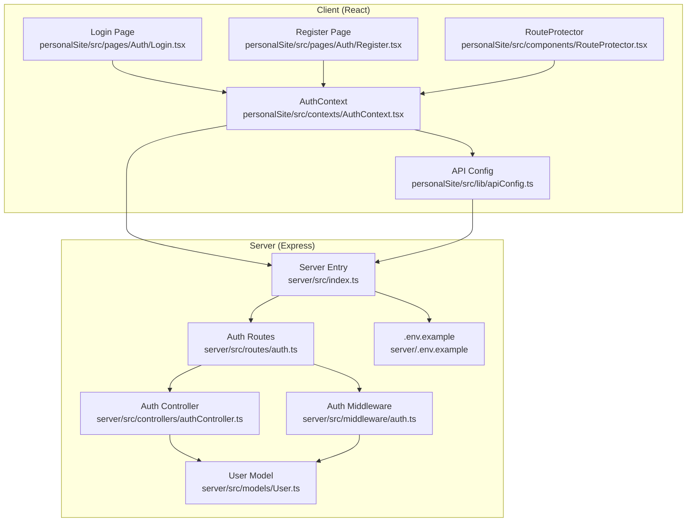
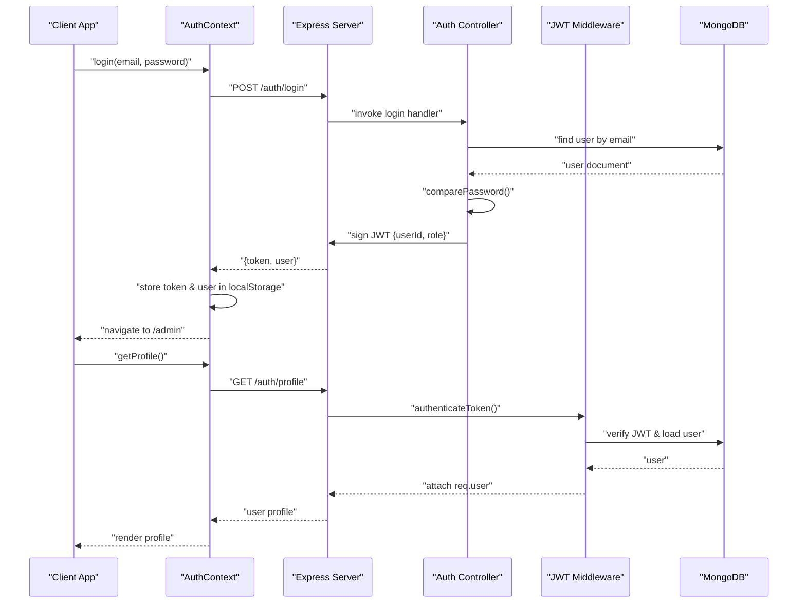
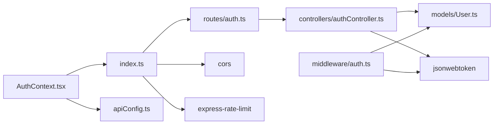

# Authentication API

<cite>
**Referenced Files in This Document**
- [server/src/controllers/authController.ts](file://server/src/controllers/authController.ts)
- [server/src/routes/auth.ts](file://server/src/routes/auth.ts)
- [server/src/middleware/auth.ts](file://server/src/middleware/auth.ts)
- [server/src/models/User.ts](file://server/src/models/User.ts)
- [server/src/index.ts](file://server/src/index.ts)
- [server/.env.example](file://server/.env.example)
- [personalSite/src/contexts/AuthContext.tsx](file://personalSite/src/contexts/AuthContext.tsx)
- [personalSite/src/lib/apiConfig.ts](file://personalSite/src/lib/apiConfig.ts)
- [personalSite/src/pages/Auth/Login.tsx](file://personalSite/src/pages/Auth/Login.tsx)
- [personalSite/src/pages/Auth/Register.tsx](file://personalSite/src/pages/Auth/Register.tsx)
- [personalSite/src/components/RouteProtector.tsx](file://personalSite/src/components/RouteProtector.tsx)
</cite>

## Table of Contents
1. [Introduction](#introduction)
2. [Project Structure](#project-structure)
3. [Core Components](#core-components)
4. [Architecture Overview](#architecture-overview)
5. [Detailed Component Analysis](#detailed-component-analysis)
6. [Dependency Analysis](#dependency-analysis)
7. [Performance Considerations](#performance-considerations)
8. [Troubleshooting Guide](#troubleshooting-guide)
9. [Conclusion](#conclusion)
10. [Appendices](#appendices)

## Introduction
This document provides comprehensive API documentation for the authentication endpoints exposed by the backend server. It covers:
- POST /auth/register for user registration with validation rules
- POST /auth/login for user authentication and JWT token issuance
- GET /auth/profile for retrieving authenticated user information protected by JWT middleware
It also documents authentication header requirements, error responses, practical curl and JavaScript fetch examples, JWT token structure and expiration, refresh token handling, and security considerations including password hashing, CSRF protection, and rate limiting.

## Project Structure
The authentication system spans the server (Express + MongoDB) and the client (React + Vite). The server exposes three endpoints under /auth and enforces JWT-based authentication via middleware. The client integrates with the backend using a centralized API configuration and an authentication context.

**Diagram sources**
- [server/src/index.ts](file://server/src/index.ts#L1-L158)
- [server/src/routes/auth.ts](file://server/src/routes/auth.ts#L1-L11)
- [server/src/controllers/authController.ts](file://server/src/controllers/authController.ts#L1-L142)
- [server/src/middleware/auth.ts](file://server/src/middleware/auth.ts#L1-L37)
- [server/src/models/User.ts](file://server/src/models/User.ts#L1-L58)
- [server/.env.example](file://server/.env.example#L1-L27)
- [personalSite/src/contexts/AuthContext.tsx](file://personalSite/src/contexts/AuthContext.tsx#L1-L140)
- [personalSite/src/lib/apiConfig.ts](file://personalSite/src/lib/apiConfig.ts#L1-L75)
- [personalSite/src/pages/Auth/Login.tsx](file://personalSite/src/pages/Auth/Login.tsx#L1-L120)
- [personalSite/src/pages/Auth/Register.tsx](file://personalSite/src/pages/Auth/Register.tsx#L1-L106)
- [personalSite/src/components/RouteProtector.tsx](file://personalSite/src/components/RouteProtector.tsx#L1-L41)

**Section sources**
- [server/src/index.ts](file://server/src/index.ts#L1-L158)
- [server/src/routes/auth.ts](file://server/src/routes/auth.ts#L1-L11)
- [server/src/controllers/authController.ts](file://server/src/controllers/authController.ts#L1-L142)
- [server/src/middleware/auth.ts](file://server/src/middleware/auth.ts#L1-L37)
- [server/src/models/User.ts](file://server/src/models/User.ts#L1-L58)
- [server/.env.example](file://server/.env.example#L1-L27)
- [personalSite/src/contexts/AuthContext.tsx](file://personalSite/src/contexts/AuthContext.tsx#L1-L140)
- [personalSite/src/lib/apiConfig.ts](file://personalSite/src/lib/apiConfig.ts#L1-L75)
- [personalSite/src/pages/Auth/Login.tsx](file://personalSite/src/pages/Auth/Login.tsx#L1-L120)
- [personalSite/src/pages/Auth/Register.tsx](file://personalSite/src/pages/Auth/Register.tsx#L1-L106)
- [personalSite/src/components/RouteProtector.tsx](file://personalSite/src/components/RouteProtector.tsx#L1-L41)

## Core Components
- Authentication controller: Implements registration, login, and profile retrieval with validation and JWT signing.
- Authentication route module: Exposes endpoints and applies JWT middleware for protected routes.
- JWT middleware: Validates Authorization header tokens and attaches user to request.
- User model: Defines schema, password hashing, and password comparison.
- Server bootstrap: Configures CORS, rate limiting, and mounts auth routes.
- Client auth context: Manages token storage, API calls, and protected routing.

**Section sources**
- [server/src/controllers/authController.ts](file://server/src/controllers/authController.ts#L1-L142)
- [server/src/routes/auth.ts](file://server/src/routes/auth.ts#L1-L11)
- [server/src/middleware/auth.ts](file://server/src/middleware/auth.ts#L1-L37)
- [server/src/models/User.ts](file://server/src/models/User.ts#L1-L58)
- [server/src/index.ts](file://server/src/index.ts#L1-L158)
- [personalSite/src/contexts/AuthContext.tsx](file://personalSite/src/contexts/AuthContext.tsx#L1-L140)

## Architecture Overview
The authentication flow integrates client-side state management with server-side validation and JWT verification.

**Diagram sources**
- [personalSite/src/contexts/AuthContext.tsx](file://personalSite/src/contexts/AuthContext.tsx#L78-L122)
- [server/src/controllers/authController.ts](file://server/src/controllers/authController.ts#L81-L133)
- [server/src/middleware/auth.ts](file://server/src/middleware/auth.ts#L9-L30)
- [server/src/routes/auth.ts](file://server/src/routes/auth.ts#L7-L9)
- [server/src/models/User.ts](file://server/src/models/User.ts#L54-L56)

## Detailed Component Analysis

### POST /auth/register
- Purpose: Create a new user account.
- Request body schema:
  - username: string, required, length 3–30, alphanumeric and underscore only
  - email: string, required, valid email format
  - password: string, required, minimum 6 characters
- Validation:
  - Express validators enforce schema rules; validation errors return 400 with array of errors.
  - Duplicate detection checks both email and username; returns 400 with error message if conflict exists.
- Persistence:
  - Password is hashed using bcrypt before save.
  - Role is assigned as admin if email matches ADMIN_EMAIL; otherwise user.
- Response:
  - 201 Created with token and user object (excluding password).
  - On server errors: 500 Internal Server Error.

curl example:
- curl -X POST https://yourdomain.com/auth/register -H "Content-Type: application/json" -d '{"username":"johndoe","email":"john@example.com","password":"securepass"}'

JavaScript fetch example:
- fetch("https://yourdomain.com/auth/register", { method: "POST", headers: {"Content-Type": "application/json"}, body: JSON.stringify({username:"johndoe",email:"john@example.com",password:"securepass"}) })

Error responses:
- 400 Bad Request: Validation errors or duplicate user
- 500 Internal Server Error: Server error during registration

**Section sources**
- [server/src/controllers/authController.ts](file://server/src/controllers/authController.ts#L6-L79)
- [server/src/models/User.ts](file://server/src/models/User.ts#L14-L56)
- [server/.env.example](file://server/.env.example#L19-L20)
- [personalSite/src/contexts/AuthContext.tsx](file://personalSite/src/contexts/AuthContext.tsx#L101-L122)

### POST /auth/login
- Purpose: Authenticate an existing user and issue a JWT.
- Request body schema:
  - email: string, required, valid email
  - password: string, required, non-empty
- Validation:
  - Express validators enforce schema rules; validation errors return 400 with array of errors.
- Authentication:
  - Finds user by email and compares password using bcrypt.
  - Returns 401 Unauthorized for invalid credentials.
- Response:
  - 200 OK with token and user object (excluding password).
  - On server errors: 500 Internal Server Error.

curl example:
- curl -X POST https://yourdomain.com/auth/login -H "Content-Type: application/json" -d '{"email":"john@example.com","password":"securepass"}'

JavaScript fetch example:
- fetch("https://yourdomain.com/auth/login", { method: "POST", headers: {"Content-Type": "application/json"}, body: JSON.stringify({email:"john@example.com",password:"securepass"}) })

Error responses:
- 400 Bad Request: Validation errors
- 401 Unauthorized: Invalid credentials
- 500 Internal Server Error: Server error during login

**Section sources**
- [server/src/controllers/authController.ts](file://server/src/controllers/authController.ts#L81-L133)
- [server/src/models/User.ts](file://server/src/models/User.ts#L54-L56)
- [personalSite/src/contexts/AuthContext.tsx](file://personalSite/src/contexts/AuthContext.tsx#L78-L99)

### GET /auth/profile
- Purpose: Retrieve the authenticated user’s profile.
- Authentication:
  - Requires Authorization header with Bearer token.
  - JWT middleware verifies token and loads user; returns 401 if missing or invalid, 403 if token is invalid/expired.
- Response:
  - 200 OK with user object excluding password.
  - On server errors: 500 Internal Server Error.

curl example:
- curl -X GET https://yourdomain.com/auth/profile -H "Authorization: Bearer YOUR_JWT_HERE"

JavaScript fetch example:
- fetch("https://yourdomain.com/auth/profile", { headers: {"Authorization": "Bearer YOUR_JWT_HERE"} })

Error responses:
- 401 Unauthorized: Access token required or invalid token
- 403 Forbidden: Invalid or expired token
- 500 Internal Server Error: Server error

**Section sources**
- [server/src/routes/auth.ts](file://server/src/routes/auth.ts#L9)
- [server/src/middleware/auth.ts](file://server/src/middleware/auth.ts#L9-L30)
- [server/src/controllers/authController.ts](file://server/src/controllers/authController.ts#L135-L142)

### JWT Token Structure and Expiration
- Token payload: Contains userId and role.
- Expiration: 7 days.
- Secret: Loaded from JWT_SECRET environment variable; falls back to a default if not present.
- Refresh token handling: Not implemented in the current codebase; clients should renew tokens by logging in again after expiration.

Security considerations:
- Secret rotation: Change JWT_SECRET in production and restart the server.
- Token storage: Client stores token in localStorage; consider HttpOnly cookies for higher security.
- Transport: Use HTTPS in production to protect tokens in transit.

**Section sources**
- [server/src/controllers/authController.ts](file://server/src/controllers/authController.ts#L59-L63)
- [server/src/controllers/authController.ts](file://server/src/controllers/authController.ts#L113-L117)
- [server/src/middleware/auth.ts](file://server/src/middleware/auth.ts#L18)
- [server/.env.example](file://server/.env.example#L4-L5)

### Authentication Header Requirements
- Format: Authorization: Bearer YOUR_JWT_HERE
- Used by: GET /auth/profile
- Client behavior: AuthContext automatically attaches the Authorization header for protected requests.

**Section sources**
- [server/src/middleware/auth.ts](file://server/src/middleware/auth.ts#L11-L12)
- [personalSite/src/contexts/AuthContext.tsx](file://personalSite/src/contexts/AuthContext.tsx#L60-L63)
- [personalSite/src/contexts/AuthContext.tsx](file://personalSite/src/contexts/AuthContext.tsx#L58-L76)

### Password Hashing
- Pre-save hook hashes passwords using bcrypt with 12 rounds.
- Password comparison uses bcrypt.compare during login.

**Section sources**
- [server/src/models/User.ts](file://server/src/models/User.ts#L44-L56)

### Rate Limiting for Failed Login Attempts
- Global rate limiter: 100 requests per 15 minutes per IP.
- Applies to all routes mounted on the server.

**Section sources**
- [server/src/index.ts](file://server/src/index.ts#L88-L93)

### CSRF Protection
- No CSRF middleware is configured in the server.
- Recommendations:
  - Add CSRF protection for state-changing endpoints.
  - Use SameSite cookies and Origin/CORS policies.
  - Consider rotating tokens per session.

[No sources needed since this section provides general guidance]

### Practical Examples

curl examples:
- Registration: curl -X POST https://yourdomain.com/auth/register -H "Content-Type: application/json" -d '{"username":"johndoe","email":"john@example.com","password":"securepass"}'
- Login: curl -X POST https://yourdomain.com/auth/login -H "Content-Type: application/json" -d '{"email":"john@example.com","password":"securepass"}'
- Profile: curl -X GET https://yourdomain.com/auth/profile -H "Authorization: Bearer YOUR_JWT_HERE"

JavaScript fetch examples:
- Registration: fetch("https://yourdomain.com/auth/register", { method: "POST", headers: {"Content-Type": "application/json"}, body: JSON.stringify({username:"johndoe",email:"john@example.com",password:"securepass"}) })
- Login: fetch("https://yourdomain.com/auth/login", { method: "POST", headers: {"Content-Type": "application/json"}, body: JSON.stringify({email:"john@example.com",password:"securepass"}) })
- Profile: fetch("https://yourdomain.com/auth/profile", { headers: {"Authorization": "Bearer YOUR_JWT_HERE"} })

**Section sources**
- [personalSite/src/contexts/AuthContext.tsx](file://personalSite/src/contexts/AuthContext.tsx#L78-L122)
- [personalSite/src/lib/apiConfig.ts](file://personalSite/src/lib/apiConfig.ts#L7-L52)

## Dependency Analysis
The authentication system exhibits clear separation of concerns:
- Routes depend on controller handlers.
- Controllers depend on the User model and JWT library.
- Middleware depends on JWT library and User model.
- Client depends on API configuration and AuthContext for network calls and state.

**Diagram sources**
- [server/src/routes/auth.ts](file://server/src/routes/auth.ts#L1-L11)
- [server/src/controllers/authController.ts](file://server/src/controllers/authController.ts#L1-L142)
- [server/src/middleware/auth.ts](file://server/src/middleware/auth.ts#L1-L37)
- [server/src/models/User.ts](file://server/src/models/User.ts#L1-L58)
- [server/src/index.ts](file://server/src/index.ts#L1-L158)
- [personalSite/src/contexts/AuthContext.tsx](file://personalSite/src/contexts/AuthContext.tsx#L1-L140)
- [personalSite/src/lib/apiConfig.ts](file://personalSite/src/lib/apiConfig.ts#L1-L75)

**Section sources**
- [server/src/routes/auth.ts](file://server/src/routes/auth.ts#L1-L11)
- [server/src/controllers/authController.ts](file://server/src/controllers/authController.ts#L1-L142)
- [server/src/middleware/auth.ts](file://server/src/middleware/auth.ts#L1-L37)
- [server/src/models/User.ts](file://server/src/models/User.ts#L1-L58)
- [server/src/index.ts](file://server/src/index.ts#L1-L158)
- [personalSite/src/contexts/AuthContext.tsx](file://personalSite/src/contexts/AuthContext.tsx#L1-L140)
- [personalSite/src/lib/apiConfig.ts](file://personalSite/src/lib/apiConfig.ts#L1-L75)

## Performance Considerations
- Validation overhead: express-validator adds minimal overhead; ensure client-side pre-validation to reduce server load.
- Database queries: findOne operations on email and username; consider indexing on email and username for scalability.
- JWT signing: Keep secret secure and avoid excessive token issuance; rotate secrets periodically.
- Rate limiting: Prevents brute-force attacks; consider per-endpoint limits for login specifically.

[No sources needed since this section provides general guidance]

## Troubleshooting Guide
Common issues and resolutions:
- Invalid credentials (login):
  - Symptom: 401 Unauthorized with error message.
  - Resolution: Verify email and password; ensure email normalization and password hashing are functioning.
- Duplicate user (register):
  - Symptom: 400 Bad Request indicating duplicate email or username.
  - Resolution: Use a different email or username; confirm uniqueness constraints.
- Missing or invalid Authorization header (profile):
  - Symptom: 401 Unauthorized or 403 Forbidden.
  - Resolution: Ensure Bearer token is included; verify token expiration and secret correctness.
- Server errors:
  - Symptom: 500 Internal Server Error.
  - Resolution: Check server logs; validate JWT_SECRET and database connectivity.

**Section sources**
- [server/src/controllers/authController.ts](file://server/src/controllers/authController.ts#L36-L40)
- [server/src/controllers/authController.ts](file://server/src/controllers/authController.ts#L102-L110)
- [server/src/middleware/auth.ts](file://server/src/middleware/auth.ts#L14-L28)
- [server/src/index.ts](file://server/src/index.ts#L134-L140)

## Conclusion
The authentication system provides robust endpoints for registration, login, and profile retrieval with strong validation, password hashing, and JWT-based authorization. Clients integrate seamlessly via a centralized API configuration and an authentication context. For production, consider CSRF protection, refresh token handling, and enhanced security measures such as rotating secrets and secure cookie storage.

[No sources needed since this section summarizes without analyzing specific files]

## Appendices

### Endpoint Reference

- POST /auth/register
  - Request body: username, email, password
  - Responses: 201 with token and user; 400 for validation/duplicate; 500 on server error

- POST /auth/login
  - Request body: email, password
  - Responses: 200 with token and user; 400 for validation; 401 for invalid credentials; 500 on server error

- GET /auth/profile
  - Headers: Authorization: Bearer <token>
  - Responses: 200 with user; 401 for missing token; 403 for invalid/expired token; 500 on server error

**Section sources**
- [server/src/controllers/authController.ts](file://server/src/controllers/authController.ts#L6-L79)
- [server/src/controllers/authController.ts](file://server/src/controllers/authController.ts#L81-L133)
- [server/src/controllers/authController.ts](file://server/src/controllers/authController.ts#L135-L142)
- [server/src/routes/auth.ts](file://server/src/routes/auth.ts#L7-L9)
- [server/src/middleware/auth.ts](file://server/src/middleware/auth.ts#L9-L30)