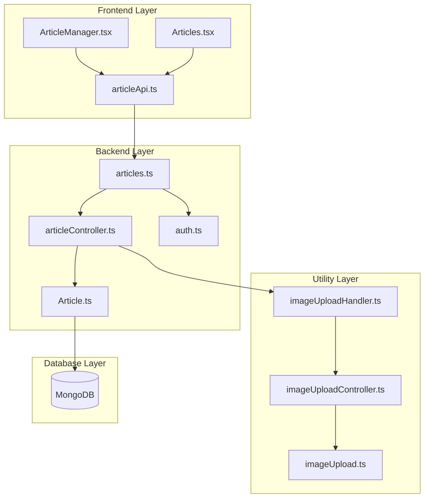
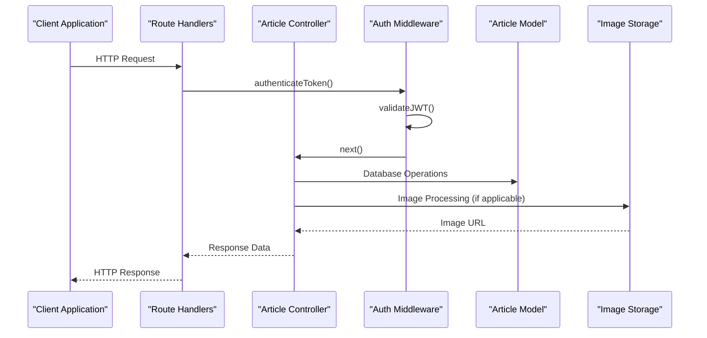
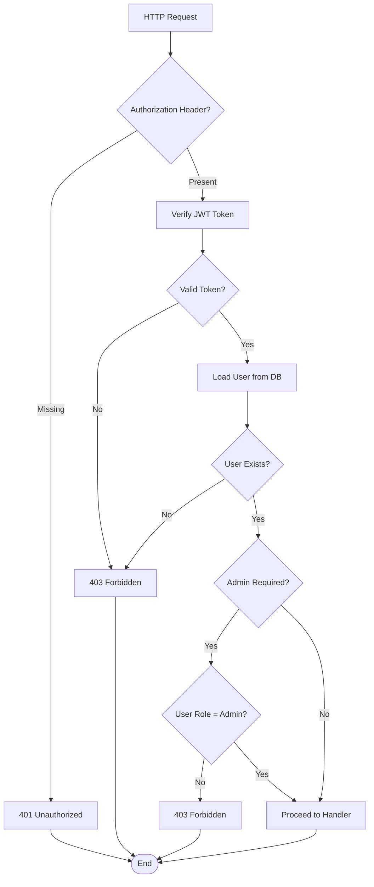
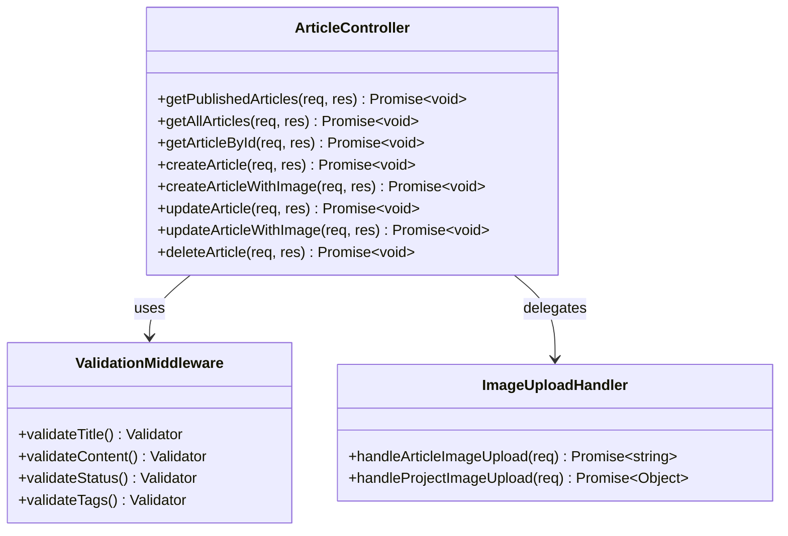
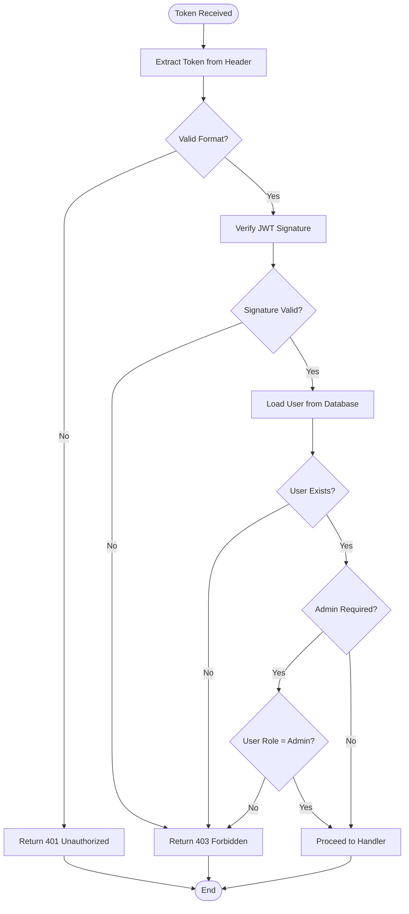
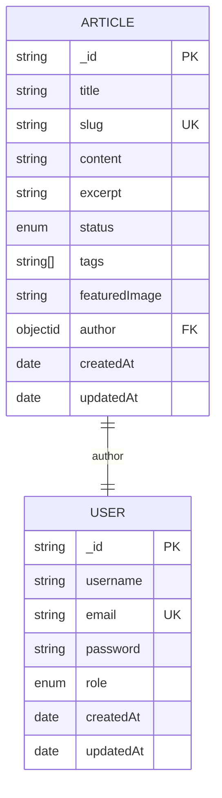
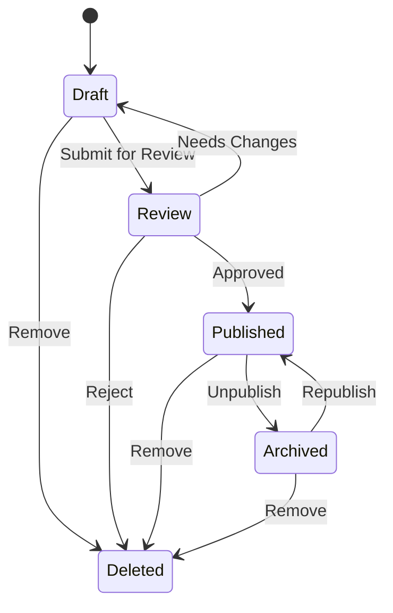

# Articles API

<cite>
**Referenced Files in This Document**
- [articles.ts](file://server/src/routes/articles.ts)
- [articleController.ts](file://server/src/controllers/articleController.ts)
- [Article.ts](file://server/src/models/Article.ts)
- [auth.ts](file://server/src/middleware/auth.ts)
- [imageUploadHandler.ts](file://server/src/utils/imageUploadHandler.ts)
- [imageUploadController.ts](file://server/src/controllers/imageUploadController.ts)
- [imageUpload.ts](file://server/src/routes/imageUpload.ts)
- [articleApi.ts](file://personalSite/src/api/articleApi.ts)
- [ArticleManager.tsx](file://personalSite/src/pages/Admin/ArticleManager.tsx)
- [Articles.tsx](file://personalSite/src/pages/Articles.tsx)
</cite>

## Table of Contents
1. [Introduction](#introduction)
2. [Project Structure](#project-structure)
3. [Core Components](#core-components)
4. [Architecture Overview](#architecture-overview)
5. [Detailed Component Analysis](#detailed-component-analysis)
6. [Authentication & Authorization](#authentication--authorization)
7. [Data Model](#data-model)
8. [API Endpoints](#api-endpoints)
9. [Enhanced Upload Endpoints](#enhanced-upload-endpoints)
10. [Content Management Workflows](#content-management-workflows)
11. [Performance Considerations](#performance-considerations)
12. [Troubleshooting Guide](#troubleshooting-guide)
13. [Conclusion](#conclusion)

## Introduction

The Articles API is a comprehensive content management system designed for managing blog articles with advanced features including image uploads, SEO optimization, and administrative controls. This system provides both public and administrative interfaces for content creation, editing, and publication management.

The API follows RESTful principles with specialized endpoints for different use cases, including standard CRUD operations and enhanced upload capabilities with image validation and processing.

## Project Structure

The Articles API is organized across multiple layers with clear separation of concerns:



**Diagram sources**
- [articles.ts](file://server/src/routes/articles.ts#L1-L54)
- [articleController.ts](file://server/src/controllers/articleController.ts#L1-L453)
- [auth.ts](file://server/src/middleware/auth.ts#L1-L37)

**Section sources**
- [articles.ts](file://server/src/routes/articles.ts#L1-L54)
- [articleController.ts](file://server/src/controllers/articleController.ts#L1-L453)

## Core Components

The Articles API consists of several key components working together:

### Route Layer
- **articles.ts**: Defines all API endpoints with proper routing configuration
- **imageUpload.ts**: Dedicated route handler for standalone image uploads

### Controller Layer
- **articleController.ts**: Implements business logic for article operations
- **imageUploadController.ts**: Handles image processing and storage

### Middleware Layer
- **auth.ts**: Provides JWT authentication and admin role validation

### Data Layer
- **Article.ts**: Mongoose model definition with validation rules
- **User.ts**: User model with role-based permissions

### Utility Layer
- **imageUploadHandler.ts**: Centralized image upload processing logic

**Section sources**
- [articles.ts](file://server/src/routes/articles.ts#L1-L54)
- [articleController.ts](file://server/src/controllers/articleController.ts#L1-L453)
- [auth.ts](file://server/src/middleware/auth.ts#L1-L37)
- [Article.ts](file://server/src/models/Article.ts#L1-L64)

## Architecture Overview

The Articles API follows a layered architecture pattern with clear separation between presentation, business logic, and data persistence:



**Diagram sources**
- [articles.ts](file://server/src/routes/articles.ts#L34-L53)
- [articleController.ts](file://server/src/controllers/articleController.ts#L6-L88)
- [auth.ts](file://server/src/middleware/auth.ts#L9-L37)

## Detailed Component Analysis

### Authentication & Authorization Middleware

The authentication system implements JWT-based security with role-based access control:



**Diagram sources**
- [auth.ts](file://server/src/middleware/auth.ts#L9-L37)

**Section sources**
- [auth.ts](file://server/src/middleware/auth.ts#L1-L37)

### Article Controller Operations

The controller implements comprehensive CRUD operations with validation and error handling:



**Diagram sources**
- [articleController.ts](file://server/src/controllers/articleController.ts#L6-L453)
- [imageUploadHandler.ts](file://server/src/utils/imageUploadHandler.ts#L7-L45)

**Section sources**
- [articleController.ts](file://server/src/controllers/articleController.ts#L1-L453)
- [imageUploadHandler.ts](file://server/src/utils/imageUploadHandler.ts#L1-L199)

## Authentication & Authorization

### JWT Token Requirements

All administrative endpoints require:
- **Authorization header**: `Bearer <JWT_TOKEN>`
- **Valid JWT signature**: Verified against configured secret
- **Active user account**: Non-deleted user record

### Admin Role Validation

Administrative endpoints enforce:
- User must have `role: 'admin'`
- Token must contain valid user ID
- Access denied for non-admin users

### Token Verification Process



**Diagram sources**
- [auth.ts](file://server/src/middleware/auth.ts#L9-L37)

**Section sources**
- [auth.ts](file://server/src/middleware/auth.ts#L1-L37)

## Data Model

The Article model defines the structure and validation rules for article content:



**Diagram sources**
- [Article.ts](file://server/src/models/Article.ts#L3-L14)

### Field Specifications

| Field | Type | Required | Constraints | Description |
|-------|------|----------|-------------|-------------|
| title | string | Yes | 1-200 chars | Article title |
| slug | string | Yes | Unique | URL-friendly identifier |
| content | string | Yes | Minimum 1 char | Markdown/HTML content |
| excerpt | string | No | Max 500 chars | Brief summary |
| status | enum | No | draft, published | Publication state |
| tags | string[] | No | Array of strings | Content categorization |
| featuredImage | string | No | URL string | Cover image URL |
| author | ObjectId | Yes | References User | Article creator |

**Section sources**
- [Article.ts](file://server/src/models/Article.ts#L1-L64)

## API Endpoints

### Public Endpoints

#### GET /articles
**Purpose**: Retrieve published articles with pagination and filtering

**Query Parameters**:
- `page`: Page number (default: 1)
- `limit`: Items per page (default: 10, max: 50)
- `search`: Text search across title, content, and tags
- `tags`: Comma-separated tag filter

**Response**:
```json
{
  "articles": [
    {
      "_id": "string",
      "title": "string",
      "slug": "string",
      "content": "string",
      "excerpt": "string",
      "status": "draft|published",
      "tags": ["string"],
      "featuredImage": "string",
      "author": {
        "username": "string"
      },
      "createdAt": "date",
      "updatedAt": "date"
    }
  ],
  "totalPages": "number",
  "currentPage": "number",
  "total": "number"
}
```

#### GET /articles/all
**Purpose**: Admin-only endpoint to retrieve all articles (including drafts)

**Authentication**: JWT required + Admin role

**Query Parameters**:
- `page`: Page number (default: 1)
- `limit`: Items per page (default: 10, max: 50)
- `search`: Text search across title, content, and tags
- `status`: Filter by publication status

**Response**: Same as GET /articles but includes all statuses

#### GET /articles/:id
**Purpose**: Retrieve individual article by ID or slug

**Response**: Complete article object with author information

**Section sources**
- [articles.ts](file://server/src/routes/articles.ts#L34-L37)
- [articleController.ts](file://server/src/controllers/articleController.ts#L6-L88)

### Administrative Endpoints

#### POST /articles
**Purpose**: Create new article without image upload

**Authentication**: JWT required + Admin role

**Request Body**:
```json
{
  "title": "string (1-200 chars)",
  "content": "string (minimum 1 char)",
  "excerpt": "string (optional)",
  "status": "draft|published",
  "tags": ["string"],
  "featuredImage": "string (optional)"
}
```

**Response**:
```json
{
  "message": "string",
  "article": {
    "title": "string",
    "slug": "string",
    "content": "string",
    "excerpt": "string",
    "status": "draft|published",
    "tags": ["string"],
    "featuredImage": "string",
    "author": "ObjectId",
    "createdAt": "date",
    "updatedAt": "date"
  }
}
```

#### PUT /articles/:id
**Purpose**: Update existing article without image upload

**Authentication**: JWT required + Admin role

**Request Body**: Same as POST but with optional fields

**Response**: Updated article object

#### DELETE /articles/:id
**Purpose**: Delete article permanently

**Authentication**: JWT required + Admin role

**Response**:
```json
{
  "message": "Article deleted successfully"
}
```

**Section sources**
- [articles.ts](file://server/src/routes/articles.ts#L45-L48)
- [articleController.ts](file://server/src/controllers/articleController.ts#L196-L453)

## Enhanced Upload Endpoints

### POST /articles/upload
**Purpose**: Create article with featured image upload

**Authentication**: JWT required + Admin role

**Request Format**: `multipart/form-data` with file field `featuredImage`

**Request Fields**:
- `title`: Article title (1-200 chars)
- `content`: Article content (minimum 1 char)
- `excerpt`: Optional excerpt
- `status`: Article status (`draft` or `published`)
- `tags`: Tags array (string or JSON)
- `featuredImage`: Image file (PNG, JPEG, WebP, max 2MB)

**Response**: Article object with uploaded image URL

### PUT /articles/upload/:id
**Purpose**: Update article with optional image replacement

**Authentication**: JWT required + Admin role

**Request Format**: `multipart/form-data` with optional file field `featuredImage`

**Request Fields**: Same as POST but with optional image replacement

**Response**: Updated article object

**Section sources**
- [articles.ts](file://server/src/routes/articles.ts#L50-L52)
- [articleController.ts](file://server/src/controllers/articleController.ts#L90-L194)
- [articleController.ts](file://server/src/controllers/articleController.ts#L261-L371)

## Content Management Workflows

### Rich Content Editing Process

```mermaid
flowchart TD
Start([Start Content Creation]) --> ChooseEditor{Choose Editor Type}
ChooseEditor --> |Simple| BasicEditor[Basic Text Editor]
ChooseEditor --> |Advanced| RichEditor[Rich Text Editor]
BasicEditor --> AddContent[Add Content]
RichEditor --> AddContent
AddContent --> AddImages{Add Images?}
AddImages --> |Yes| UploadImage[Upload Featured Image]
AddImages --> |No| SkipImages[Skip Image Upload]
UploadImage --> ValidateImage[Validate Image (PNG/JPEG/WebP, ≤2MB)]
ValidateImage --> ImageValid{Valid Image?}
ImageValid --> |No| ShowError[Show Validation Error]
ImageValid --> |Yes| StoreImage[Store Image in GitHub]
StoreImage --> GetURL[Get Public URL]
GetURL --> AddToContent[Add Image to Content]
SkipImages --> AddToContent
AddToContent --> SetStatus{Set Status}
SetStatus --> |Draft| SaveDraft[Save as Draft]
SetStatus --> |Publish| PublishArticle[Publish Article]
SaveDraft --> End([Complete])
PublishArticle --> End
ShowError --> End
```

**Diagram sources**
- [ArticleManager.tsx](file://personalSite/src/pages/Admin/ArticleManager.tsx#L44-L95)
- [ArticleManager.tsx](file://personalSite/src/pages/Admin/ArticleManager.tsx#L97-L143)

### Image Attachment Workflow

The system supports flexible image handling through multiple approaches:

1. **Direct URL Input**: Enter image URL in the featured image field
2. **File Upload**: Select local image file for automatic upload
3. **Mixed Approach**: Combine URL and file upload for different content types

**Section sources**
- [ArticleManager.tsx](file://personalSite/src/pages/Admin/ArticleManager.tsx#L36-L42)
- [ArticleManager.tsx](file://personalSite/src/pages/Admin/ArticleManager.tsx#L246-L274)

### Content Approval Process



**Section sources**
- [articleController.ts](file://server/src/controllers/articleController.ts#L101-L103)
- [articleController.ts](file://server/src/controllers/articleController.ts#L274-L277)

## Performance Considerations

### Database Optimization

The Article model includes strategic indexes for optimal query performance:

- **Text Search Index**: Enables full-text search across title, content, and tags
- **Status Sorting Index**: Optimizes status-based queries
- **Timestamp Index**: Improves chronological sorting

### Caching Strategy

The frontend implements intelligent caching:
- **Articles Page Cache**: 15-minute TTL for article listings
- **Individual Article Cache**: Per-article caching with invalidation
- **Automatic Cache Invalidation**: Clear cache on create/update/delete operations

### Image Processing Optimization

- **Memory Storage**: Uses `multer.memoryStorage()` for efficient in-memory processing
- **Concurrent Uploads**: Supports multiple simultaneous image uploads
- **Validation Pipeline**: Early validation prevents unnecessary processing

**Section sources**
- [Article.ts](file://server/src/models/Article.ts#L60-L62)
- [Articles.tsx](file://personalSite/src/pages/Articles.tsx#L11-L59)
- [articleApi.ts](file://personalSite/src/api/articleApi.ts#L119-L122)

## Troubleshooting Guide

### Common Authentication Issues

**Problem**: 401 Unauthorized when accessing admin endpoints
**Solution**: Ensure JWT token is included in Authorization header with `Bearer` prefix

**Problem**: 403 Forbidden despite valid token
**Solution**: Verify user has admin role; check token expiration and validity

### Image Upload Problems

**Problem**: 400 Bad Request for image uploads
**Solution**: Verify file format (PNG, JPEG, WebP) and size (≤2MB)

**Problem**: Image upload fails silently
**Solution**: Check GitHub API credentials and repository configuration

### Content Validation Errors

**Problem**: Validation errors on article creation
**Solution**: Ensure title length (1-200 chars), content presence, and proper status values

### Database Connection Issues

**Problem**: MongoDB connection failures
**Solution**: Verify connection string, network connectivity, and database availability

**Section sources**
- [auth.ts](file://server/src/middleware/auth.ts#L14-L28)
- [imageUploadController.ts](file://server/src/controllers/imageUploadController.ts#L22-L36)
- [articleController.ts](file://server/src/controllers/articleController.ts#L91-L99)

## Conclusion

The Articles API provides a robust, scalable solution for content management with comprehensive features for both public consumption and administrative control. The system balances ease of use with powerful functionality, supporting rich content creation, efficient image management, and flexible publishing workflows.

Key strengths include:
- **Security-first design** with JWT authentication and role-based access control
- **Flexible content management** supporting both simple and advanced editing workflows  
- **Optimized performance** through strategic database indexing and intelligent caching
- **Developer-friendly APIs** with clear error handling and comprehensive validation
- **Scalable architecture** supporting future enhancements and extensions

The API serves as a solid foundation for content-driven applications requiring professional-grade article management capabilities.