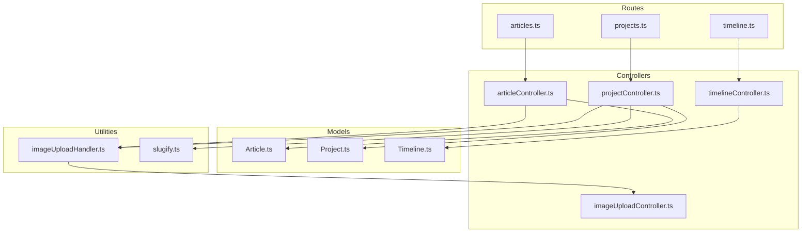
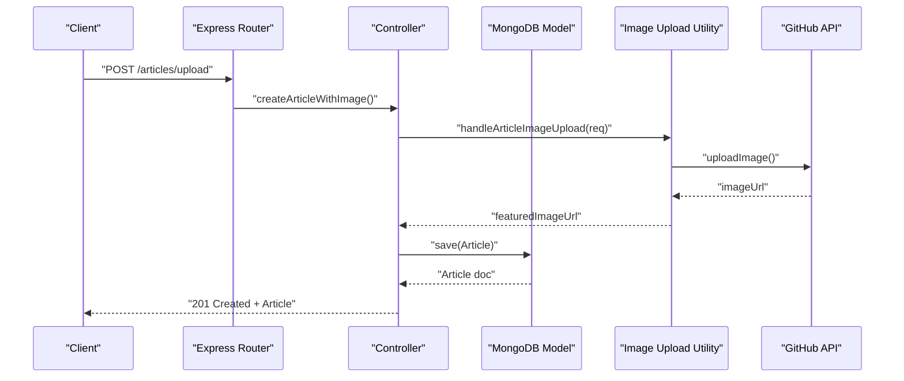
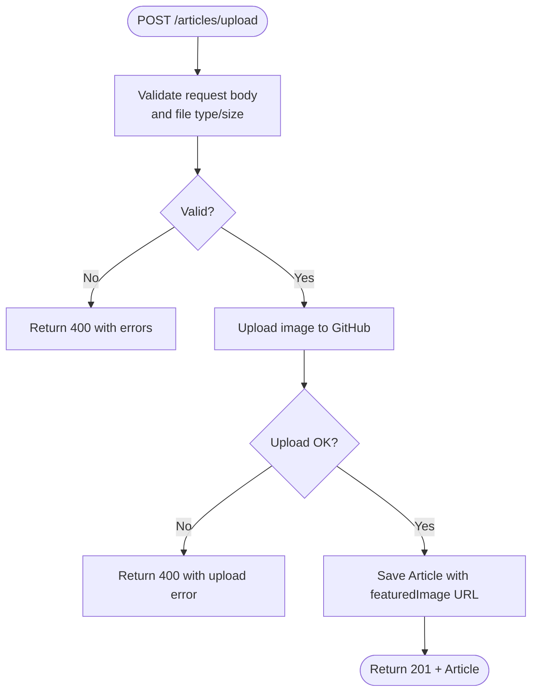
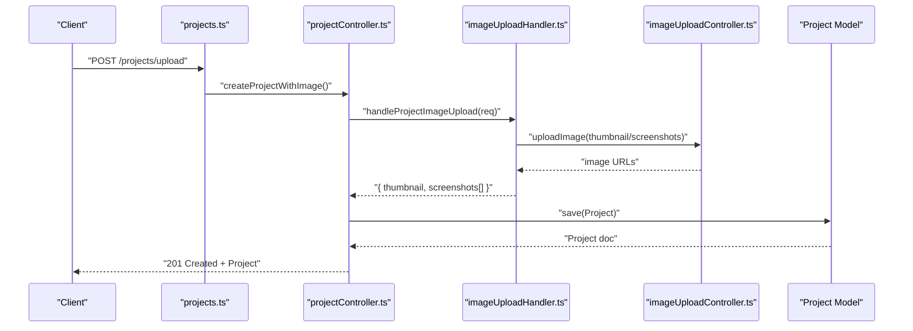
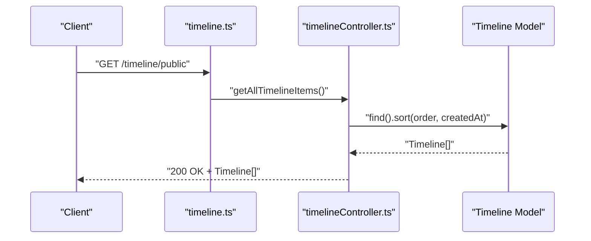
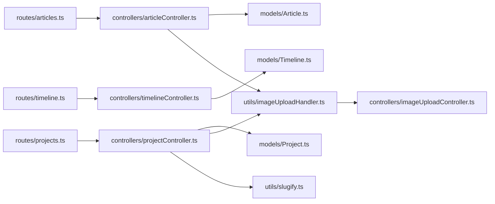

# Content Management API

<cite>
**Referenced Files in This Document**
- [articles.ts](file://server/src/routes/articles.ts)
- [articleController.ts](file://server/src/controllers/articleController.ts)
- [Article.ts](file://server/src/models/Article.ts)
- [projects.ts](file://server/src/routes/projects.ts)
- [projectController.ts](file://server/src/controllers/projectController.ts)
- [Project.ts](file://server/src/models/Project.ts)
- [timeline.ts](file://server/src/routes/timeline.ts)
- [timelineController.ts](file://server/src/controllers/timelineController.ts)
- [Timeline.ts](file://server/src/models/Timeline.ts)
- [imageUploadHandler.ts](file://server/src/utils/imageUploadHandler.ts)
- [imageUploadController.ts](file://server/src/controllers/imageUploadController.ts)
- [slugify.ts](file://server/src/utils/slugify.ts)
</cite>

## Table of Contents
1. [Introduction](#introduction)
2. [Project Structure](#project-structure)
3. [Core Components](#core-components)
4. [Architecture Overview](#architecture-overview)
5. [Detailed Component Analysis](#detailed-component-analysis)
6. [Dependency Analysis](#dependency-analysis)
7. [Performance Considerations](#performance-considerations)
8. [Troubleshooting Guide](#troubleshooting-guide)
9. [Conclusion](#conclusion)

## Introduction
This document provides comprehensive API documentation for content management endpoints covering articles, projects, and timeline items. It details CRUD operations, request/response schemas, validation rules, file upload handling for images, content filtering, and operational workflows such as bulk slug migration for projects. It also outlines current capabilities and highlights areas where advanced features like rich content editing, SEO optimization fields, content scheduling, bulk operations, approval workflows, and version history tracking are not implemented in the current codebase.

## Project Structure
The content management APIs are implemented in the server-side TypeScript/Node.js application under the server directory. Routes define endpoint contracts, controllers implement business logic and validation, models define data schemas, and utilities handle image uploads and slug generation.

**Diagram sources**
- [articles.ts](file://server/src/routes/articles.ts#L1-L54)
- [articleController.ts](file://server/src/controllers/articleController.ts#L1-L453)
- [Article.ts](file://server/src/models/Article.ts#L1-L64)
- [projects.ts](file://server/src/routes/projects.ts#L1-L71)
- [projectController.ts](file://server/src/controllers/projectController.ts#L1-L926)
- [Project.ts](file://server/src/models/Project.ts#L1-L97)
- [timeline.ts](file://server/src/routes/timeline.ts#L1-L35)
- [timelineController.ts](file://server/src/controllers/timelineController.ts#L1-L88)
- [Timeline.ts](file://server/src/models/Timeline.ts#L1-L56)
- [imageUploadHandler.ts](file://server/src/utils/imageUploadHandler.ts#L1-L199)
- [imageUploadController.ts](file://server/src/controllers/imageUploadController.ts#L1-L137)
- [slugify.ts](file://server/src/utils/slugify.ts#L1-L33)

**Section sources**
- [articles.ts](file://server/src/routes/articles.ts#L1-L54)
- [projects.ts](file://server/src/routes/projects.ts#L1-L71)
- [timeline.ts](file://server/src/routes/timeline.ts#L1-L35)

## Core Components
- Articles: Public listing with search and tags, admin CRUD with optional image uploads, and rich content editing via Markdown content.
- Projects: Public listing with search and featured filtering, admin CRUD with robust metadata and image uploads (thumbnail and multiple screenshots), and slug migration.
- Timeline: Public listing and admin CRUD for professional experience entries.

**Section sources**
- [articleController.ts](file://server/src/controllers/articleController.ts#L6-L88)
- [projectController.ts](file://server/src/controllers/projectController.ts#L25-L125)
- [timelineController.ts](file://server/src/controllers/timelineController.ts#L4-L28)

## Architecture Overview
The API follows a layered architecture:
- Routes: Define endpoints and apply authentication/admin middleware.
- Controllers: Enforce validation, build queries, manage uploads, and interact with models.
- Models: Define schemas, indexes, and validations.
- Utilities: Handle image uploads to GitHub and slug generation/migration.

**Diagram sources**
- [articles.ts](file://server/src/routes/articles.ts#L50-L52)
- [articleController.ts](file://server/src/controllers/articleController.ts#L90-L194)
- [imageUploadHandler.ts](file://server/src/utils/imageUploadHandler.ts#L7-L45)
- [imageUploadController.ts](file://server/src/controllers/imageUploadController.ts#L14-L137)

## Detailed Component Analysis

### Articles API
Endpoints:
- GET /articles: List published articles with pagination, search, and tags filter.
- GET /articles/all: Admin-only listing of all articles (published/draft) with filters.
- GET /articles/:id: Retrieve article by ID.
- POST /articles: Admin-only creation without image upload.
- PUT /articles/:id: Admin-only update without image upload.
- DELETE /articles/:id: Admin-only deletion.
- POST /articles/upload: Admin-only creation with featured image upload.
- PUT /articles/upload/:id: Admin-only update with optional image upload.

Validation and request/response:
- Validation uses express-validator for title length, content presence, status enum, and tags format.
- Image upload uses multer memory storage with 2MB limit and image MIME-type filter.
- On successful image upload, the controller receives a URL and stores it in the model.

Pagination and filtering:
- Pagination supports page and limit query parameters.
- Published listing supports text search and tag filtering.
- Admin listing supports text search and status filtering.

Rich content editing:
- Content is stored as plain text; Markdown rendering is not handled in the backend.

SEO and scheduling:
- No dedicated SEO fields or content scheduling fields are implemented.

Bulk operations and approvals:
- Not implemented in the current codebase.

Version history:
- Not implemented in the current codebase.

**Diagram sources**
- [articles.ts](file://server/src/routes/articles.ts#L50-L52)
- [articleController.ts](file://server/src/controllers/articleController.ts#L90-L194)
- [imageUploadHandler.ts](file://server/src/utils/imageUploadHandler.ts#L7-L45)
- [imageUploadController.ts](file://server/src/controllers/imageUploadController.ts#L14-L137)

**Section sources**
- [articles.ts](file://server/src/routes/articles.ts#L1-L54)
- [articleController.ts](file://server/src/controllers/articleController.ts#L6-L88)
- [Article.ts](file://server/src/models/Article.ts#L1-L64)

### Projects API
Endpoints:
- GET /projects: Public listing of published projects with pagination, search, and featured filter.
- GET /projects/all: Admin-only listing of all projects with filters.
- GET /projects/slug/:slug: Public retrieval by slug.
- GET /projects/:id: Public retrieval by ID.
- POST /projects: Admin-only creation without image upload.
- PUT /projects/:id: Admin-only update without image upload.
- DELETE /projects/:id: Admin-only deletion.
- POST /projects/upload: Admin-only creation with thumbnail and screenshots upload.
- PUT /projects/upload/:id: Admin-only update with optional thumbnail and screenshots upload.
- POST /projects/migrate-slugs: Admin-only one-time slug migration.

Validation and request/response:
- Robust validation for title, description, tags (array with at least one item), languages (array or comma-separated), URLs, and booleans.
- Image upload supports named fields: thumbnail and screenshots (up to 10).
- Slug generation uses a deterministic slugify and uniqueness enforcement.

Search and filtering:
- Search across title, description, and tech stack fields.
- Featured flag and status filters.

Display preferences:
- Featured flag controls prominence in listings.

**Diagram sources**
- [projects.ts](file://server/src/routes/projects.ts#L58-L68)
- [projectController.ts](file://server/src/controllers/projectController.ts#L148-L329)
- [imageUploadHandler.ts](file://server/src/utils/imageUploadHandler.ts#L47-L199)
- [imageUploadController.ts](file://server/src/controllers/imageUploadController.ts#L14-L137)
- [Project.ts](file://server/src/models/Project.ts#L1-L97)

**Section sources**
- [projects.ts](file://server/src/routes/projects.ts#L1-L71)
- [projectController.ts](file://server/src/controllers/projectController.ts#L25-L125)
- [Project.ts](file://server/src/models/Project.ts#L1-L97)
- [slugify.ts](file://server/src/utils/slugify.ts#L1-L33)

### Timeline API
Endpoints:
- GET /timeline/public: Public listing of timeline items ordered by order and creation date.
- GET /timeline: Admin-only listing.
- GET /timeline/:id: Admin-only retrieval.
- POST /timeline: Admin-only creation.
- PUT /timeline/:id: Admin-only update.
- DELETE /timeline/:id: Admin-only deletion.

Data model:
- Fields include year, role, company, description, icon, and order.

**Diagram sources**
- [timeline.ts](file://server/src/routes/timeline.ts#L13-L21)
- [timelineController.ts](file://server/src/controllers/timelineController.ts#L4-L12)
- [Timeline.ts](file://server/src/models/Timeline.ts#L1-L56)

**Section sources**
- [timeline.ts](file://server/src/routes/timeline.ts#L1-L35)
- [timelineController.ts](file://server/src/controllers/timelineController.ts#L1-L88)
- [Timeline.ts](file://server/src/models/Timeline.ts#L1-L56)

## Dependency Analysis
- Routes depend on controllers for business logic.
- Controllers depend on models for persistence and on utilities for image handling and slug generation.
- Image upload pipeline depends on GitHub API credentials configured via environment variables.

**Diagram sources**
- [articles.ts](file://server/src/routes/articles.ts#L1-L54)
- [articleController.ts](file://server/src/controllers/articleController.ts#L1-L453)
- [Article.ts](file://server/src/models/Article.ts#L1-L64)
- [projects.ts](file://server/src/routes/projects.ts#L1-L71)
- [projectController.ts](file://server/src/controllers/projectController.ts#L1-L926)
- [Project.ts](file://server/src/models/Project.ts#L1-L97)
- [timeline.ts](file://server/src/routes/timeline.ts#L1-L35)
- [timelineController.ts](file://server/src/controllers/timelineController.ts#L1-L88)
- [Timeline.ts](file://server/src/models/Timeline.ts#L1-L56)
- [imageUploadHandler.ts](file://server/src/utils/imageUploadHandler.ts#L1-L199)
- [imageUploadController.ts](file://server/src/controllers/imageUploadController.ts#L1-L137)
- [slugify.ts](file://server/src/utils/slugify.ts#L1-L33)

**Section sources**
- [imageUploadController.ts](file://server/src/controllers/imageUploadController.ts#L14-L137)

## Performance Considerations
- Pagination is implemented with skip/limit; consider cursor-based pagination for large datasets.
- Text search uses text indexes for articles and projects; ensure proper indexing on production.
- Image uploads are synchronous; consider asynchronous processing and CDN caching for improved throughput.
- File size limit is enforced at the route level; ensure client respects the 2MB constraint.

[No sources needed since this section provides general guidance]

## Troubleshooting Guide
Common issues and resolutions:
- Image upload failures:
  - Verify GITHUB_TOKEN, GITHUB_ASSETS_REPO, and GITHUB_ASSETS_BRANCH environment variables are set.
  - Ensure file MIME type is PNG/JPEG/WebP and size does not exceed 2MB.
- Validation errors:
  - Review error messages returned by express-validator for invalid fields.
- Slug conflicts:
  - Projects with duplicate slugs are prevented; use the migration endpoint to backfill missing slugs.
- Authentication/Admin errors:
  - Admin endpoints require both authentication and admin roles.

**Section sources**
- [imageUploadController.ts](file://server/src/controllers/imageUploadController.ts#L21-L36)
- [imageUploadHandler.ts](file://server/src/utils/imageUploadHandler.ts#L7-L45)
- [projectController.ts](file://server/src/controllers/projectController.ts#L897-L925)

## Conclusion
The Content Management API provides robust endpoints for managing articles, projects, and timeline items with strong validation, image upload capabilities, and flexible filtering. While rich content editing, SEO optimization fields, content scheduling, bulk operations, approval workflows, and version history are not currently implemented, the architecture supports adding these features with minimal disruption.