# Projects API

<cite>
**Referenced Files in This Document**
- [Project.ts](file://server/src/models/Project.ts)
- [projectController.ts](file://server/src/controllers/projectController.ts)
- [projects.ts](file://server/src/routes/projects.ts)
- [projectApi.ts](file://personalSite/src/api/projectApi.ts)
- [ProjectManager.tsx](file://personalSite/src/pages/Admin/ProjectManager.tsx)
- [imageUploadHandler.ts](file://server/src/utils/imageUploadHandler.ts)
- [imageUploadController.ts](file://server/src/controllers/imageUploadController.ts)
- [slugify.ts](file://server/src/utils/slugify.ts)
</cite>

## Table of Contents
1. [Introduction](#introduction)
2. [Project Structure](#project-structure)
3. [Core Components](#core-components)
4. [Architecture Overview](#architecture-overview)
5. [Detailed Component Analysis](#detailed-component-analysis)
6. [API Reference](#api-reference)
7. [Data Models](#data-models)
8. [Image Upload Workflow](#image-upload-workflow)
9. [Admin Operations](#admin-operations)
10. [Performance Considerations](#performance-considerations)
11. [Troubleshooting Guide](#troubleshooting-guide)
12. [Conclusion](#conclusion)

## Introduction

The Projects API is a comprehensive content management system for portfolio projects built with a modern MERN stack architecture. This API enables developers to manage their professional portfolio items with advanced features including GitHub repository integration, live demo URLs, technology stack associations, project images and screenshots, and sophisticated display preferences.

The system provides both public endpoints for displaying published projects and administrative endpoints for full CRUD operations with advanced validation and image processing capabilities. The API supports real-time caching, pagination, filtering, and comprehensive error handling to ensure reliable content management.

## Project Structure

The Projects API follows a layered architecture pattern with clear separation of concerns:

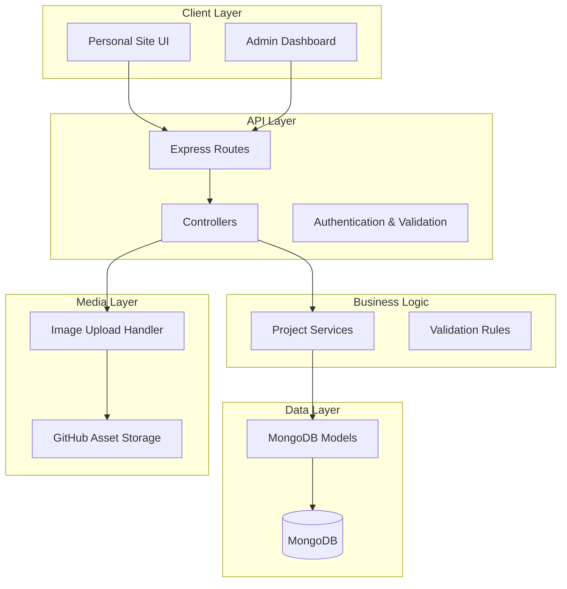

**Diagram sources**
- [projects.ts](file://server/src/routes/projects.ts#L1-L71)
- [projectController.ts](file://server/src/controllers/projectController.ts#L1-L926)
- [Project.ts](file://server/src/models/Project.ts#L1-L97)

**Section sources**
- [projects.ts](file://server/src/routes/projects.ts#L1-L71)
- [projectController.ts](file://server/src/controllers/projectController.ts#L1-L926)
- [Project.ts](file://server/src/models/Project.ts#L1-L97)

## Core Components

### Data Model Architecture

The Project model defines the complete structure for portfolio items with comprehensive validation and indexing:

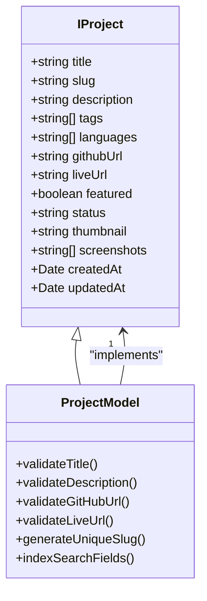

**Diagram sources**
- [Project.ts](file://server/src/models/Project.ts#L3-L17)

### Controller Layer Implementation

The controller layer implements comprehensive CRUD operations with advanced validation and error handling:

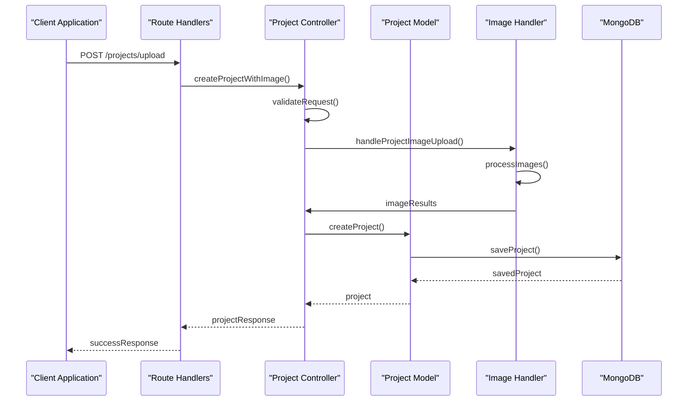

**Diagram sources**
- [projects.ts](file://server/src/routes/projects.ts#L59-L62)
- [projectController.ts](file://server/src/controllers/projectController.ts#L148-L329)
- [imageUploadHandler.ts](file://server/src/utils/imageUploadHandler.ts#L48-L199)

**Section sources**
- [Project.ts](file://server/src/models/Project.ts#L1-L97)
- [projectController.ts](file://server/src/controllers/projectController.ts#L1-L926)

## Architecture Overview

The Projects API employs a robust architecture with clear separation of concerns and comprehensive middleware integration:

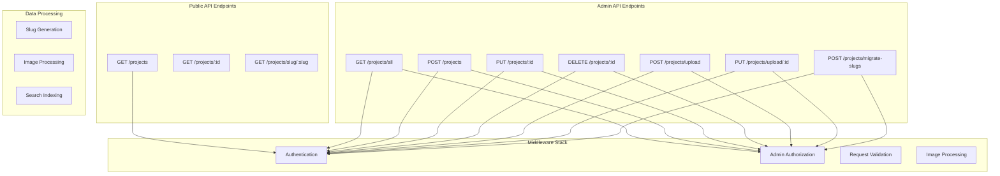

**Diagram sources**
- [projects.ts](file://server/src/routes/projects.ts#L36-L71)
- [projectController.ts](file://server/src/controllers/projectController.ts#L1-L926)

## Detailed Component Analysis

### Authentication and Authorization

The API implements a two-tier authentication system with role-based access control:

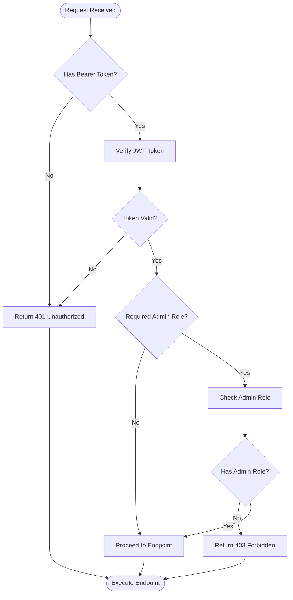

**Diagram sources**
- [projects.ts](file://server/src/routes/projects.ts#L2-L14)

### Request Validation Pipeline

The API implements comprehensive request validation using express-validator with custom validation rules:

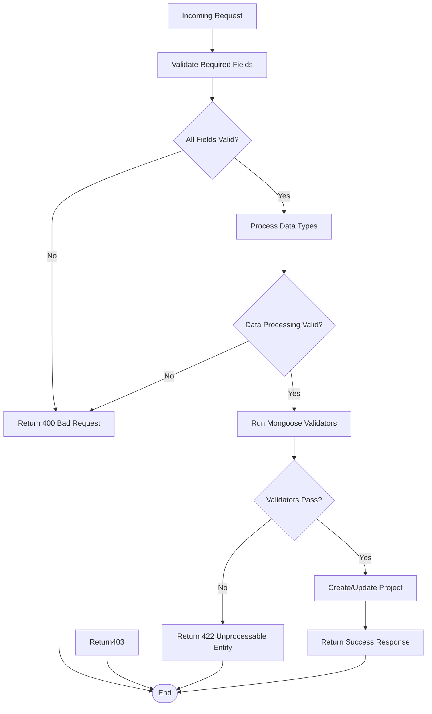

**Diagram sources**
- [projectController.ts](file://server/src/controllers/projectController.ts#L148-L329)

**Section sources**
- [projects.ts](file://server/src/routes/projects.ts#L1-L71)
- [projectController.ts](file://server/src/controllers/projectController.ts#L1-L926)

## API Reference

### Base URL
```
https://your-domain.com/api/projects
```

### Authentication Headers
```
Authorization: Bearer YOUR_ACCESS_TOKEN
Content-Type: application/json
```

### Public Endpoints

#### GET /projects
**Description**: Retrieve all published projects with pagination and filtering

**Query Parameters**:
- `page` (number, optional): Page number (default: 1)
- `limit` (number, optional): Items per page (default: 10, max: 100)
- `search` (string, optional): Search term for title, description, or tags
- `featured` (boolean, optional): Filter by featured projects only

**Response**:
```json
{
  "projects": [
    {
      "_id": "string",
      "title": "string",
      "slug": "string",
      "description": "string",
      "tags": ["string"],
      "languages": ["string"],
      "githubUrl": "string",
      "liveUrl": "string",
      "featured": "boolean",
      "status": "draft|published",
      "thumbnail": "string",
      "screenshots": ["string"],
      "createdAt": "string",
      "updatedAt": "string"
    }
  ],
  "totalPages": "number",
  "currentPage": "number",
  "total": "number"
}
```

#### GET /projects/:id
**Description**: Retrieve a specific project by ID

**Response**: Project object (same as above)

#### GET /projects/slug/:slug
**Description**: Retrieve a published project by slug

**Response**: Project object

### Admin Endpoints

#### GET /projects/all
**Description**: Retrieve all projects (including drafts) - Admin only

**Headers**: Authorization required

**Response**: Same as GET /projects but includes all statuses

#### POST /projects
**Description**: Create a new project (JSON payload)

**Request Body**:
```json
{
  "title": "string",
  "description": "string",
  "tags": ["string"],
  "languages": ["string"],
  "githubUrl": "string",
  "liveUrl": "string",
  "featured": "boolean",
  "status": "draft|published",
  "thumbnail": "string",
  "screenshots": ["string"]
}
```

**Response**: `{ message: "string", project: Project }`

#### POST /projects/upload
**Description**: Create a new project with image upload (FormData)

**Form Fields**:
- `title`: string (required)
- `description`: string (required)
- `tags`: string/array (required, minimum 1)
- `languages`: string/array (optional)
- `githubUrl`: string (optional, valid URL)
- `liveUrl`: string (optional, valid URL)
- `featured`: boolean (optional)
- `status`: "draft"|"published" (optional)
- `thumbnail`: file (optional, image)
- `screenshots`: files (optional, up to 10 images)

**Response**: `{ message: "string", project: Project }`

#### PUT /projects/:id
**Description**: Update a project (JSON payload)

**Request Body**: Partial project object (same structure as create)

**Response**: `{ message: "string", project: Project }`

#### PUT /projects/upload/:id
**Description**: Update a project with image upload (FormData)

**Form Fields**: Same as POST /projects/upload

**Response**: `{ message: "string", project: Project }`

#### DELETE /projects/:id
**Description**: Delete a project

**Response**: `{ message: "string" }`

#### POST /projects/migrate-slugs
**Description**: Backfill slugs for existing projects (Admin only)

**Response**: `{ message: "string", scanned: number, updated: number }`

**Section sources**
- [projects.ts](file://server/src/routes/projects.ts#L36-L71)
- [projectApi.ts](file://personalSite/src/api/projectApi.ts#L28-L259)

## Data Models

### Project Schema

The Project model defines the complete structure for portfolio items:

| Field | Type | Required | Validation | Description |
|-------|------|----------|------------|-------------|
| `_id` | ObjectId | Yes | Auto-generated | Unique identifier |
| `title` | String | Yes | 1-200 chars | Project title |
| `slug` | String | Yes | Unique, auto-generated | URL-friendly identifier |
| `description` | String | Yes | 1-1000 chars | Project description |
| `tags` | String[] | Yes | Minimum 1 | Technology tags |
| `languages` | String[] | No | Array | Programming languages |
| `githubUrl` | String | No | Valid URL | GitHub repository link |
| `liveUrl` | String | No | Valid URL | Live demo link |
| `featured` | Boolean | No | Default: false | Featured project flag |
| `status` | String | No | Enum: draft/published | Content status |
| `thumbnail` | String | No | Image URL | Featured image |
| `screenshots` | String[] | No | Array | Additional images |
| `createdAt` | Date | Yes | Auto-generated | Creation timestamp |
| `updatedAt` | Date | Yes | Auto-generated | Last update timestamp |

### Indexing Strategy

The database implements strategic indexing for optimal performance:

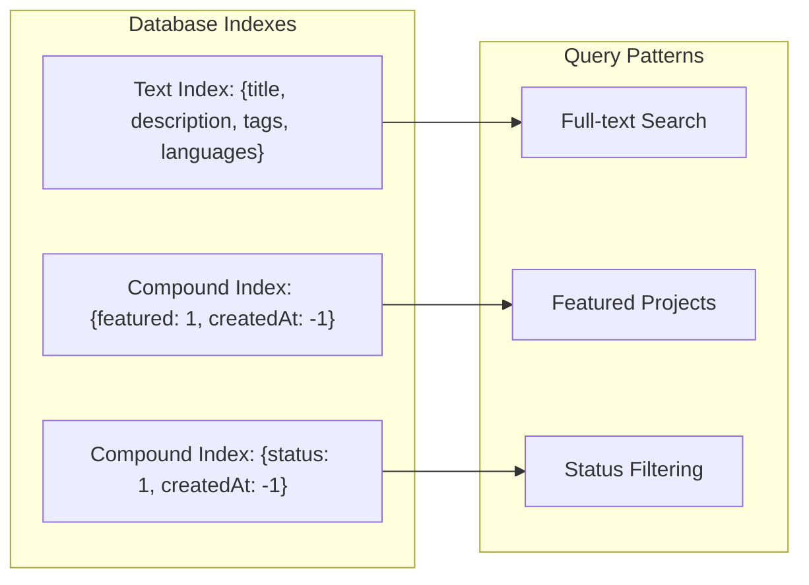

**Diagram sources**
- [Project.ts](file://server/src/models/Project.ts#L91-L96)

**Section sources**
- [Project.ts](file://server/src/models/Project.ts#L1-L97)

## Image Upload Workflow

### Image Processing Pipeline

The system implements a sophisticated image upload and processing workflow:

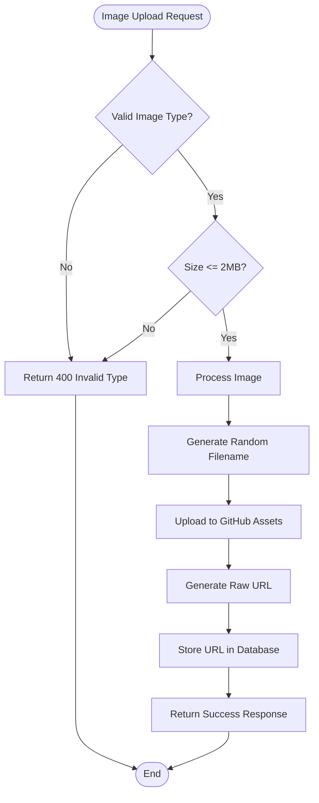

**Diagram sources**
- [imageUploadHandler.ts](file://server/src/utils/imageUploadHandler.ts#L48-L199)
- [imageUploadController.ts](file://server/src/controllers/imageUploadController.ts#L14-L137)

### Supported Image Formats

The system supports multiple image formats with automatic conversion:

| Format | MIME Type | Extension | Quality |
|--------|-----------|-----------|---------|
| PNG | image/png | .png | Lossless |
| JPEG | image/jpeg | .jpeg | High Quality |
| WebP | image/webp | .webp | Optimized |

### Image Processing Features

- **Automatic Resizing**: Maintains consistent aspect ratios
- **Compression**: Optimizes file sizes for web delivery
- **Security**: Validates file types and prevents malicious uploads
- **Caching**: Leverages CDN for fast image delivery

**Section sources**
- [imageUploadHandler.ts](file://server/src/utils/imageUploadHandler.ts#L1-L199)
- [imageUploadController.ts](file://server/src/controllers/imageUploadController.ts#L1-L137)

## Admin Operations

### Project Management Interface

The admin interface provides comprehensive project management capabilities:

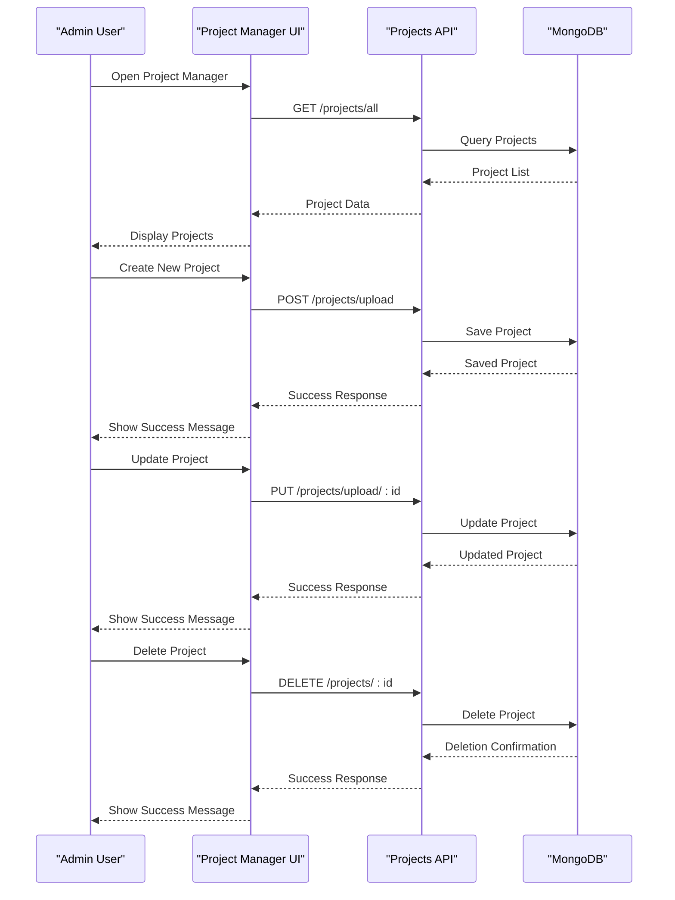

**Diagram sources**
- [ProjectManager.tsx](file://personalSite/src/pages/Admin/ProjectManager.tsx#L1-L864)
- [projectApi.ts](file://personalSite/src/api/projectApi.ts#L128-L259)

### Featured Project Management

The system includes advanced featured project management:

- **Priority Sorting**: Featured projects appear first in listings
- **Visual Indicators**: Clear badges and styling for featured items
- **Dynamic Updates**: Real-time status toggling
- **SEO Optimization**: Proper meta tags for featured projects

**Section sources**
- [ProjectManager.tsx](file://personalSite/src/pages/Admin/ProjectManager.tsx#L1-L864)
- [projectController.ts](file://server/src/controllers/projectController.ts#L25-L125)

## Performance Considerations

### Caching Strategy

The API implements intelligent caching for optimal performance:

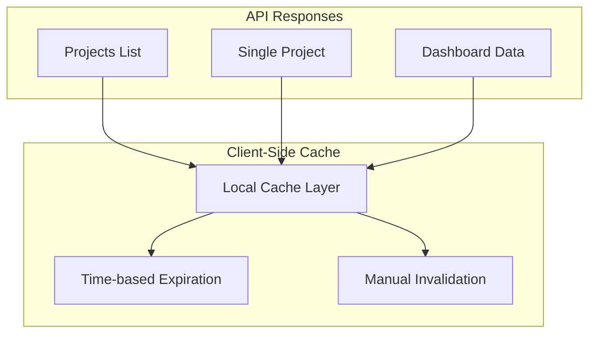

### Database Optimization

- **Text Indexing**: Full-text search capabilities for tags and descriptions
- **Compound Indexes**: Optimal query performance for common filters
- **Pagination**: Efficient cursor-based pagination for large datasets
- **Selective Loading**: Lazy loading of images and media assets

### Scalability Features

- **CDN Integration**: Static asset delivery via GitHub raw URLs
- **Connection Pooling**: Optimized database connections
- **Rate Limiting**: Protection against abuse
- **Error Monitoring**: Comprehensive logging and monitoring

## Troubleshooting Guide

### Common Issues and Solutions

#### Authentication Errors
- **401 Unauthorized**: Missing or invalid bearer token
- **403 Forbidden**: Insufficient permissions for admin endpoints
- **Solution**: Verify JWT token validity and admin role assignment

#### Validation Errors
- **400 Bad Request**: Invalid request format or missing required fields
- **422 Unprocessable Entity**: Data validation failures
- **Solution**: Check request payload against validation rules

#### Image Upload Issues
- **400 Bad Request**: Invalid file type or size exceeded
- **500 Internal Server Error**: GitHub API connectivity issues
- **Solution**: Verify file format (PNG/JPEG/WebP) and size (< 2MB)

#### Database Errors
- **500 Internal Server Error**: Database connection or query failures
- **Solution**: Check MongoDB connectivity and query optimization

### Debugging Tools

The system provides comprehensive error reporting:

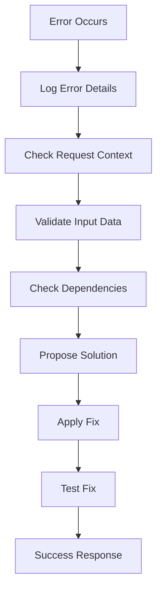

**Section sources**
- [projectController.ts](file://server/src/controllers/projectController.ts#L25-L125)
- [imageUploadController.ts](file://server/src/controllers/imageUploadController.ts#L14-L137)

## Conclusion

The Projects API provides a comprehensive solution for managing portfolio projects with enterprise-grade features including advanced validation, secure authentication, sophisticated image processing, and efficient caching. The modular architecture ensures scalability and maintainability while the extensive admin interface enables powerful content management capabilities.

Key strengths of the system include:

- **Robust Security**: Multi-layer authentication and authorization
- **Flexible Data Model**: Extensible schema supporting various project types
- **Advanced Media Handling**: Sophisticated image processing and CDN integration
- **Performance Optimization**: Intelligent caching and database indexing
- **Developer Experience**: Comprehensive API documentation and error handling

The system is well-suited for professional portfolio websites, developer showcases, and creative agency portfolios requiring sophisticated content management capabilities.