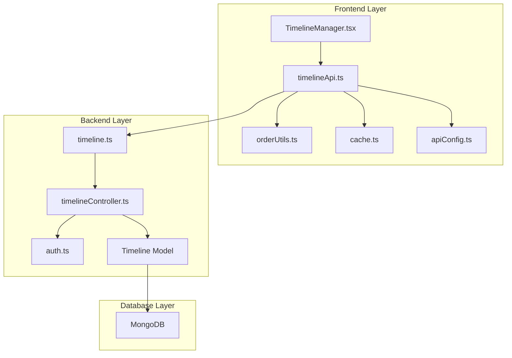
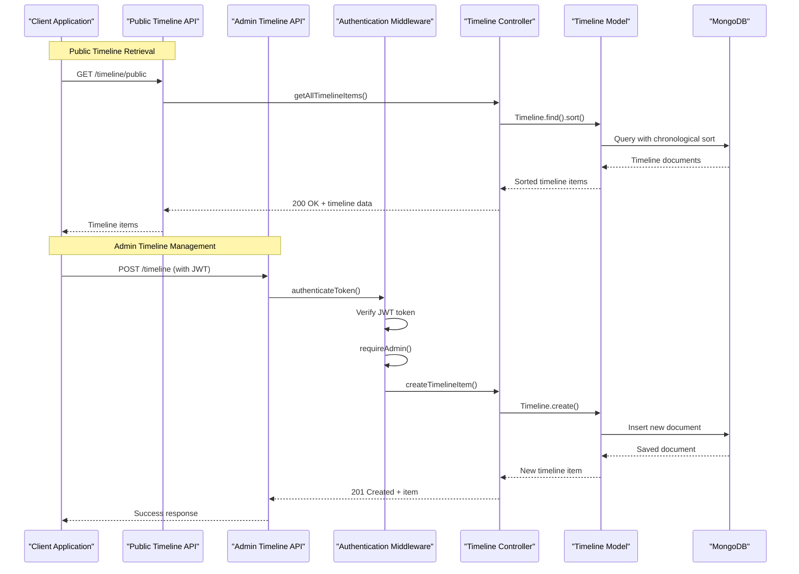
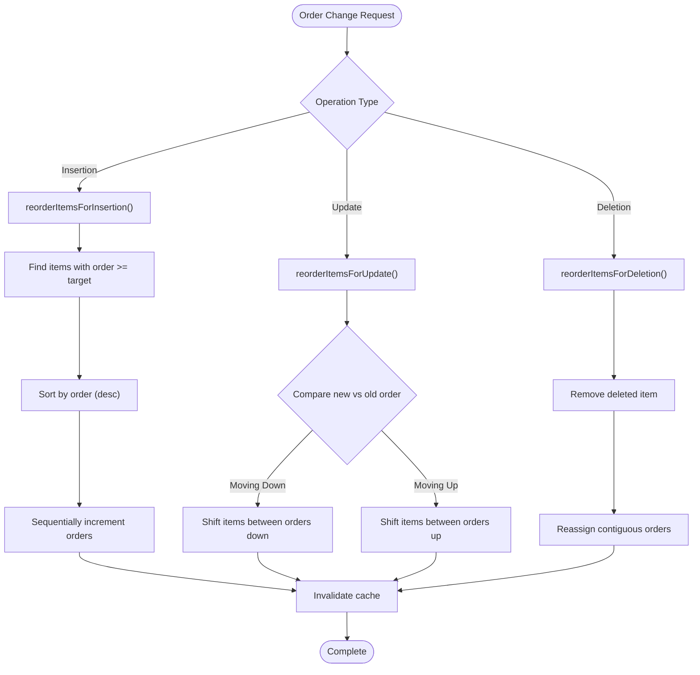
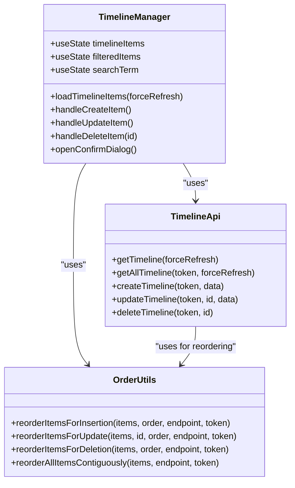
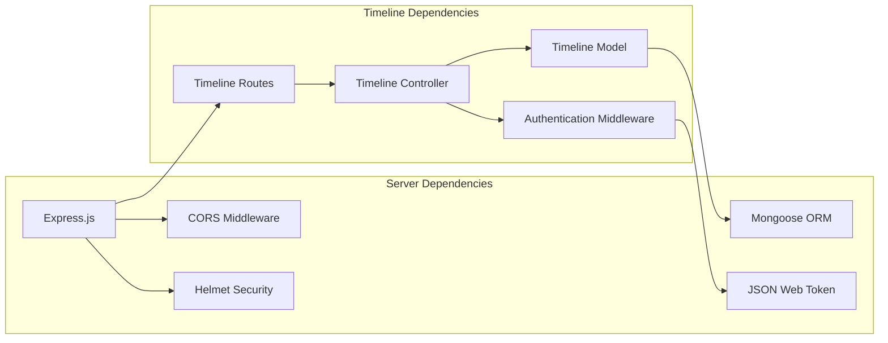

# Timeline API

<cite>
**Referenced Files in This Document**
- [server/src/models/Timeline.ts](file://server/src/models/Timeline.ts)
- [server/src/controllers/timelineController.ts](file://server/src/controllers/timelineController.ts)
- [server/src/routes/timeline.ts](file://server/src/routes/timeline.ts)
- [server/src/middleware/auth.ts](file://server/src/middleware/auth.ts)
- [server/src/index.ts](file://server/src/index.ts)
- [personalSite/src/api/timelineApi.ts](file://personalSite/src/api/timelineApi.ts)
- [personalSite/src/pages/Admin/TimelineManager.tsx](file://personalSite/src/pages/Admin/TimelineManager.tsx)
- [personalSite/src/lib/orderUtils.ts](file://personalSite/src/lib/orderUtils.ts)
- [personalSite/src/lib/cache.ts](file://personalSite/src/lib/cache.ts)
- [personalSite/src/lib/apiConfig.ts](file://personalSite/src/lib/apiConfig.ts)
</cite>

## Table of Contents
1. [Introduction](#introduction)
2. [Project Structure](#project-structure)
3. [Core Components](#core-components)
4. [Architecture Overview](#architecture-overview)
5. [Detailed Component Analysis](#detailed-component-analysis)
6. [Dependency Analysis](#dependency-analysis)
7. [Performance Considerations](#performance-considerations)
8. [Troubleshooting Guide](#troubleshooting-guide)
9. [Conclusion](#conclusion)

## Introduction
This document provides comprehensive API documentation for the Timeline management system. The Timeline API enables professional experience documentation, education history management, and career progression tracking through a complete CRUD interface. It supports both public consumption and administrative operations with robust authentication and authorization controls.

The system manages timeline entries with rich metadata including positions/roles, organizations/companies, date ranges, detailed descriptions, visual icons, and precise display ordering. Administrative operations are protected and include sophisticated ordering mechanisms to maintain chronological sequences.

## Project Structure
The Timeline API follows a layered architecture with clear separation between frontend client, backend server, and database persistence:



**Diagram sources**
- [personalSite/src/pages/Admin/TimelineManager.tsx](file://personalSite/src/pages/Admin/TimelineManager.tsx#L1-L403)
- [personalSite/src/api/timelineApi.ts](file://personalSite/src/api/timelineApi.ts#L1-L139)
- [server/src/routes/timeline.ts](file://server/src/routes/timeline.ts#L1-L35)
- [server/src/controllers/timelineController.ts](file://server/src/controllers/timelineController.ts#L1-L88)

**Section sources**
- [server/src/index.ts](file://server/src/index.ts#L109-L109)
- [server/src/routes/timeline.ts](file://server/src/routes/timeline.ts#L1-L35)

## Core Components

### Timeline Data Model
The Timeline system uses a structured data model designed for professional experience documentation:

| Field | Type | Required | Max Length | Description |
|-------|------|----------|------------|-------------|
| year | String | Yes | 50 characters | Date range or period (e.g., "2024 - Present") |
| role | String | Yes | 100 characters | Position title or role name |
| company | String | No | 100 characters | Organization or company name |
| description | String | Yes | 1000 characters | Detailed responsibilities and achievements |
| icon | String | Yes | 50 characters | Visual icon identifier (Briefcase, Clock, etc.) |
| order | Number | No | Integer | Display ordering priority |
| createdAt | Date | Auto-generated | N/A | Timestamp of creation |
| updatedAt | Date | Auto-generated | N/A | Timestamp of last update |

### Authentication & Authorization
The system implements a two-tier authentication approach:
- **Public Access**: Timeline retrieval requires no authentication
- **Administrative Access**: All write operations require JWT authentication and admin role verification

**Section sources**
- [server/src/models/Timeline.ts](file://server/src/models/Timeline.ts#L3-L56)
- [server/src/middleware/auth.ts](file://server/src/middleware/auth.ts#L9-L37)

## Architecture Overview



**Diagram sources**
- [server/src/routes/timeline.ts](file://server/src/routes/timeline.ts#L13-L33)
- [server/src/controllers/timelineController.ts](file://server/src/controllers/timelineController.ts#L4-L88)
- [server/src/middleware/auth.ts](file://server/src/middleware/auth.ts#L9-L37)

## Detailed Component Analysis

### API Endpoints

#### GET /timeline/public
**Purpose**: Retrieve all timeline items for public consumption without authentication
**Response**: Array of timeline items ordered chronologically by display priority

#### GET /timeline
**Purpose**: Retrieve all timeline items for administrative purposes
**Authentication**: Required (JWT token)
**Authorization**: Admin role required
**Response**: Array of timeline items ordered by display priority

#### GET /timeline/:id
**Purpose**: Retrieve a specific timeline item by ID
**Authentication**: Required (JWT token for admin operations)
**Response**: Single timeline item object

#### POST /timeline
**Purpose**: Create a new timeline item
**Authentication**: Required (JWT token)
**Authorization**: Admin role required
**Request Body**: Timeline item fields (excluding auto-generated fields)
**Response**: Created timeline item with generated ID

#### PUT /timeline/:id
**Purpose**: Update an existing timeline item
**Authentication**: Required (JWT token)
**Authorization**: Admin role required
**Request Body**: Timeline item fields to update
**Response**: Updated timeline item

#### DELETE /timeline/:id
**Purpose**: Remove a timeline item
**Authentication**: Required (JWT token)
**Authorization**: Admin role required
**Response**: Success message

### Request/Response Schemas

#### Timeline Item Structure
```typescript
interface TimelineItem {
  _id: string;
  year: string;
  role: string;
  company: string;
  description: string;
  icon: string;
  order: number;
  createdAt: string;
  updatedAt: string;
}
```

#### Request Validation Rules
- **year**: Required string, max 50 characters
- **role**: Required string, max 100 characters  
- **company**: Optional string, max 100 characters
- **description**: Required string, max 1000 characters
- **icon**: Required string, max 50 characters
- **order**: Optional number, defaults to 0

### Chronological Ordering System

The system maintains precise chronological ordering through a sophisticated reordering mechanism:



**Diagram sources**
- [personalSite/src/lib/orderUtils.ts](file://personalSite/src/lib/orderUtils.ts#L47-L237)

**Section sources**
- [server/src/controllers/timelineController.ts](file://server/src/controllers/timelineController.ts#L4-L12)
- [personalSite/src/lib/orderUtils.ts](file://personalSite/src/lib/orderUtils.ts#L47-L237)

### Frontend Integration

The client-side implementation provides comprehensive administrative capabilities:



**Diagram sources**
- [personalSite/src/pages/Admin/TimelineManager.tsx](file://personalSite/src/pages/Admin/TimelineManager.tsx#L25-L403)
- [personalSite/src/api/timelineApi.ts](file://personalSite/src/api/timelineApi.ts#L21-L139)
- [personalSite/src/lib/orderUtils.ts](file://personalSite/src/lib/orderUtils.ts#L47-L237)

**Section sources**
- [personalSite/src/pages/Admin/TimelineManager.tsx](file://personalSite/src/pages/Admin/TimelineManager.tsx#L48-L148)
- [personalSite/src/api/timelineApi.ts](file://personalSite/src/api/timelineApi.ts#L21-L139)

## Dependency Analysis



**Diagram sources**
- [server/src/index.ts](file://server/src/index.ts#L1-L158)
- [server/src/routes/timeline.ts](file://server/src/routes/timeline.ts#L1-L35)
- [server/src/controllers/timelineController.ts](file://server/src/controllers/timelineController.ts#L1-L88)

**Section sources**
- [server/src/index.ts](file://server/src/index.ts#L1-L158)
- [server/src/middleware/auth.ts](file://server/src/middleware/auth.ts#L1-L37)

## Performance Considerations

### Caching Strategy
The frontend implements intelligent caching with automatic invalidation:

- **Cache Keys**: Dedicated cache keys for timeline data (`timeline:all`)
- **TTL Management**: 5-minute default expiration
- **Automatic Invalidation**: Cache cleared on create/update/delete operations
- **Pattern Matching**: Supports wildcard invalidation for related endpoints

### Database Optimization
- **Indexing**: Display order field indexed for efficient sorting
- **Query Optimization**: Single collection with embedded documents
- **Pagination**: Not currently implemented (suitable for small datasets)

### Network Efficiency
- **Conditional Requests**: Cache-aware API calls
- **Batch Operations**: Sequential reordering to prevent conflicts
- **Minimal Payloads**: Optimized response sizes for timeline data

## Troubleshooting Guide

### Common Issues and Solutions

#### Authentication Problems
**Issue**: 401 Access token required or 403 Invalid/expired token
**Solution**: Ensure JWT token is included in Authorization header with "Bearer" prefix

#### Authorization Issues  
**Issue**: 403 Admin access required
**Solution**: Verify user has admin role in the system

#### Data Validation Errors
**Issue**: Validation errors on create/update operations
**Solution**: Check field length limits and required fields:
- year: 50 characters max
- role: 100 characters max
- company: 100 characters max
- description: 1000 characters max
- icon: 50 characters max

#### Ordering Conflicts
**Issue**: Timeline items not appearing in expected order
**Solution**: Use the reordering utilities to resolve conflicts:
- `reorderItemsForInsertion()` for new items
- `reorderItemsForUpdate()` for moved items  
- `reorderItemsForDeletion()` for removed items

#### Cache Issues
**Issue**: Stale timeline data displayed
**Solution**: Force refresh by passing `forceRefresh=true` parameter or clearing browser cache

**Section sources**
- [server/src/middleware/auth.ts](file://server/src/middleware/auth.ts#L14-L29)
- [personalSite/src/lib/cache.ts](file://personalSite/src/lib/cache.ts#L12-L96)

## Conclusion

The Timeline API provides a robust foundation for professional experience documentation with comprehensive CRUD operations, sophisticated ordering mechanisms, and secure administrative controls. The system balances simplicity for public consumption with powerful management capabilities for administrators.

Key strengths include:
- **Flexible Data Model**: Accommodates various timeline types (experience, education, certifications)
- **Intelligent Ordering**: Sophisticated reordering system prevents conflicts
- **Security**: Proper authentication and authorization boundaries
- **Performance**: Efficient caching and database design
- **Developer Experience**: Clean API design with comprehensive error handling

The implementation supports modern web development practices while maintaining simplicity for both developers and end users. The modular architecture allows for easy extension to support additional timeline types or enhanced features as requirements evolve.