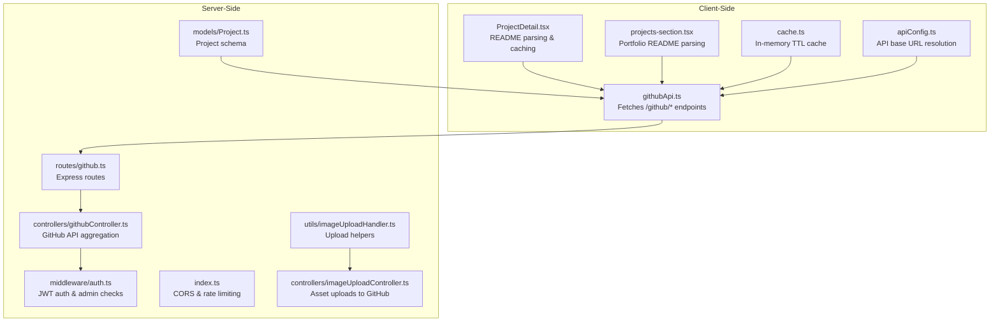
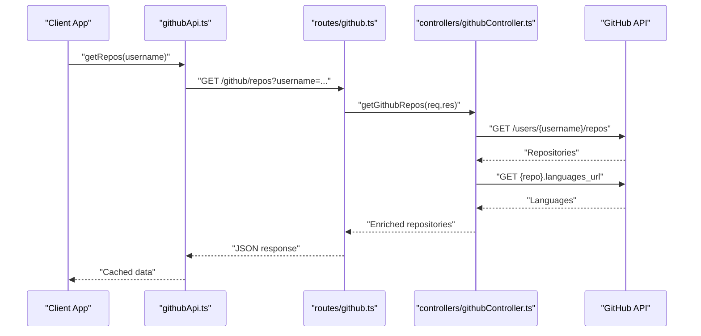
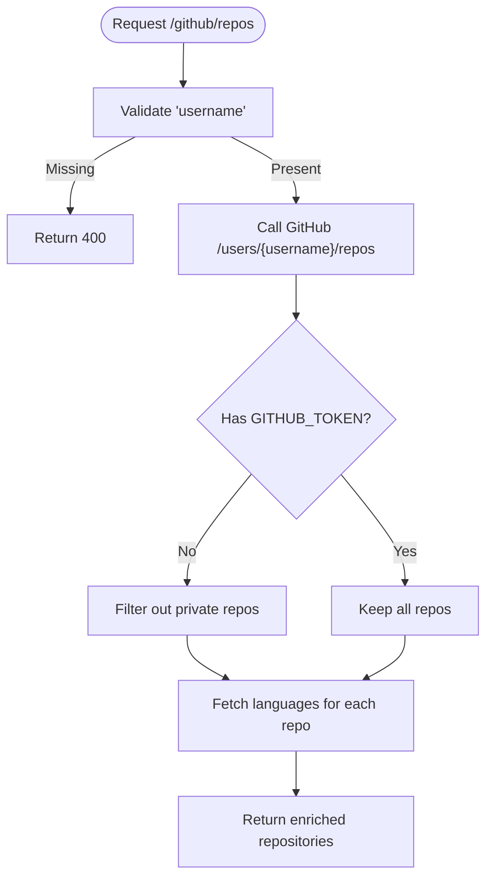
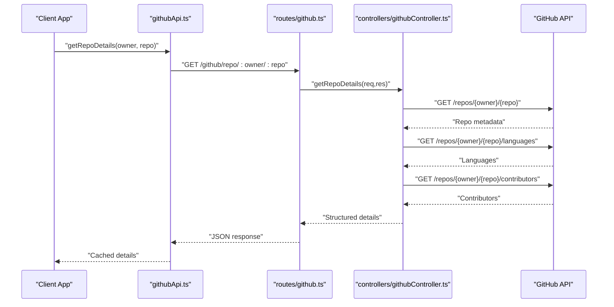
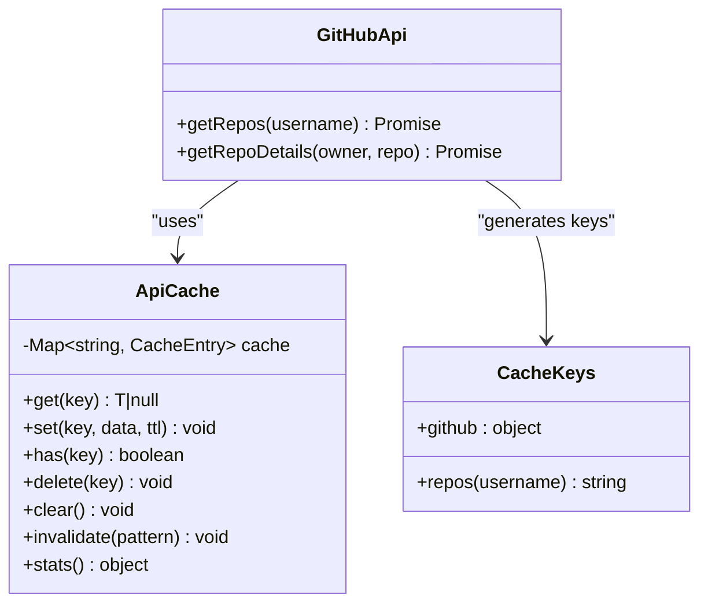
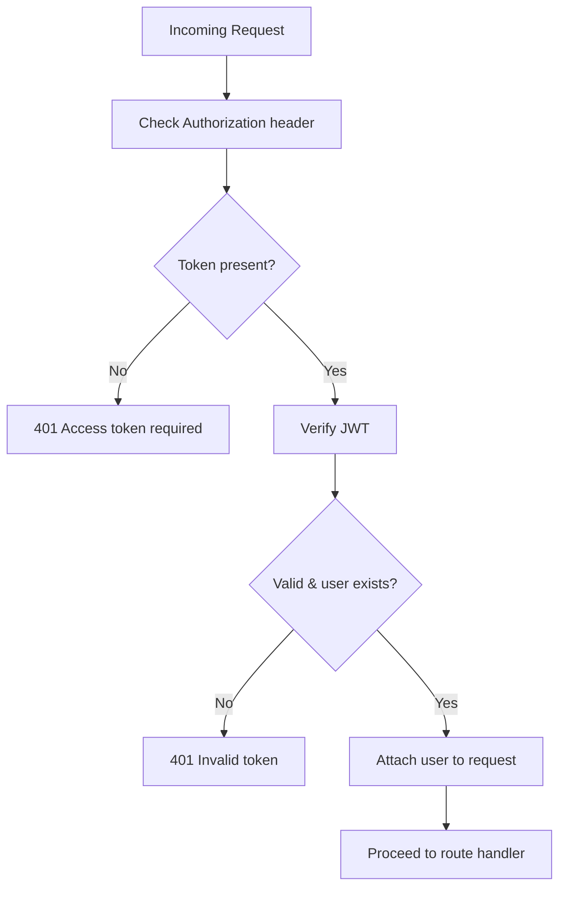
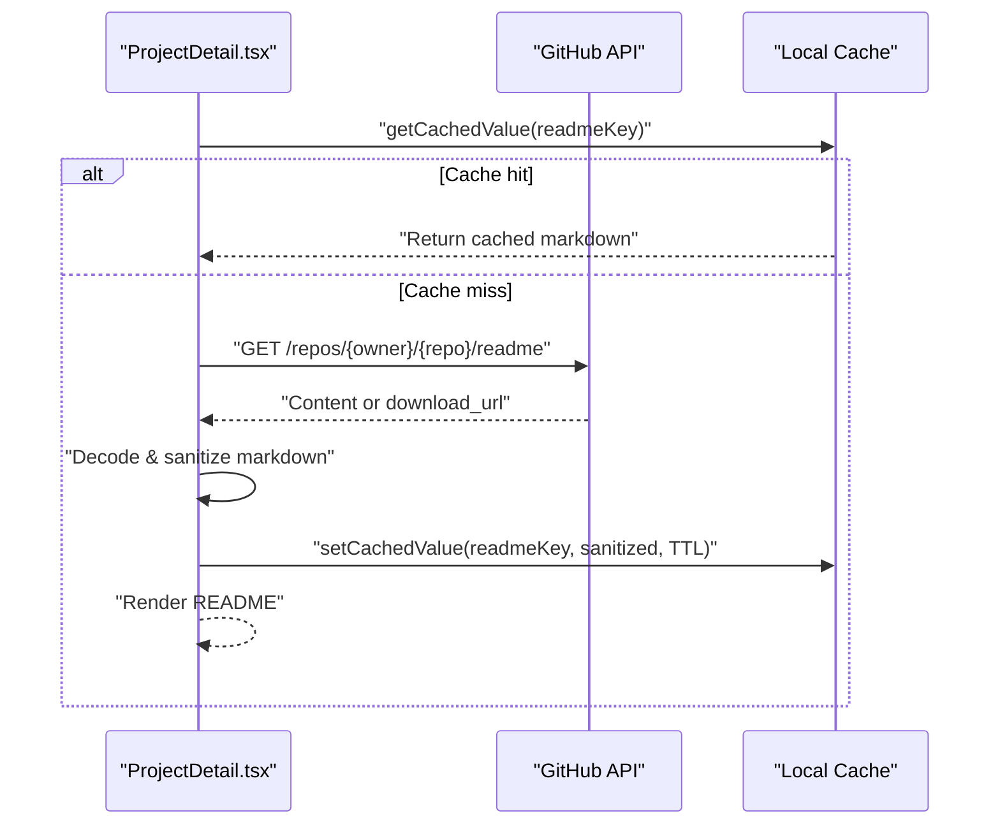
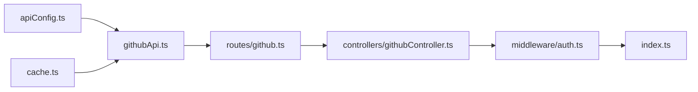

# GitHub Integration API

<cite>
**Referenced Files in This Document**
- [githubApi.ts](file://personalSite/src/api/githubApi.ts)
- [cache.ts](file://personalSite/src/lib/cache.ts)
- [apiConfig.ts](file://personalSite/src/lib/apiConfig.ts)
- [github.ts](file://server/src/routes/github.ts)
- [githubController.ts](file://server/src/controllers/githubController.ts)
- [auth.ts](file://server/src/middleware/auth.ts)
- [index.ts](file://server/src/index.ts)
- [Project.ts](file://server/src/models/Project.ts)
- [imageUploadController.ts](file://server/src/controllers/imageUploadController.ts)
- [imageUploadHandler.ts](file://server/src/utils/imageUploadHandler.ts)
- [projects-section.tsx](file://portfolio/src/components/sections/projects-section.tsx)
- [ProjectDetail.tsx](file://personalSite/src/pages/ProjectDetail.tsx)
</cite>

## Table of Contents
1. [Introduction](#introduction)
2. [Project Structure](#project-structure)
3. [Core Components](#core-components)
4. [Architecture Overview](#architecture-overview)
5. [Detailed Component Analysis](#detailed-component-analysis)
6. [Dependency Analysis](#dependency-analysis)
7. [Performance Considerations](#performance-considerations)
8. [Troubleshooting Guide](#troubleshooting-guide)
9. [Conclusion](#conclusion)

## Introduction
This document provides comprehensive API documentation for GitHub integration endpoints within the portfolio application. It covers:
- Repository data endpoints for fetching GitHub repositories with sorting and pagination
- Project synchronization workflows and webhook support considerations
- Real-time update mechanisms via polling intervals, cache management, and data freshness policies
- Error handling for GitHub API rate limits, repository visibility restrictions, and network connectivity issues
- Authentication requirements for accessing private repositories, OAuth integration patterns, and token management
- Examples of repository metadata extraction, README parsing, and thumbnail generation from repository content
- Performance optimization through caching strategies and batch processing for large repository collections

## Project Structure
The GitHub integration spans client-side and server-side components:
- Client-side API wrapper and caching utilities
- Server-side routes and controllers for GitHub data aggregation
- Middleware for authentication and authorization
- Project model supporting GitHub URL linkage and media assets
- Image upload controller/utilities for generating thumbnails and screenshots
- Portfolio and personal site pages implementing README parsing and caching

**Diagram sources**
- [githubApi.ts](file://personalSite/src/api/githubApi.ts#L1-L46)
- [cache.ts](file://personalSite/src/lib/cache.ts#L1-L137)
- [apiConfig.ts](file://personalSite/src/lib/apiConfig.ts#L1-L75)
- [github.ts](file://server/src/routes/github.ts#L1-L9)
- [githubController.ts](file://server/src/controllers/githubController.ts#L1-L177)
- [auth.ts](file://server/src/middleware/auth.ts#L1-L37)
- [index.ts](file://server/src/index.ts#L61-L107)
- [Project.ts](file://server/src/models/Project.ts#L55-L96)
- [imageUploadController.ts](file://server/src/controllers/imageUploadController.ts#L1-L137)
- [imageUploadHandler.ts](file://server/src/utils/imageUploadHandler.ts#L1-L199)
- [ProjectDetail.tsx](file://personalSite/src/pages/ProjectDetail.tsx#L687-L737)
- [projects-section.tsx](file://portfolio/src/components/sections/projects-section.tsx#L199-L297)

**Section sources**
- [githubApi.ts](file://personalSite/src/api/githubApi.ts#L1-L46)
- [cache.ts](file://personalSite/src/lib/cache.ts#L1-L137)
- [apiConfig.ts](file://personalSite/src/lib/apiConfig.ts#L1-L75)
- [github.ts](file://server/src/routes/github.ts#L1-L9)
- [githubController.ts](file://server/src/controllers/githubController.ts#L1-L177)
- [auth.ts](file://server/src/middleware/auth.ts#L1-L37)
- [index.ts](file://server/src/index.ts#L61-L107)
- [Project.ts](file://server/src/models/Project.ts#L55-L96)
- [imageUploadController.ts](file://server/src/controllers/imageUploadController.ts#L1-L137)
- [imageUploadHandler.ts](file://server/src/utils/imageUploadHandler.ts#L1-L199)
- [ProjectDetail.tsx](file://personalSite/src/pages/ProjectDetail.tsx#L687-L737)
- [projects-section.tsx](file://portfolio/src/components/sections/projects-section.tsx#L199-L297)

## Core Components
- Client-side GitHub API wrapper:
  - Fetches repository lists and individual repository details
  - Implements in-memory caching with TTL and cache key utilities
- Server-side GitHub controller:
  - Aggregates repository metadata, languages, and contributors
  - Applies visibility filtering and handles rate limit errors
- Authentication middleware:
  - Validates JWT tokens and enforces admin roles for protected operations
- Project model:
  - Stores GitHub URL, live URL, featured flag, status, and media assets
- Image upload utilities:
  - Uploads images to a configured GitHub repository and returns raw URLs
- README parsing:
  - Client-side parsing of repository README content with caching and sanitization

**Section sources**
- [githubApi.ts](file://personalSite/src/api/githubApi.ts#L1-L46)
- [cache.ts](file://personalSite/src/lib/cache.ts#L1-L137)
- [githubController.ts](file://server/src/controllers/githubController.ts#L1-L177)
- [auth.ts](file://server/src/middleware/auth.ts#L1-L37)
- [Project.ts](file://server/src/models/Project.ts#L55-L96)
- [imageUploadController.ts](file://server/src/controllers/imageUploadController.ts#L1-L137)
- [imageUploadHandler.ts](file://server/src/utils/imageUploadHandler.ts#L1-L199)
- [ProjectDetail.tsx](file://personalSite/src/pages/ProjectDetail.tsx#L687-L737)
- [projects-section.tsx](file://portfolio/src/components/sections/projects-section.tsx#L199-L297)

## Architecture Overview
The GitHub integration follows a layered architecture:
- Client-side fetches aggregated data from server endpoints
- Server routes delegate to controllers that call GitHub APIs
- Controllers enrich data with language and contributor details
- Authentication middleware secures sensitive operations
- Caching improves performance and reduces external API load

**Diagram sources**
- [githubApi.ts](file://personalSite/src/api/githubApi.ts#L1-L46)
- [github.ts](file://server/src/routes/github.ts#L1-L9)
- [githubController.ts](file://server/src/controllers/githubController.ts#L1-L177)

## Detailed Component Analysis

### GitHub Repositories Endpoint
- Endpoint: GET /github/repos
- Query parameters:
  - username (required)
  - sort (default: updated)
  - direction (default: desc)
  - page (default: 1)
  - per_page (default: 10)
- Behavior:
  - Calls GitHub API to fetch user repositories
  - Filters out private repositories when no token is present
  - Enriches each repository with top languages
  - Returns structured repository metadata

**Diagram sources**
- [githubController.ts](file://server/src/controllers/githubController.ts#L4-L100)

**Section sources**
- [githubController.ts](file://server/src/controllers/githubController.ts#L4-L100)
- [github.ts](file://server/src/routes/github.ts#L6-L6)

### Individual Repository Details Endpoint
- Endpoint: GET /github/repo/:owner/:repo
- Behavior:
  - Fetches repository metadata, languages, contributors, and license information
  - Returns standardized repository details for display and synchronization

**Diagram sources**
- [githubApi.ts](file://personalSite/src/api/githubApi.ts#L27-L45)
- [github.ts](file://server/src/routes/github.ts#L7-L7)
- [githubController.ts](file://server/src/controllers/githubController.ts#L102-L177)

**Section sources**
- [githubApi.ts](file://personalSite/src/api/githubApi.ts#L27-L45)
- [githubController.ts](file://server/src/controllers/githubController.ts#L102-L177)
- [github.ts](file://server/src/routes/github.ts#L7-L7)

### Client-Side Caching and API Wrapper
- The client-side wrapper caches responses with TTL and uses cache keys for repository lists and individual repositories
- Cache keys are generated centrally to ensure consistency across the application

**Diagram sources**
- [cache.ts](file://personalSite/src/lib/cache.ts#L12-L96)
- [cache.ts](file://personalSite/src/lib/cache.ts#L101-L136)
- [githubApi.ts](file://personalSite/src/api/githubApi.ts#L1-L46)

**Section sources**
- [githubApi.ts](file://personalSite/src/api/githubApi.ts#L1-L46)
- [cache.ts](file://personalSite/src/lib/cache.ts#L1-L137)

### Authentication and Token Management
- Authentication middleware validates JWT tokens and attaches user context
- Admin role enforcement for privileged operations
- GitHub API calls can include an optional bearer token for higher rate limits and private repository access

**Diagram sources**
- [auth.ts](file://server/src/middleware/auth.ts#L9-L30)

**Section sources**
- [auth.ts](file://server/src/middleware/auth.ts#L1-L37)
- [githubController.ts](file://server/src/controllers/githubController.ts#L20-L23)

### README Parsing and Thumbnail Generation
- README parsing:
  - Fetches README content from GitHub API
  - Handles base64-encoded content or direct download URLs
  - Sanitizes markdown and caches results with TTL and stale-while-revalidate behavior
- Thumbnail generation:
  - Uploads images to a configured GitHub repository using a dedicated token
  - Returns raw URLs suitable for embedding

**Diagram sources**
- [ProjectDetail.tsx](file://personalSite/src/pages/ProjectDetail.tsx#L694-L734)
- [projects-section.tsx](file://portfolio/src/components/sections/projects-section.tsx#L219-L270)

**Section sources**
- [ProjectDetail.tsx](file://personalSite/src/pages/ProjectDetail.tsx#L687-L737)
- [projects-section.tsx](file://portfolio/src/components/sections/projects-section.tsx#L199-L297)
- [imageUploadController.ts](file://server/src/controllers/imageUploadController.ts#L14-L137)
- [imageUploadHandler.ts](file://server/src/utils/imageUploadHandler.ts#L47-L199)

### Project Synchronization and Webhook Support
- Current implementation:
  - Client-side polling via cache TTL and manual refresh triggers
  - Server-side aggregation of repository metadata for display
- Recommended webhook integration:
  - GitHub webhook endpoint to receive push/branch events
  - On event, invalidate related caches and trigger partial updates
  - Combine with scheduled polling for resilience

[No sources needed since this section provides conceptual guidance]

## Dependency Analysis
- Client-side depends on:
  - API base URL configuration
  - Centralized cache utilities
  - GitHub API wrapper for endpoint access
- Server-side depends on:
  - Express routes and controllers
  - GitHub API with optional token
  - Authentication middleware
  - CORS and rate limiting configuration

**Diagram sources**
- [apiConfig.ts](file://personalSite/src/lib/apiConfig.ts#L1-L75)
- [cache.ts](file://personalSite/src/lib/cache.ts#L1-L137)
- [githubApi.ts](file://personalSite/src/api/githubApi.ts#L1-L46)
- [github.ts](file://server/src/routes/github.ts#L1-L9)
- [githubController.ts](file://server/src/controllers/githubController.ts#L1-L177)
- [auth.ts](file://server/src/middleware/auth.ts#L1-L37)
- [index.ts](file://server/src/index.ts#L61-L107)

**Section sources**
- [apiConfig.ts](file://personalSite/src/lib/apiConfig.ts#L1-L75)
- [cache.ts](file://personalSite/src/lib/cache.ts#L1-L137)
- [githubApi.ts](file://personalSite/src/api/githubApi.ts#L1-L46)
- [github.ts](file://server/src/routes/github.ts#L1-L9)
- [githubController.ts](file://server/src/controllers/githubController.ts#L1-L177)
- [auth.ts](file://server/src/middleware/auth.ts#L1-L37)
- [index.ts](file://server/src/index.ts#L61-L107)

## Performance Considerations
- Caching strategies:
  - Client-side TTL cache for repository lists and details
  - Server-side aggregation reduces redundant GitHub API calls
- Batch processing:
  - Parallel enrichment of languages and contributors
- Polling intervals:
  - Adjust per_page and page to paginate efficiently
  - Use cache invalidation patterns to refresh selectively
- Network optimization:
  - Prefer download_url for README content when available
  - Apply stale-while-revalidate for improved perceived performance

[No sources needed since this section provides general guidance]

## Troubleshooting Guide
- GitHub API rate limits:
  - Server returns explicit 403 for rate limit exceeded
  - Provide GITHUB_TOKEN to increase limits and access private repositories
- Repository visibility restrictions:
  - Without token, private repositories are filtered out
  - Ensure token has appropriate scopes for private access
- Network connectivity issues:
  - Client-side cache helps serve stale data when upstream fails
  - README parsing includes fallback to stale cache when available
- Authentication failures:
  - Missing or invalid JWT results in 401/403 responses
  - Admin-protected operations require role verification

**Section sources**
- [githubController.ts](file://server/src/controllers/githubController.ts#L88-L99)
- [githubController.ts](file://server/src/controllers/githubController.ts#L165-L176)
- [auth.ts](file://server/src/middleware/auth.ts#L14-L29)
- [projects-section.tsx](file://portfolio/src/components/sections/projects-section.tsx#L263-L269)
- [ProjectDetail.tsx](file://personalSite/src/pages/ProjectDetail.tsx#L723-L729)

## Conclusion
The GitHub integration provides a robust foundation for displaying and synchronizing portfolio projects with GitHub repositories. By leveraging caching, token-based authentication, and structured metadata enrichment, the system balances performance and reliability. Extending the solution with webhook-driven updates and refined polling strategies will further enhance real-time accuracy and reduce unnecessary API load.