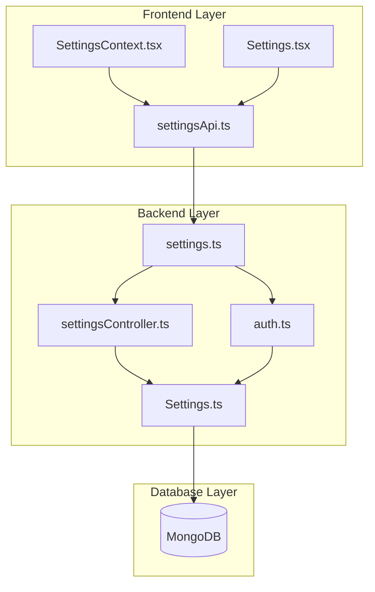
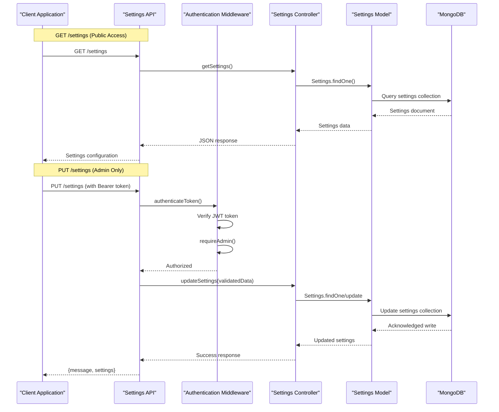
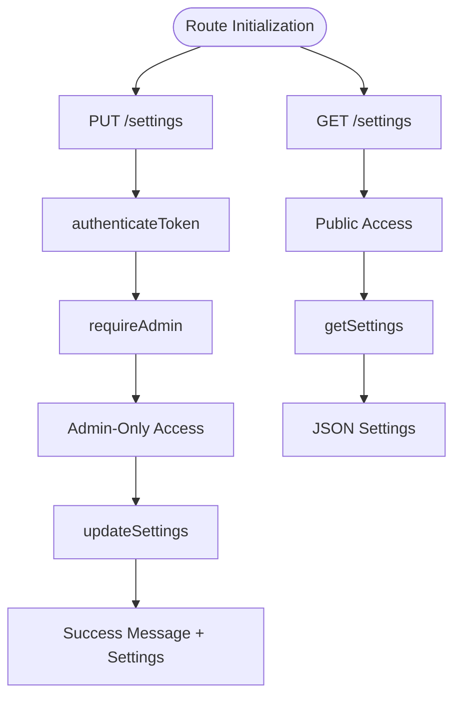
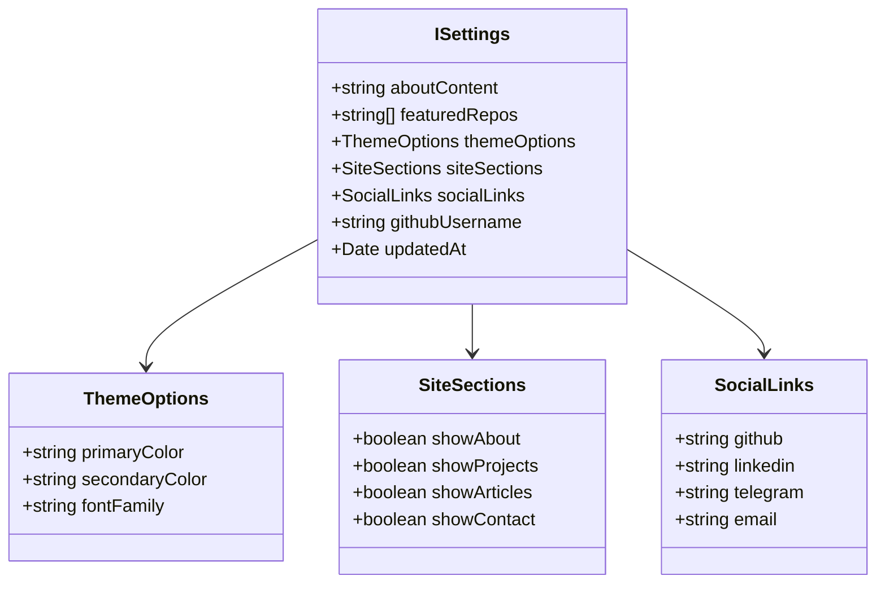
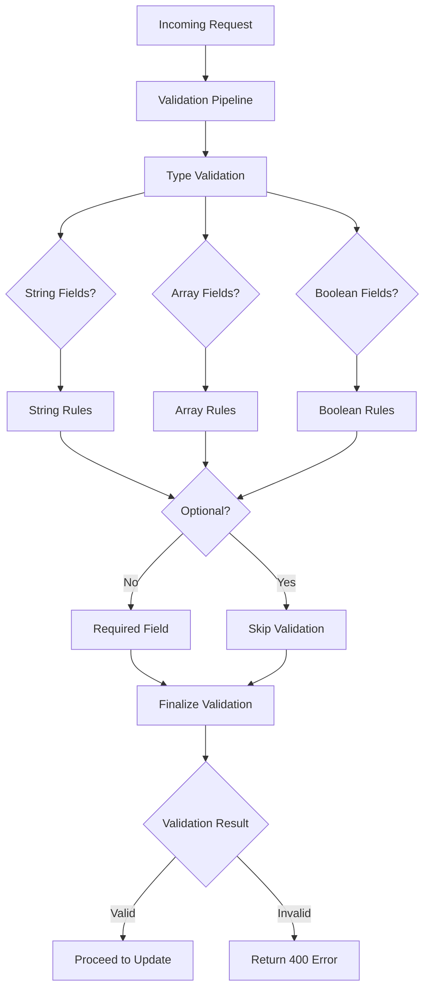
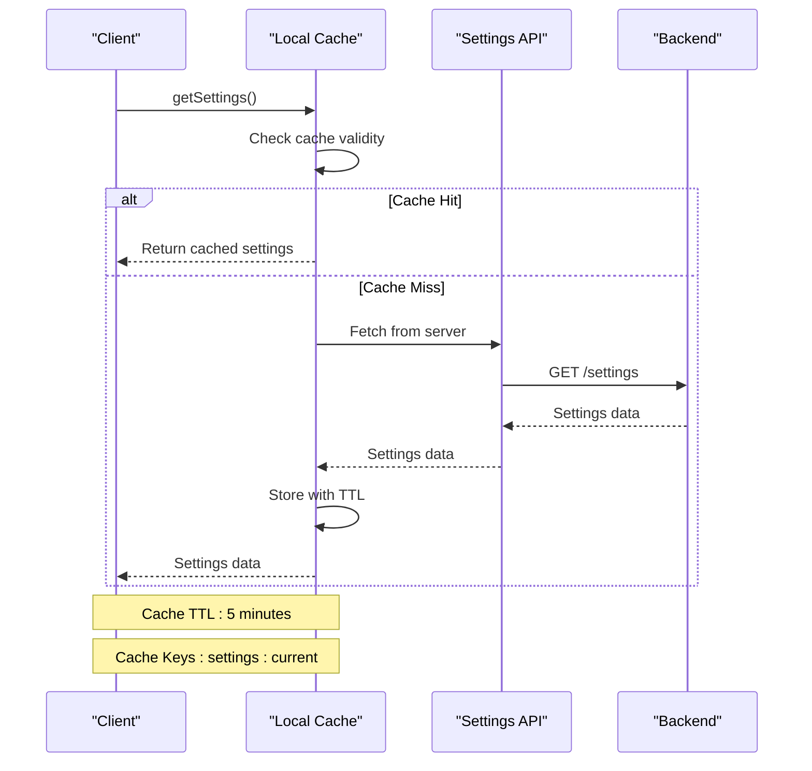
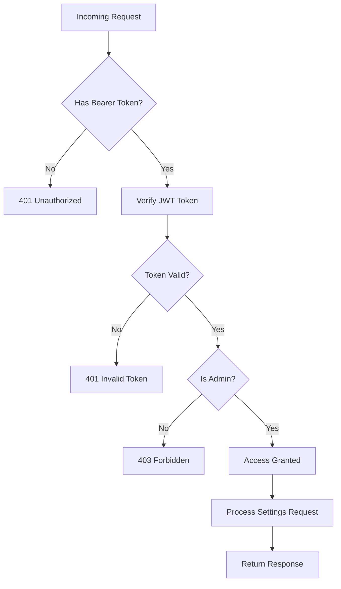

# Settings API

<cite>
**Referenced Files in This Document**
- [settings.ts](file://server/src/routes/settings.ts)
- [settingsController.ts](file://server/src/controllers/settingsController.ts)
- [Settings.ts](file://server/src/models/Settings.ts)
- [auth.ts](file://server/src/middleware/auth.ts)
- [settingsApi.ts](file://personalSite/src/api/settingsApi.ts)
- [Settings.tsx](file://personalSite/src/pages/Admin/Settings.tsx)
- [SettingsContext.tsx](file://personalSite/src/contexts/SettingsContext.tsx)
- [cache.ts](file://personalSite/src/lib/cache.ts)
</cite>

## Table of Contents
1. [Introduction](#introduction)
2. [Project Structure](#project-structure)
3. [Core Components](#core-components)
4. [Architecture Overview](#architecture-overview)
5. [Detailed Component Analysis](#detailed-component-analysis)
6. [API Specification](#api-specification)
7. [Settings Categories](#settings-categories)
8. [Validation Rules](#validation-rules)
9. [Caching and Performance](#caching-and-performance)
10. [Security Considerations](#security-considerations)
11. [Troubleshooting Guide](#troubleshooting-guide)
12. [Conclusion](#conclusion)

## Introduction

The Settings API provides comprehensive site configuration and management capabilities for the portfolio website. This API enables retrieval and modification of various site-wide settings including theme preferences, SEO configurations, social media links, contact information, and visibility controls for different site sections.

The API follows RESTful principles with two distinct endpoints:
- GET `/settings` - Public endpoint for retrieving current site configuration
- PUT `/settings` - Admin-only endpoint for updating site-wide configuration

## Project Structure

The Settings API implementation spans across multiple layers of the application architecture:



**Diagram sources**
- [settings.ts](file://server/src/routes/settings.ts#L1-L16)
- [settingsController.ts](file://server/src/controllers/settingsController.ts#L1-L119)
- [Settings.ts](file://server/src/models/Settings.ts#L1-L82)

**Section sources**
- [settings.ts](file://server/src/routes/settings.ts#L1-L16)
- [settingsController.ts](file://server/src/controllers/settingsController.ts#L1-L119)
- [Settings.ts](file://server/src/models/Settings.ts#L1-L82)

## Core Components

### Backend Implementation

The backend implementation consists of four main components working together:

1. **Route Handler**: Defines the HTTP endpoints and applies authentication middleware
2. **Controller**: Contains business logic for settings retrieval and updates
3. **Model**: Defines the MongoDB schema and default values
4. **Middleware**: Handles authentication and authorization

### Frontend Integration

The frontend provides comprehensive settings management through:
- API client with caching capabilities
- Settings context for global state management
- Admin interface for configuration updates

**Section sources**
- [settingsController.ts](file://server/src/controllers/settingsController.ts#L1-L119)
- [Settings.ts](file://server/src/models/Settings.ts#L1-L82)
- [auth.ts](file://server/src/middleware/auth.ts#L1-L37)

## Architecture Overview

The Settings API follows a layered architecture pattern with clear separation of concerns:



**Diagram sources**
- [settings.ts](file://server/src/routes/settings.ts#L7-L14)
- [auth.ts](file://server/src/middleware/auth.ts#L9-L37)
- [settingsController.ts](file://server/src/controllers/settingsController.ts#L5-L119)

## Detailed Component Analysis

### Route Configuration

The settings routes are defined with clear access control policies:



**Diagram sources**
- [settings.ts](file://server/src/routes/settings.ts#L1-L16)

### Authentication and Authorization

The API implements a two-tier security model:

1. **Token Authentication**: Validates JWT tokens for all protected routes
2. **Role-Based Access Control**: Ensures only admin users can modify settings

**Section sources**
- [auth.ts](file://server/src/middleware/auth.ts#L9-L37)

### Settings Model and Validation

The Settings model defines the complete schema with comprehensive validation rules:



**Diagram sources**
- [Settings.ts](file://server/src/models/Settings.ts#L3-L25)

**Section sources**
- [Settings.ts](file://server/src/models/Settings.ts#L27-L82)

## API Specification

### GET /settings

**Endpoint**: `GET /settings`

**Description**: Retrieves the current site configuration. Returns default settings if none exist.

**Response Format**: JSON object containing all settings categories

**Success Response**: `200 OK`
```json
{
  "aboutContent": "string",
  "featuredRepos": ["string"],
  "themeOptions": {
    "primaryColor": "string",
    "secondaryColor": "string",
    "fontFamily": "string"
  },
  "siteSections": {
    "showAbout": boolean,
    "showProjects": boolean,
    "showArticles": boolean,
    "showContact": boolean
  },
  "socialLinks": {
    "github": "string",
    "linkedin": "string",
    "telegram": "string",
    "email": "string"
  },
  "githubUsername": "string",
  "updatedAt": "datetime",
  "_id": "string"
}
```

**Error Responses**:
- `500 Internal Server Error`: Server error while fetching settings

### PUT /settings

**Endpoint**: `PUT /settings`

**Description**: Updates site-wide configuration. Requires admin privileges.

**Request Headers**:
- `Content-Type: application/json`
- `Authorization: Bearer <jwt_token>`

**Request Body**: Partial settings object (only provided fields are updated)

**Success Response**: `200 OK`
```json
{
  "message": "string",
  "settings": {
    // Complete settings object
  }
}
```

**Error Responses**:
- `400 Bad Request`: Validation errors in request body
- `401 Unauthorized`: Missing or invalid authentication token
- `403 Forbidden`: Non-admin user attempting to modify settings
- `500 Internal Server Error`: Server error while updating settings

**Section sources**
- [settings.ts](file://server/src/routes/settings.ts#L7-L14)
- [settingsController.ts](file://server/src/controllers/settingsController.ts#L5-L119)

## Settings Categories

### General Site Information

| Field | Type | Default Value | Description |
|-------|------|---------------|-------------|
| `aboutContent` | string | "Welcome to my portfolio!" | Main about section content |
| `githubUsername` | string | Environment variable | GitHub username for repository display |

### Theme Preferences

| Field | Type | Default Value | Description |
|-------|------|---------------|-------------|
| `themeOptions.primaryColor` | string | "#3b82f6" | Primary brand color |
| `themeOptions.secondaryColor` | string | "#8b5cf6" | Secondary brand color |
| `themeOptions.fontFamily` | string | "Inter, sans-serif" | Font family for typography |

### Site Section Visibility

| Field | Type | Default Value | Description |
|-------|------|---------------|-------------|
| `siteSections.showAbout` | boolean | true | Show/hide about section |
| `siteSections.showProjects` | boolean | true | Show/hide projects section |
| `siteSections.showArticles` | boolean | true | Show/hide articles section |
| `siteSections.showContact` | boolean | true | Show/hide contact section |

### Social Media Links

| Field | Type | Description |
|-------|------|-------------|
| `socialLinks.github` | string | GitHub profile URL |
| `socialLinks.linkedin` | string | LinkedIn profile URL |
| `socialLinks.telegram` | string | Telegram profile URL |
| `socialLinks.email` | string | Email contact address |

**Section sources**
- [Settings.ts](file://server/src/models/Settings.ts#L27-L77)

## Validation Rules

### Input Validation

The API implements comprehensive validation using express-validator:



**Diagram sources**
- [settingsController.ts](file://server/src/controllers/settingsController.ts#L21-L97)

### Validation Constraints

| Field Path | Validation Rule | Error Message |
|------------|----------------|---------------|
| `aboutContent` | Optional string | About content must be a string |
| `featuredRepos` | Optional array | Featured repos must be an array |
| `themeOptions.primaryColor` | Optional string | Primary color must be a string |
| `themeOptions.secondaryColor` | Optional string | Secondary color must be a string |
| `themeOptions.fontFamily` | Optional string | Font family must be a string |
| `siteSections.showAbout` | Optional boolean | Show about section must be a boolean |
| `siteSections.showProjects` | Optional boolean | Show projects section must be a boolean |
| `siteSections.showArticles` | Optional boolean | Show articles section must be a boolean |
| `siteSections.showContact` | Optional boolean | Show contact section must be a boolean |
| `socialLinks.github` | Optional string | GitHub link must be a string |
| `socialLinks.linkedin` | Optional string | LinkedIn link must be a string |
| `socialLinks.twitter` | Optional string | Twitter link must be a string |
| `socialLinks.email` | Optional string | Email link must be a string |
| `githubUsername` | Optional string | GitHub username must be a string |

**Section sources**
- [settingsController.ts](file://server/src/controllers/settingsController.ts#L21-L97)

## Caching and Performance

### Frontend Caching Strategy

The frontend implements intelligent caching with TTL (Time-To-Live) expiration:



**Diagram sources**
- [settingsApi.ts](file://personalSite/src/api/settingsApi.ts#L49-L70)
- [cache.ts](file://personalSite/src/lib/cache.ts#L102-L116)

### Cache Management

The caching system provides comprehensive cache management:

| Operation | Method | Description |
|-----------|---------|-------------|
| Get Cache | `apiCache.get(key)` | Retrieve cached data if valid |
| Set Cache | `apiCache.set(key, data, ttl)` | Store data with expiration |
| Invalidate | `apiCache.invalidate(pattern)` | Remove cache entries by pattern |
| Clear | `apiCache.clear()` | Remove all cache entries |

**Section sources**
- [settingsApi.ts](file://personalSite/src/api/settingsApi.ts#L49-L95)
- [cache.ts](file://personalSite/src/lib/cache.ts#L12-L96)

## Security Considerations

### Authentication Requirements

The Settings API implements robust security measures:

1. **JWT Token Verification**: All requests require valid JWT tokens
2. **Admin Role Requirement**: Only users with admin role can modify settings
3. **Token Expiration**: Automatic token expiration handling
4. **Password Protection**: User passwords are hashed using bcrypt

### Access Control Flow



**Diagram sources**
- [auth.ts](file://server/src/middleware/auth.ts#L9-L37)

### Sensitive Data Handling

- **Password Security**: User passwords are hashed using bcrypt with 12 rounds of salting
- **Token Management**: JWT tokens are verified using environment-secret
- **Data Validation**: All incoming data is validated before processing
- **Error Handling**: Generic error messages prevent information leakage

**Section sources**
- [auth.ts](file://server/src/middleware/auth.ts#L1-L37)
- [User.ts](file://server/src/models/User.ts#L30-L56)

## Troubleshooting Guide

### Common Issues and Solutions

#### Authentication Problems
**Issue**: `401 Unauthorized` when accessing settings
**Cause**: Missing or invalid Bearer token
**Solution**: Ensure proper authentication and token renewal

#### Authorization Issues  
**Issue**: `403 Forbidden` when updating settings
**Cause**: Non-admin user attempting to modify settings
**Solution**: Verify user role is 'admin'

#### Validation Errors
**Issue**: `400 Bad Request` with validation errors
**Cause**: Invalid data types in request body
**Solution**: Check field types match validation rules

#### Cache Issues
**Issue**: Stale settings data
**Solution**: Use force refresh parameter or clear cache

### Error Response Format

All error responses follow a consistent format:
```json
{
  "error": "Descriptive error message"
}
```

Or for validation errors:
```json
{
  "errors": [
    {
      "value": "invalid_value",
      "msg": "Error message",
      "param": "field_name",
      "location": "body"
    }
  ]
}
```

**Section sources**
- [settingsController.ts](file://server/src/controllers/settingsController.ts#L16-L18)
- [settingsController.ts](file://server/src/controllers/settingsController.ts#L94-L97)

## Conclusion

The Settings API provides a comprehensive solution for managing site configuration with strong security, validation, and caching mechanisms. The implementation demonstrates best practices in:

- **Security**: Multi-layer authentication and authorization
- **Validation**: Comprehensive input validation with clear error reporting  
- **Performance**: Intelligent caching with TTL expiration
- **Maintainability**: Clean separation of concerns and modular design
- **User Experience**: Responsive error handling and intuitive API design

The API successfully handles all requested functionality including theme preferences, social media integration, section visibility controls, and admin-only modifications while maintaining robust security and performance characteristics.