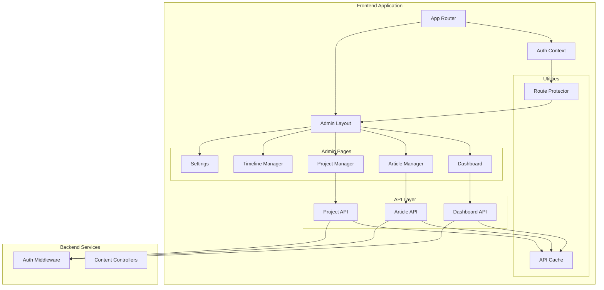
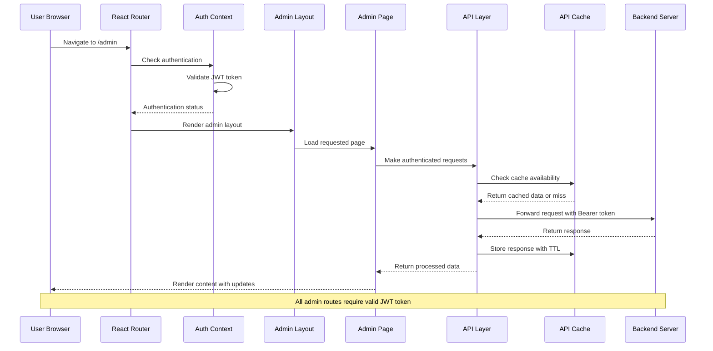
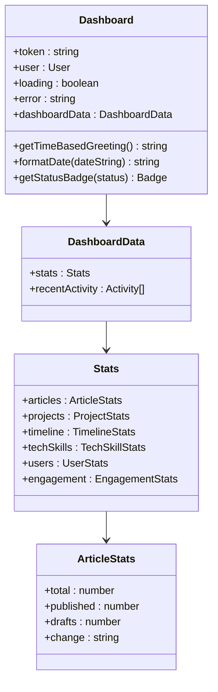
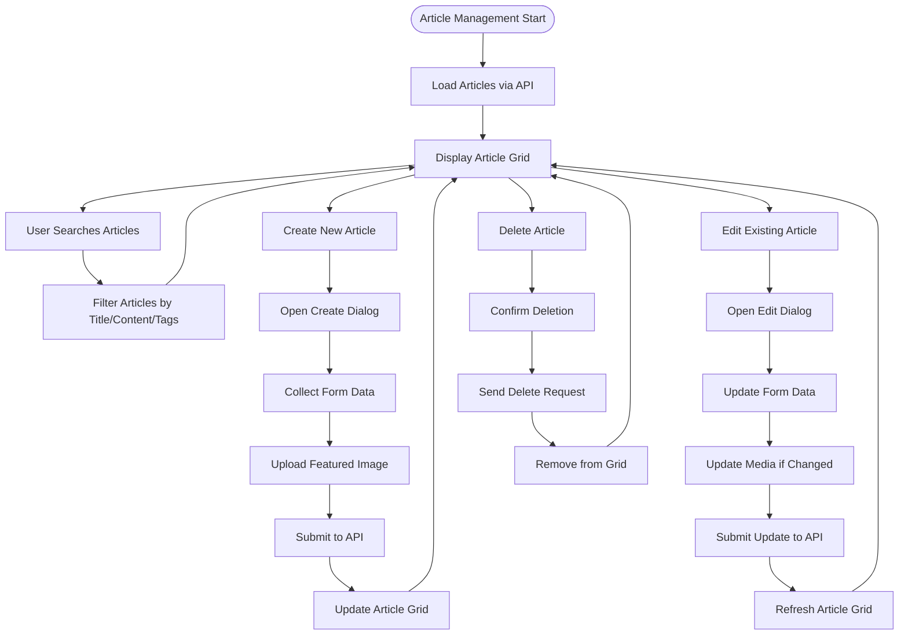
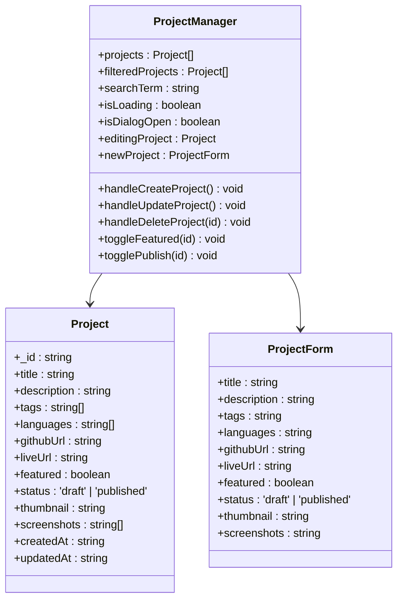
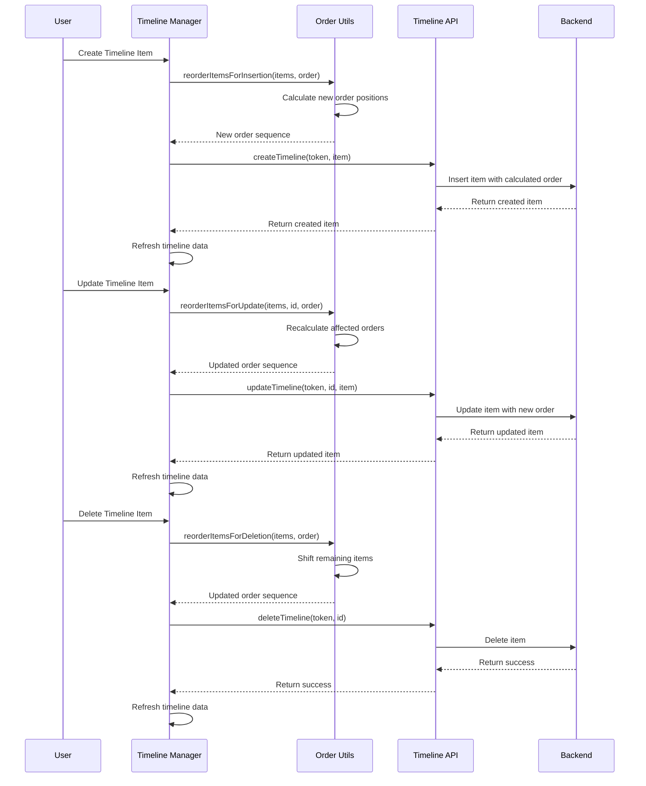
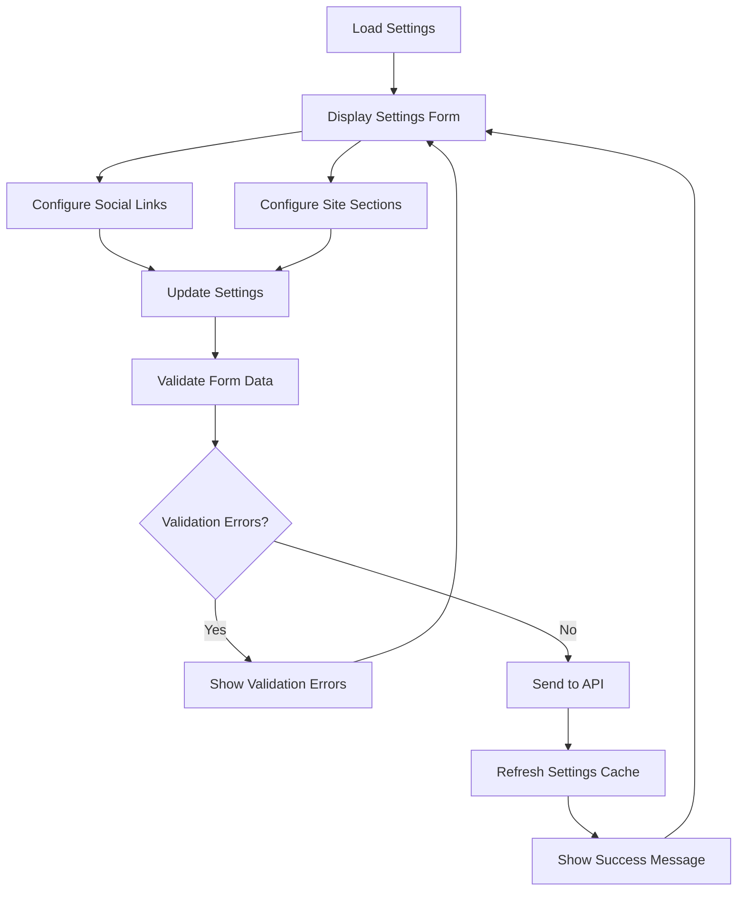
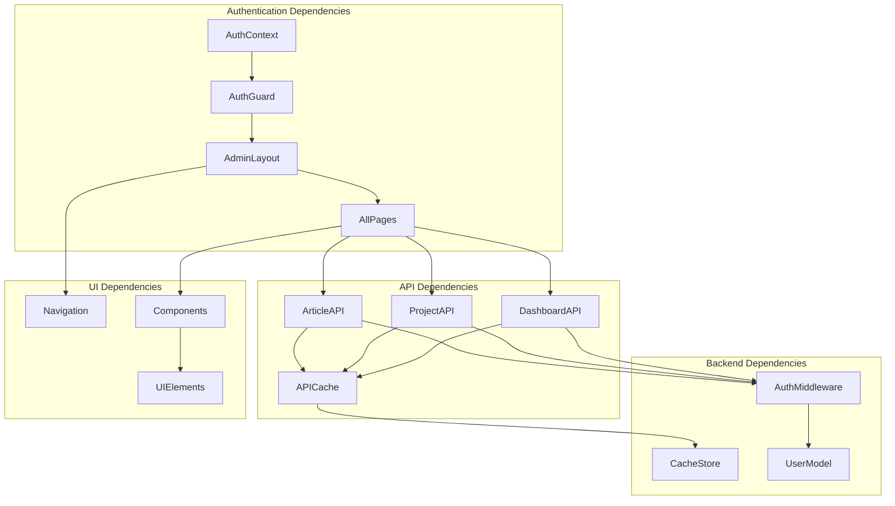

# Admin Panel System

<cite>
**Referenced Files in This Document**
- [Dashboard.tsx](file://personalSite/src/pages/Admin/Dashboard.tsx)
- [ArticleManager.tsx](file://personalSite/src/pages/Admin/ArticleManager.tsx)
- [ProjectManager.tsx](file://personalSite/src/pages/Admin/ProjectManager.tsx)
- [TimelineManager.tsx](file://personalSite/src/pages/Admin/TimelineManager.tsx)
- [Settings.tsx](file://personalSite/src/pages/Admin/Settings.tsx)
- [articleApi.ts](file://personalSite/src/api/articleApi.ts)
- [projectApi.ts](file://personalSite/src/api/projectApi.ts)
- [dashboardApi.ts](file://personalSite/src/api/dashboardApi.ts)
- [AuthContext.tsx](file://personalSite/src/contexts/AuthContext.tsx)
- [AdminLayout.tsx](file://personalSite/src/components/layout/AdminLayout.tsx)
- [RouteProtector.tsx](file://personalSite/src/components/RouteProtector.tsx)
- [App.tsx](file://personalSite/src/App.tsx)
- [cache.ts](file://personalSite/src/lib/cache.ts)
- [auth.ts](file://server/src/middleware/auth.ts)
</cite>

## Table of Contents
1. [Introduction](#introduction)
2. [Project Structure](#project-structure)
3. [Core Components](#core-components)
4. [Architecture Overview](#architecture-overview)
5. [Detailed Component Analysis](#detailed-component-analysis)
6. [Dependency Analysis](#dependency-analysis)
7. [Performance Considerations](#performance-considerations)
8. [Troubleshooting Guide](#troubleshooting-guide)
9. [Conclusion](#conclusion)

## Introduction
The Admin Panel System provides a comprehensive content management solution for portfolio websites. It offers a modern dashboard with analytics and quick actions, robust content management interfaces for articles, projects, timeline items, and settings, and integrates advanced features like real-time data synchronization, role-based access control, and secure authentication. The system supports media uploads, rich content editing, and provides extensive customization capabilities for extending management interfaces.

## Project Structure
The admin panel follows a modular architecture with clear separation of concerns:

**Diagram sources**
- [App.tsx](file://personalSite/src/App.tsx#L231-L356)
- [AuthContext.tsx](file://personalSite/src/contexts/AuthContext.tsx#L36-L140)
- [AdminLayout.tsx](file://personalSite/src/components/layout/AdminLayout.tsx#L32-L294)

**Section sources**
- [App.tsx](file://personalSite/src/App.tsx#L1-L359)
- [AuthContext.tsx](file://personalSite/src/contexts/AuthContext.tsx#L1-L140)

## Core Components
The admin panel consists of several key components working together to provide a seamless content management experience:

### Authentication and Authorization
The system implements comprehensive authentication and authorization mechanisms:
- JWT-based token authentication with automatic token validation
- Role-based access control with admin-only protected routes
- Secure session management with local storage persistence
- Real-time token verification against backend services

### Dashboard Analytics
The dashboard provides comprehensive analytics and overview capabilities:
- Real-time statistics for articles, projects, timeline items, and tech skills
- Recent activity tracking with status indicators
- Time-based greetings and contextual user information
- Loading states and error handling for robust UX

### Content Management Interfaces
Multiple specialized managers handle different content types:
- Article Manager with rich content editing and media support
- Project Manager with comprehensive project metadata and media handling
- Timeline Manager with drag-and-drop ordering and icon customization
- Settings Manager with granular configuration controls

**Section sources**
- [Dashboard.tsx](file://personalSite/src/pages/Admin/Dashboard.tsx#L1-L348)
- [ArticleManager.tsx](file://personalSite/src/pages/Admin/ArticleManager.tsx#L1-L559)
- [ProjectManager.tsx](file://personalSite/src/pages/Admin/ProjectManager.tsx#L1-L864)
- [TimelineManager.tsx](file://personalSite/src/pages/Admin/TimelineManager.tsx#L1-L403)
- [Settings.tsx](file://personalSite/src/pages/Admin/Settings.tsx#L1-L273)

## Architecture Overview

**Diagram sources**
- [App.tsx](file://personalSite/src/App.tsx#L254-L343)
- [AuthContext.tsx](file://personalSite/src/contexts/AuthContext.tsx#L58-L76)
- [dashboardApi.ts](file://personalSite/src/api/dashboardApi.ts#L121-L146)

The architecture implements several key design patterns:

### Frontend Architecture Patterns
- **Provider Pattern**: Centralized authentication state management
- **Hook Pattern**: Custom hooks for reusable authentication logic
- **Component Composition**: Modular layout system with protected routes
- **Caching Strategy**: Intelligent caching with TTL and cache invalidation

### Backend Security Architecture
- **JWT Authentication**: Stateless token-based authentication
- **Role-Based Access Control**: Admin-only endpoints
- **Token Validation**: Real-time token verification
- **Authorization Headers**: Secure request authentication

**Section sources**
- [App.tsx](file://personalSite/src/App.tsx#L231-L356)
- [auth.ts](file://server/src/middleware/auth.ts#L9-L37)

## Detailed Component Analysis

### Dashboard Component
The dashboard serves as the central hub for admin operations, providing comprehensive analytics and quick access to management functions.

**Diagram sources**
- [Dashboard.tsx](file://personalSite/src/pages/Admin/Dashboard.tsx#L36-L77)

The dashboard implements sophisticated data visualization with:
- Animated stat cards with trend indicators
- Recent activity timeline with status badges
- Responsive grid layout for different screen sizes
- Real-time loading states and error handling

**Section sources**
- [Dashboard.tsx](file://personalSite/src/pages/Admin/Dashboard.tsx#L79-L348)

### Article Management System
The article manager provides comprehensive content creation and editing capabilities with media support.

**Diagram sources**
- [ArticleManager.tsx](file://personalSite/src/pages/Admin/ArticleManager.tsx#L14-L559)

Key features include:
- Rich text editing with content validation
- Media upload integration with image previews
- Tag management with comma-separated input
- Status management (draft/published)
- Real-time search and filtering
- Confirmation dialogs for destructive actions

**Section sources**
- [ArticleManager.tsx](file://personalSite/src/pages/Admin/ArticleManager.tsx#L14-L559)
- [articleApi.ts](file://personalSite/src/api/articleApi.ts#L126-L224)

### Project Management System
The project manager handles complex project data with extensive metadata and media support.

**Diagram sources**
- [ProjectManager.tsx](file://personalSite/src/pages/Admin/ProjectManager.tsx#L30-L28)

The project management system features:
- Multi-file media upload (thumbnail and screenshots)
- Comprehensive metadata management
- Feature flagging for prominent display
- URL validation for external links
- Advanced search and filtering
- Status toggling with immediate effect

**Section sources**
- [ProjectManager.tsx](file://personalSite/src/pages/Admin/ProjectManager.tsx#L30-L864)
- [projectApi.ts](file://personalSite/src/api/projectApi.ts#L153-L259)

### Timeline Management System
The timeline manager provides specialized content management with ordering capabilities.

**Diagram sources**
- [TimelineManager.tsx](file://personalSite/src/pages/Admin/TimelineManager.tsx#L86-L148)

Advanced ordering features include:
- Dynamic reordering during insertions, updates, and deletions
- Icon selection with visual representation
- Drag-and-drop friendly ordering system
- Automatic order recalculation
- Real-time order indicators

**Section sources**
- [TimelineManager.tsx](file://personalSite/src/pages/Admin/TimelineManager.tsx#L25-L403)

### Settings Management System
The settings manager provides centralized configuration control with immediate application.

**Diagram sources**
- [Settings.tsx](file://personalSite/src/pages/Admin/Settings.tsx#L28-L273)

The settings system includes:
- Social media link configuration
- Section visibility controls
- Real-time validation feedback
- Immediate effect application
- Loading states and success indicators

**Section sources**
- [Settings.tsx](file://personalSite/src/pages/Admin/Settings.tsx#L28-L273)

## Dependency Analysis

**Diagram sources**
- [App.tsx](file://personalSite/src/App.tsx#L254-L343)
- [cache.ts](file://personalSite/src/lib/cache.ts#L12-L96)

The dependency structure ensures:
- Loose coupling between components and APIs
- Centralized authentication enforcement
- Efficient caching with automatic invalidation
- Type-safe API interactions
- Modular component architecture

**Section sources**
- [App.tsx](file://personalSite/src/App.tsx#L231-L356)
- [cache.ts](file://personalSite/src/lib/cache.ts#L1-L137)

## Performance Considerations
The admin panel implements several performance optimization strategies:

### Caching Strategy
- **TTL-based Caching**: Configurable expiration times for different data types
- **Automatic Cache Invalidation**: Smart invalidation on CRUD operations
- **Cache Keys**: Structured cache key generation for efficient lookup
- **Memory Management**: Automatic cleanup of expired cache entries

### API Optimization
- **Batch Requests**: Minimized network requests through intelligent caching
- **Lazy Loading**: Route-based code splitting for faster initial load
- **Loading States**: Optimistic UI updates with proper loading indicators
- **Error Boundaries**: Graceful error handling with user feedback

### User Experience Optimizations
- **Responsive Design**: Adaptive layouts for different screen sizes
- **Progressive Enhancement**: Feature detection and graceful degradation
- **Accessibility**: ARIA labels and keyboard navigation support
- **Performance Monitoring**: Built-in performance metrics collection

**Section sources**
- [cache.ts](file://personalSite/src/lib/cache.ts#L12-L137)
- [dashboardApi.ts](file://personalSite/src/api/dashboardApi.ts#L70-L151)

## Troubleshooting Guide

### Authentication Issues
Common authentication problems and solutions:
- **Token Expiration**: Automatic token validation with real-time checking
- **Session Loss**: Persistent storage with automatic re-authentication
- **Permission Denied**: Role-based access control with clear error messages
- **Network Errors**: Robust error handling with retry mechanisms

### API Communication Problems
Troubleshooting steps for API connectivity:
- **Cache Invalidation**: Manual cache clearing for debugging
- **Request Logging**: Detailed request/response logging
- **Error Codes**: Specific error codes for different failure scenarios
- **Fallback Mechanisms**: Graceful degradation when APIs are unavailable

### Performance Issues
Performance optimization strategies:
- **Cache Analysis**: Cache hit rates and memory usage monitoring
- **Bundle Analysis**: Code splitting effectiveness measurement
- **Network Optimization**: Request batching and compression
- **UI Responsiveness**: Debouncing and throttling for smooth interactions

**Section sources**
- [AuthContext.tsx](file://personalSite/src/contexts/AuthContext.tsx#L58-L76)
- [RouteProtector.tsx](file://personalSite/src/components/RouteProtector.tsx#L10-L41)

## Conclusion
The Admin Panel System provides a comprehensive, secure, and scalable content management solution. Its modular architecture, robust authentication system, and extensive customization capabilities make it suitable for managing complex portfolio websites. The implementation demonstrates best practices in frontend development, including proper state management, error handling, and performance optimization. The system's extensible design allows for easy addition of new content types and management interfaces while maintaining security and performance standards.

The combination of real-time data synchronization, comprehensive analytics, and intuitive user interfaces creates an efficient content management experience that scales from small portfolios to enterprise-level applications. The security-first approach with JWT authentication and role-based access control ensures safe administration of sensitive content and configurations.