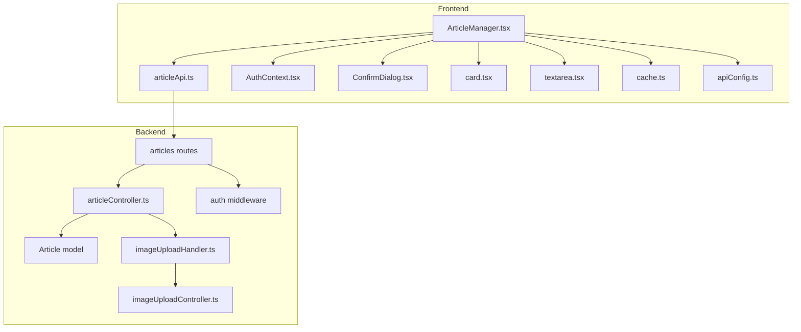
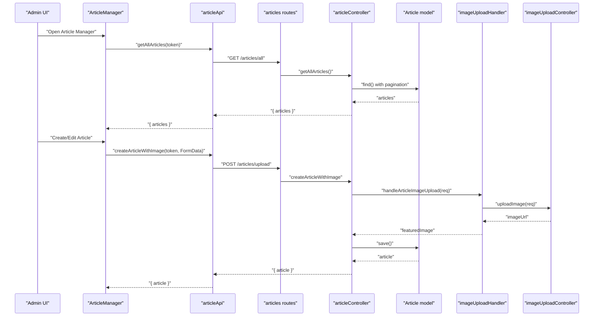
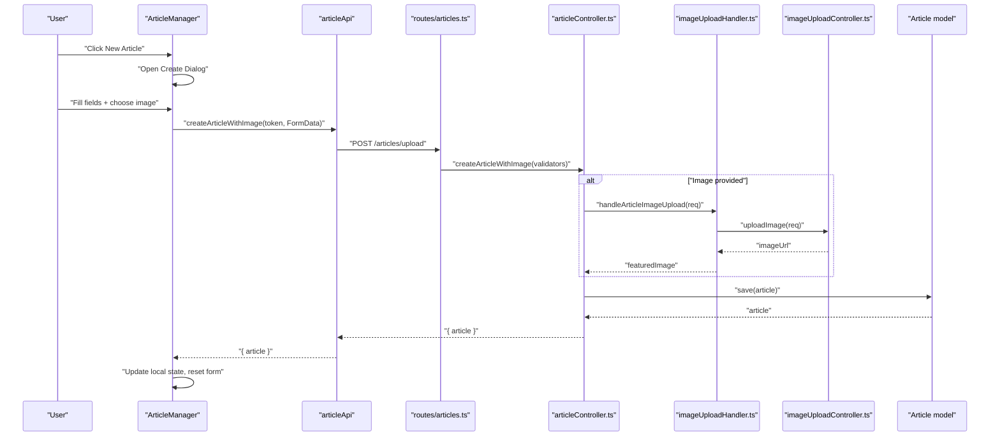
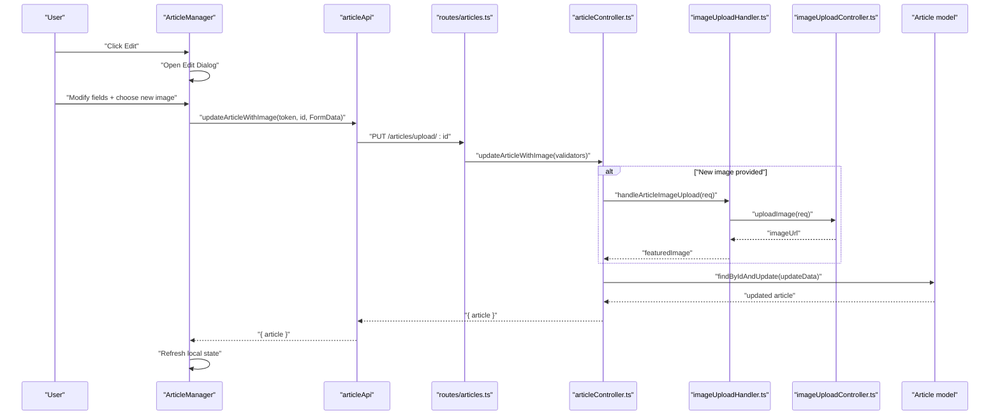
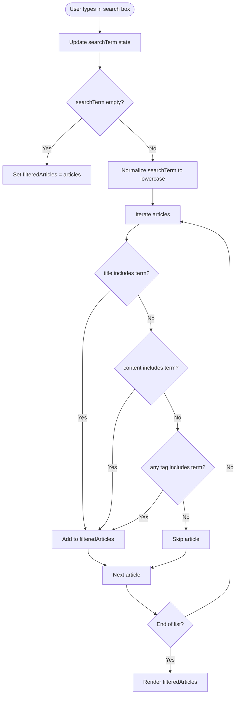
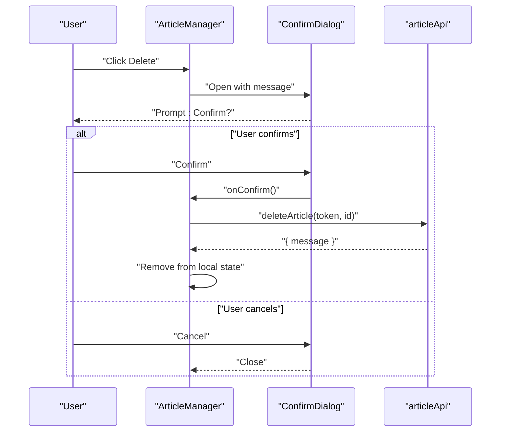
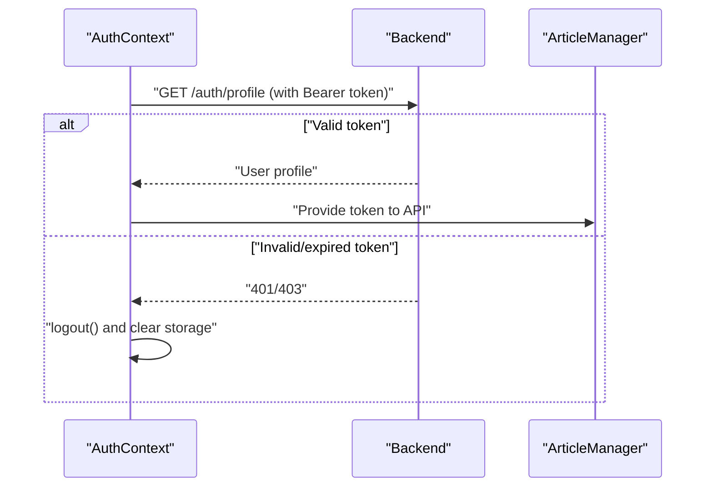
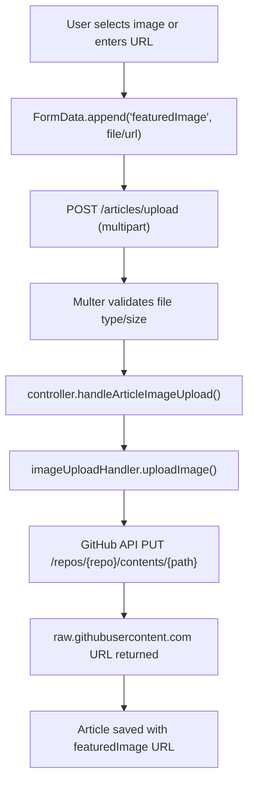
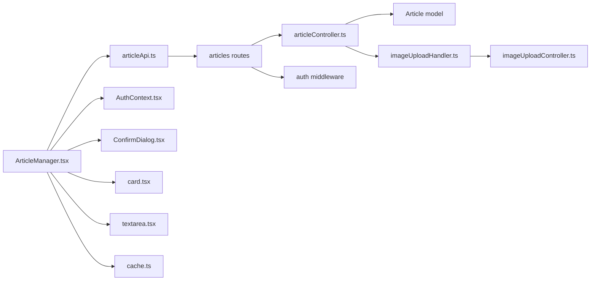

# Article Manager

<cite>
**Referenced Files in This Document**
- [ArticleManager.tsx](file://personalSite/src/pages/Admin/ArticleManager.tsx)
- [articleApi.ts](file://personalSite/src/api/articleApi.ts)
- [AuthContext.tsx](file://personalSite/src/contexts/AuthContext.tsx)
- [apiConfig.ts](file://personalSite/src/lib/apiConfig.ts)
- [cache.ts](file://personalSite/src/lib/cache.ts)
- [ConfirmDialog.tsx](file://personalSite/src/components/ui/ConfirmDialog.tsx)
- [card.tsx](file://personalSite/src/components/ui/card.tsx)
- [textarea.tsx](file://personalSite/src/components/ui/textarea.tsx)
- [articleController.ts](file://server/src/controllers/articleController.ts)
- [Article model](file://server/src/models/Article.ts)
- [articles routes](file://server/src/routes/articles.ts)
- [auth middleware](file://server/src/middleware/auth.ts)
- [imageUploadHandler.ts](file://server/src/utils/imageUploadHandler.ts)
- [imageUploadController.ts](file://server/src/controllers/imageUploadController.ts)
</cite>

## Table of Contents
1. [Introduction](#introduction)
2. [Project Structure](#project-structure)
3. [Core Components](#core-components)
4. [Architecture Overview](#architecture-overview)
5. [Detailed Component Analysis](#detailed-component-analysis)
6. [Dependency Analysis](#dependency-analysis)
7. [Performance Considerations](#performance-considerations)
8. [Troubleshooting Guide](#troubleshooting-guide)
9. [Conclusion](#conclusion)

## Introduction
The Article Manager is a comprehensive administrative interface for managing blog articles. It supports full CRUD operations, rich text content editing, tag management, status handling (draft/published), and robust image uploads via GitHub-backed storage. The frontend integrates with a JWT-authenticated backend, provides real-time filtering, and displays articles in a responsive card layout. This document explains the complete workflow, from creation to deletion, including state management, authentication, search/filtering, confirmation dialogs, image upload, error handling, and performance optimizations.

## Project Structure
The Article Manager spans client and server layers:
- Frontend (React):
  - Admin page orchestrating state and UI
  - API client for article operations
  - Authentication context for JWT handling
  - UI components for forms, dialogs, and cards
  - Caching utilities for performance
- Backend (Express/MongoDB):
  - Article routes and controllers
  - MongoDB model with text indexes
  - Authentication middleware and admin enforcement
  - Image upload pipeline via GitHub API

**Diagram sources**
- [ArticleManager.tsx](file://personalSite/src/pages/Admin/ArticleManager.tsx#L1-L559)
- [articleApi.ts](file://personalSite/src/api/articleApi.ts#L1-L224)
- [AuthContext.tsx](file://personalSite/src/contexts/AuthContext.tsx#L1-L140)
- [ConfirmDialog.tsx](file://personalSite/src/components/ui/ConfirmDialog.tsx#L1-L66)
- [card.tsx](file://personalSite/src/components/ui/card.tsx#L1-L44)
- [textarea.tsx](file://personalSite/src/components/ui/textarea.tsx#L1-L21)
- [cache.ts](file://personalSite/src/lib/cache.ts#L1-L137)
- [apiConfig.ts](file://personalSite/src/lib/apiConfig.ts#L1-L75)
- [articles routes](file://server/src/routes/articles.ts#L1-L54)
- [articleController.ts](file://server/src/controllers/articleController.ts#L1-L453)
- [Article model](file://server/src/models/Article.ts#L1-L64)
- [auth middleware](file://server/src/middleware/auth.ts#L1-L37)
- [imageUploadHandler.ts](file://server/src/utils/imageUploadHandler.ts#L1-L199)
- [imageUploadController.ts](file://server/src/controllers/imageUploadController.ts#L1-L137)

**Section sources**
- [ArticleManager.tsx](file://personalSite/src/pages/Admin/ArticleManager.tsx#L1-L559)
- [articleApi.ts](file://personalSite/src/api/articleApi.ts#L1-L224)
- [articles routes](file://server/src/routes/articles.ts#L1-L54)

## Core Components
- ArticleManager (Admin page):
  - Manages article state, search/filtering, and UI dialogs
  - Handles create/update with optional image upload via FormData
  - Integrates with ConfirmDialog for destructive actions
  - Uses AuthContext for JWT token access
- articleApi:
  - Encapsulates all article endpoints
  - Supports JSON and multipart FormData variants
  - Implements caching and cache invalidation
- AuthContext:
  - Centralizes JWT login/logout and profile validation
  - Exposes user/admin state to protected routes
- ConfirmDialog:
  - Standardized confirmation UI for delete operations
- UI primitives:
  - Card, Textarea, and other shared components for consistent UX

**Section sources**
- [ArticleManager.tsx](file://personalSite/src/pages/Admin/ArticleManager.tsx#L14-L559)
- [articleApi.ts](file://personalSite/src/api/articleApi.ts#L38-L224)
- [AuthContext.tsx](file://personalSite/src/contexts/AuthContext.tsx#L36-L140)
- [ConfirmDialog.tsx](file://personalSite/src/components/ui/ConfirmDialog.tsx#L11-L66)
- [card.tsx](file://personalSite/src/components/ui/card.tsx#L5-L44)
- [textarea.tsx](file://personalSite/src/components/ui/textarea.tsx#L7-L21)

## Architecture Overview
The Article Manager follows a clean separation of concerns:
- Frontend state and UI orchestration
- API client layer with caching and error handling
- Backend routes enforcing authentication and admin roles
- Controllers validating inputs and coordinating uploads
- MongoDB model with text indexes for efficient search
- GitHub-backed image storage for scalability and CDN delivery

**Diagram sources**
- [ArticleManager.tsx](file://personalSite/src/pages/Admin/ArticleManager.tsx#L146-L159)
- [articleApi.ts](file://personalSite/src/api/articleApi.ts#L126-L149)
- [articles routes](file://server/src/routes/articles.ts#L50-L52)
- [articleController.ts](file://server/src/controllers/articleController.ts#L90-L194)
- [imageUploadHandler.ts](file://server/src/utils/imageUploadHandler.ts#L8-L45)
- [imageUploadController.ts](file://server/src/controllers/imageUploadController.ts#L14-L137)
- [Article model](file://server/src/models/Article.ts#L16-L64)

## Detailed Component Analysis

### Article Creation Workflow (with Featured Image Upload)
The creation flow supports both URL-based and file-based featured images, with robust validation and caching.

Key behaviors:
- FormData construction includes title, content, excerpt, status, tags, and optional featuredImage file
- Tag parsing supports both JSON arrays and comma-separated strings
- Slug generation and uniqueness enforced on the backend
- Cache invalidated after successful create

**Diagram sources**
- [ArticleManager.tsx](file://personalSite/src/pages/Admin/ArticleManager.tsx#L44-L95)
- [articleApi.ts](file://personalSite/src/api/articleApi.ts#L126-L149)
- [articles routes](file://server/src/routes/articles.ts#L50-L52)
- [articleController.ts](file://server/src/controllers/articleController.ts#L90-L194)
- [imageUploadHandler.ts](file://server/src/utils/imageUploadHandler.ts#L8-L45)
- [imageUploadController.ts](file://server/src/controllers/imageUploadController.ts#L14-L137)
- [Article model](file://server/src/models/Article.ts#L16-L64)

**Section sources**
- [ArticleManager.tsx](file://personalSite/src/pages/Admin/ArticleManager.tsx#L44-L95)
- [articleApi.ts](file://personalSite/src/api/articleApi.ts#L126-L149)
- [articleController.ts](file://server/src/controllers/articleController.ts#L90-L194)
- [imageUploadHandler.ts](file://server/src/utils/imageUploadHandler.ts#L8-L45)
- [imageUploadController.ts](file://server/src/controllers/imageUploadController.ts#L14-L137)

### Article Editing Interface (Real-time Preview)
The edit dialog mirrors the create form with real-time updates to title, content, excerpt, tags, status, and optional image replacement.

Preview capability:
- Content area supports rich text editing via textarea
- Excerpt auto-populated from content when empty
- Tags edited as comma-separated values and normalized

**Diagram sources**
- [ArticleManager.tsx](file://personalSite/src/pages/Admin/ArticleManager.tsx#L97-L143)
- [articleApi.ts](file://personalSite/src/api/articleApi.ts#L175-L200)
- [articles routes](file://server/src/routes/articles.ts#L50-L52)
- [articleController.ts](file://server/src/controllers/articleController.ts#L261-L371)
- [imageUploadHandler.ts](file://server/src/utils/imageUploadHandler.ts#L8-L45)
- [imageUploadController.ts](file://server/src/controllers/imageUploadController.ts#L14-L137)
- [Article model](file://server/src/models/Article.ts#L16-L64)

**Section sources**
- [ArticleManager.tsx](file://personalSite/src/pages/Admin/ArticleManager.tsx#L416-L538)
- [articleApi.ts](file://personalSite/src/api/articleApi.ts#L175-L200)
- [articleController.ts](file://server/src/controllers/articleController.ts#L261-L371)

### Search and Filtering
The frontend filters articles client-side by title, content, and tags. The backend supports server-side text search and tag filtering for public listings.

Backend filtering:
- Public route supports text search and tag filtering
- Admin route supports text search and status filtering

**Diagram sources**
- [ArticleManager.tsx](file://personalSite/src/pages/Admin/ArticleManager.tsx#L161-L175)
- [articleController.ts](file://server/src/controllers/articleController.ts#L6-L39)
- [articleController.ts](file://server/src/controllers/articleController.ts#L41-L73)

**Section sources**
- [ArticleManager.tsx](file://personalSite/src/pages/Admin/ArticleManager.tsx#L161-L175)
- [articleController.ts](file://server/src/controllers/articleController.ts#L6-L39)
- [articleController.ts](file://server/src/controllers/articleController.ts#L41-L73)

### Confirmation Dialog System
Destructive actions (delete) are guarded by a reusable confirmation dialog.

**Diagram sources**
- [ArticleManager.tsx](file://personalSite/src/pages/Admin/ArticleManager.tsx#L177-L194)
- [ConfirmDialog.tsx](file://personalSite/src/components/ui/ConfirmDialog.tsx#L22-L66)
- [articleApi.ts](file://personalSite/src/api/articleApi.ts#L202-L222)

**Section sources**
- [ArticleManager.tsx](file://personalSite/src/pages/Admin/ArticleManager.tsx#L540-L552)
- [ConfirmDialog.tsx](file://personalSite/src/components/ui/ConfirmDialog.tsx#L11-L66)
- [articleApi.ts](file://personalSite/src/api/articleApi.ts#L202-L222)

### State Management Patterns (React Hooks)
- Local state:
  - Articles list and filtered view
  - Form state for new/edit
  - Dialog visibility and selected item
- Side effects:
  - Fetch articles on mount with token
  - Debounced filtering on search term change
- Authentication:
  - Token passed to all protected endpoints
- Image handling:
  - Separate file state and FormData composition

**Section sources**
- [ArticleManager.tsx](file://personalSite/src/pages/Admin/ArticleManager.tsx#L14-L559)

### Authentication Integration (JWT)
- AuthContext stores token and user in localStorage
- Validates token on mount via backend profile endpoint
- Protects admin routes with middleware
- Frontend passes Authorization header on all admin requests

**Diagram sources**
- [AuthContext.tsx](file://personalSite/src/contexts/AuthContext.tsx#L58-L76)
- [AuthContext.tsx](file://personalSite/src/contexts/AuthContext.tsx#L78-L122)
- [auth middleware](file://server/src/middleware/auth.ts#L9-L30)

**Section sources**
- [AuthContext.tsx](file://personalSite/src/contexts/AuthContext.tsx#L36-L140)
- [auth middleware](file://server/src/middleware/auth.ts#L9-L37)

### Responsive Card-Based Layout
Articles are displayed in a responsive grid:
- 1 column on mobile
- 2 on tablets
- 3 on desktop
- Status badges and tag chips for quick scanning
- Minimal excerpt with ellipsis for long content

**Section sources**
- [ArticleManager.tsx](file://personalSite/src/pages/Admin/ArticleManager.tsx#L365-L413)
- [card.tsx](file://personalSite/src/components/ui/card.tsx#L5-L44)

### Rich Text Editing and Validation
- Content editing uses a textarea component
- Validation rules enforced on backend:
  - Title length and presence
  - Content presence
  - Status enum
  - Tags array validation (JSON or CSV)
- Frontend normalization:
  - Comma-separated tags converted to trimmed array
  - Excerpt fallback to first 200 chars of content

**Section sources**
- [ArticleManager.tsx](file://personalSite/src/pages/Admin/ArticleManager.tsx#L276-L284)
- [ArticleManager.tsx](file://personalSite/src/pages/Admin/ArticleManager.tsx#L475-L483)
- [articleController.ts](file://server/src/controllers/articleController.ts#L90-L127)
- [articleController.ts](file://server/src/controllers/articleController.ts#L261-L301)

### Tag Management
- Storage: string[] in MongoDB
- Frontend: comma-separated input, normalized to array
- Backend: accepts JSON arrays or CSV strings, trims and filters empty tags
- Search: text index includes tags for efficient matching

**Section sources**
- [ArticleManager.tsx](file://personalSite/src/pages/Admin/ArticleManager.tsx#L287-L295)
- [ArticleManager.tsx](file://personalSite/src/pages/Admin/ArticleManager.tsx#L485-L493)
- [Article model](file://server/src/models/Article.ts#L43-L46)
- [articleController.ts](file://server/src/controllers/articleController.ts#L105-L127)

### Status Handling (Draft/Published)
- Frontend radio buttons control status
- Backend enforces enum validation
- Public listing filters by status = published
- Admin listing supports status filtering

**Section sources**
- [ArticleManager.tsx](file://personalSite/src/pages/Admin/ArticleManager.tsx#L297-L318)
- [ArticleManager.tsx](file://personalSite/src/pages/Admin/ArticleManager.tsx#L496-L517)
- [articleController.ts](file://server/src/controllers/articleController.ts#L101-L103)
- [articleController.ts](file://server/src/controllers/articleController.ts#L274-L277)

### Image Upload Process
- Frontend:
  - URL input or file picker
  - FormData append for both metadata and file
- Backend:
  - Multer single('featuredImage') with 2MB limit and image/* filter
  - Image upload pipeline writes to GitHub repo under images/uploads/YYYY/MM/
  - Returns CDN URL via raw.githubusercontent.com
- Security:
  - Allowed MIME types: png, jpeg, webp
  - Random filename generation prevents collisions and overwrites

**Diagram sources**
- [ArticleManager.tsx](file://personalSite/src/pages/Admin/ArticleManager.tsx#L36-L42)
- [ArticleManager.tsx](file://personalSite/src/pages/Admin/ArticleManager.tsx#L55-L67)
- [ArticleManager.tsx](file://personalSite/src/pages/Admin/ArticleManager.tsx#L110-L122)
- [articles routes](file://server/src/routes/articles.ts#L15-L30)
- [articles routes](file://server/src/routes/articles.ts#L50-L52)
- [imageUploadHandler.ts](file://server/src/utils/imageUploadHandler.ts#L8-L45)
- [imageUploadController.ts](file://server/src/controllers/imageUploadController.ts#L14-L137)

**Section sources**
- [ArticleManager.tsx](file://personalSite/src/pages/Admin/ArticleManager.tsx#L36-L42)
- [ArticleManager.tsx](file://personalSite/src/pages/Admin/ArticleManager.tsx#L55-L67)
- [ArticleManager.tsx](file://personalSite/src/pages/Admin/ArticleManager.tsx#L110-L122)
- [articles routes](file://server/src/routes/articles.ts#L15-L30)
- [imageUploadHandler.ts](file://server/src/utils/imageUploadHandler.ts#L8-L45)
- [imageUploadController.ts](file://server/src/controllers/imageUploadController.ts#L14-L137)

### API Endpoints and Contracts
- GET /articles (public): paginated, text-searchable, tag-filterable
- GET /articles/all (admin): paginated, text-searchable, status-filterable
- GET /articles/:id: fetch by ID
- POST /articles: create without image (JSON)
- POST /articles/upload: create with image (FormData)
- PUT /articles/:id: update without image (JSON)
- PUT /articles/upload/:id: update with image (FormData)
- DELETE /articles/:id: delete

Caching:
- Frontend caches published/all lists with TTL
- Cache invalidated on create/update/delete

**Section sources**
- [articleApi.ts](file://personalSite/src/api/articleApi.ts#L39-L81)
- [articleApi.ts](file://personalSite/src/api/articleApi.ts#L103-L222)
- [cache.ts](file://personalSite/src/lib/cache.ts#L12-L96)
- [articles routes](file://server/src/routes/articles.ts#L34-L52)

## Dependency Analysis
- Frontend depends on:
  - AuthContext for JWT
  - articleApi for all network calls
  - UI components for consistent UX
  - cache for performance
- Backend depends on:
  - Multer for image uploads
  - MongoDB model with text indexes
  - Authentication middleware for admin protection
  - GitHub API for image storage

**Diagram sources**
- [ArticleManager.tsx](file://personalSite/src/pages/Admin/ArticleManager.tsx#L1-L559)
- [articleApi.ts](file://personalSite/src/api/articleApi.ts#L1-L224)
- [AuthContext.tsx](file://personalSite/src/contexts/AuthContext.tsx#L1-L140)
- [ConfirmDialog.tsx](file://personalSite/src/components/ui/ConfirmDialog.tsx#L1-L66)
- [card.tsx](file://personalSite/src/components/ui/card.tsx#L1-L44)
- [textarea.tsx](file://personalSite/src/components/ui/textarea.tsx#L1-L21)
- [cache.ts](file://personalSite/src/lib/cache.ts#L1-L137)
- [articles routes](file://server/src/routes/articles.ts#L1-L54)
- [articleController.ts](file://server/src/controllers/articleController.ts#L1-L453)
- [Article model](file://server/src/models/Article.ts#L1-L64)
- [auth middleware](file://server/src/middleware/auth.ts#L1-L37)
- [imageUploadHandler.ts](file://server/src/utils/imageUploadHandler.ts#L1-L199)
- [imageUploadController.ts](file://server/src/controllers/imageUploadController.ts#L1-L137)

**Section sources**
- [ArticleManager.tsx](file://personalSite/src/pages/Admin/ArticleManager.tsx#L1-L559)
- [articleApi.ts](file://personalSite/src/api/articleApi.ts#L1-L224)
- [articles routes](file://server/src/routes/articles.ts#L1-L54)

## Performance Considerations
- Frontend caching:
  - Cache published and admin article lists with TTL
  - Invalidate cache on create/update/delete
- Pagination:
  - Backend paginates results to avoid large payloads
- Text search:
  - MongoDB text indexes enable fast full-text search
- Image optimization:
  - GitHub delivers via CDN
  - 2MB file size limit reduces bandwidth and storage pressure
- UI responsiveness:
  - Client-side filtering avoids frequent network calls
  - Loading states prevent redundant submissions

[No sources needed since this section provides general guidance]

## Troubleshooting Guide
Common issues and resolutions:
- Authentication failures:
  - Verify token presence and validity
  - Check backend profile endpoint response
- Image upload errors:
  - Ensure file type is PNG/JPEG/WebP and under 2MB
  - Confirm GitHub token and repository configuration
- Validation errors:
  - Title length, content presence, and status enum must match backend rules
  - Tags must be a valid array (JSON or CSV)
- Network errors:
  - Confirm API base URL environment variables
  - Check CORS and proxy configurations if applicable

**Section sources**
- [AuthContext.tsx](file://personalSite/src/contexts/AuthContext.tsx#L58-L76)
- [imageUploadController.ts](file://server/src/controllers/imageUploadController.ts#L22-L36)
- [imageUploadController.ts](file://server/src/controllers/imageUploadController.ts#L46-L63)
- [articleController.ts](file://server/src/controllers/articleController.ts#L90-L127)
- [apiConfig.ts](file://personalSite/src/lib/apiConfig.ts#L6-L49)

## Conclusion
The Article Manager provides a robust, secure, and performant solution for blog article administration. It leverages JWT authentication, comprehensive validation, scalable image storage via GitHub, and efficient caching to deliver a smooth authoring experience. The modular architecture allows easy customization of validation rules, tag systems, and editor integrations while maintaining strong separation of concerns.