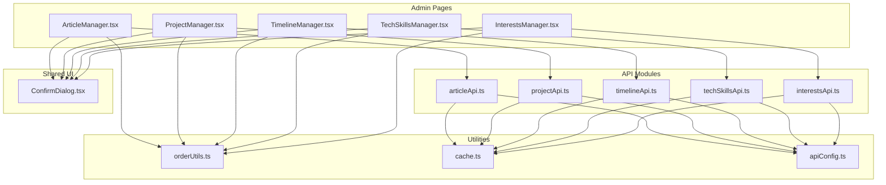
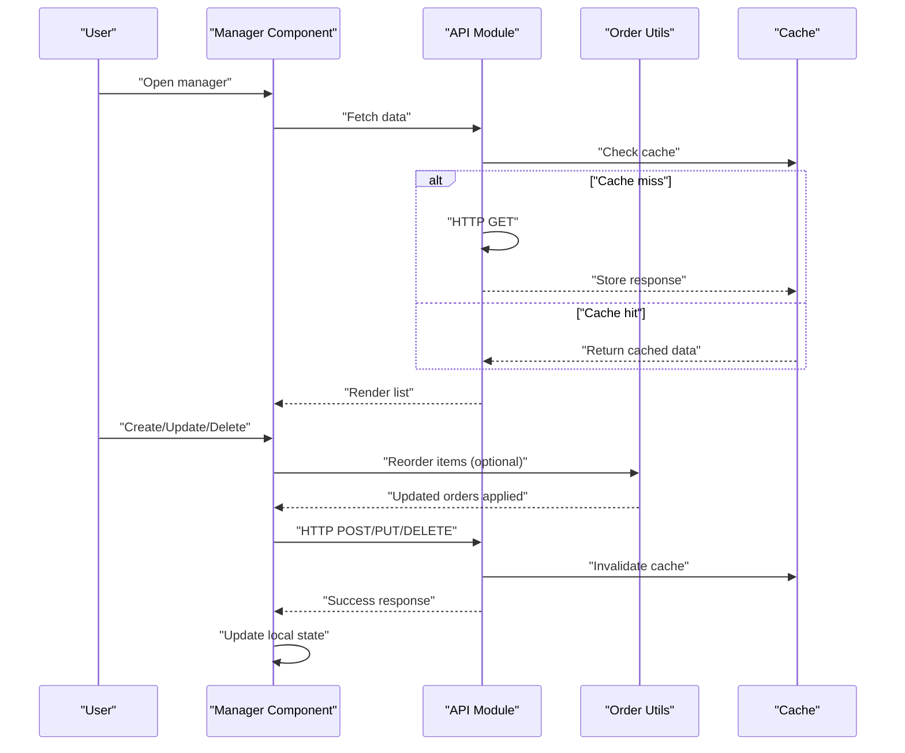
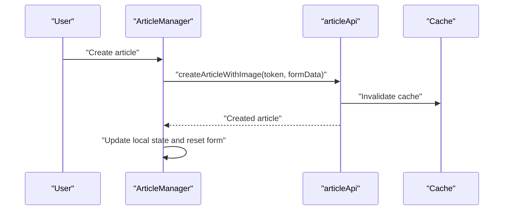
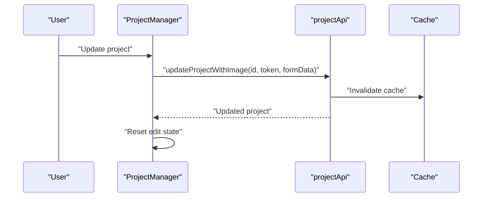
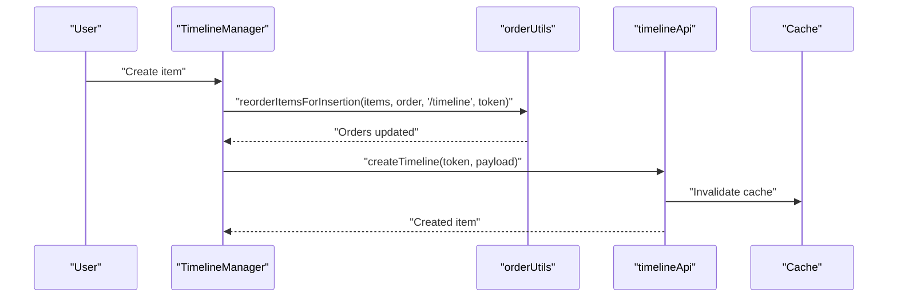
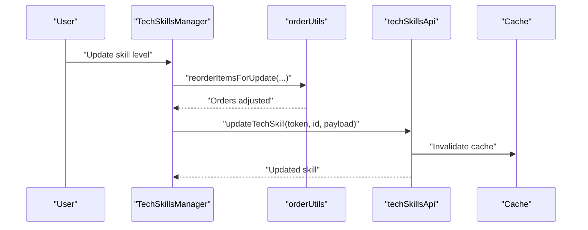
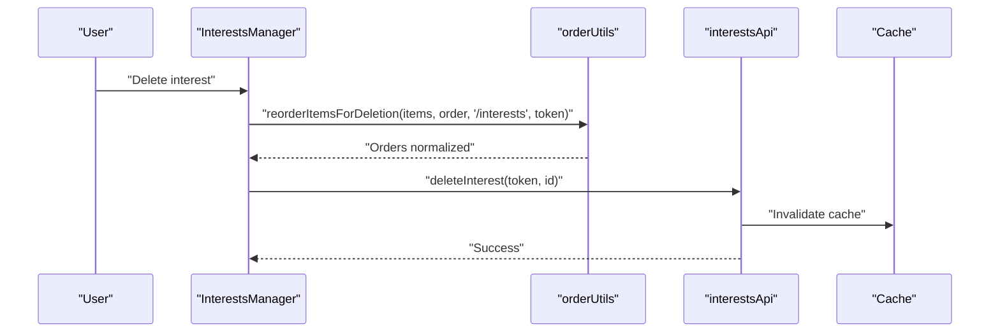
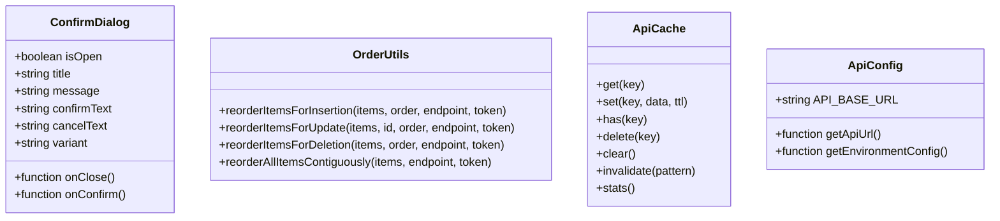
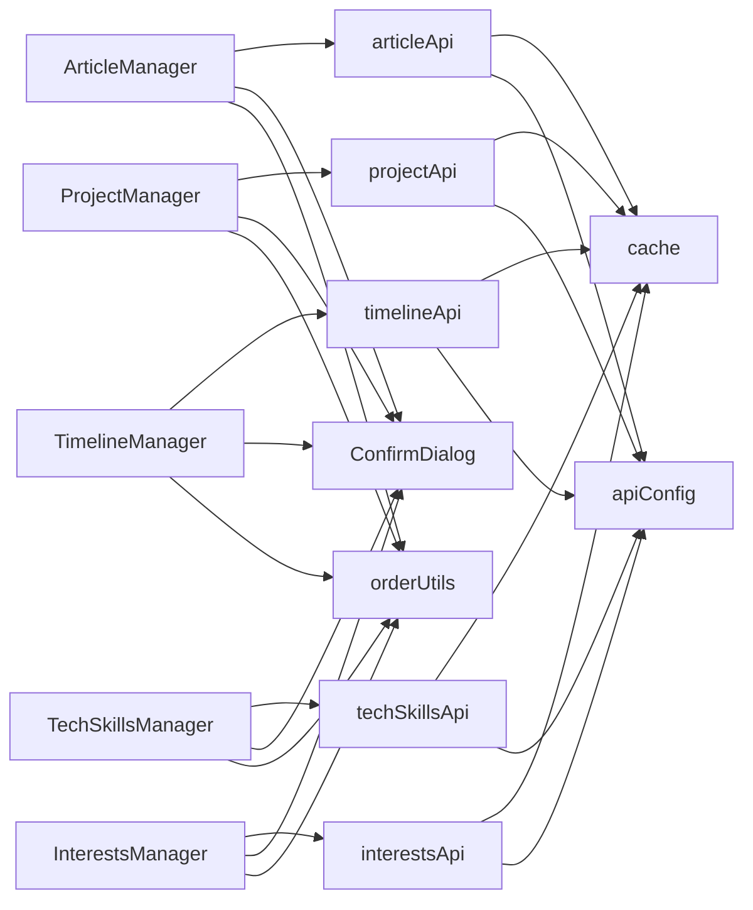

# Content Management Interfaces

<cite>
**Referenced Files in This Document**
- [ArticleManager.tsx](file://personalSite/src/pages/Admin/ArticleManager.tsx)
- [ProjectManager.tsx](file://personalSite/src/pages/Admin/ProjectManager.tsx)
- [TimelineManager.tsx](file://personalSite/src/pages/Admin/TimelineManager.tsx)
- [TechSkillsManager.tsx](file://personalSite/src/pages/Admin/TechSkillsManager.tsx)
- [InterestsManager.tsx](file://personalSite/src/pages/Admin/InterestsManager.tsx)
- [articleApi.ts](file://personalSite/src/api/articleApi.ts)
- [projectApi.ts](file://personalSite/src/api/projectApi.ts)
- [timelineApi.ts](file://personalSite/src/api/timelineApi.ts)
- [techSkillsApi.ts](file://personalSite/src/api/techSkillsApi.ts)
- [interestsApi.ts](file://personalSite/src/api/interestsApi.ts)
- [ConfirmDialog.tsx](file://personalSite/src/components/ui/ConfirmDialog.tsx)
- [orderUtils.ts](file://personalSite/src/lib/orderUtils.ts)
- [cache.ts](file://personalSite/src/lib/cache.ts)
- [apiConfig.ts](file://personalSite/src/lib/apiConfig.ts)
</cite>

## Table of Contents
1. [Introduction](#introduction)
2. [Project Structure](#project-structure)
3. [Core Components](#core-components)
4. [Architecture Overview](#architecture-overview)
5. [Detailed Component Analysis](#detailed-component-analysis)
6. [Dependency Analysis](#dependency-analysis)
7. [Performance Considerations](#performance-considerations)
8. [Troubleshooting Guide](#troubleshooting-guide)
9. [Conclusion](#conclusion)
10. [Appendices](#appendices)

## Introduction
This document explains the Content Management Interfaces used to manage various content types in the admin area. It covers the shared management patterns across Article, Project, Timeline, Tech Skills, and Interests managers. It also documents form handling, rich text editing, media uploads, real-time preview, data fetching and caching, confirmation dialogs for destructive actions, responsive layouts, search and filtering, bulk operations, and status management. Finally, it provides guidance on customizing forms, adding new content types, implementing custom validation rules, and extending the management interfaces.

## Project Structure
The admin management interfaces are located under the Admin pages directory and integrate with dedicated API modules, shared UI components, and utility libraries for caching and ordering.

**Diagram sources**
- [ArticleManager.tsx](file://personalSite/src/pages/Admin/ArticleManager.tsx#L1-L559)
- [ProjectManager.tsx](file://personalSite/src/pages/Admin/ProjectManager.tsx#L1-L864)
- [TimelineManager.tsx](file://personalSite/src/pages/Admin/TimelineManager.tsx#L1-L403)
- [TechSkillsManager.tsx](file://personalSite/src/pages/Admin/TechSkillsManager.tsx#L1-L356)
- [InterestsManager.tsx](file://personalSite/src/pages/Admin/InterestsManager.tsx#L1-L348)
- [articleApi.ts](file://personalSite/src/api/articleApi.ts#L1-L224)
- [projectApi.ts](file://personalSite/src/api/projectApi.ts#L1-L259)
- [timelineApi.ts](file://personalSite/src/api/timelineApi.ts#L1-L139)
- [techSkillsApi.ts](file://personalSite/src/api/techSkillsApi.ts#L1-L134)
- [interestsApi.ts](file://personalSite/src/api/interestsApi.ts#L1-L136)
- [ConfirmDialog.tsx](file://personalSite/src/components/ui/ConfirmDialog.tsx#L1-L66)
- [orderUtils.ts](file://personalSite/src/lib/orderUtils.ts#L1-L238)
- [cache.ts](file://personalSite/src/lib/cache.ts#L1-L137)
- [apiConfig.ts](file://personalSite/src/lib/apiConfig.ts#L1-L75)

**Section sources**
- [ArticleManager.tsx](file://personalSite/src/pages/Admin/ArticleManager.tsx#L1-L559)
- [ProjectManager.tsx](file://personalSite/src/pages/Admin/ProjectManager.tsx#L1-L864)
- [TimelineManager.tsx](file://personalSite/src/pages/Admin/TimelineManager.tsx#L1-L403)
- [TechSkillsManager.tsx](file://personalSite/src/pages/Admin/TechSkillsManager.tsx#L1-L356)
- [InterestsManager.tsx](file://personalSite/src/pages/Admin/InterestsManager.tsx#L1-L348)

## Core Components
- Shared CRUD patterns: All managers implement create, read, update, delete with consistent UI and state management.
- Media upload integration: Articles and Projects support single/multiple image uploads via FormData.
- Rich text editing: Articles use a text area for content; Projects include rich text areas for descriptions.
- Real-time preview: Managers display live updates after successful mutations.
- Search and filtering: Managers filter lists client-side by text fields relevant to each content type.
- Status management: Articles support draft/published; Projects support draft/published and featured flag; Tech Skills include proficiency levels; Timeline and Interests include order positions.
- Confirmation dialogs: Destructive actions use a reusable confirmation dialog component.
- Responsive layouts: Grid-based responsive cards adapt to screen sizes.

**Section sources**
- [ArticleManager.tsx](file://personalSite/src/pages/Admin/ArticleManager.tsx#L14-L203)
- [ProjectManager.tsx](file://personalSite/src/pages/Admin/ProjectManager.tsx#L30-L340)
- [TimelineManager.tsx](file://personalSite/src/pages/Admin/TimelineManager.tsx#L25-L174)
- [TechSkillsManager.tsx](file://personalSite/src/pages/Admin/TechSkillsManager.tsx#L25-L168)
- [InterestsManager.tsx](file://personalSite/src/pages/Admin/InterestsManager.tsx#L27-L166)
- [ConfirmDialog.tsx](file://personalSite/src/components/ui/ConfirmDialog.tsx#L11-L31)

## Architecture Overview
The managers orchestrate UI state, handle user interactions, and delegate data operations to API modules. APIs encapsulate HTTP requests, caching, and cache invalidation. Ordering utilities coordinate resequencing of sortable items. A centralized configuration module supplies the API base URL.

**Diagram sources**
- [ArticleManager.tsx](file://personalSite/src/pages/Admin/ArticleManager.tsx#L146-L159)
- [ProjectManager.tsx](file://personalSite/src/pages/Admin/ProjectManager.tsx#L244-L258)
- [TimelineManager.tsx](file://personalSite/src/pages/Admin/TimelineManager.tsx#L48-L62)
- [TechSkillsManager.tsx](file://personalSite/src/pages/Admin/TechSkillsManager.tsx#L45-L59)
- [InterestsManager.tsx](file://personalSite/src/pages/Admin/InterestsManager.tsx#L47-L61)
- [articleApi.ts](file://personalSite/src/api/articleApi.ts#L59-L81)
- [projectApi.ts](file://personalSite/src/api/projectApi.ts#L64-L86)
- [timelineApi.ts](file://personalSite/src/api/timelineApi.ts#L44-L68)
- [techSkillsApi.ts](file://personalSite/src/api/techSkillsApi.ts#L42-L66)
- [interestsApi.ts](file://personalSite/src/api/interestsApi.ts#L41-L65)
- [orderUtils.ts](file://personalSite/src/lib/orderUtils.ts#L47-L77)
- [cache.ts](file://personalSite/src/lib/cache.ts#L20-L48)

## Detailed Component Analysis

### Article Manager
- Purpose: Manage blog articles with rich content, excerpts, tags, and featured images.
- Features:
  - Create/update/delete with optional image upload via FormData.
  - Status management (draft/published).
  - Search across title, content, and tags.
  - Confirmation dialog for deletions.
- Media Upload:
  - Single featured image supported via URL or file picker.
  - Uses a dedicated upload endpoint for images.
- Validation:
  - Token required for protected endpoints.
  - Basic client-side checks before submission.
- Caching:
  - Uses cache keys for published and all articles; invalidates on mutations.

**Diagram sources**
- [ArticleManager.tsx](file://personalSite/src/pages/Admin/ArticleManager.tsx#L44-L95)
- [articleApi.ts](file://personalSite/src/api/articleApi.ts#L126-L149)
- [cache.ts](file://personalSite/src/lib/cache.ts#L102-L107)

**Section sources**
- [ArticleManager.tsx](file://personalSite/src/pages/Admin/ArticleManager.tsx#L14-L203)
- [articleApi.ts](file://personalSite/src/api/articleApi.ts#L38-L224)

### Project Manager
- Purpose: Manage portfolio projects with thumbnails, screenshots, tags, languages, and links.
- Features:
  - Create/update/delete with optional multiple image uploads.
  - Status (draft/published), featured flag, and search across title/description/tags.
  - Toggle featured and publish status via separate endpoints.
- Media Upload:
  - Thumbnail and multiple screenshots via file inputs.
  - Dedicated upload endpoints for images.
- Validation:
  - Required fields enforced before submit.
- Caching:
  - Projects cache supports pagination and filters; invalidates on mutations.

**Diagram sources**
- [ProjectManager.tsx](file://personalSite/src/pages/Admin/ProjectManager.tsx#L163-L242)
- [projectApi.ts](file://personalSite/src/api/projectApi.ts#L206-L233)
- [cache.ts](file://personalSite/src/lib/cache.ts#L108-L115)

**Section sources**
- [ProjectManager.tsx](file://personalSite/src/pages/Admin/ProjectManager.tsx#L30-L340)
- [projectApi.ts](file://personalSite/src/api/projectApi.ts#L28-L259)

### Timeline Manager
- Purpose: Manage professional timeline entries with icons and order positions.
- Features:
  - Create/update/delete timeline items with order resequencing.
  - Search across year, role, company, and description.
  - Icons mapped to UI components.
- Ordering:
  - Uses order utilities to insert/update/delete items while maintaining contiguous order.
- Caching:
  - Public and admin endpoints with cache invalidation.

**Diagram sources**
- [TimelineManager.tsx](file://personalSite/src/pages/Admin/TimelineManager.tsx#L86-L108)
- [orderUtils.ts](file://personalSite/src/lib/orderUtils.ts#L47-L77)
- [timelineApi.ts](file://personalSite/src/api/timelineApi.ts#L70-L93)
- [cache.ts](file://personalSite/src/lib/cache.ts#L118)

**Section sources**
- [TimelineManager.tsx](file://personalSite/src/pages/Admin/TimelineManager.tsx#L25-L174)
- [orderUtils.ts](file://personalSite/src/lib/orderUtils.ts#L47-L77)
- [timelineApi.ts](file://personalSite/src/api/timelineApi.ts#L21-L139)

### Tech Skills Manager
- Purpose: Manage technology skills with proficiency levels and categories.
- Features:
  - Create/update/delete skills with order resequencing.
  - Search by skill name.
  - Proficiency slider for level input.
  - Category-based icon mapping.
- Ordering:
  - Uses order utilities for insertion, update, and deletion.

**Diagram sources**
- [TechSkillsManager.tsx](file://personalSite/src/pages/Admin/TechSkillsManager.tsx#L101-L119)
- [orderUtils.ts](file://personalSite/src/lib/orderUtils.ts#L174-L237)
- [techSkillsApi.ts](file://personalSite/src/api/techSkillsApi.ts#L92-L114)
- [cache.ts](file://personalSite/src/lib/cache.ts#L119)

**Section sources**
- [TechSkillsManager.tsx](file://personalSite/src/pages/Admin/TechSkillsManager.tsx#L25-L168)
- [orderUtils.ts](file://personalSite/src/lib/orderUtils.ts#L174-L237)
- [techSkillsApi.ts](file://personalSite/src/api/techSkillsApi.ts#L19-L134)

### Interests Manager
- Purpose: Manage personal interests with icons and order positions.
- Features:
  - Create/update/delete interests with order resequencing.
  - Search by label.
  - Icon selection mapped to UI components.

**Diagram sources**
- [InterestsManager.tsx](file://personalSite/src/pages/Admin/InterestsManager.tsx#L122-L138)
- [orderUtils.ts](file://personalSite/src/lib/orderUtils.ts#L89-L121)
- [interestsApi.ts](file://personalSite/src/api/interestsApi.ts#L117-L134)
- [cache.ts](file://personalSite/src/lib/cache.ts#L120)

**Section sources**
- [InterestsManager.tsx](file://personalSite/src/pages/Admin/InterestsManager.tsx#L27-L166)
- [orderUtils.ts](file://personalSite/src/lib/orderUtils.ts#L89-L121)
- [interestsApi.ts](file://personalSite/src/api/interestsApi.ts#L18-L136)

### Shared UI Components and Utilities
- ConfirmDialog: Reusable confirmation modal for destructive actions with customizable variants.
- Order Utilities: Centralized logic for resequencing sortable items across resources.
- Cache: In-memory cache with TTL and pattern-based invalidation.
- API Config: Centralized base URL resolution for development and production.

**Diagram sources**
- [ConfirmDialog.tsx](file://personalSite/src/components/ui/ConfirmDialog.tsx#L11-L31)
- [orderUtils.ts](file://personalSite/src/lib/orderUtils.ts#L47-L237)
- [cache.ts](file://personalSite/src/lib/cache.ts#L12-L96)
- [apiConfig.ts](file://personalSite/src/lib/apiConfig.ts#L6-L55)

**Section sources**
- [ConfirmDialog.tsx](file://personalSite/src/components/ui/ConfirmDialog.tsx#L1-L66)
- [orderUtils.ts](file://personalSite/src/lib/orderUtils.ts#L1-L238)
- [cache.ts](file://personalSite/src/lib/cache.ts#L1-L137)
- [apiConfig.ts](file://personalSite/src/lib/apiConfig.ts#L1-L75)

## Dependency Analysis
- Managers depend on:
  - API modules for HTTP operations and cache management.
  - Order utilities for resequencing sortable items.
  - ConfirmDialog for destructive actions.
  - Shared cache and API config utilities.
- Coupling:
  - Managers are cohesive around CRUD operations and share similar patterns.
  - Low coupling to UI primitives (cards, buttons, inputs) and shared components.
- External dependencies:
  - Environment-driven API base URL.
  - Browser-native FormData for media uploads.

**Diagram sources**
- [ArticleManager.tsx](file://personalSite/src/pages/Admin/ArticleManager.tsx#L1-L12)
- [ProjectManager.tsx](file://personalSite/src/pages/Admin/ProjectManager.tsx#L1-L12)
- [TimelineManager.tsx](file://personalSite/src/pages/Admin/TimelineManager.tsx#L1-L23)
- [TechSkillsManager.tsx](file://personalSite/src/pages/Admin/TechSkillsManager.tsx#L1-L23)
- [InterestsManager.tsx](file://personalSite/src/pages/Admin/InterestsManager.tsx#L1-L25)
- [articleApi.ts](file://personalSite/src/api/articleApi.ts#L35-L36)
- [projectApi.ts](file://personalSite/src/api/projectApi.ts#L1-L2)
- [timelineApi.ts](file://personalSite/src/api/timelineApi.ts#L1-L2)
- [techSkillsApi.ts](file://personalSite/src/api/techSkillsApi.ts#L1-L2)
- [interestsApi.ts](file://personalSite/src/api/interestsApi.ts#L1-L2)
- [ConfirmDialog.tsx](file://personalSite/src/components/ui/ConfirmDialog.tsx#L1-L9)
- [orderUtils.ts](file://personalSite/src/lib/orderUtils.ts#L1-L2)
- [cache.ts](file://personalSite/src/lib/cache.ts#L1-L4)
- [apiConfig.ts](file://personalSite/src/lib/apiConfig.ts#L6-L52)

**Section sources**
- [ArticleManager.tsx](file://personalSite/src/pages/Admin/ArticleManager.tsx#L1-L12)
- [ProjectManager.tsx](file://personalSite/src/pages/Admin/ProjectManager.tsx#L1-L12)
- [TimelineManager.tsx](file://personalSite/src/pages/Admin/TimelineManager.tsx#L1-L23)
- [TechSkillsManager.tsx](file://personalSite/src/pages/Admin/TechSkillsManager.tsx#L1-L23)
- [InterestsManager.tsx](file://personalSite/src/pages/Admin/InterestsManager.tsx#L1-L25)

## Performance Considerations
- Caching:
  - In-memory cache with TTL reduces redundant network requests.
  - Cache keys are scoped per resource and include parameters where applicable.
  - Cache invalidation occurs on create/update/delete to keep views fresh.
- Network Efficiency:
  - Use dedicated upload endpoints for media to avoid bloating JSON payloads.
  - Pagination and filtering parameters for list endpoints reduce payload sizes.
- UI Responsiveness:
  - Loading states prevent unnecessary re-renders.
  - Debounced search filters improve responsiveness during typing.
- Ordering:
  - Batch reordering operations minimize round-trips by updating items sequentially with careful sorting.

[No sources needed since this section provides general guidance]

## Troubleshooting Guide
- Authentication Issues:
  - Missing token prevents protected operations. Ensure the auth context provides a token before invoking managers.
- Media Upload Failures:
  - Verify FormData composition and endpoint correctness.
  - Check browser file input handling and accepted MIME types.
- Cache Stale Data:
  - Trigger force refresh or manually invalidate cache keys for affected resources.
- Ordering Problems:
  - Confirm order utilities are invoked before/after mutations and that endpoints match resource types.
- Confirmation Dialog Not Closing:
  - Ensure onConfirm triggers state updates and onClose is called.

**Section sources**
- [ArticleManager.tsx](file://personalSite/src/pages/Admin/ArticleManager.tsx#L46-L50)
- [ProjectManager.tsx](file://personalSite/src/pages/Admin/ProjectManager.tsx#L71-L75)
- [cache.ts](file://personalSite/src/lib/cache.ts#L78-L85)
- [orderUtils.ts](file://personalSite/src/lib/orderUtils.ts#L47-L77)
- [ConfirmDialog.tsx](file://personalSite/src/components/ui/ConfirmDialog.tsx#L32-L35)

## Conclusion
The Content Management Interfaces provide a consistent, scalable foundation for managing diverse content types. They leverage shared patterns for CRUD, media uploads, ordering, caching, and confirmation dialogs. The modular design allows easy customization and extension to new content types with minimal duplication.

[No sources needed since this section summarizes without analyzing specific files]

## Appendices

### A. Shared Management Patterns Checklist
- State initialization for lists, filters, dialogs, and forms.
- Protected endpoints guarded by token availability.
- Search/filter effect computing filtered lists.
- Create/Update/Delete handlers delegating to API modules.
- Media upload via FormData with appropriate endpoints.
- Confirmation dialogs for destructive actions.
- Ordering utilities invoked around mutations.
- Cache invalidation after successful mutations.

**Section sources**
- [ArticleManager.tsx](file://personalSite/src/pages/Admin/ArticleManager.tsx#L14-L203)
- [ProjectManager.tsx](file://personalSite/src/pages/Admin/ProjectManager.tsx#L30-L340)
- [TimelineManager.tsx](file://personalSite/src/pages/Admin/TimelineManager.tsx#L25-L174)
- [TechSkillsManager.tsx](file://personalSite/src/pages/Admin/TechSkillsManager.tsx#L25-L168)
- [InterestsManager.tsx](file://personalSite/src/pages/Admin/InterestsManager.tsx#L27-L166)

### B. Adding a New Content Type
Steps:
1. Define TypeScript interfaces for the new model.
2. Create an API module with endpoints for list, create, update, delete, and optional upload endpoints.
3. Implement a manager component mirroring shared patterns:
   - State for lists, filters, dialogs, forms.
   - Handlers for create/update/delete.
   - Optional media upload and search/filter.
   - Confirmation dialogs for destructive actions.
   - Ordering utilities if the resource is orderable.
4. Integrate with cache and invalidate patterns.
5. Wire routing and navigation.

Reference files:
- [articleApi.ts](file://personalSite/src/api/articleApi.ts#L1-L224)
- [projectApi.ts](file://personalSite/src/api/projectApi.ts#L1-L259)
- [orderUtils.ts](file://personalSite/src/lib/orderUtils.ts#L47-L237)
- [cache.ts](file://personalSite/src/lib/cache.ts#L102-L136)

**Section sources**
- [articleApi.ts](file://personalSite/src/api/articleApi.ts#L1-L224)
- [projectApi.ts](file://personalSite/src/api/projectApi.ts#L1-L259)
- [orderUtils.ts](file://personalSite/src/lib/orderUtils.ts#L47-L237)
- [cache.ts](file://personalSite/src/lib/cache.ts#L102-L136)

### C. Customizing Forms and Validation
- Customize form fields by modifying the state shape and render props in the manager component.
- Implement custom validation by adding pre-submit checks and user feedback.
- For rich text editing, replace plain textareas with a rich text editor library and synchronize content via state.
- For media uploads, adjust FormData composition and enforce file type/size constraints.

[No sources needed since this section provides general guidance]

### D. Extending Ordering and Status Management
- Extend ordering by adding order fields to models and invoking order utilities in create/update/delete flows.
- Extend status management by adding new statuses and mapping them to UI badges and actions.

**Section sources**
- [orderUtils.ts](file://personalSite/src/lib/orderUtils.ts#L47-L237)
- [TimelineManager.tsx](file://personalSite/src/pages/Admin/TimelineManager.tsx#L163-L173)
- [TechSkillsManager.tsx](file://personalSite/src/pages/Admin/TechSkillsManager.tsx#L152-L167)
- [InterestsManager.tsx](file://personalSite/src/pages/Admin/InterestsManager.tsx#L153-L165)

### E. API Endpoints Reference
- Articles: List, Create, Update, Delete, Upload, Upload Update.
- Projects: List, Create, Update, Delete, Upload, Upload Update.
- Timeline: Public List, Admin List, Create, Update, Delete.
- Tech Skills: Public List, Admin List, Create, Update, Delete.
- Interests: Public List, Admin List, Create, Update, Delete.

**Section sources**
- [articleApi.ts](file://personalSite/src/api/articleApi.ts#L38-L224)
- [projectApi.ts](file://personalSite/src/api/projectApi.ts#L28-L259)
- [timelineApi.ts](file://personalSite/src/api/timelineApi.ts#L21-L139)
- [techSkillsApi.ts](file://personalSite/src/api/techSkillsApi.ts#L19-L134)
- [interestsApi.ts](file://personalSite/src/api/interestsApi.ts#L18-L136)