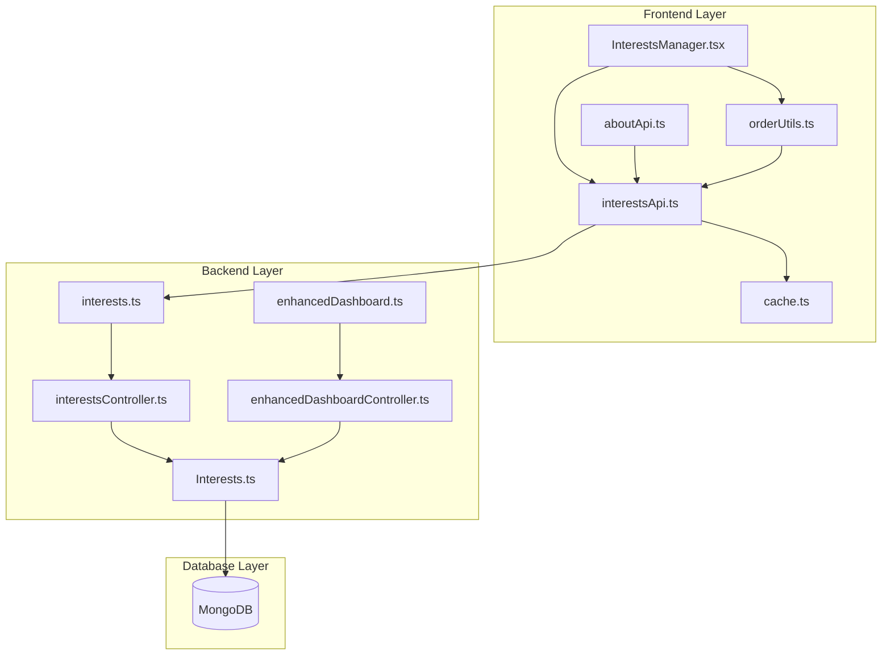
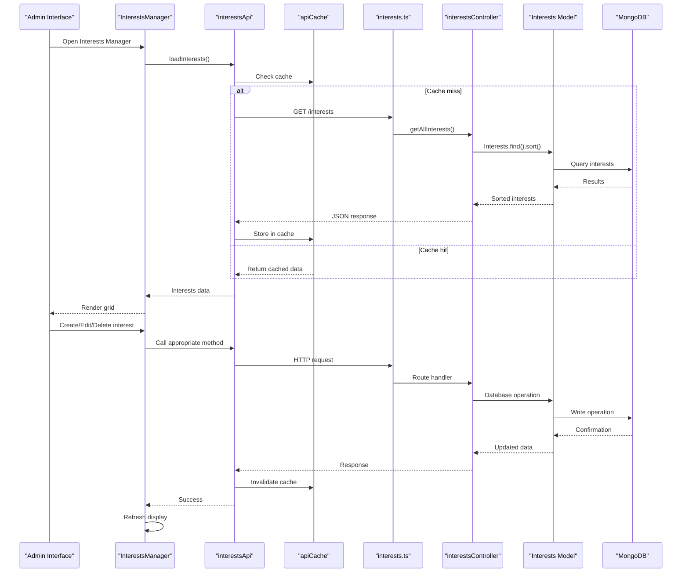
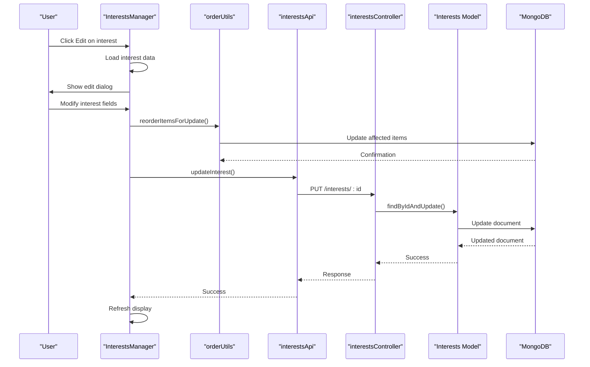
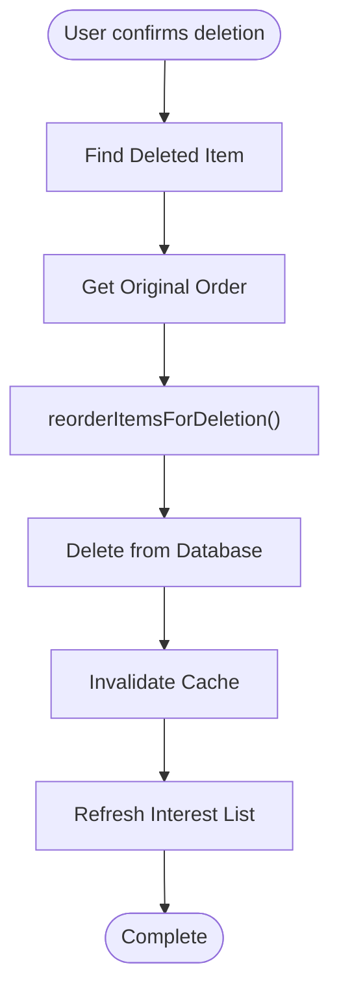
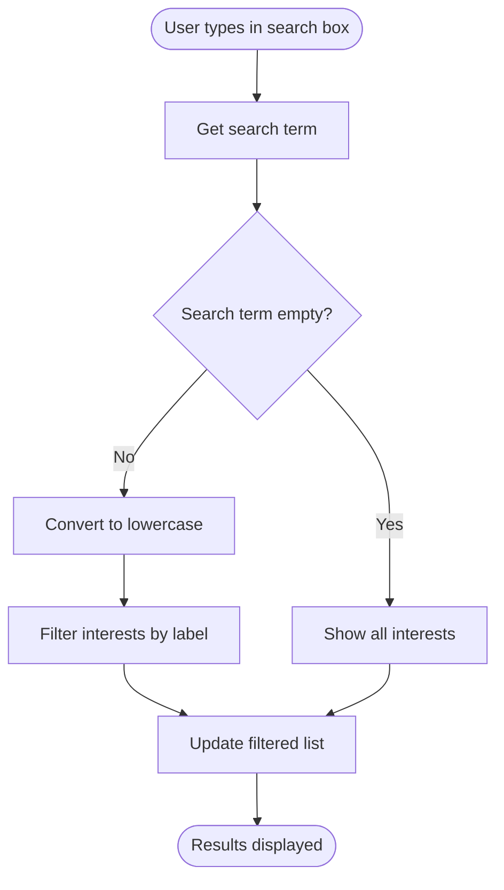
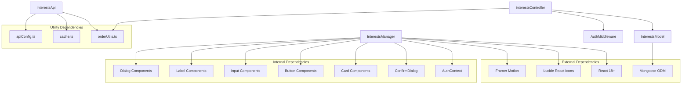

# Interests Manager

<cite>
**Referenced Files in This Document**
- [InterestsManager.tsx](file://personalSite/src/pages/Admin/InterestsManager.tsx)
- [interestsApi.ts](file://personalSite/src/api/interestsApi.ts)
- [Interests.ts](file://server/src/models/Interests.ts)
- [interestsController.ts](file://server/src/controllers/interestsController.ts)
- [interests.ts](file://server/src/routes/interests.ts)
- [orderUtils.ts](file://personalSite/src/lib/orderUtils.ts)
- [cache.ts](file://personalSite/src/lib/cache.ts)
- [aboutApi.ts](file://personalSite/src/api/aboutApi.ts)
- [enhancedDashboardController.ts](file://server/src/controllers/enhancedDashboardController.ts)
- [enhancedDashboard.ts](file://server/src/routes/enhancedDashboard.ts)
</cite>

## Table of Contents
1. [Introduction](#introduction)
2. [Project Structure](#project-structure)
3. [Core Components](#core-components)
4. [Architecture Overview](#architecture-overview)
5. [Detailed Component Analysis](#detailed-component-analysis)
6. [Dependency Analysis](#dependency-analysis)
7. [Performance Considerations](#performance-considerations)
8. [Troubleshooting Guide](#troubleshooting-guide)
9. [Conclusion](#conclusion)

## Introduction
The Interests Manager is a comprehensive administrative component designed for managing personal interests and hobbies within a modern web application. This system provides a complete solution for creating, editing, organizing, and displaying interests with visual representations, flexible categorization, and seamless integration with the frontend About section.

The component features a responsive grid-based display system, advanced search and filtering capabilities, bulk operations for managing interest categories, and robust error handling. It integrates with both the frontend About section and the enhanced dashboard system, providing real-time updates and consistent data presentation across the application.

## Project Structure
The Interests Manager follows a well-organized structure that separates concerns between frontend management, API communication, and backend data handling:



**Diagram sources**
- [InterestsManager.tsx](file://personalSite/src/pages/Admin/InterestsManager.tsx#L1-L348)
- [interestsApi.ts](file://personalSite/src/api/interestsApi.ts#L1-L136)
- [interestsController.ts](file://server/src/controllers/interestsController.ts#L1-L85)
- [interests.ts](file://server/src/routes/interests.ts#L1-L35)

**Section sources**
- [InterestsManager.tsx](file://personalSite/src/pages/Admin/InterestsManager.tsx#L1-L348)
- [interestsApi.ts](file://personalSite/src/api/interestsApi.ts#L1-L136)

## Core Components

### Frontend Management Interface
The Interests Manager provides a comprehensive administrative interface built with React and TypeScript, featuring:

- **Responsive Grid Layout**: Adaptive display system that works across mobile, tablet, and desktop devices
- **Visual Icon System**: Lucide React icons for intuitive visual representation of interests
- **Real-time Search**: Instant filtering of interests based on labels
- **Bulk Operations**: Advanced ordering and reordering capabilities
- **Confirmation Dialogs**: Safe deletion with user confirmation

### API Communication Layer
The system implements a robust API layer with comprehensive error handling and caching:

- **Dual API Endpoints**: Separate endpoints for public consumption and admin management
- **Caching Strategy**: Intelligent caching with automatic invalidation
- **Authentication Integration**: JWT token-based authentication for admin operations
- **Error Propagation**: Comprehensive error handling with meaningful error messages

### Backend Data Management
The backend provides a complete CRUD system with validation and ordering:

- **Mongoose Model**: Structured data model with validation rules
- **Indexing Strategy**: Optimized database queries with ordering support
- **Admin Middleware**: Role-based access control for protected operations
- **Enhanced Dashboard Integration**: Unified data access for dashboard components

**Section sources**
- [InterestsManager.tsx](file://personalSite/src/pages/Admin/InterestsManager.tsx#L27-L348)
- [interestsApi.ts](file://personalSite/src/api/interestsApi.ts#L18-L136)
- [Interests.ts](file://server/src/models/Interests.ts#L1-L35)

## Architecture Overview

The Interests Manager implements a layered architecture that ensures separation of concerns and maintainability:



**Diagram sources**
- [InterestsManager.tsx](file://personalSite/src/pages/Admin/InterestsManager.tsx#L47-L138)
- [interestsApi.ts](file://personalSite/src/api/interestsApi.ts#L18-L136)
- [interestsController.ts](file://server/src/controllers/interestsController.ts#L4-L85)
- [interests.ts](file://server/src/routes/interests.ts#L1-L35)

## Detailed Component Analysis

### Interest Creation Workflow

The interest creation process follows a structured workflow that ensures data integrity and proper ordering:

```mermaid
flowchart TD
Start([User clicks "New Interest"]) --> ValidateForm["Validate Form Fields"]
ValidateForm --> FormValid{"Form Valid?"}
FormValid --> |No| ShowError["Show Validation Error"]
FormValid --> |Yes| ReorderInsert["reorderItemsForInsertion()"]
ReorderInsert --> InsertInterest["Create Interest in Database"]
InsertInterest --> RefreshData["Refresh Interest List"]
RefreshData --> ResetForm["Reset Form Fields"]
ResetForm --> End([Complete])
ShowError --> End
```

**Diagram sources**
- [InterestsManager.tsx](file://personalSite/src/pages/Admin/InterestsManager.tsx#L82-L101)
- [orderUtils.ts](file://personalSite/src/lib/orderUtils.ts#L47-L77)

The creation workflow includes:
- **Form Validation**: Ensures all required fields are present
- **Order Management**: Automatically adjusts existing interest positions
- **Database Persistence**: Creates new interest record with validation
- **Cache Invalidation**: Updates cached data across the application

### Interest Editing and Update Process

The editing system provides comprehensive modification capabilities:



**Diagram sources**
- [InterestsManager.tsx](file://personalSite/src/pages/Admin/InterestsManager.tsx#L103-L120)
- [orderUtils.ts](file://personalSite/src/lib/orderUtils.ts#L174-L237)

### Interest Deletion and Cleanup

The deletion system ensures proper cleanup and reordering:



**Diagram sources**
- [InterestsManager.tsx](file://personalSite/src/pages/Admin/InterestsManager.tsx#L122-L138)
- [orderUtils.ts](file://personalSite/src/lib/orderUtils.ts#L89-L121)

### Visual Representation System

The system provides extensive customization options for interest visual representation:

| Icon Type | Lucide Component | Description |
|-----------|------------------|-------------|
| Heart | `Heart` | Personal interests and hobbies |
| Code2 | `Code2` | Programming-related interests |
| Database | `Database` | Technical interests |
| Palette | `Palette` | Creative pursuits |
| Coffee | `Coffee` | Lifestyle interests |
| Gamepad2 | `Gamepad2` | Gaming interests |
| BookOpen | `BookOpen` | Reading and learning |
| Music | `Music` | Musical interests |

**Section sources**
- [InterestsManager.tsx](file://personalSite/src/pages/Admin/InterestsManager.tsx#L153-L165)
- [InterestsManager.tsx](file://personalSite/src/pages/Admin/InterestsManager.tsx#L203-L224)

### Search and Filtering Implementation

The search functionality provides real-time filtering with instant results:



**Diagram sources**
- [InterestsManager.tsx](file://personalSite/src/pages/Admin/InterestsManager.tsx#L68-L80)

### Responsive Layout System

The grid layout adapts to different screen sizes:

| Breakpoint | Columns | Card Size | Spacing |
|------------|---------|-----------|---------|
| Mobile (<768px) | 1 column | Full width | 1.5rem |
| Tablet (≥768px) | 2 columns | 100% width | 1.5rem |
| Desktop (≥1024px) | 3 columns | 100% width | 1.5rem |
| Large Desktop (≥1200px) | 3 columns | 100% width | 1.5rem |

**Section sources**
- [InterestsManager.tsx](file://personalSite/src/pages/Admin/InterestsManager.tsx#L287-L330)

## Dependency Analysis

The Interests Manager has well-defined dependencies that ensure modularity and maintainability:



**Diagram sources**
- [InterestsManager.tsx](file://personalSite/src/pages/Admin/InterestsManager.tsx#L1-L26)
- [interestsApi.ts](file://personalSite/src/api/interestsApi.ts#L1-L3)
- [interestsController.ts](file://server/src/controllers/interestsController.ts#L1-L2)

**Section sources**
- [InterestsManager.tsx](file://personalSite/src/pages/Admin/InterestsManager.tsx#L1-L26)
- [interestsApi.ts](file://personalSite/src/api/interestsApi.ts#L1-L3)

## Performance Considerations

### Caching Strategy
The system implements a multi-layered caching approach:

- **Frontend Cache**: In-memory cache with TTL (5 minutes default)
- **Cache Keys**: Specific keys for different data types (`interests:*`, `about:*`, `dashboard:*`)
- **Automatic Invalidation**: Cache clearing on data modifications
- **Parallel Loading**: Efficient data fetching strategies

### Database Optimization
- **Indexing**: Orders are indexed for efficient sorting
- **Query Optimization**: Minimal field selection in queries
- **Batch Operations**: Bulk updates for reordering operations

### Frontend Performance
- **Virtual Scrolling**: Consider implementing for large datasets
- **Memoization**: React.memo for unchanged components
- **Lazy Loading**: Images and heavy components can be lazy-loaded

**Section sources**
- [cache.ts](file://personalSite/src/lib/cache.ts#L12-L96)
- [Interests.ts](file://server/src/models/Interests.ts#L32-L34)

## Troubleshooting Guide

### Common Issues and Solutions

| Issue | Symptoms | Solution |
|-------|----------|----------|
| Interest not appearing | Empty grid after refresh | Check authentication token validity |
| Search not working | No filtering results | Verify search term length and case sensitivity |
| Order not updating | Positions remain unchanged | Ensure proper order parameter in requests |
| Icon not displaying | Blank icon field | Check icon name consistency with available options |
| Cache not refreshing | Stale data shown | Manually clear cache or wait for TTL expiration |

### Error Handling Patterns

The system implements comprehensive error handling:

- **Network Errors**: Automatic retry mechanisms and user-friendly messages
- **Validation Errors**: Specific field-level validation feedback
- **Database Errors**: Graceful degradation with fallback data
- **Authentication Errors**: Redirect to login page with error notification

### Debugging Tools

- **Console Logging**: Extensive logging for API calls and errors
- **Cache Inspection**: Cache statistics and key monitoring
- **Network Monitoring**: API response inspection and timing
- **Database Queries**: Query execution plans and performance metrics

**Section sources**
- [interestsApi.ts](file://personalSite/src/api/interestsApi.ts#L30-L33)
- [interestsApi.ts](file://personalSite/src/api/interestsApi.ts#L56-L59)
- [interestsApi.ts](file://personalSite/src/api/interestsApi.ts#L77-L80)

## Conclusion

The Interests Manager represents a comprehensive solution for managing personal interests and hobbies within modern web applications. Its architecture balances functionality, performance, and maintainability while providing an excellent user experience.

Key strengths include:
- **Robust Architecture**: Well-separated concerns with clear boundaries
- **Performance Optimization**: Intelligent caching and efficient data loading
- **User Experience**: Responsive design with intuitive interactions
- **Extensibility**: Modular design supporting future enhancements
- **Integration**: Seamless connection with About section and dashboard systems

The system provides a solid foundation for managing interests with room for future enhancements such as advanced categorization, bulk operations, and enhanced visual customization options.