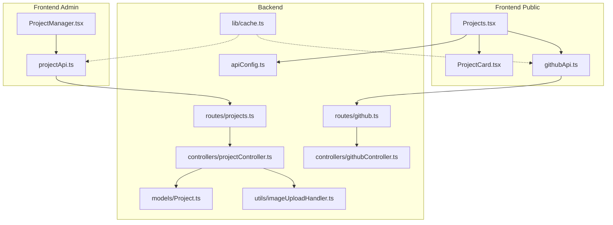
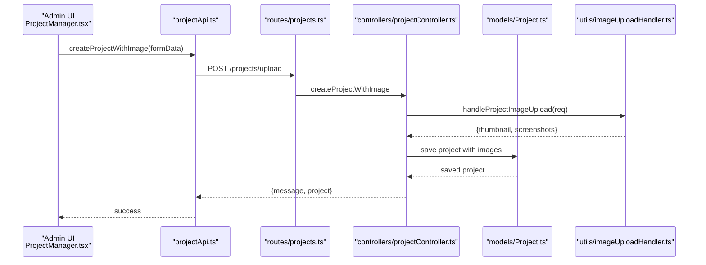
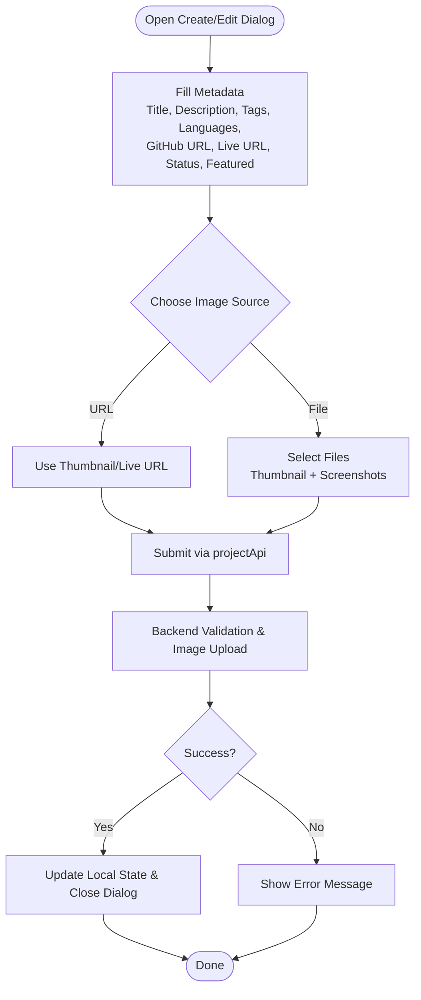
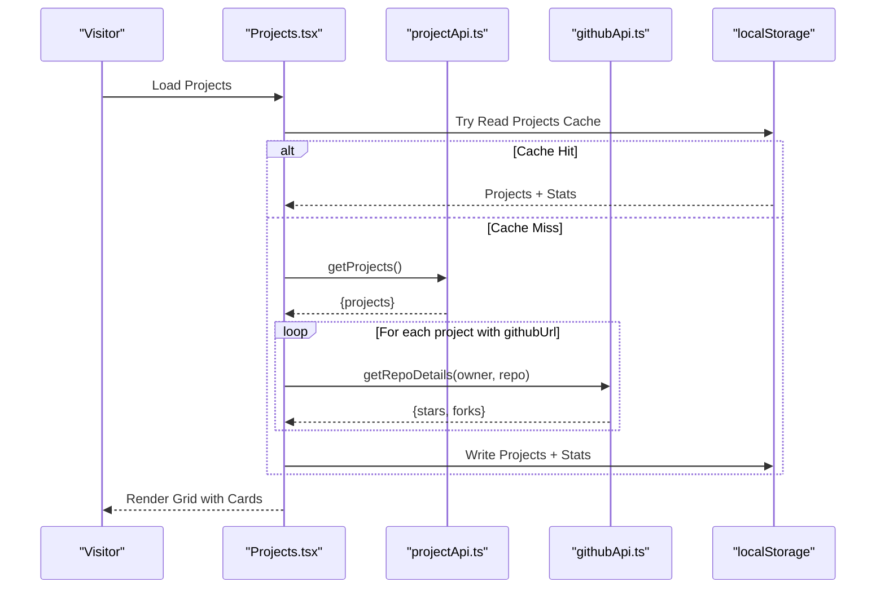
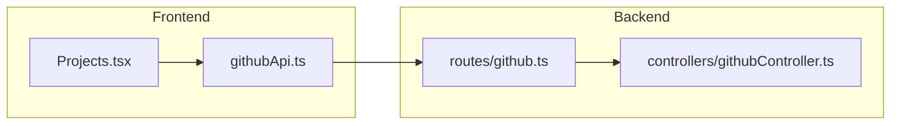
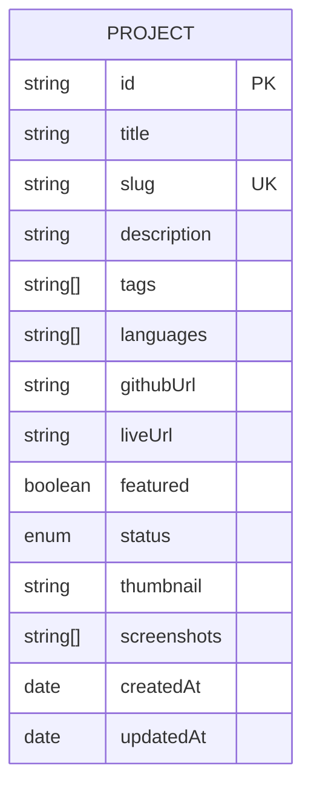
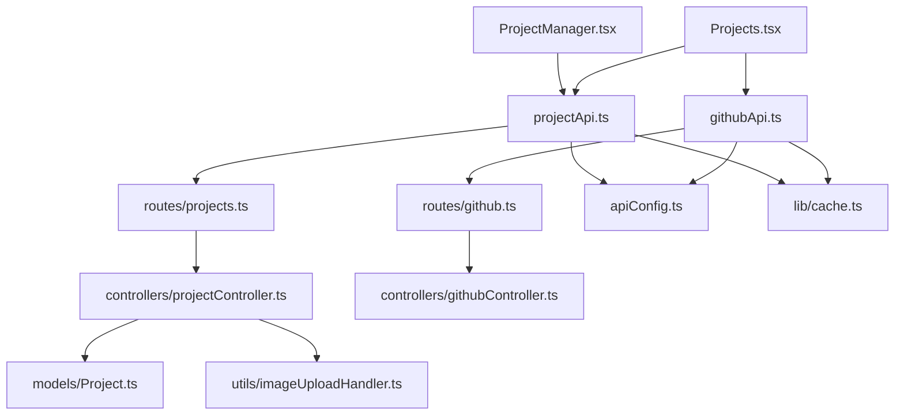

# Project Manager

<cite>
**Referenced Files in This Document**
- [ProjectManager.tsx](file://personalSite/src/pages/Admin/ProjectManager.tsx)
- [projectApi.ts](file://personalSite/src/api/projectApi.ts)
- [projectController.ts](file://server/src/controllers/projectController.ts)
- [Project.ts](file://server/src/models/Project.ts)
- [projects.ts](file://server/src/routes/projects.ts)
- [imageUploadHandler.ts](file://server/src/utils/imageUploadHandler.ts)
- [Projects.tsx](file://personalSite/src/pages/Projects.tsx)
- [ProjectCard.tsx](file://personalSite/src/components/ui/ProjectCard.tsx)
- [githubApi.ts](file://personalSite/src/api/githubApi.ts)
- [githubController.ts](file://server/src/controllers/githubController.ts)
- [github.ts](file://server/src/routes/github.ts)
- [apiConfig.ts](file://personalSite/src/lib/apiConfig.ts)
- [cache.ts](file://personalSite/src/lib/cache.ts)
</cite>

## Table of Contents
1. [Introduction](#introduction)
2. [Project Structure](#project-structure)
3. [Core Components](#core-components)
4. [Architecture Overview](#architecture-overview)
5. [Detailed Component Analysis](#detailed-component-analysis)
6. [Dependency Analysis](#dependency-analysis)
7. [Performance Considerations](#performance-considerations)
8. [Troubleshooting Guide](#troubleshooting-guide)
9. [Conclusion](#conclusion)

## Introduction
This document describes the Project Manager component responsible for portfolio project management. It covers the end-to-end workflows for creating and editing projects, including metadata handling (title, description, tags, languages), GitHub repository integration, live demo URLs, project categorization, and the project gallery interface with image upload capabilities. It also documents the status management system (draft/published), responsive grid layout, filtering and sorting, bulk operations, GitHub API integration for real-time repository data, customization examples, validation rules, extension points, performance optimizations, synchronization processes, error handling, and frontend showcase integration.

## Project Structure
The Project Manager spans three layers:
- Frontend Admin UI: React page for managing projects (create, edit, delete, toggle status).
- Frontend Public UI: React page for displaying projects with GitHub stats and filtering.
- Backend API: Express routes and controllers handling CRUD, image uploads, GitHub integration, and data validation.

**Diagram sources**
- [ProjectManager.tsx](file://personalSite/src/pages/Admin/ProjectManager.tsx#L30-L864)
- [projectApi.ts](file://personalSite/src/api/projectApi.ts#L28-L259)
- [Projects.tsx](file://personalSite/src/pages/Projects.tsx#L108-L337)
- [ProjectCard.tsx](file://personalSite/src/components/ui/ProjectCard.tsx#L39-L170)
- [githubApi.ts](file://personalSite/src/api/githubApi.ts#L6-L46)
- [projects.ts](file://server/src/routes/projects.ts#L1-L71)
- [projectController.ts](file://server/src/controllers/projectController.ts#L148-L926)
- [Project.ts](file://server/src/models/Project.ts#L1-L97)
- [imageUploadHandler.ts](file://server/src/utils/imageUploadHandler.ts#L47-L199)
- [github.ts](file://server/src/routes/github.ts#L1-L9)
- [githubController.ts](file://server/src/controllers/githubController.ts#L4-L177)
- [apiConfig.ts](file://personalSite/src/lib/apiConfig.ts#L6-L75)
- [cache.ts](file://personalSite/src/lib/cache.ts#L12-L137)

**Section sources**
- [ProjectManager.tsx](file://personalSite/src/pages/Admin/ProjectManager.tsx#L30-L864)
- [projectApi.ts](file://personalSite/src/api/projectApi.ts#L28-L259)
- [Projects.tsx](file://personalSite/src/pages/Projects.tsx#L108-L337)
- [ProjectCard.tsx](file://personalSite/src/components/ui/ProjectCard.tsx#L39-L170)
- [githubApi.ts](file://personalSite/src/api/githubApi.ts#L6-L46)
- [projects.ts](file://server/src/routes/projects.ts#L1-L71)
- [projectController.ts](file://server/src/controllers/projectController.ts#L148-L926)
- [Project.ts](file://server/src/models/Project.ts#L1-L97)
- [imageUploadHandler.ts](file://server/src/utils/imageUploadHandler.ts#L47-L199)
- [github.ts](file://server/src/routes/github.ts#L1-L9)
- [githubController.ts](file://server/src/controllers/githubController.ts#L4-L177)
- [apiConfig.ts](file://personalSite/src/lib/apiConfig.ts#L6-L75)
- [cache.ts](file://personalSite/src/lib/cache.ts#L12-L137)

## Core Components
- Admin Project Manager UI: Handles project creation/editing with metadata, URLs, status, and image uploads; supports filtering and bulk-like toggles (publish/feature).
- Public Projects Gallery: Renders a responsive grid, integrates GitHub stats, and supports tag-based filtering and search.
- Backend Project API: Validates and persists projects, manages image uploads, and exposes admin endpoints.
- GitHub Integration: Fetches repository details and languages for live stats and extended metadata.

Key responsibilities:
- Metadata: title, description, tags, languages.
- URLs: GitHub repository and live demo links.
- Status: draft vs published.
- Images: thumbnail and multiple screenshots via FormData.
- Filtering/Sync: Tag filter and GitHub star/fork counts on the public gallery.

**Section sources**
- [ProjectManager.tsx](file://personalSite/src/pages/Admin/ProjectManager.tsx#L14-L28)
- [projectApi.ts](file://personalSite/src/api/projectApi.ts#L28-L259)
- [Projects.tsx](file://personalSite/src/pages/Projects.tsx#L108-L337)
- [ProjectCard.tsx](file://personalSite/src/components/ui/ProjectCard.tsx#L10-L31)
- [projectController.ts](file://server/src/controllers/projectController.ts#L148-L329)
- [Project.ts](file://server/src/models/Project.ts#L3-L17)
- [githubController.ts](file://server/src/controllers/githubController.ts#L4-L100)

## Architecture Overview
The system follows a layered architecture:
- Frontend Admin uses projectApi to call backend routes for CRUD and image uploads.
- Frontend Public uses projectApi and githubApi to render projects and enrich with GitHub stats.
- Backend routes delegate to controllers that validate inputs, manage images, and query the database model.
- GitHub API is proxied through backend routes to avoid client-side rate limits and token exposure.

**Diagram sources**
- [ProjectManager.tsx](file://personalSite/src/pages/Admin/ProjectManager.tsx#L69-L161)
- [projectApi.ts](file://personalSite/src/api/projectApi.ts#L153-L178)
- [projects.ts](file://server/src/routes/projects.ts#L58-L62)
- [projectController.ts](file://server/src/controllers/projectController.ts#L148-L329)
- [Project.ts](file://server/src/models/Project.ts#L19-L97)
- [imageUploadHandler.ts](file://server/src/utils/imageUploadHandler.ts#L47-L199)

## Detailed Component Analysis

### Admin Project Creation and Editing Workflow
- Creation:
  - Collects metadata (title, description, tags, languages), optional URLs, status, and feature flag.
  - Supports thumbnail and multiple screenshots via file inputs or URL fields.
  - Sends FormData to backend endpoint with image fields handled by multer.
  - On success, updates local state and resets form.
- Editing:
  - Mirrors creation with validation and image replacement.
  - Supports selective field updates and image replacement.
- Validation:
  - Backend enforces presence and format for title/description/tags/languages.
  - URL fields validated as URLs or empty.
  - Status constrained to draft/published.
- Status Management:
  - Toggle featured flag and publish/unpublish actions.
- Filtering:
  - Local client-side filtering by search term across title, description, and tags.

**Diagram sources**
- [ProjectManager.tsx](file://personalSite/src/pages/Admin/ProjectManager.tsx#L69-L242)
- [projectApi.ts](file://personalSite/src/api/projectApi.ts#L153-L233)
- [projectController.ts](file://server/src/controllers/projectController.ts#L148-L329)
- [imageUploadHandler.ts](file://server/src/utils/imageUploadHandler.ts#L47-L199)

**Section sources**
- [ProjectManager.tsx](file://personalSite/src/pages/Admin/ProjectManager.tsx#L30-L864)
- [projectApi.ts](file://personalSite/src/api/projectApi.ts#L128-L233)
- [projectController.ts](file://server/src/controllers/projectController.ts#L148-L329)
- [projects.ts](file://server/src/routes/projects.ts#L58-L68)
- [imageUploadHandler.ts](file://server/src/utils/imageUploadHandler.ts#L47-L199)

### Project Gallery and Responsive Grid
- Public gallery displays projects in a responsive grid (1 column on mobile, up to 3 on large screens).
- Each card shows:
  - Thumbnail or fallback gradient.
  - Title, description, tags, and optional languages.
  - Links to live site and GitHub repository.
  - GitHub stars and forks pulled from GitHub API.
- Filtering:
  - Tag-based filter with “All” option.
  - Text search across title, description, and tags.
- Caching:
  - Projects and GitHub stats cached in localStorage with TTL.
  - GitHub API calls are rate-limited and cached via backend cache utilities.

**Diagram sources**
- [Projects.tsx](file://personalSite/src/pages/Projects.tsx#L108-L189)
- [projectApi.ts](file://personalSite/src/api/projectApi.ts#L29-L62)
- [githubApi.ts](file://personalSite/src/api/githubApi.ts#L6-L46)
- [ProjectCard.tsx](file://personalSite/src/components/ui/ProjectCard.tsx#L39-L170)

**Section sources**
- [Projects.tsx](file://personalSite/src/pages/Projects.tsx#L108-L337)
- [ProjectCard.tsx](file://personalSite/src/components/ui/ProjectCard.tsx#L10-L31)
- [githubApi.ts](file://personalSite/src/api/githubApi.ts#L6-L46)
- [cache.ts](file://personalSite/src/lib/cache.ts#L12-L137)

### Status Management and Bulk Operations
- Status toggles:
  - Publish/unpublish individual projects.
  - Feature/unfeature projects.
- Bulk-like operations:
  - Toggle status for multiple projects via repeated individual toggles.
  - No dedicated multi-select bulk action is present in the current UI.

**Section sources**
- [ProjectManager.tsx](file://personalSite/src/pages/Admin/ProjectManager.tsx#L295-L331)
- [projectController.ts](file://server/src/controllers/projectController.ts#L690-L804)

### GitHub Integration and Synchronization
- Backend GitHub API:
  - Proxies GitHub Repositories and Repo Details endpoints.
  - Optionally uses a GitHub token to increase rate limits.
  - Filters private repos when no token is provided.
- Frontend GitHub API:
  - Wraps proxy endpoints with caching and error handling.
- Public gallery enrichment:
  - Extracts owner/repo from GitHub URL and fetches stars/forks.
  - Stores stats in a map keyed by project ID.

**Diagram sources**
- [github.ts](file://server/src/routes/github.ts#L1-L9)
- [githubController.ts](file://server/src/controllers/githubController.ts#L4-L177)
- [githubApi.ts](file://personalSite/src/api/githubApi.ts#L6-L46)
- [Projects.tsx](file://personalSite/src/pages/Projects.tsx#L144-L164)

**Section sources**
- [githubController.ts](file://server/src/controllers/githubController.ts#L4-L177)
- [github.ts](file://server/src/routes/github.ts#L1-L9)
- [githubApi.ts](file://personalSite/src/api/githubApi.ts#L6-L46)
- [Projects.tsx](file://personalSite/src/pages/Projects.tsx#L144-L164)

### Data Model and Validation
- Project model fields:
  - title, slug, description, tags[], languages[], optional URLs, featured, status, thumbnail, screenshots[].
- Validation:
  - Backend express-validator rules enforce presence, length, format, and enums.
  - URL validators ensure GitHub and live URLs are valid or empty.
  - Unique slug resolution prevents conflicts.

**Diagram sources**
- [Project.ts](file://server/src/models/Project.ts#L3-L17)

**Section sources**
- [Project.ts](file://server/src/models/Project.ts#L19-L97)
- [projectController.ts](file://server/src/controllers/projectController.ts#L148-L329)

## Dependency Analysis
- Frontend Admin depends on:
  - projectApi for CRUD and image uploads.
  - AuthContext for token availability.
  - UI primitives for forms and dialogs.
- Frontend Public depends on:
  - projectApi for project data.
  - githubApi for GitHub stats.
  - cache utilities for performance.
- Backend depends on:
  - express-validator for input validation.
  - mongoose for persistence.
  - multer for image uploads.
  - axios for GitHub API calls.

**Diagram sources**
- [ProjectManager.tsx](file://personalSite/src/pages/Admin/ProjectManager.tsx#L1-L12)
- [Projects.tsx](file://personalSite/src/pages/Projects.tsx#L1-L10)
- [projectApi.ts](file://personalSite/src/api/projectApi.ts#L1-L3)
- [githubApi.ts](file://personalSite/src/api/githubApi.ts#L1-L3)
- [projects.ts](file://server/src/routes/projects.ts#L1-L3)
- [github.ts](file://server/src/routes/github.ts#L1-L3)
- [projectController.ts](file://server/src/controllers/projectController.ts#L1-L7)
- [Project.ts](file://server/src/models/Project.ts#L1-L2)
- [imageUploadHandler.ts](file://server/src/utils/imageUploadHandler.ts#L1-L5)
- [githubController.ts](file://server/src/controllers/githubController.ts#L1-L3)
- [apiConfig.ts](file://personalSite/src/lib/apiConfig.ts#L6-L52)
- [cache.ts](file://personalSite/src/lib/cache.ts#L12-L99)

**Section sources**
- [ProjectManager.tsx](file://personalSite/src/pages/Admin/ProjectManager.tsx#L1-L12)
- [Projects.tsx](file://personalSite/src/pages/Projects.tsx#L1-L10)
- [projectApi.ts](file://personalSite/src/api/projectApi.ts#L1-L3)
- [githubApi.ts](file://personalSite/src/api/githubApi.ts#L1-L3)
- [projects.ts](file://server/src/routes/projects.ts#L1-L3)
- [github.ts](file://server/src/routes/github.ts#L1-L3)
- [projectController.ts](file://server/src/controllers/projectController.ts#L1-L7)
- [Project.ts](file://server/src/models/Project.ts#L1-L2)
- [imageUploadHandler.ts](file://server/src/utils/imageUploadHandler.ts#L1-L5)
- [githubController.ts](file://server/src/controllers/githubController.ts#L1-L3)
- [apiConfig.ts](file://personalSite/src/lib/apiConfig.ts#L6-L52)
- [cache.ts](file://personalSite/src/lib/cache.ts#L12-L99)

## Performance Considerations
- Caching:
  - Frontend caches project lists and individual project data with TTL.
  - Projects page caches both projects and GitHub stats in localStorage with TTL.
  - Backend cache utilities support invalidation on create/update/delete.
- Image Upload:
  - Multer configured with 2MB file size limit and image-only filter.
  - handleProjectImageUpload supports named fields for thumbnail and screenshots.
- Pagination and Sorting:
  - Backend supports pagination and sorting for published/all projects.
- Rendering:
  - Public gallery uses virtualized-like rendering via grid layout and lazy image loading in cards.

Recommendations:
- Introduce server-side caching for GitHub API responses to reduce latency and rate limit pressure.
- Consider debouncing search input in the Admin UI to reduce unnecessary requests.
- Optimize image sizes and leverage modern formats (AVIF/WebP) for thumbnails/screenshots.

**Section sources**
- [cache.ts](file://personalSite/src/lib/cache.ts#L12-L137)
- [Projects.tsx](file://personalSite/src/pages/Projects.tsx#L58-L106)
- [projectApi.ts](file://personalSite/src/api/projectApi.ts#L34-L62)
- [projects.ts](file://server/src/routes/projects.ts#L17-L32)
- [projectController.ts](file://server/src/controllers/projectController.ts#L25-L125)
- [imageUploadHandler.ts](file://server/src/utils/imageUploadHandler.ts#L47-L199)

## Troubleshooting Guide
Common issues and resolutions:
- Authentication failures:
  - Admin operations require a valid bearer token; ensure AuthContext provides token.
- Validation errors:
  - Backend returns structured validation errors for missing/invalid fields.
  - Fix inputs according to validation messages (title length, tags count, URL format).
- Image upload errors:
  - Ensure files are images and under 2MB; verify multer configuration.
  - Check handleProjectImageUpload error messages for specific failures.
- GitHub API errors:
  - Rate limiting or private repositories without token cause filtered results.
  - Backend returns 403/404 for rate limit or not found; frontend shows appropriate messages.
- Cache inconsistencies:
  - After create/update/delete, cache invalidation runs; clear browser cache/localStorage if stale data appears.

**Section sources**
- [ProjectManager.tsx](file://personalSite/src/pages/Admin/ProjectManager.tsx#L70-L160)
- [projectController.ts](file://server/src/controllers/projectController.ts#L265-L329)
- [imageUploadHandler.ts](file://server/src/utils/imageUploadHandler.ts#L47-L199)
- [githubController.ts](file://server/src/controllers/githubController.ts#L88-L100)
- [Projects.tsx](file://personalSite/src/pages/Projects.tsx#L150-L164)

## Conclusion
The Project Manager provides a robust, extensible system for portfolio project management. It balances admin-friendly creation/editing with a performant public showcase enriched by GitHub metrics. The architecture cleanly separates concerns across frontend and backend, with strong validation, caching, and error handling. Extensibility points include custom project fields, advanced validation rules, additional technology integrations, and performance optimizations for image galleries and GitHub sync.