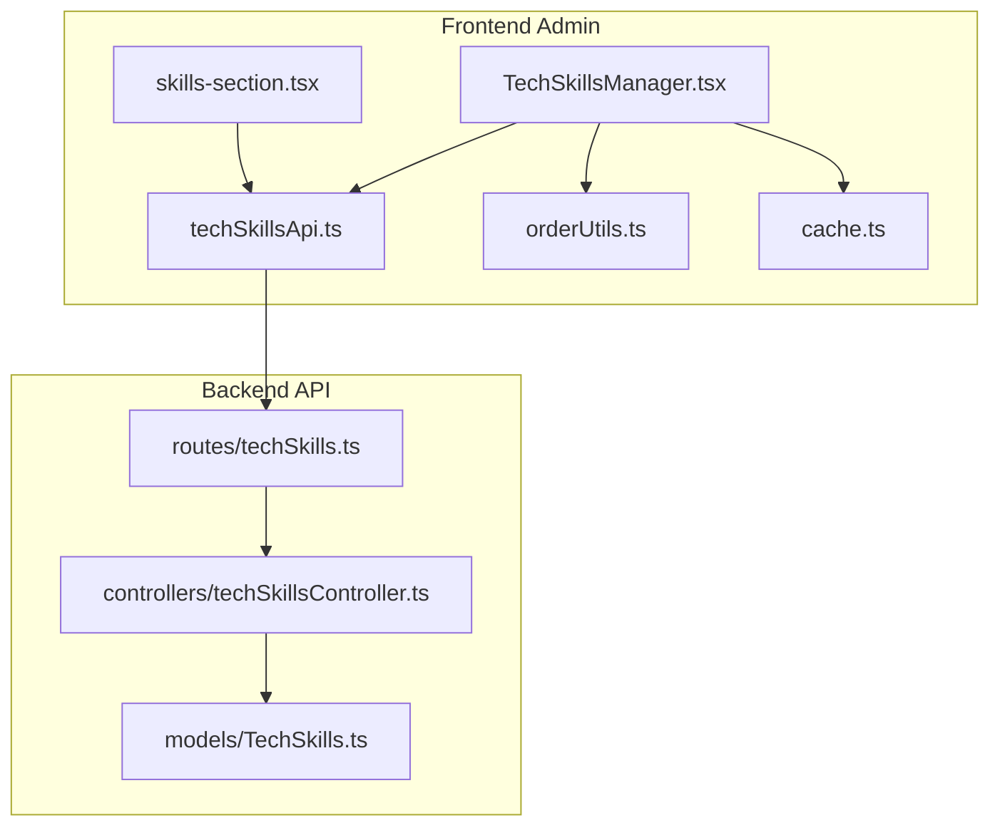
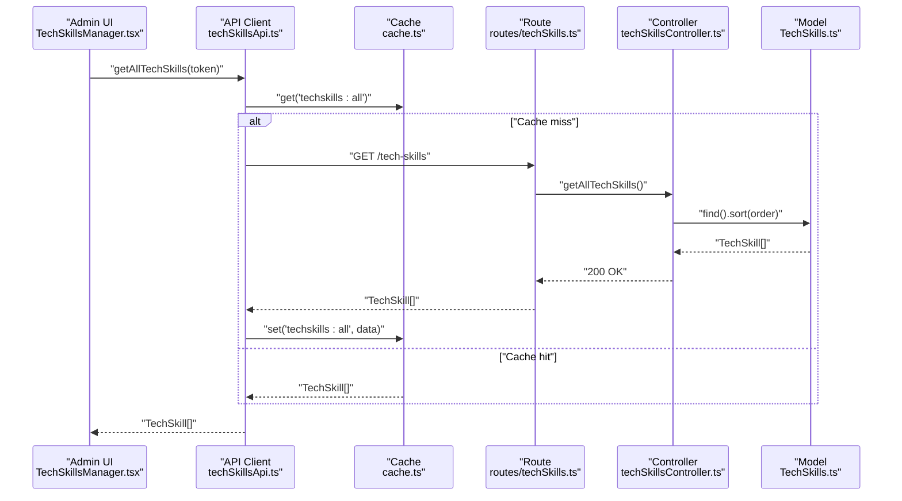
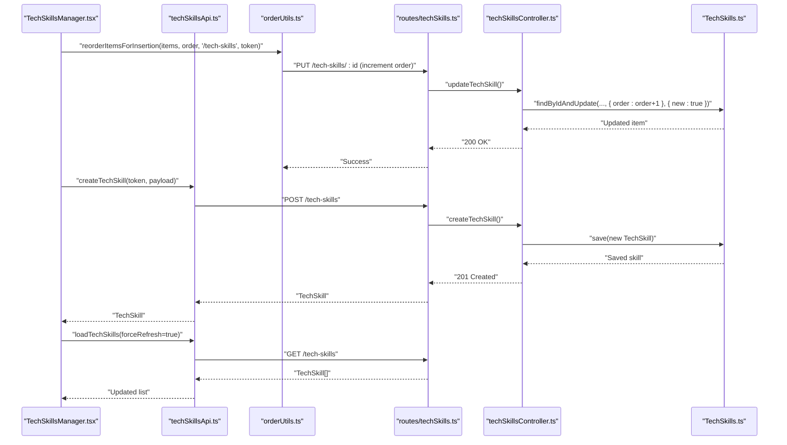
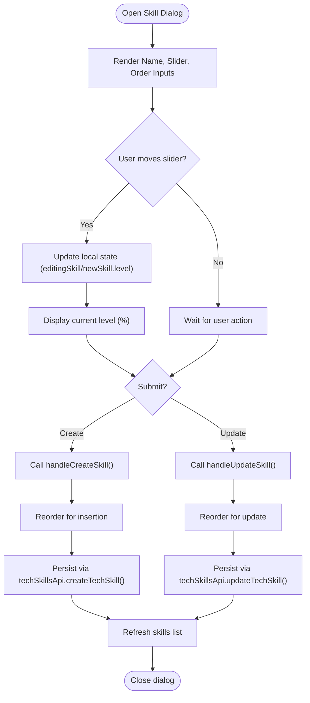
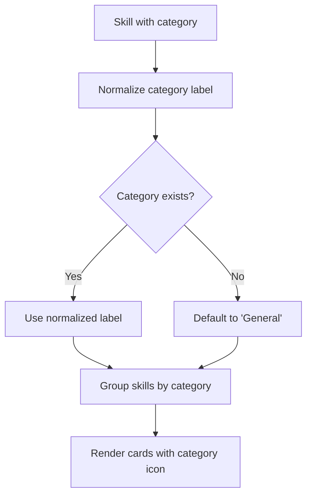
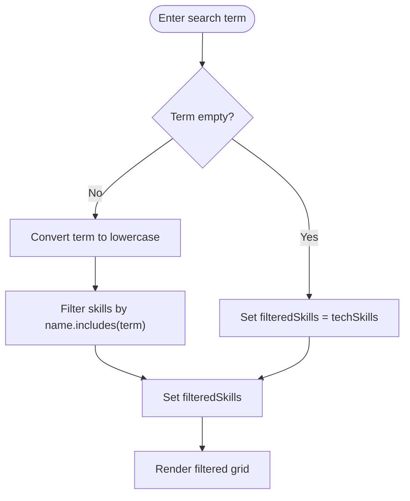
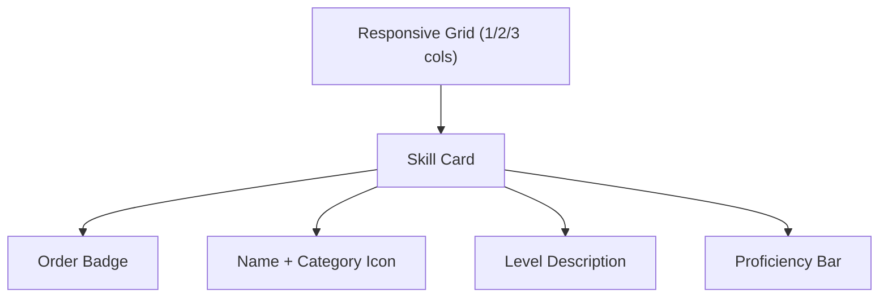
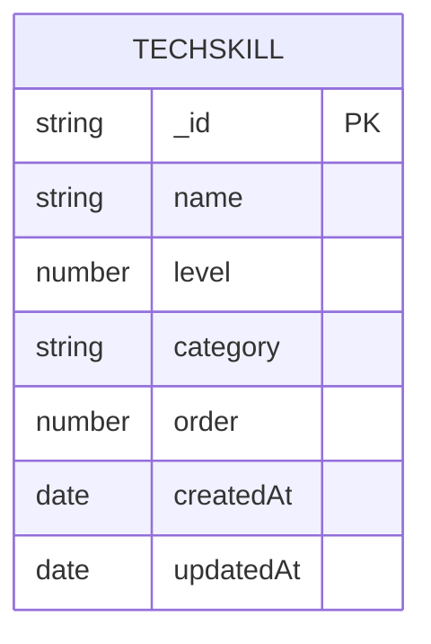
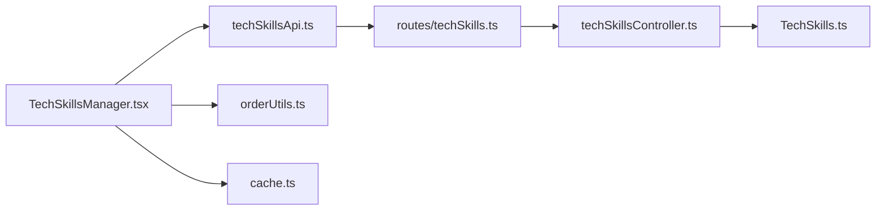

# Tech Skills Manager

<cite>
**Referenced Files in This Document**
- [TechSkillsManager.tsx](file://personalSite/src/pages/Admin/TechSkillsManager.tsx)
- [techSkillsApi.ts](file://personalSite/src/api/techSkillsApi.ts)
- [orderUtils.ts](file://personalSite/src/lib/orderUtils.ts)
- [cache.ts](file://personalSite/src/lib/cache.ts)
- [skills-section.tsx](file://portfolio/src/components/sections/skills-section.tsx)
- [techSkillsController.ts](file://server/src/controllers/techSkillsController.ts)
- [TechSkills.ts](file://server/src/models/TechSkills.ts)
- [techSkills.ts](file://server/src/routes/techSkills.ts)
</cite>

## Table of Contents
1. [Introduction](#introduction)
2. [Project Structure](#project-structure)
3. [Core Components](#core-components)
4. [Architecture Overview](#architecture-overview)
5. [Detailed Component Analysis](#detailed-component-analysis)
6. [Dependency Analysis](#dependency-analysis)
7. [Performance Considerations](#performance-considerations)
8. [Troubleshooting Guide](#troubleshooting-guide)
9. [Conclusion](#conclusion)

## Introduction
The Tech Skills Manager is a comprehensive administrative interface for managing technical skills, including creation, editing, deletion, search, and display. It integrates with backend API endpoints to persist skill data, supports drag-and-drop reordering via order management utilities, and provides a responsive grid layout for displaying skills with proficiency indicators. The component also connects to the public frontend skills section to render categorized skill lists with terminal-style visuals.

## Project Structure
The Tech Skills Manager spans three primary areas:
- Frontend Admin Component: Handles CRUD operations, search/filtering, and UI rendering.
- API Layer: Defines typed interfaces and HTTP clients for tech skills.
- Backend Services: Expose REST endpoints, enforce validation, and manage persistence.

**Diagram sources**
- [TechSkillsManager.tsx](file://personalSite/src/pages/Admin/TechSkillsManager.tsx#L1-L356)
- [techSkillsApi.ts](file://personalSite/src/api/techSkillsApi.ts#L1-L134)
- [orderUtils.ts](file://personalSite/src/lib/orderUtils.ts#L1-L238)
- [cache.ts](file://personalSite/src/lib/cache.ts#L1-L137)
- [skills-section.tsx](file://portfolio/src/components/sections/skills-section.tsx#L1-L142)
- [techSkills.ts](file://server/src/routes/techSkills.ts#L1-L35)
- [techSkillsController.ts](file://server/src/controllers/techSkillsController.ts#L1-L86)
- [TechSkills.ts](file://server/src/models/TechSkills.ts#L1-L41)

**Section sources**
- [TechSkillsManager.tsx](file://personalSite/src/pages/Admin/TechSkillsManager.tsx#L1-L356)
- [techSkillsApi.ts](file://personalSite/src/api/techSkillsApi.ts#L1-L134)
- [orderUtils.ts](file://personalSite/src/lib/orderUtils.ts#L1-L238)
- [cache.ts](file://personalSite/src/lib/cache.ts#L1-L137)
- [skills-section.tsx](file://portfolio/src/components/sections/skills-section.tsx#L1-L142)
- [techSkills.ts](file://server/src/routes/techSkills.ts#L1-L35)
- [techSkillsController.ts](file://server/src/controllers/techSkillsController.ts#L1-L86)
- [TechSkills.ts](file://server/src/models/TechSkills.ts#L1-L41)

## Core Components
- TechSkillsManager (Admin UI):
  - Manages state for skills, search term, loading, dialogs, and confirmations.
  - Implements create, update, and delete workflows with order-aware reordering.
  - Renders a responsive grid with proficiency bars and category-specific icons.
- Tech Skills API Client:
  - Provides typed methods for fetching, creating, updating, and deleting skills.
  - Integrates caching with TTL and cache invalidation on mutations.
- Ordering Utilities:
  - Handles insertion, update, deletion, and full reordering to maintain contiguous order sequences.
- Backend Controllers and Routes:
  - Expose GET/POST/PUT/DELETE endpoints with admin authentication.
  - Enforce model-level validation and sort by order and creation date.

**Section sources**
- [TechSkillsManager.tsx](file://personalSite/src/pages/Admin/TechSkillsManager.tsx#L25-L137)
- [techSkillsApi.ts](file://personalSite/src/api/techSkillsApi.ts#L19-L134)
- [orderUtils.ts](file://personalSite/src/lib/orderUtils.ts#L47-L237)
- [techSkillsController.ts](file://server/src/controllers/techSkillsController.ts#L4-L86)
- [techSkills.ts](file://server/src/routes/techSkills.ts#L13-L35)

## Architecture Overview
The system follows a layered architecture:
- Presentation Layer: Admin page renders skills and provides controls.
- API Layer: Typed client encapsulates HTTP requests and caching.
- Business Logic: Ordering utilities ensure consistent order sequences.
- Persistence: Backend routes, controllers, and Mongoose models.

**Diagram sources**
- [TechSkillsManager.tsx](file://personalSite/src/pages/Admin/TechSkillsManager.tsx#L45-L59)
- [techSkillsApi.ts](file://personalSite/src/api/techSkillsApi.ts#L42-L66)
- [cache.ts](file://personalSite/src/lib/cache.ts#L20-L48)
- [techSkills.ts](file://server/src/routes/techSkills.ts#L20-L21)
- [techSkillsController.ts](file://server/src/controllers/techSkillsController.ts#L4-L12)
- [TechSkills.ts](file://server/src/models/TechSkills.ts#L38-L41)

## Detailed Component Analysis

### Admin Skill Management Workflow
The Admin UI orchestrates skill lifecycle operations with order-aware updates and caching.

**Diagram sources**
- [TechSkillsManager.tsx](file://personalSite/src/pages/Admin/TechSkillsManager.tsx#L80-L99)
- [orderUtils.ts](file://personalSite/src/lib/orderUtils.ts#L47-L77)
- [techSkillsApi.ts](file://personalSite/src/api/techSkillsApi.ts#L68-L90)
- [techSkills.ts](file://server/src/routes/techSkills.ts#L26-L30)
- [techSkillsController.ts](file://server/src/controllers/techSkillsController.ts#L30-L47)
- [TechSkills.ts](file://server/src/models/TechSkills.ts#L12-L36)

**Section sources**
- [TechSkillsManager.tsx](file://personalSite/src/pages/Admin/TechSkillsManager.tsx#L80-L119)
- [orderUtils.ts](file://personalSite/src/lib/orderUtils.ts#L47-L77)
- [techSkillsApi.ts](file://personalSite/src/api/techSkillsApi.ts#L68-L90)

### Proficiency Rating Interface
The Admin UI provides a slider-based interface for setting proficiency levels with real-time display.

**Diagram sources**
- [TechSkillsManager.tsx](file://personalSite/src/pages/Admin/TechSkillsManager.tsx#L190-L250)
- [TechSkillsManager.tsx](file://personalSite/src/pages/Admin/TechSkillsManager.tsx#L101-L119)
- [TechSkillsManager.tsx](file://personalSite/src/pages/Admin/TechSkillsManager.tsx#L80-L99)

**Section sources**
- [TechSkillsManager.tsx](file://personalSite/src/pages/Admin/TechSkillsManager.tsx#L205-L219)
- [TechSkillsManager.tsx](file://personalSite/src/pages/Admin/TechSkillsManager.tsx#L101-L119)

### Skills Categorization and Icons
Skills are categorized and rendered with category-specific icons. The Admin UI maps category names to icons, while the frontend skills section normalizes category labels and builds categories dynamically.

**Diagram sources**
- [TechSkillsManager.tsx](file://personalSite/src/pages/Admin/TechSkillsManager.tsx#L152-L167)
- [skills-section.tsx](file://portfolio/src/components/sections/skills-section.tsx#L41-L53)
- [skills-section.tsx](file://portfolio/src/components/sections/skills-section.tsx#L55-L82)

**Section sources**
- [TechSkillsManager.tsx](file://personalSite/src/pages/Admin/TechSkillsManager.tsx#L152-L167)
- [skills-section.tsx](file://portfolio/src/components/sections/skills-section.tsx#L41-L82)

### Skill Search and Filtering
The Admin UI filters skills client-side by name as the user types, providing immediate feedback without server round-trips.

**Diagram sources**
- [TechSkillsManager.tsx](file://personalSite/src/pages/Admin/TechSkillsManager.tsx#L66-L78)

**Section sources**
- [TechSkillsManager.tsx](file://personalSite/src/pages/Admin/TechSkillsManager.tsx#L66-L78)

### Responsive Grid Layout
Skills are displayed in a responsive grid that adapts from single-column on small screens to triple-column on large screens, with each card showing order, name, level, and proficiency bar.

**Diagram sources**
- [TechSkillsManager.tsx](file://personalSite/src/pages/Admin/TechSkillsManager.tsx#L280-L337)

**Section sources**
- [TechSkillsManager.tsx](file://personalSite/src/pages/Admin/TechSkillsManager.tsx#L280-L337)

### Backend Integration and Validation
The backend enforces strict validation for skill fields and sorts results by order and creation date.

**Diagram sources**
- [TechSkills.ts](file://server/src/models/TechSkills.ts#L3-L10)

**Section sources**
- [techSkillsController.ts](file://server/src/controllers/techSkillsController.ts#L30-L47)
- [TechSkills.ts](file://server/src/models/TechSkills.ts#L12-L36)

## Dependency Analysis
The Admin component depends on the API client, ordering utilities, and cache. The API client depends on the backend routes and controllers, which in turn depend on the Mongoose model.

**Diagram sources**
- [TechSkillsManager.tsx](file://personalSite/src/pages/Admin/TechSkillsManager.tsx#L21-L23)
- [techSkillsApi.ts](file://personalSite/src/api/techSkillsApi.ts#L1-L3)
- [orderUtils.ts](file://personalSite/src/lib/orderUtils.ts#L1-L2)
- [cache.ts](file://personalSite/src/lib/cache.ts#L1-L2)
- [techSkills.ts](file://server/src/routes/techSkills.ts#L1-L2)
- [techSkillsController.ts](file://server/src/controllers/techSkillsController.ts#L1-L2)
- [TechSkills.ts](file://server/src/models/TechSkills.ts#L1-L2)

**Section sources**
- [TechSkillsManager.tsx](file://personalSite/src/pages/Admin/TechSkillsManager.tsx#L21-L23)
- [techSkillsApi.ts](file://personalSite/src/api/techSkillsApi.ts#L1-L3)
- [orderUtils.ts](file://personalSite/src/lib/orderUtils.ts#L1-L2)
- [cache.ts](file://personalSite/src/lib/cache.ts#L1-L2)
- [techSkills.ts](file://server/src/routes/techSkills.ts#L1-L2)
- [techSkillsController.ts](file://server/src/controllers/techSkillsController.ts#L1-L2)
- [TechSkills.ts](file://server/src/models/TechSkills.ts#L1-L2)

## Performance Considerations
- Caching: The API client caches responses with TTL and invalidates on mutations to reduce network usage and latency.
- Efficient Rendering: The grid layout uses CSS grid for responsive design; consider virtualization for very large lists.
- Batch Updates: Use contiguous reordering to minimize write operations during bulk changes.
- Debounced Search: Apply debouncing to the search input to limit filter computations during rapid typing.

[No sources needed since this section provides general guidance]

## Troubleshooting Guide
Common issues and resolutions:
- Authentication Errors: Ensure a valid token is present when calling admin endpoints.
- Cache Stale Data: Force refresh or invalidate cache keys when mutations occur.
- Order Conflicts: Verify that reordering utilities are invoked before create/update/delete operations.
- Validation Failures: Backend enforces required fields and numeric bounds; check request payloads.

**Section sources**
- [techSkillsApi.ts](file://personalSite/src/api/techSkillsApi.ts#L51-L66)
- [orderUtils.ts](file://personalSite/src/lib/orderUtils.ts#L47-L77)
- [TechSkills.ts](file://server/src/models/TechSkills.ts#L19-L24)

## Conclusion
The Tech Skills Manager provides a robust, admin-friendly interface for managing technical skills with strong ordering guarantees, efficient caching, and a clean separation of concerns between frontend and backend. Its integration with the public skills section ensures consistent presentation across the site, while the modular design allows for easy customization and extension.