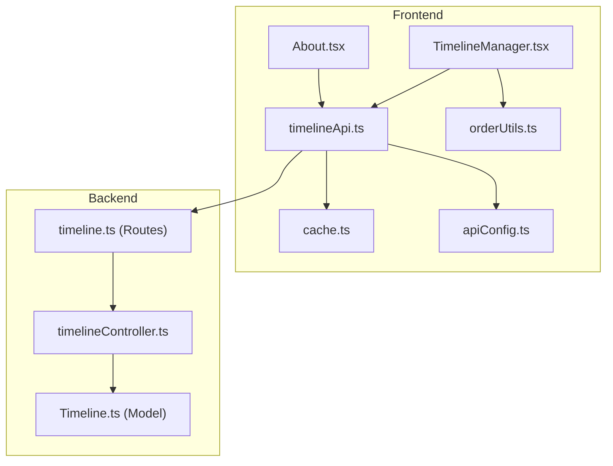
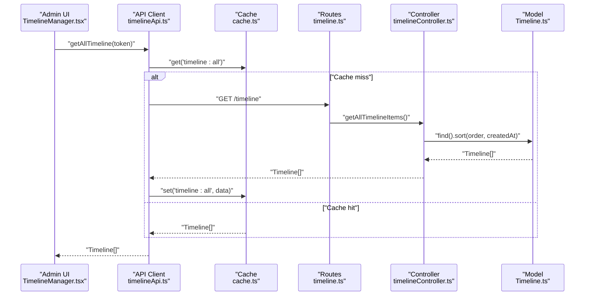
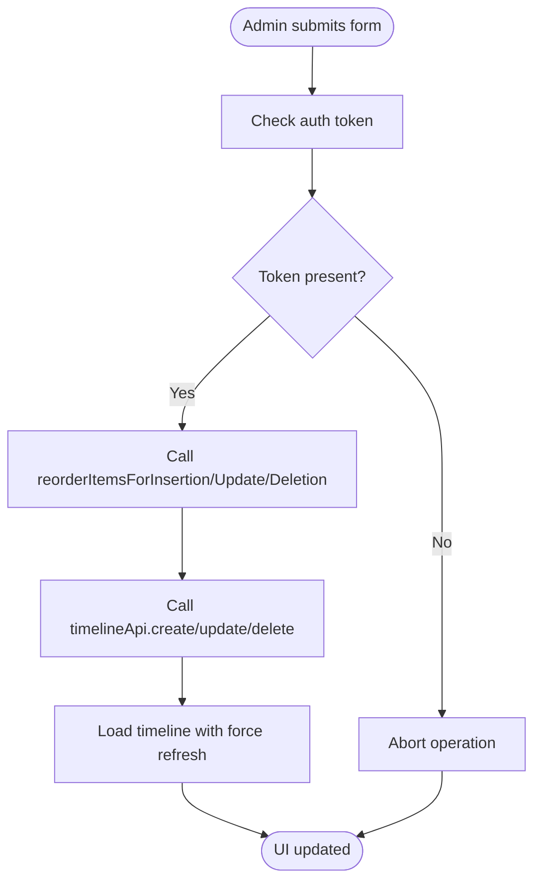
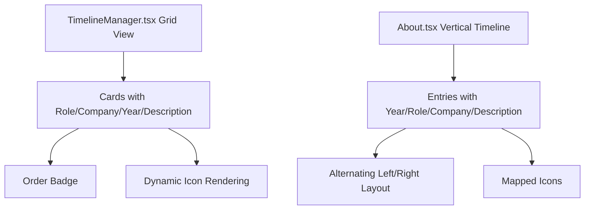
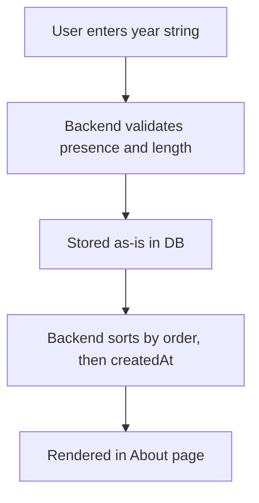
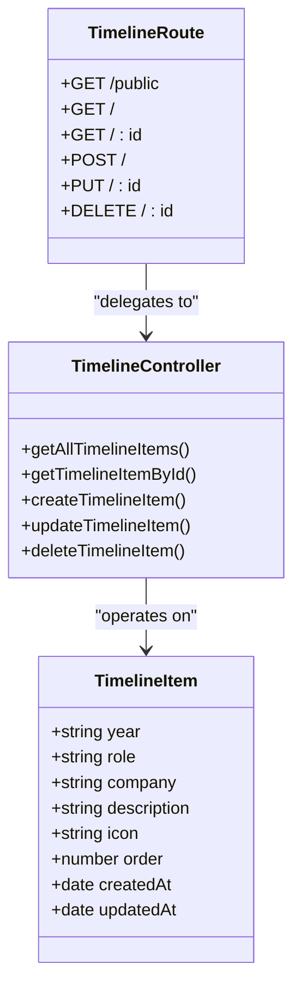
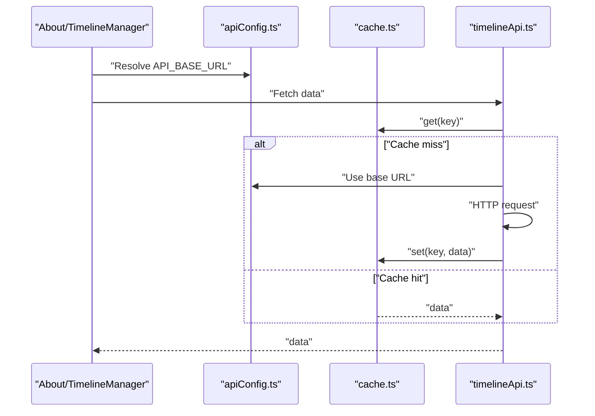
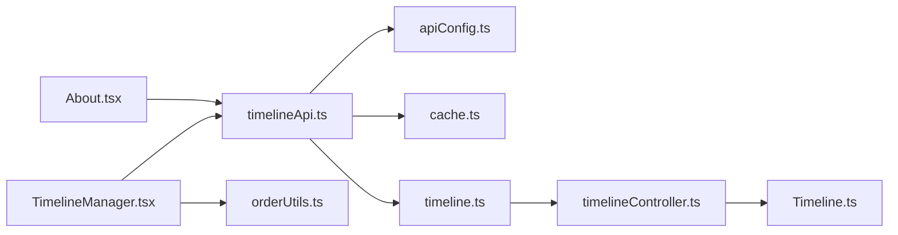

# Timeline Manager

<cite>
**Referenced Files in This Document**
- [TimelineManager.tsx](file://personalSite/src/pages/Admin/TimelineManager.tsx)
- [timelineApi.ts](file://personalSite/src/api/timelineApi.ts)
- [orderUtils.ts](file://personalSite/src/lib/orderUtils.ts)
- [Timeline.ts](file://server/src/models/Timeline.ts)
- [timelineController.ts](file://server/src/controllers/timelineController.ts)
- [timeline.ts](file://server/src/routes/timeline.ts)
- [About.tsx](file://personalSite/src/pages/About.tsx)
- [cache.ts](file://personalSite/src/lib/cache.ts)
- [apiConfig.ts](file://personalSite/src/lib/apiConfig.ts)
</cite>

## Table of Contents
1. [Introduction](#introduction)
2. [Project Structure](#project-structure)
3. [Core Components](#core-components)
4. [Architecture Overview](#architecture-overview)
5. [Detailed Component Analysis](#detailed-component-analysis)
6. [Dependency Analysis](#dependency-analysis)
7. [Performance Considerations](#performance-considerations)
8. [Troubleshooting Guide](#troubleshooting-guide)
9. [Conclusion](#conclusion)

## Introduction
This document explains the Timeline Manager component responsible for managing professional experience timeline entries. It covers the administrative workflows for creating, editing, and deleting timeline items, the frontend visualization of the timeline in the About section, the ordering system for chronological presentation, and the backend API integration. It also documents search filtering, responsive layout behavior, and operational best practices for performance and error handling.

## Project Structure
The Timeline Manager spans frontend and backend components:
- Frontend admin page: TimelineManager.tsx
- Frontend API client: timelineApi.ts
- Ordering utilities: orderUtils.ts
- Frontend About page timeline visualization: About.tsx
- Frontend caching: cache.ts
- Frontend API base URL configuration: apiConfig.ts
- Backend model: Timeline.ts
- Backend controller: timelineController.ts
- Backend routes: timeline.ts

**Diagram sources**
- [TimelineManager.tsx](file://personalSite/src/pages/Admin/TimelineManager.tsx#L1-L403)
- [timelineApi.ts](file://personalSite/src/api/timelineApi.ts#L1-L139)
- [orderUtils.ts](file://personalSite/src/lib/orderUtils.ts#L1-L238)
- [About.tsx](file://personalSite/src/pages/About.tsx#L1-L377)
- [cache.ts](file://personalSite/src/lib/cache.ts#L1-L137)
- [apiConfig.ts](file://personalSite/src/lib/apiConfig.ts#L1-L75)
- [Timeline.ts](file://server/src/models/Timeline.ts#L1-L56)
- [timelineController.ts](file://server/src/controllers/timelineController.ts#L1-L88)
- [timeline.ts](file://server/src/routes/timeline.ts#L1-L35)

**Section sources**
- [TimelineManager.tsx](file://personalSite/src/pages/Admin/TimelineManager.tsx#L1-L403)
- [timelineApi.ts](file://personalSite/src/api/timelineApi.ts#L1-L139)
- [orderUtils.ts](file://personalSite/src/lib/orderUtils.ts#L1-L238)
- [About.tsx](file://personalSite/src/pages/About.tsx#L1-L377)
- [cache.ts](file://personalSite/src/lib/cache.ts#L1-L137)
- [apiConfig.ts](file://personalSite/src/lib/apiConfig.ts#L1-L75)
- [Timeline.ts](file://server/src/models/Timeline.ts#L1-L56)
- [timelineController.ts](file://server/src/controllers/timelineController.ts#L1-L88)
- [timeline.ts](file://server/src/routes/timeline.ts#L1-L35)

## Core Components
- TimelineManager.tsx: Administrative UI for creating, editing, deleting, and ordering timeline entries; includes search and responsive grid layout.
- timelineApi.ts: Frontend API client for public and admin endpoints; includes caching and cache invalidation.
- orderUtils.ts: Utilities to reorder items during insert, update, and delete operations to maintain contiguous order.
- Timeline.ts: Mongoose model defining the timeline schema and ordering index.
- timelineController.ts: Backend controller methods for CRUD operations and sorting.
- timeline.ts: Routes exposing public and admin endpoints for timeline management.
- About.tsx: Frontend visualization of the timeline using a responsive, animated timeline layout.
- cache.ts: In-memory cache with TTL and wildcard invalidation.
- apiConfig.ts: Centralized API base URL resolution based on environment.

**Section sources**
- [TimelineManager.tsx](file://personalSite/src/pages/Admin/TimelineManager.tsx#L25-L403)
- [timelineApi.ts](file://personalSite/src/api/timelineApi.ts#L21-L139)
- [orderUtils.ts](file://personalSite/src/lib/orderUtils.ts#L47-L238)
- [Timeline.ts](file://server/src/models/Timeline.ts#L3-L56)
- [timelineController.ts](file://server/src/controllers/timelineController.ts#L4-L88)
- [timeline.ts](file://server/src/routes/timeline.ts#L13-L35)
- [About.tsx](file://personalSite/src/pages/About.tsx#L32-L377)
- [cache.ts](file://personalSite/src/lib/cache.ts#L12-L137)
- [apiConfig.ts](file://personalSite/src/lib/apiConfig.ts#L6-L52)

## Architecture Overview
The Timeline Manager follows a layered architecture:
- Frontend admin page orchestrates user actions and state.
- API client encapsulates HTTP requests and caching.
- Ordering utilities ensure consistent order values during mutations.
- Backend routes delegate to controllers, which operate on the Mongoose model.
- The About page consumes the public endpoint to render the timeline.

**Diagram sources**
- [TimelineManager.tsx](file://personalSite/src/pages/Admin/TimelineManager.tsx#L48-L62)
- [timelineApi.ts](file://personalSite/src/api/timelineApi.ts#L44-L68)
- [cache.ts](file://personalSite/src/lib/cache.ts#L20-L48)
- [timeline.ts](file://server/src/routes/timeline.ts#L20-L21)
- [timelineController.ts](file://server/src/controllers/timelineController.ts#L4-L12)
- [Timeline.ts](file://server/src/models/Timeline.ts#L53-L56)

## Detailed Component Analysis

### Timeline Creation and Editing Workflows
- Creation:
  - Admin selects an order position and submits the form.
  - The frontend calls reorderItemsForInsertion to shift existing items with order ≥ target order upward.
  - The frontend then calls timelineApi.createTimeline to persist the new item.
  - After success, the list reloads with force refresh to pick up updated order values.
- Editing:
  - Admin edits fields and selects a new order position.
  - reorderItemsForUpdate adjusts other items to accommodate the move without gaps.
  - timelineApi.updateTimeline persists changes.
- Deletion:
  - reorderItemsForDeletion shifts items with order > deleted order downward to fill the gap.
  - timelineApi.deleteTimeline removes the item.
- Search:
  - Filtering occurs client-side across year, role, company, and description.

**Diagram sources**
- [TimelineManager.tsx](file://personalSite/src/pages/Admin/TimelineManager.tsx#L86-L148)
- [orderUtils.ts](file://personalSite/src/lib/orderUtils.ts#L47-L238)
- [timelineApi.ts](file://personalSite/src/api/timelineApi.ts#L70-L137)

**Section sources**
- [TimelineManager.tsx](file://personalSite/src/pages/Admin/TimelineManager.tsx#L86-L148)
- [orderUtils.ts](file://personalSite/src/lib/orderUtils.ts#L47-L238)
- [timelineApi.ts](file://personalSite/src/api/timelineApi.ts#L70-L137)

### Timeline Visualization Interface
- Responsive grid layout:
  - Uses a responsive grid (1 column on mobile, 2 on tablet, 3 on desktop) to display timeline cards.
- Chronological ordering:
  - Backend sorts by order ascending, then createdAt ascending to ensure deterministic ordering.
- Status indicators:
  - The order number is shown as a small badge on each card.
- Icons:
  - Dynamic icon selection based on stored icon name.
- About page visualization:
  - The About page renders a vertical animated timeline with alternating sides for each entry, using icons mapped from the stored icon names.

**Diagram sources**
- [TimelineManager.tsx](file://personalSite/src/pages/Admin/TimelineManager.tsx#L335-L384)
- [About.tsx](file://personalSite/src/pages/About.tsx#L256-L296)
- [timelineController.ts](file://server/src/controllers/timelineController.ts#L6-L6)

**Section sources**
- [TimelineManager.tsx](file://personalSite/src/pages/Admin/TimelineManager.tsx#L335-L384)
- [About.tsx](file://personalSite/src/pages/About.tsx#L256-L296)
- [timelineController.ts](file://server/src/controllers/timelineController.ts#L6-L6)

### Date Range Validation and Sorting
- Date range representation:
  - Dates are represented as a free-text string in the year field (e.g., "2024 - Present").
- Validation:
  - The backend enforces presence and length constraints for textual date ranges.
  - There is no client-side validation for date range logic; invalid ranges are stored as entered.
- Sorting:
  - Backend sorts by order ascending, then createdAt ascending.
  - The frontend does not alter the sort order; it relies on backend ordering.

**Diagram sources**
- [Timeline.ts](file://server/src/models/Timeline.ts#L14-L51)
- [timelineController.ts](file://server/src/controllers/timelineController.ts#L6-L6)

**Section sources**
- [Timeline.ts](file://server/src/models/Timeline.ts#L14-L51)
- [timelineController.ts](file://server/src/controllers/timelineController.ts#L6-L6)

### Backend API Endpoints and Data Model
- Endpoints:
  - GET /timeline/public → Public timeline data (no auth).
  - GET /timeline → Admin timeline data (auth required).
  - POST /timeline → Create timeline item (auth required).
  - PUT /timeline/:id → Update timeline item (auth required).
  - DELETE /timeline/:id → Delete timeline item (auth required).
- Data model:
  - Fields: year, role, company (optional), description, icon, order, timestamps.
  - Index: order ascending for efficient sorting.

**Diagram sources**
- [Timeline.ts](file://server/src/models/Timeline.ts#L3-L56)
- [timelineController.ts](file://server/src/controllers/timelineController.ts#L4-L88)
- [timeline.ts](file://server/src/routes/timeline.ts#L13-L35)

**Section sources**
- [timeline.ts](file://server/src/routes/timeline.ts#L13-L35)
- [timelineController.ts](file://server/src/controllers/timelineController.ts#L4-L88)
- [Timeline.ts](file://server/src/models/Timeline.ts#L3-L56)

### Frontend Integration and Cache Management
- API base URL resolution:
  - Determined from environment variables with fallback behavior.
- Caching:
  - In-memory cache keyed by resource-specific keys.
  - Cache invalidation on create/update/delete operations.
- Public vs Admin:
  - Public endpoint used by About page; Admin endpoint used by TimelineManager.

**Diagram sources**
- [About.tsx](file://personalSite/src/pages/About.tsx#L10-L110)
- [timelineApi.ts](file://personalSite/src/api/timelineApi.ts#L22-L42)
- [cache.ts](file://personalSite/src/lib/cache.ts#L20-L48)
- [apiConfig.ts](file://personalSite/src/lib/apiConfig.ts#L6-L52)

**Section sources**
- [About.tsx](file://personalSite/src/pages/About.tsx#L10-L110)
- [timelineApi.ts](file://personalSite/src/api/timelineApi.ts#L22-L42)
- [cache.ts](file://personalSite/src/lib/cache.ts#L20-L48)
- [apiConfig.ts](file://personalSite/src/lib/apiConfig.ts#L6-L52)

## Dependency Analysis
- Frontend dependencies:
  - TimelineManager depends on timelineApi, orderUtils, and AuthContext.
  - About page depends on timelineApi and icon mapping.
- Backend dependencies:
  - Routes depend on controller functions.
  - Controllers depend on the Mongoose model.
- Shared concerns:
  - Cache keys and invalidation are coordinated across resources.
  - API base URL is centralized.

**Diagram sources**
- [TimelineManager.tsx](file://personalSite/src/pages/Admin/TimelineManager.tsx#L20-L23)
- [About.tsx](file://personalSite/src/pages/About.tsx#L9-L11)
- [timelineApi.ts](file://personalSite/src/api/timelineApi.ts#L1-L3)
- [orderUtils.ts](file://personalSite/src/lib/orderUtils.ts#L1-L2)
- [apiConfig.ts](file://personalSite/src/lib/apiConfig.ts#L1-L75)
- [cache.ts](file://personalSite/src/lib/cache.ts#L1-L137)
- [timeline.ts](file://server/src/routes/timeline.ts#L1-L35)
- [timelineController.ts](file://server/src/controllers/timelineController.ts#L1-L3)
- [Timeline.ts](file://server/src/models/Timeline.ts#L1-L2)

**Section sources**
- [TimelineManager.tsx](file://personalSite/src/pages/Admin/TimelineManager.tsx#L20-L23)
- [About.tsx](file://personalSite/src/pages/About.tsx#L9-L11)
- [timelineApi.ts](file://personalSite/src/api/timelineApi.ts#L1-L3)
- [orderUtils.ts](file://personalSite/src/lib/orderUtils.ts#L1-L2)
- [apiConfig.ts](file://personalSite/src/lib/apiConfig.ts#L1-L75)
- [cache.ts](file://personalSite/src/lib/cache.ts#L1-L137)
- [timeline.ts](file://server/src/routes/timeline.ts#L1-L35)
- [timelineController.ts](file://server/src/controllers/timelineController.ts#L1-L3)
- [Timeline.ts](file://server/src/models/Timeline.ts#L1-L2)

## Performance Considerations
- Caching:
  - Use cache keys for timeline data and invalidate appropriately after mutations to avoid stale data.
- Sorting:
  - Backend sorting by order and createdAt ensures consistent ordering; avoid re-sorting in the frontend.
- Rendering:
  - The About page uses motion animations; keep animations minimal for large timelines.
- Requests:
  - Prefer batched updates and avoid unnecessary reloads by leveraging cache invalidation patterns.

[No sources needed since this section provides general guidance]

## Troubleshooting Guide
- Invalid date ranges:
  - The system stores the year field as entered; there is no built-in validation for logical date ranges. Consider adding client-side validation if needed.
- Cache issues:
  - If data appears stale, trigger force refresh or clear cache keys for timeline and related sections.
- API errors:
  - The API client throws descriptive errors on HTTP failures; inspect network tab and console logs for details.
- Ordering anomalies:
  - If order values become inconsistent, trigger a full reordering operation to restore contiguous order.

**Section sources**
- [timelineApi.ts](file://personalSite/src/api/timelineApi.ts#L33-L36)
- [cache.ts](file://personalSite/src/lib/cache.ts#L78-L85)
- [orderUtils.ts](file://personalSite/src/lib/orderUtils.ts#L131-L161)

## Conclusion
The Timeline Manager provides a complete solution for managing professional experience entries with a clean admin interface, robust ordering utilities, and a responsive frontend visualization. The backend ensures consistent ordering and exposes both public and admin endpoints. With caching and environment-aware configuration, the system balances performance and flexibility. Extending the system—such as adding custom validation rules, new experience categories, or localization—can be achieved by augmenting the frontend forms, backend model and validation, and the frontend visualization components.