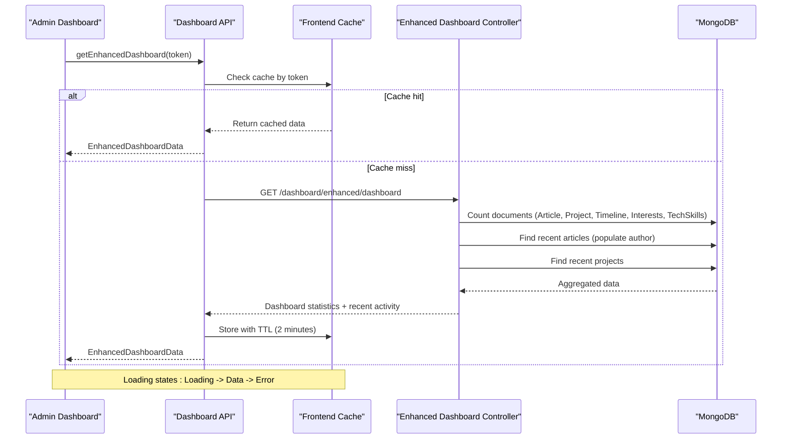
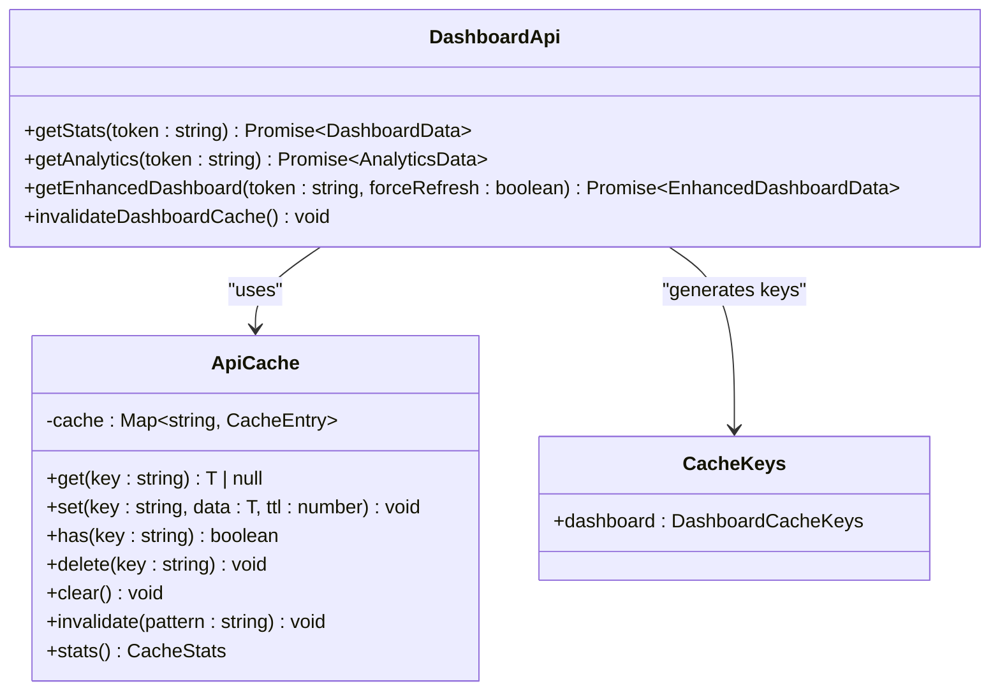
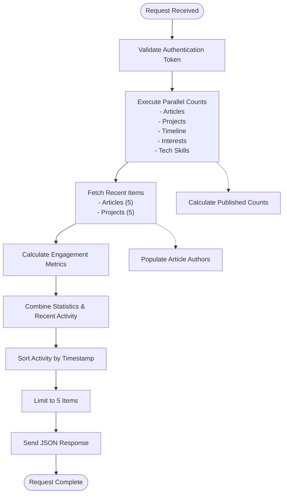
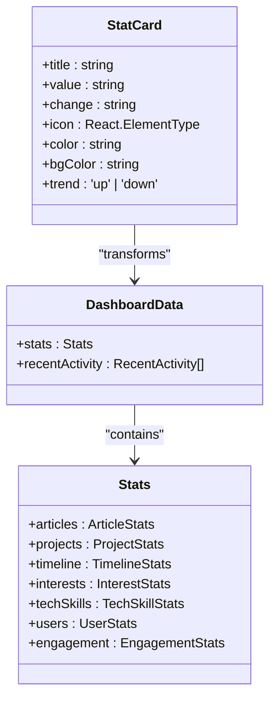
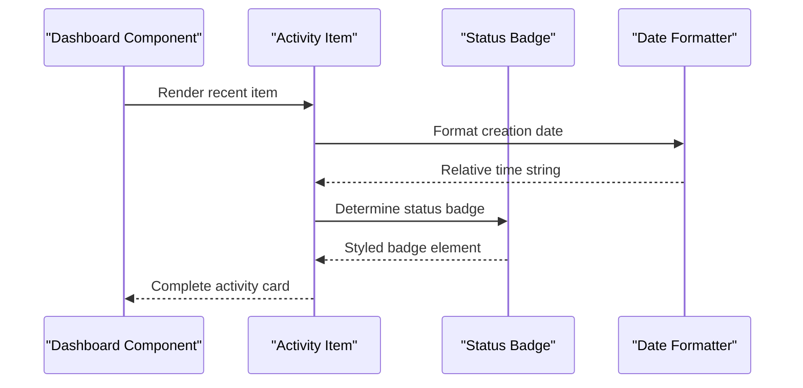
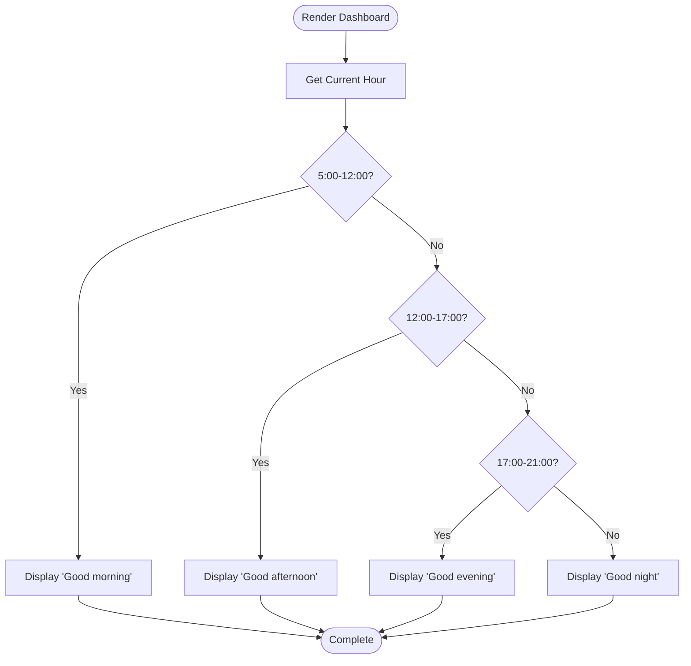
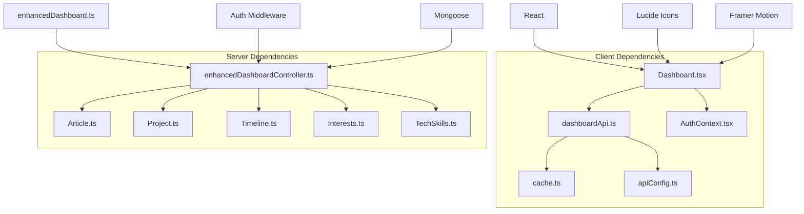

# Dashboard Overview

<cite>
**Referenced Files in This Document**
- [Dashboard.tsx](file://personalSite/src/pages/Admin/Dashboard.tsx)
- [dashboardApi.ts](file://personalSite/src/api/dashboardApi.ts)
- [enhancedDashboardController.ts](file://server/src/controllers/enhancedDashboardController.ts)
- [enhancedDashboard.ts](file://server/src/routes/enhancedDashboard.ts)
- [apiConfig.ts](file://personalSite/src/lib/apiConfig.ts)
- [cache.ts](file://personalSite/src/lib/cache.ts)
- [AuthContext.tsx](file://personalSite/src/contexts/AuthContext.tsx)
- [Article.ts](file://server/src/models/Article.ts)
- [Project.ts](file://server/src/models/Project.ts)
- [Timeline.ts](file://server/src/models/Timeline.ts)
- [Interests.ts](file://server/src/models/Interests.ts)
- [TechSkills.ts](file://server/src/models/TechSkills.ts)
</cite>

## Table of Contents
1. [Introduction](#introduction)
2. [Project Structure](#project-structure)
3. [Core Components](#core-components)
4. [Architecture Overview](#architecture-overview)
5. [Detailed Component Analysis](#detailed-component-analysis)
6. [Dependency Analysis](#dependency-analysis)
7. [Performance Considerations](#performance-considerations)
8. [Troubleshooting Guide](#troubleshooting-guide)
9. [Conclusion](#conclusion)

## Introduction
The Admin Dashboard Overview provides administrators with comprehensive analytics and system insights through a modern, responsive interface. The dashboard displays key metrics including articles, projects, timeline items, and tech skills, along with recent activity feeds and time-based greetings. Built with React and TypeScript, it leverages efficient caching mechanisms and robust error handling to deliver a smooth user experience.

## Project Structure
The dashboard implementation spans both client-side and server-side components, organized across distinct modules:

```mermaid
graph TB
subgraph "Client-Side (React)"
A[Dashboard.tsx] --> B[dashboardApi.ts]
B --> C[cache.ts]
B --> D[apiConfig.ts]
A --> E[AuthContext.tsx]
end
subgraph "Server-Side (Node.js/Express)"
F[enhancedDashboardController.ts] --> G[enhancedDashboard.ts]
F --> H[Article.ts]
F --> I[Project.ts]
F --> J[Timeline.ts]
F --> K[Interests.ts]
F --> L[TechSkills.ts]
end
M[Database] <- --> H
M <- --> I
M <- --> J
M <- --> K
M <- --> L
```

**Diagram sources**
- [Dashboard.tsx](file://personalSite/src/pages/Admin/Dashboard.tsx#L1-L348)
- [dashboardApi.ts](file://personalSite/src/api/dashboardApi.ts#L1-L152)
- [enhancedDashboardController.ts](file://server/src/controllers/enhancedDashboardController.ts#L1-L126)

**Section sources**
- [Dashboard.tsx](file://personalSite/src/pages/Admin/Dashboard.tsx#L1-L50)
- [dashboardApi.ts](file://personalSite/src/api/dashboardApi.ts#L1-L50)

## Core Components
The dashboard consists of several interconnected components that work together to provide comprehensive system insights:

### Dashboard Data Structure
The dashboard organizes information into two primary categories:

**Statistics Data Model:**
- Articles: Total count, published count, draft count, and change percentage
- Projects: Total count, published count, draft count, and change percentage
- Timeline Items: Total count of timeline entries
- Interests: Total count of interest items
- Tech Skills: Total count of technical skills
- Users: Total count and change percentage
- Engagement: Views count, conversion rate, and change percentage

**Recent Activity Feed:**
- ID: Unique identifier for each activity item
- Title: Display name of the item
- Type: Article or Project classification
- Date: Creation timestamp for sorting
- Status: Draft or Published state
- Author: Creator identification

**Section sources**
- [Dashboard.tsx](file://personalSite/src/pages/Admin/Dashboard.tsx#L36-L77)
- [dashboardApi.ts](file://personalSite/src/api/dashboardApi.ts#L4-L56)

## Architecture Overview
The dashboard follows a client-server architecture with real-time data synchronization:



**Diagram sources**
- [Dashboard.tsx](file://personalSite/src/pages/Admin/Dashboard.tsx#L85-L105)
- [dashboardApi.ts](file://personalSite/src/api/dashboardApi.ts#L121-L146)
- [enhancedDashboardController.ts](file://server/src/controllers/enhancedDashboardController.ts#L9-L95)

## Detailed Component Analysis

### Enhanced Dashboard API Implementation
The dashboard API provides centralized data access with intelligent caching:



**Diagram sources**
- [dashboardApi.ts](file://personalSite/src/api/dashboardApi.ts#L70-L151)
- [cache.ts](file://personalSite/src/lib/cache.ts#L12-L96)

**Section sources**
- [dashboardApi.ts](file://personalSite/src/api/dashboardApi.ts#L70-L151)
- [cache.ts](file://personalSite/src/lib/cache.ts#L12-L96)

### Server-Side Data Aggregation
The enhanced dashboard controller performs efficient database operations:



**Diagram sources**
- [enhancedDashboardController.ts](file://server/src/controllers/enhancedDashboardController.ts#L9-L95)

**Section sources**
- [enhancedDashboardController.ts](file://server/src/controllers/enhancedDashboardController.ts#L9-L95)

### Animated Statistics Cards
The dashboard presents metrics through interactive animated cards:



**Diagram sources**
- [Dashboard.tsx](file://personalSite/src/pages/Admin/Dashboard.tsx#L26-L77)

**Section sources**
- [Dashboard.tsx](file://personalSite/src/pages/Admin/Dashboard.tsx#L123-L160)

### Recent Activity Feed
The activity feed displays recent system changes with status indicators:



**Diagram sources**
- [Dashboard.tsx](file://personalSite/src/pages/Admin/Dashboard.tsx#L164-L191)
- [Dashboard.tsx](file://personalSite/src/pages/Admin/Dashboard.tsx#L304-L334)

**Section sources**
- [Dashboard.tsx](file://personalSite/src/pages/Admin/Dashboard.tsx#L164-L191)
- [Dashboard.tsx](file://personalSite/src/pages/Admin/Dashboard.tsx#L304-L334)

### Time-Based Greeting System
The dashboard implements a contextual greeting system:



**Diagram sources**
- [Dashboard.tsx](file://personalSite/src/pages/Admin/Dashboard.tsx#L108-L120)

**Section sources**
- [Dashboard.tsx](file://personalSite/src/pages/Admin/Dashboard.tsx#L108-L120)

## Dependency Analysis
The dashboard system exhibits strong modularity with clear separation of concerns:



**Diagram sources**
- [Dashboard.tsx](file://personalSite/src/pages/Admin/Dashboard.tsx#L1-L30)
- [dashboardApi.ts](file://personalSite/src/api/dashboardApi.ts#L1-L10)
- [enhancedDashboardController.ts](file://server/src/controllers/enhancedDashboardController.ts#L1-L7)

**Section sources**
- [Dashboard.tsx](file://personalSite/src/pages/Admin/Dashboard.tsx#L1-L30)
- [dashboardApi.ts](file://personalSite/src/api/dashboardApi.ts#L1-L10)
- [enhancedDashboardController.ts](file://server/src/controllers/enhancedDashboardController.ts#L1-L7)

## Performance Considerations
The dashboard implements several optimization strategies:

### Caching Strategy
- **Enhanced Dashboard Cache**: 2-minute TTL for frequently accessed data
- **Stats Cache**: 5-minute TTL for basic statistics
- **Analytics Cache**: 5-minute TTL for analytical data
- **Cache Keys**: Token-scoped keys for secure caching

### Database Optimization
- **Parallel Operations**: Concurrent database queries for improved performance
- **Selective Field Projection**: Minimal data transfer using MongoDB projections
- **Index Usage**: Strategic indexes on frequently queried fields
- **Population Optimization**: Efficient author population for articles

### Frontend Performance
- **Loading States**: Graceful loading indicators during data fetch
- **Error Boundaries**: Comprehensive error handling with user feedback
- **Animation Optimization**: Hardware-accelerated animations using Framer Motion
- **Memory Management**: Proper cleanup of effects and event listeners

**Section sources**
- [cache.ts](file://personalSite/src/lib/cache.ts#L42-L48)
- [enhancedDashboardController.ts](file://server/src/controllers/enhancedDashboardController.ts#L12-L18)
- [Article.ts](file://server/src/models/Article.ts#L61)
- [Project.ts](file://server/src/models/Project.ts#L92)

## Troubleshooting Guide

### Common Issues and Solutions

**Authentication Problems:**
- Verify token validity in localStorage
- Check API base URL configuration
- Ensure proper Authorization header format

**Data Fetching Errors:**
- Monitor network requests in browser developer tools
- Check server logs for database connection issues
- Validate MongoDB collection existence

**Performance Issues:**
- Clear browser cache and reload page
- Check cache invalidation patterns
- Monitor database query performance

**Section sources**
- [Dashboard.tsx](file://personalSite/src/pages/Admin/Dashboard.tsx#L86-L105)
- [dashboardApi.ts](file://personalSite/src/api/dashboardApi.ts#L137-L140)
- [AuthContext.tsx](file://personalSite/src/contexts/AuthContext.tsx#L58-L76)

## Conclusion
The Admin Dashboard Overview provides a comprehensive solution for portfolio administration with real-time analytics and system insights. Its modular architecture, efficient caching mechanisms, and responsive design create a robust foundation for content management. The implementation demonstrates best practices in React development, server-client communication, and database optimization while maintaining excellent user experience through thoughtful animations and error handling.

The dashboard serves as both a functional tool for administrators and a reference implementation for similar analytics dashboards, showcasing modern web development patterns and scalable architecture principles.