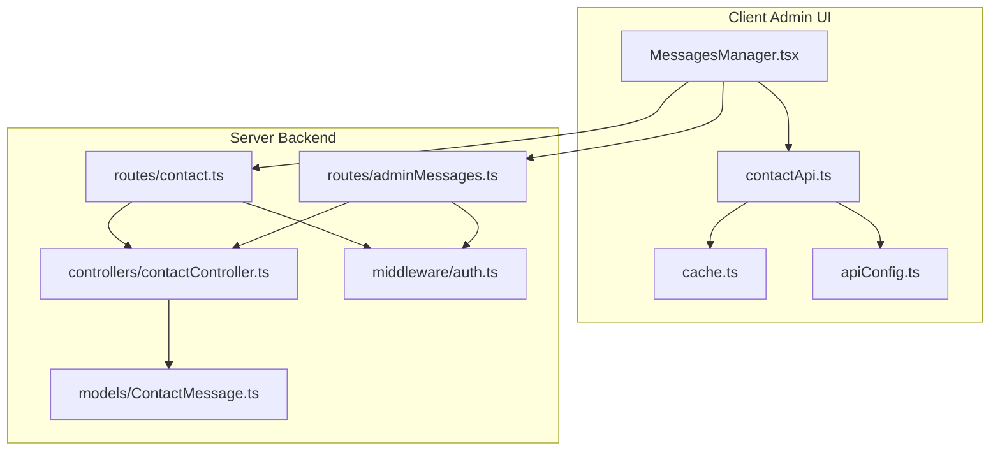
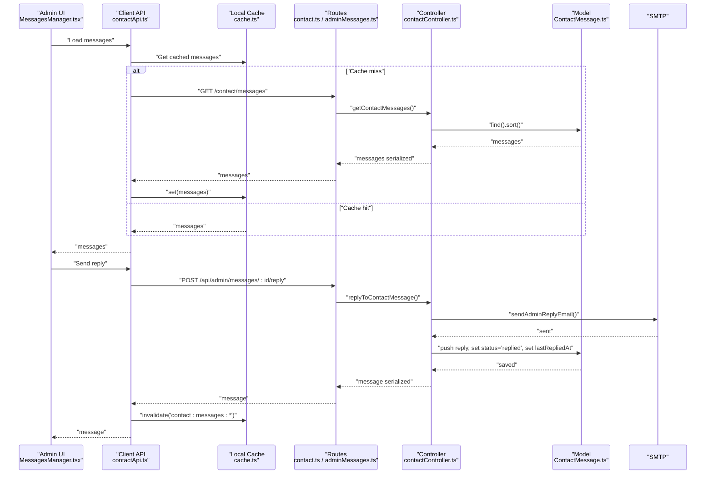
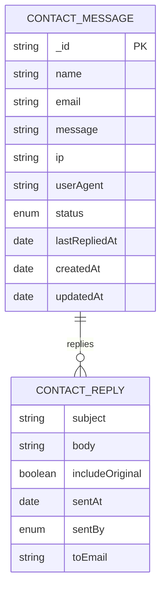
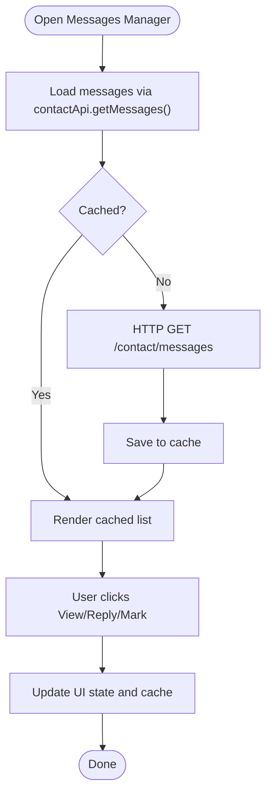
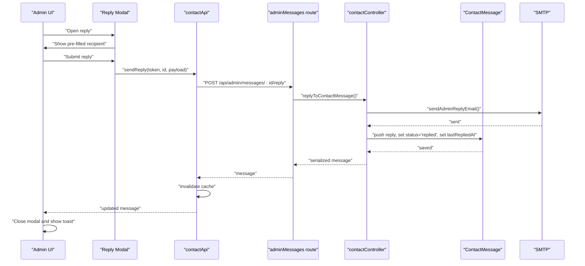
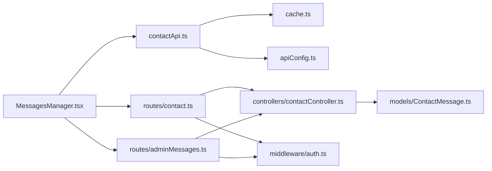

# Message Management

<cite>
**Referenced Files in This Document**
- [MessagesManager.tsx](file://personalSite/src/pages/Admin/MessagesManager.tsx)
- [contactApi.ts](file://personalSite/src/api/contactApi.ts)
- [cache.ts](file://personalSite/src/lib/cache.ts)
- [apiConfig.ts](file://personalSite/src/lib/apiConfig.ts)
- [ContactMessage.ts](file://server/src/models/ContactMessage.ts)
- [contactController.ts](file://server/src/controllers/contactController.ts)
- [contact.ts](file://server/src/routes/contact.ts)
- [adminMessages.ts](file://server/src/routes/adminMessages.ts)
- [auth.ts](file://server/src/middleware/auth.ts)
</cite>

## Table of Contents
1. [Introduction](#introduction)
2. [Project Structure](#project-structure)
3. [Core Components](#core-components)
4. [Architecture Overview](#architecture-overview)
5. [Detailed Component Analysis](#detailed-component-analysis)
6. [Dependency Analysis](#dependency-analysis)
7. [Performance Considerations](#performance-considerations)
8. [Troubleshooting Guide](#troubleshooting-guide)
9. [Conclusion](#conclusion)
10. [Appendices](#appendices)

## Introduction
This document describes the Message Management interface responsible for receiving, listing, viewing, replying to, and tracking the status of incoming contact messages. It covers the message data model, the admin UI for managing messages, the backend APIs and controllers, the MongoDB schema for persistence, and the email notification system. It also provides guidance on customization (templates, auto-responses), spam prevention, archiving, export, and extending the messaging functionality.

## Project Structure
The message management system spans the client admin UI and the server backend:
- Client admin page renders the message list, reply modal, and status controls.
- Client API module encapsulates HTTP calls to the backend and local caching.
- Server routes expose endpoints for retrieving messages, updating status, and replying.
- Server controller enforces validation, sanitization, rate limits, and email notifications.
- MongoDB model defines the schema and indexes for message persistence.

**Diagram sources**
- [MessagesManager.tsx](file://personalSite/src/pages/Admin/MessagesManager.tsx#L74-L429)
- [contactApi.ts](file://personalSite/src/api/contactApi.ts#L58-L153)
- [cache.ts](file://personalSite/src/lib/cache.ts#L12-L96)
- [apiConfig.ts](file://personalSite/src/lib/apiConfig.ts#L6-L52)
- [contact.ts](file://server/src/routes/contact.ts#L10-L27)
- [adminMessages.ts](file://server/src/routes/adminMessages.ts#L6-L23)
- [contactController.ts](file://server/src/controllers/contactController.ts#L317-L437)
- [auth.ts](file://server/src/middleware/auth.ts#L9-L37)
- [ContactMessage.ts](file://server/src/models/ContactMessage.ts#L69-L122)

**Section sources**
- [MessagesManager.tsx](file://personalSite/src/pages/Admin/MessagesManager.tsx#L74-L113)
- [contactApi.ts](file://personalSite/src/api/contactApi.ts#L58-L102)
- [contact.ts](file://server/src/routes/contact.ts#L10-L27)
- [adminMessages.ts](file://server/src/routes/adminMessages.ts#L6-L23)
- [contactController.ts](file://server/src/controllers/contactController.ts#L317-L329)
- [ContactMessage.ts](file://server/src/models/ContactMessage.ts#L69-L122)

## Core Components
- Message data model: Defines fields for sender identity, content, IP/user agent, status, replies, and timestamps.
- Admin UI: Lists messages, shows details, supports reply composition, and toggles status.
- Client API: Fetches messages, updates status, sends replies, and caches responses.
- Server routes: Expose endpoints with authentication and rate limits.
- Server controller: Validates inputs, sanitizes data, persists messages, and sends emails.
- Email notifications: Sends admin and user notifications upon new messages and replies.

**Section sources**
- [ContactMessage.ts](file://server/src/models/ContactMessage.ts#L14-L25)
- [MessagesManager.tsx](file://personalSite/src/pages/Admin/MessagesManager.tsx#L74-L113)
- [contactApi.ts](file://personalSite/src/api/contactApi.ts#L58-L153)
- [contactController.ts](file://server/src/controllers/contactController.ts#L317-L437)

## Architecture Overview
The system follows a layered architecture:
- Presentation layer: React admin page with dialogs and forms.
- API abstraction: Client contact API wraps HTTP requests and caching.
- Routing and middleware: Express routes enforce auth and rate limits.
- Controllers: Business logic for validation, sanitization, persistence, and email dispatch.
- Persistence: Mongoose model with indexes for efficient queries.

**Diagram sources**
- [MessagesManager.tsx](file://personalSite/src/pages/Admin/MessagesManager.tsx#L92-L109)
- [contactApi.ts](file://personalSite/src/api/contactApi.ts#L77-L102)
- [cache.ts](file://personalSite/src/lib/cache.ts#L12-L96)
- [contact.ts](file://server/src/routes/contact.ts#L24-L25)
- [adminMessages.ts](file://server/src/routes/adminMessages.ts#L21-L21)
- [contactController.ts](file://server/src/controllers/contactController.ts#L317-L329)
- [ContactMessage.ts](file://server/src/models/ContactMessage.ts#L418-L429)

## Detailed Component Analysis

### Message Data Model
The MongoDB schema defines the persisted structure for contact messages and replies:
- Sender identity: name, email, optional IP and user agent.
- Content: message body with length limits.
- Status: new, read, or replied.
- Replies: array of admin replies with subject, body, includeOriginal flag, sent timestamp, sentBy, and recipient email.
- Timestamps: createdAt and updatedAt via Mongoose timestamps.
- Indexes: sort by creation time; composite index on status and creation time.

**Diagram sources**
- [ContactMessage.ts](file://server/src/models/ContactMessage.ts#L14-L25)
- [ContactMessage.ts](file://server/src/models/ContactMessage.ts#L69-L122)

**Section sources**
- [ContactMessage.ts](file://server/src/models/ContactMessage.ts#L14-L25)
- [ContactMessage.ts](file://server/src/models/ContactMessage.ts#L69-L122)

### Message Listing Interface
The admin UI lists messages with:
- Columns: name, email, received time, status, actions.
- Actions: view details, reply, mark as read/new.
- Real-time indicators: new count badge and loading/error states.
- Refresh capability: reloads messages and invalidates cache.

**Diagram sources**
- [MessagesManager.tsx](file://personalSite/src/pages/Admin/MessagesManager.tsx#L92-L109)
- [contactApi.ts](file://personalSite/src/api/contactApi.ts#L77-L102)
- [cache.ts](file://personalSite/src/lib/cache.ts#L12-L96)

**Section sources**
- [MessagesManager.tsx](file://personalSite/src/pages/Admin/MessagesManager.tsx#L234-L281)
- [MessagesManager.tsx](file://personalSite/src/pages/Admin/MessagesManager.tsx#L87-L90)
- [contactApi.ts](file://personalSite/src/api/contactApi.ts#L77-L102)

### Message Viewing Interface and Reply Workflow
The message detail view shows:
- Sender info, timestamps, current status, and optional last reply timestamp.
- Full message content and reply history with truncated previews.
- Action to toggle status.

The reply modal allows composing a reply with:
- Pre-filled recipient email.
- Subject and body with enforced length constraints.
- Option to include the original message.
- Submission with validation and error feedback.

**Diagram sources**
- [MessagesManager.tsx](file://personalSite/src/pages/Admin/MessagesManager.tsx#L115-L183)
- [MessagesManager.tsx](file://personalSite/src/pages/Admin/MessagesManager.tsx#L285-L353)
- [contactApi.ts](file://personalSite/src/api/contactApi.ts#L129-L152)
- [adminMessages.ts](file://server/src/routes/adminMessages.ts#L21-L21)
- [contactController.ts](file://server/src/controllers/contactController.ts#L364-L437)
- [ContactMessage.ts](file://server/src/models/ContactMessage.ts#L418-L429)

**Section sources**
- [MessagesManager.tsx](file://personalSite/src/pages/Admin/MessagesManager.tsx#L131-L183)
- [MessagesManager.tsx](file://personalSite/src/pages/Admin/MessagesManager.tsx#L285-L353)
- [contactApi.ts](file://personalSite/src/api/contactApi.ts#L129-L152)
- [contactController.ts](file://server/src/controllers/contactController.ts#L364-L437)

### Integration with Contact Controller API
Endpoints:
- GET /contact/messages: Returns all messages sorted by newest first; requires admin token.
- PATCH /contact/messages/:id/status: Updates message status; requires admin token.
- POST /api/admin/messages/:id/reply: Sends a reply; requires admin token and rate limit.

Middleware and rate limits:
- Authentication and admin role checks.
- Rate limit for replies (window and max attempts).
- Separate rate limit for inbound contact submissions.

**Section sources**
- [contact.ts](file://server/src/routes/contact.ts#L24-L25)
- [adminMessages.ts](file://server/src/routes/adminMessages.ts#L18-L21)
- [contactController.ts](file://server/src/controllers/contactController.ts#L317-L362)
- [auth.ts](file://server/src/middleware/auth.ts#L9-L37)

### MongoDB Schema for Message Persistence
Fields and constraints:
- Name, email, message: trimmed, length-limited, required.
- IP and userAgent: optional, length-limited.
- Status: enum with default.
- Replies: embedded documents with subject/body/email and timestamps.
- lastRepliedAt: optional timestamp.
- Timestamps: createdAt/updatedAt managed by Mongoose.

Indexes:
- createdAt descending for recent-first retrieval.
- Composite index on status and createdAt for filtered queries.

**Section sources**
- [ContactMessage.ts](file://server/src/models/ContactMessage.ts#L69-L122)

### Real-time Notification System
- New message: Admin receives a notification email; user receives an auto-receipt email.
- Reply: Admin reply triggers a personalized HTML email to the user, optionally including the original message.
- Transporter caching: Reuses Nodemailer transporter instance with credentials.
- Environment variables: ADMIN_EMAIL, SEND_AS_EMAIL, SEND_AS_NAME, GOOGLE_APP_PASSWORD.

**Section sources**
- [contactController.ts](file://server/src/controllers/contactController.ts#L107-L166)
- [contactController.ts](file://server/src/controllers/contactController.ts#L168-L230)

### Examples and Extensibility

- Customizing message templates
  - Modify the admin notification and user receipt templates in the controller’s email functions.
  - Adjust the HTML template for replies to change formatting and branding.

- Implementing auto-responses
  - Extend the controller to detect specific keywords or phrases and trigger automated replies before manual intervention.

- Adding custom message fields
  - Extend the model schema to include new fields (e.g., subject, category, source).
  - Update the controller validations and serializers accordingly.

- Extending messaging functionality
  - Add bulk status updates by introducing a batch endpoint in routes and controller.
  - Introduce message categories or labels with associated filters in the UI and backend.

[No sources needed since this section provides general guidance]

## Dependency Analysis
- Client depends on:
  - contactApi for HTTP operations and caching.
  - cache for local caching and cache invalidation.
  - apiConfig for environment-aware base URL resolution.
- Server routes depend on:
  - contactController for business logic.
  - auth middleware for JWT verification and admin role enforcement.
  - rate limit middleware for protection.
- Controller depends on:
  - ContactMessage model for persistence.
  - Nodemailer for outbound emails.

**Diagram sources**
- [MessagesManager.tsx](file://personalSite/src/pages/Admin/MessagesManager.tsx#L74-L113)
- [contactApi.ts](file://personalSite/src/api/contactApi.ts#L58-L153)
- [cache.ts](file://personalSite/src/lib/cache.ts#L12-L96)
- [apiConfig.ts](file://personalSite/src/lib/apiConfig.ts#L6-L52)
- [contact.ts](file://server/src/routes/contact.ts#L10-L27)
- [adminMessages.ts](file://server/src/routes/adminMessages.ts#L6-L23)
- [contactController.ts](file://server/src/controllers/contactController.ts#L317-L437)
- [auth.ts](file://server/src/middleware/auth.ts#L9-L37)
- [ContactMessage.ts](file://server/src/models/ContactMessage.ts#L69-L122)

**Section sources**
- [contactApi.ts](file://personalSite/src/api/contactApi.ts#L77-L152)
- [contactController.ts](file://server/src/controllers/contactController.ts#L317-L437)
- [auth.ts](file://server/src/middleware/auth.ts#L9-L37)

## Performance Considerations
- Client caching: Responses are cached locally with TTL and invalidated on mutations to avoid redundant network calls.
- Sorting and indexing: Messages are sorted by creation time; composite index on status and createdAt supports filtered queries.
- Rate limiting: Protects endpoints from abuse during replies and inbound submissions.
- Email dispatch: Transporter reuse reduces connection overhead.

[No sources needed since this section provides general guidance]

## Troubleshooting Guide
Common issues and remedies:
- Authentication failures: Ensure a valid admin token is present for protected endpoints.
- Rate limit exceeded: Wait for the window to reset or reduce reply frequency.
- Email configuration errors: Verify ADMIN_EMAIL, SEND_AS_EMAIL, SEND_AS_NAME, and GOOGLE_APP_PASSWORD are set.
- Validation errors: Respect field length constraints and required fields for messages and replies.
- Cache inconsistencies: Use refresh to bypass cache or rely on automatic invalidation after updates.

**Section sources**
- [auth.ts](file://server/src/middleware/auth.ts#L14-L29)
- [adminMessages.ts](file://server/src/routes/adminMessages.ts#L8-L16)
- [contactController.ts](file://server/src/controllers/contactController.ts#L118-L120)
- [contactApi.ts](file://personalSite/src/api/contactApi.ts#L120-L127)

## Conclusion
The Message Management interface provides a secure, efficient, and extensible system for handling contact messages. It combines a responsive admin UI with robust backend validation, persistence, and email notifications. With built-in caching, rate limiting, and flexible data modeling, it supports customization for templates, auto-responses, and advanced workflows while maintaining performance and reliability.

## Appendices

### API Definitions
- GET /contact/messages
  - Headers: Authorization: Bearer <token>
  - Response: { ok: boolean, messages: ContactMessage[] }
- PATCH /contact/messages/:id/status
  - Headers: Authorization: Bearer <token>, Content-Type: application/json
  - Body: { status: "new" | "read" | "replied" }
  - Response: { ok: boolean, message: ContactMessage }
- POST /api/admin/messages/:id/reply
  - Headers: Authorization: Bearer <token>, Content-Type: application/json
  - Body: { subject: string, body: string, includeOriginal?: boolean }
  - Response: { ok: boolean, message: ContactMessage }

**Section sources**
- [contact.ts](file://server/src/routes/contact.ts#L24-L25)
- [adminMessages.ts](file://server/src/routes/adminMessages.ts#L21-L21)
- [contactController.ts](file://server/src/controllers/contactController.ts#L331-L362)
- [contactController.ts](file://server/src/controllers/contactController.ts#L364-L437)

### Spam Prevention Measures
- Rate limiting for inbound submissions and replies.
- Input sanitization and length limits.
- Captcha or challenge fields can be added at the form level before invoking the API.

[No sources needed since this section provides general guidance]

### Message Archiving and Export
- Archiving: Treat older messages as read or add a separate archive status; adjust UI filters and backend queries accordingly.
- Export: Add an endpoint to stream messages as CSV/JSON with optional filters; apply pagination and server-side filtering.

[No sources needed since this section provides general guidance]