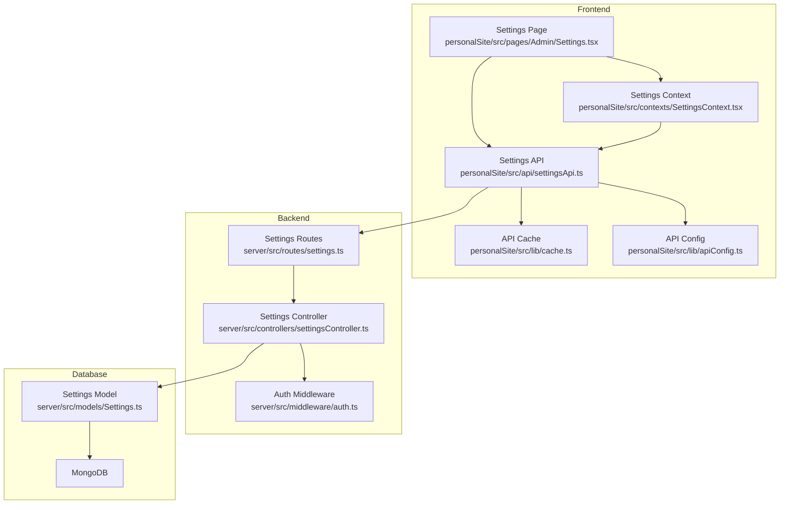
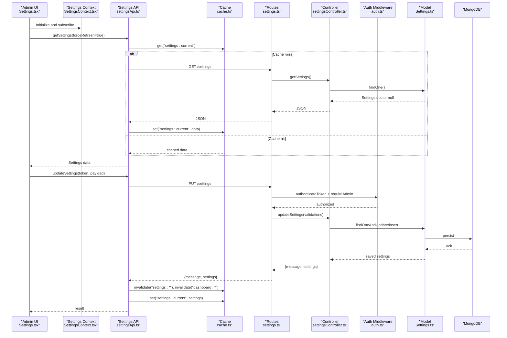
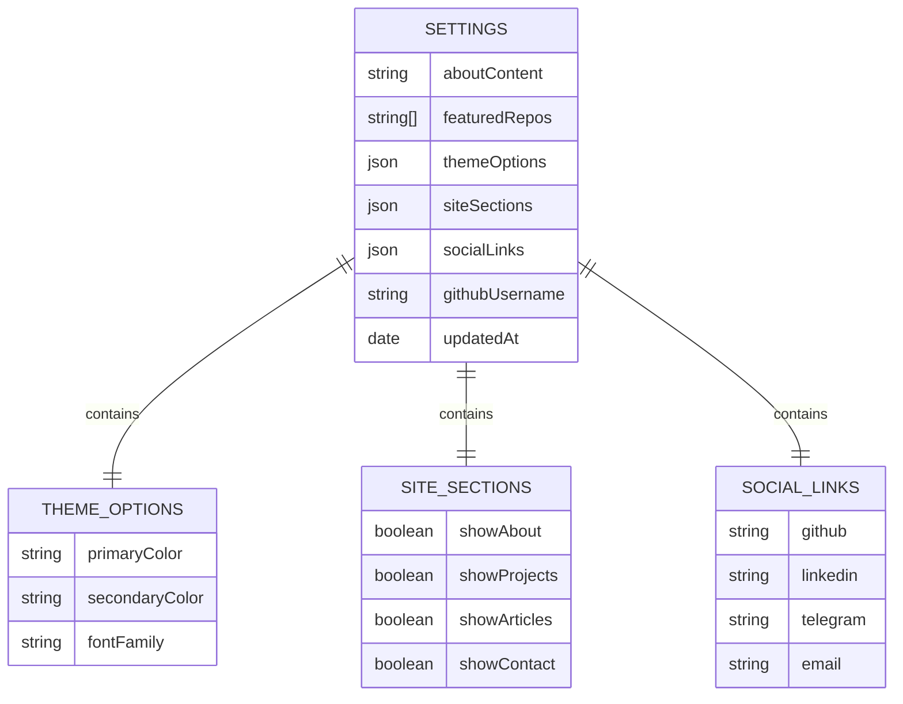
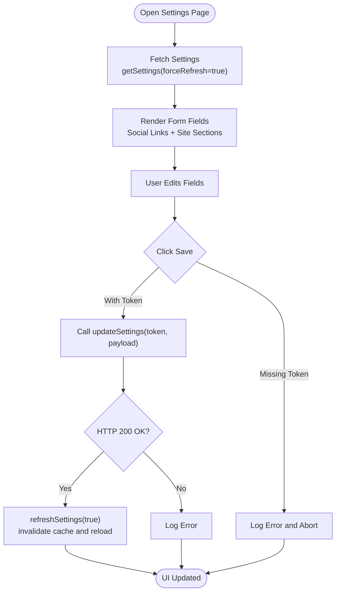
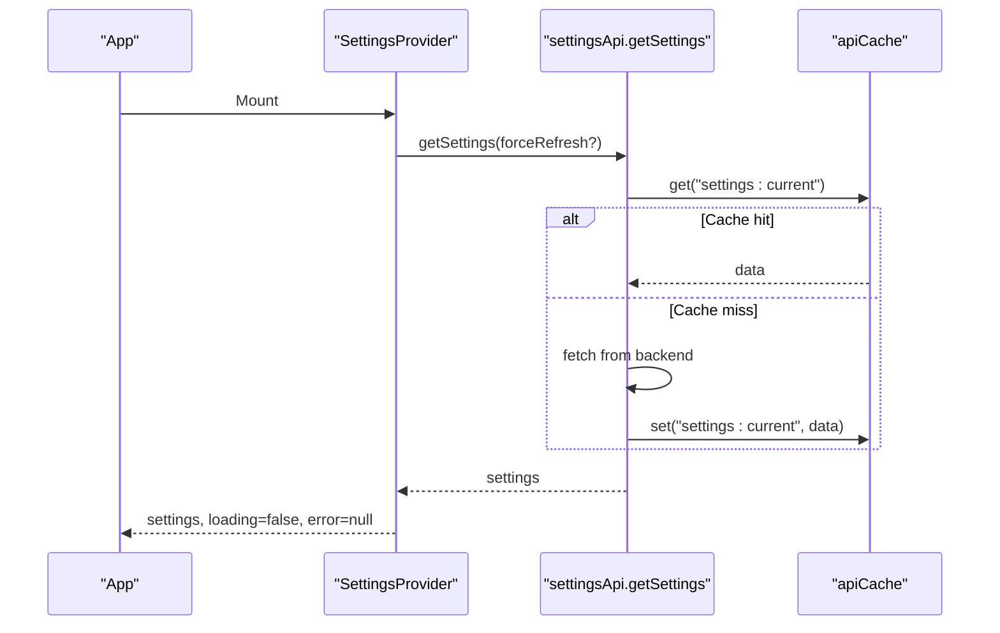
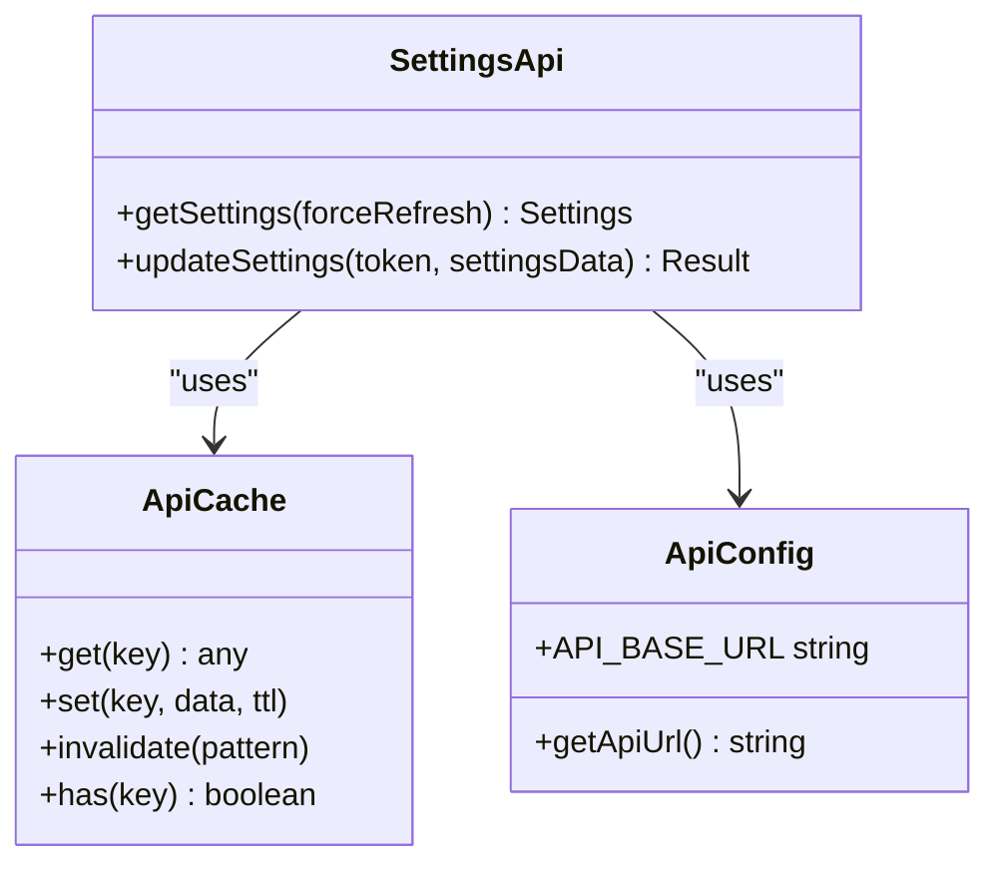
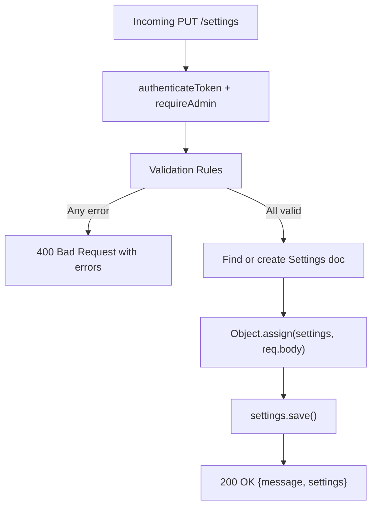
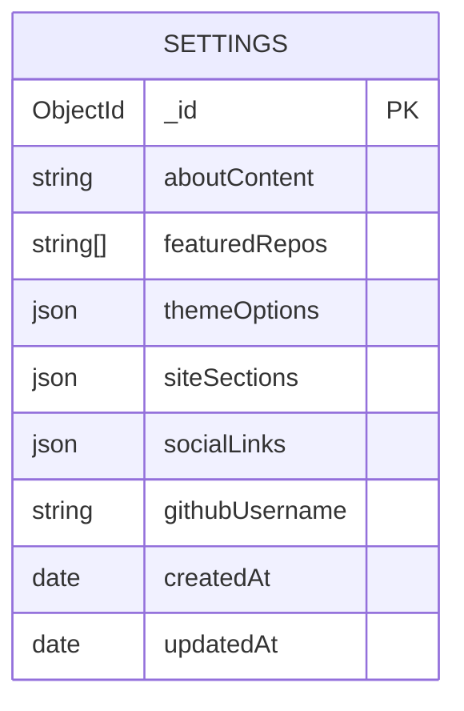
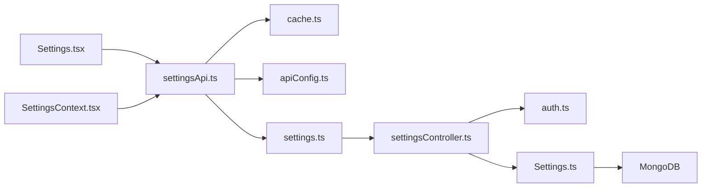

# Settings Management

<cite>
**Referenced Files in This Document**
- [Settings.tsx](file://personalSite/src/pages/Admin/Settings.tsx)
- [SettingsContext.tsx](file://personalSite/src/contexts/SettingsContext.tsx)
- [settingsApi.ts](file://personalSite/src/api/settingsApi.ts)
- [Settings.ts](file://server/src/models/Settings.ts)
- [settingsController.ts](file://server/src/controllers/settingsController.ts)
- [settings.ts](file://server/src/routes/settings.ts)
- [cache.ts](file://personalSite/src/lib/cache.ts)
- [apiConfig.ts](file://personalSite/src/lib/apiConfig.ts)
- [auth.ts](file://server/src/middleware/auth.ts)
- [database.ts](file://server/src/config/database.ts)
</cite>

## Table of Contents
1. [Introduction](#introduction)
2. [Project Structure](#project-structure)
3. [Core Components](#core-components)
4. [Architecture Overview](#architecture-overview)
5. [Detailed Component Analysis](#detailed-component-analysis)
6. [Dependency Analysis](#dependency-analysis)
7. [Performance Considerations](#performance-considerations)
8. [Troubleshooting Guide](#troubleshooting-guide)
9. [Conclusion](#conclusion)
10. [Appendices](#appendices)

## Introduction
This document provides comprehensive documentation for the Settings Management interface that handles site configuration and preferences. It explains the settings data structure, form validation and submission process, real-time configuration updates, and the integration with the settings API controller and database. It also covers category-based settings (site metadata, social media links, contact information, and display preferences), file upload considerations for images/logos, preview capabilities, validation rules, and security considerations for sensitive settings. Finally, it outlines how to extend the settings interface with new fields and configuration options.

## Project Structure
The settings management system spans three layers:
- Frontend (React Admin page, context provider, API client, and caching)
- Backend (Express routes, controller with validation, and Mongoose model)
- Database (MongoDB via Mongoose)

**Diagram sources**
- [Settings.tsx](file://personalSite/src/pages/Admin/Settings.tsx#L1-L273)
- [SettingsContext.tsx](file://personalSite/src/contexts/SettingsContext.tsx#L1-L126)
- [settingsApi.ts](file://personalSite/src/api/settingsApi.ts#L1-L96)
- [cache.ts](file://personalSite/src/lib/cache.ts#L1-L137)
- [apiConfig.ts](file://personalSite/src/lib/apiConfig.ts#L1-L75)
- [settings.ts](file://server/src/routes/settings.ts#L1-L16)
- [settingsController.ts](file://server/src/controllers/settingsController.ts#L1-L119)
- [auth.ts](file://server/src/middleware/auth.ts#L1-L37)
- [Settings.ts](file://server/src/models/Settings.ts#L1-L82)

**Section sources**
- [Settings.tsx](file://personalSite/src/pages/Admin/Settings.tsx#L1-L273)
- [SettingsContext.tsx](file://personalSite/src/contexts/SettingsContext.tsx#L1-L126)
- [settingsApi.ts](file://personalSite/src/api/settingsApi.ts#L1-L96)
- [cache.ts](file://personalSite/src/lib/cache.ts#L1-L137)
- [apiConfig.ts](file://personalSite/src/lib/apiConfig.ts#L1-L75)
- [settings.ts](file://server/src/routes/settings.ts#L1-L16)
- [settingsController.ts](file://server/src/controllers/settingsController.ts#L1-L119)
- [auth.ts](file://server/src/middleware/auth.ts#L1-L37)
- [Settings.ts](file://server/src/models/Settings.ts#L1-L82)

## Core Components
- Settings Page (Admin UI): Manages editing of site sections visibility and social links, handles form submission, and displays save feedback.
- Settings Context Provider: Centralizes settings state, loading/error states, and refresh mechanism with timeout and defaults.
- Settings API Client: Fetches and updates settings with caching and cache invalidation.
- Settings Controller: Validates incoming settings updates and persists them to the database.
- Settings Model: Defines the schema for settings persistence in MongoDB.
- Authentication Middleware: Protects settings updates behind admin-only access.

**Section sources**
- [Settings.tsx](file://personalSite/src/pages/Admin/Settings.tsx#L13-L126)
- [SettingsContext.tsx](file://personalSite/src/contexts/SettingsContext.tsx#L4-L126)
- [settingsApi.ts](file://personalSite/src/api/settingsApi.ts#L4-L96)
- [settingsController.ts](file://server/src/controllers/settingsController.ts#L21-L119)
- [Settings.ts](file://server/src/models/Settings.ts#L3-L82)
- [auth.ts](file://server/src/middleware/auth.ts#L9-L37)

## Architecture Overview
The settings architecture follows a clear separation of concerns:
- Frontend renders the settings UI, maintains local state, and communicates with the backend via a typed API client.
- The API client caches responses and invalidates cache upon successful updates.
- The backend validates requests, authenticates and authorizes administrators, and persists settings to MongoDB.
- The database schema supports optional and required fields, enabling incremental updates.

**Diagram sources**
- [Settings.tsx](file://personalSite/src/pages/Admin/Settings.tsx#L47-L126)
- [SettingsContext.tsx](file://personalSite/src/contexts/SettingsContext.tsx#L76-L118)
- [settingsApi.ts](file://personalSite/src/api/settingsApi.ts#L49-L94)
- [cache.ts](file://personalSite/src/lib/cache.ts#L12-L96)
- [settings.ts](file://server/src/routes/settings.ts#L7-L14)
- [settingsController.ts](file://server/src/controllers/settingsController.ts#L5-L119)
- [auth.ts](file://server/src/middleware/auth.ts#L9-L37)
- [Settings.ts](file://server/src/models/Settings.ts#L27-L80)

## Detailed Component Analysis

### Settings Data Structure
The settings schema defines the persisted structure and defaults. It includes:
- Site metadata: about content, featured repositories, and theme options (colors and font family)
- Display preferences: per-section visibility flags
- Social links: platform profiles and contact email
- Additional fields: optional GitHub username and timestamps

**Diagram sources**
- [Settings.ts](file://server/src/models/Settings.ts#L3-L25)

**Section sources**
- [Settings.ts](file://server/src/models/Settings.ts#L3-L25)
- [Settings.ts](file://server/src/models/Settings.ts#L27-L80)

### Settings Page (Admin UI)
The Admin Settings page provides:
- Real-time editing of site sections visibility (boolean toggles)
- Social links editing (URL/email inputs)
- Form submission with authentication token validation
- Immediate UI feedback on save success
- Forced refresh of settings after save to reflect changes instantly

**Diagram sources**
- [Settings.tsx](file://personalSite/src/pages/Admin/Settings.tsx#L47-L126)
- [settingsApi.ts](file://personalSite/src/api/settingsApi.ts#L72-L94)
- [SettingsContext.tsx](file://personalSite/src/contexts/SettingsContext.tsx#L114-L118)

**Section sources**
- [Settings.tsx](file://personalSite/src/pages/Admin/Settings.tsx#L13-L273)

### Settings Context Provider
The Settings Context:
- Maintains settings state, loading, and error states
- Implements a timeout mechanism for settings retrieval
- Falls back to default settings on timeout
- Exposes a refreshSettings function to force reload and invalidate cache

**Diagram sources**
- [SettingsContext.tsx](file://personalSite/src/contexts/SettingsContext.tsx#L76-L118)
- [cache.ts](file://personalSite/src/lib/cache.ts#L20-L48)

**Section sources**
- [SettingsContext.tsx](file://personalSite/src/contexts/SettingsContext.tsx#L71-L126)

### Settings API Client
The API client:
- Centralizes API base URL resolution
- Implements caching with TTL and pattern-based invalidation
- Handles GET and PUT for settings with proper error handling

**Diagram sources**
- [settingsApi.ts](file://personalSite/src/api/settingsApi.ts#L48-L96)
- [cache.ts](file://personalSite/src/lib/cache.ts#L12-L96)
- [apiConfig.ts](file://personalSite/src/lib/apiConfig.ts#L6-L55)

**Section sources**
- [settingsApi.ts](file://personalSite/src/api/settingsApi.ts#L48-L96)
- [cache.ts](file://personalSite/src/lib/cache.ts#L12-L137)
- [apiConfig.ts](file://personalSite/src/lib/apiConfig.ts#L6-L75)

### Settings Controller and Validation
The backend validates each field using express-validator and applies strict rules:
- String validation for URLs and emails
- Boolean validation for section visibility
- Optional fields to support partial updates
- Admin-only access enforced by middleware

**Diagram sources**
- [settingsController.ts](file://server/src/controllers/settingsController.ts#L21-L119)
- [auth.ts](file://server/src/middleware/auth.ts#L9-L37)

**Section sources**
- [settingsController.ts](file://server/src/controllers/settingsController.ts#L21-L119)
- [auth.ts](file://server/src/middleware/auth.ts#L9-L37)

### Database Schema and Persistence
The Mongoose model defines:
- Defaults for most fields
- Optional fields for flexible updates
- Timestamps for auditability
- Environment-driven defaults (e.g., GitHub username)

**Diagram sources**
- [Settings.ts](file://server/src/models/Settings.ts#L27-L80)

**Section sources**
- [Settings.ts](file://server/src/models/Settings.ts#L27-L80)

## Dependency Analysis
The settings system exhibits low coupling and clear boundaries:
- Frontend depends on API client and cache utilities
- API client depends on environment configuration and cache
- Backend routes depend on controller and middleware
- Controller depends on model and validation library
- Model depends on Mongoose

**Diagram sources**
- [Settings.tsx](file://personalSite/src/pages/Admin/Settings.tsx#L1-L273)
- [SettingsContext.tsx](file://personalSite/src/contexts/SettingsContext.tsx#L1-L126)
- [settingsApi.ts](file://personalSite/src/api/settingsApi.ts#L1-L96)
- [cache.ts](file://personalSite/src/lib/cache.ts#L1-L137)
- [apiConfig.ts](file://personalSite/src/lib/apiConfig.ts#L1-L75)
- [settings.ts](file://server/src/routes/settings.ts#L1-L16)
- [settingsController.ts](file://server/src/controllers/settingsController.ts#L1-L119)
- [auth.ts](file://server/src/middleware/auth.ts#L1-L37)
- [Settings.ts](file://server/src/models/Settings.ts#L1-L82)

**Section sources**
- [Settings.tsx](file://personalSite/src/pages/Admin/Settings.tsx#L1-L273)
- [settingsApi.ts](file://personalSite/src/api/settingsApi.ts#L1-L96)
- [settingsController.ts](file://server/src/controllers/settingsController.ts#L1-L119)
- [Settings.ts](file://server/src/models/Settings.ts#L1-L82)

## Performance Considerations
- Caching: Settings are cached with TTL to reduce network overhead. On updates, cache is invalidated and refreshed to avoid stale data.
- Timeout handling: Settings loading uses a race between API and timeout to prevent hanging UI.
- Minimal re-renders: Local state updates are granular (section toggles, social links), reducing unnecessary re-renders.
- Network efficiency: Partial updates are supported, minimizing payload sizes.

[No sources needed since this section provides general guidance]

## Troubleshooting Guide
Common issues and resolutions:
- Settings loading timeout: The context falls back to default settings and logs a warning. Verify backend availability and network connectivity.
- Missing authentication token: The submit handler aborts early with an error log. Ensure the user is logged in and the token is present.
- Validation errors on update: The controller returns structured validation errors. Review the payload shape and ensure types match the schema.
- Cache inconsistencies: After updates, cache is invalidated and refreshed. If stale data appears, trigger a forced refresh.

**Section sources**
- [SettingsContext.tsx](file://personalSite/src/contexts/SettingsContext.tsx#L82-L107)
- [Settings.tsx](file://personalSite/src/pages/Admin/Settings.tsx#L108-L125)
- [settingsController.ts](file://server/src/controllers/settingsController.ts#L94-L97)
- [settingsApi.ts](file://personalSite/src/api/settingsApi.ts#L88-L94)

## Conclusion
The Settings Management interface provides a robust, secure, and efficient way to configure a portfolio site. It combines a clean frontend UI with strong backend validation, admin-only protection, and resilient caching. The schema supports incremental updates and sensible defaults, enabling easy extension with new fields and categories.

[No sources needed since this section summarizes without analyzing specific files]

## Appendices

### A. Adding New Settings Fields
Steps to add a new field:
1. Extend the TypeScript interfaces in the frontend API client and context to include the new field(s).
2. Add corresponding validation rules in the backend controller.
3. Update the Mongoose model with the new field(s) and appropriate defaults.
4. Update the Admin Settings page to render the new field(s) in the appropriate category.
5. Ensure cache invalidation occurs on updates so the change propagates immediately.

Example references:
- Frontend interfaces: [settingsApi.ts](file://personalSite/src/api/settingsApi.ts#L4-L46)
- Context defaults and structure: [SettingsContext.tsx](file://personalSite/src/contexts/SettingsContext.tsx#L4-L46)
- Backend validation: [settingsController.ts](file://server/src/controllers/settingsController.ts#L21-L91)
- Model schema: [Settings.ts](file://server/src/models/Settings.ts#L27-L80)
- Admin UI rendering: [Settings.tsx](file://personalSite/src/pages/Admin/Settings.tsx#L150-L273)

**Section sources**
- [settingsApi.ts](file://personalSite/src/api/settingsApi.ts#L4-L46)
- [SettingsContext.tsx](file://personalSite/src/contexts/SettingsContext.tsx#L4-L46)
- [settingsController.ts](file://server/src/controllers/settingsController.ts#L21-L91)
- [Settings.ts](file://server/src/models/Settings.ts#L27-L80)
- [Settings.tsx](file://personalSite/src/pages/Admin/Settings.tsx#L150-L273)

### B. Implementing Custom Validation
To implement custom validation:
- Add express-validator rules in the controller for the target field(s).
- Keep validation messages user-friendly and consistent.
- Ensure optional fields are handled properly to support partial updates.

References:
- Validation rules: [settingsController.ts](file://server/src/controllers/settingsController.ts#L21-L91)

**Section sources**
- [settingsController.ts](file://server/src/controllers/settingsController.ts#L21-L91)

### C. Extending the Settings Interface
Examples of extending with additional configuration options:
- Theme customization: Add new color tokens or typography options in themeOptions and update the UI accordingly.
- Display preferences: Introduce new section flags in siteSections and render them in the Admin UI.
- Social integrations: Add new platform links in socialLinks and ensure validation rules are defined.

References:
- Theme options: [Settings.ts](file://server/src/models/Settings.ts#L36-L49)
- Site sections: [Settings.ts](file://server/src/models/Settings.ts#L50-L67)
- Social links: [Settings.ts](file://server/src/models/Settings.ts#L68-L73)
- Admin UI categories: [Settings.tsx](file://personalSite/src/pages/Admin/Settings.tsx#L150-L242)

**Section sources**
- [Settings.ts](file://server/src/models/Settings.ts#L36-L73)
- [Settings.tsx](file://personalSite/src/pages/Admin/Settings.tsx#L150-L242)

### D. Security Considerations
- Access control: Settings updates are protected by authentication and admin role checks.
- Token handling: Frontend requires a valid JWT for updates; backend verifies and decodes the token.
- Input sanitization: Validation ensures correct types; additional sanitization can be applied at the controller level if needed.
- Sensitive data: No secrets are stored in the settings collection in the current schema; keep sensitive values in environment variables.

References:
- Authentication middleware: [auth.ts](file://server/src/middleware/auth.ts#L9-L37)
- Settings route protection: [settings.ts](file://server/src/routes/settings.ts#L11-L14)

**Section sources**
- [auth.ts](file://server/src/middleware/auth.ts#L9-L37)
- [settings.ts](file://server/src/routes/settings.ts#L11-L14)

### E. Backup and Restore
Current implementation does not include explicit backup/restore functionality for settings. Recommended approaches:
- Export settings: Add an endpoint to export the current settings document as JSON.
- Import settings: Add an endpoint to import and merge settings from a JSON file.
- Versioning: Store a version field in the settings document to manage migrations.
- Admin UI: Provide buttons in the Admin Settings page to trigger export/import actions.

[No sources needed since this section proposes future enhancements]

### F. File Upload and Preview for Images/Logos
The current settings schema and UI do not include dedicated fields for uploading images/logos. However, the system can accommodate this:
- Add image URL fields to the socialLinks or introduce a new media section in the schema.
- Use the existing image upload controller for GitHub-backed storage if desired.
- Implement a file input component with preview capability in the Admin UI.
- Ensure validation for image MIME types and size limits.

References:
- Image upload controller (for inspiration): [imageUploadController.ts](file://server/src/controllers/imageUploadController.ts#L45-L123)
- Settings schema: [Settings.ts](file://server/src/models/Settings.ts#L68-L73)

**Section sources**
- [Settings.ts](file://server/src/models/Settings.ts#L68-L73)