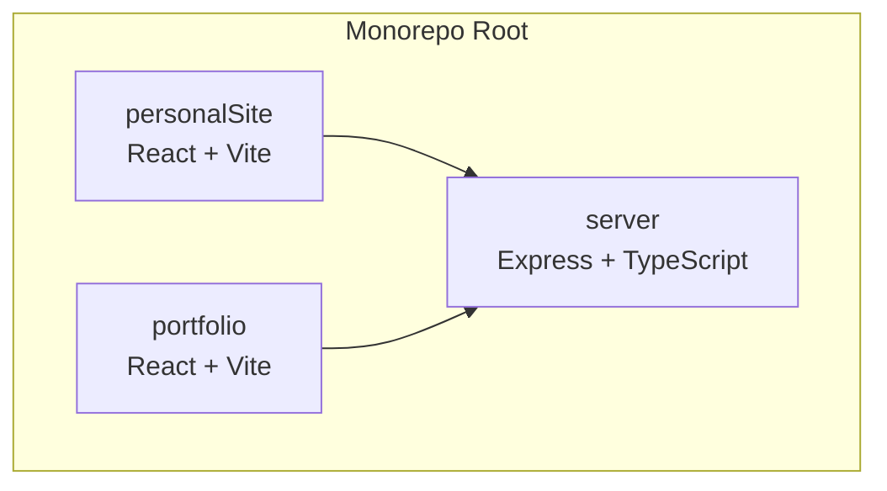
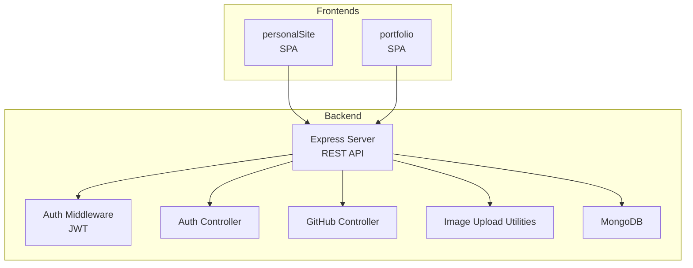
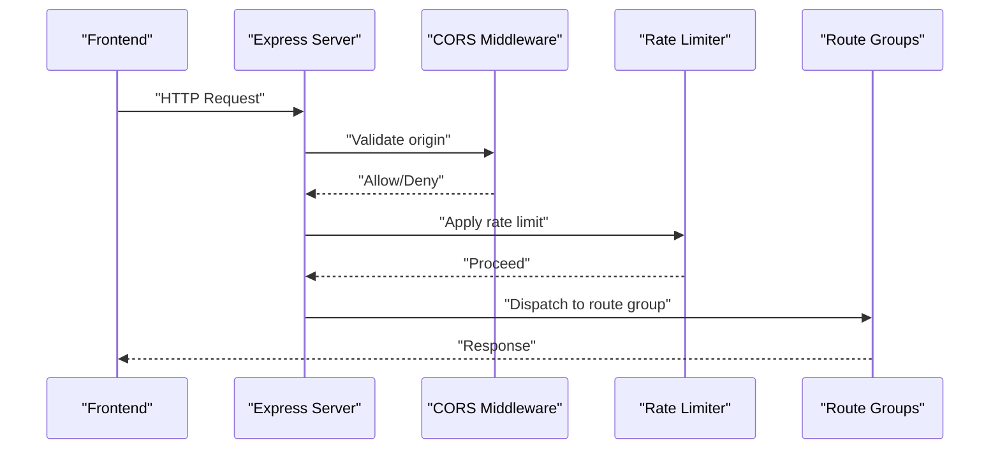
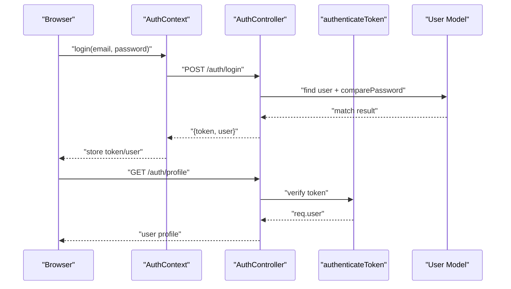
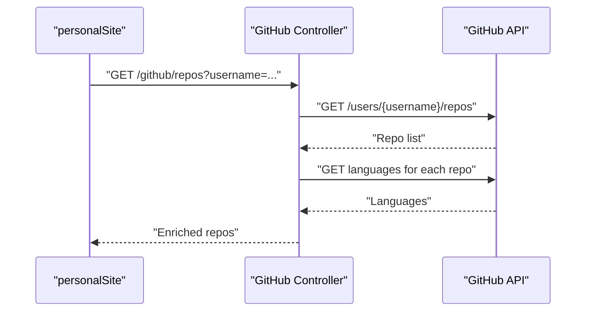
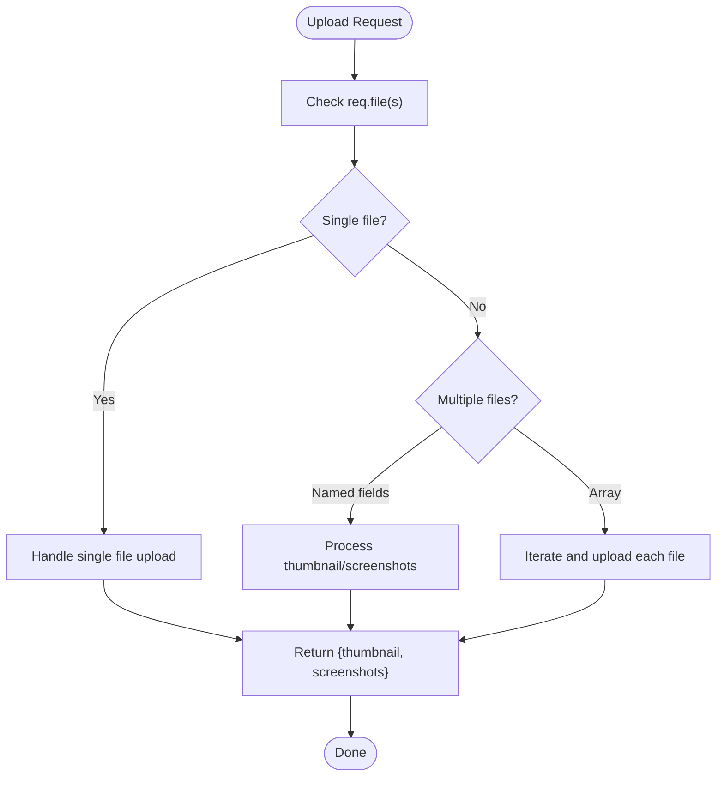
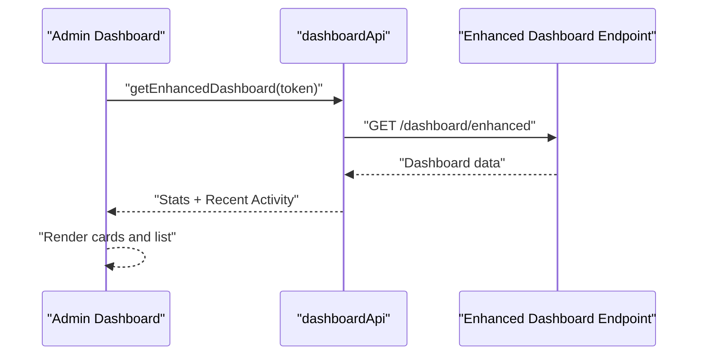
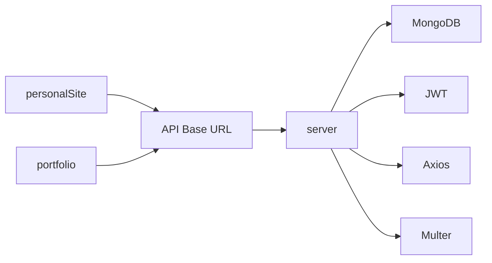
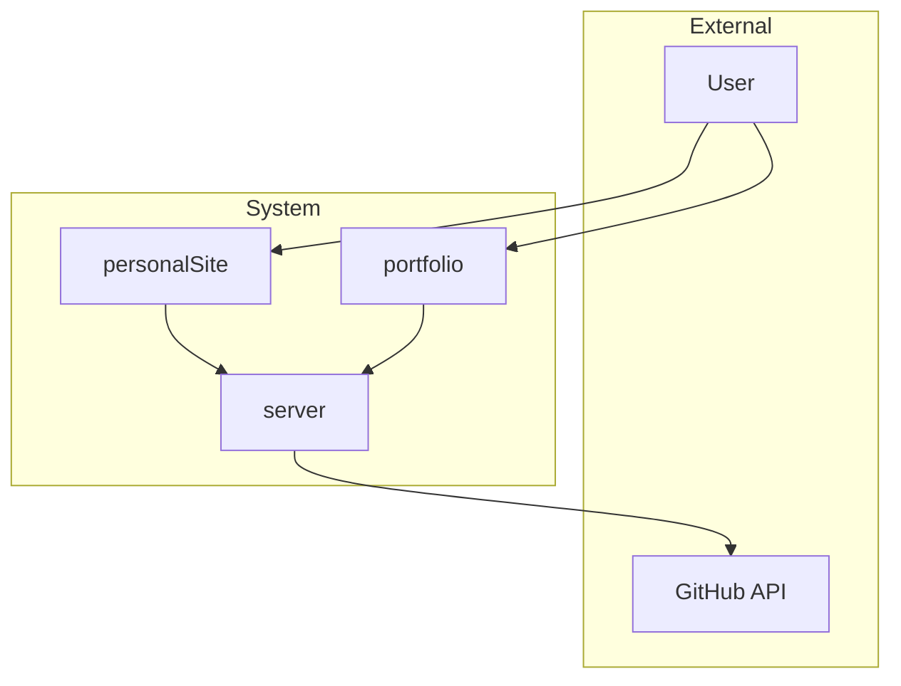

# Architecture Overview

<cite>
**Referenced Files in This Document**
- [server/src/index.ts](file://server/src/index.ts)
- [server/src/config/database.ts](file://server/src/config/database.ts)
- [server/src/middleware/auth.ts](file://server/src/middleware/auth.ts)
- [server/src/controllers/authController.ts](file://server/src/controllers/authController.ts)
- [server/src/controllers/githubController.ts](file://server/src/controllers/githubController.ts)
- [server/src/utils/imageUploadHandler.ts](file://server/src/utils/imageUploadHandler.ts)
- [server/src/models/User.ts](file://server/src/models/User.ts)
- [server/package.json](file://server/package.json)
- [personalSite/vite.config.ts](file://personalSite/vite.config.ts)
- [personalSite/src/lib/apiConfig.ts](file://personalSite/src/lib/apiConfig.ts)
- [personalSite/src/contexts/AuthContext.tsx](file://personalSite/src/contexts/AuthContext.tsx)
- [personalSite/src/pages/Admin/Dashboard.tsx](file://personalSite/src/pages/Admin/Dashboard.tsx)
- [personalSite/src/api/githubApi.ts](file://personalSite/src/api/githubApi.ts)
- [portfolio/vite.config.ts](file://portfolio/vite.config.ts)
- [portfolio/src/lib/apiConfig.ts](file://portfolio/src/lib/apiConfig.ts)
- [portfolio/package.json](file://portfolio/package.json)
- [personalSite/package.json](file://personalSite/package.json)
</cite>

## Table of Contents
1. [Introduction](#introduction)
2. [Project Structure](#project-structure)
3. [Core Components](#core-components)
4. [Architecture Overview](#architecture-overview)
5. [Detailed Component Analysis](#detailed-component-analysis)
6. [Dependency Analysis](#dependency-analysis)
7. [Performance Considerations](#performance-considerations)
8. [Troubleshooting Guide](#troubleshooting-guide)
9. [Conclusion](#conclusion)
10. [Appendices](#appendices)

## Introduction
This document presents the architecture of the Personal Portfolio Platform, a three-application system comprising:
- personalSite: A modern React application with a component-based UI and admin dashboard.
- portfolio: A lightweight React application showcasing portfolio content.
- server: An Express.js backend implementing an MVC-style separation of concerns with TypeScript, MongoDB, and robust middleware for security and resilience.

The system emphasizes a monorepo structure, centralized API configuration, and clear application boundaries. It integrates GitHub data retrieval, media upload handling, and a JWT-based authentication flow. Infrastructure and deployment topology are designed for scalability and maintainability.

## Project Structure
The repository follows a monorepo layout with three distinct applications under the root:
- personalSite: Full-featured frontend with admin capabilities, routing, and UI components.
- portfolio: Minimalist frontend focused on presentation.
- server: Backend API with routes, controllers, models, middleware, and utilities.

**Diagram sources**
- [personalSite/package.json](file://personalSite/package.json#L1-L113)
- [portfolio/package.json](file://portfolio/package.json#L1-L74)
- [server/package.json](file://server/package.json#L1-L40)

**Section sources**
- [personalSite/package.json](file://personalSite/package.json#L1-L113)
- [portfolio/package.json](file://portfolio/package.json#L1-L74)
- [server/package.json](file://server/package.json#L1-L40)

## Core Components
- Backend entrypoint and routing orchestration
- Database connectivity and lifecycle management
- Authentication middleware and controller
- GitHub integration controller
- Image upload utilities and handlers
- Frontend API configuration and client-side auth provider
- Admin dashboard component consuming backend APIs

Key implementation references:
- Backend bootstrap and middleware stack: [server/src/index.ts](file://server/src/index.ts#L1-L158)
- Database connection and reconnection: [server/src/config/database.ts](file://server/src/config/database.ts#L1-L61)
- Auth middleware and roles: [server/src/middleware/auth.ts](file://server/src/middleware/auth.ts#L1-L37)
- Auth controller endpoints: [server/src/controllers/authController.ts](file://server/src/controllers/authController.ts#L1-L142)
- GitHub controller: [server/src/controllers/githubController.ts](file://server/src/controllers/githubController.ts#L1-L177)
- Image upload utilities: [server/src/utils/imageUploadHandler.ts](file://server/src/utils/imageUploadHandler.ts#L1-L199)
- Frontend API base URL resolution: [personalSite/src/lib/apiConfig.ts](file://personalSite/src/lib/apiConfig.ts#L1-L75), [portfolio/src/lib/apiConfig.ts](file://portfolio/src/lib/apiConfig.ts#L1-L19)
- Client-side auth provider: [personalSite/src/contexts/AuthContext.tsx](file://personalSite/src/contexts/AuthContext.tsx#L1-L140)
- Admin dashboard data flow: [personalSite/src/pages/Admin/Dashboard.tsx](file://personalSite/src/pages/Admin/Dashboard.tsx#L1-L348)
- GitHub API wrapper: [personalSite/src/api/githubApi.ts](file://personalSite/src/api/githubApi.ts#L1-L46)

**Section sources**
- [server/src/index.ts](file://server/src/index.ts#L1-L158)
- [server/src/config/database.ts](file://server/src/config/database.ts#L1-L61)
- [server/src/middleware/auth.ts](file://server/src/middleware/auth.ts#L1-L37)
- [server/src/controllers/authController.ts](file://server/src/controllers/authController.ts#L1-L142)
- [server/src/controllers/githubController.ts](file://server/src/controllers/githubController.ts#L1-L177)
- [server/src/utils/imageUploadHandler.ts](file://server/src/utils/imageUploadHandler.ts#L1-L199)
- [personalSite/src/lib/apiConfig.ts](file://personalSite/src/lib/apiConfig.ts#L1-L75)
- [portfolio/src/lib/apiConfig.ts](file://portfolio/src/lib/apiConfig.ts#L1-L19)
- [personalSite/src/contexts/AuthContext.tsx](file://personalSite/src/contexts/AuthContext.tsx#L1-L140)
- [personalSite/src/pages/Admin/Dashboard.tsx](file://personalSite/src/pages/Admin/Dashboard.tsx#L1-L348)
- [personalSite/src/api/githubApi.ts](file://personalSite/src/api/githubApi.ts#L1-L46)

## Architecture Overview
High-level system architecture:
- personalSite and portfolio are SPA frontends built with Vite and React.
- Both frontends communicate with the backend via a centralized API base URL resolved from environment variables.
- The backend exposes REST endpoints organized by domain (auth, articles, projects, settings, GitHub, images, etc.), secured by JWT and validated by middleware.
- MongoDB serves as the persistent store with connection pooling and automatic reconnection logic.
- GitHub integration is proxied through the backend to avoid exposing tokens and to centralize rate-limit handling.

**Diagram sources**
- [server/src/index.ts](file://server/src/index.ts#L1-L158)
- [server/src/middleware/auth.ts](file://server/src/middleware/auth.ts#L1-L37)
- [server/src/controllers/authController.ts](file://server/src/controllers/authController.ts#L1-L142)
- [server/src/controllers/githubController.ts](file://server/src/controllers/githubController.ts#L1-L177)
- [server/src/utils/imageUploadHandler.ts](file://server/src/utils/imageUploadHandler.ts#L1-L199)
- [server/src/config/database.ts](file://server/src/config/database.ts#L1-L61)

## Detailed Component Analysis

### Backend Entry Point and Routing
The backend initializes Express, applies security and rate-limiting middleware, configures CORS dynamically based on environment, and mounts route groups. It also exposes health checks and a root endpoint.

**Diagram sources**
- [server/src/index.ts](file://server/src/index.ts#L34-L117)

**Section sources**
- [server/src/index.ts](file://server/src/index.ts#L1-L158)

### Authentication Flow (MVC)
The authentication subsystem follows an MVC pattern:
- Middleware validates JWT and attaches user context.
- Controller handles registration, login, and profile retrieval.
- Model enforces password hashing and comparison.

**Diagram sources**
- [personalSite/src/contexts/AuthContext.tsx](file://personalSite/src/contexts/AuthContext.tsx#L78-L122)
- [server/src/controllers/authController.ts](file://server/src/controllers/authController.ts#L81-L142)
- [server/src/middleware/auth.ts](file://server/src/middleware/auth.ts#L9-L30)
- [server/src/models/User.ts](file://server/src/models/User.ts#L54-L56)

**Section sources**
- [personalSite/src/contexts/AuthContext.tsx](file://personalSite/src/contexts/AuthContext.tsx#L1-L140)
- [server/src/controllers/authController.ts](file://server/src/controllers/authController.ts#L1-L142)
- [server/src/middleware/auth.ts](file://server/src/middleware/auth.ts#L1-L37)
- [server/src/models/User.ts](file://server/src/models/User.ts#L1-L58)

### GitHub Integration
The backend proxies GitHub API calls, optionally using a token, filters private repositories when unauthenticated, and enriches repository data with languages and contributors.

**Diagram sources**
- [server/src/controllers/githubController.ts](file://server/src/controllers/githubController.ts#L4-L100)
- [personalSite/src/api/githubApi.ts](file://personalSite/src/api/githubApi.ts#L7-L25)

**Section sources**
- [server/src/controllers/githubController.ts](file://server/src/controllers/githubController.ts#L1-L177)
- [personalSite/src/api/githubApi.ts](file://personalSite/src/api/githubApi.ts#L1-L46)

### Media Upload Handling
The backend supports single and multiple file uploads for thumbnails and screenshots, delegating to a reusable upload handler and returning standardized URLs.

**Diagram sources**
- [server/src/utils/imageUploadHandler.ts](file://server/src/utils/imageUploadHandler.ts#L47-L199)

**Section sources**
- [server/src/utils/imageUploadHandler.ts](file://server/src/utils/imageUploadHandler.ts#L1-L199)

### Frontend API Configuration and Admin Dashboard
- API base URL is resolved client-side from environment variables with development and production overrides.
- The admin dashboard fetches enhanced dashboard metrics via a dedicated API wrapper and displays statistics and recent activity.

**Diagram sources**
- [personalSite/src/pages/Admin/Dashboard.tsx](file://personalSite/src/pages/Admin/Dashboard.tsx#L86-L105)
- [personalSite/src/lib/apiConfig.ts](file://personalSite/src/lib/apiConfig.ts#L6-L28)

**Section sources**
- [personalSite/src/lib/apiConfig.ts](file://personalSite/src/lib/apiConfig.ts#L1-L75)
- [personalSite/src/pages/Admin/Dashboard.tsx](file://personalSite/src/pages/Admin/Dashboard.tsx#L1-L348)

## Dependency Analysis
- Frontends depend on centralized API configuration and share UI libraries via Vite aliases.
- Backend depends on Express, Mongoose, JWT, and validation utilities.
- Controllers depend on models and middleware; routes depend on controllers.

**Diagram sources**
- [personalSite/src/lib/apiConfig.ts](file://personalSite/src/lib/apiConfig.ts#L6-L28)
- [portfolio/src/lib/apiConfig.ts](file://portfolio/src/lib/apiConfig.ts#L6-L16)
- [server/src/index.ts](file://server/src/index.ts#L1-L22)
- [server/src/config/database.ts](file://server/src/config/database.ts#L1-L61)
- [server/src/controllers/githubController.ts](file://server/src/controllers/githubController.ts#L1-L4)

**Section sources**
- [personalSite/src/lib/apiConfig.ts](file://personalSite/src/lib/apiConfig.ts#L1-L75)
- [portfolio/src/lib/apiConfig.ts](file://portfolio/src/lib/apiConfig.ts#L1-L19)
- [server/src/index.ts](file://server/src/index.ts#L1-L158)
- [server/src/config/database.ts](file://server/src/config/database.ts#L1-L61)
- [server/src/controllers/githubController.ts](file://server/src/controllers/githubController.ts#L1-L177)

## Performance Considerations
- Build optimization: Vite configuration splits vendor bundles and enables esbuild minification. personalSite config includes chunk splitting and manual chunks for UI libraries.
- Caching: Frontend GitHub API responses are cached with a 10-minute TTL to reduce external API calls.
- Database tuning: Connection pooling and reconnection logic improve resilience; consider indexing frequently queried fields and enabling read-replica scaling for reads.
- CDN and static hosting: Frontend builds are optimized for static hosting; consider serving assets via CDN for global latency reduction.
- Rate limiting: Express rate limiter protects the backend from abuse; tune thresholds per environment.

**Section sources**
- [personalSite/vite.config.ts](file://personalSite/vite.config.ts#L40-L59)
- [personalSite/src/api/githubApi.ts](file://personalSite/src/api/githubApi.ts#L8-L25)
- [server/src/config/database.ts](file://server/src/config/database.ts#L14-L18)
- [server/src/index.ts](file://server/src/index.ts#L88-L93)

## Troubleshooting Guide
- CORS issues: Verify allowed origins and credentials configuration in the backend; confirm frontend proxy settings for development.
- Authentication failures: Check JWT secret, token presence, and user existence; ensure password hashing and comparison work correctly.
- Database connectivity: Monitor connection logs and reconnection attempts; verify environment variables and network access.
- GitHub API errors: Inspect rate limits and token configuration; handle 404/403 gracefully in the frontend.
- Image uploads: Validate multer configuration and file size limits; ensure upload handler receives correct file keys.

**Section sources**
- [server/src/index.ts](file://server/src/index.ts#L38-L84)
- [personalSite/vite.config.ts](file://personalSite/vite.config.ts#L18-L25)
- [server/src/middleware/auth.ts](file://server/src/middleware/auth.ts#L9-L30)
- [server/src/controllers/authController.ts](file://server/src/controllers/authController.ts#L22-L78)
- [server/src/config/database.ts](file://server/src/config/database.ts#L27-L44)
- [server/src/controllers/githubController.ts](file://server/src/controllers/githubController.ts#L88-L99)
- [server/src/utils/imageUploadHandler.ts](file://server/src/utils/imageUploadHandler.ts#L1-L199)

## Conclusion
The Personal Portfolio Platform employs a clean separation of concerns across three applications, leveraging modern frontend tooling and a robust backend with strong security and resilience patterns. The monorepo structure simplifies shared configurations and promotes consistency. With centralized API configuration, component-based UIs, and modular backend controllers, the system is well-positioned for growth and maintenance.

## Appendices

### System Context Diagram

[No sources needed since this diagram shows conceptual workflow, not actual code structure]

### Infrastructure and Deployment Topology
- Backend: Express server with TypeScript, MongoDB, and environment-driven configuration.
- Frontends: Vite-built SPAs with static hosting; personalSite includes prerendering support.
- Networking: CORS configured per environment; rate limiting enabled; optional GitHub token for API access.
- Scalability: Horizontal scaling of the backend is supported; database connection pooling and reconnection enhance availability.

**Section sources**
- [server/src/index.ts](file://server/src/index.ts#L34-L131)
- [server/src/config/database.ts](file://server/src/config/database.ts#L14-L44)
- [personalSite/package.json](file://personalSite/package.json#L6-L13)
- [portfolio/package.json](file://portfolio/package.json#L5-L10)