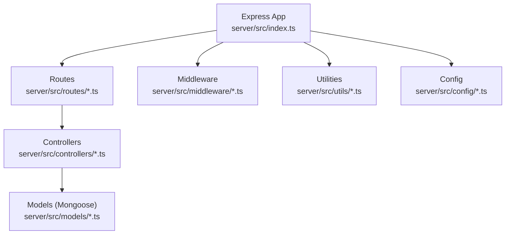
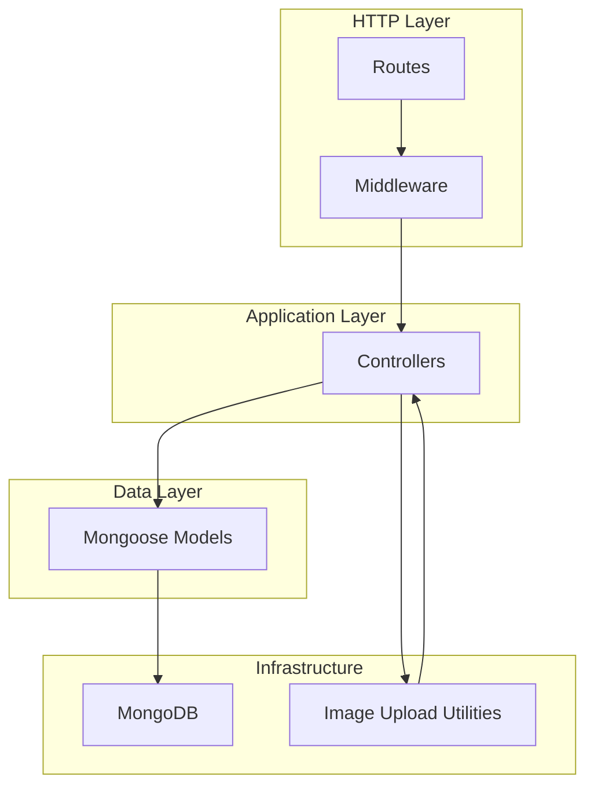
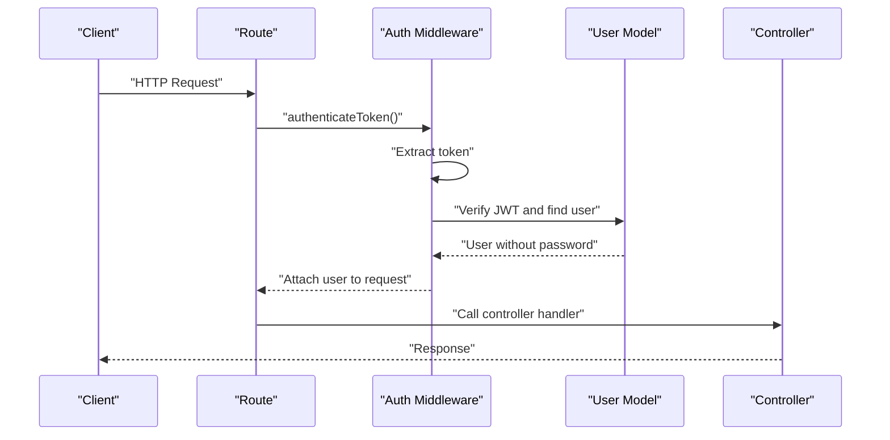
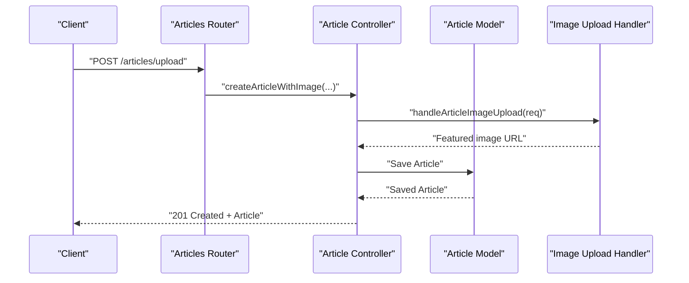
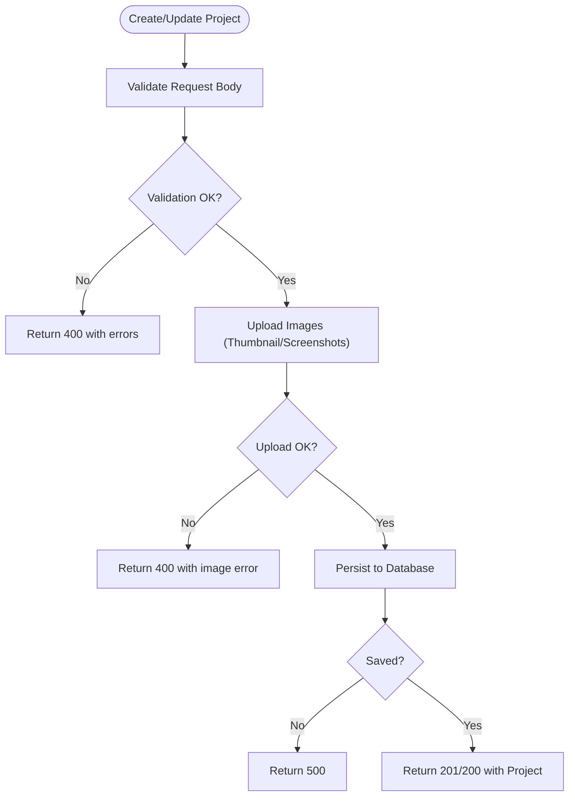
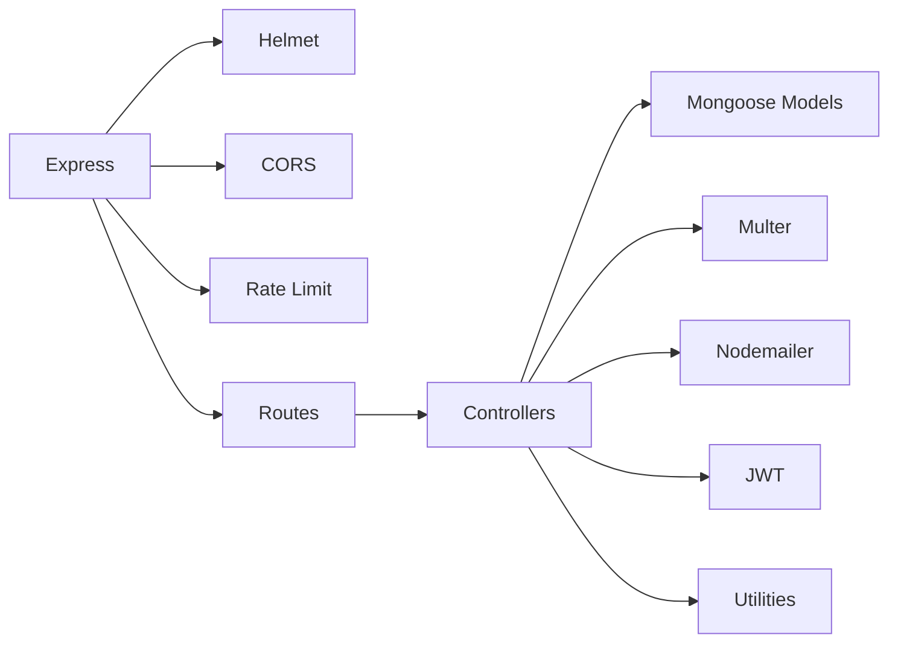

# API Design Patterns

<cite>
**Referenced Files in This Document**
- [index.ts](file://server/src/index.ts)
- [database.ts](file://server/src/config/database.ts)
- [auth.ts](file://server/src/middleware/auth.ts)
- [articles.ts](file://server/src/routes/articles.ts)
- [articleController.ts](file://server/src/controllers/articleController.ts)
- [projectController.ts](file://server/src/controllers/projectController.ts)
- [settingsController.ts](file://server/src/controllers/settingsController.ts)
- [contactController.ts](file://server/src/controllers/contactController.ts)
- [Article.ts](file://server/src/models/Article.ts)
- [imageUploadHandler.ts](file://server/src/utils/imageUploadHandler.ts)
- [apiConfig.ts](file://personalSite/src/lib/apiConfig.ts)
- [package.json](file://server/package.json)
- [tsconfig.json](file://server/tsconfig.json)
</cite>

## Table of Contents
1. [Introduction](#introduction)
2. [Project Structure](#project-structure)
3. [Core Components](#core-components)
4. [Architecture Overview](#architecture-overview)
5. [Detailed Component Analysis](#detailed-component-analysis)
6. [Dependency Analysis](#dependency-analysis)
7. [Performance Considerations](#performance-considerations)
8. [Troubleshooting Guide](#troubleshooting-guide)
9. [Conclusion](#conclusion)
10. [Appendices](#appendices)

## Introduction
This document explains the RESTful API design patterns implemented in the backend system. It covers the Model-View-Controller (MVC) separation, routing organization, endpoint naming conventions, HTTP method usage, request/response flows, parameter handling, validation patterns, CRUD operations across resources (articles, projects, users, settings, contact), error response standardization, status code usage, middleware for security and processing, and API documentation standards. The backend is built with Express.js, TypeScript, Mongoose, and integrates validation, authentication, rate limiting, and CORS.

## Project Structure
The backend follows a layered architecture:
- Entry point initializes Express, middleware, routes, and health checks.
- Routes define endpoint groups and attach controllers.
- Controllers implement request handlers, validation, and business logic.
- Models define data schemas and indexes.
- Middleware enforces authentication and admin roles.
- Utilities encapsulate cross-cutting concerns like image upload handling.

**Diagram sources**
- [index.ts](file://server/src/index.ts#L1-L158)
- [articles.ts](file://server/src/routes/articles.ts#L1-L54)
- [articleController.ts](file://server/src/controllers/articleController.ts#L1-L453)
- [Article.ts](file://server/src/models/Article.ts#L1-L64)
- [auth.ts](file://server/src/middleware/auth.ts#L1-L37)
- [imageUploadHandler.ts](file://server/src/utils/imageUploadHandler.ts#L1-L199)
- [database.ts](file://server/src/config/database.ts#L1-L61)

**Section sources**
- [index.ts](file://server/src/index.ts#L1-L158)
- [package.json](file://server/package.json#L1-L40)
- [tsconfig.json](file://server/tsconfig.json#L1-L20)

## Core Components
- Express application bootstrapping, middleware stack, and route registration.
- Authentication and admin role enforcement via JWT.
- Resource-specific controllers implementing CRUD with validation and image upload support.
- Mongoose models with indexes for search and performance.
- Utility functions for image upload orchestration.

Key responsibilities:
- Entry point: initialize services, configure middleware, register routes, expose health checks.
- Routes: group endpoints by resource, apply middleware, and delegate to controllers.
- Controllers: validate inputs, transform data, interact with models, handle file uploads, and return standardized responses.
- Models: define schema, constraints, and indexes.
- Middleware: enforce auth and admin permissions.
- Utilities: encapsulate reusable logic (e.g., image upload handling).

**Section sources**
- [index.ts](file://server/src/index.ts#L1-L158)
- [auth.ts](file://server/src/middleware/auth.ts#L1-L37)
- [articleController.ts](file://server/src/controllers/articleController.ts#L1-L453)
- [projectController.ts](file://server/src/controllers/projectController.ts#L1-L926)
- [settingsController.ts](file://server/src/controllers/settingsController.ts#L1-L119)
- [contactController.ts](file://server/src/controllers/contactController.ts#L1-L438)
- [Article.ts](file://server/src/models/Article.ts#L1-L64)
- [imageUploadHandler.ts](file://server/src/utils/imageUploadHandler.ts#L1-L199)

## Architecture Overview
The system adheres to MVC:
- Model: Mongoose ODM models define data structures and indexes.
- View: Not applicable in pure REST APIs; responses are rendered by controllers.
- Controller: Implements request handlers, validation, and orchestrates model operations.
- Routing: Groups endpoints by resource and applies middleware.
- Middleware: Security (Helmet), CORS, rate limiting, and auth/admin checks.
- Utilities: Image upload coordination and slug generation helpers.

**Diagram sources**
- [index.ts](file://server/src/index.ts#L1-L158)
- [articles.ts](file://server/src/routes/articles.ts#L1-L54)
- [auth.ts](file://server/src/middleware/auth.ts#L1-L37)
- [articleController.ts](file://server/src/controllers/articleController.ts#L1-L453)
- [Article.ts](file://server/src/models/Article.ts#L1-L64)
- [imageUploadHandler.ts](file://server/src/utils/imageUploadHandler.ts#L1-L199)
- [database.ts](file://server/src/config/database.ts#L1-L61)

## Detailed Component Analysis

### Authentication and Authorization Middleware
- Token extraction from Authorization header.
- JWT verification and user lookup.
- Role-based access control for admin-only endpoints.

**Diagram sources**
- [auth.ts](file://server/src/middleware/auth.ts#L1-L37)
- [articleController.ts](file://server/src/controllers/articleController.ts#L1-L453)

**Section sources**
- [auth.ts](file://server/src/middleware/auth.ts#L1-L37)

### Articles Resource: CRUD with Validation and Image Upload
Endpoints:
- GET /articles: Published articles with pagination and optional search/tags.
- GET /articles/all: Admin-only listing with filters.
- GET /articles/:id: Fetch by ID.
- POST /articles: Create article (JSON payload).
- PUT /articles/:id: Update article (JSON payload).
- POST /articles/upload: Create article with featured image.
- PUT /articles/upload/:id: Update article with featured image.

Validation patterns:
- express-validator for request body and query parameters.
- Custom validators for arrays, booleans, URLs, and text parsing.
- Slug generation and uniqueness checks.

Image upload:
- Multer memory storage with file filtering.
- Dedicated upload routes and helpers to coordinate image processing.

**Diagram sources**
- [articles.ts](file://server/src/routes/articles.ts#L1-L54)
- [articleController.ts](file://server/src/controllers/articleController.ts#L90-L194)
- [imageUploadHandler.ts](file://server/src/utils/imageUploadHandler.ts#L7-L45)

**Section sources**
- [articles.ts](file://server/src/routes/articles.ts#L1-L54)
- [articleController.ts](file://server/src/controllers/articleController.ts#L1-L453)
- [Article.ts](file://server/src/models/Article.ts#L1-L64)
- [imageUploadHandler.ts](file://server/src/utils/imageUploadHandler.ts#L1-L199)

### Projects Resource: CRUD with Advanced Validation and Multi-File Upload
Endpoints:
- GET /projects: Published projects with search and featured filters.
- GET /projects/all: Admin-only listing with filters.
- GET /projects/:id: Fetch by ID.
- POST /projects: Create project (JSON payload).
- PUT /projects/:id: Update project (JSON payload).
- POST /projects/upload: Create project with images (thumbnail and screenshots).
- PUT /projects/upload/:id: Update project with images.

Validation patterns:
- Robust custom validators for arrays, URLs, booleans, and multi-format inputs.
- Unique slug resolution with conflict avoidance.

Image upload:
- Handles single/thumbnail and multiple screenshots via unified helper.
- Supports legacy single-file and modern named-fields uploads.

**Diagram sources**
- [projectController.ts](file://server/src/controllers/projectController.ts#L148-L329)
- [imageUploadHandler.ts](file://server/src/utils/imageUploadHandler.ts#L47-L199)

**Section sources**
- [projectController.ts](file://server/src/controllers/projectController.ts#L1-L926)
- [imageUploadHandler.ts](file://server/src/utils/imageUploadHandler.ts#L1-L199)

### Settings Resource: Single-Document Management
Endpoints:
- GET /settings: Retrieve current settings, create defaults if missing.
- PUT /settings: Update settings with nested validation.

Patterns:
- Single-settings document pattern with default creation.
- Nested validation for theme options, site sections, and social links.

**Section sources**
- [settingsController.ts](file://server/src/controllers/settingsController.ts#L1-L119)

### Contact Resource: Submission, Status Updates, and Replies
Endpoints:
- POST /contact: Submit contact message with sanitization and validation.
- GET /contact: List messages (admin).
- PUT /contact/status/:id: Update message status.
- PUT /contact/reply/:id: Send admin reply email and update message.

Patterns:
- Comprehensive input sanitization and length limits.
- Email transport abstraction with caching.
- Reply serialization and HTML rendering.

**Section sources**
- [contactController.ts](file://server/src/controllers/contactController.ts#L1-L438)

### Database Connectivity and Seeding
- Centralized connection with retry and reconnection handling.
- Seed on empty collections after initial connection.
- Connection event listeners for error, disconnect, and reconnect.

**Section sources**
- [database.ts](file://server/src/config/database.ts#L1-L61)

### Frontend API Base URL Configuration
- Centralized API base URL selection based on environment variables.
- Supports development and production overrides.

**Section sources**
- [apiConfig.ts](file://personalSite/src/lib/apiConfig.ts#L1-L75)

## Dependency Analysis
External libraries and their roles:
- Express: Web framework and routing.
- Helmet: Security headers.
- CORS: Cross-origin policy management.
- Rate limiting: Request throttling.
- Mongoose: ODM for MongoDB.
- Multer: File upload handling.
- Nodemailer: Email delivery for contact replies.
- JWT: Authentication tokens.
- express-validator: Request validation.

**Diagram sources**
- [index.ts](file://server/src/index.ts#L1-L158)
- [package.json](file://server/package.json#L12-L27)

**Section sources**
- [package.json](file://server/package.json#L1-L40)

## Performance Considerations
- Pagination and skip/limit queries to avoid large payloads.
- Text indexes on searchable fields (e.g., Article text index).
- Connection pooling and timeouts configured for MongoDB.
- Memory-based uploads with size limits to prevent out-of-memory errors.
- Rate limiting to protect endpoints from abuse.
- Slug generation and uniqueness checks to maintain referential integrity.

[No sources needed since this section provides general guidance]

## Troubleshooting Guide
Common issues and resolutions:
- CORS errors: Verify allowed origins and credentials configuration.
- Rate limit exceeded: Reduce client request frequency or adjust limits.
- Validation failures: Inspect returned error arrays for specific field issues.
- Authentication failures: Ensure Authorization header contains a valid JWT.
- Image upload errors: Confirm file types and sizes meet constraints.
- Database connectivity: Check logs for reconnection attempts and timeouts.

**Section sources**
- [index.ts](file://server/src/index.ts#L34-L98)
- [auth.ts](file://server/src/middleware/auth.ts#L1-L37)
- [articles.ts](file://server/src/routes/articles.ts#L15-L30)
- [database.ts](file://server/src/config/database.ts#L26-L44)

## Conclusion
The backend implements a clean RESTful API following MVC separation, with robust validation, secure middleware, and consistent error handling. Resource-specific controllers encapsulate CRUD logic, while utilities centralize cross-cutting concerns like image uploads. The design supports scalability through pagination, indexing, and connection resilience, and it maintains developer ergonomics via centralized configuration and TypeScript typing.

[No sources needed since this section summarizes without analyzing specific files]

## Appendices

### Endpoint Naming Conventions and HTTP Methods
- Resource-based paths: plural nouns (e.g., /articles, /projects, /settings, /contact).
- Admin-only endpoints: prefixed under /api or grouped under admin routes.
- Image upload variants: separate routes suffixed with /upload for clarity.
- HTTP methods: GET (retrieve), POST (create), PUT (update), DELETE (remove).

**Section sources**
- [articles.ts](file://server/src/routes/articles.ts#L34-L54)
- [index.ts](file://server/src/index.ts#L100-L117)

### Request/Response Flow and Parameter Handling
- Query parameters: pagination (page, limit), filtering (search, status, tags, featured).
- Path parameters: resource identifiers (e.g., :id).
- Body parameters: validated via express-validator with custom checks.
- Responses: standardized success and error shapes; admin endpoints often return enriched data.

**Section sources**
- [articleController.ts](file://server/src/controllers/articleController.ts#L6-L73)
- [projectController.ts](file://server/src/controllers/projectController.ts#L25-L125)
- [contactController.ts](file://server/src/controllers/contactController.ts#L264-L315)

### Error Response Standardization and Status Codes
- 200/201: Successful retrieval or creation.
- 400: Validation errors or malformed requests.
- 401: Missing or invalid access token.
- 403: Insufficient permissions (admin required).
- 404: Resource not found.
- 500: Internal server errors.
- 502: Upstream/email failure during replies.

**Section sources**
- [auth.ts](file://server/src/middleware/auth.ts#L14-L29)
- [contactController.ts](file://server/src/controllers/contactController.ts#L310-L315)
- [index.ts](file://server/src/index.ts#L133-L140)

### API Versioning Strategy
- No explicit version prefix in current routes.
- Suggested approach: introduce /api/v1 for future-proofing without breaking changes.

[No sources needed since this section provides general guidance]

### OpenAPI/Swagger Integration Patterns
- Current code does not include OpenAPI/Swagger annotations.
- Recommended: adopt a decorator-based or code-first approach to auto-generate specs from controllers and models.

[No sources needed since this section provides general guidance]