# Authentication System

<cite>
**Referenced Files in This Document**
- [auth.ts](file://server/src/middleware/auth.ts)
- [authController.ts](file://server/src/controllers/authController.ts)
- [User.ts](file://server/src/models/User.ts)
- [auth.ts](file://server/src/routes/auth.ts)
- [index.ts](file://server/src/index.ts)
- [.env.example](file://server/.env.example)
- [AuthContext.tsx](file://personalSite/src/contexts/AuthContext.tsx)
- [RouteProtector.tsx](file://personalSite/src/components/RouteProtector.tsx)
- [Login.tsx](file://personalSite/src/pages/Auth/Login.tsx)
- [Register.tsx](file://personalSite/src/pages/Auth/Register.tsx)
- [package.json](file://server/package.json)
</cite>

## Table of Contents
1. [Introduction](#introduction)
2. [Project Structure](#project-structure)
3. [Core Components](#core-components)
4. [Architecture Overview](#architecture-overview)
5. [Detailed Component Analysis](#detailed-component-analysis)
6. [Dependency Analysis](#dependency-analysis)
7. [Performance Considerations](#performance-considerations)
8. [Security Measures](#security-measures)
9. [Troubleshooting Guide](#troubleshooting-guide)
10. [Conclusion](#conclusion)

## Introduction
This document explains the JWT-based authentication system implemented in the project. It covers middleware-based token verification, user registration and login flows, password hashing with bcrypt, role-based access control (RBAC), protected routes, session management using local storage, and security measures such as rate limiting and CORS hardening. It also documents token payload contents, logout mechanisms, token expiration handling, and error handling for authentication failures.

## Project Structure
The authentication system spans the backend Express server and the frontend React application:
- Backend: Express routes, controller, middleware, and Mongoose model for users
- Frontend: React context for authentication state, route protection, and login/register pages

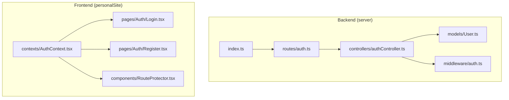

**Diagram sources**
- [index.ts](file://server/src/index.ts#L1-L158)
- [auth.ts](file://server/src/routes/auth.ts#L1-L11)
- [authController.ts](file://server/src/controllers/authController.ts#L1-L142)
- [auth.ts](file://server/src/middleware/auth.ts#L1-L37)
- [User.ts](file://server/src/models/User.ts#L1-L58)
- [AuthContext.tsx](file://personalSite/src/contexts/AuthContext.tsx#L1-L140)
- [RouteProtector.tsx](file://personalSite/src/components/RouteProtector.tsx#L1-L41)
- [Login.tsx](file://personalSite/src/pages/Auth/Login.tsx#L1-L120)
- [Register.tsx](file://personalSite/src/pages/Auth/Register.tsx#L1-L106)

**Section sources**
- [index.ts](file://server/src/index.ts#L1-L158)
- [auth.ts](file://server/src/routes/auth.ts#L1-L11)
- [authController.ts](file://server/src/controllers/authController.ts#L1-L142)
- [auth.ts](file://server/src/middleware/auth.ts#L1-L37)
- [User.ts](file://server/src/models/User.ts#L1-L58)
- [AuthContext.tsx](file://personalSite/src/contexts/AuthContext.tsx#L1-L140)
- [RouteProtector.tsx](file://personalSite/src/components/RouteProtector.tsx#L1-L41)
- [Login.tsx](file://personalSite/src/pages/Auth/Login.tsx#L1-L120)
- [Register.tsx](file://personalSite/src/pages/Auth/Register.tsx#L1-L106)

## Core Components
- JWT Middleware: Extracts Authorization header, verifies JWT signature, loads user, and attaches user to request
- Auth Controller: Handles registration and login with validation, password hashing, and token issuance
- User Model: Defines schema, password hashing lifecycle hook, and password comparison method
- Frontend Auth Context: Manages token and user state, persists to localStorage, validates tokens, and exposes login/register/logout
- Protected Routes: Guards routes based on authentication and admin roles
- Rate Limiting and CORS: Applied at the server entry point

Key responsibilities:
- Token generation: Issued on successful registration/login with a 7-day expiry
- Token verification: Validates signature and ensures user still exists
- RBAC: Admin-only enforcement via middleware
- Session management: Frontend stores token and user in localStorage and clears on logout
- Validation: Frontend validates presence of token and contacts profile endpoint to confirm validity

**Section sources**
- [auth.ts](file://server/src/middleware/auth.ts#L1-L37)
- [authController.ts](file://server/src/controllers/authController.ts#L1-L142)
- [User.ts](file://server/src/models/User.ts#L1-L58)
- [AuthContext.tsx](file://personalSite/src/contexts/AuthContext.tsx#L1-L140)
- [RouteProtector.tsx](file://personalSite/src/components/RouteProtector.tsx#L1-L41)
- [index.ts](file://server/src/index.ts#L34-L93)

## Architecture Overview
The authentication flow integrates frontend and backend components:

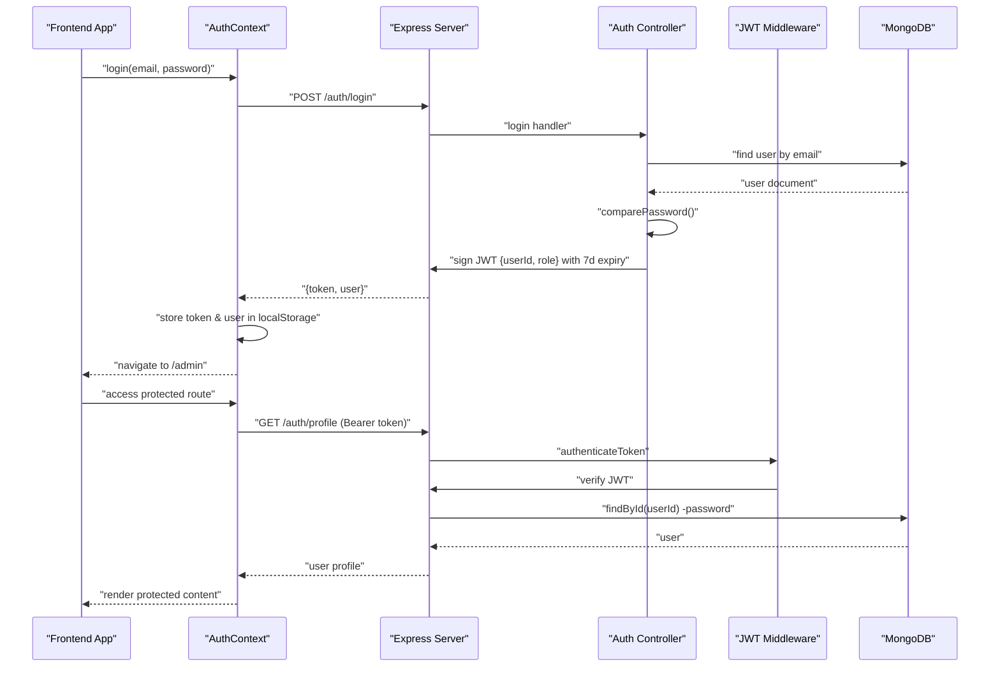

**Diagram sources**
- [AuthContext.tsx](file://personalSite/src/contexts/AuthContext.tsx#L78-L122)
- [authController.ts](file://server/src/controllers/authController.ts#L81-L133)
- [auth.ts](file://server/src/middleware/auth.ts#L9-L30)
- [User.ts](file://server/src/models/User.ts#L54-L56)
- [auth.ts](file://server/src/routes/auth.ts#L9-L9)

## Detailed Component Analysis

### JWT Middleware Implementation
- Extracts token from Authorization header and verifies it using the configured secret
- Loads user by ID from the token payload and attaches to request
- Returns appropriate HTTP statuses for missing/expired/invalid tokens
- Enforces admin-only access via a second middleware that checks role

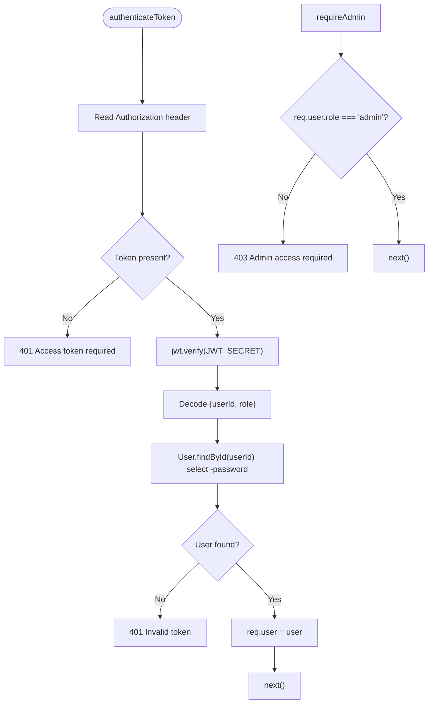

**Diagram sources**
- [auth.ts](file://server/src/middleware/auth.ts#L9-L37)

**Section sources**
- [auth.ts](file://server/src/middleware/auth.ts#L1-L37)

### Token Generation and Verification
- Registration and login both issue a signed JWT containing:
  - userId: ObjectId of the user
  - role: "admin" or "user"
  - expiresIn: 7 days
- Verification uses the same secret; any failure yields 403 for invalid/expired tokens

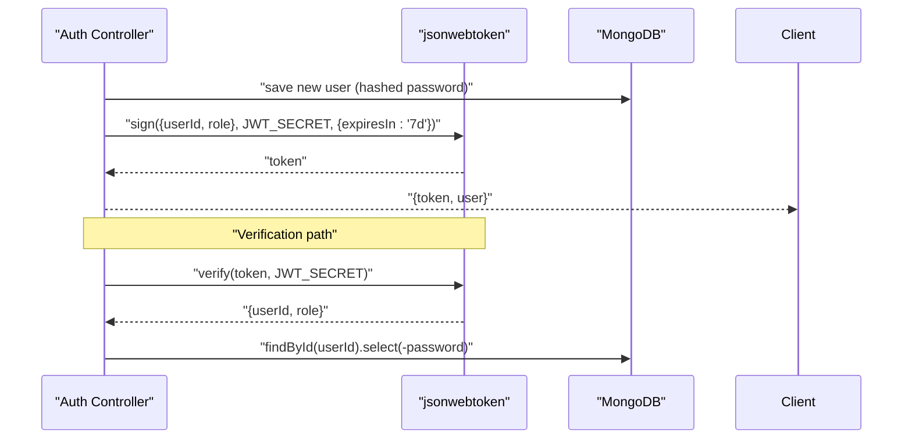

**Diagram sources**
- [authController.ts](file://server/src/controllers/authController.ts#L59-L63)
- [authController.ts](file://server/src/controllers/authController.ts#L113-L117)
- [auth.ts](file://server/src/middleware/auth.ts#L18-L20)

**Section sources**
- [authController.ts](file://server/src/controllers/authController.ts#L59-L63)
- [authController.ts](file://server/src/controllers/authController.ts#L113-L117)
- [auth.ts](file://server/src/middleware/auth.ts#L18-L20)

### Role-Based Access Control (RBAC)
- Admin enforcement is handled by a dedicated middleware that checks the user’s role
- Protected routes can be decorated with this middleware to restrict access to administrators

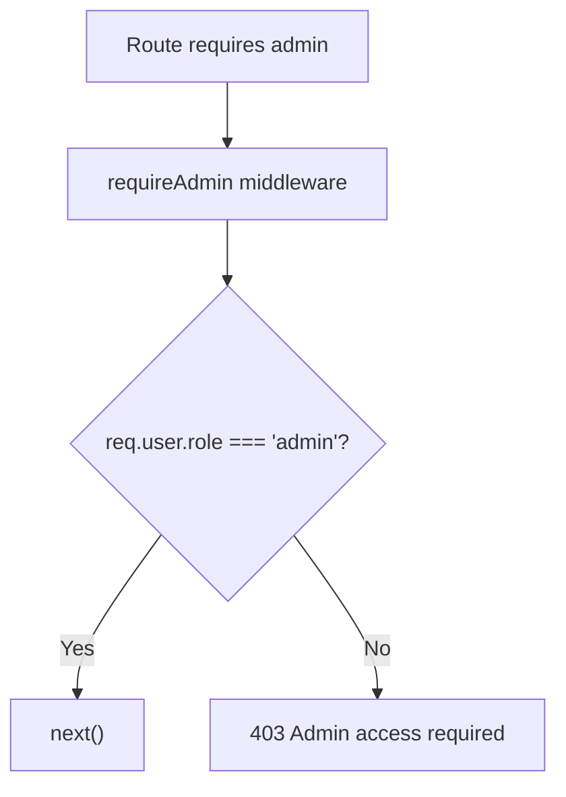

**Diagram sources**
- [auth.ts](file://server/src/middleware/auth.ts#L32-L37)

**Section sources**
- [auth.ts](file://server/src/middleware/auth.ts#L32-L37)

### User Registration Workflow
- Input validation via express-validator enforces username/email/password constraints
- Checks for existing user by email or username
- Creates user with role derived from email matching ADMIN_EMAIL
- Issues JWT and returns user info

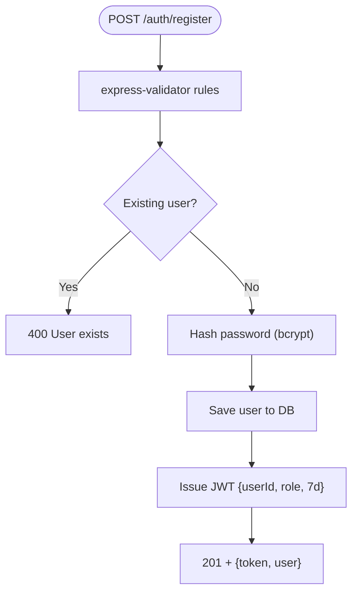

**Diagram sources**
- [authController.ts](file://server/src/controllers/authController.ts#L6-L79)
- [User.ts](file://server/src/models/User.ts#L44-L51)
- [authController.ts](file://server/src/controllers/authController.ts#L43-L56)

**Section sources**
- [authController.ts](file://server/src/controllers/authController.ts#L6-L79)
- [User.ts](file://server/src/models/User.ts#L44-L51)

### User Login Workflow
- Validates inputs, finds user by email with password included
- Compares password using bcrypt
- Issues JWT and returns user info

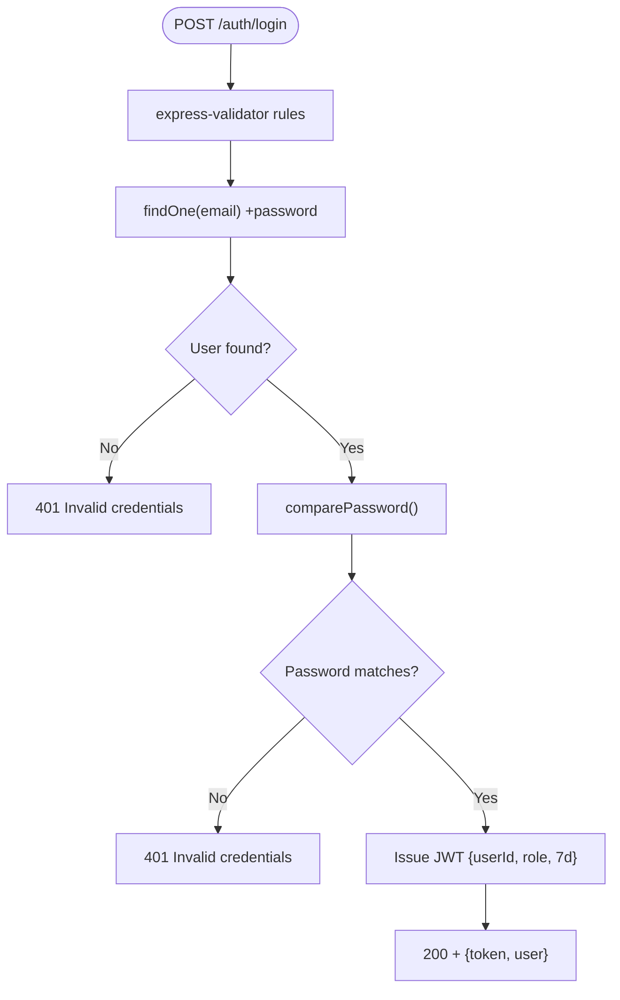

**Diagram sources**
- [authController.ts](file://server/src/controllers/authController.ts#L81-L133)
- [User.ts](file://server/src/models/User.ts#L54-L56)

**Section sources**
- [authController.ts](file://server/src/controllers/authController.ts#L81-L133)
- [User.ts](file://server/src/models/User.ts#L54-L56)

### Password Hashing with Bcrypt
- Pre-save hook hashes the password using bcrypt with a high salt round count
- Provides a method to compare candidate passwords against stored hash

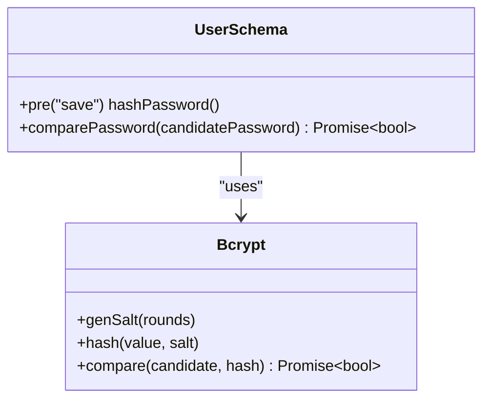

**Diagram sources**
- [User.ts](file://server/src/models/User.ts#L44-L56)

**Section sources**
- [User.ts](file://server/src/models/User.ts#L44-L56)

### Protected Route Implementation and Permission Checking
- Frontend route protection:
  - ProtectedRoute checks authentication state and admin-only requirement
  - Shows a loading state while token validation is in progress
- Backend route protection:
  - authenticateToken middleware validates JWT and attaches user
  - requireAdmin middleware enforces admin-only access

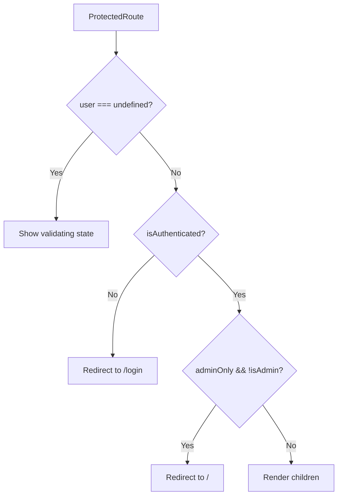

**Diagram sources**
- [RouteProtector.tsx](file://personalSite/src/components/RouteProtector.tsx#L10-L38)
- [auth.ts](file://server/src/middleware/auth.ts#L32-L37)

**Section sources**
- [RouteProtector.tsx](file://personalSite/src/components/RouteProtector.tsx#L1-L41)
- [auth.ts](file://server/src/middleware/auth.ts#L32-L37)

### Session Management
- Frontend stores token and user in localStorage upon successful login/register
- On mount, validates stored token by calling profile endpoint
- Clears stored token/user and redirects on validation failure or explicit logout
- Logout removes token/user from localStorage and navigates to home

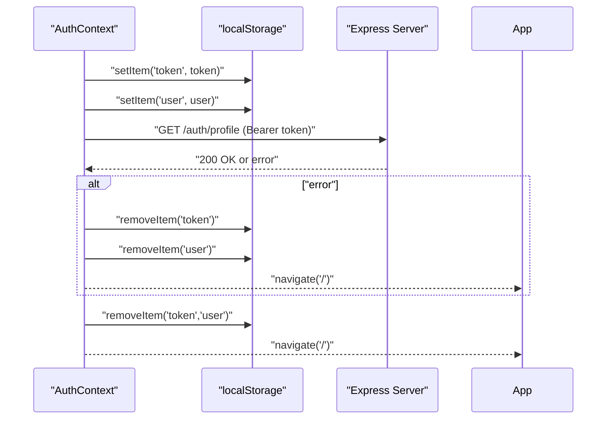

**Diagram sources**
- [AuthContext.tsx](file://personalSite/src/contexts/AuthContext.tsx#L41-L76)
- [AuthContext.tsx](file://personalSite/src/contexts/AuthContext.tsx#L124-L130)
- [auth.ts](file://server/src/routes/auth.ts#L9-L9)

**Section sources**
- [AuthContext.tsx](file://personalSite/src/contexts/AuthContext.tsx#L1-L140)

### Token Payload Contents
- userId: ObjectId of the authenticated user
- role: "admin" or "user"
- expiresIn: 7 days

**Section sources**
- [authController.ts](file://server/src/controllers/authController.ts#L59-L63)
- [authController.ts](file://server/src/controllers/authController.ts#L113-L117)

### Token Expiration Handling
- Tokens expire after 7 days; frontend revalidation on mount helps detect stale sessions
- On backend, verification failures return 403, prompting clients to clear state

**Section sources**
- [authController.ts](file://server/src/controllers/authController.ts#L62-L62)
- [authController.ts](file://server/src/controllers/authController.ts#L116-L116)
- [auth.ts](file://server/src/middleware/auth.ts#L28-L28)

### Logout Mechanisms
- Frontend logout clears token and user from state and localStorage, then navigates to home
- No backend blacklist is implemented; logout is stateless

**Section sources**
- [AuthContext.tsx](file://personalSite/src/contexts/AuthContext.tsx#L124-L130)

### Error Handling for Authentication Failures
- Missing Authorization header: 401
- Invalid/expired token: 403
- Invalid credentials (login): 401
- Validation errors: 400 with structured errors
- Generic server errors: 500

**Section sources**
- [auth.ts](file://server/src/middleware/auth.ts#L14-L29)
- [authController.ts](file://server/src/controllers/authController.ts#L24-L27)
- [authController.ts](file://server/src/controllers/authController.ts#L102-L110)

## Dependency Analysis
External libraries involved in authentication:
- jsonwebtoken: JWT signing and verification
- bcryptjs: Password hashing and comparison
- express-rate-limit: Request throttling
- helmet: Security headers
- express-validator: Input validation

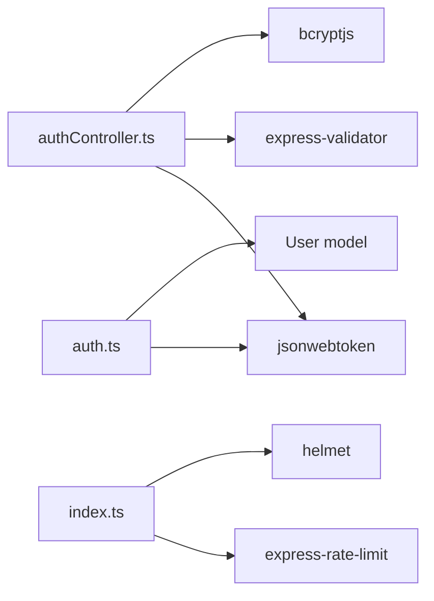

**Diagram sources**
- [authController.ts](file://server/src/controllers/authController.ts#L1-L4)
- [auth.ts](file://server/src/middleware/auth.ts#L1-L3)
- [User.ts](file://server/src/models/User.ts#L1-L2)
- [index.ts](file://server/src/index.ts#L5-L35)
- [package.json](file://server/package.json#L12-L27)

**Section sources**
- [package.json](file://server/package.json#L12-L27)
- [authController.ts](file://server/src/controllers/authController.ts#L1-L4)
- [auth.ts](file://server/src/middleware/auth.ts#L1-L3)
- [User.ts](file://server/src/models/User.ts#L1-L2)
- [index.ts](file://server/src/index.ts#L5-L35)

## Performance Considerations
- JWT verification is CPU-bound but lightweight; avoid excessive token issuance
- bcrypt cost is high; ensure it remains appropriate for deployment environment
- Rate limiting prevents abuse; tune limits according to traffic patterns
- Consider implementing refresh tokens for long-lived sessions if scaling

## Security Measures
- JWT Secret: Must be strong and rotated; configured via environment variable
- CORS: Strict origin validation with configurable origins per environment
- Rate Limiting: IP-based throttling to mitigate brute force attacks
- Helmet: Security headers enabled at server startup
- Input Validation: Express-validator rules applied to registration/login
- Password Storage: bcrypt hashing with high salt rounds
- Admin Assignment: Role determined by email comparison against ADMIN_EMAIL

Additional recommended mitigations (not currently implemented):
- CSRF Protection: Add SameSite cookies and CSRF tokens for state-changing requests
- Refresh Token Rotation: Issue short-lived access tokens and long-lived refresh tokens
- Token Blacklisting: Maintain revoked tokens in Redis/Mongo for immediate revocation
- Multi-Factor Authentication: Optional second factor for admin accounts
- Audit Logs: Track login attempts and admin actions

**Section sources**
- [.env.example](file://server/.env.example#L4-L20)
- [index.ts](file://server/src/index.ts#L34-L93)
- [authController.ts](file://server/src/controllers/authController.ts#L43-L56)

## Troubleshooting Guide
Common issues and resolutions:
- 401 Missing Token: Ensure Authorization header is sent with "Bearer <token>"
- 401 Invalid Credentials: Verify email and password; check ADMIN_EMAIL for admin role assignment
- 403 Invalid or Expired Token: Re-authenticate; tokens expire after 7 days
- 400 Validation Errors: Fix input according to validation messages
- CORS Errors: Confirm FRONTEND_URL or CORS_ORIGINS configuration matches client origin
- Rate Limited: Wait for the window to reset or adjust limits for legitimate traffic

**Section sources**
- [auth.ts](file://server/src/middleware/auth.ts#L14-L29)
- [authController.ts](file://server/src/controllers/authController.ts#L24-L27)
- [index.ts](file://server/src/index.ts#L68-L93)

## Conclusion
The system provides a robust JWT-based authentication flow with bcrypt-powered password security, input validation, and RBAC enforcement. Frontend state management complements backend protections through token persistence and revalidation. While several security enhancements are recommended for production hardening, the current implementation establishes a solid foundation for secure user authentication and access control.