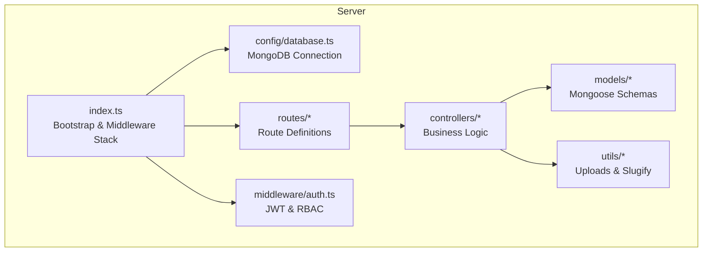
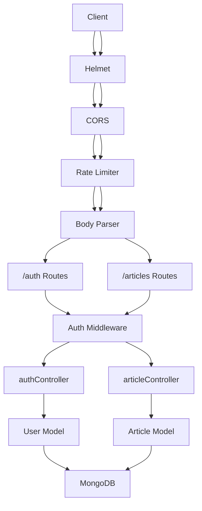
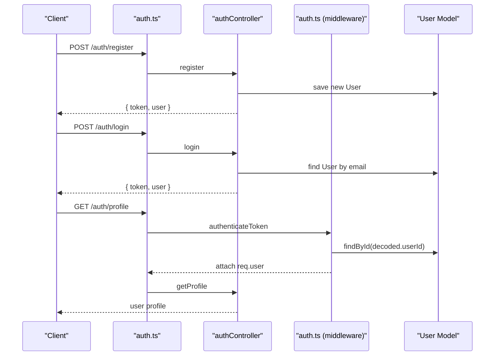
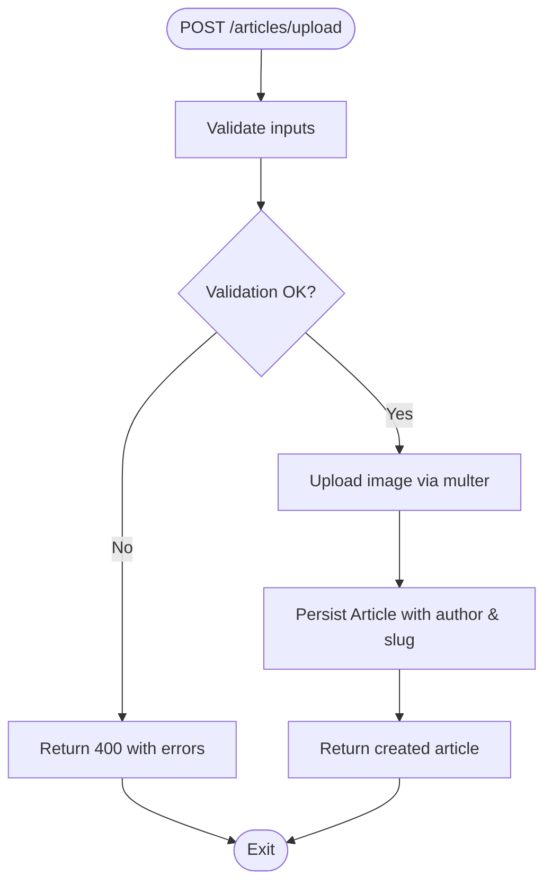
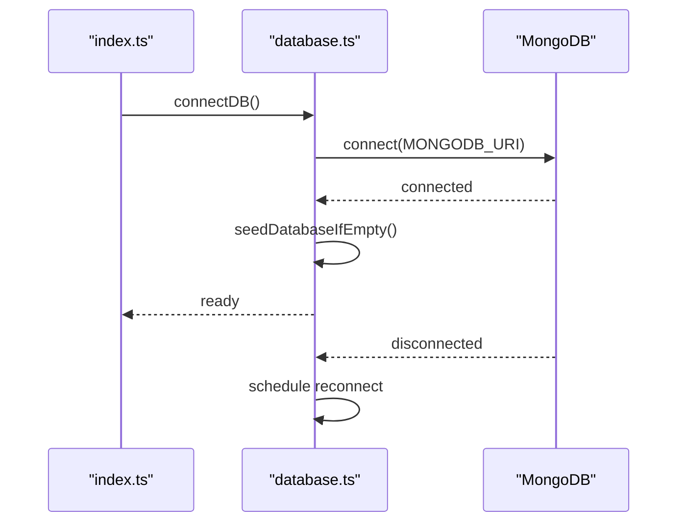
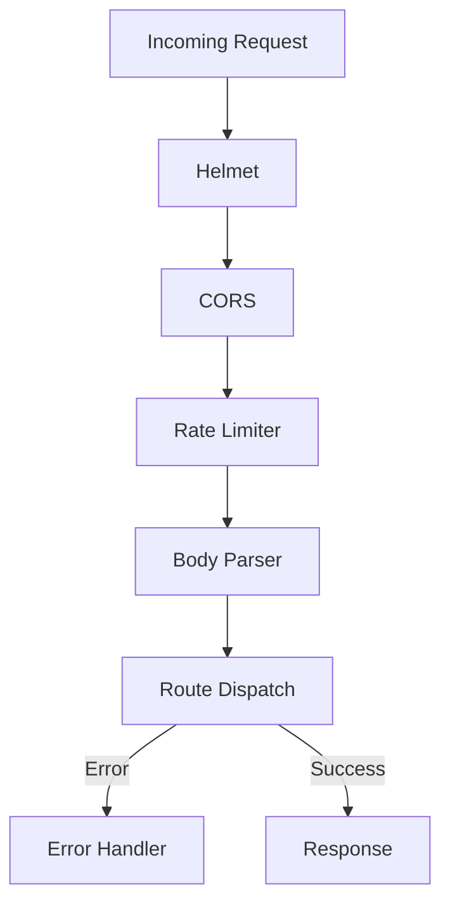
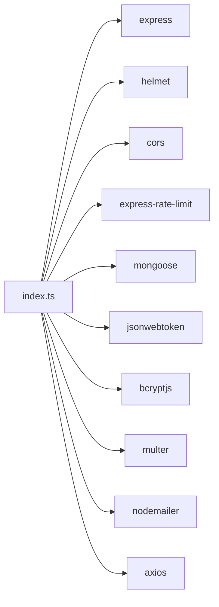

# Backend API Architecture

<cite>
**Referenced Files in This Document**
- [index.ts](file://server/src/index.ts)
- [package.json](file://server/package.json)
- [database.ts](file://server/src/config/database.ts)
- [auth.ts](file://server/src/middleware/auth.ts)
- [authController.ts](file://server/src/controllers/authController.ts)
- [User.ts](file://server/src/models/User.ts)
- [auth.ts](file://server/src/routes/auth.ts)
- [articleController.ts](file://server/src/controllers/articleController.ts)
- [Article.ts](file://server/src/models/Article.ts)
- [articles.ts](file://server/src/routes/articles.ts)
- [.env.example](file://server/.env.example)
- [slugify.ts](file://server/src/utils/slugify.ts)
- [imageUploadHandler.ts](file://server/src/utils/imageUploadHandler.ts)
- [seedController.ts](file://server/src/controllers/seedController.ts)
</cite>

## Table of Contents
1. [Introduction](#introduction)
2. [Project Structure](#project-structure)
3. [Core Components](#core-components)
4. [Architecture Overview](#architecture-overview)
5. [Detailed Component Analysis](#detailed-component-analysis)
6. [Dependency Analysis](#dependency-analysis)
7. [Performance Considerations](#performance-considerations)
8. [Troubleshooting Guide](#troubleshooting-guide)
9. [Conclusion](#conclusion)
10. [Appendices](#appendices)

## Introduction
This document describes the backend API system for a personal portfolio platform built with Node.js and Express.js. It explains the application’s architecture, middleware stack, routing organization, controller-layer design, data access patterns, and error handling strategies. It also covers authentication and authorization using JWT tokens, role-based access control, database connectivity with MongoDB/Mongoose, environment-specific configuration, API endpoint organization, and security measures such as rate limiting and CORS.

## Project Structure
The backend is organized around an Express application with TypeScript. The server directory contains:
- Config: database connection and initialization
- Controllers: request handlers implementing business logic
- Middleware: authentication and authorization utilities
- Models: Mongoose schemas and data access definitions
- Routes: route definitions delegating to controllers
- Utils: shared utilities for uploads and slug generation
- Root: application bootstrap and middleware stack

**Diagram sources**
- [index.ts](file://server/src/index.ts#L1-L158)
- [database.ts](file://server/src/config/database.ts#L1-L61)
- [auth.ts](file://server/src/middleware/auth.ts#L1-L37)

**Section sources**
- [index.ts](file://server/src/index.ts#L1-L158)
- [package.json](file://server/package.json#L1-L40)

## Core Components
- Application bootstrap and middleware stack: initializes Express, loads environment variables, sets trust proxy, configures Helmet, CORS, rate limiting, body parsing, and registers routes.
- Authentication middleware: validates JWT tokens and enforces admin-only access where required.
- Controllers: implement CRUD and business logic for resources such as articles and authentication.
- Models: define Mongoose schemas for domain entities (e.g., User, Article).
- Routes: organize endpoints under resource-based paths and apply middleware.
- Utilities: handle image uploads and slug generation.

**Section sources**
- [index.ts](file://server/src/index.ts#L1-L158)
- [auth.ts](file://server/src/middleware/auth.ts#L1-L37)
- [authController.ts](file://server/src/controllers/authController.ts#L1-L142)
- [User.ts](file://server/src/models/User.ts#L1-L58)
- [articleController.ts](file://server/src/controllers/articleController.ts#L1-L453)
- [Article.ts](file://server/src/models/Article.ts#L1-L64)
- [articles.ts](file://server/src/routes/articles.ts#L1-L54)
- [slugify.ts](file://server/src/utils/slugify.ts#L1-L33)
- [imageUploadHandler.ts](file://server/src/utils/imageUploadHandler.ts#L1-L199)

## Architecture Overview
The system follows a layered architecture aligned with MVC principles:
- Model: Mongoose ODM models encapsulate data structures and validation.
- View: Not applicable in this API-only backend.
- Controller: Route handlers orchestrate request processing, validation, persistence, and response formatting.
- Middleware: Security, CORS, rate limiting, and authentication sit before controllers.
- Routing: Resource-based routes delegate to controllers.

**Diagram sources**
- [index.ts](file://server/src/index.ts#L34-L116)
- [auth.ts](file://server/src/middleware/auth.ts#L1-L37)
- [auth.ts](file://server/src/routes/auth.ts#L1-L11)
- [articles.ts](file://server/src/routes/articles.ts#L1-L54)
- [authController.ts](file://server/src/controllers/authController.ts#L1-L142)
- [articleController.ts](file://server/src/controllers/articleController.ts#L1-L453)
- [User.ts](file://server/src/models/User.ts#L1-L58)
- [Article.ts](file://server/src/models/Article.ts#L1-L64)

## Detailed Component Analysis

### Authentication and Authorization
- JWT-based authentication: Tokens are verified against a secret and attached to requests via an “Authorization” header. On success, the user document is attached to the request for downstream controllers.
- Role-based access control: An admin guard checks the user’s role and restricts access to administrative endpoints.

**Diagram sources**
- [auth.ts](file://server/src/routes/auth.ts#L1-L11)
- [authController.ts](file://server/src/controllers/authController.ts#L1-L142)
- [auth.ts](file://server/src/middleware/auth.ts#L1-L37)
- [User.ts](file://server/src/models/User.ts#L1-L58)

**Section sources**
- [auth.ts](file://server/src/middleware/auth.ts#L1-L37)
- [authController.ts](file://server/src/controllers/authController.ts#L1-L142)
- [User.ts](file://server/src/models/User.ts#L1-L58)
- [auth.ts](file://server/src/routes/auth.ts#L1-L11)

### Content Management Controller (Articles)
- Endpoint organization:
  - Public: list published articles, fetch by ID.
  - Admin-only: list all articles (with filters), create/update/delete.
  - Image-enabled endpoints: create/update with featured image upload.
- Validation: express-validator validates inputs; controllers parse tags and generate slugs.
- Persistence: Mongoose models manage queries and indexing for search and sorting.
- Image handling: multer streams images to controllers; a helper uploads to storage and returns URLs.

**Diagram sources**
- [articles.ts](file://server/src/routes/articles.ts#L1-L54)
- [articleController.ts](file://server/src/controllers/articleController.ts#L90-L194)
- [imageUploadHandler.ts](file://server/src/utils/imageUploadHandler.ts#L7-L45)

**Section sources**
- [articles.ts](file://server/src/routes/articles.ts#L1-L54)
- [articleController.ts](file://server/src/controllers/articleController.ts#L1-L453)
- [Article.ts](file://server/src/models/Article.ts#L1-L64)
- [slugify.ts](file://server/src/utils/slugify.ts#L1-L33)
- [imageUploadHandler.ts](file://server/src/utils/imageUploadHandler.ts#L1-L199)

### Database Connectivity and Seeding
- Connection: Mongoose connects with pool sizing and timeouts; maintains a global connection flag and reconnects on disconnect.
- Seeding: On initial connection, default data is inserted for timeline, interests, tech skills, and tech stack categories if collections are empty.

**Diagram sources**
- [index.ts](file://server/src/index.ts#L28-L32)
- [database.ts](file://server/src/config/database.ts#L6-L56)
- [seedController.ts](file://server/src/controllers/seedController.ts#L108-L134)

**Section sources**
- [database.ts](file://server/src/config/database.ts#L1-L61)
- [seedController.ts](file://server/src/controllers/seedController.ts#L1-L144)
- [index.ts](file://server/src/index.ts#L28-L32)

### Middleware Stack and Security
- Helmet: Adds security headers.
- CORS: Dynamically determines allowed origins based on environment variables and defaults.
- Rate limiting: IP-based throttling to mitigate abuse.
- Body parsing: JSON and URL-encoded payloads with size limits.
- Error handling: Centralized middleware logs stack traces and returns structured error responses.

**Diagram sources**
- [index.ts](file://server/src/index.ts#L34-L140)

**Section sources**
- [index.ts](file://server/src/index.ts#L34-L140)

### Environment Configuration
- Variables include database URI, JWT secret, port, frontend URLs, GitHub integration settings, admin email, and email delivery credentials.
- CORS origin determination considers production vs development and environment-specific overrides.

**Section sources**
- [.env.example](file://server/.env.example#L1-L27)
- [index.ts](file://server/src/index.ts#L38-L83)

## Dependency Analysis
Key runtime dependencies include Express, Helmet, CORS, rate limiting, Mongoose, JWT, Bcrypt, Multer, Nodemailer, and Axios. Build-time dependencies include TypeScript and dev tooling.

**Diagram sources**
- [package.json](file://server/package.json#L12-L27)
- [index.ts](file://server/src/index.ts#L1-L6)

**Section sources**
- [package.json](file://server/package.json#L1-L40)

## Performance Considerations
- Database pooling: Mongoose configured with a max pool size suitable for concurrent operations.
- Connection resilience: Automatic reconnection on disconnect with exponential backoff behavior.
- Payload limits: Body parsers enforce size limits to prevent memory exhaustion.
- Indexing: Article schema includes text and compound indexes to optimize search and sort operations.
- Image uploads: Multer stores files in memory with size limits; consider external storage for production scalability.

[No sources needed since this section provides general guidance]

## Troubleshooting Guide
- Database connectivity failures: The application logs connection errors and retries automatically. Verify MONGODB_URI and network access.
- CORS errors: Confirm allowed origins and environment variables. Check console logs for blocked origins.
- JWT validation failures: Ensure JWT_SECRET matches server configuration and tokens are not expired.
- Rate limit exceeded: Reduce client-side polling frequency or adjust rate limiter configuration.
- Image upload errors: Validate file types and sizes; confirm upload handler integration.

**Section sources**
- [database.ts](file://server/src/config/database.ts#L46-L56)
- [index.ts](file://server/src/index.ts#L38-L83)
- [auth.ts](file://server/src/middleware/auth.ts#L18-L29)
- [index.ts](file://server/src/index.ts#L88-L93)
- [imageUploadHandler.ts](file://server/src/utils/imageUploadHandler.ts#L7-L45)

## Conclusion
The backend API employs a clean, layered architecture with Express and Mongoose. It integrates robust security middleware, environment-aware CORS, JWT-based authentication, and role-based access control. Controllers encapsulate business logic, routes organize endpoints by resource, and utilities support image handling and slug generation. Database connectivity is resilient with automatic reconnection and seeding. The system is designed for maintainability and extensibility while enforcing performance and security best practices.

[No sources needed since this section summarizes without analyzing specific files]

## Appendices

### API Versioning
- No explicit API versioning is implemented in the current routes. Consider prefixing routes with a version segment (e.g., /api/v1) for future-proofing.

[No sources needed since this section provides general guidance]

### Additional Security Measures
- Consider adding input sanitization, request ID logging, and audit trails for sensitive operations.
- Enforce HTTPS in production and secure cookie policies for session-based flows if adopted.

[No sources needed since this section provides general guidance]