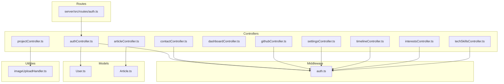
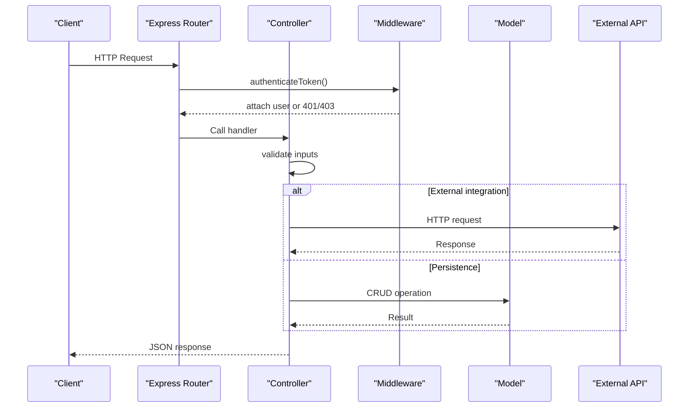
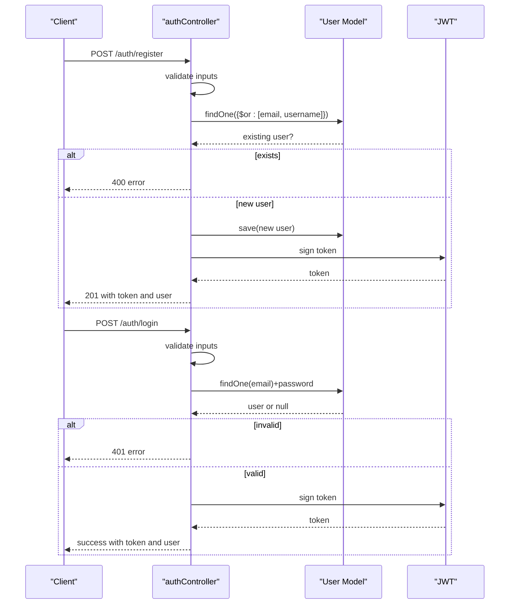
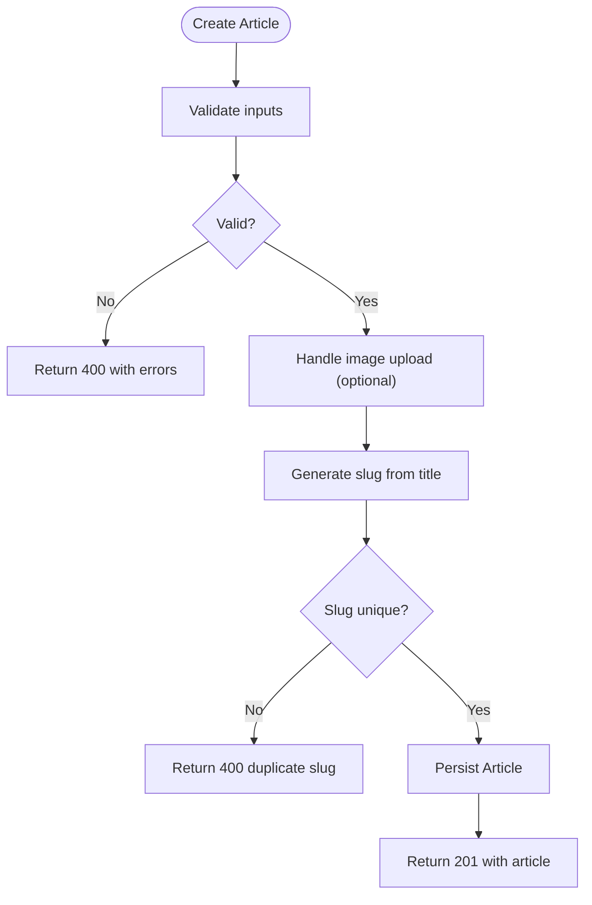
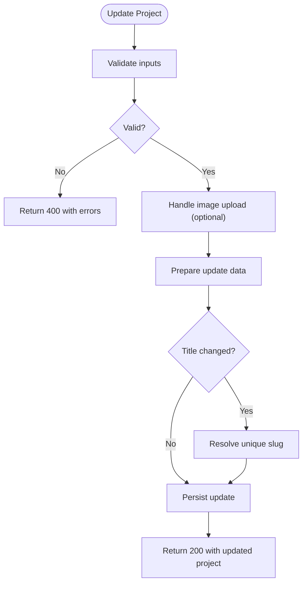
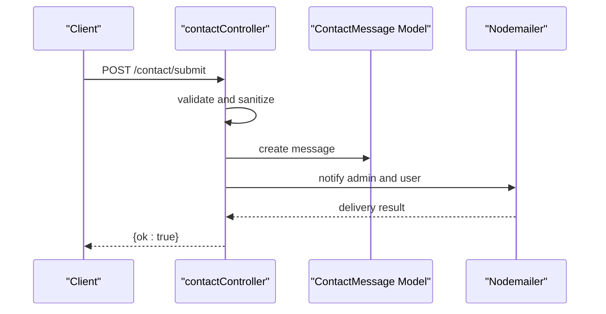
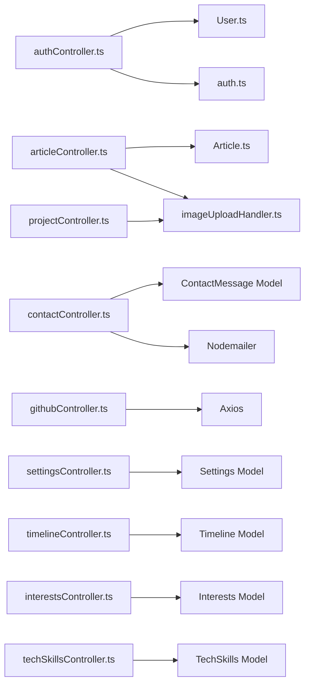

# Controller Layer

<cite>
**Referenced Files in This Document**
- [authController.ts](file://server/src/controllers/authController.ts)
- [articleController.ts](file://server/src/controllers/articleController.ts)
- [projectController.ts](file://server/src/controllers/projectController.ts)
- [contactController.ts](file://server/src/controllers/contactController.ts)
- [dashboardController.ts](file://server/src/controllers/dashboardController.ts)
- [githubController.ts](file://server/src/controllers/githubController.ts)
- [settingsController.ts](file://server/src/controllers/settingsController.ts)
- [timelineController.ts](file://server/src/controllers/timelineController.ts)
- [interestsController.ts](file://server/src/controllers/interestsController.ts)
- [techSkillsController.ts](file://server/src/controllers/techSkillsController.ts)
- [auth.ts](file://server/src/middleware/auth.ts)
- [User.ts](file://server/src/models/User.ts)
- [Article.ts](file://server/src/models/Article.ts)
- [imageUploadHandler.ts](file://server/src/utils/imageUploadHandler.ts)
- [auth route](file://server/src/routes/auth.ts)
</cite>

## Table of Contents
1. [Introduction](#introduction)
2. [Project Structure](#project-structure)
3. [Core Components](#core-components)
4. [Architecture Overview](#architecture-overview)
5. [Detailed Component Analysis](#detailed-component-analysis)
6. [Dependency Analysis](#dependency-analysis)
7. [Performance Considerations](#performance-considerations)
8. [Troubleshooting Guide](#troubleshooting-guide)
9. [Conclusion](#conclusion)

## Introduction
This document explains the controller layer implementation following the repository pattern in the server-side codebase. Controllers are responsible for handling HTTP requests, validating inputs, orchestrating model operations, and formatting responses. They integrate with middleware for authentication and authorization, leverage models for persistence, and coordinate with external services for integrations such as GitHub. The documentation covers responsibilities, error handling, validation logic, response formatting, and practical examples for CRUD, custom queries, and batch-like operations. It also outlines middleware integration, request preprocessing, response postprocessing, and testing strategies.

## Project Structure
The server-side controllers reside under server/src/controllers and are grouped by domain resources (authentication, articles, projects, contact, dashboard, GitHub, settings, timeline, interests, tech skills). Each controller exports functions that serve as Express route handlers. Middleware for authentication and authorization is located under server/src/middleware. Domain models are under server/src/models, and shared utilities (e.g., image upload helpers) are under server/src/utils. Routes are defined under server/src/routes and wire controllers to endpoints.

**Diagram sources**
- [auth route](file://server/src/routes/auth.ts#L1-L11)
- [authController.ts](file://server/src/controllers/authController.ts#L1-L142)
- [articleController.ts](file://server/src/controllers/articleController.ts#L1-L453)
- [projectController.ts](file://server/src/controllers/projectController.ts#L1-L926)
- [contactController.ts](file://server/src/controllers/contactController.ts#L1-L438)
- [dashboardController.ts](file://server/src/controllers/dashboardController.ts#L1-L147)
- [githubController.ts](file://server/src/controllers/githubController.ts#L1-L177)
- [settingsController.ts](file://server/src/controllers/settingsController.ts#L1-L119)
- [timelineController.ts](file://server/src/controllers/timelineController.ts#L1-L88)
- [interestsController.ts](file://server/src/controllers/interestsController.ts#L1-L85)
- [techSkillsController.ts](file://server/src/controllers/techSkillsController.ts#L1-L86)
- [auth.ts](file://server/src/middleware/auth.ts#L1-L37)
- [User.ts](file://server/src/models/User.ts#L1-L58)
- [Article.ts](file://server/src/models/Article.ts#L1-L64)
- [imageUploadHandler.ts](file://server/src/utils/imageUploadHandler.ts#L1-L199)

**Section sources**
- [auth route](file://server/src/routes/auth.ts#L1-L11)

## Core Components
- Authentication controller: Handles registration, login, and profile retrieval with JWT-based authentication and password hashing.
- Content controllers: Articles and Projects manage CRUD operations with rich validation, image upload coordination, and search/filtering.
- Contact controller: Manages contact submissions, sanitization, persistence, and email notifications to admin and user.
- Dashboard controller: Aggregates statistics and analytics across content types.
- GitHub controller: Integrates with the GitHub API to fetch repositories and repository details.
- Settings controller: Manages site-wide settings with validation and defaults.
- Auxiliary controllers: Timeline, Interests, Tech Skills manage simple CRUD operations for structured lists.

Responsibilities:
- Input validation via express-validator.
- Business logic orchestration (e.g., slug generation, image upload, email dispatch).
- Error handling with appropriate HTTP status codes and structured error payloads.
- Response formatting aligned with client expectations.

**Section sources**
- [authController.ts](file://server/src/controllers/authController.ts#L1-L142)
- [articleController.ts](file://server/src/controllers/articleController.ts#L1-L453)
- [projectController.ts](file://server/src/controllers/projectController.ts#L1-L926)
- [contactController.ts](file://server/src/controllers/contactController.ts#L1-L438)
- [dashboardController.ts](file://server/src/controllers/dashboardController.ts#L1-L147)
- [githubController.ts](file://server/src/controllers/githubController.ts#L1-L177)
- [settingsController.ts](file://server/src/controllers/settingsController.ts#L1-L119)
- [timelineController.ts](file://server/src/controllers/timelineController.ts#L1-L88)
- [interestsController.ts](file://server/src/controllers/interestsController.ts#L1-L85)
- [techSkillsController.ts](file://server/src/controllers/techSkillsController.ts#L1-L86)

## Architecture Overview
Controllers act as the boundary between HTTP requests and domain logic. They rely on:
- Models for persistence and schema enforcement.
- Middleware for authentication and authorization checks.
- Utilities for cross-cutting concerns like image uploads.
- External APIs for integrations (e.g., GitHub).

**Diagram sources**
- [auth route](file://server/src/routes/auth.ts#L1-L11)
- [auth.ts](file://server/src/middleware/auth.ts#L1-L37)
- [authController.ts](file://server/src/controllers/authController.ts#L1-L142)
- [articleController.ts](file://server/src/controllers/articleController.ts#L1-L453)
- [projectController.ts](file://server/src/controllers/projectController.ts#L1-L926)
- [contactController.ts](file://server/src/controllers/contactController.ts#L1-L438)
- [githubController.ts](file://server/src/controllers/githubController.ts#L1-L177)

## Detailed Component Analysis

### Authentication Controller
Responsibilities:
- Validate registration inputs (username, email, password).
- Prevent duplicate accounts by checking email/username.
- Hash passwords and assign roles based on environment configuration.
- Generate JWT tokens and return user profile.
- Validate login credentials and issue tokens.
- Retrieve authenticated user profile.

Key methods:
- Registration: [register](file://server/src/controllers/authController.ts#L6-L79)
- Login: [login](file://server/src/controllers/authController.ts#L81-L133)
- Profile: [getProfile](file://server/src/controllers/authController.ts#L135-L142)

Validation and error handling:
- Uses express-validator for request validation.
- Returns structured errors for validation failures and server errors.
- Passwords are hashed via model pre-save hook.

Integration:
- Depends on User model and JWT secret from environment.
- Middleware authenticateToken attaches user to request for protected routes.

**Diagram sources**
- [authController.ts](file://server/src/controllers/authController.ts#L1-L142)
- [User.ts](file://server/src/models/User.ts#L1-L58)

**Section sources**
- [authController.ts](file://server/src/controllers/authController.ts#L1-L142)
- [auth route](file://server/src/routes/auth.ts#L1-L11)
- [auth.ts](file://server/src/middleware/auth.ts#L1-L37)
- [User.ts](file://server/src/models/User.ts#L1-L58)

### Articles Controller
Responsibilities:
- Fetch published/all articles with pagination, search, and filtering.
- CRUD operations with rich validation for title, content, status, tags, and optional featured image.
- Slug generation and uniqueness checks.
- Image upload coordination via helper utilities.

Key methods:
- Published articles: [getPublishedArticles](file://server/src/controllers/articleController.ts#L6-L39)
- All articles: [getAllArticles](file://server/src/controllers/articleController.ts#L41-L73)
- Single article: [getArticleById](file://server/src/controllers/articleController.ts#L75-L88)
- Create with image: [createArticleWithImage](file://server/src/controllers/articleController.ts#L90-L194)
- Create without image: [createArticle](file://server/src/controllers/articleController.ts#L196-L259)
- Update with image: [updateArticleWithImage](file://server/src/controllers/articleController.ts#L261-L371)
- Update without image: [updateArticle](file://server/src/controllers/articleController.ts#L373-L438)
- Delete: [deleteArticle](file://server/src/controllers/articleController.ts#L441-L453)

Validation logic:
- Title/content length constraints.
- Status enum validation.
- Tags validation supporting array or string formats.
- Optional image upload handling.

Response formatting:
- Pagination metadata (totalPages, currentPage, total).
- Populated author fields for richer responses.

**Diagram sources**
- [articleController.ts](file://server/src/controllers/articleController.ts#L90-L194)
- [imageUploadHandler.ts](file://server/src/utils/imageUploadHandler.ts#L1-L199)

**Section sources**
- [articleController.ts](file://server/src/controllers/articleController.ts#L1-L453)
- [Article.ts](file://server/src/models/Article.ts#L1-L64)
- [imageUploadHandler.ts](file://server/src/utils/imageUploadHandler.ts#L1-L199)

### Projects Controller
Responsibilities:
- Fetch published/all projects with search, status, and featured filters.
- CRUD operations with robust validation for title, description, tags, languages, URLs, and status.
- Unique slug resolution with exclusion for updates.
- Image upload coordination for thumbnail and screenshots.

Key methods:
- Published projects: [getPublishedProjects](file://server/src/controllers/projectController.ts#L25-L72)
- All projects: [getAllProjects](file://server/src/controllers/projectController.ts#L74-L125)
- Single project: [getProjectById](file://server/src/controllers/projectController.ts#L127-L146)
- Create with image: [createProjectWithImage](file://server/src/controllers/projectController.ts#L148-L329)
- Create without image: [createProject](file://server/src/controllers/projectController.ts#L331-L482)
- Update with image: [updateProjectWithImage](file://server/src/controllers/projectController.ts#L484-L688)
- Update without image: [updateProject](file://server/src/controllers/projectController.ts#L690-L860)
- Delete: [deleteProject](file://server/src/controllers/projectController.ts#L861-L926)

Validation logic:
- Tags and languages support arrays or comma-separated strings.
- URL validation for GitHub/live URLs.
- Featured and status booleans/enums.

Slug handling:
- Unique slug generation with optional exclusion of current ID during updates.

**Diagram sources**
- [projectController.ts](file://server/src/controllers/projectController.ts#L484-L688)
- [imageUploadHandler.ts](file://server/src/utils/imageUploadHandler.ts#L1-L199)

**Section sources**
- [projectController.ts](file://server/src/controllers/projectController.ts#L1-L926)
- [imageUploadHandler.ts](file://server/src/utils/imageUploadHandler.ts#L1-L199)

### Contact Controller
Responsibilities:
- Submit contact messages with strict sanitization and validation.
- Persist messages with IP and user agent.
- Send emails to admin and user asynchronously.
- Manage message status and replies with sanitization and HTML escaping.

Key methods:
- Submit message: [submitContactMessage](file://server/src/controllers/contactController.ts#L232-L315)
- List messages: [getContactMessages](file://server/src/controllers/contactController.ts#L317-L329)
- Update status: [updateContactMessageStatus](file://server/src/controllers/contactController.ts#L331-L362)
- Reply to message: [replyToContactMessage](file://server/src/controllers/contactController.ts#L364-L437)

Validation and sanitization:
- Length limits and HTML-safe sanitization for all inputs.
- Captcha bypass validation via hidden company field.

Email integration:
- Nodemailer transport caching.
- Parallel admin/user notifications.
- Rich HTML replies with optional inclusion of original message.

**Diagram sources**
- [contactController.ts](file://server/src/controllers/contactController.ts#L232-L315)

**Section sources**
- [contactController.ts](file://server/src/controllers/contactController.ts#L1-L438)

### Dashboard Controller
Responsibilities:
- Aggregate counts for articles, projects, and users.
- Recent activity feed combining articles and projects.
- Analytics data (monthly metrics, top content).

Key methods:
- Stats: [getDashboardStats](file://server/src/controllers/dashboardController.ts#L6-L103)
- Analytics: [getAnalytics](file://server/src/controllers/dashboardController.ts#L106-L147)

Processing logic:
- Parallel counts for improved responsiveness.
- Combined recent activity sorted by recency.
- Mock analytics data placeholders for future integration.

**Section sources**
- [dashboardController.ts](file://server/src/controllers/dashboardController.ts#L1-L147)

### GitHub Controller
Responsibilities:
- Fetch GitHub repositories for a user with sorting and pagination.
- Retrieve repository details including languages and top contributors.
- Respect rate limits and token availability.

Key methods:
- Repositories: [getGithubRepos](file://server/src/controllers/githubController.ts#L4-L100)
- Repo details: [getRepoDetails](file://server/src/controllers/githubController.ts#L102-L177)

Processing logic:
- Conditional filtering for private repos without token.
- Fallback language extraction when API calls fail.
- Comprehensive error mapping for 404/403 scenarios.

**Section sources**
- [githubController.ts](file://server/src/controllers/githubController.ts#L1-L177)

### Settings Controller
Responsibilities:
- Retrieve and initialize default settings if missing.
- Update settings with deep validation for nested fields.

Key methods:
- Get settings: [getSettings](file://server/src/controllers/settingsController.ts#L5-L19)
- Update settings: [updateSettings](file://server/src/controllers/settingsController.ts#L21-L119)

Processing logic:
- Validation for nested keys (themeOptions, siteSections, socialLinks).
- Upsert behavior to create defaults if none exist.

**Section sources**
- [settingsController.ts](file://server/src/controllers/settingsController.ts#L1-L119)

### Auxiliary Controllers (Timeline, Interests, Tech Skills)
Responsibilities:
- Manage simple CRUD operations for structured lists (timeline items, interests, tech skills).
- Enforce ordering and presence of required fields.

Key methods:
- Timeline: [getAllTimelineItems](file://server/src/controllers/timelineController.ts#L4-L12), [getTimelineItemById](file://server/src/controllers/timelineController.ts#L14-L28), [createTimelineItem](file://server/src/controllers/timelineController.ts#L30-L49), [updateTimelineItem](file://server/src/controllers/timelineController.ts#L51-L71), [deleteTimelineItem](file://server/src/controllers/timelineController.ts#L73-L88)
- Interests: [getAllInterests](file://server/src/controllers/interestsController.ts#L4-L12), [getInterestById](file://server/src/controllers/interestsController.ts#L14-L28), [createInterest](file://server/src/controllers/interestsController.ts#L30-L46), [updateInterest](file://server/src/controllers/interestsController.ts#L48-L68), [deleteInterest](file://server/src/controllers/interestsController.ts#L70-L85)
- Tech Skills: [getAllTechSkills](file://server/src/controllers/techSkillsController.ts#L4-L12), [getTechSkillById](file://server/src/controllers/techSkillsController.ts#L14-L28), [createTechSkill](file://server/src/controllers/techSkillsController.ts#L30-L47), [updateTechSkill](file://server/src/controllers/techSkillsController.ts#L49-L69), [deleteTechSkill](file://server/src/controllers/techSkillsController.ts#L71-L86)

**Section sources**
- [timelineController.ts](file://server/src/controllers/timelineController.ts#L1-L88)
- [interestsController.ts](file://server/src/controllers/interestsController.ts#L1-L85)
- [techSkillsController.ts](file://server/src/controllers/techSkillsController.ts#L1-L86)

## Dependency Analysis
Controllers depend on:
- Models for persistence and schema enforcement.
- Middleware for authentication and authorization.
- Utilities for cross-cutting concerns (e.g., image upload).
- External services for integrations.

**Diagram sources**
- [authController.ts](file://server/src/controllers/authController.ts#L1-L142)
- [User.ts](file://server/src/models/User.ts#L1-L58)
- [auth.ts](file://server/src/middleware/auth.ts#L1-L37)
- [articleController.ts](file://server/src/controllers/articleController.ts#L1-L453)
- [Article.ts](file://server/src/models/Article.ts#L1-L64)
- [projectController.ts](file://server/src/controllers/projectController.ts#L1-L926)
- [imageUploadHandler.ts](file://server/src/utils/imageUploadHandler.ts#L1-L199)
- [contactController.ts](file://server/src/controllers/contactController.ts#L1-L438)
- [githubController.ts](file://server/src/controllers/githubController.ts#L1-L177)
- [settingsController.ts](file://server/src/controllers/settingsController.ts#L1-L119)
- [timelineController.ts](file://server/src/controllers/timelineController.ts#L1-L88)
- [interestsController.ts](file://server/src/controllers/interestsController.ts#L1-L85)
- [techSkillsController.ts](file://server/src/controllers/techSkillsController.ts#L1-L86)

**Section sources**
- [authController.ts](file://server/src/controllers/authController.ts#L1-L142)
- [articleController.ts](file://server/src/controllers/articleController.ts#L1-L453)
- [projectController.ts](file://server/src/controllers/projectController.ts#L1-L926)
- [contactController.ts](file://server/src/controllers/contactController.ts#L1-L438)
- [githubController.ts](file://server/src/controllers/githubController.ts#L1-L177)
- [settingsController.ts](file://server/src/controllers/settingsController.ts#L1-L119)
- [timelineController.ts](file://server/src/controllers/timelineController.ts#L1-L88)
- [interestsController.ts](file://server/src/controllers/interestsController.ts#L1-L85)
- [techSkillsController.ts](file://server/src/controllers/techSkillsController.ts#L1-L86)

## Performance Considerations
- Use pagination and limit/skip for list endpoints to avoid large payloads.
- Leverage database indexes (e.g., text index on articles) to optimize search queries.
- Batch operations: Use Promise.all for independent counts/statistics to reduce latency.
- Minimize payload sizes by selecting only required fields (e.g., populate selective fields).
- Cache transporters and environment-dependent configurations where applicable.
- Offload heavy tasks (e.g., image processing, email sending) to asynchronous workers.

[No sources needed since this section provides general guidance]

## Troubleshooting Guide
Common issues and resolutions:
- Authentication failures: Verify token presence, validity, and expiration; ensure JWT secret is set.
- Validation errors: Review express-validator messages and adjust client payloads accordingly.
- Duplicate slugs: Ensure slug generation and uniqueness checks are functioning; test with concurrent requests.
- Image upload failures: Check storage permissions and error messages returned by upload utilities.
- External API errors: Inspect GitHub API responses and rate limits; configure tokens appropriately.
- Email delivery failures: Validate SMTP credentials and transport caching; monitor logs for transient errors.

**Section sources**
- [auth.ts](file://server/src/middleware/auth.ts#L1-L37)
- [authController.ts](file://server/src/controllers/authController.ts#L1-L142)
- [articleController.ts](file://server/src/controllers/articleController.ts#L1-L453)
- [projectController.ts](file://server/src/controllers/projectController.ts#L1-L926)
- [contactController.ts](file://server/src/controllers/contactController.ts#L1-L438)
- [githubController.ts](file://server/src/controllers/githubController.ts#L1-L177)

## Conclusion
The controller layer follows a clear separation of concerns: controllers handle HTTP concerns, validation, and response formatting; models encapsulate persistence and schema; middleware enforces security; utilities centralize cross-cutting logic; and external integrations are isolated. The implementation demonstrates robust validation, error handling, and responsive design patterns suitable for production environments. Adopting the outlined testing strategies and dependency injection patterns will further improve maintainability and reliability.