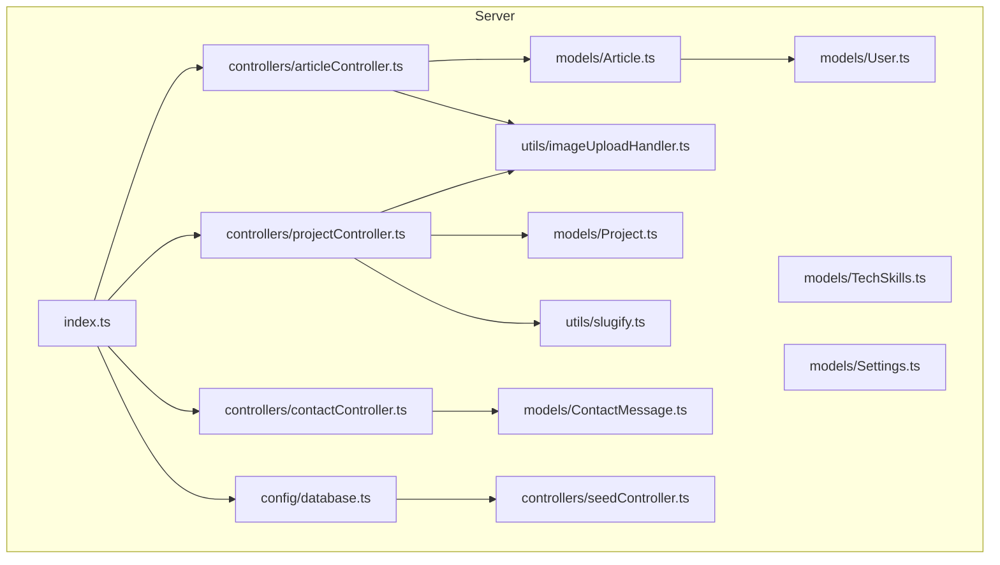
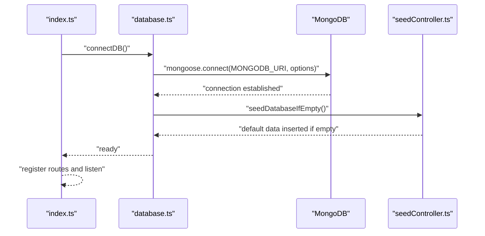
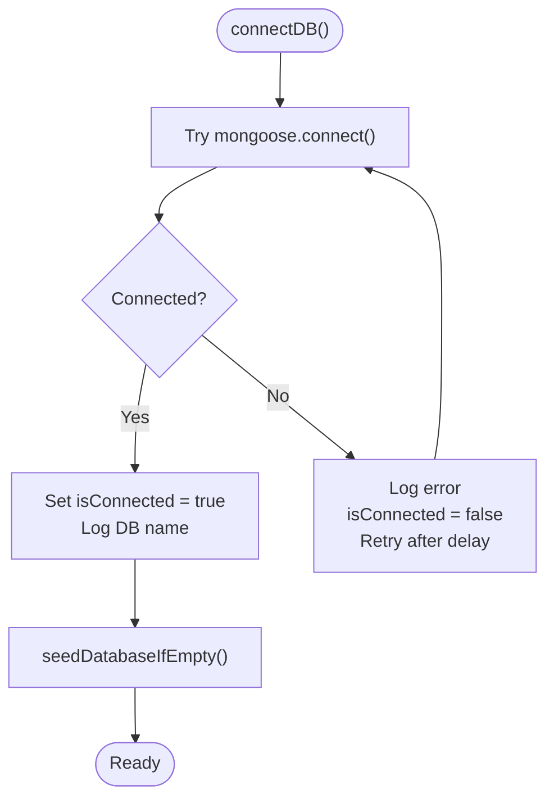
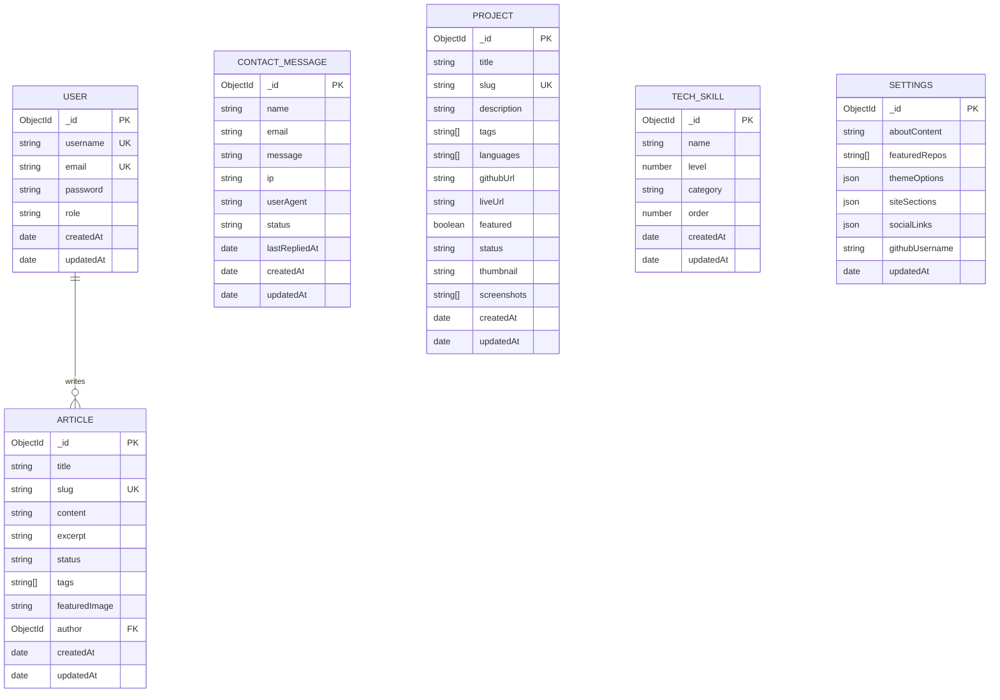
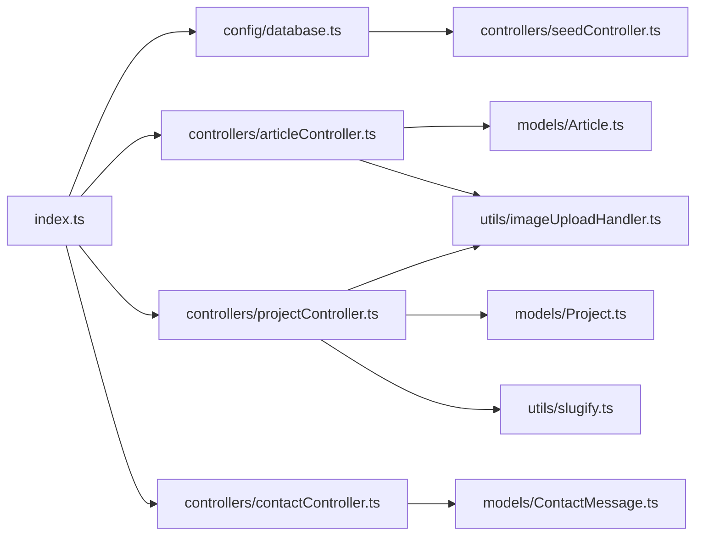

# Database Integration

<cite>
**Referenced Files in This Document**
- [database.ts](file://server/src/config/database.ts)
- [index.ts](file://server/src/index.ts)
- [Article.ts](file://server/src/models/Article.ts)
- [User.ts](file://server/src/models/User.ts)
- [Project.ts](file://server/src/models/Project.ts)
- [ContactMessage.ts](file://server/src/models/ContactMessage.ts)
- [TechSkills.ts](file://server/src/models/TechSkills.ts)
- [Settings.ts](file://server/src/models/Settings.ts)
- [articleController.ts](file://server/src/controllers/articleController.ts)
- [projectController.ts](file://server/src/controllers/projectController.ts)
- [contactController.ts](file://server/src/controllers/contactController.ts)
- [seedController.ts](file://server/src/controllers/seedController.ts)
- [imageUploadHandler.ts](file://server/src/utils/imageUploadHandler.ts)
- [slugify.ts](file://server/src/utils/slugify.ts)
</cite>

## Table of Contents
1. [Introduction](#introduction)
2. [Project Structure](#project-structure)
3. [Core Components](#core-components)
4. [Architecture Overview](#architecture-overview)
5. [Detailed Component Analysis](#detailed-component-analysis)
6. [Dependency Analysis](#dependency-analysis)
7. [Performance Considerations](#performance-considerations)
8. [Troubleshooting Guide](#troubleshooting-guide)
9. [Conclusion](#conclusion)
10. [Appendices](#appendices)

## Introduction
This document explains the MongoDB integration using Mongoose ODM in the backend server. It covers connection management, connection pooling, retry mechanisms, schema design patterns, model definitions, and relationships between collections. It also documents repository-style data access patterns, query optimization, and aggregation pipelines. Practical examples demonstrate common operations (find, insert, update, delete), validation rules, indexing strategies, error handling, graceful degradation, migration strategies, environment-specific configurations, connection limits, and monitoring approaches.

## Project Structure
The database integration is centered around:
- A centralized connection module that initializes Mongoose, sets pool limits, and manages reconnection.
- Strongly typed Mongoose models with validation and indexes.
- Controllers that orchestrate CRUD operations and complex queries.
- Utility modules for image upload and slug generation.
- A seeding controller to initialize default data when collections are empty.

**Diagram sources**
- [index.ts](file://server/src/index.ts#L1-L158)
- [database.ts](file://server/src/config/database.ts#L1-L61)
- [Article.ts](file://server/src/models/Article.ts#L1-L64)
- [User.ts](file://server/src/models/User.ts#L1-L58)
- [Project.ts](file://server/src/models/Project.ts#L1-L97)
- [ContactMessage.ts](file://server/src/models/ContactMessage.ts#L1-L123)
- [TechSkills.ts](file://server/src/models/TechSkills.ts#L1-L41)
- [Settings.ts](file://server/src/models/Settings.ts#L1-L82)
- [articleController.ts](file://server/src/controllers/articleController.ts#L1-L453)
- [projectController.ts](file://server/src/controllers/projectController.ts#L1-L926)
- [contactController.ts](file://server/src/controllers/contactController.ts#L1-L438)
- [imageUploadHandler.ts](file://server/src/utils/imageUploadHandler.ts#L1-L199)
- [slugify.ts](file://server/src/utils/slugify.ts#L1-L33)
- [seedController.ts](file://server/src/controllers/seedController.ts#L1-L144)

**Section sources**
- [index.ts](file://server/src/index.ts#L1-L158)
- [database.ts](file://server/src/config/database.ts#L1-L61)

## Core Components
- Database connection manager: Establishes Mongoose connection with pool sizing and timeout options, tracks connection state, and auto-reconnects on disconnect or failure.
- Models: Define schemas with validation, indexes, and virtual/populate relationships.
- Controllers: Implement CRUD and advanced queries, including pagination, filtering, text search, and population.
- Utilities: Image upload helpers and slug generation for unique identifiers.
- Seeding: Initializes default data when collections are empty.

**Section sources**
- [database.ts](file://server/src/config/database.ts#L1-L61)
- [Article.ts](file://server/src/models/Article.ts#L1-L64)
- [User.ts](file://server/src/models/User.ts#L1-L58)
- [Project.ts](file://server/src/models/Project.ts#L1-L97)
- [ContactMessage.ts](file://server/src/models/ContactMessage.ts#L1-L123)
- [TechSkills.ts](file://server/src/models/TechSkills.ts#L1-L41)
- [Settings.ts](file://server/src/models/Settings.ts#L1-L82)
- [articleController.ts](file://server/src/controllers/articleController.ts#L1-L453)
- [projectController.ts](file://server/src/controllers/projectController.ts#L1-L926)
- [contactController.ts](file://server/src/controllers/contactController.ts#L1-L438)
- [imageUploadHandler.ts](file://server/src/utils/imageUploadHandler.ts#L1-L199)
- [slugify.ts](file://server/src/utils/slugify.ts#L1-L33)
- [seedController.ts](file://server/src/controllers/seedController.ts#L1-L144)

## Architecture Overview
The backend initializes Express, connects to MongoDB via Mongoose, registers routes, and exposes endpoints that operate on Mongoose models. Controllers encapsulate business logic and query orchestration. The connection module centralizes retry and event handling.

**Diagram sources**
- [index.ts](file://server/src/index.ts#L28-L32)
- [database.ts](file://server/src/config/database.ts#L6-L56)
- [seedController.ts](file://server/src/controllers/seedController.ts#L108-L134)

## Detailed Component Analysis

### Database Connection Management
- Connection initialization: Uses Mongoose connect with explicit server selection and socket timeouts, and a max pool size for concurrency control.
- Connection state tracking: A boolean flag indicates whether the connection is active.
- Event-driven reconnection: Listens to error, disconnected, and reconnected events to log and schedule retries.
- Graceful degradation: On initial failure, logs and schedules retry without crashing the process.

**Diagram sources**
- [database.ts](file://server/src/config/database.ts#L6-L56)

**Section sources**
- [database.ts](file://server/src/config/database.ts#L1-L61)
- [index.ts](file://server/src/index.ts#L28-L32)

### Connection Pooling and Limits
- Pool size: Configured to maintain up to 10 socket connections.
- Timeouts: Server selection timeout and socket timeout are set to improve reliability and responsiveness.
- Environment overrides: Connection URI and pool size can be tuned via environment variables.

**Section sources**
- [database.ts](file://server/src/config/database.ts#L14-L18)

### Retry Mechanisms and Auto-Recovery
- Disconnection handling: Resets connection flag and schedules a retry after a delay.
- Reconnection success: Logs successful reconnection and triggers seeding again.
- Startup health check: After server start, logs current database connectivity status.

**Section sources**
- [database.ts](file://server/src/config/database.ts#L27-L44)
- [index.ts](file://server/src/index.ts#L147-L154)

### Schema Design Patterns and Validation
- Strong typing: Interfaces define document shapes and embedded structures.
- Validation:
  - Required fields with custom messages.
  - Length constraints and format checks (regex for emails, URLs).
  - Enumerations for status fields.
  - Pre-save hooks for sensitive data (e.g., password hashing).
- Embedded vs referenced data:
  - Embedded arrays for small, static lists (e.g., tags, languages).
  - References for parent-child relationships (e.g., Article.author -> User).

Examples by file:
- Article: Title, slug, content, excerpt, status, tags, featured image, author reference, timestamps, text and compound indexes.
- Project: Title, slug, description, tags, languages, URLs, featured flag, status, images, timestamps, text and compound indexes.
- ContactMessage: Nested replies array with embedded schema, status enumeration, and indexes.
- TechSkills: Numeric level with min/max, category, order, timestamps, and sort index.
- Settings: Nested objects for theme and site sections, optional social links, and timestamps.

**Section sources**
- [Article.ts](file://server/src/models/Article.ts#L1-L64)
- [Project.ts](file://server/src/models/Project.ts#L1-L97)
- [ContactMessage.ts](file://server/src/models/ContactMessage.ts#L1-L123)
- [TechSkills.ts](file://server/src/models/TechSkills.ts#L1-L41)
- [Settings.ts](file://server/src/models/Settings.ts#L1-L82)
- [User.ts](file://server/src/models/User.ts#L1-L58)

### Relationship Modeling Between Collections
- One-to-many: Article belongs to User (author).
- Independent collections: Projects, Articles, ContactMessages, TechSkills, Settings are separate entities with minimal cross-references.
- Embedded arrays: ContactMessage.replies stores admin replies inline.

**Diagram sources**
- [User.ts](file://server/src/models/User.ts#L1-L58)
- [Article.ts](file://server/src/models/Article.ts#L1-L64)
- [ContactMessage.ts](file://server/src/models/ContactMessage.ts#L1-L123)
- [Project.ts](file://server/src/models/Project.ts#L1-L97)
- [TechSkills.ts](file://server/src/models/TechSkills.ts#L1-L41)
- [Settings.ts](file://server/src/models/Settings.ts#L1-L82)

### Repository Pattern Implementation
While there is no dedicated repository layer, controllers act as repositories by:
- Encapsulating Mongoose model usage.
- Centralizing query logic, pagination, filtering, and population.
- Returning structured responses and handling errors consistently.

Representative patterns:
- Pagination and filtering: Controllers compute skip/limit and build queries from request parameters.
- Population: Controllers populate referenced fields (e.g., author on Article).
- Text search: Controllers use text indexes for searchable fields.
- Aggregation: Not used in the examined files; however, the schema supports text indexes for search.

**Section sources**
- [articleController.ts](file://server/src/controllers/articleController.ts#L6-L39)
- [projectController.ts](file://server/src/controllers/projectController.ts#L25-L72)
- [contactController.ts](file://server/src/controllers/contactController.ts#L317-L329)

### Query Optimization and Indexes
- Text indexes: Articles and Projects include text indexes for full-text search across multiple fields.
- Compound indexes: Articles indexed by status and creation time; Projects indexed by featured/status/creation time; ContactMessage indexed by creation time and status.
- Query patterns:
  - Regex-based search for Projects when text index is not suitable.
  - $in operator for tag-based filtering.
  - Sort and pagination via skip/limit.

**Section sources**
- [Article.ts](file://server/src/models/Article.ts#L60-L62)
- [Project.ts](file://server/src/models/Project.ts#L91-L94)
- [ContactMessage.ts](file://server/src/models/ContactMessage.ts#L119-L120)
- [projectController.ts](file://server/src/controllers/projectController.ts#L31-L43)

### Common Operations Examples
- Find published articles with pagination, optional search, and tag filtering; populate author.
- Get all articles with optional status filter and text search.
- Create/update articles with image upload handling and slug generation.
- Delete articles.
- Fetch published projects with regex search, featured flag, and sorting.
- Create/update projects with unique slug resolution and image handling.
- Submit contact messages, update status, and send replies with sanitization and email transport caching.

Note: The examples below reference file paths instead of code content.

**Section sources**
- [articleController.ts](file://server/src/controllers/articleController.ts#L6-L39)
- [articleController.ts](file://server/src/controllers/articleController.ts#L41-L73)
- [articleController.ts](file://server/src/controllers/articleController.ts#L90-L194)
- [articleController.ts](file://server/src/controllers/articleController.ts#L196-L259)
- [articleController.ts](file://server/src/controllers/articleController.ts#L261-L371)
- [articleController.ts](file://server/src/controllers/articleController.ts#L373-L439)
- [articleController.ts](file://server/src/controllers/articleController.ts#L441-L453)
- [projectController.ts](file://server/src/controllers/projectController.ts#L25-L72)
- [projectController.ts](file://server/src/controllers/projectController.ts#L148-L329)
- [projectController.ts](file://server/src/controllers/projectController.ts#L331-L482)
- [projectController.ts](file://server/src/controllers/projectController.ts#L484-L688)
- [projectController.ts](file://server/src/controllers/projectController.ts#L690-L800)
- [contactController.ts](file://server/src/controllers/contactController.ts#L232-L315)
- [contactController.ts](file://server/src/controllers/contactController.ts#L331-L362)
- [contactController.ts](file://server/src/controllers/contactController.ts#L364-L437)

### Data Validation Rules
- Required fields: Titles, slugs, content, email, password, and others enforce presence.
- Length constraints: Maximum lengths for names, emails, messages, subjects, bodies, and tags.
- Format validation: Email regex, URL validators for GitHub/live URLs.
- Enumerations: Status fields constrained to predefined values.
- Pre-save hooks: Password hashing for User model.

**Section sources**
- [Article.ts](file://server/src/models/Article.ts#L17-L55)
- [Project.ts](file://server/src/models/Project.ts#L47-L86)
- [User.ts](file://server/src/models/User.ts#L14-L56)
- [ContactMessage.ts](file://server/src/models/ContactMessage.ts#L71-L113)

### Indexes and Performance Optimization Strategies
- Text indexes enable flexible search across content and tags.
- Compound indexes optimize frequent sorts and filters (status, createdAt, featured).
- Unique indexes on slugs prevent duplicates and support fast lookups.
- Population reduces round-trips for referenced documents.
- Pagination with skip/limit prevents large result scans.

**Section sources**
- [Article.ts](file://server/src/models/Article.ts#L60-L62)
- [Project.ts](file://server/src/models/Project.ts#L91-L94)
- [ContactMessage.ts](file://server/src/models/ContactMessage.ts#L119-L120)

### Connection Error Handling and Graceful Degradation
- Connection errors are logged and retried automatically.
- On failure, the server continues running without database persistence, enabling partial functionality.
- Health endpoint and startup checks indicate current connectivity status.

**Section sources**
- [database.ts](file://server/src/config/database.ts#L46-L55)
- [index.ts](file://server/src/index.ts#L147-L154)

### Database Migration Strategies
- Seeding: Insert default data when collections are empty to bootstrap the application state.
- Controlled updates: Use migrations to evolve indexes and default values; apply once per environment.

**Section sources**
- [seedController.ts](file://server/src/controllers/seedController.ts#L108-L134)

### Environment-Specific Configurations
- Connection URI: Read from environment variable with a sensible default.
- Pool size and timeouts: Tunable via connection options.
- CORS origins: Determined dynamically from environment variables for dev/prod.
- Rate limiting: Applied globally to protect endpoints.

**Section sources**
- [database.ts](file://server/src/config/database.ts#L14-L18)
- [index.ts](file://server/src/index.ts#L38-L83)

### Monitoring Approaches
- Console logging for connection events, errors, and health status.
- Health endpoint for uptime checks.
- Startup diagnostics indicating database connectivity.

**Section sources**
- [database.ts](file://server/src/config/database.ts#L27-L44)
- [index.ts](file://server/src/index.ts#L129-L131)
- [index.ts](file://server/src/index.ts#L147-L154)

## Dependency Analysis
- Controllers depend on models and utilities.
- Models depend on Mongoose and define validation/indexes.
- Index bootstraps the connection and routes.

**Diagram sources**
- [index.ts](file://server/src/index.ts#L1-L158)
- [database.ts](file://server/src/config/database.ts#L1-L61)
- [articleController.ts](file://server/src/controllers/articleController.ts#L1-L453)
- [projectController.ts](file://server/src/controllers/projectController.ts#L1-L926)
- [contactController.ts](file://server/src/controllers/contactController.ts#L1-L438)
- [Article.ts](file://server/src/models/Article.ts#L1-L64)
- [Project.ts](file://server/src/models/Project.ts#L1-L97)
- [ContactMessage.ts](file://server/src/models/ContactMessage.ts#L1-L123)
- [imageUploadHandler.ts](file://server/src/utils/imageUploadHandler.ts#L1-L199)
- [slugify.ts](file://server/src/utils/slugify.ts#L1-L33)
- [seedController.ts](file://server/src/controllers/seedController.ts#L1-L144)

**Section sources**
- [index.ts](file://server/src/index.ts#L1-L158)
- [database.ts](file://server/src/config/database.ts#L1-L61)

## Performance Considerations
- Prefer compound indexes for frequent filters and sorts.
- Use text indexes for broad search scenarios.
- Limit projection and population to necessary fields.
- Apply pagination to avoid scanning entire collections.
- Cache email transporters to reduce overhead in contact operations.

[No sources needed since this section provides general guidance]

## Troubleshooting Guide
- Connection failures: Review logs for connection errors and automatic retry behavior.
- Disconnections: Monitor reconnection events and ensure retry scheduling is active.
- Query performance: Verify indexes exist and are used by queries; adjust compound indexes as needed.
- Validation errors: Inspect controller validation messages and model constraints.
- Image uploads: Confirm upload handlers and storage permissions; check error propagation.

**Section sources**
- [database.ts](file://server/src/config/database.ts#L27-L55)
- [articleController.ts](file://server/src/controllers/articleController.ts#L130-L134)
- [projectController.ts](file://server/src/controllers/projectController.ts#L265-L278)
- [contactController.ts](file://server/src/controllers/contactController.ts#L264-L268)

## Conclusion
The backend integrates MongoDB with Mongoose using a clean separation of concerns: a robust connection manager, strongly validated models with strategic indexes, and controllers that encapsulate data access patterns. The system includes auto-retry, graceful degradation, and operational safeguards. Extending the design with a formal repository layer and aggregation pipelines would further enhance scalability and analytics.

[No sources needed since this section summarizes without analyzing specific files]

## Appendices
- Example operation paths:
  - Get published articles: [articleController.ts](file://server/src/controllers/articleController.ts#L6-L39)
  - Create article with image: [articleController.ts](file://server/src/controllers/articleController.ts#L90-L194)
  - Get published projects: [projectController.ts](file://server/src/controllers/projectController.ts#L25-L72)
  - Create project with images: [projectController.ts](file://server/src/controllers/projectController.ts#L148-L329)
  - Submit contact message: [contactController.ts](file://server/src/controllers/contactController.ts#L232-L315)

[No sources needed since this section aggregates previously cited references]