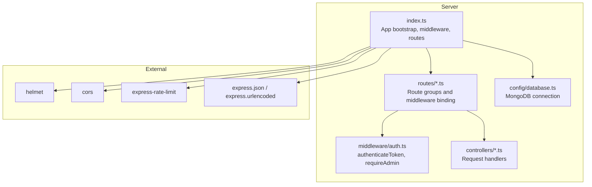
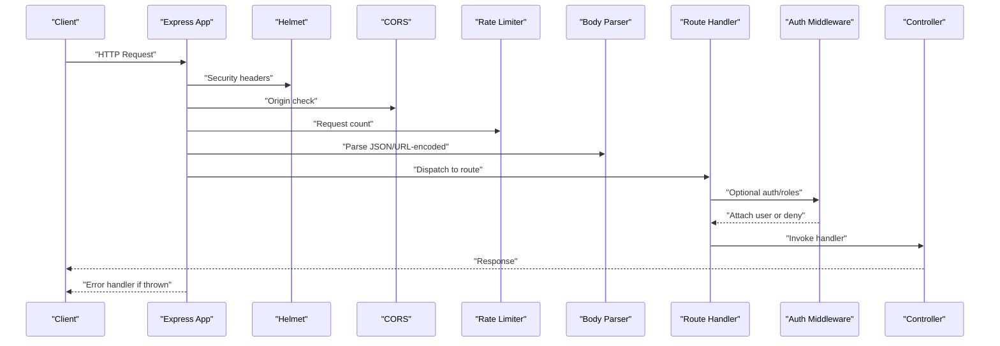
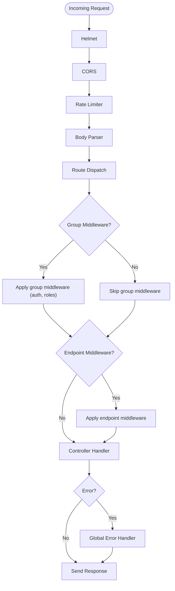
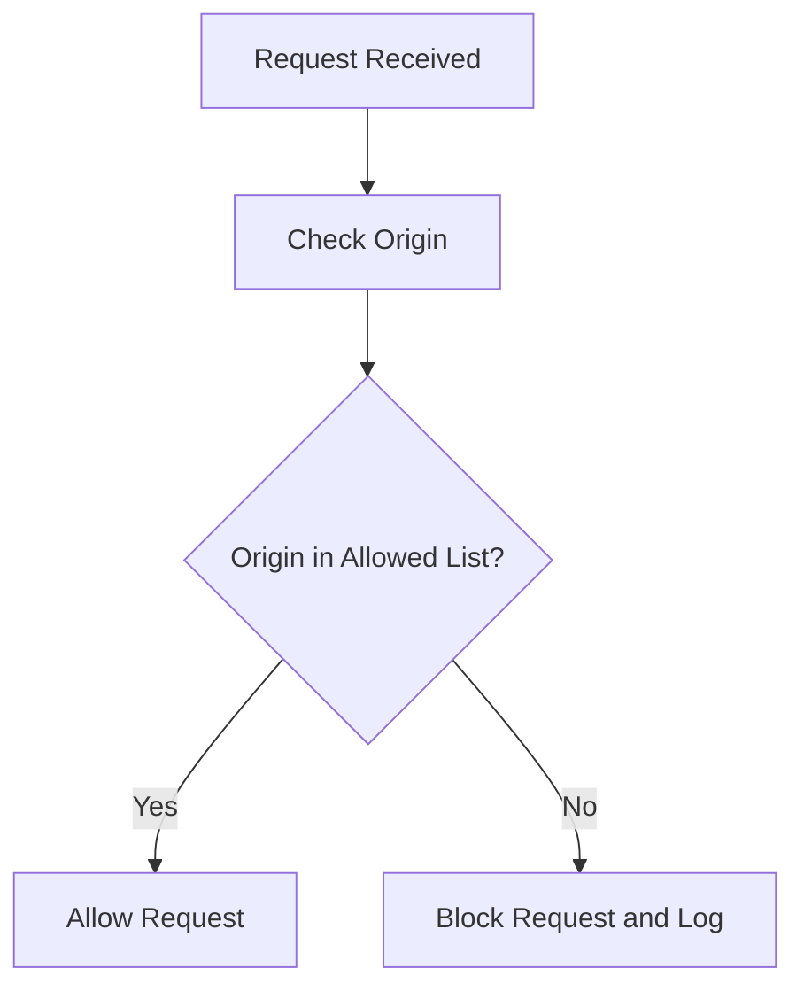
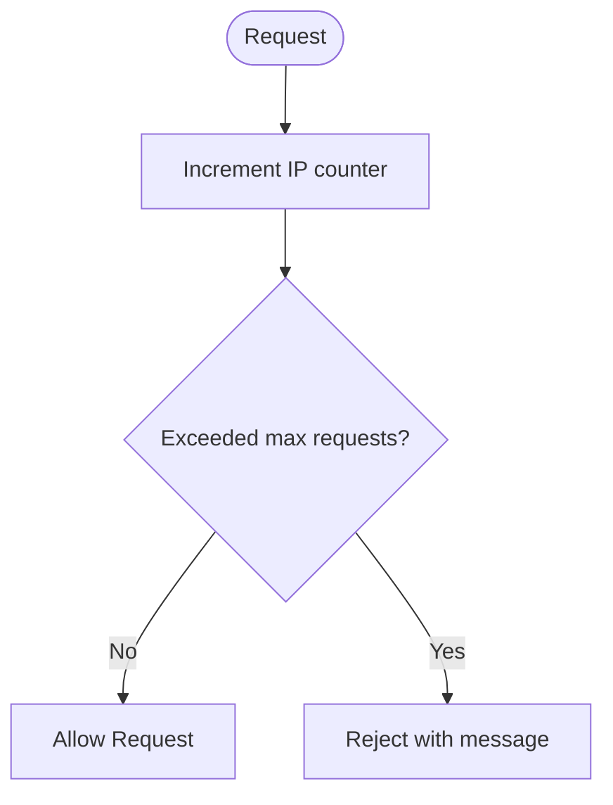
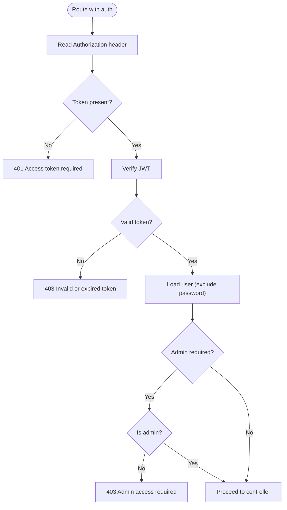
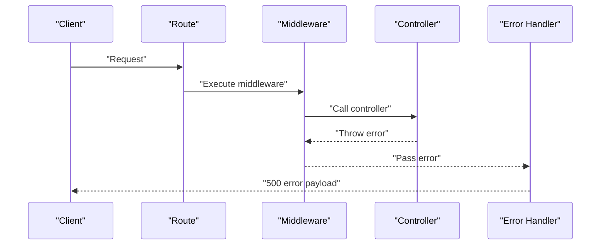
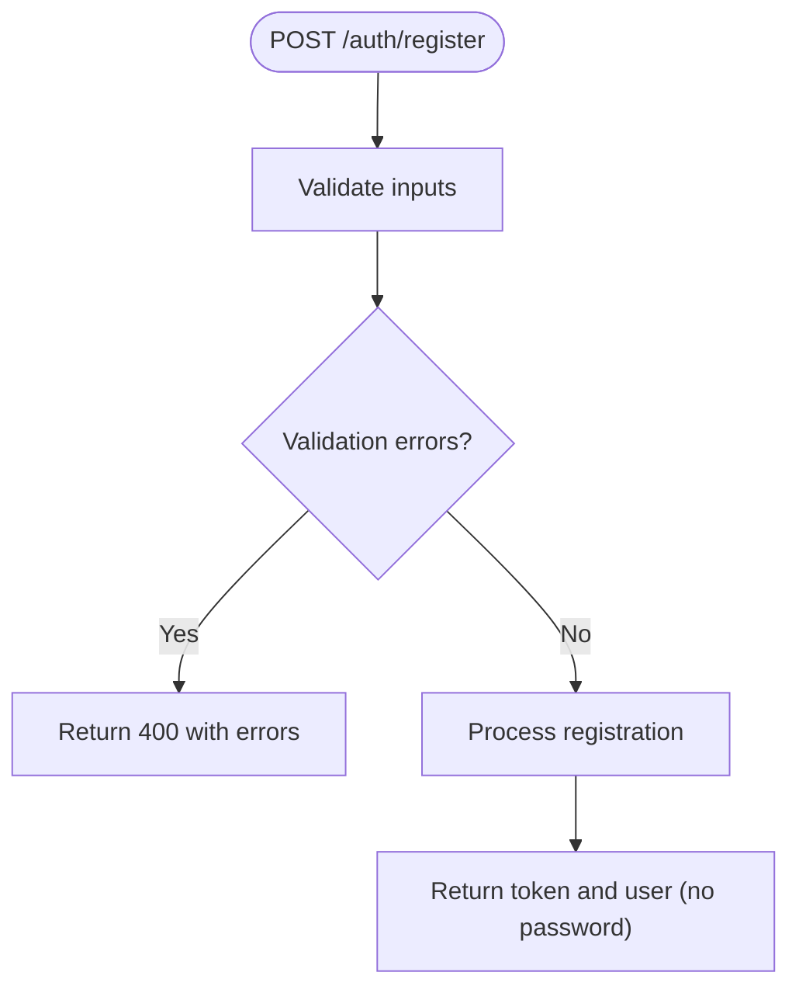
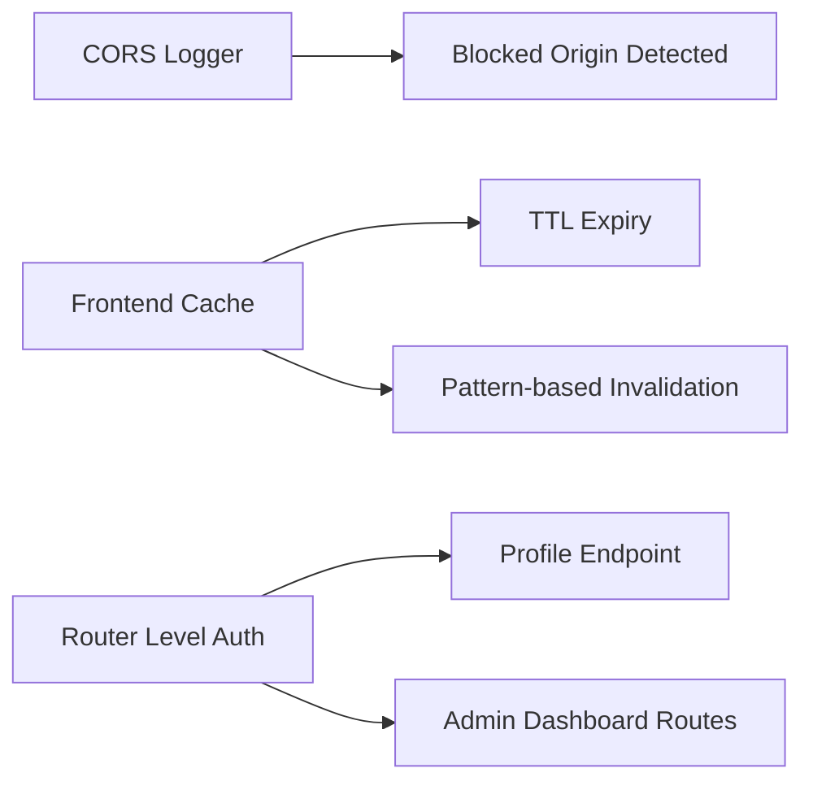
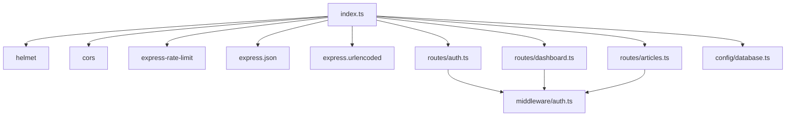

# Middleware Stack

<cite>
**Referenced Files in This Document**
- [index.ts](file://server/src/index.ts)
- [auth.ts](file://server/src/middleware/auth.ts)
- [auth.ts](file://server/src/routes/auth.ts)
- [dashboard.ts](file://server/src/routes/dashboard.ts)
- [articles.ts](file://server/src/routes/articles.ts)
- [authController.ts](file://server/src/controllers/authController.ts)
- [database.ts](file://server/src/config/database.ts)
- [cache.ts](file://personalSite/src/lib/cache.ts)
</cite>

## Table of Contents
1. [Introduction](#introduction)
2. [Project Structure](#project-structure)
3. [Core Components](#core-components)
4. [Architecture Overview](#architecture-overview)
5. [Detailed Component Analysis](#detailed-component-analysis)
6. [Dependency Analysis](#dependency-analysis)
7. [Performance Considerations](#performance-considerations)
8. [Troubleshooting Guide](#troubleshooting-guide)
9. [Conclusion](#conclusion)

## Introduction
This document explains the Express middleware stack used in the backend server. It covers middleware execution order, security middleware (Helmet, CORS), rate limiting, authentication and permission enforcement, error handling, and practical patterns for logging, validation, caching, and response optimization. It also provides guidance on composing middleware, applying it conditionally, and testing strategies, along with performance and troubleshooting tips.

## Project Structure
The server is organized around a clear separation of concerns:
- Entry point initializes Express, loads environment variables, connects to the database, and registers middleware and routes.
- Middleware is implemented as reusable functions for authentication and permissions.
- Routes define endpoint groups and apply middleware either globally to route groups or per-endpoint.
- Controllers encapsulate request handling logic and leverage validation helpers.
- Utilities provide database connectivity and frontend caching utilities.

**Diagram sources**
- [index.ts](file://server/src/index.ts#L1-L158)
- [auth.ts](file://server/src/middleware/auth.ts#L1-L37)
- [auth.ts](file://server/src/routes/auth.ts#L1-L11)
- [dashboard.ts](file://server/src/routes/dashboard.ts#L1-L21)
- [articles.ts](file://server/src/routes/articles.ts#L1-L54)
- [authController.ts](file://server/src/controllers/authController.ts#L1-L142)
- [database.ts](file://server/src/config/database.ts#L1-L61)

**Section sources**
- [index.ts](file://server/src/index.ts#L1-L158)
- [auth.ts](file://server/src/middleware/auth.ts#L1-L37)
- [auth.ts](file://server/src/routes/auth.ts#L1-L11)
- [dashboard.ts](file://server/src/routes/dashboard.ts#L1-L21)
- [articles.ts](file://server/src/routes/articles.ts#L1-L54)
- [authController.ts](file://server/src/controllers/authController.ts#L1-L142)
- [database.ts](file://server/src/config/database.ts#L1-L61)

## Core Components
- Security middleware
  - Helmet: Adds security headers to HTTP responses.
  - CORS: Dynamically configures allowed origins based on environment variables and defaults.
- Rate limiting: Applies a global rate limiter to throttle requests per IP.
- Body parsing: Enables JSON and URL-encoded payloads with size limits.
- Authentication and permissions: JWT-based authentication and admin-only enforcement.
- Error handling: Centralized error-handling middleware to standardize error responses.
- Database connectivity: Non-blocking connection with automatic retries and reconnection.

**Section sources**
- [index.ts](file://server/src/index.ts#L34-L97)
- [auth.ts](file://server/src/middleware/auth.ts#L9-L37)
- [database.ts](file://server/src/config/database.ts#L6-L56)

## Architecture Overview
The middleware stack is registered at the application level and executed in a strict order. Requests traverse middleware in the order they are mounted, then reach the appropriate route, controller, and finally error handlers.

**Diagram sources**
- [index.ts](file://server/src/index.ts#L34-L140)
- [auth.ts](file://server/src/middleware/auth.ts#L9-L37)
- [auth.ts](file://server/src/routes/auth.ts#L7-L9)
- [authController.ts](file://server/src/controllers/authController.ts#L22-L78)

## Detailed Component Analysis

### Middleware Execution Order and Composition
- Registration order defines execution order. In the entry point, security headers, CORS, rate limiting, and body parsing are registered before routes.
- Route-level middleware can be applied globally to a router group or per-endpoint.
- Composition patterns:
  - Group-level middleware applies to all routes under a router.
  - Endpoint-level middleware applies only to specific routes.
  - Conditional middleware can be applied based on environment or request characteristics.

**Diagram sources**
- [index.ts](file://server/src/index.ts#L34-L140)
- [dashboard.ts](file://server/src/routes/dashboard.ts#L8-L10)
- [articles.ts](file://server/src/routes/articles.ts#L40-L42)

**Section sources**
- [index.ts](file://server/src/index.ts#L34-L116)
- [dashboard.ts](file://server/src/routes/dashboard.ts#L8-L19)
- [articles.ts](file://server/src/routes/articles.ts#L40-L52)

### Security Middleware: Helmet and CORS
- Helmet is mounted globally to add security headers to all responses.
- CORS configuration:
  - Determines allowed origins based on environment variables and defaults.
  - Allows credentials and handles requests with no origin.
  - Logs blocked origins for visibility.

**Diagram sources**
- [index.ts](file://server/src/index.ts#L38-L83)

**Section sources**
- [index.ts](file://server/src/index.ts#L34-L85)

### Rate Limiting Strategy
- A global rate limiter is configured with a fixed window and maximum request threshold.
- It throttles repeated requests from the same IP address to protect the server.

**Diagram sources**
- [index.ts](file://server/src/index.ts#L87-L93)

**Section sources**
- [index.ts](file://server/src/index.ts#L87-L93)

### Authentication Middleware and Permission Checking
- JWT-based authentication:
  - Extracts token from Authorization header.
  - Verifies token using a secret.
  - Loads user without password and attaches to request.
  - Returns standardized errors for missing/expired/invalid tokens.
- Admin enforcement:
  - Checks user role and denies access if not admin.

**Diagram sources**
- [auth.ts](file://server/src/middleware/auth.ts#L9-L37)

**Section sources**
- [auth.ts](file://server/src/middleware/auth.ts#L9-L37)
- [auth.ts](file://server/src/routes/auth.ts#L9)
- [dashboard.ts](file://server/src/routes/dashboard.ts#L9-L10)

### Error Handling Middleware
- A centralized error-handling middleware catches unhandled exceptions.
- Logs stack traces and responds with a structured error payload.
- In development, includes the error message; in production, hides internal details.

**Diagram sources**
- [index.ts](file://server/src/index.ts#L133-L140)

**Section sources**
- [index.ts](file://server/src/index.ts#L133-L140)

### Request/Response Transformation and Validation
- Validation:
  - Uses validation helpers to enforce input rules for registration and login.
  - Collects validation errors and returns structured 400 responses.
- Response optimization:
  - Body parsers enable efficient JSON and URL-encoded handling with size limits.
  - Controllers return concise responses with minimal sensitive data.

**Diagram sources**
- [authController.ts](file://server/src/controllers/authController.ts#L6-L79)

**Section sources**
- [authController.ts](file://server/src/controllers/authController.ts#L1-L142)
- [index.ts](file://server/src/index.ts#L95-L97)

### Logging, Caching, and Conditional Middleware Application
- Logging:
  - CORS logs blocked origins for diagnostics.
  - Health checks and startup logs indicate operational status.
- Caching:
  - Frontend cache utility provides in-memory caching with TTL and invalidation.
  - Useful for reducing redundant network requests in client applications.
- Conditional middleware:
  - Routes apply authentication and admin middleware selectively:
    - Profile requires authentication.
    - Dashboard routes apply authentication and admin middleware at the router level.
    - Articles expose public endpoints and admin-only endpoints with different middleware stacks.

**Diagram sources**
- [index.ts](file://server/src/index.ts#L78-L79)
- [cache.ts](file://personalSite/src/lib/cache.ts#L12-L96)
- [auth.ts](file://server/src/routes/auth.ts#L9)
- [dashboard.ts](file://server/src/routes/dashboard.ts#L9-L10)

**Section sources**
- [index.ts](file://server/src/index.ts#L66-L67)
- [cache.ts](file://personalSite/src/lib/cache.ts#L1-L137)
- [auth.ts](file://server/src/routes/auth.ts#L9)
- [dashboard.ts](file://server/src/routes/dashboard.ts#L9-L10)
- [articles.ts](file://server/src/routes/articles.ts#L40-L42)

### Custom Middleware Creation Patterns
- Reusable middleware functions:
  - Authentication middleware verifies tokens and enriches the request with user data.
  - Admin middleware enforces role-based access control.
- Composition:
  - Mount middleware at router level to apply to all routes in that group.
  - Mount middleware per endpoint for granular control.
- Conditional application:
  - Use environment variables and route grouping to apply middleware only where needed.

**Section sources**
- [auth.ts](file://server/src/middleware/auth.ts#L9-L37)
- [dashboard.ts](file://server/src/routes/dashboard.ts#L9-L10)
- [articles.ts](file://server/src/routes/articles.ts#L40-L42)

### Middleware Testing Strategies
- Unit tests for middleware:
  - Mock request/response objects and assert status codes and payloads.
  - Test missing tokens, invalid tokens, expired tokens, and admin-only scenarios.
- Integration tests:
  - Validate middleware ordering and behavior across routes.
  - Verify CORS origin acceptance/rejection and rate limiter thresholds.
- Observability:
  - Enable logging for blocked origins and error stack traces.
  - Monitor health endpoints and database connection status.

[No sources needed since this section provides general guidance]

## Dependency Analysis
The middleware stack depends on external libraries and internal modules:
- External:
  - Helmet, CORS, express-rate-limit, express body parsers.
- Internal:
  - Authentication middleware, route groups, controllers, database connector.

**Diagram sources**
- [index.ts](file://server/src/index.ts#L1-L22)
- [auth.ts](file://server/src/middleware/auth.ts#L1-L37)
- [auth.ts](file://server/src/routes/auth.ts#L1-L11)
- [dashboard.ts](file://server/src/routes/dashboard.ts#L1-L21)
- [articles.ts](file://server/src/routes/articles.ts#L1-L54)
- [database.ts](file://server/src/config/database.ts#L1-L61)

**Section sources**
- [index.ts](file://server/src/index.ts#L1-L22)
- [auth.ts](file://server/src/middleware/auth.ts#L1-L37)
- [auth.ts](file://server/src/routes/auth.ts#L1-L11)
- [dashboard.ts](file://server/src/routes/dashboard.ts#L1-L21)
- [articles.ts](file://server/src/routes/articles.ts#L1-L54)
- [database.ts](file://server/src/config/database.ts#L1-L61)

## Performance Considerations
- Keep middleware lightweight and avoid synchronous I/O.
- Place fast-fail middleware early (CORS, rate limiter, body parsing).
- Use environment-specific configurations for origins and limits.
- Leverage caching at the client layer to reduce server load.
- Monitor database connectivity and handle reconnections gracefully.

[No sources needed since this section provides general guidance]

## Troubleshooting Guide
- CORS blocked origin:
  - Verify allowed origins and environment variables.
  - Check logs for blocked origin messages.
- Rate limit exceeded:
  - Adjust window and max values or whitelist trusted IPs.
- Authentication failures:
  - Confirm Authorization header format and token validity.
  - Ensure JWT secret is configured and consistent.
- Database connectivity:
  - Review connection logs and retry behavior.
- Error handling:
  - Inspect error logs and stack traces; confirm global error middleware is registered.

**Section sources**
- [index.ts](file://server/src/index.ts#L66-L67)
- [index.ts](file://server/src/index.ts#L87-L93)
- [auth.ts](file://server/src/middleware/auth.ts#L14-L29)
- [database.ts](file://server/src/config/database.ts#L27-L44)

## Conclusion
The middleware stack follows a predictable, layered approach: security headers, CORS, rate limiting, body parsing, routing, authentication/authorization, controller logic, and centralized error handling. By composing middleware at the router and endpoint levels, the system achieves flexible, maintainable access control and robust protection. Observability, environment-aware configurations, and client-side caching further enhance reliability and performance.