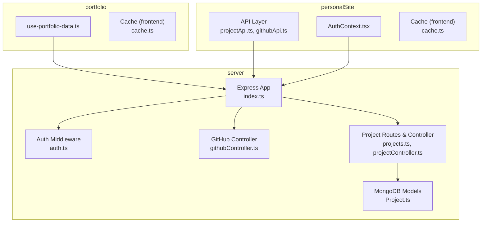
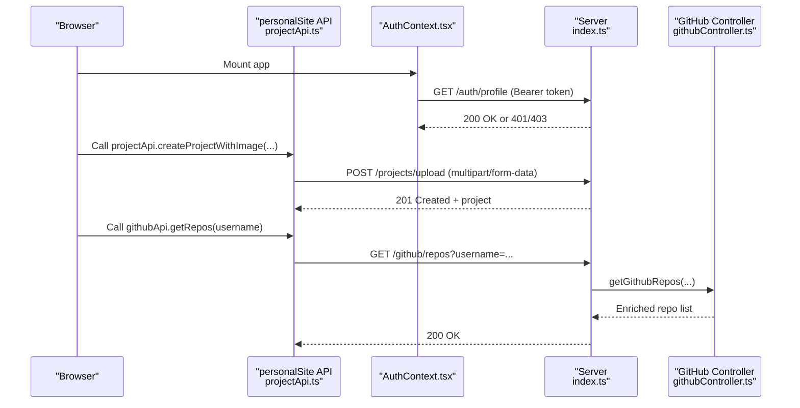
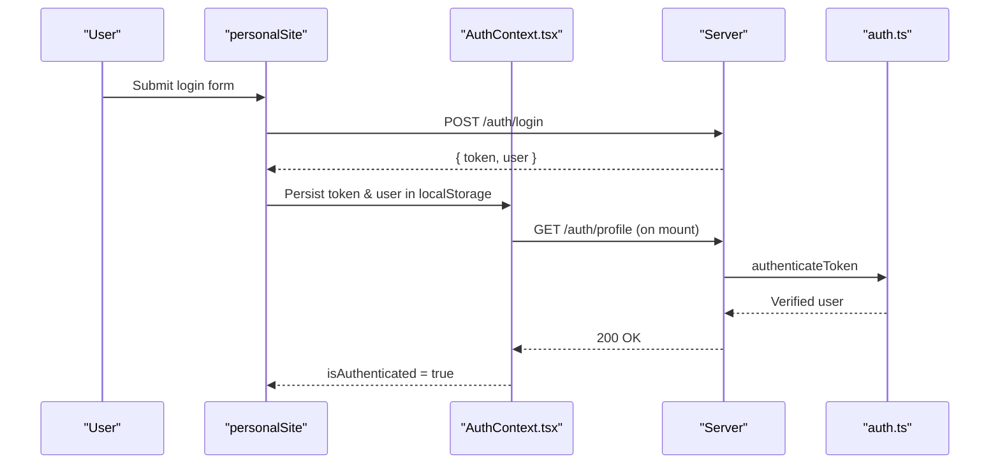
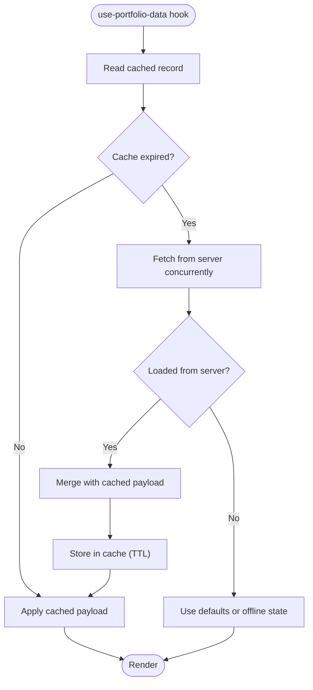
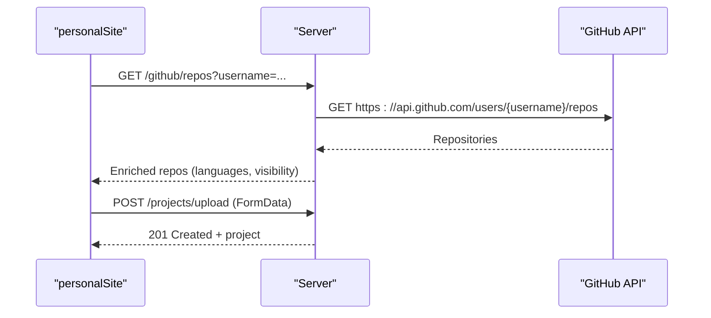
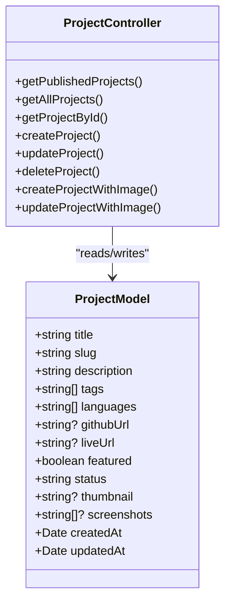
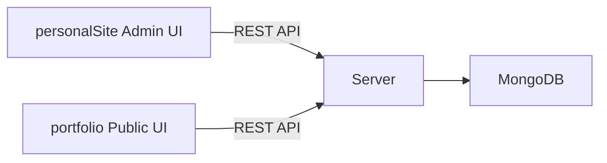
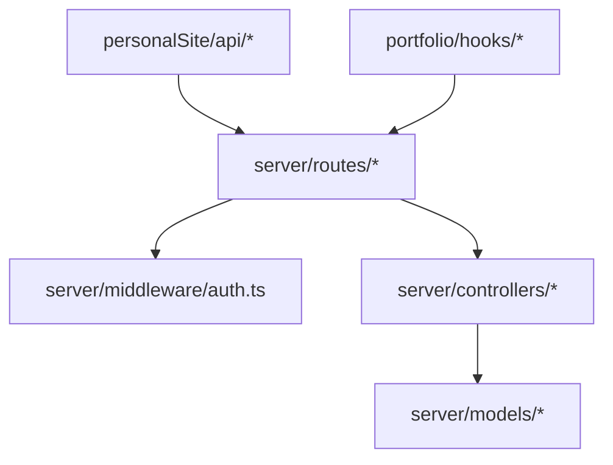

# Data Flow and Communication

<cite>
**Referenced Files in This Document**
- [personalSite/src/lib/apiConfig.ts](file://personalSite/src/lib/apiConfig.ts)
- [portfolio/src/lib/apiConfig.ts](file://portfolio/src/lib/apiConfig.ts)
- [server/src/index.ts](file://server/src/index.ts)
- [personalSite/src/contexts/AuthContext.tsx](file://personalSite/src/contexts/AuthContext.tsx)
- [portfolio/src/hooks/use-portfolio-data.ts](file://portfolio/src/hooks/use-portfolio-data.ts)
- [personalSite/src/lib/cache.ts](file://personalSite/src/lib/cache.ts)
- [portfolio/src/lib/cache.ts](file://portfolio/src/lib/cache.ts)
- [personalSite/src/api/githubApi.ts](file://personalSite/src/api/githubApi.ts)
- [server/src/controllers/githubController.ts](file://server/src/controllers/githubController.ts)
- [server/src/middleware/auth.ts](file://server/src/middleware/auth.ts)
- [personalSite/src/api/projectApi.ts](file://personalSite/src/api/projectApi.ts)
- [server/src/models/Project.ts](file://server/src/models/Project.ts)
- [server/src/routes/projects.ts](file://server/src/routes/projects.ts)
- [server/src/controllers/projectController.ts](file://server/src/controllers/projectController.ts)
- [personalSite/src/pages/Admin/ProjectManager.tsx](file://personalSite/src/pages/Admin/ProjectManager.tsx)
</cite>

## Table of Contents
1. [Introduction](#introduction)
2. [Project Structure](#project-structure)
3. [Core Components](#core-components)
4. [Architecture Overview](#architecture-overview)
5. [Detailed Component Analysis](#detailed-component-analysis)
6. [Dependency Analysis](#dependency-analysis)
7. [Performance Considerations](#performance-considerations)
8. [Troubleshooting Guide](#troubleshooting-guide)
9. [Conclusion](#conclusion)

## Introduction
This document describes the data flow patterns and inter-application communication in the Personal Portfolio Platform. It covers client-server communication protocols, API integration patterns, data synchronization strategies, authentication token flow, session management, real-time-like updates via React Query, caching mechanisms for GitHub integration and media assets, database transaction patterns, error propagation, and shared state management across personalSite and portfolio.

## Project Structure
The platform consists of:
- personalSite: Admin-facing SPA with authentication, project management, and GitHub integration APIs.
- portfolio: Public-facing SPA that fetches and renders portfolio data with local caching.
- server: Express-based backend exposing REST endpoints, JWT authentication, and MongoDB models.

**Diagram sources**
- [personalSite/src/api/projectApi.ts](file://personalSite/src/api/projectApi.ts#L1-L259)
- [personalSite/src/api/githubApi.ts](file://personalSite/src/api/githubApi.ts#L1-L46)
- [personalSite/src/contexts/AuthContext.tsx](file://personalSite/src/contexts/AuthContext.tsx#L1-L140)
- [portfolio/src/hooks/use-portfolio-data.ts](file://portfolio/src/hooks/use-portfolio-data.ts#L1-L225)
- [server/src/index.ts](file://server/src/index.ts#L1-L158)
- [server/src/middleware/auth.ts](file://server/src/middleware/auth.ts#L1-L37)
- [server/src/controllers/githubController.ts](file://server/src/controllers/githubController.ts#L1-L177)
- [server/src/routes/projects.ts](file://server/src/routes/projects.ts#L1-L71)
- [server/src/controllers/projectController.ts](file://server/src/controllers/projectController.ts#L1-L926)
- [server/src/models/Project.ts](file://server/src/models/Project.ts#L1-L97)

**Section sources**
- [personalSite/src/lib/apiConfig.ts](file://personalSite/src/lib/apiConfig.ts#L1-L75)
- [portfolio/src/lib/apiConfig.ts](file://portfolio/src/lib/apiConfig.ts#L1-L19)
- [server/src/index.ts](file://server/src/index.ts#L1-L158)

## Core Components
- API configuration: Centralized base URL resolution for both SPAs.
- Authentication: JWT-based Bearer tokens with session persisted in localStorage and validated against the backend.
- Caching: In-memory cache with TTL for personalSite; localStorage-backed cache with TTL and max-stale semantics for portfolio.
- GitHub integration: Proxy endpoints that fetch and enrich GitHub data with optional token support.
- Project management: CRUD APIs with image upload handling and cache invalidation.
- Database models: Mongoose schemas with validation and indexes.

**Section sources**
- [personalSite/src/lib/apiConfig.ts](file://personalSite/src/lib/apiConfig.ts#L1-L75)
- [portfolio/src/lib/apiConfig.ts](file://portfolio/src/lib/apiConfig.ts#L1-L19)
- [personalSite/src/contexts/AuthContext.tsx](file://personalSite/src/contexts/AuthContext.tsx#L1-L140)
- [personalSite/src/lib/cache.ts](file://personalSite/src/lib/cache.ts#L1-L137)
- [portfolio/src/lib/cache.ts](file://portfolio/src/lib/cache.ts#L1-L119)
- [personalSite/src/api/githubApi.ts](file://personalSite/src/api/githubApi.ts#L1-L46)
- [server/src/controllers/githubController.ts](file://server/src/controllers/githubController.ts#L1-L177)
- [personalSite/src/api/projectApi.ts](file://personalSite/src/api/projectApi.ts#L1-L259)
- [server/src/models/Project.ts](file://server/src/models/Project.ts#L1-L97)

## Architecture Overview
The system follows a client-server model with two distinct frontends:
- personalSite: Admin UI that performs authenticated CRUD operations and GitHub enrichment.
- portfolio: Public UI that fetches and caches portfolio data locally.

Communication flow:
- Both SPAs resolve API base URLs from environment variables.
- personalSite uses localStorage for session persistence and validates tokens on mount.
- portfolio uses a hybrid in-memory/localStorage cache with TTL and max-stale policies.
- Server enforces CORS and rate limiting, validates JWT tokens, and proxies GitHub API calls.

**Diagram sources**
- [personalSite/src/contexts/AuthContext.tsx](file://personalSite/src/contexts/AuthContext.tsx#L41-L76)
- [personalSite/src/api/projectApi.ts](file://personalSite/src/api/projectApi.ts#L128-L178)
- [server/src/index.ts](file://server/src/index.ts#L100-L116)
- [server/src/controllers/githubController.ts](file://server/src/controllers/githubController.ts#L4-L100)

## Detailed Component Analysis

### Authentication and Session Management
- Token lifecycle:
  - On login/register, the SPA receives a JWT token and stores it in localStorage alongside user metadata.
  - On mount, the SPA validates the stored token by calling the profile endpoint.
  - On invalid token, the SPA clears localStorage and redirects to home.
- Backend enforcement:
  - The auth middleware extracts the Bearer token from Authorization headers, verifies it, and attaches the user to the request.
  - Admin endpoints require both token verification and admin role checks.

**Diagram sources**
- [personalSite/src/contexts/AuthContext.tsx](file://personalSite/src/contexts/AuthContext.tsx#L78-L122)
- [server/src/middleware/auth.ts](file://server/src/middleware/auth.ts#L9-L30)

**Section sources**
- [personalSite/src/contexts/AuthContext.tsx](file://personalSite/src/contexts/AuthContext.tsx#L1-L140)
- [server/src/middleware/auth.ts](file://server/src/middleware/auth.ts#L1-L37)

### Data Synchronization Strategies
- personalSite:
  - Uses an in-memory cache keyed by normalized parameters to avoid redundant network calls.
  - Invalidates cache entries after create/update/delete operations to maintain consistency.
- portfolio:
  - Uses a localStorage-backed cache with TTL and max-stale windows.
  - Prefers cached data immediately, refreshes if expired, and merges server responses with partial cached data.

**Diagram sources**
- [portfolio/src/hooks/use-portfolio-data.ts](file://portfolio/src/hooks/use-portfolio-data.ts#L143-L215)
- [portfolio/src/lib/cache.ts](file://portfolio/src/lib/cache.ts#L61-L104)

**Section sources**
- [personalSite/src/lib/cache.ts](file://personalSite/src/lib/cache.ts#L1-L137)
- [portfolio/src/lib/cache.ts](file://portfolio/src/lib/cache.ts#L1-L119)
- [portfolio/src/hooks/use-portfolio-data.ts](file://portfolio/src/hooks/use-portfolio-data.ts#L1-L225)

### GitHub Integration and Media Assets
- GitHub API:
  - personalSite’s GitHub API wraps server endpoints with short-lived in-memory cache.
  - Server controller proxies GitHub API, optionally using a token, filters private repos without a token, and enriches language and contributor data.
- Media assets:
  - Project CRUD supports image uploads via multipart/form-data with server-side validation and file filtering.
  - Cache invalidation ensures subsequent reads reflect updated assets.

**Diagram sources**
- [personalSite/src/api/githubApi.ts](file://personalSite/src/api/githubApi.ts#L7-L25)
- [server/src/controllers/githubController.ts](file://server/src/controllers/githubController.ts#L4-L100)
- [personalSite/src/api/projectApi.ts](file://personalSite/src/api/projectApi.ts#L153-L178)

**Section sources**
- [personalSite/src/api/githubApi.ts](file://personalSite/src/api/githubApi.ts#L1-L46)
- [server/src/controllers/githubController.ts](file://server/src/controllers/githubController.ts#L1-L177)
- [personalSite/src/api/projectApi.ts](file://personalSite/src/api/projectApi.ts#L128-L258)

### Database Transaction Patterns and Validation
- Project model:
  - Enforces field constraints, URL validations, and indexes for efficient queries.
- Project routes and controller:
  - Public endpoints filter by status and support search and pagination.
  - Admin endpoints enforce authentication and role checks.
  - Image upload handlers manage thumbnail and screenshots with size and type restrictions.
  - Validation uses express-validator with robust parsing for tags/languages arrays and URL fields.

**Diagram sources**
- [server/src/models/Project.ts](file://server/src/models/Project.ts#L3-L97)
- [server/src/controllers/projectController.ts](file://server/src/controllers/projectController.ts#L25-L800)

**Section sources**
- [server/src/models/Project.ts](file://server/src/models/Project.ts#L1-L97)
- [server/src/routes/projects.ts](file://server/src/routes/projects.ts#L1-L71)
- [server/src/controllers/projectController.ts](file://server/src/controllers/projectController.ts#L1-L926)

### Inter-Application Communication and Shared State
- personalSite and portfolio share the same backend API surface, enabling:
  - Unified data sources for projects, settings, and tech stacks.
  - Independent UI experiences with separate caching strategies.
- Shared state management:
  - personalSite relies on React Context for auth state and local storage for session persistence.
  - portfolio uses a custom hook to encapsulate data fetching, caching, and loading states.

**Diagram sources**
- [personalSite/src/contexts/AuthContext.tsx](file://personalSite/src/contexts/AuthContext.tsx#L1-L140)
- [portfolio/src/hooks/use-portfolio-data.ts](file://portfolio/src/hooks/use-portfolio-data.ts#L1-L225)
- [server/src/index.ts](file://server/src/index.ts#L100-L116)

**Section sources**
- [personalSite/src/contexts/AuthContext.tsx](file://personalSite/src/contexts/AuthContext.tsx#L1-L140)
- [portfolio/src/hooks/use-portfolio-data.ts](file://portfolio/src/hooks/use-portfolio-data.ts#L1-L225)

### Real-Time Data Updates and React Query
- The portfolio SPA does not use React Query; instead, it employs a custom caching and data-fetching strategy with:
  - Immediate cache reads on mount.
  - Concurrent server fetches for settings, tech stack categories, and projects.
  - TTL-based refresh and fallback to defaults when offline.
- Recommendation for future enhancements:
  - Introduce React Query for automatic background refetching, optimistic updates, and centralized cache invalidation across both SPAs.

[No sources needed since this section provides general guidance]

## Dependency Analysis
- Frontend-to-Backend:
  - personalSite and portfolio both depend on centralized API base URL configuration.
  - personalSite depends on AuthContext for token propagation; portfolio depends on local caching.
- Backend:
  - Routes depend on middleware for authentication and role checks.
  - Controllers depend on models and external services (GitHub API).
- Coupling and Cohesion:
  - API modules encapsulate HTTP calls and cache keys, improving cohesion.
  - Controllers isolate business logic, reducing coupling to transport details.

**Diagram sources**
- [personalSite/src/api/projectApi.ts](file://personalSite/src/api/projectApi.ts#L1-L259)
- [personalSite/src/api/githubApi.ts](file://personalSite/src/api/githubApi.ts#L1-L46)
- [portfolio/src/hooks/use-portfolio-data.ts](file://portfolio/src/hooks/use-portfolio-data.ts#L1-L225)
- [server/src/routes/projects.ts](file://server/src/routes/projects.ts#L1-L71)
- [server/src/middleware/auth.ts](file://server/src/middleware/auth.ts#L1-L37)
- [server/src/controllers/projectController.ts](file://server/src/controllers/projectController.ts#L1-L926)
- [server/src/models/Project.ts](file://server/src/models/Project.ts#L1-L97)

**Section sources**
- [personalSite/src/lib/apiConfig.ts](file://personalSite/src/lib/apiConfig.ts#L1-L75)
- [portfolio/src/lib/apiConfig.ts](file://portfolio/src/lib/apiConfig.ts#L1-L19)
- [server/src/index.ts](file://server/src/index.ts#L1-L158)

## Performance Considerations
- Caching:
  - personalSite: Short TTL for GitHub data; in-memory cache reduces repeated network calls.
  - portfolio: TTL plus max-stale allows degraded UX during network failure.
- Concurrency:
  - portfolio fetches settings, tech stack categories, and projects concurrently to minimize latency.
- Uploads:
  - Server enforces file size limits and accepts only images to reduce bandwidth and storage overhead.
- Database:
  - Project model includes indexes for text search and sorting to optimize queries.

[No sources needed since this section provides general guidance]

## Troubleshooting Guide
- Authentication failures:
  - Verify token presence and validity; check backend logs for JWT verification errors.
  - Confirm CORS origins and credentials configuration.
- GitHub API errors:
  - Inspect server logs for 403/404 responses from GitHub; ensure GITHUB_TOKEN is configured if private repo filtering is required.
- Project upload issues:
  - Validate file types and sizes; confirm multipart/form-data boundaries and cache invalidation after mutations.
- Database errors:
  - Review validation errors from express-validator and Mongoose schema constraints.

**Section sources**
- [server/src/index.ts](file://server/src/index.ts#L38-L85)
- [server/src/middleware/auth.ts](file://server/src/middleware/auth.ts#L9-L30)
- [server/src/controllers/githubController.ts](file://server/src/controllers/githubController.ts#L88-L99)
- [server/src/controllers/projectController.ts](file://server/src/controllers/projectController.ts#L265-L328)

## Conclusion
The Personal Portfolio Platform implements a clear separation of concerns across personalSite, portfolio, and server. It leverages JWT-based authentication, robust caching strategies, and well-defined API boundaries. While portfolio currently uses a custom caching approach, adopting React Query would further streamline real-time-like updates and cache management across both applications. The backend’s middleware and controllers provide strong security and validation foundations, ensuring reliable data synchronization and error propagation.