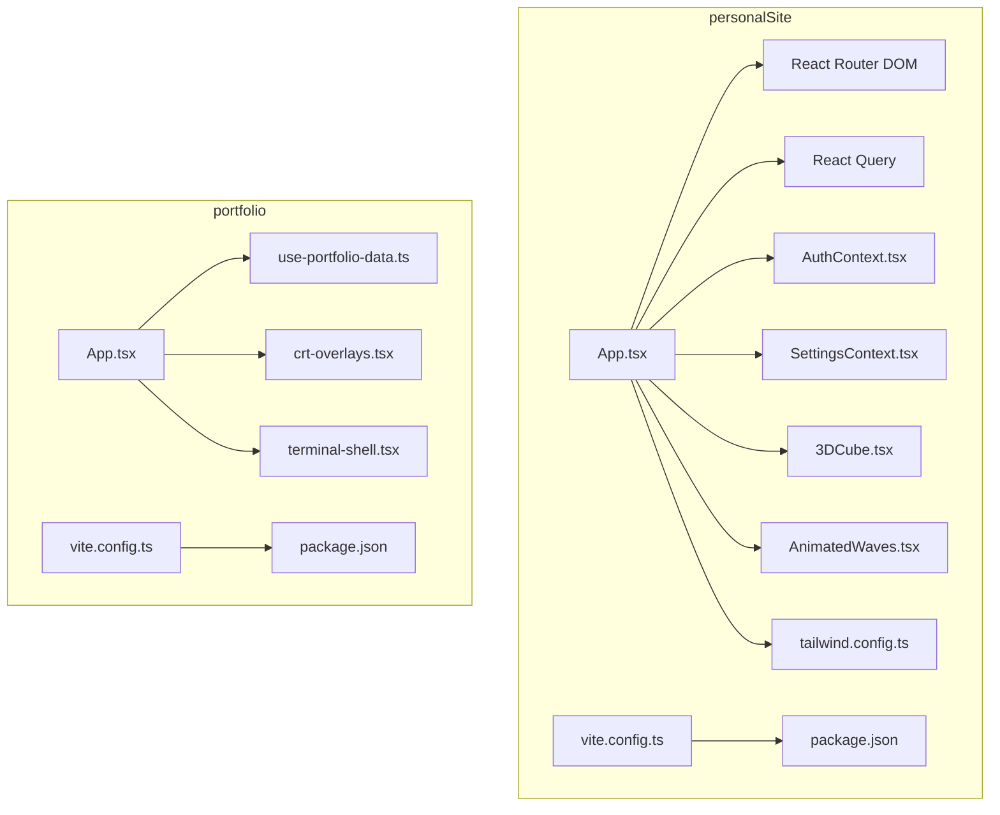
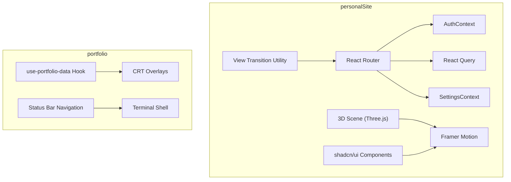
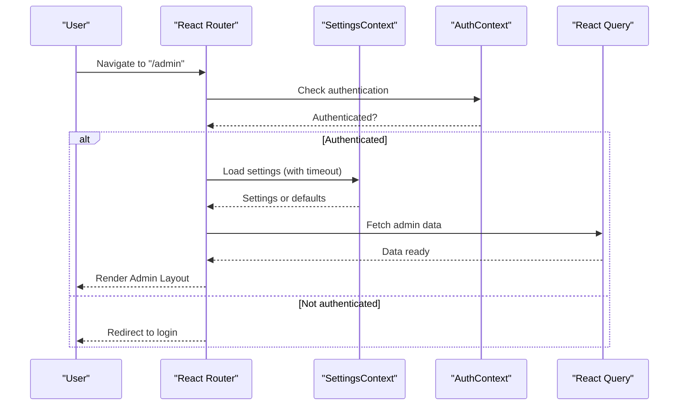
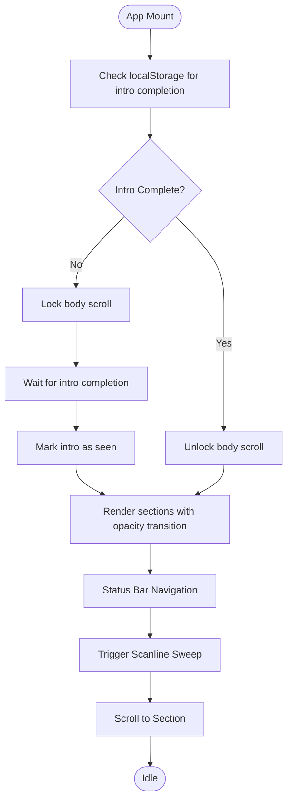
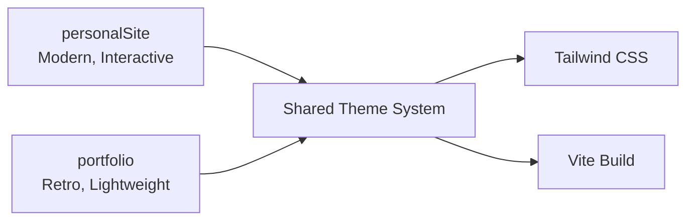
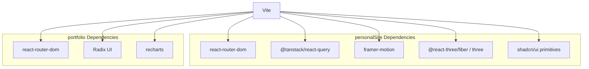

# Frontend Architecture

<cite>
**Referenced Files in This Document**
- [personalSite/package.json](file://personalSite/package.json)
- [portfolio/package.json](file://portfolio/package.json)
- [personalSite/vite.config.ts](file://personalSite/vite.config.ts)
- [portfolio/vite.config.ts](file://portfolio/vite.config.ts)
- [personalSite/src/App.tsx](file://personalSite/src/App.tsx)
- [portfolio/src/App.tsx](file://portfolio/src/App.tsx)
- [personalSite/tailwind.config.ts](file://personalSite/tailwind.config.ts)
- [personalSite/src/contexts/AuthContext.tsx](file://personalSite/src/contexts/AuthContext.tsx)
- [personalSite/src/contexts/SettingsContext.tsx](file://personalSite/src/contexts/SettingsContext.tsx)
- [portfolio/src/hooks/use-portfolio-data.ts](file://portfolio/src/hooks/use-portfolio-data.ts)
- [personalSite/src/lib/viewTransition.ts](file://personalSite/src/lib/viewTransition.ts)
- [personalSite/src/components/3DCube.tsx](file://personalSite/src/components/3DCube.tsx)
- [personalSite/src/components/AnimatedWaves.tsx](file://personalSite/src/components/AnimatedWaves.tsx)
- [portfolio/src/components/crt-overlays.tsx](file://portfolio/src/components/crt-overlays.tsx)
- [portfolio/src/components/terminal-shell.tsx](file://portfolio/src/components/terminal-shell.tsx)
- [personalSite/src/pages/Admin/Dashboard.tsx](file://personalSite/src/pages/Admin/Dashboard.tsx)
- [portfolio/src/components/sections/about-section.tsx](file://portfolio/src/components/sections/about-section.tsx)
</cite>

## Table of Contents
1. [Introduction](#introduction)
2. [Project Structure](#project-structure)
3. [Core Components](#core-components)
4. [Architecture Overview](#architecture-overview)
5. [Detailed Component Analysis](#detailed-component-analysis)
6. [Dependency Analysis](#dependency-analysis)
7. [Performance Considerations](#performance-considerations)
8. [Troubleshooting Guide](#troubleshooting-guide)
9. [Conclusion](#conclusion)

## Introduction
This document describes the frontend architecture of the Personal Portfolio Platform, focusing on the dual frontend design:
- personalSite: A modern React application with advanced UI, animations, 3D graphics, and administrative capabilities.
- portfolio: A retro terminal-style application emphasizing nostalgic aesthetics, minimalism, and efficient data loading.

Both applications share a common theme system and styling via Tailwind CSS, but differ in animation systems, state management approaches, and build configurations. The personalSite app leverages shadcn/ui primitives, Framer Motion, Three.js, and React Query, while the portfolio app uses a custom CRT aesthetic with local caching and lightweight animations.

## Project Structure
The repository organizes the two frontend apps under separate directories, each with its own build pipeline, dependencies, and configuration files. The personalSite app includes extensive UI components, 3D scenes, and administrative pages, whereas the portfolio app focuses on a terminal-inspired layout and efficient data retrieval.

**Diagram sources**
- [personalSite/src/App.tsx](file://personalSite/src/App.tsx#L141-L356)
- [personalSite/src/contexts/AuthContext.tsx](file://personalSite/src/contexts/AuthContext.tsx#L36-L140)
- [personalSite/src/contexts/SettingsContext.tsx](file://personalSite/src/contexts/SettingsContext.tsx#L71-L126)
- [personalSite/src/components/3DCube.tsx](file://personalSite/src/components/3DCube.tsx#L581-L608)
- [personalSite/src/components/AnimatedWaves.tsx](file://personalSite/src/components/AnimatedWaves.tsx#L1-L84)
- [personalSite/vite.config.ts](file://personalSite/vite.config.ts#L10-L60)
- [personalSite/tailwind.config.ts](file://personalSite/tailwind.config.ts#L1-L117)
- [portfolio/src/App.tsx](file://portfolio/src/App.tsx#L41-L142)
- [portfolio/src/hooks/use-portfolio-data.ts](file://portfolio/src/hooks/use-portfolio-data.ts#L136-L225)
- [portfolio/src/components/crt-overlays.tsx](file://portfolio/src/components/crt-overlays.tsx#L1-L54)
- [portfolio/src/components/terminal-shell.tsx](file://portfolio/src/components/terminal-shell.tsx#L1-L184)
- [portfolio/vite.config.ts](file://portfolio/vite.config.ts#L1-L16)
- [personalSite/package.json](file://personalSite/package.json#L1-L113)
- [portfolio/package.json](file://portfolio/package.json#L1-L74)

**Section sources**
- [personalSite/package.json](file://personalSite/package.json#L1-L113)
- [portfolio/package.json](file://portfolio/package.json#L1-L74)
- [personalSite/vite.config.ts](file://personalSite/vite.config.ts#L10-L60)
- [portfolio/vite.config.ts](file://portfolio/vite.config.ts#L1-L16)
- [personalSite/tailwind.config.ts](file://personalSite/tailwind.config.ts#L1-L117)

## Core Components
This section outlines the foundational components and patterns used across both applications.

- Routing and Navigation
  - personalSite uses React Router DOM with dynamic imports and Suspense for route-level code splitting. It defines public and admin route patterns with custom transition logic keyed by route axis and direction.
  - portfolio uses a simpler imperative navigation model with a status bar and section spy to manage scrolling between sections.

- State Management
  - personalSite employs Context API for authentication and settings, plus React Query for data fetching and caching. It includes a custom hook to run view transitions conditionally based on user preferences and browser support.
  - portfolio relies on a custom hook to fetch and cache data locally, with a default fallback when server data is unavailable.

- UI Library and Theming
  - personalSite integrates shadcn/ui components and Tailwind CSS with custom keyframes and shadows for a modern, animated UI. It also includes a neon color palette and glow effects.
  - portfolio implements a CRT aesthetic with custom overlays and scanline effects, using CSS variables for theming and a terminal-like shell component.

- Animation Systems
  - personalSite combines Framer Motion for page transitions and UI micro-interactions with Three.js and React Three Fiber for immersive 3D experiences.
  - portfolio uses lightweight CSS-based CRT overlays and a scanline sweep effect triggered by navigation actions.

- Build and Asset Management
  - personalSite’s Vite configuration enables proxying API requests, custom chunk splitting, and dot directory asset inclusion. It also integrates prerendering via react-snap and a sitemap generator.
  - portfolio’s Vite configuration is minimalistic, focusing on development server setup and alias resolution.

**Section sources**
- [personalSite/src/App.tsx](file://personalSite/src/App.tsx#L45-L86)
- [personalSite/src/App.tsx](file://personalSite/src/App.tsx#L141-L356)
- [personalSite/src/lib/viewTransition.ts](file://personalSite/src/lib/viewTransition.ts#L17-L30)
- [portfolio/src/App.tsx](file://portfolio/src/App.tsx#L41-L142)
- [portfolio/src/hooks/use-portfolio-data.ts](file://portfolio/src/hooks/use-portfolio-data.ts#L136-L225)
- [personalSite/tailwind.config.ts](file://personalSite/tailwind.config.ts#L79-L112)
- [portfolio/src/components/crt-overlays.tsx](file://portfolio/src/components/crt-overlays.tsx#L1-L54)
- [personalSite/vite.config.ts](file://personalSite/vite.config.ts#L18-L32)
- [personalSite/vite.config.ts](file://personalSite/vite.config.ts#L40-L60)
- [portfolio/vite.config.ts](file://portfolio/vite.config.ts#L5-L16)

## Architecture Overview
The dual frontend architecture balances modern UX with nostalgic design. The personalSite app targets a contemporary audience with rich animations and interactive 3D elements, while the portfolio app caters to users who appreciate retro aesthetics and fast, reliable content delivery.

**Diagram sources**
- [personalSite/src/App.tsx](file://personalSite/src/App.tsx#L232-L354)
- [personalSite/src/contexts/AuthContext.tsx](file://personalSite/src/contexts/AuthContext.tsx#L36-L140)
- [personalSite/src/contexts/SettingsContext.tsx](file://personalSite/src/contexts/SettingsContext.tsx#L71-L126)
- [personalSite/src/lib/viewTransition.ts](file://personalSite/src/lib/viewTransition.ts#L17-L30)
- [personalSite/src/components/3DCube.tsx](file://personalSite/src/components/3DCube.tsx#L512-L561)
- [portfolio/src/App.tsx](file://portfolio/src/App.tsx#L41-L142)
- [portfolio/src/hooks/use-portfolio-data.ts](file://portfolio/src/hooks/use-portfolio-data.ts#L136-L225)
- [portfolio/src/components/crt-overlays.tsx](file://portfolio/src/components/crt-overlays.tsx#L1-L54)
- [portfolio/src/components/terminal-shell.tsx](file://portfolio/src/components/terminal-shell.tsx#L1-L184)

## Detailed Component Analysis

### personalSite: Modern React Application
- Component Hierarchy
  - Root provider chain: SettingsProvider → AuthProvider → QueryClientProvider → TooltipProvider.
  - Route-based rendering with Suspense fallbacks and protected admin routes.
  - Custom transition logic keyed by route axis and direction, enabling horizontal/vertical slide transitions.

- Routing System
  - Public routes include home, about, projects, articles, login, and register.
  - Admin routes are nested under /admin with ProtectedRoute wrappers and an AdminLayout.
  - Route ranking determines transition direction for smooth navigation.

- State Management Patterns
  - AuthContext manages user session, token persistence, and backend validation.
  - SettingsContext fetches site-wide settings with timeout handling and default fallbacks.
  - React Query centralizes data fetching and caching across the app.

- UI Library and Animations
  - shadcn/ui components provide consistent, accessible UI primitives.
  - Framer Motion powers page transitions and micro-interactions.
  - Three.js and React Three/Fiber create immersive 3D experiences with custom lighting and materials.

- Responsive Design Implementation
  - Tailwind CSS with custom keyframes and shadow utilities ensures responsive layouts.
  - Neon color palette and glow effects enhance visual appeal without compromising readability.

**Diagram sources**
- [personalSite/src/App.tsx](file://personalSite/src/App.tsx#L254-L346)
- [personalSite/src/contexts/AuthContext.tsx](file://personalSite/src/contexts/AuthContext.tsx#L36-L140)
- [personalSite/src/contexts/SettingsContext.tsx](file://personalSite/src/contexts/SettingsContext.tsx#L71-L126)

**Section sources**
- [personalSite/src/App.tsx](file://personalSite/src/App.tsx#L141-L356)
- [personalSite/src/contexts/AuthContext.tsx](file://personalSite/src/contexts/AuthContext.tsx#L36-L140)
- [personalSite/src/contexts/SettingsContext.tsx](file://personalSite/src/contexts/SettingsContext.tsx#L71-L126)
- [personalSite/src/lib/viewTransition.ts](file://personalSite/src/lib/viewTransition.ts#L17-L30)
- [personalSite/src/components/3DCube.tsx](file://personalSite/src/components/3DCube.tsx#L512-L561)
- [personalSite/src/components/AnimatedWaves.tsx](file://personalSite/src/components/AnimatedWaves.tsx#L1-L84)
- [personalSite/tailwind.config.ts](file://personalSite/tailwind.config.ts#L79-L112)

### portfolio: Retro Terminal-Style Application
- Component Composition
  - App orchestrates CRT overlays, status bar navigation, and section rendering.
  - use-portfolio-data hook fetches settings, skills, and projects with caching and fallback logic.
  - Terminal shell mimics a classic bash prompt with system info and command buttons.

- Routing and Navigation
  - Imperative navigation via status bar and section spy; no client-side routing.
  - One-time intro with localStorage persistence; replay option jumps to top.

- State Management
  - Local state for intro completion and navigation sweep.
  - Data state managed by a custom hook with cache-aware loading and server fallback.

- UI Library Usage
  - Minimal external UI library; heavy reliance on custom CRT-styled components and CSS variables.

- Responsive Design Implementation
  - Tailwind utilities combined with CRT-specific styles for consistent responsiveness across devices.

**Diagram sources**
- [portfolio/src/App.tsx](file://portfolio/src/App.tsx#L41-L142)
- [portfolio/src/components/crt-overlays.tsx](file://portfolio/src/components/crt-overlays.tsx#L33-L53)
- [portfolio/src/hooks/use-portfolio-data.ts](file://portfolio/src/hooks/use-portfolio-data.ts#L136-L225)

**Section sources**
- [portfolio/src/App.tsx](file://portfolio/src/App.tsx#L41-L142)
- [portfolio/src/hooks/use-portfolio-data.ts](file://portfolio/src/hooks/use-portfolio-data.ts#L136-L225)
- [portfolio/src/components/crt-overlays.tsx](file://portfolio/src/components/crt-overlays.tsx#L1-L54)
- [portfolio/src/components/terminal-shell.tsx](file://portfolio/src/components/terminal-shell.tsx#L1-L184)

### Conceptual Overview
The two applications demonstrate contrasting frontend philosophies:
- personalSite emphasizes modernity, interactivity, and rich media experiences.
- portfolio prioritizes nostalgia, performance, and simplicity.

[No sources needed since this diagram shows conceptual workflow, not actual code structure]

[No sources needed since this section doesn't analyze specific source files]

## Dependency Analysis
Both applications rely on Vite for bundling and development, with distinct plugin and configuration choices. personalSite integrates React Router, React Query, and Three.js, while portfolio focuses on local data caching and CRT visuals.

**Diagram sources**
- [personalSite/package.json](file://personalSite/package.json#L15-L74)
- [portfolio/package.json](file://portfolio/package.json#L11-L60)

**Section sources**
- [personalSite/package.json](file://personalSite/package.json#L15-L74)
- [portfolio/package.json](file://portfolio/package.json#L11-L60)

## Performance Considerations
- personalSite
  - Uses React.lazy and Suspense for route-level code splitting to reduce initial bundle size.
  - Vite rollupOptions split vendor and UI chunks; sourcemaps disabled in production for smaller bundles.
  - Prerendering via react-snap and sitemap generation improve SEO and initial load performance.
  - Three.js scenes are wrapped in Suspense to avoid blocking the main thread.

- portfolio
  - Local caching with TTL and stale-while-revalidate semantics reduces server requests.
  - Minimal dependencies and lightweight animations ensure fast rendering on low-power devices.
  - CRT overlays are disabled when users prefer reduced motion.

[No sources needed since this section provides general guidance]

## Troubleshooting Guide
- Authentication Issues (personalSite)
  - Verify token presence in localStorage and backend validation endpoint responses.
  - Ensure Authorization header is correctly set for protected routes.

- Settings Loading Failures (personalSite)
  - Timeout handling falls back to default settings; check network connectivity and server availability.

- Data Fetching Errors (portfolio)
  - use-portfolio-data handles partial failures by merging server data with cached records; confirm cache keys and TTL values.

- Build and Dev Server Problems
  - personalSite proxy configuration requires the backend server to be reachable at the configured target.
  - portfolio dev server runs on a custom port; ensure port 4000 is free.

**Section sources**
- [personalSite/src/contexts/AuthContext.tsx](file://personalSite/src/contexts/AuthContext.tsx#L58-L76)
- [personalSite/src/contexts/SettingsContext.tsx](file://personalSite/src/contexts/SettingsContext.tsx#L76-L108)
- [portfolio/src/hooks/use-portfolio-data.ts](file://portfolio/src/hooks/use-portfolio-data.ts#L166-L207)
- [personalSite/vite.config.ts](file://personalSite/vite.config.ts#L18-L25)
- [portfolio/vite.config.ts](file://portfolio/vite.config.ts#L6-L8)

## Conclusion
The Personal Portfolio Platform’s dual frontend architecture showcases two distinct design philosophies: a modern, interactive experience powered by React, Three.js, and Framer Motion, and a nostalgic, performance-focused terminal-style interface. Both applications leverage shared theming and build tooling while maintaining independent feature sets tailored to their respective audiences. The personalSite app excels in rich media and administrative capabilities, while the portfolio app prioritizes reliability and retro aesthetics through intelligent caching and minimal dependencies.