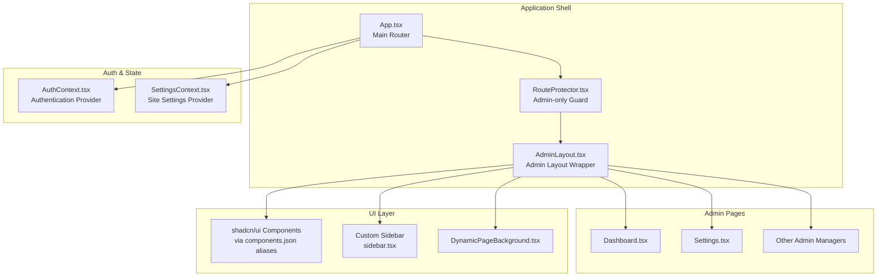
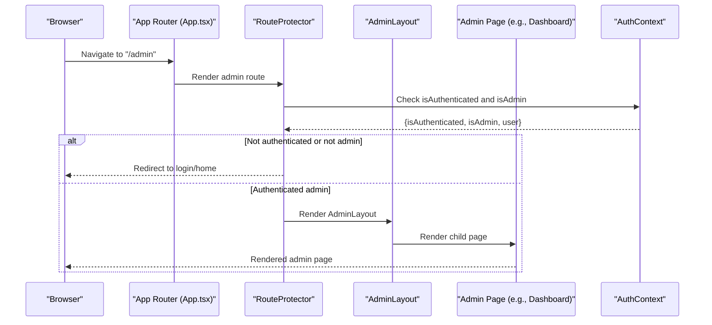
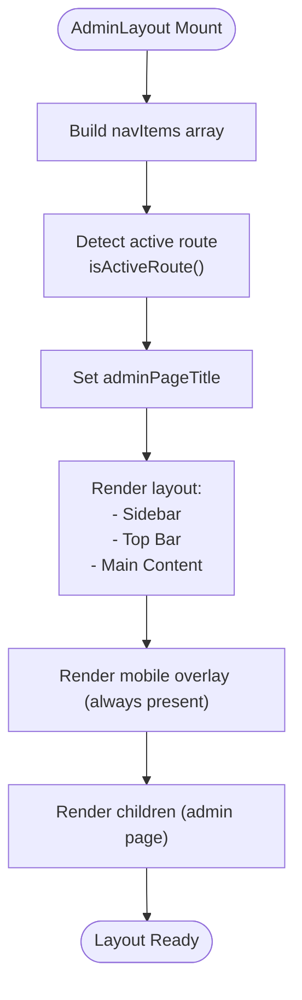
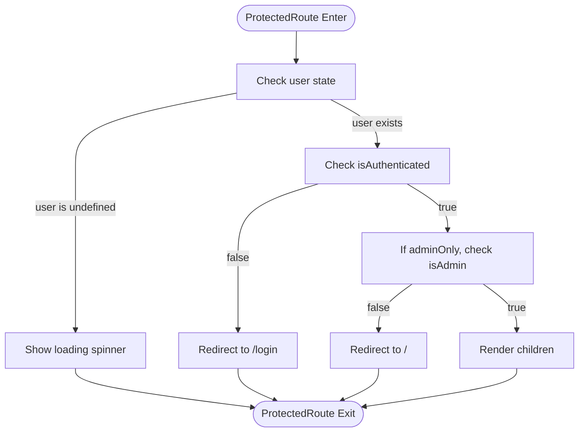
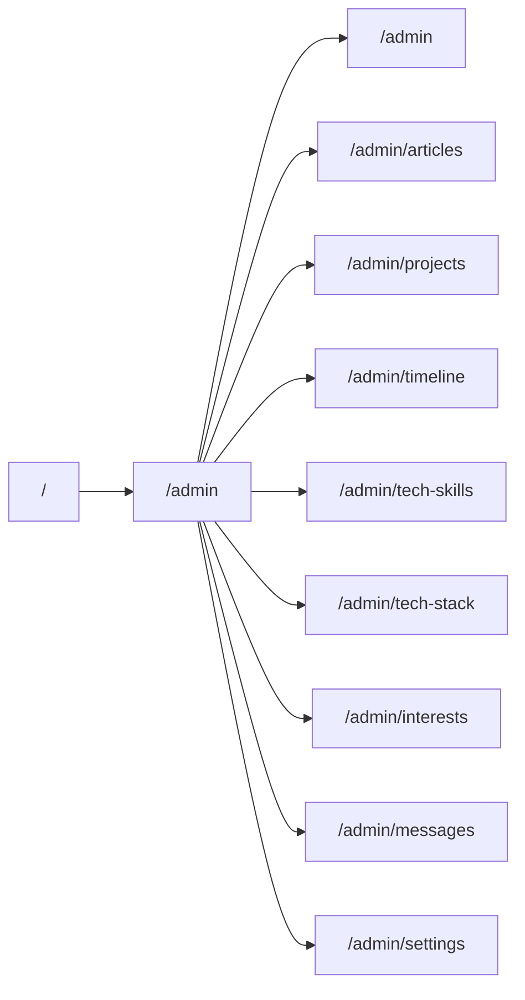
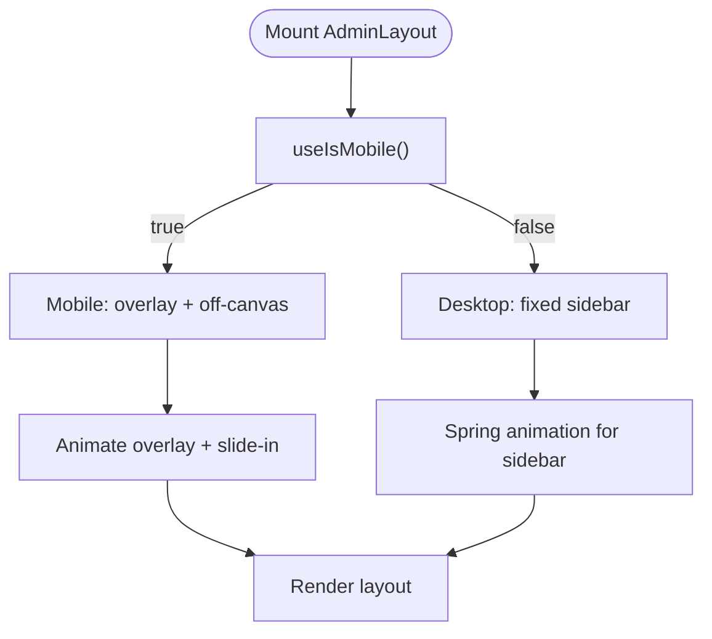
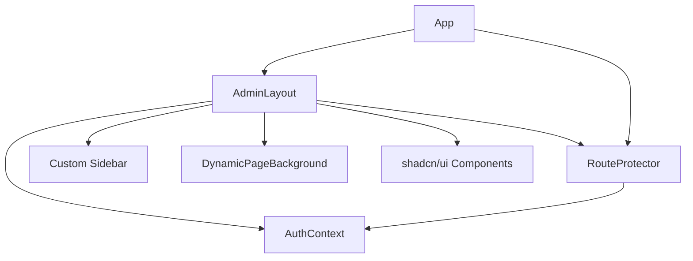

# Admin Layout System

<cite>
**Referenced Files in This Document**
- [AdminLayout.tsx](file://personalSite/src/components/layout/AdminLayout.tsx)
- [RouteProtector.tsx](file://personalSite/src/components/RouteProtector.tsx)
- [App.tsx](file://personalSite/src/App.tsx)
- [AuthContext.tsx](file://personalSite/src/contexts/AuthContext.tsx)
- [sidebar.tsx](file://personalSite/src/components/ui/sidebar.tsx)
- [use-mobile.tsx](file://personalSite/src/hooks/use-mobile.tsx)
- [DynamicPageBackground.tsx](file://personalSite/src/components/DynamicPageBackground.tsx)
- [Dashboard.tsx](file://personalSite/src/pages/Admin/Dashboard.tsx)
- [Settings.tsx](file://personalSite/src/pages/Admin/Settings.tsx)
- [components.json](file://personalSite/components.json)
</cite>

## Table of Contents
1. [Introduction](#introduction)
2. [Project Structure](#project-structure)
3. [Core Components](#core-components)
4. [Architecture Overview](#architecture-overview)
5. [Detailed Component Analysis](#detailed-component-analysis)
6. [Dependency Analysis](#dependency-analysis)
7. [Performance Considerations](#performance-considerations)
8. [Troubleshooting Guide](#troubleshooting-guide)
9. [Conclusion](#conclusion)

## Introduction
This document describes the admin layout system used for the portfolio administration interface. It covers the AdminLayout component structure, sidebar navigation, main content area, responsive design, admin-only route protection, menu organization, integration with the shadcn/ui component library, customization options, theming integration, and accessibility considerations.

## Project Structure
The admin layout is integrated into the main application routing and protected by authentication guards. The layout wraps admin pages and provides a persistent sidebar, top bar, and dynamic page background.

**Diagram sources**
- [App.tsx](file://personalSite/src/App.tsx#L246-L346)
- [RouteProtector.tsx](file://personalSite/src/components/RouteProtector.tsx#L10-L38)
- [AdminLayout.tsx](file://personalSite/src/components/layout/AdminLayout.tsx#L32-L291)
- [Dashboard.tsx](file://personalSite/src/pages/Admin/Dashboard.tsx#L79-L344)
- [Settings.tsx](file://personalSite/src/pages/Admin/Settings.tsx#L28-L269)
- [sidebar.tsx](file://personalSite/src/components/ui/sidebar.tsx#L131-L216)
- [DynamicPageBackground.tsx](file://personalSite/src/components/DynamicPageBackground.tsx#L6-L22)
- [AuthContext.tsx](file://personalSite/src/contexts/AuthContext.tsx#L36-L140)
- [components.json](file://personalSite/components.json#L13-L19)

**Section sources**
- [App.tsx](file://personalSite/src/App.tsx#L246-L346)
- [AdminLayout.tsx](file://personalSite/src/components/layout/AdminLayout.tsx#L32-L291)
- [RouteProtector.tsx](file://personalSite/src/components/RouteProtector.tsx#L10-L38)

## Core Components
- AdminLayout: Provides the admin shell with a fixed sidebar, top bar, and main content area. Handles active navigation highlighting and dynamic page titles.
- RouteProtector: Enforces admin-only access with optional admin-only mode and loading states during authentication validation.
- AuthContext: Manages authentication state, login/logout, and admin role checks.
- Custom Sidebar: A reusable sidebar component supporting mobile off-canvas behavior and state persistence.
- DynamicPageBackground: Decorative animated background for immersive admin pages.

**Section sources**
- [AdminLayout.tsx](file://personalSite/src/components/layout/AdminLayout.tsx#L32-L291)
- [RouteProtector.tsx](file://personalSite/src/components/RouteProtector.tsx#L10-L38)
- [AuthContext.tsx](file://personalSite/src/contexts/AuthContext.tsx#L36-L140)
- [sidebar.tsx](file://personalSite/src/components/ui/sidebar.tsx#L131-L216)
- [DynamicPageBackground.tsx](file://personalSite/src/components/DynamicPageBackground.tsx#L6-L22)

## Architecture Overview
The admin layout is mounted under the `/admin` route hierarchy and protected by the RouteProtector. The layout composes a fixed sidebar with navigation items, a top bar with breadcrumbs, and a main content area that renders child pages. Authentication state is provided by AuthContext and enforced by RouteProtector.

**Diagram sources**
- [App.tsx](file://personalSite/src/App.tsx#L254-L263)
- [RouteProtector.tsx](file://personalSite/src/components/RouteProtector.tsx#L10-L38)
- [AuthContext.tsx](file://personalSite/src/contexts/AuthContext.tsx#L132-L133)

## Detailed Component Analysis

### AdminLayout Component
The AdminLayout defines the admin shell with:
- Fixed sidebar containing navigation items, active state indicators, and user profile/logout controls.
- Top bar with responsive mobile trigger and current page title derived from active navigation.
- Main content area with route transitions and padding for content.
- Dynamic page SEO metadata and decorative background.

Key behaviors:
- Navigation items are defined as a typed array with title, path, and icon.
- Active route detection uses prefix matching for nested admin routes.
- Mobile overlay and animations are handled with motion primitives.
- User profile displays either a favicon or initials depending on username.

**Diagram sources**
- [AdminLayout.tsx](file://personalSite/src/components/layout/AdminLayout.tsx#L42-L106)
- [AdminLayout.tsx](file://personalSite/src/components/layout/AdminLayout.tsx#L108-L291)

**Section sources**
- [AdminLayout.tsx](file://personalSite/src/components/layout/AdminLayout.tsx#L25-L106)
- [AdminLayout.tsx](file://personalSite/src/components/layout/AdminLayout.tsx#L108-L291)

### Admin Route Protection with RouteProtector
The RouteProtector enforces:
- Loading state while authentication is being validated (user is undefined).
- Redirect to login if not authenticated.
- Redirect to home if adminOnly is true but user is not admin.
- Renders children when all checks pass.

**Diagram sources**
- [RouteProtector.tsx](file://personalSite/src/components/RouteProtector.tsx#L10-L38)
- [AuthContext.tsx](file://personalSite/src/contexts/AuthContext.tsx#L132-L133)

**Section sources**
- [RouteProtector.tsx](file://personalSite/src/components/RouteProtector.tsx#L10-L38)
- [AuthContext.tsx](file://personalSite/src/contexts/AuthContext.tsx#L132-L133)

### Admin Route Organization and Relationship to Main Application
Admin routes are declared in App.tsx with the AdminLayout wrapper and RouteProtector. The route patterns define a strict hierarchy under `/admin` for consistent transitions and navigation.

**Diagram sources**
- [App.tsx](file://personalSite/src/App.tsx#L56-L66)
- [App.tsx](file://personalSite/src/App.tsx#L254-L343)

**Section sources**
- [App.tsx](file://personalSite/src/App.tsx#L56-L66)
- [App.tsx](file://personalSite/src/App.tsx#L254-L343)

### Responsive Design and Mobile Navigation Patterns
- The layout uses a fixed sidebar with a constant width and spring-based animations.
- Mobile overlay is always rendered for consistent animation behavior.
- A custom hook detects mobile breakpoints to adapt UI behavior.
- The custom Sidebar component supports off-canvas mobile behavior and keyboard shortcuts.

**Diagram sources**
- [AdminLayout.tsx](file://personalSite/src/components/layout/AdminLayout.tsx#L119-L139)
- [use-mobile.tsx](file://personalSite/src/hooks/use-mobile.tsx#L5-L25)
- [sidebar.tsx](file://personalSite/src/components/ui/sidebar.tsx#L153-L171)

**Section sources**
- [AdminLayout.tsx](file://personalSite/src/components/layout/AdminLayout.tsx#L119-L139)
- [use-mobile.tsx](file://personalSite/src/hooks/use-mobile.tsx#L5-L25)
- [sidebar.tsx](file://personalSite/src/components/ui/sidebar.tsx#L153-L171)

### Integration with shadcn/ui Component Library
The project integrates shadcn/ui via configured aliases and consistent styling. Components used in the admin layout include buttons, navigation, cards, and dialogs. The components.json configuration ensures consistent imports and styling across the app.

- Aliases map to local component directories for consistent imports.
- UI components are styled using Tailwind CSS variables and theme tokens.

**Section sources**
- [components.json](file://personalSite/components.json#L13-L19)
- [AdminLayout.tsx](file://personalSite/src/components/layout/AdminLayout.tsx#L3-L23)

### Theming Integration
- The layout uses Tailwind CSS variables for colors and backgrounds.
- DynamicPageBackground provides gradient overlays and animated waves for visual depth.
- Theme-aware components inherit from the global dark container in App.tsx.

**Section sources**
- [AdminLayout.tsx](file://personalSite/src/components/layout/AdminLayout.tsx#L109-L110)
- [DynamicPageBackground.tsx](file://personalSite/src/components/DynamicPageBackground.tsx#L6-L22)
- [App.tsx](file://personalSite/src/App.tsx#L236-L237)

### Accessibility Considerations
- Semantic markup and proper labeling for interactive elements (buttons, menus).
- Focus management for mobile navigation and modals.
- Keyboard navigation support (e.g., sidebar toggle shortcut).
- ARIA attributes for screen readers (e.g., menu roles and labels).

**Section sources**
- [AdminLayout.tsx](file://personalSite/src/components/layout/AdminLayout.tsx#L154-L160)
- [AdminLayout.tsx](file://personalSite/src/components/layout/AdminLayout.tsx#L257-L263)
- [sidebar.tsx](file://personalSite/src/components/ui/sidebar.tsx#L79-L89)

### Customization Options
- Navigation items can be extended or reorganized by modifying the navItems array.
- Active state styling and icons can be customized per item.
- Top bar content (breadcrumbs, online indicator) can be adapted.
- Sidebar width and animation parameters can be tuned for different UX needs.

**Section sources**
- [AdminLayout.tsx](file://personalSite/src/components/layout/AdminLayout.tsx#L42-L88)
- [AdminLayout.tsx](file://personalSite/src/components/layout/AdminLayout.tsx#L132-L139)

## Dependency Analysis
The admin layout depends on:
- Authentication context for role checks and logout.
- RouteProtector for access control.
- Custom sidebar for advanced sidebar behavior.
- DynamicPageBackground for visual enhancements.
- shadcn/ui components for consistent UI patterns.

**Diagram sources**
- [AdminLayout.tsx](file://personalSite/src/components/layout/AdminLayout.tsx#L38-L39)
- [RouteProtector.tsx](file://personalSite/src/components/RouteProtector.tsx#L11-L12)
- [App.tsx](file://personalSite/src/App.tsx#L254-L263)

**Section sources**
- [AdminLayout.tsx](file://personalSite/src/components/layout/AdminLayout.tsx#L38-L39)
- [RouteProtector.tsx](file://personalSite/src/components/RouteProtector.tsx#L11-L12)
- [App.tsx](file://personalSite/src/App.tsx#L254-L263)

## Performance Considerations
- Lazy loading is used for admin pages and the AdminLayout to reduce initial bundle size.
- Route transitions leverage requestAnimationFrame for smooth animations.
- Authentication validation occurs on mount and during navigation to avoid redundant checks.
- Mobile detection uses matchMedia listeners for responsive adaptation.

[No sources needed since this section provides general guidance]

## Troubleshooting Guide
Common issues and resolutions:
- Authentication redirect loops: Verify AuthContext token validation and ensure user state is persisted.
- Admin-only access failures: Confirm admin role is set and RouteProtector adminOnly flag is enabled.
- Mobile sidebar not opening: Check useIsMobile hook and custom Sidebar provider configuration.
- UI inconsistencies: Ensure shadcn/ui aliases and Tailwind CSS variables are correctly configured.

**Section sources**
- [AuthContext.tsx](file://personalSite/src/contexts/AuthContext.tsx#L58-L76)
- [RouteProtector.tsx](file://personalSite/src/components/RouteProtector.tsx#L29-L35)
- [use-mobile.tsx](file://personalSite/src/hooks/use-mobile.tsx#L14-L22)
- [components.json](file://personalSite/components.json#L13-L19)

## Conclusion
The admin layout system provides a robust, accessible, and visually consistent administrative interface. It leverages route protection, a custom sidebar, and shadcn/ui components to deliver a professional admin experience. The system is extensible, customizable, and optimized for both desktop and mobile environments.