# Component Library System

<cite>
**Referenced Files in This Document**
- [button.tsx](file://personalSite/src/components/ui/button.tsx)
- [form.tsx](file://personalSite/src/components/ui/form.tsx)
- [input.tsx](file://personalSite/src/components/ui/input.tsx)
- [card.tsx](file://personalSite/src/components/ui/card.tsx)
- [dialog.tsx](file://personalSite/src/components/ui/dialog.tsx)
- [select.tsx](file://personalSite/src/components/ui/select.tsx)
- [table.tsx](file://personalSite/src/components/ui/table.tsx)
- [tabs.tsx](file://personalSite/src/components/ui/tabs.tsx)
- [badge.tsx](file://personalSite/src/components/ui/badge.tsx)
- [alert.tsx](file://personalSite/src/components/ui/alert.tsx)
- [label.tsx](file://personalSite/src/components/ui/label.tsx)
- [textarea.tsx](file://personalSite/src/components/ui/textarea.tsx)
- [checkbox.tsx](file://personalSite/src/components/ui/checkbox.tsx)
- [switch.tsx](file://personalSite/src/components/ui/switch.tsx)
- [use-toast.ts](file://personalSite/src/components/ui/use-toast.ts)
- [utils.ts](file://personalSite/src/lib/utils.ts)
- [tailwind.config.ts](file://personalSite/tailwind.config.ts)
- [postcss.config.js](file://personalSite/postcss.config.js)
</cite>

## Table of Contents
1. [Introduction](#introduction)
2. [Project Structure](#project-structure)
3. [Core Components](#core-components)
4. [Architecture Overview](#architecture-overview)
5. [Detailed Component Analysis](#detailed-component-analysis)
6. [Dependency Analysis](#dependency-analysis)
7. [Performance Considerations](#performance-considerations)
8. [Troubleshooting Guide](#troubleshooting-guide)
9. [Conclusion](#conclusion)
10. [Appendices](#appendices)

## Introduction
This document describes the component library system built on shadcn/ui within the personal site application. It explains how components are organized, how variants and sizes are standardized via class variance authority, how Tailwind CSS integrates with CSS custom properties to power themes, and how the utility function for class merging ensures predictable styles. It also covers form components, interactive elements, and layout components, along with usage patterns, customization guidelines, accessibility features, and testing/maintenance strategies.

## Project Structure
The component library resides under personalSite/src/components/ui and is complemented by a shared utility for class merging and a Tailwind configuration that defines the design tokens and theme extensions. The library follows a consistent pattern:
- Each component file exports a base component and, where applicable, variant helpers (e.g., cva-based variants).
- Components compose Radix UI primitives for accessibility and interoperability.
- Styles are applied using Tailwind utility classes merged via a centralized cn function.

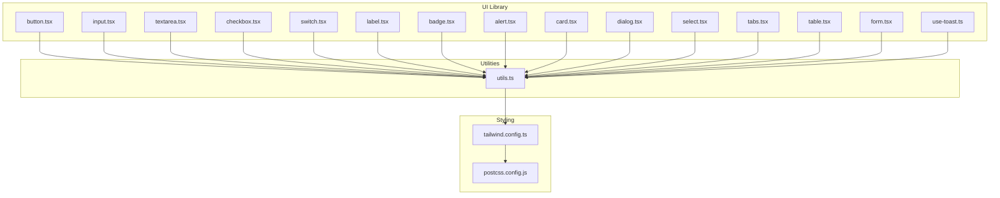

**Diagram sources**
- [button.tsx](file://personalSite/src/components/ui/button.tsx#L1-L48)
- [input.tsx](file://personalSite/src/components/ui/input.tsx#L1-L23)
- [textarea.tsx](file://personalSite/src/components/ui/textarea.tsx#L1-L22)
- [checkbox.tsx](file://personalSite/src/components/ui/checkbox.tsx#L1-L27)
- [switch.tsx](file://personalSite/src/components/ui/switch.tsx#L1-L28)
- [label.tsx](file://personalSite/src/components/ui/label.tsx#L1-L18)
- [badge.tsx](file://personalSite/src/components/ui/badge.tsx#L1-L30)
- [alert.tsx](file://personalSite/src/components/ui/alert.tsx#L1-L44)
- [card.tsx](file://personalSite/src/components/ui/card.tsx#L1-L44)
- [dialog.tsx](file://personalSite/src/components/ui/dialog.tsx#L1-L98)
- [select.tsx](file://personalSite/src/components/ui/select.tsx#L1-L144)
- [tabs.tsx](file://personalSite/src/components/ui/tabs.tsx#L1-L54)
- [table.tsx](file://personalSite/src/components/ui/table.tsx#L1-L73)
- [form.tsx](file://personalSite/src/components/ui/form.tsx#L1-L130)
- [use-toast.ts](file://personalSite/src/components/ui/use-toast.ts#L1-L4)
- [utils.ts](file://personalSite/src/lib/utils.ts#L1-L7)
- [tailwind.config.ts](file://personalSite/tailwind.config.ts#L1-L117)
- [postcss.config.js](file://personalSite/postcss.config.js#L1-L7)

**Section sources**
- [button.tsx](file://personalSite/src/components/ui/button.tsx#L1-L48)
- [utils.ts](file://personalSite/src/lib/utils.ts#L1-L7)
- [tailwind.config.ts](file://personalSite/tailwind.config.ts#L1-L117)
- [postcss.config.js](file://personalSite/postcss.config.js#L1-L7)

## Core Components
This section summarizes the primary categories of components and their roles in the design system.

- Buttons and Inputs: Base building blocks for actions and text entry, with consistent variants and sizes.
- Forms: A structured form system leveraging react-hook-form and Radix UI labels for accessibility.
- Layout: Cards, tables, and dialogs for organizing content and managing overlays.
- Interactive: Select menus, tabs, checkboxes, switches, and badges for user interaction.
- Feedback: Alerts and toasts for communicating state and messages.

Key implementation patterns:
- Variants and sizes are standardized using class-variance-authority (cva) to ensure consistent styling across components.
- Class merging is handled by a single cn function that combines clsx and tailwind-merge to avoid conflicts.
- Components forward refs and spread props to maintain composability and compatibility with parent layouts.

**Section sources**
- [button.tsx](file://personalSite/src/components/ui/button.tsx#L7-L31)
- [input.tsx](file://personalSite/src/components/ui/input.tsx#L5-L18)
- [form.tsx](file://personalSite/src/components/ui/form.tsx#L1-L130)
- [card.tsx](file://personalSite/src/components/ui/card.tsx#L5-L43)
- [dialog.tsx](file://personalSite/src/components/ui/dialog.tsx#L15-L54)
- [select.tsx](file://personalSite/src/components/ui/select.tsx#L13-L91)
- [table.tsx](file://personalSite/src/components/ui/table.tsx#L5-L72)
- [tabs.tsx](file://personalSite/src/components/ui/tabs.tsx#L8-L51)
- [badge.tsx](file://personalSite/src/components/ui/badge.tsx#L6-L21)
- [alert.tsx](file://personalSite/src/components/ui/alert.tsx#L6-L19)
- [label.tsx](file://personalSite/src/components/ui/label.tsx#L7-L14)
- [textarea.tsx](file://personalSite/src/components/ui/textarea.tsx#L7-L18)
- [checkbox.tsx](file://personalSite/src/components/ui/checkbox.tsx#L7-L23)
- [switch.tsx](file://personalSite/src/components/ui/switch.tsx#L6-L24)
- [use-toast.ts](file://personalSite/src/components/ui/use-toast.ts#L1-L4)
- [utils.ts](file://personalSite/src/lib/utils.ts#L4-L6)

## Architecture Overview
The component library architecture centers on three pillars:
- Design tokens and theme: Tailwind CSS with CSS custom properties and extended color palettes.
- Utility layer: A cn function that merges classes deterministically.
- Component layer: Reusable UI primitives composed with Radix UI and styled via Tailwind.

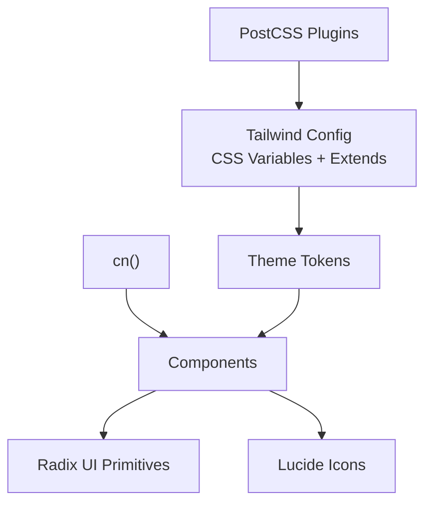

**Diagram sources**
- [tailwind.config.ts](file://personalSite/tailwind.config.ts#L15-L116)
- [postcss.config.js](file://personalSite/postcss.config.js#L1-L7)
- [utils.ts](file://personalSite/src/lib/utils.ts#L4-L6)
- [button.tsx](file://personalSite/src/components/ui/button.tsx#L1-L6)
- [dialog.tsx](file://personalSite/src/components/ui/dialog.tsx#L1-L6)
- [select.tsx](file://personalSite/src/components/ui/select.tsx#L1-L6)

## Detailed Component Analysis

### Button
- Purpose: Standardized action element with variants (default, destructive, outline, secondary, ghost, link) and sizes (default, sm, lg, icon).
- Composition: Uses Slot to optionally render as a child element; merges variant classes with incoming className.
- Accessibility: Inherits native button semantics; supports focus-visible outlines and disabled states.

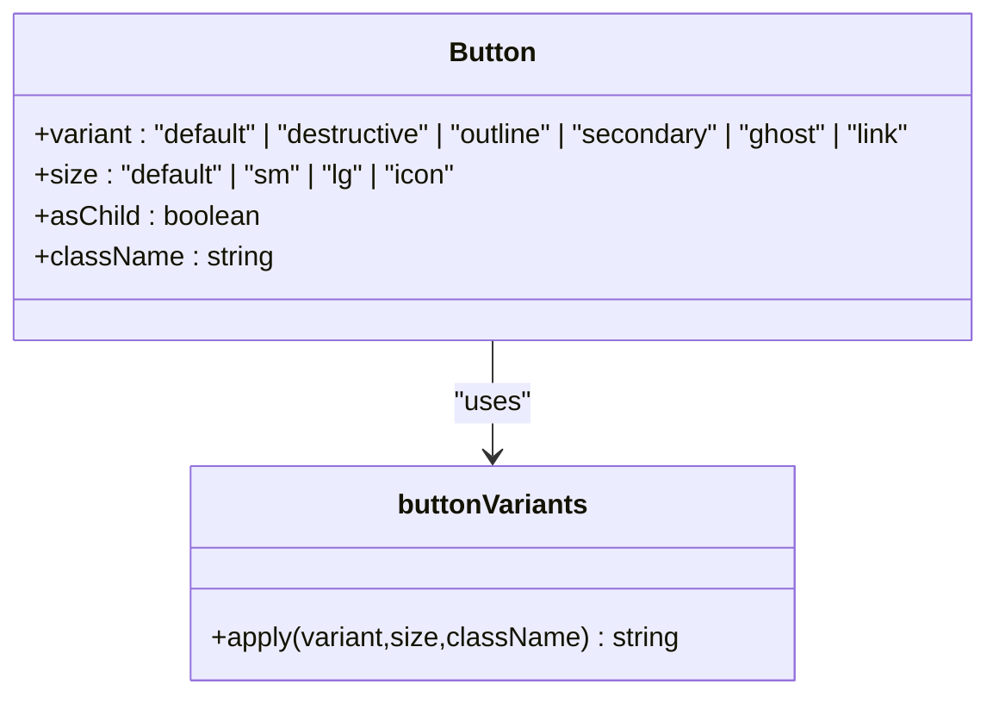

**Diagram sources**
- [button.tsx](file://personalSite/src/components/ui/button.tsx#L7-L45)

**Section sources**
- [button.tsx](file://personalSite/src/components/ui/button.tsx#L33-L47)

### Input and Textarea
- Purpose: Text entry fields with consistent focus states, disabled handling, and placeholder styling.
- Composition: Forward refs with className merging; textarea adds min-height for better UX.

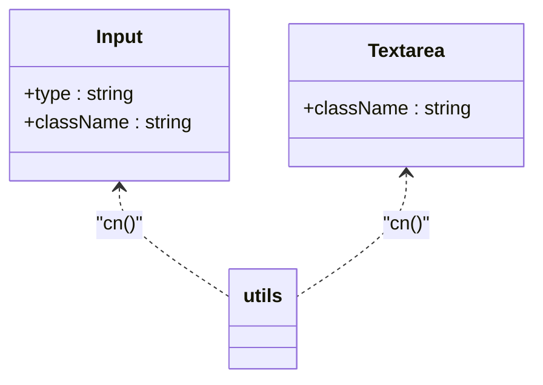

**Diagram sources**
- [input.tsx](file://personalSite/src/components/ui/input.tsx#L5-L18)
- [textarea.tsx](file://personalSite/src/components/ui/textarea.tsx#L7-L18)
- [utils.ts](file://personalSite/src/lib/utils.ts#L4-L6)

**Section sources**
- [input.tsx](file://personalSite/src/components/ui/input.tsx#L1-L23)
- [textarea.tsx](file://personalSite/src/components/ui/textarea.tsx#L1-L22)

### Checkbox and Switch
- Purpose: Binary selection controls with accessible states and keyboard support.
- Composition: Use Radix UI primitives; indicator/thumbs reflect checked state with transitions.

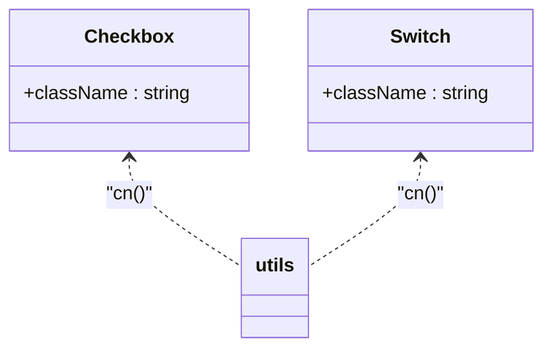

**Diagram sources**
- [checkbox.tsx](file://personalSite/src/components/ui/checkbox.tsx#L7-L23)
- [switch.tsx](file://personalSite/src/components/ui/switch.tsx#L6-L24)
- [utils.ts](file://personalSite/src/lib/utils.ts#L4-L6)

**Section sources**
- [checkbox.tsx](file://personalSite/src/components/ui/checkbox.tsx#L1-L27)
- [switch.tsx](file://personalSite/src/components/ui/switch.tsx#L1-L28)

### Label
- Purpose: Associates text with form controls for accessibility.
- Composition: Uses cva for label-specific variants and forwards to Radix UI.

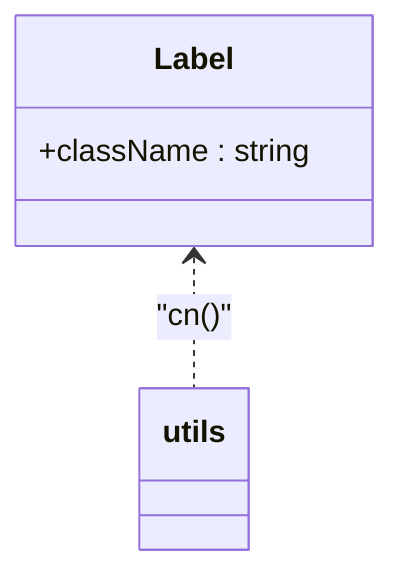

**Diagram sources**
- [label.tsx](file://personalSite/src/components/ui/label.tsx#L9-L15)
- [utils.ts](file://personalSite/src/lib/utils.ts#L4-L6)

**Section sources**
- [label.tsx](file://personalSite/src/components/ui/label.tsx#L1-L18)

### Badge
- Purpose: Short status or metadata labels with variant styling.
- Composition: cva-based variant mapping; renders a div with merged classes.

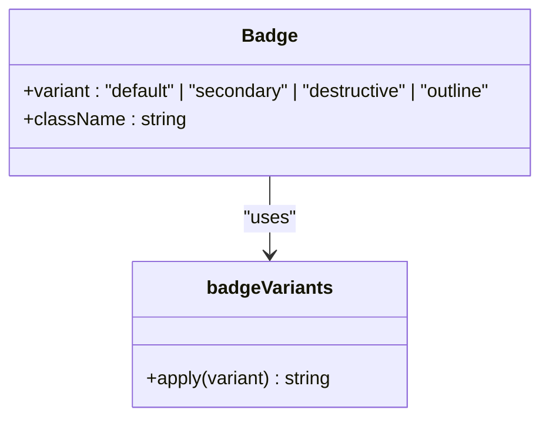

**Diagram sources**
- [badge.tsx](file://personalSite/src/components/ui/badge.tsx#L6-L27)

**Section sources**
- [badge.tsx](file://personalSite/src/components/ui/badge.tsx#L1-L30)

### Alert
- Purpose: Communicates contextual information with optional destructive styling.
- Composition: Uses cva for variant mapping and applies role="alert".

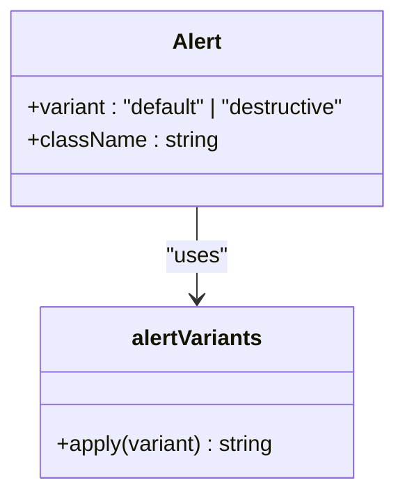

**Diagram sources**
- [alert.tsx](file://personalSite/src/components/ui/alert.tsx#L6-L26)

**Section sources**
- [alert.tsx](file://personalSite/src/components/ui/alert.tsx#L1-L44)

### Card
- Purpose: Encapsulates content with consistent spacing, borders, and shadows.
- Composition: Header, Title, Description, Content, Footer subcomponents.

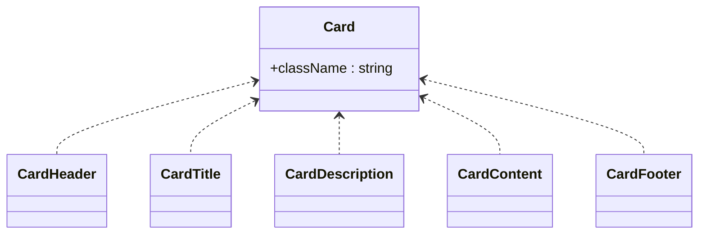

**Diagram sources**
- [card.tsx](file://personalSite/src/components/ui/card.tsx#L5-L43)

**Section sources**
- [card.tsx](file://personalSite/src/components/ui/card.tsx#L1-L44)

### Dialog
- Purpose: Modal overlays with animated entrance/exit and accessible close behavior.
- Composition: Root, Trigger, Portal, Overlay, Content, Header/Footer, Title, Description.

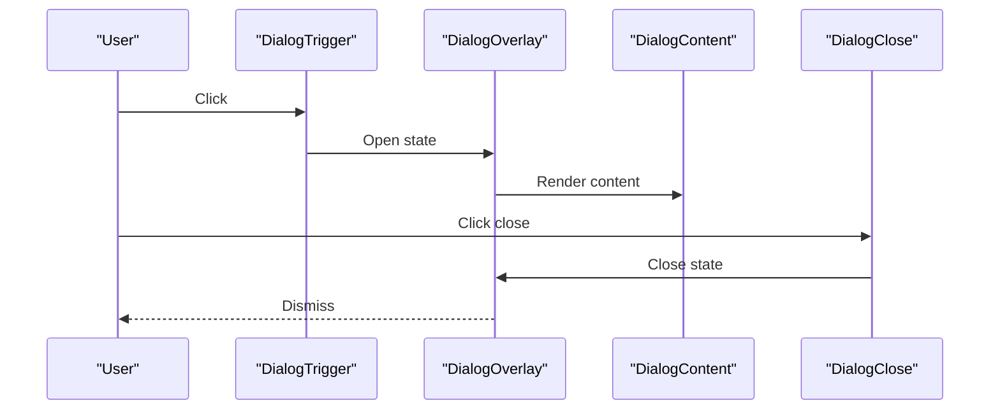

**Diagram sources**
- [dialog.tsx](file://personalSite/src/components/ui/dialog.tsx#L7-L54)

**Section sources**
- [dialog.tsx](file://personalSite/src/components/ui/dialog.tsx#L1-L98)

### Select
- Purpose: Dropdown selection with scrollable viewport, icons, and item indicators.
- Composition: Root, Group, Value, Trigger, Content, Label, Item, Separator, Scroll buttons.

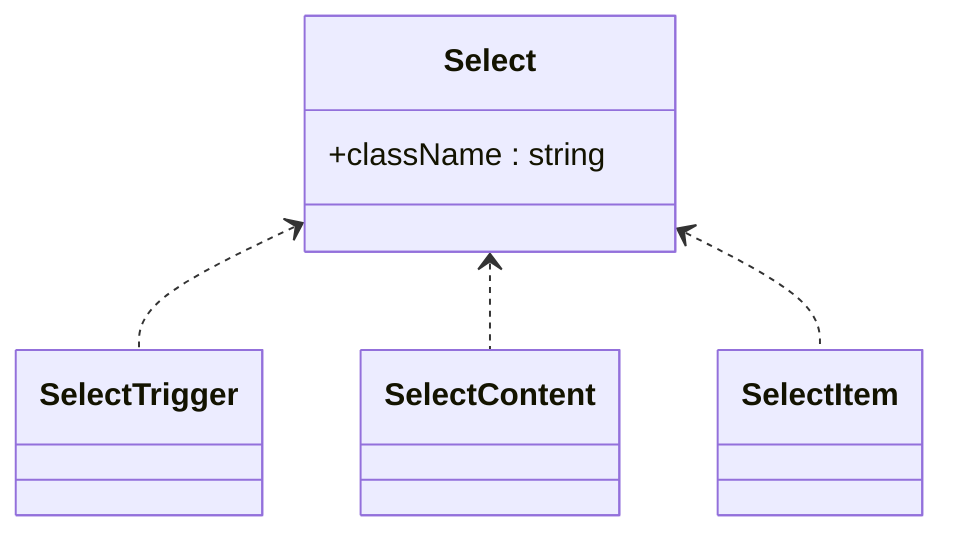

**Diagram sources**
- [select.tsx](file://personalSite/src/components/ui/select.tsx#L7-L91)

**Section sources**
- [select.tsx](file://personalSite/src/components/ui/select.tsx#L1-L144)

### Tabs
- Purpose: Organize related content into selectable sections.
- Composition: Root, List, Trigger, Content.

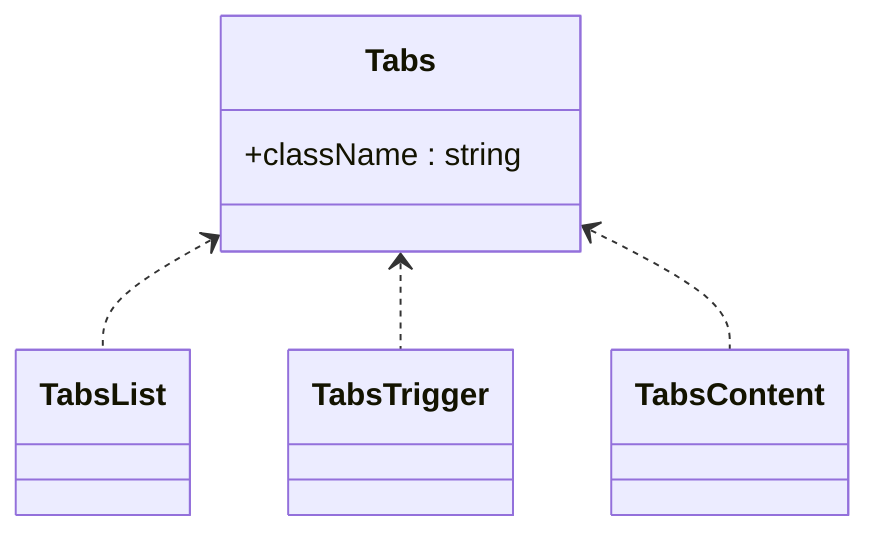

**Diagram sources**
- [tabs.tsx](file://personalSite/src/components/ui/tabs.tsx#L6-L51)

**Section sources**
- [tabs.tsx](file://personalSite/src/components/ui/tabs.tsx#L1-L54)

### Table
- Purpose: Present tabular data with responsive wrapper and semantic markup.
- Composition: Table, TableHeader, TableBody, TableFooter, TableRow, TableHead, TableCell, TableCaption.

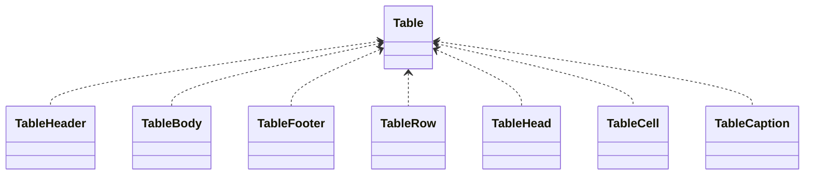

**Diagram sources**
- [table.tsx](file://personalSite/src/components/ui/table.tsx#L5-L72)

**Section sources**
- [table.tsx](file://personalSite/src/components/ui/table.tsx#L1-L73)

### Form System
- Purpose: Structured forms with react-hook-form integration and accessible labeling.
- Composition: Form (provider), FormField (controller), FormItem (context provider), FormLabel, FormControl, FormDescription, FormMessage, useFormField hook.

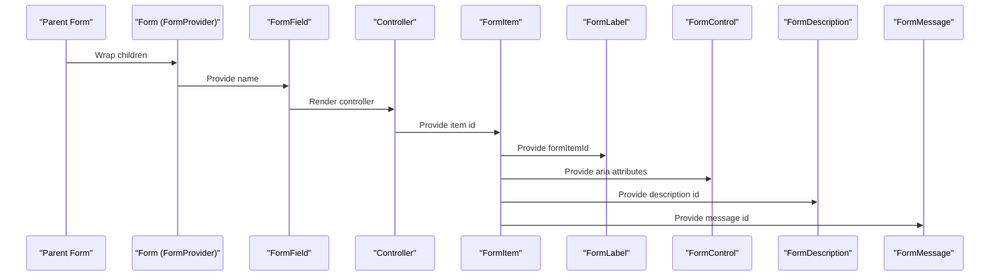

**Diagram sources**
- [form.tsx](file://personalSite/src/components/ui/form.tsx#L9-L129)

**Section sources**
- [form.tsx](file://personalSite/src/components/ui/form.tsx#L1-L130)

### Toast Utilities
- Purpose: Provide toast notifications via a thin export of hooks/use-toast.
- Composition: Re-exports from hooks for global toast integration.

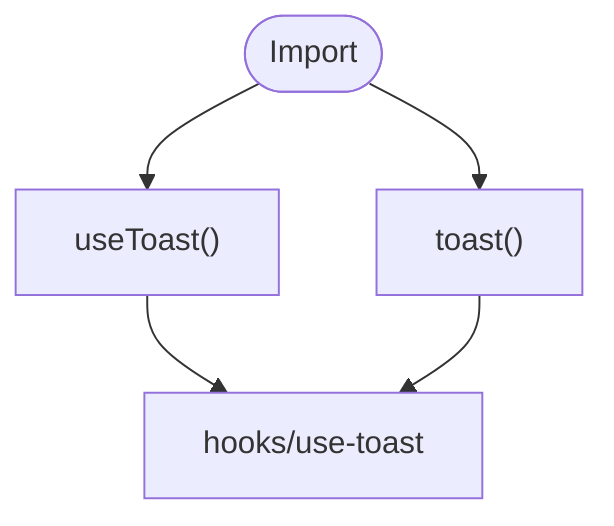

**Diagram sources**
- [use-toast.ts](file://personalSite/src/components/ui/use-toast.ts#L1-L4)

**Section sources**
- [use-toast.ts](file://personalSite/src/components/ui/use-toast.ts#L1-L4)

## Dependency Analysis
The component library exhibits low coupling and high cohesion:
- Shared dependency: cn utility consolidates class merging.
- Theme dependency: Tailwind CSS with CSS custom properties powers all component colors and spacing.
- Primitive dependency: Radix UI provides accessible base behaviors; Lucide icons supply visual indicators.

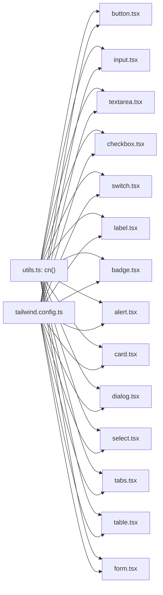

**Diagram sources**
- [utils.ts](file://personalSite/src/lib/utils.ts#L4-L6)
- [tailwind.config.ts](file://personalSite/tailwind.config.ts#L15-L116)
- [button.tsx](file://personalSite/src/components/ui/button.tsx#L1-L6)
- [input.tsx](file://personalSite/src/components/ui/input.tsx#L1-L6)
- [textarea.tsx](file://personalSite/src/components/ui/textarea.tsx#L1-L6)
- [checkbox.tsx](file://personalSite/src/components/ui/checkbox.tsx#L1-L6)
- [switch.tsx](file://personalSite/src/components/ui/switch.tsx#L1-L6)
- [label.tsx](file://personalSite/src/components/ui/label.tsx#L1-L6)
- [badge.tsx](file://personalSite/src/components/ui/badge.tsx#L1-L6)
- [alert.tsx](file://personalSite/src/components/ui/alert.tsx#L1-L6)
- [card.tsx](file://personalSite/src/components/ui/card.tsx#L1-L6)
- [dialog.tsx](file://personalSite/src/components/ui/dialog.tsx#L1-L6)
- [select.tsx](file://personalSite/src/components/ui/select.tsx#L1-L6)
- [tabs.tsx](file://personalSite/src/components/ui/tabs.tsx#L1-L6)
- [table.tsx](file://personalSite/src/components/ui/table.tsx#L1-L6)
- [form.tsx](file://personalSite/src/components/ui/form.tsx#L1-L8)

**Section sources**
- [utils.ts](file://personalSite/src/lib/utils.ts#L1-L7)
- [tailwind.config.ts](file://personalSite/tailwind.config.ts#L1-L117)

## Performance Considerations
- Prefer variant props over ad-hoc className overrides to keep the number of generated classes minimal.
- Use the cn utility consistently to avoid redundant or conflicting classes.
- Limit deep nesting in composite components (e.g., Card, Dialog) to reduce reflow and repaint costs.
- Defer heavy computations inside component render bodies; memoize derived values when appropriate.

## Troubleshooting Guide
Common issues and resolutions:
- Conflicting classes: Ensure all className props are merged via cn to prevent Tailwind conflicts.
- Missing focus rings or outlines: Verify that focus-visible utilities are present in component classes.
- Form accessibility errors: Confirm that FormLabel is used with FormControl and that aria attributes are set by FormControl.
- Disabled states not applying: Check that disabled classes are included in component variants and that the disabled prop is respected.

**Section sources**
- [utils.ts](file://personalSite/src/lib/utils.ts#L4-L6)
- [form.tsx](file://personalSite/src/components/ui/form.tsx#L85-L99)

## Conclusion
The component library leverages shadcn/ui patterns with a strong emphasis on consistency, accessibility, and maintainability. By centralizing class merging, standardizing variants, and integrating deeply with Tailwind’s design tokens, the system scales predictably across the application. The form system and interactive components provide robust, accessible building blocks for complex UIs.

## Appendices

### Theme Integration and Tailwind Configuration
- CSS custom properties define semantic tokens for foreground, background, primary, secondary, muted, accent, popover, card, and sidebar.
- Extended color palette includes neutral hues and a neon palette for special effects.
- Typography and shadows are extended for consistent visual rhythm.
- Animations and keyframes support smooth transitions and micro-interactions.

**Section sources**
- [tailwind.config.ts](file://personalSite/tailwind.config.ts#L16-L116)

### Class Merging Utility
- The cn function combines clsx and tailwind-merge to merge class lists while resolving conflicts deterministically.

**Section sources**
- [utils.ts](file://personalSite/src/lib/utils.ts#L4-L6)

### Accessibility Features
- Components use Radix UI primitives to provide accessible ARIA attributes and keyboard interactions.
- Focus management and focus-visible outlines are consistently applied.
- Form components automatically wire labels, descriptions, and error messages to inputs.

**Section sources**
- [form.tsx](file://personalSite/src/components/ui/form.tsx#L75-L127)
- [label.tsx](file://personalSite/src/components/ui/label.tsx#L9-L15)
- [button.tsx](file://personalSite/src/components/ui/button.tsx#L39-L45)

### Usage Examples and Customization Guidelines
- Customize variants by extending cva definitions per component and adding new variant keys.
- Override className via the className prop; rely on cn to merge safely.
- Integrate with Tailwind by using semantic color tokens and spacing utilities defined in the theme.

[No sources needed since this section provides general guidance]

### Testing Approach and Maintenance Strategies
- Unit tests: Test component rendering with different variants and sizes; assert className combinations via snapshot or matcher-based tests.
- Integration tests: Validate form wiring with react-hook-form; ensure labels, descriptions, and error messages are connected.
- Accessibility tests: Use automated tools to verify ARIA attributes and keyboard navigation.
- Maintenance: Keep cva variants aligned with design specs; update cn usage when adding new variants; periodically audit Tailwind classes for unused styles.

[No sources needed since this section provides general guidance]