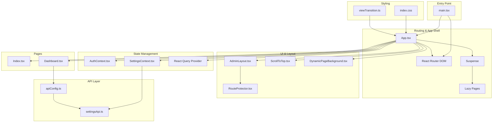
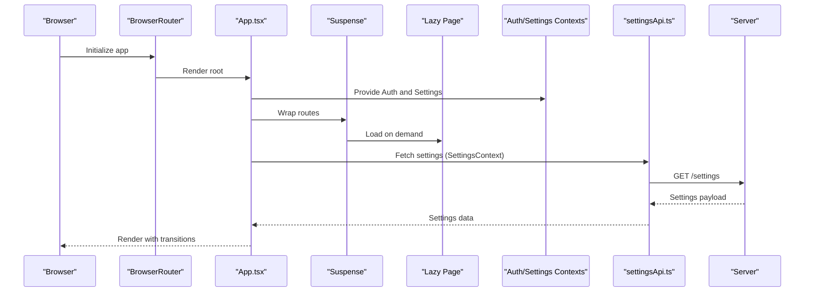
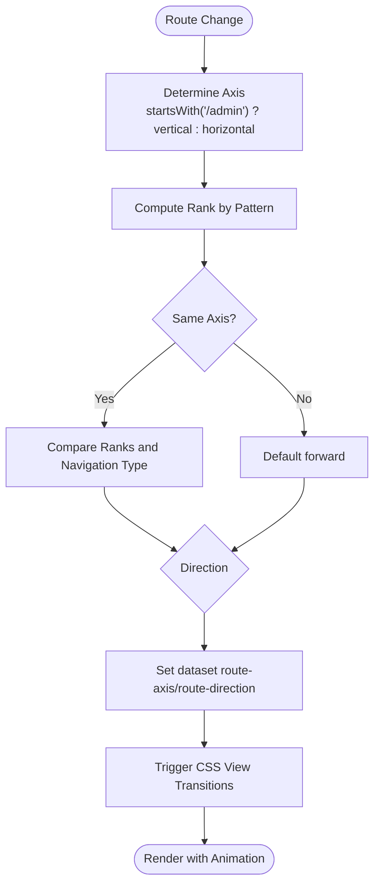
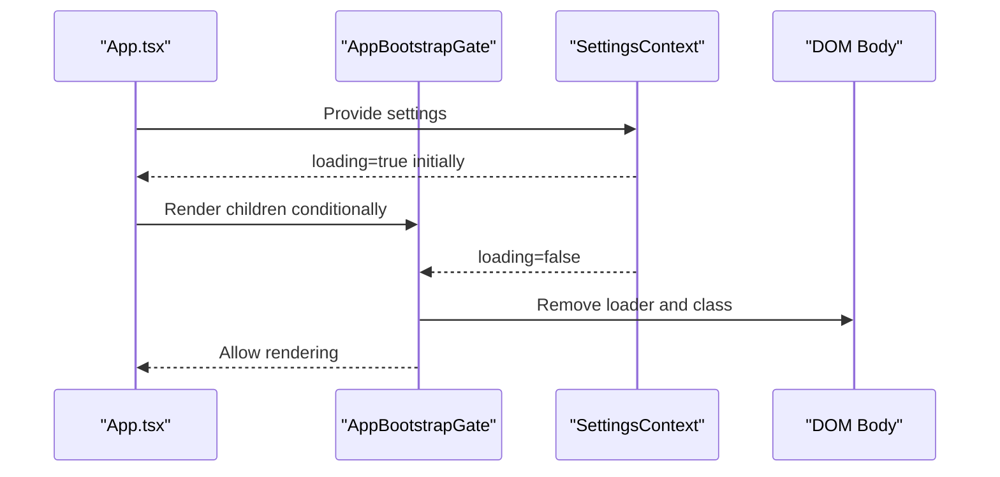
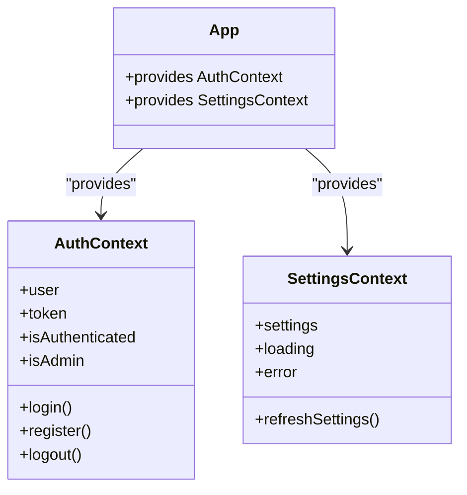
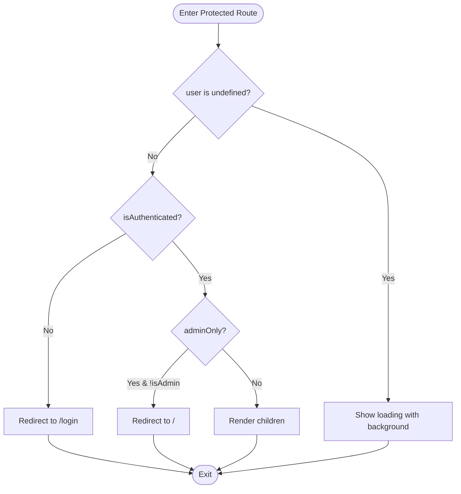
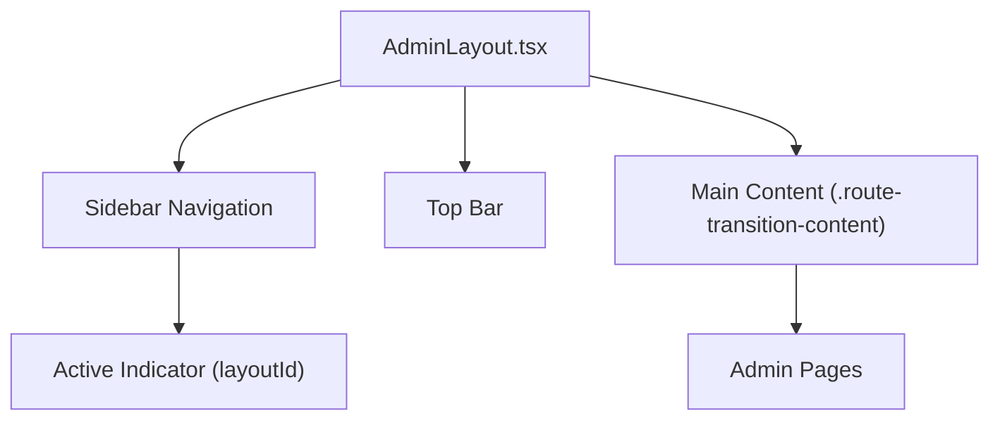
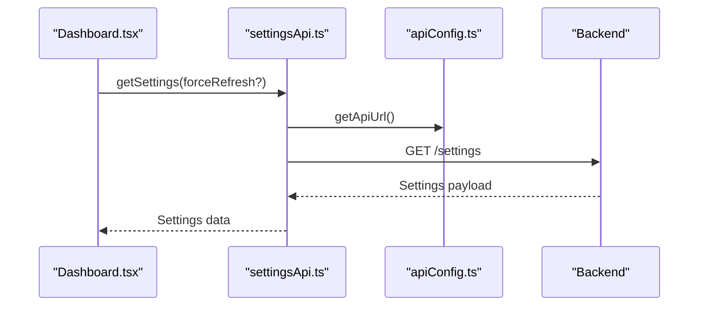
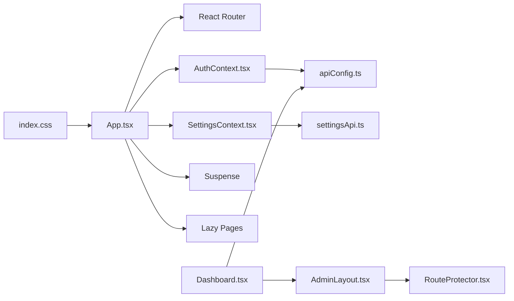

# Personal Site Application

<cite>
**Referenced Files in This Document**
- [App.tsx](file://personalSite/src/App.tsx)
- [main.tsx](file://personalSite/src/main.tsx)
- [AuthContext.tsx](file://personalSite/src/contexts/AuthContext.tsx)
- [SettingsContext.tsx](file://personalSite/src/contexts/SettingsContext.tsx)
- [RouteProtector.tsx](file://personalSite/src/components<RouteProtector.tsx)
- [AdminLayout.tsx](file://personalSite/src/components/layout/AdminLayout.tsx)
- [Dashboard.tsx](file://personalSite/src/pages/Admin/Dashboard.tsx)
- [settingsApi.ts](file://personalSite/src/api/settingsApi.ts)
- [apiConfig.ts](file://personalSite/src/lib/apiConfig.ts)
- [viewTransition.ts](file://personalSite/src/lib/viewTransition.ts)
- [index.css](file://personalSite/src/index.css)
- [ScrollToTop.tsx](file://personalSite/src/components/ScrollToTop.tsx)
- [DynamicPageBackground.tsx](file://personalSite/src/components/DynamicPageBackground.tsx)
- [Index.tsx](file://personalSite/src/pages/Index.tsx)
</cite>

## Table of Contents
1. [Introduction](#introduction)
2. [Project Structure](#project-structure)
3. [Core Components](#core-components)
4. [Architecture Overview](#architecture-overview)
5. [Detailed Component Analysis](#detailed-component-analysis)
6. [Dependency Analysis](#dependency-analysis)
7. [Performance Considerations](#performance-considerations)
8. [Troubleshooting Guide](#troubleshooting-guide)
9. [Conclusion](#conclusion)

## Introduction
This document describes the Personal Site application, a modern React portfolio built with contemporary frontend technologies. It focuses on the component hierarchy starting from the root App, the routing system with React Router, lazy loading and route transition animations, state management via Context API and React Query, the dual-axis navigation model (horizontal/vertical routes), the admin layout system, protected routes, and the bootstrapping mechanism. It also documents component composition patterns, suspense boundaries, the custom transition system with CSS transforms, backend integration, error handling strategies, and performance optimizations.

## Project Structure
The application is organized around a clear separation of concerns:
- Root entry initializes the router provider and helmet provider, sets up session-based redirect handling, and mounts the React root.
- App orchestrates routing, lazy-loaded pages, Suspense fallback, Context providers, and route transition logic.
- Contexts manage authentication and site-wide settings.
- Components encapsulate UI and layout concerns, including a responsive admin layout.
- Pages implement route handlers for public and admin areas.
- APIs abstract backend integration with caching and timeouts.
- CSS defines animations, transitions, and design tokens.

**Diagram sources**
- [main.tsx](file://personalSite/src/main.tsx#L17-L23)
- [App.tsx](file://personalSite/src/App.tsx#L141-L356)
- [AuthContext.tsx](file://personalSite/src/contexts/AuthContext.tsx#L36-L140)
- [SettingsContext.tsx](file://personalSite/src/contexts/SettingsContext.tsx#L71-L126)
- [AdminLayout.tsx](file://personalSite/src/components/layout/AdminLayout.tsx#L32-L294)
- [RouteProtector.tsx](file://personalSite/src/components/RouteProtector.tsx#L10-L41)
- [ScrollToTop.tsx](file://personalSite/src/components/ScrollToTop.tsx#L5-L42)
- [DynamicPageBackground.tsx](file://personalSite/src/components/DynamicPageBackground.tsx#L6-L25)
- [Index.tsx](file://personalSite/src/pages/Index.tsx#L12-L66)
- [Dashboard.tsx](file://personalSite/src/pages/Admin/Dashboard.tsx#L79-L348)
- [settingsApi.ts](file://personalSite/src/api/settingsApi.ts#L48-L96)
- [apiConfig.ts](file://personalSite/src/lib/apiConfig.ts#L6-L52)
- [index.css](file://personalSite/src/index.css#L180-L336)
- [viewTransition.ts](file://personalSite/src/lib/viewTransition.ts#L17-L30)

**Section sources**
- [main.tsx](file://personalSite/src/main.tsx#L1-L26)
- [App.tsx](file://personalSite/src/App.tsx#L141-L356)

## Core Components
- App shell and routing orchestration with dual-axis transitions and Suspense fallback.
- Authentication context with token validation and secure storage.
- Settings context with caching, timeouts, and default fallbacks.
- Protected route guard for admin-only access.
- Admin layout with persistent sidebar and top bar.
- Dashboard page integrating backend data via API.
- Lazy-loaded pages and route transition animations.
- Scroll-to-top behavior and dynamic page background.

**Section sources**
- [App.tsx](file://personalSite/src/App.tsx#L141-L356)
- [AuthContext.tsx](file://personalSite/src/contexts/AuthContext.tsx#L36-L140)
- [SettingsContext.tsx](file://personalSite/src/contexts/SettingsContext.tsx#L71-L126)
- [RouteProtector.tsx](file://personalSite/src/components/RouteProtector.tsx#L10-L41)
- [AdminLayout.tsx](file://personalSite/src/components/layout/AdminLayout.tsx#L32-L294)
- [Dashboard.tsx](file://personalSite/src/pages/Admin/Dashboard.tsx#L79-L348)
- [ScrollToTop.tsx](file://personalSite/src/components/ScrollToTop.tsx#L5-L42)
- [DynamicPageBackground.tsx](file://personalSite/src/components/DynamicPageBackground.tsx#L6-L25)

## Architecture Overview
The application follows a layered architecture:
- Presentation layer: React components, pages, and layouts.
- Routing and navigation: React Router with lazy loading and Suspense.
- State management: Context API for auth and settings, React Query for data fetching.
- Backend integration: Centralized API configuration and typed API modules.
- Styling and animations: Tailwind CSS, CSS view transitions, and custom keyframes.

**Diagram sources**
- [main.tsx](file://personalSite/src/main.tsx#L17-L23)
- [App.tsx](file://personalSite/src/App.tsx#L240-L356)
- [SettingsContext.tsx](file://personalSite/src/contexts/SettingsContext.tsx#L76-L112)
- [settingsApi.ts](file://personalSite/src/api/settingsApi.ts#L48-L70)
- [apiConfig.ts](file://personalSite/src/lib/apiConfig.ts#L6-L52)

## Detailed Component Analysis

### Routing System and Dual-Axis Transitions
- Routes are defined with lazy imports for all pages, ensuring code-split bundles.
- A custom transition system computes axis (horizontal vs vertical) and direction (forward/backward) based on route patterns and navigation type.
- CSS view transitions and keyframes define the animation for each axis/direction combination.
- Suspense provides a loading fallback during route transitions.

**Diagram sources**
- [App.tsx](file://personalSite/src/App.tsx#L78-L177)
- [index.css](file://personalSite/src/index.css#L234-L336)

**Section sources**
- [App.tsx](file://personalSite/src/App.tsx#L45-L86)
- [App.tsx](file://personalSite/src/App.tsx#L146-L229)
- [index.css](file://personalSite/src/index.css#L180-L336)

### Bootstrapping Mechanism
- The SettingsContext initiates a fetch on mount with a timeout and default fallback.
- The AppBootstrapGate waits for SettingsContext to finish loading before rendering child routes.
- A dedicated loader element is removed after a short delay to finalize the bootstrap.

**Diagram sources**
- [SettingsContext.tsx](file://personalSite/src/contexts/SettingsContext.tsx#L71-L126)
- [App.tsx](file://personalSite/src/App.tsx#L100-L139)
- [index.css](file://personalSite/src/index.css#L33-L36)

**Section sources**
- [SettingsContext.tsx](file://personalSite/src/contexts/SettingsContext.tsx#L76-L112)
- [App.tsx](file://personalSite/src/App.tsx#L100-L139)

### State Management Architecture
- AuthContext manages user session, token persistence, and profile validation against the backend.
- SettingsContext centralizes site configuration with caching, timeouts, and default values.
- Both contexts are provided at the root level and consumed by components and pages.

**Diagram sources**
- [AuthContext.tsx](file://personalSite/src/contexts/AuthContext.tsx#L12-L140)
- [SettingsContext.tsx](file://personalSite/src/contexts/SettingsContext.tsx#L48-L126)
- [App.tsx](file://personalSite/src/App.tsx#L232-L238)

**Section sources**
- [AuthContext.tsx](file://personalSite/src/contexts/AuthContext.tsx#L36-L140)
- [SettingsContext.tsx](file://personalSite/src/contexts/SettingsContext.tsx#L71-L126)

### Protected Routes Implementation
- RouteProtector checks authentication and admin privileges, redirecting unauthenticated or unauthorized users.
- While user state resolves, a loading screen with background animation is shown.

**Diagram sources**
- [RouteProtector.tsx](file://personalSite/src/components/RouteProtector.tsx#L10-L41)

**Section sources**
- [RouteProtector.tsx](file://personalSite/src/components/RouteProtector.tsx#L10-L41)

### Admin Layout System
- AdminLayout provides a persistent sidebar and top bar, with animated navigation items and active indicators.
- The layout wraps admin pages and enforces protection via RouteProtector.
- The main content area receives the transition class for animations.

**Diagram sources**
- [AdminLayout.tsx](file://personalSite/src/components/layout/AdminLayout.tsx#L132-L294)

**Section sources**
- [AdminLayout.tsx](file://personalSite/src/components/layout/AdminLayout.tsx#L32-L294)

### Integration with Backend API
- API base URL is resolved from environment variables with development and production overrides.
- settingsApi implements caching and timeout handling, with cache invalidation on updates.
- Dashboard consumes enhanced dashboard data via dashboardApi and displays statistics and recent activity.

**Diagram sources**
- [Dashboard.tsx](file://personalSite/src/pages/Admin/Dashboard.tsx#L86-L105)
- [settingsApi.ts](file://personalSite/src/api/settingsApi.ts#L48-L70)
- [apiConfig.ts](file://personalSite/src/lib/apiConfig.ts#L6-L52)

**Section sources**
- [apiConfig.ts](file://personalSite/src/lib/apiConfig.ts#L6-L52)
- [settingsApi.ts](file://personalSite/src/api/settingsApi.ts#L48-L96)
- [Dashboard.tsx](file://personalSite/src/pages/Admin/Dashboard.tsx#L79-L105)

### Component Composition Patterns
- App composes Providers, Suspense, lazy routes, and guards.
- Index page composes sections and uses settings to conditionally render content.
- DynamicPageBackground provides a layered animated background for both public and admin views.

**Section sources**
- [App.tsx](file://personalSite/src/App.tsx#L232-L356)
- [Index.tsx](file://personalSite/src/pages/Index.tsx#L12-L66)
- [DynamicPageBackground.tsx](file://personalSite/src/components/DynamicPageBackground.tsx#L6-L25)

### Suspense Boundaries and Lazy Loading
- Lazy imports are used for all pages and admin components.
- Suspense fallback displays a spinner and background animation during chunk load.
- ScrollToTop ensures smooth navigation and hash-based scrolling.

**Section sources**
- [App.tsx](file://personalSite/src/App.tsx#L14-L31)
- [App.tsx](file://personalSite/src/App.tsx#L240-L356)
- [ScrollToTop.tsx](file://personalSite/src/components/ScrollToTop.tsx#L5-L42)

### Custom Transition System with CSS Transforms
- The transition engine calculates axis and direction, applies dataset attributes, and triggers CSS view transitions.
- Keyframes define enter/exit animations per axis and direction.
- A dedicated content class enables hardware-accelerated transforms and containment.

**Section sources**
- [App.tsx](file://personalSite/src/App.tsx#L146-L229)
- [index.css](file://personalSite/src/index.css#L180-L336)

## Dependency Analysis
- App depends on routing, lazy modules, Context providers, and Suspense.
- AuthContext depends on apiConfig for backend URLs.
- SettingsContext depends on settingsApi and provides defaults.
- AdminLayout depends on AuthContext and RouteProtector.
- Dashboard depends on dashboardApi and AuthContext.
- CSS depends on App’s dataset attributes to drive animations.

**Diagram sources**
- [App.tsx](file://personalSite/src/App.tsx#L141-L356)
- [AuthContext.tsx](file://personalSite/src/contexts/AuthContext.tsx#L36-L140)
- [SettingsContext.tsx](file://personalSite/src/contexts/SettingsContext.tsx#L71-L126)
- [AdminLayout.tsx](file://personalSite/src/components/layout/AdminLayout.tsx#L32-L294)
- [RouteProtector.tsx](file://personalSite/src/components/RouteProtector.tsx#L10-L41)
- [Dashboard.tsx](file://personalSite/src/pages/Admin/Dashboard.tsx#L79-L348)
- [settingsApi.ts](file://personalSite/src/api/settingsApi.ts#L48-L96)
- [apiConfig.ts](file://personalSite/src/lib/apiConfig.ts#L6-L52)
- [index.css](file://personalSite/src/index.css#L180-L336)

**Section sources**
- [App.tsx](file://personalSite/src/App.tsx#L141-L356)
- [AuthContext.tsx](file://personalSite/src/contexts/AuthContext.tsx#L36-L140)
- [SettingsContext.tsx](file://personalSite/src/contexts/SettingsContext.tsx#L71-L126)
- [AdminLayout.tsx](file://personalSite/src/components/layout/AdminLayout.tsx#L32-L294)
- [RouteProtector.tsx](file://personalSite/src/components/RouteProtector.tsx#L10-L41)
- [Dashboard.tsx](file://personalSite/src/pages/Admin/Dashboard.tsx#L79-L348)
- [settingsApi.ts](file://personalSite/src/api/settingsApi.ts#L48-L96)
- [apiConfig.ts](file://personalSite/src/lib/apiConfig.ts#L6-L52)
- [index.css](file://personalSite/src/index.css#L180-L336)

## Performance Considerations
- Code splitting: Lazy loading of routes reduces initial bundle size.
- Suspense: Provides seamless fallbacks during chunk load.
- Hardware acceleration: CSS transforms and will-change optimize animations.
- Containment: Using contain: paint and transform3d classes improves rendering performance.
- Caching: settingsApi caches responses and invalidates on updates.
- Timeout handling: SettingsContext prevents long-loading states with default fallbacks.

[No sources needed since this section provides general guidance]

## Troubleshooting Guide
- Authentication errors: Verify token presence and validity; check network requests and server responses.
- Settings loading failures: Inspect timeout logic and default fallback behavior.
- Route transitions not animating: Ensure dataset attributes are applied and CSS keyframes match axis/direction.
- Scroll behavior: Confirm ScrollToTop is rendered and hash navigation timing.

**Section sources**
- [AuthContext.tsx](file://personalSite/src/contexts/AuthContext.tsx#L58-L76)
- [SettingsContext.tsx](file://personalSite/src/contexts/SettingsContext.tsx#L95-L107)
- [App.tsx](file://personalSite/src/App.tsx#L174-L229)
- [ScrollToTop.tsx](file://personalSite/src/components/ScrollToTop.tsx#L11-L38)

## Conclusion
The Personal Site application demonstrates a modern React architecture with robust routing, lazy loading, and a custom transition system. Context-based state management, centralized API configuration, and thoughtful performance optimizations deliver a smooth, accessible user experience across public and admin sections.