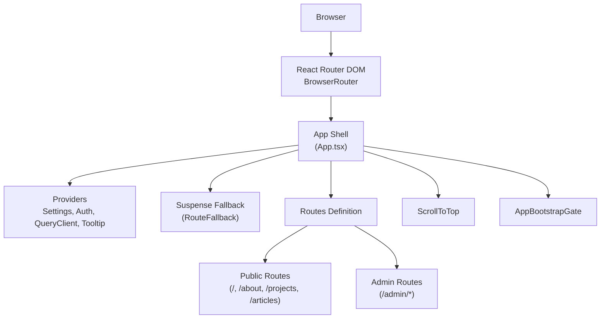
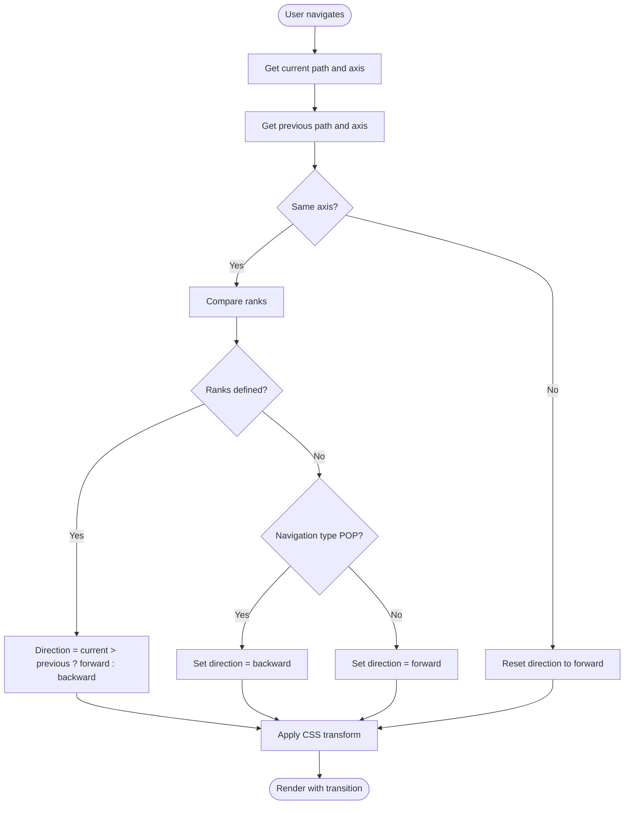
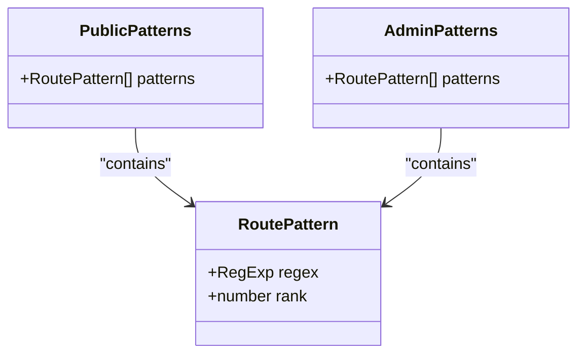
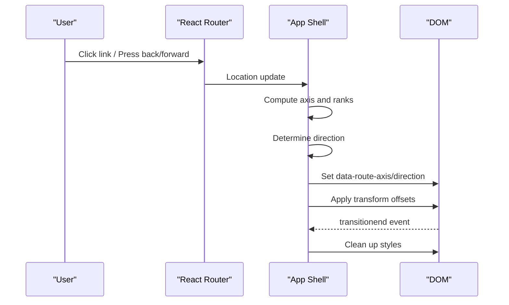
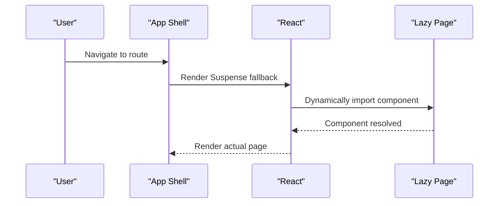
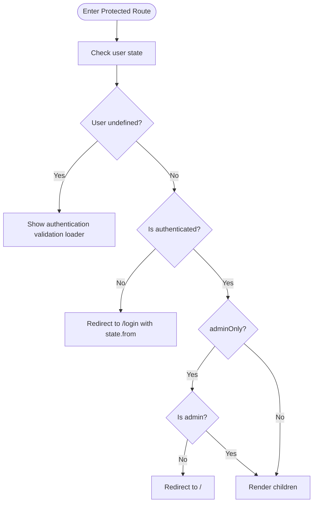
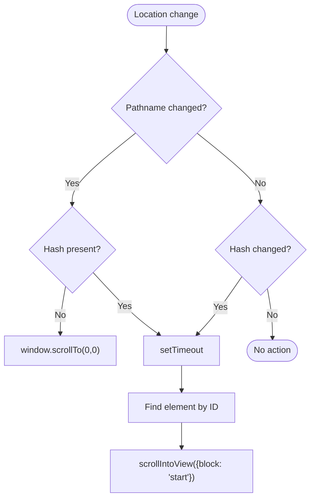
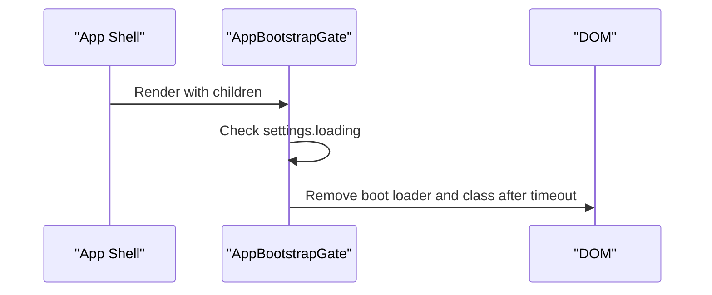
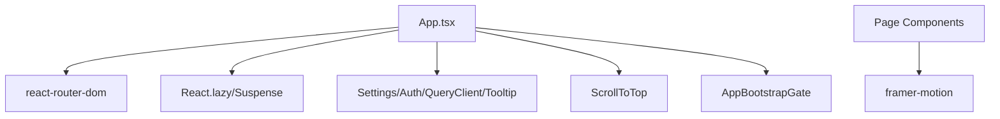

# Routing and Navigation System

<cite>
**Referenced Files in This Document**
- [App.tsx](file://personalSite/src/App.tsx)
- [main.tsx](file://personalSite/src/main.tsx)
- [RouteProtector.tsx](file://personalSite/src/components/RouteProtector.tsx)
- [ScrollToTop.tsx](file://personalSite/src/components/ScrollToTop.tsx)
- [Index.tsx](file://personalSite/src/pages/Index.tsx)
- [About.tsx](file://personalSite/src/pages/About.tsx)
- [Projects.tsx](file://personalSite/src/pages/Projects.tsx)
- [Articles.tsx](file://personalSite/src/pages/Articles.tsx)
- [Dashboard.tsx](file://personalSite/src/pages/Admin/Dashboard.tsx)
</cite>

## Table of Contents
1. [Introduction](#introduction)
2. [Project Structure](#project-structure)
3. [Core Components](#core-components)
4. [Architecture Overview](#architecture-overview)
5. [Detailed Component Analysis](#detailed-component-analysis)
6. [Dependency Analysis](#dependency-analysis)
7. [Performance Considerations](#performance-considerations)
8. [Troubleshooting Guide](#troubleshooting-guide)
9. [Conclusion](#conclusion)

## Introduction
This document explains the routing and navigation system built with React Router DOM. It covers the dual-axis routing architecture separating public pages (horizontal axis) from admin pages (vertical axis), the custom route ranking system using RoutePattern objects with regex matching, the transition animation system with direction detection and CSS transforms, lazy loading with React.lazy and Suspense fallbacks, protected routes via RouteProtector, scroll-to-top functionality, the bootstrapping gate mechanism, and seamless integration with React Router DOM for smooth navigation.

## Project Structure
The routing system is centered around the application shell in App.tsx, which defines all routes, lazy loads page components, manages transitions, and orchestrates global providers. The main entry point initializes the router with React Router DOM and Helmet for SEO.

**Diagram sources**
- [main.tsx](file://personalSite/src/main.tsx#L17-L23)
- [App.tsx](file://personalSite/src/App.tsx#L232-L356)

**Section sources**
- [main.tsx](file://personalSite/src/main.tsx#L1-L26)
- [App.tsx](file://personalSite/src/App.tsx#L1-L359)

## Core Components
- Dual-axis routing: Horizontal routes for public pages and vertical routes for admin pages, determined by path prefixes.
- Custom route ranking: RoutePattern objects define regex patterns and ranks for both axes, enabling precise direction detection during navigation.
- Transition system: Computes route direction based on axis and rank comparison, applies CSS transforms with requestAnimationFrame, and cleans up listeners.
- Lazy loading: Page components are dynamically imported using React.lazy with Suspense fallbacks.
- Protected routes: RouteProtector wraps admin routes to enforce authentication and admin privileges.
- Scroll-to-top: Automatic scroll to top on route changes, with hash-aware scrolling support.
- Bootstrapping gate: Ensures the app waits for settings initialization before rendering routes.

**Section sources**
- [App.tsx](file://personalSite/src/App.tsx#L37-L86)
- [App.tsx](file://personalSite/src/App.tsx#L88-L98)
- [App.tsx](file://personalSite/src/App.tsx#L100-L139)
- [App.tsx](file://personalSite/src/App.tsx#L141-L229)
- [RouteProtector.tsx](file://personalSite/src/components/RouteProtector.tsx#L1-L41)
- [ScrollToTop.tsx](file://personalSite/src/components/ScrollToTop.tsx#L1-L45)

## Architecture Overview
The routing architecture separates navigation concerns into two axes:
- Horizontal axis: Public pages (/, /about, /projects, /articles) navigate left/right.
- Vertical axis: Admin pages (/admin/*) navigate up/down.

A custom ranking system assigns numeric ranks to each route pattern. Direction is computed by comparing current and previous ranks within the same axis, with special handling for browser back/forward navigation (POP).

**Diagram sources**
- [App.tsx](file://personalSite/src/App.tsx#L146-L177)

**Section sources**
- [App.tsx](file://personalSite/src/App.tsx#L78-L86)
- [App.tsx](file://personalSite/src/App.tsx#L146-L177)

## Detailed Component Analysis

### Dual-Axis Routing and Route Ranking
The system defines two sets of RoutePattern objects:
- PUBLIC_ROUTE_PATTERNS: Includes root, about, projects (including project detail slugs), and articles (including article detail slugs), plus auth routes.
- ADMIN_ROUTE_PATTERNS: Includes admin base and nested management routes.

Ranking ensures predictable direction detection:
- Higher rank means moving "forward" along the axis.
- Lower rank means moving "backward".
- Ranks are distinct per axis to avoid ambiguous comparisons.

**Diagram sources**
- [App.tsx](file://personalSite/src/App.tsx#L40-L66)

**Section sources**
- [App.tsx](file://personalSite/src/App.tsx#L45-L66)

### Transition Animation System
The transition system computes direction and applies CSS transforms:
- Detects axis from path prefix.
- Computes rank for current and previous paths.
- Determines direction using rank comparison and navigation type.
- Sets dataset attributes on documentElement for CSS targeting.
- Uses requestAnimationFrame to trigger smooth transforms with a cubic-bezier curve.
- Cleans up styles and event listeners on unmount.

**Diagram sources**
- [App.tsx](file://personalSite/src/App.tsx#L141-L229)

**Section sources**
- [App.tsx](file://personalSite/src/App.tsx#L141-L229)

### Lazy Loading and Suspense Fallback
Page components are lazily loaded using React.lazy. A shared RouteFallback component provides a loading indicator with a dynamic background while routes are resolving.

**Diagram sources**
- [App.tsx](file://personalSite/src/App.tsx#L14-L31)
- [App.tsx](file://personalSite/src/App.tsx#L88-L98)

**Section sources**
- [App.tsx](file://personalSite/src/App.tsx#L14-L31)
- [App.tsx](file://personalSite/src/App.tsx#L88-L98)

### Protected Routes with RouteProtector
Admin routes are wrapped with RouteProtector, which:
- Shows a loading state while authentication is being validated.
- Redirects unauthenticated users to /login with state containing the original location.
- Restricts admin-only routes to administrators.
- Renders children when access is granted.

**Diagram sources**
- [RouteProtector.tsx](file://personalSite/src/components/RouteProtector.tsx#L10-L38)

**Section sources**
- [RouteProtector.tsx](file://personalSite/src/components/RouteProtector.tsx#L1-L41)

### Scroll-to-Top Functionality
ScrollToTop automatically scrolls to the top on route changes when there is no hash. When a hash is present, it scrolls smoothly to the target element after a short delay to ensure DOM readiness.

**Diagram sources**
- [ScrollToTop.tsx](file://personalSite/src/components/ScrollToTop.tsx#L11-L38)

**Section sources**
- [ScrollToTop.tsx](file://personalSite/src/components/ScrollToTop.tsx#L1-L45)

### Bootstrapping Gate Mechanism
The AppBootstrapGate defers rendering until settings are loaded. It removes the boot loader DOM node and clears the loading class after a brief timeout to ensure smooth transition out of the loading state.

**Diagram sources**
- [App.tsx](file://personalSite/src/App.tsx#L100-L139)

**Section sources**
- [App.tsx](file://personalSite/src/App.tsx#L100-L139)

### Route Fallback Loading States
RouteFallback provides a consistent loading experience while routes are being resolved. It includes a dynamic background and a spinner with a "Loading..." message.

**Section sources**
- [App.tsx](file://personalSite/src/App.tsx#L88-L98)

### Integration with React Router DOM
The application initializes BrowserRouter with future flags enabled for transitions and relative splat paths. The main entry point wraps the app with HelmetProvider for SEO metadata management.

**Section sources**
- [main.tsx](file://personalSite/src/main.tsx#L17-L23)

## Dependency Analysis
The routing system integrates several key dependencies and patterns:
- React Router DOM: Provides routing primitives, navigation type detection, and location tracking.
- React.lazy/Suspense: Enables code-splitting and fallback rendering during route transitions.
- Framer Motion: Used within page components for micro-interactions and entrance animations.
- Custom transition logic: Independent of external libraries, relying on DOM manipulation and CSS transforms.

**Diagram sources**
- [App.tsx](file://personalSite/src/App.tsx#L1-L359)
- [main.tsx](file://personalSite/src/main.tsx#L1-L26)

**Section sources**
- [App.tsx](file://personalSite/src/App.tsx#L1-L359)
- [main.tsx](file://personalSite/src/main.tsx#L1-L26)

## Performance Considerations
- Use requestAnimationFrame to batch transform updates and avoid layout thrashing.
- Keep transition durations and easing consistent to prevent jank.
- Prefer lazy loading for admin-heavy pages to reduce initial bundle size.
- Minimize heavy computations in transition logic; rely on simple rank comparisons.
- Ensure cleanup of event listeners and styles to prevent memory leaks.

## Troubleshooting Guide
Common issues and resolutions:
- Routes not transitioning: Verify dataset attributes are set on documentElement and that CSS targets the correct data attributes.
- Incorrect direction detection: Confirm route ranks are unique per axis and regex patterns match intended paths.
- Protected route loops: Ensure authentication state resolves and that adminOnly checks align with user roles.
- Scroll not working: Check that ScrollToTop is rendered and that hash navigation timing allows DOM readiness.
- Boot loader not disappearing: Confirm settings loading completes and the gate removes the loader DOM node after timeout.

**Section sources**
- [App.tsx](file://personalSite/src/App.tsx#L174-L229)
- [RouteProtector.tsx](file://personalSite/src/components/RouteProtector.tsx#L14-L38)
- [ScrollToTop.tsx](file://personalSite/src/components/ScrollToTop.tsx#L11-L38)
- [App.tsx](file://personalSite/src/App.tsx#L100-L139)

## Conclusion
The routing and navigation system combines a dual-axis architecture, custom ranking, and a robust transition pipeline to deliver smooth, predictable navigation. With lazy loading, protected routes, scroll-to-top, and a bootstrapping gate, it balances performance, security, and user experience. The design leverages React Router DOM seamlessly while maintaining a custom transition engine for precise control over navigation feel.