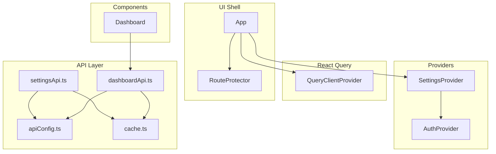
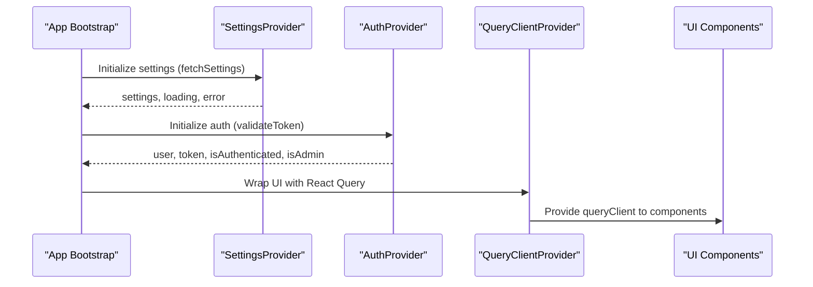
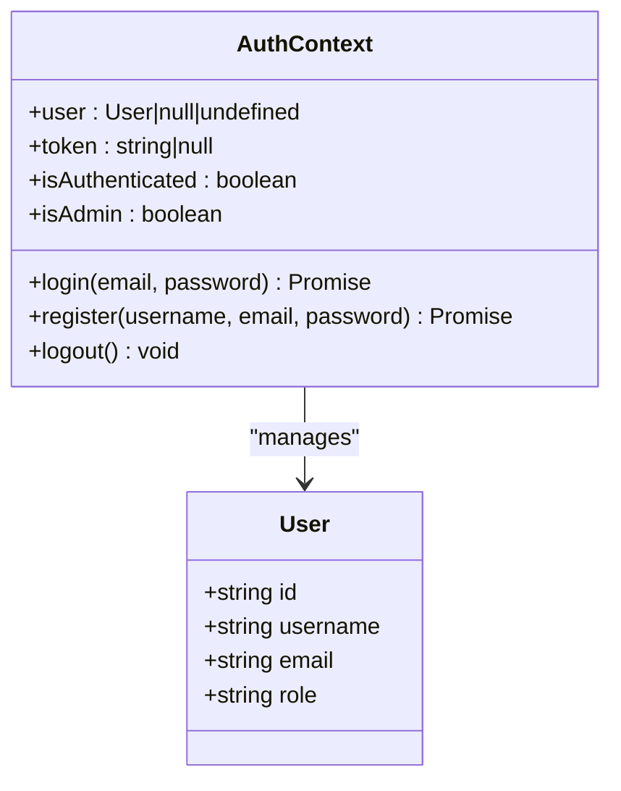
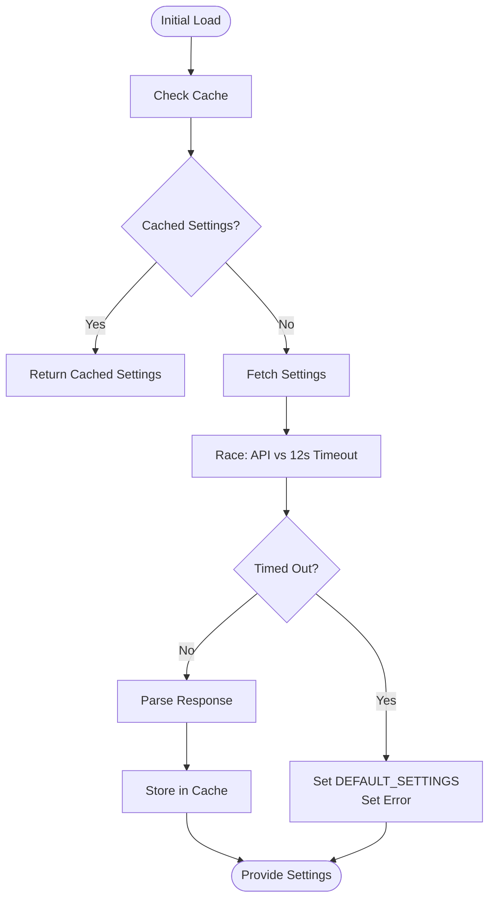
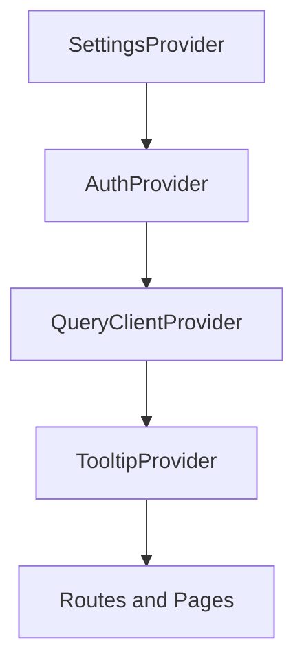
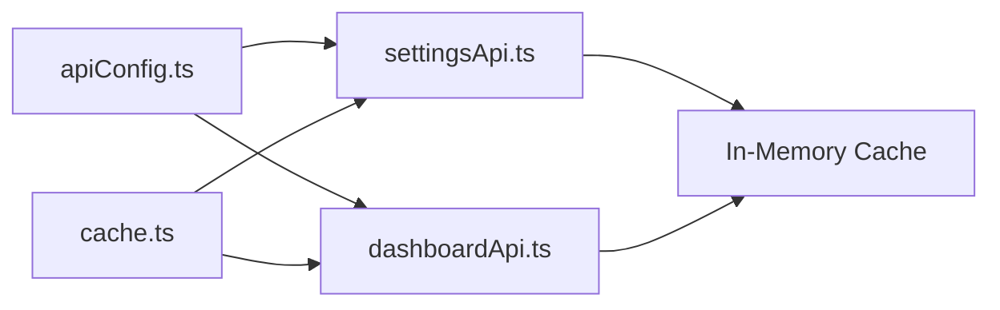
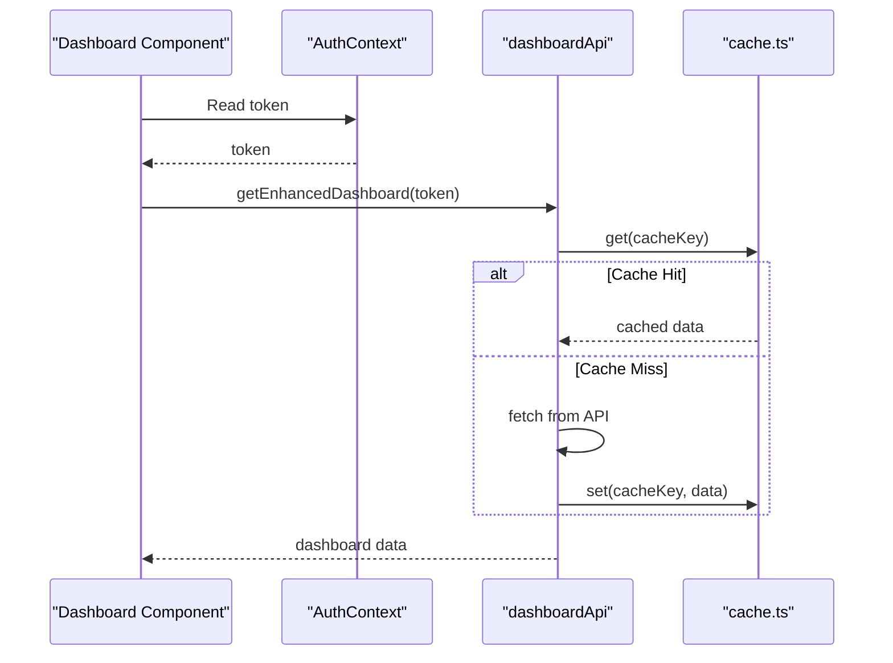
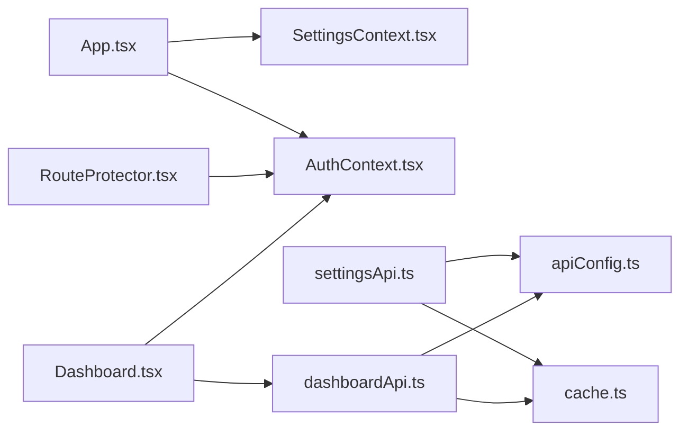

# State Management Architecture

<cite>
**Referenced Files in This Document**
- [AuthContext.tsx](file://personalSite/src/contexts/AuthContext.tsx)
- [SettingsContext.tsx](file://personalSite/src/contexts/SettingsContext.tsx)
- [App.tsx](file://personalSite/src/App.tsx)
- [apiConfig.ts](file://personalSite/src/lib/apiConfig.ts)
- [cache.ts](file://personalSite/src/lib/cache.ts)
- [settingsApi.ts](file://personalSite/src/api/settingsApi.ts)
- [dashboardApi.ts](file://personalSite/src/api/dashboardApi.ts)
- [RouteProtector.tsx](file://personalSite/src/components/RouteProtector.tsx)
- [Dashboard.tsx](file://personalSite/src/pages/Admin/Dashboard.tsx)
- [main.tsx](file://personalSite/src/main.tsx)
</cite>

## Table of Contents
1. [Introduction](#introduction)
2. [Project Structure](#project-structure)
3. [Core Components](#core-components)
4. [Architecture Overview](#architecture-overview)
5. [Detailed Component Analysis](#detailed-component-analysis)
6. [Dependency Analysis](#dependency-analysis)
7. [Performance Considerations](#performance-considerations)
8. [Troubleshooting Guide](#troubleshooting-guide)
9. [Conclusion](#conclusion)

## Introduction
This document explains the state management architecture for the personal site application. It covers:
- Context API implementation for authentication and application-wide settings
- Provider hierarchy in the application shell
- Centralized API configuration and local caching
- Synchronization patterns between local state and server state
- Best practices for context usage, performance, and debugging

## Project Structure
The state management spans three layers:
- Providers and contexts at the top level
- API modules for centralized data fetching and caching
- UI components that consume context and drive re-renders

**Diagram sources**
- [App.tsx](file://personalSite/src/App.tsx#L232-L354)
- [AuthContext.tsx](file://personalSite/src/contexts/AuthContext.tsx#L36-L140)
- [SettingsContext.tsx](file://personalSite/src/contexts/SettingsContext.tsx#L71-L126)
- [apiConfig.ts](file://personalSite/src/lib/apiConfig.ts#L1-L75)
- [cache.ts](file://personalSite/src/lib/cache.ts#L1-L137)
- [settingsApi.ts](file://personalSite/src/api/settingsApi.ts#L1-L96)
- [dashboardApi.ts](file://personalSite/src/api/dashboardApi.ts#L1-L152)
- [Dashboard.tsx](file://personalSite/src/pages/Admin/Dashboard.tsx#L79-L105)

**Section sources**
- [App.tsx](file://personalSite/src/App.tsx#L141-L356)
- [main.tsx](file://personalSite/src/main.tsx#L17-L25)

## Core Components
- AuthContext: Manages authentication state (user, token), login/logout, and admin checks. Persists token and user to localStorage and validates tokens on startup.
- SettingsContext: Loads application-wide settings with timeout and fallback to defaults, exposes refreshSettings.
- API configuration: Centralized base URL resolution via environment variables.
- Local caching: TTL-based in-memory cache keyed by feature-specific keys.
- Protected routing: Guards admin routes using authentication and role checks.

**Section sources**
- [AuthContext.tsx](file://personalSite/src/contexts/AuthContext.tsx#L12-L140)
- [SettingsContext.tsx](file://personalSite/src/contexts/SettingsContext.tsx#L48-L126)
- [apiConfig.ts](file://personalSite/src/lib/apiConfig.ts#L6-L52)
- [cache.ts](file://personalSite/src/lib/cache.ts#L12-L99)
- [RouteProtector.tsx](file://personalSite/src/components/RouteProtector.tsx#L10-L41)

## Architecture Overview
The provider hierarchy ensures that:
- SettingsProvider initializes application settings before rendering child routes.
- AuthProvider supplies authentication state and guards protected routes.
- QueryClientProvider enables React Query integration for data fetching and caching.
- RouteProtector enforces authentication and admin-only access.

**Diagram sources**
- [App.tsx](file://personalSite/src/App.tsx#L100-L139)
- [SettingsContext.tsx](file://personalSite/src/contexts/SettingsContext.tsx#L110-L112)
- [AuthContext.tsx](file://personalSite/src/contexts/AuthContext.tsx#L41-L56)
- [App.tsx](file://personalSite/src/App.tsx#L232-L354)

## Detailed Component Analysis

### Authentication State with AuthContext
AuthContext encapsulates:
- State: user, token, loading sentinel (undefined until validation completes)
- Actions: login, register, logout
- Helpers: isAuthenticated, isAdmin
- Persistence: localStorage for token and user
- Validation: token verification against backend profile endpoint

**Diagram sources**
- [AuthContext.tsx](file://personalSite/src/contexts/AuthContext.tsx#L5-L20)
- [AuthContext.tsx](file://personalSite/src/contexts/AuthContext.tsx#L36-L140)

Key behaviors:
- On mount, restores token and user from localStorage and validates the token.
- On successful login/register, stores token and user, navigates to admin.
- On logout or invalid token, clears state and navigates to home.

**Section sources**
- [AuthContext.tsx](file://personalSite/src/contexts/AuthContext.tsx#L41-L130)
- [RouteProtector.tsx](file://personalSite/src/components/RouteProtector.tsx#L10-L38)

### Application Settings with SettingsContext
SettingsContext handles:
- State: settings, loading, error
- Initialization: fetchSettings on mount with timeout and fallback to defaults
- Refresh: refreshSettings with optional forceRefresh
- Error handling: timeout uses defaults and logs warnings

**Diagram sources**
- [SettingsContext.tsx](file://personalSite/src/contexts/SettingsContext.tsx#L76-L108)
- [settingsApi.ts](file://personalSite/src/api/settingsApi.ts#L49-L70)

**Section sources**
- [SettingsContext.tsx](file://personalSite/src/contexts/SettingsContext.tsx#L71-L126)
- [settingsApi.ts](file://personalSite/src/api/settingsApi.ts#L1-L96)

### Provider Hierarchy in App Shell
The provider stack is defined in the application shell:
- SettingsProvider wraps everything to ensure settings are loaded before rendering routes.
- AuthProvider wraps UI to supply authentication state and guard routes.
- QueryClientProvider enables React Query for data fetching and caching.
- RouteProtector wraps admin routes to enforce authentication and roles.

**Diagram sources**
- [App.tsx](file://personalSite/src/App.tsx#L232-L354)

**Section sources**
- [App.tsx](file://personalSite/src/App.tsx#L231-L355)

### Centralized API Configuration and Local Caching
- API base URL is resolved from environment variables with development and production overrides.
- API modules use a shared cache utility with TTL and pattern-based invalidation.
- Cache keys are namespaced per feature to support targeted invalidation.

**Diagram sources**
- [apiConfig.ts](file://personalSite/src/lib/apiConfig.ts#L6-L52)
- [cache.ts](file://personalSite/src/lib/cache.ts#L12-L99)
- [settingsApi.ts](file://personalSite/src/api/settingsApi.ts#L49-L70)
- [dashboardApi.ts](file://personalSite/src/api/dashboardApi.ts#L71-L94)

**Section sources**
- [apiConfig.ts](file://personalSite/src/lib/apiConfig.ts#L1-L75)
- [cache.ts](file://personalSite/src/lib/cache.ts#L1-L137)
- [settingsApi.ts](file://personalSite/src/api/settingsApi.ts#L1-L96)
- [dashboardApi.ts](file://personalSite/src/api/dashboardApi.ts#L1-L152)

### State Synchronization Patterns
- Local-first with server validation:
  - AuthContext persists token and user to localStorage and validates on mount.
  - SettingsContext uses a timeout race to avoid hanging loads and falls back to defaults.
- Cache-driven reads:
  - API modules check cache first, then fetch, then store results.
  - After mutations (e.g., settings update), cache is invalidated and refreshed.
- Cross-context synchronization:
  - ProtectedRoute uses AuthContext to block navigation until authentication is resolved.
  - Dashboard uses token from AuthContext to fetch protected data via dashboardApi.

**Diagram sources**
- [Dashboard.tsx](file://personalSite/src/pages/Admin/Dashboard.tsx#L86-L105)
- [dashboardApi.ts](file://personalSite/src/api/dashboardApi.ts#L121-L146)
- [cache.ts](file://personalSite/src/lib/cache.ts#L20-L48)

**Section sources**
- [AuthContext.tsx](file://personalSite/src/contexts/AuthContext.tsx#L41-L56)
- [SettingsContext.tsx](file://personalSite/src/contexts/SettingsContext.tsx#L76-L108)
- [dashboardApi.ts](file://personalSite/src/api/dashboardApi.ts#L71-L146)

### Context Value Optimization
- Current implementation passes object literals to Provider values. While convenient, this can cause unnecessary re-renders because the object identity changes on every render.
- Recommendation: Wrap the value object with useMemo to memoize the context payload and pass stable references to consumers.

Best practice anchors:
- Memoize context value to prevent downstream re-renders.
- Keep context value minimal and derived from stable sources.

**Section sources**
- [AuthContext.tsx](file://personalSite/src/contexts/AuthContext.tsx#L135-L139)
- [SettingsContext.tsx](file://personalSite/src/contexts/SettingsContext.tsx#L114-L119)

### Error Boundary Integration
- The codebase does not currently integrate React Error Boundaries. Consider adding an error boundary at the root to gracefully handle rendering errors and display user-friendly messages.

[No sources needed since this section provides general guidance]

### Relationship Between Local State and Server State
- AuthContext maintains a tri-state for user: undefined (validating), null (not authenticated), or populated (authenticated). This allows UI to render appropriate loaders while validation occurs.
- SettingsContext uses a timeout race to avoid blocking UI indefinitely; on timeout, defaults are used to keep the app responsive.
- API modules centralize caching and error handling, ensuring consistent UX and reducing redundant network requests.

**Section sources**
- [AuthContext.tsx](file://personalSite/src/contexts/AuthContext.tsx#L37-L56)
- [SettingsContext.tsx](file://personalSite/src/contexts/SettingsContext.tsx#L76-L108)
- [settingsApi.ts](file://personalSite/src/api/settingsApi.ts#L49-L70)

## Dependency Analysis
- App depends on SettingsProvider and AuthProvider to bootstrap UI.
- RouteProtector depends on AuthContext to enforce access control.
- API modules depend on apiConfig for base URL and cache.ts for caching.
- Dashboard consumes AuthContext for token and dashboardApi for protected data.

**Diagram sources**
- [App.tsx](file://personalSite/src/App.tsx#L232-L354)
- [RouteProtector.tsx](file://personalSite/src/components/RouteProtector.tsx#L10-L38)
- [Dashboard.tsx](file://personalSite/src/pages/Admin/Dashboard.tsx#L80-L105)
- [settingsApi.ts](file://personalSite/src/api/settingsApi.ts#L1-L96)
- [dashboardApi.ts](file://personalSite/src/api/dashboardApi.ts#L1-L152)
- [apiConfig.ts](file://personalSite/src/lib/apiConfig.ts#L1-L75)
- [cache.ts](file://personalSite/src/lib/cache.ts#L1-L137)

**Section sources**
- [App.tsx](file://personalSite/src/App.tsx#L1-L359)
- [RouteProtector.tsx](file://personalSite/src/components/RouteProtector.tsx#L1-L41)
- [Dashboard.tsx](file://personalSite/src/pages/Admin/Dashboard.tsx#L1-L348)

## Performance Considerations
- Context value stability: Memoize context values to avoid unnecessary re-renders.
- Caching strategy: Use TTL and targeted invalidation to balance freshness and performance.
- Lazy loading: Continue using React.lazy for routes to reduce initial bundle size.
- Network timeouts: Use races with timeouts to prevent UI stalls; fallback to defaults when appropriate.
- Avoid excessive localStorage writes: Batch updates and avoid frequent writes during rapid state changes.

[No sources needed since this section provides general guidance]

## Troubleshooting Guide
Common issues and resolutions:
- Authentication validation never resolves:
  - Verify localStorage contains token and user; check token validity via backend profile endpoint.
  - Ensure AuthProvider runs validation on mount and navigates appropriately.
- Settings fail to load:
  - Check API base URL resolution and environment variables.
  - Inspect timeout logic and fallback behavior; confirm DEFAULT_SETTINGS are applied on timeout.
- Protected routes redirect unexpectedly:
  - Confirm AuthContext user state transitions from undefined to a resolved value.
  - Ensure RouteProtector handles the undefined state with a loader.
- Cache inconsistencies:
  - Verify cache keys are correctly generated and invalidated after mutations.
  - Confirm TTL values align with desired freshness windows.

**Section sources**
- [AuthContext.tsx](file://personalSite/src/contexts/AuthContext.tsx#L41-L76)
- [SettingsContext.tsx](file://personalSite/src/contexts/SettingsContext.tsx#L76-L108)
- [RouteProtector.tsx](file://personalSite/src/components/RouteProtector.tsx#L14-L38)
- [settingsApi.ts](file://personalSite/src/api/settingsApi.ts#L88-L94)
- [cache.ts](file://personalSite/src/lib/cache.ts#L78-L85)

## Conclusion
The application employs a layered state management approach:
- Contexts provide scoped state for authentication and settings.
- Centralized API configuration and caching ensure consistent data access.
- Provider hierarchy and route protection guarantee secure and responsive UX.
- Recommended improvements include memoizing context values and integrating error boundaries for robustness.