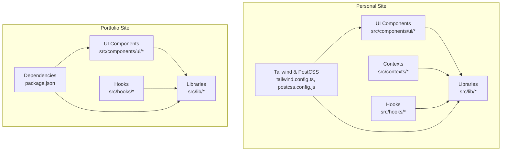
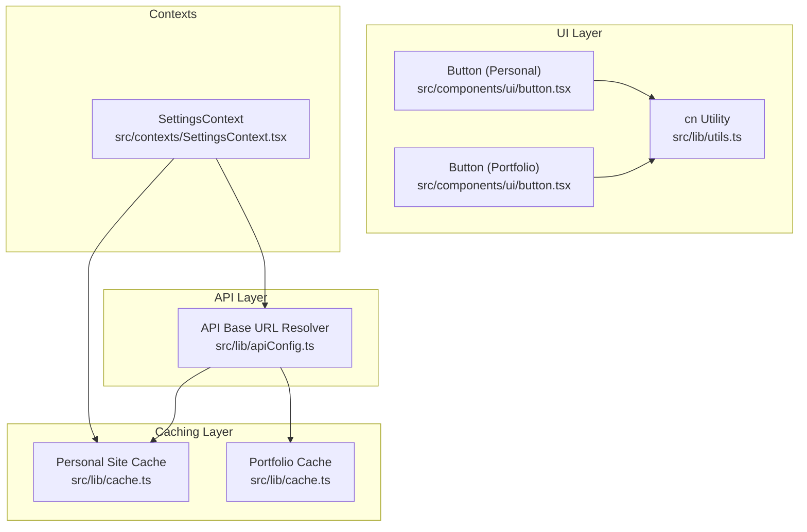
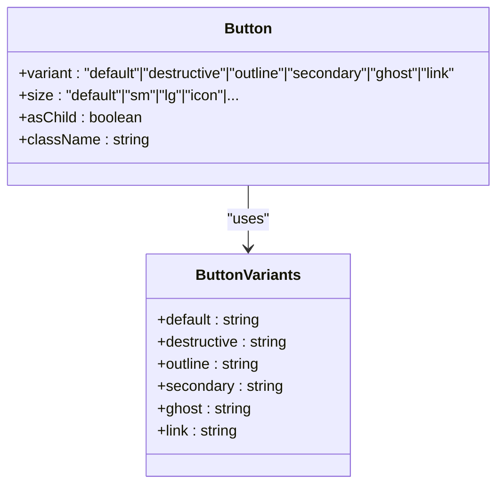
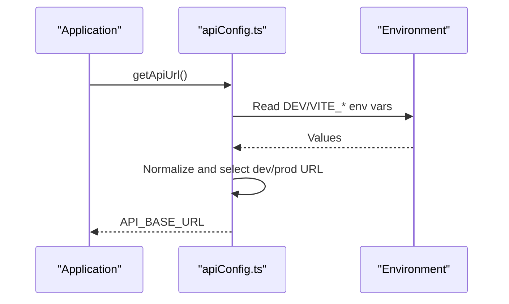
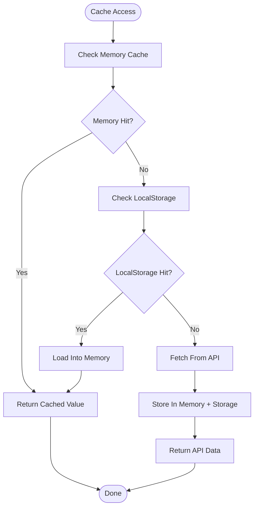
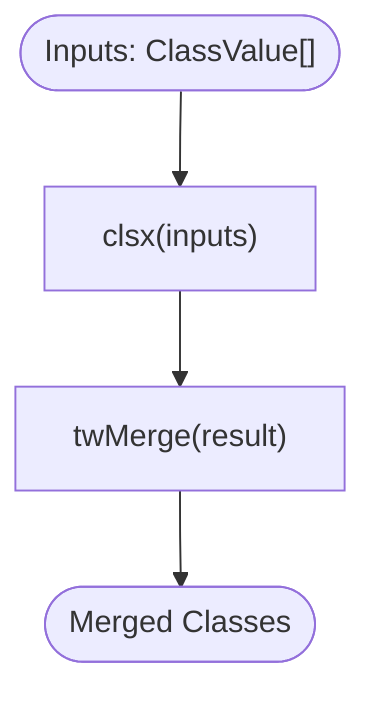
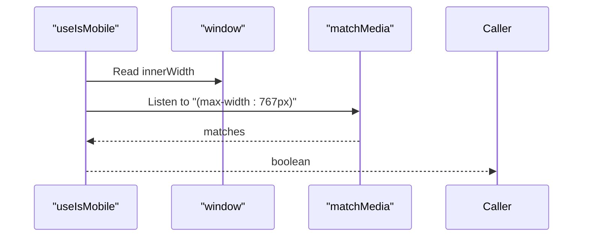
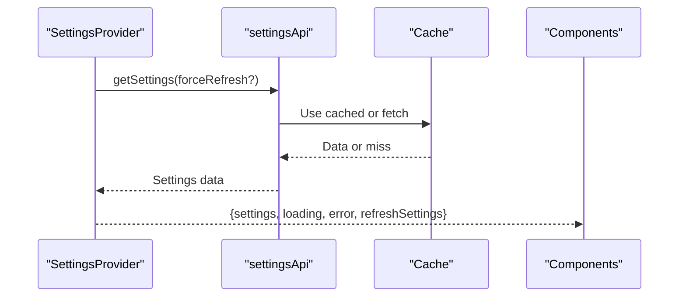
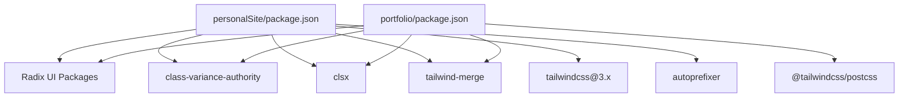

# Shared Components and Libraries

<cite>
**Referenced Files in This Document**
- [personalSite/components.json](file://personalSite/components.json)
- [personalSite/tailwind.config.ts](file://personalSite/tailwind.config.ts)
- [personalSite/postcss.config.js](file://personalSite/postcss.config.js)
- [personalSite/package.json](file://personalSite/package.json)
- [personalSite/src/lib/apiConfig.ts](file://personalSite/src/lib/apiConfig.ts)
- [personalSite/src/lib/cache.ts](file://personalSite/src/lib/cache.ts)
- [personalSite/src/lib/utils.ts](file://personalSite/src/lib/utils.ts)
- [personalSite/src/contexts/SettingsContext.tsx](file://personalSite/src/contexts/SettingsContext.tsx)
- [personalSite/src/hooks/use-mobile.tsx](file://personalSite/src/hooks/use-mobile.tsx)
- [personalSite/src/components/ui/button.tsx](file://personalSite/src/components/ui/button.tsx)
- [portfolio/package.json](file://portfolio/package.json)
- [portfolio/src/lib/apiConfig.ts](file://portfolio/src/lib/apiConfig.ts)
- [portfolio/src/lib/cache.ts](file://portfolio/src/lib/cache.ts)
- [portfolio/src/lib/utils.ts](file://portfolio/src/lib/utils.ts)
- [portfolio/src/hooks/use-mobile.ts](file://portfolio/src/hooks/use-mobile.ts)
- [portfolio/src/components/ui/button.tsx](file://portfolio/src/components/ui/button.tsx)
</cite>

## Table of Contents
1. [Introduction](#introduction)
2. [Project Structure](#project-structure)
3. [Core Components](#core-components)
4. [Architecture Overview](#architecture-overview)
5. [Detailed Component Analysis](#detailed-component-analysis)
6. [Dependency Analysis](#dependency-analysis)
7. [Performance Considerations](#performance-considerations)
8. [Troubleshooting Guide](#troubleshooting-guide)
9. [Conclusion](#conclusion)
10. [Appendices](#appendices)

## Introduction
This document describes the shared components and libraries system used across two frontend applications. It focuses on the shadcn/ui component library integration, custom component implementations, centralized API configuration, caching mechanisms, utility functions, styling and theme patterns, and how shared libraries enable cross-application code reuse. It also explains component composition patterns, prop interfaces, customization options, build system integration, theme management, UI paradigms (modern vs retro), and testing/maintenance strategies for shared functionality.

## Project Structure
Both applications share a similar structure for UI components, utilities, and configuration:
- UI components under src/components/ui implement shadcn/ui primitives with consistent styling via Tailwind CSS and class variance authority.
- Utilities under src/lib provide shared helpers for styling, caching, API configuration, and common operations.
- Build-time configuration integrates Tailwind CSS and PostCSS for consistent styling across both apps.
- Hooks under src/hooks encapsulate responsive behavior and other reusable logic.

**Section sources**
- [personalSite/components.json](file://personalSite/components.json#L1-L21)
- [personalSite/tailwind.config.ts](file://personalSite/tailwind.config.ts#L1-L117)
- [personalSite/postcss.config.js](file://personalSite/postcss.config.js#L1-L7)
- [personalSite/package.json](file://personalSite/package.json#L1-L113)
- [portfolio/package.json](file://portfolio/package.json#L1-L74)

## Core Components
This section documents the shared building blocks that power both applications.

- Shadcn/ui integration and aliases
  - Both apps configure shadcn/ui with TSX support, RSC disabled, and explicit aliases for components, utils, ui, lib, and hooks. This ensures consistent imports and component discovery across applications.
  - Personal site aliasing includes components, utils, ui, lib, and hooks under @/ paths.

- Centralized API configuration
  - Personal site provides a robust API base URL resolver supporting browser and SSR environments, with environment-specific fallbacks and typed environment configuration.
  - Portfolio site provides a concise normalized URL resolver with environment checks and a single exported base URL.

- Caching mechanisms
  - Personal site implements a generic in-memory cache with TTL and invalidation by pattern, plus a comprehensive cache key registry for domain entities.
  - Portfolio site implements a hybrid memory/localStorage cache with records containing timestamps and expiration, plus helpers to check freshness and clear entries.

- Utility functions
  - Shared cn utility merges Tailwind classes safely using clsx and tailwind-merge.
  - Both apps expose identical cn signatures and behavior.

- Responsive hooks
  - Both apps provide a mobile detection hook using media queries and window matchMedia, ensuring consistent responsive behavior.

- Theme and styling
  - Personal site defines Tailwind configuration with dark mode, container sizing, color tokens, animations, shadows, and font families.
  - Portfolio site relies on its own Tailwind and PostCSS configuration; differences in styling are addressed below.

**Section sources**
- [personalSite/components.json](file://personalSite/components.json#L1-L21)
- [personalSite/src/lib/apiConfig.ts](file://personalSite/src/lib/apiConfig.ts#L1-L75)
- [portfolio/src/lib/apiConfig.ts](file://portfolio/src/lib/apiConfig.ts#L1-L19)
- [personalSite/src/lib/cache.ts](file://personalSite/src/lib/cache.ts#L1-L137)
- [portfolio/src/lib/cache.ts](file://portfolio/src/lib/cache.ts#L1-L119)
- [personalSite/src/lib/utils.ts](file://personalSite/src/lib/utils.ts#L1-L7)
- [portfolio/src/lib/utils.ts](file://portfolio/src/lib/utils.ts#L1-L7)
- [personalSite/src/hooks/use-mobile.tsx](file://personalSite/src/hooks/use-mobile.tsx#L1-L26)
- [portfolio/src/hooks/use-mobile.ts](file://portfolio/src/hooks/use-mobile.ts#L1-L20)
- [personalSite/tailwind.config.ts](file://personalSite/tailwind.config.ts#L1-L117)

## Architecture Overview
The shared architecture centers on:
- Consistent UI primitives via shadcn/ui with component-level variants and slots.
- Centralized configuration for API base URLs and environment-aware behavior.
- Cross-cutting utilities for styling, caching, and responsive behavior.
- Contexts for global settings and provider-based initialization.

**Diagram sources**
- [personalSite/src/lib/apiConfig.ts](file://personalSite/src/lib/apiConfig.ts#L1-L75)
- [personalSite/src/lib/cache.ts](file://personalSite/src/lib/cache.ts#L1-L137)
- [portfolio/src/lib/cache.ts](file://portfolio/src/lib/cache.ts#L1-L119)
- [personalSite/src/components/ui/button.tsx](file://personalSite/src/components/ui/button.tsx#L1-L48)
- [portfolio/src/components/ui/button.tsx](file://portfolio/src/components/ui/button.tsx#L1-L61)
- [personalSite/src/lib/utils.ts](file://personalSite/src/lib/utils.ts#L1-L7)
- [personalSite/src/contexts/SettingsContext.tsx](file://personalSite/src/contexts/SettingsContext.tsx#L1-L126)

## Detailed Component Analysis

### Shadcn/ui Button Component
Both applications implement a Button component using shadcn/ui’s class variance authority and Radix UI slot. Variants and sizes are standardized, enabling consistent styling across applications.

**Diagram sources**
- [personalSite/src/components/ui/button.tsx](file://personalSite/src/components/ui/button.tsx#L1-L48)
- [portfolio/src/components/ui/button.tsx](file://portfolio/src/components/ui/button.tsx#L1-L61)

**Section sources**
- [personalSite/src/components/ui/button.tsx](file://personalSite/src/components/ui/button.tsx#L1-L48)
- [portfolio/src/components/ui/button.tsx](file://portfolio/src/components/ui/button.tsx#L1-L61)

### API Configuration System
The API configuration system centralizes base URL resolution with environment awareness and fallbacks.

**Diagram sources**
- [personalSite/src/lib/apiConfig.ts](file://personalSite/src/lib/apiConfig.ts#L1-L75)
- [portfolio/src/lib/apiConfig.ts](file://portfolio/src/lib/apiConfig.ts#L1-L19)

**Section sources**
- [personalSite/src/lib/apiConfig.ts](file://personalSite/src/lib/apiConfig.ts#L1-L75)
- [portfolio/src/lib/apiConfig.ts](file://portfolio/src/lib/apiConfig.ts#L1-L19)

### Caching Mechanisms
Two caching strategies are implemented:

- Personal site cache
  - In-memory cache with TTL and pattern-based invalidation.
  - Comprehensive cache key registry for articles, projects, settings, about, timeline, tech skills, interests, tech stack, dashboard, contact, and GitHub repositories.

- Portfolio cache
  - Hybrid memory/localStorage cache with records storing value, cachedAt, and expiresAt.
  - Helpers to check expiration, freshness, read/write/clear.

**Diagram sources**
- [personalSite/src/lib/cache.ts](file://personalSite/src/lib/cache.ts#L1-L137)
- [portfolio/src/lib/cache.ts](file://portfolio/src/lib/cache.ts#L1-L119)

**Section sources**
- [personalSite/src/lib/cache.ts](file://personalSite/src/lib/cache.ts#L1-L137)
- [portfolio/src/lib/cache.ts](file://portfolio/src/lib/cache.ts#L1-L119)

### Utility Functions
The cn utility merges Tailwind classes safely, preventing conflicts and ensuring predictable styles.

**Diagram sources**
- [personalSite/src/lib/utils.ts](file://personalSite/src/lib/utils.ts#L1-L7)
- [portfolio/src/lib/utils.ts](file://portfolio/src/lib/utils.ts#L1-L7)

**Section sources**
- [personalSite/src/lib/utils.ts](file://personalSite/src/lib/utils.ts#L1-L7)
- [portfolio/src/lib/utils.ts](file://portfolio/src/lib/utils.ts#L1-L7)

### Responsive Hook
Both apps expose a useIsMobile hook that detects viewport width and updates on resize.

**Diagram sources**
- [personalSite/src/hooks/use-mobile.tsx](file://personalSite/src/hooks/use-mobile.tsx#L1-L26)
- [portfolio/src/hooks/use-mobile.ts](file://portfolio/src/hooks/use-mobile.ts#L1-L20)

**Section sources**
- [personalSite/src/hooks/use-mobile.tsx](file://personalSite/src/hooks/use-mobile.tsx#L1-L26)
- [portfolio/src/hooks/use-mobile.ts](file://portfolio/src/hooks/use-mobile.ts#L1-L20)

### Settings Context
The SettingsContext provides global site configuration with loading, error, and refresh capabilities, including a timeout fallback to default settings.

**Diagram sources**
- [personalSite/src/contexts/SettingsContext.tsx](file://personalSite/src/contexts/SettingsContext.tsx#L1-L126)

**Section sources**
- [personalSite/src/contexts/SettingsContext.tsx](file://personalSite/src/contexts/SettingsContext.tsx#L1-L126)

## Dependency Analysis
Shared dependencies and integrations:
- Both applications depend on Radix UI primitives, class variance authority, clsx, tailwind-merge, and related UI packages.
- Personal site adds additional libraries such as Three.js, Framer Motion, and TanStack React Query, while portfolio focuses on a leaner set of UI-focused dependencies.
- Build tooling differs slightly: personal site uses Tailwind CSS 3.x with PostCSS, while portfolio uses Tailwind CSS 4.x with @tailwindcss/postcss.

**Diagram sources**
- [personalSite/package.json](file://personalSite/package.json#L1-L113)
- [portfolio/package.json](file://portfolio/package.json#L1-L74)

**Section sources**
- [personalSite/package.json](file://personalSite/package.json#L1-L113)
- [portfolio/package.json](file://portfolio/package.json#L1-L74)

## Performance Considerations
- Caching
  - Personal site cache supports TTL and pattern-based invalidation, reducing redundant network requests.
  - Portfolio cache leverages localStorage for persistence across sessions, with in-memory fallback for SSR and storage failures.
- API configuration
  - Environment-aware base URL selection avoids misconfiguration in dev/prod.
- Styling
  - Tailwind CSS with CSS variables and dark mode improves runtime performance and reduces bundle bloat compared to inline styles.
- Responsive behavior
  - Media query listeners update only on change, minimizing unnecessary re-renders.

[No sources needed since this section provides general guidance]

## Troubleshooting Guide
- API base URL not configured
  - Symptom: Error thrown indicating missing environment variable.
  - Resolution: Set VITE_API_BASE_URL and optionally VITE_API_BASE_URL_PROD; ensure environment detection works in client or SSR contexts.
- Cache inconsistencies
  - Symptom: Stale data or unexpected invalidations.
  - Resolution: Verify TTL values and cache key patterns; use invalidate with appropriate wildcards for targeted purges.
- Tailwind/Purge misconfiguration
  - Symptom: Missing styles or unused styles purged unexpectedly.
  - Resolution: Ensure content globs include all component paths and that dark mode strategy is consistent.
- Responsive hook discrepancies
  - Symptom: Incorrect mobile detection on SSR or initial render.
  - Resolution: Initialize state based on window presence and attach media query listeners.

**Section sources**
- [personalSite/src/lib/apiConfig.ts](file://personalSite/src/lib/apiConfig.ts#L1-L75)
- [portfolio/src/lib/apiConfig.ts](file://portfolio/src/lib/apiConfig.ts#L1-L19)
- [personalSite/src/lib/cache.ts](file://personalSite/src/lib/cache.ts#L1-L137)
- [portfolio/src/lib/cache.ts](file://portfolio/src/lib/cache.ts#L1-L119)
- [personalSite/tailwind.config.ts](file://personalSite/tailwind.config.ts#L1-L117)
- [personalSite/src/hooks/use-mobile.tsx](file://personalSite/src/hooks/use-mobile.tsx#L1-L26)
- [portfolio/src/hooks/use-mobile.ts](file://portfolio/src/hooks/use-mobile.ts#L1-L20)

## Conclusion
The shared components and libraries system provides a consistent, maintainable foundation across both applications. By leveraging shadcn/ui, centralized API configuration, robust caching, and shared utilities, the system promotes code reuse, predictable styling, and scalable development. Differences in styling and build tooling are isolated to per-app configurations, while core behaviors remain aligned.

[No sources needed since this section summarizes without analyzing specific files]

## Appendices

### Component Composition Patterns and Prop Interfaces
- Button
  - Props include variant, size, asChild, and standard button attributes.
  - Uses cva for variant definitions and Radix UI Slot for composition.
- SettingsContext
  - Exposes settings, loading, error, and refreshSettings with a timeout fallback to defaults.

**Section sources**
- [personalSite/src/components/ui/button.tsx](file://personalSite/src/components/ui/button.tsx#L33-L48)
- [portfolio/src/components/ui/button.tsx](file://portfolio/src/components/ui/button.tsx#L39-L61)
- [personalSite/src/contexts/SettingsContext.tsx](file://personalSite/src/contexts/SettingsContext.tsx#L48-L63)

### Theme Management and UI Paradigms
- Modern paradigm (Personal site)
  - Uses Tailwind CSS 3.x, CSS variables, dark mode, and animations for contemporary UI.
- Retro paradigm (Portfolio site)
  - Implements CRT overlays and terminal-style UI elements; styling and animations differ from modern defaults.
- Shared utilities
  - cn utility remains consistent, ensuring class merging compatibility regardless of theme.

**Section sources**
- [personalSite/tailwind.config.ts](file://personalSite/tailwind.config.ts#L1-L117)
- [portfolio/src/components/ui/theme-provider.tsx](file://portfolio/src/components/ui/theme-provider.tsx#L1-L200)

### Testing Strategies and Maintenance Approaches
- Unit tests for utilities
  - Test cn merging behavior with various inputs and edge cases.
- Integration tests for caching
  - Verify TTL behavior, invalidation patterns, and localStorage persistence.
- E2E tests for responsive hooks
  - Simulate viewport changes and confirm hook returns correct booleans.
- Maintenance
  - Keep shadcn/ui component variants synchronized across apps.
  - Review and update environment variables regularly.
  - Monitor cache key registries for evolving domain models.

[No sources needed since this section provides general guidance]