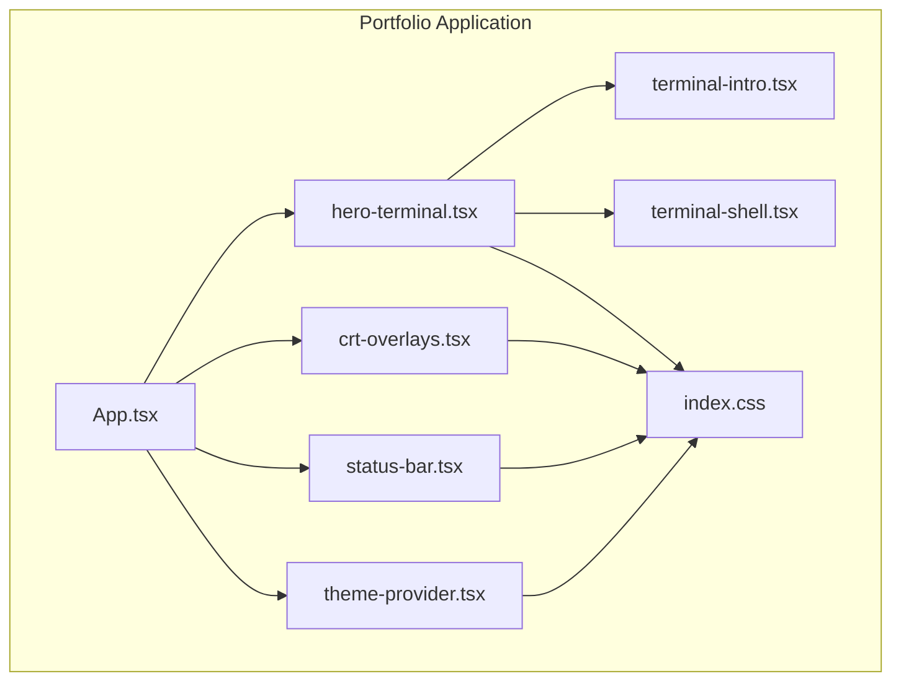
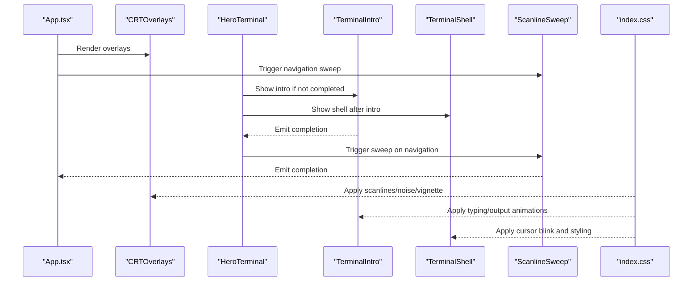
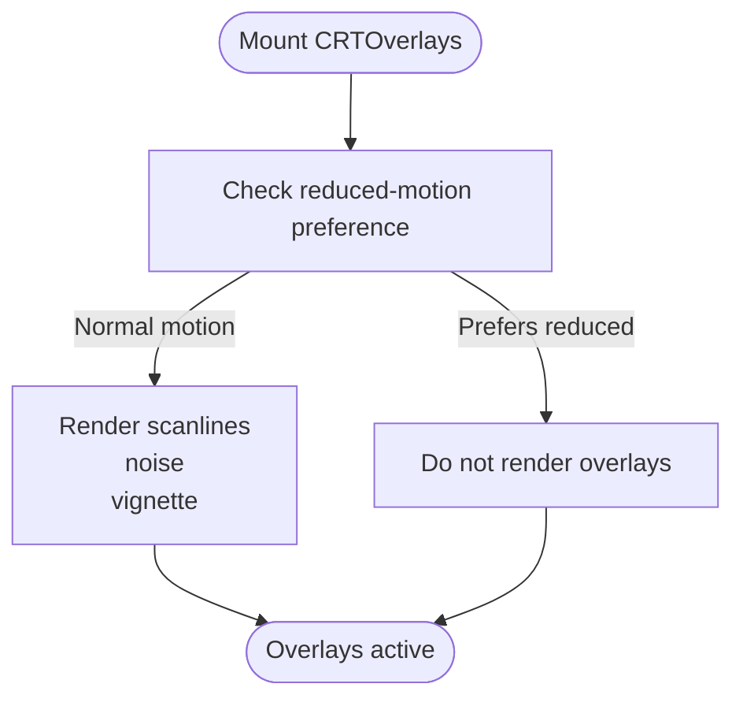
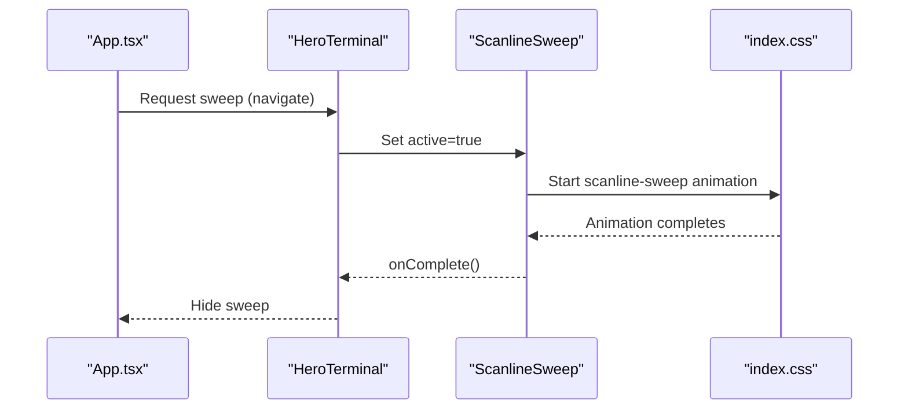
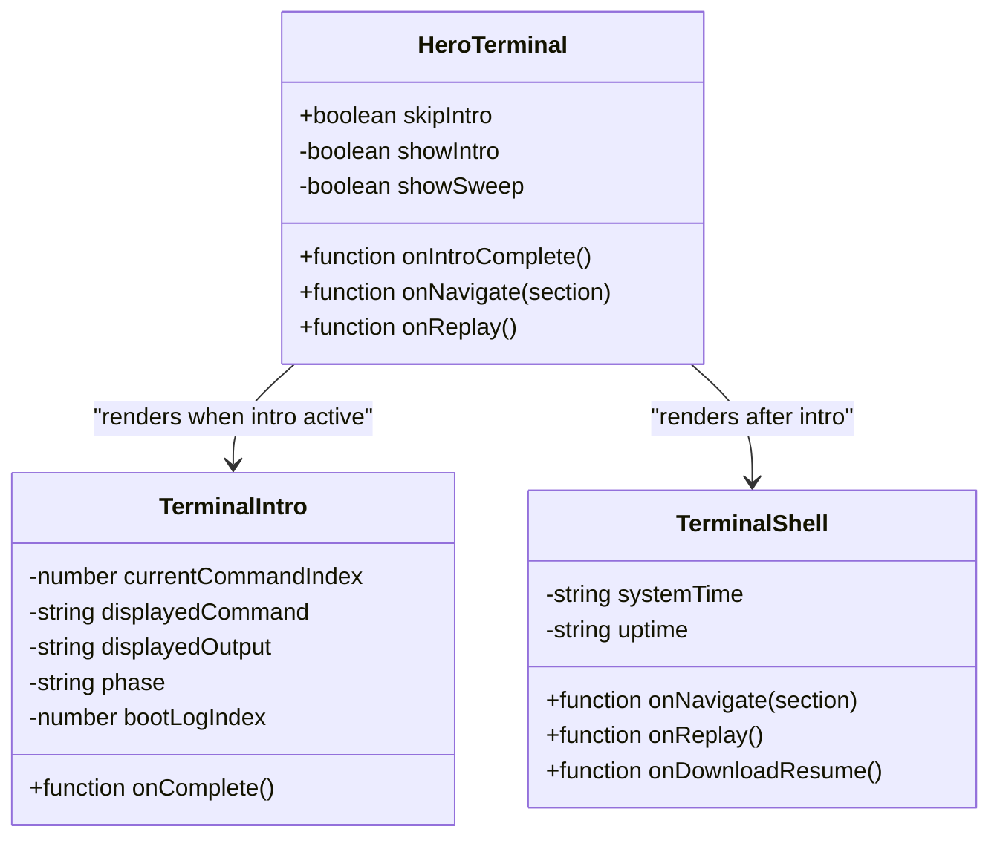
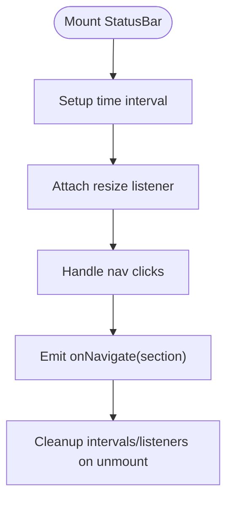
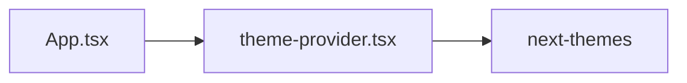
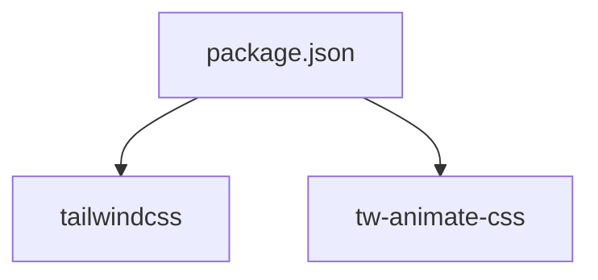

# CRT Effects and Styling

<cite>
**Referenced Files in This Document**
- [App.tsx](file://portfolio/src/App.tsx)
- [crt-overlays.tsx](file://portfolio/src/components/crt-overlays.tsx)
- [hero-terminal.tsx](file://portfolio/src/components/hero-terminal.tsx)
- [terminal-intro.tsx](file://portfolio/src/components/terminal-intro.tsx)
- [terminal-shell.tsx](file://portfolio/src/components/terminal-shell.tsx)
- [index.css](file://portfolio/src/index.css)
- [status-bar.tsx](file://portfolio/src/components/status-bar.tsx)
- [theme-provider.tsx](file://portfolio/src/components/theme-provider.tsx)
- [package.json](file://portfolio/package.json)
</cite>

## Table of Contents
1. [Introduction](#introduction)
2. [Project Structure](#project-structure)
3. [Core Components](#core-components)
4. [Architecture Overview](#architecture-overview)
5. [Detailed Component Analysis](#detailed-component-analysis)
6. [Dependency Analysis](#dependency-analysis)
7. [Performance Considerations](#performance-considerations)
8. [Troubleshooting Guide](#troubleshooting-guide)
9. [Conclusion](#conclusion)

## Introduction
This document explains the CRT effects and retro styling system implemented in the portfolio application. It covers the CRT overlay components (scanlines, noise, vignette), the scanline sweep animation, the hero terminal interface with terminal-like styling and cursor effects, and the theme provider system that manages CRT color schemes and typography. It also documents the CSS custom properties used for CRT aesthetics, animation timing and performance considerations, and the integration between JavaScript-driven animations and CSS transitions.

## Project Structure
The CRT styling system is primarily implemented in the portfolio application under the `portfolio/src` directory. Key areas include:
- Global styles and CRT-specific CSS custom properties
- CRT overlay components (scanlines, noise, vignette, sweep)
- Hero terminal with intro sequence and shell content
- Status bar with CRT-styled navigation
- Theme provider for managing themes

**Diagram sources**
- [App.tsx](file://portfolio/src/App.tsx#L87-L140)
- [crt-overlays.tsx](file://portfolio/src/components/crt-overlays.tsx#L5-L26)
- [hero-terminal.tsx](file://portfolio/src/components/hero-terminal.tsx#L14-L78)
- [terminal-intro.tsx](file://portfolio/src/components/terminal-intro.tsx#L28-L165)
- [terminal-shell.tsx](file://portfolio/src/components/terminal-shell.tsx#L30-L183)
- [status-bar.tsx](file://portfolio/src/components/status-bar.tsx#L24-L113)
- [theme-provider.tsx](file://portfolio/src/components/theme-provider.tsx#L9-L11)
- [index.css](file://portfolio/src/index.css#L6-L39)

**Section sources**
- [App.tsx](file://portfolio/src/App.tsx#L87-L140)
- [index.css](file://portfolio/src/index.css#L6-L39)

## Core Components
- CRTOverlays: Renders persistent CRT scanlines, noise, and vignette overlays when motion preferences allow.
- ScanlineSweep: Implements a single-use scanline sweep animation triggered by navigation or intro completion.
- HeroTerminal: Hosts the terminal interface with header, content area, and optional intro sequence.
- TerminalIntro: Drives the animated boot sequence with typing and output phases, respecting reduced motion.
- TerminalShell: Provides the main terminal content with system info, command buttons, and prompt.
- StatusBar: CRT-styled navigation bar with live clock and interactive navigation.
- ThemeProvider: Wraps the app with theme management capabilities.
- index.css: Defines CRT color tokens, typography, overlays, animations, and cursor effects.

**Section sources**
- [crt-overlays.tsx](file://portfolio/src/components/crt-overlays.tsx#L5-L53)
- [hero-terminal.tsx](file://portfolio/src/components/hero-terminal.tsx#L14-L78)
- [terminal-intro.tsx](file://portfolio/src/components/terminal-intro.tsx#L28-L165)
- [terminal-shell.tsx](file://portfolio/src/components/terminal-shell.tsx#L30-L183)
- [status-bar.tsx](file://portfolio/src/components/status-bar.tsx#L24-L113)
- [theme-provider.tsx](file://portfolio/src/components/theme-provider.tsx#L9-L11)
- [index.css](file://portfolio/src/index.css#L6-L39)

## Architecture Overview
The CRT styling system integrates React components with CSS custom properties and animations. The App orchestrates CRT overlays and navigation sweeps, while the hero terminal coordinates intro and shell content. CSS defines CRT-specific tokens and animations, and the theme provider enables theme-aware rendering.

**Diagram sources**
- [App.tsx](file://portfolio/src/App.tsx#L87-L140)
- [crt-overlays.tsx](file://portfolio/src/components/crt-overlays.tsx#L5-L53)
- [hero-terminal.tsx](file://portfolio/src/components/hero-terminal.tsx#L14-L78)
- [terminal-intro.tsx](file://portfolio/src/components/terminal-intro.tsx#L28-L165)
- [terminal-shell.tsx](file://portfolio/src/components/terminal-shell.tsx#L30-L183)
- [index.css](file://portfolio/src/index.css#L102-L206)

## Detailed Component Analysis

### CRT Overlay Components
The CRT overlay system provides three persistent visual effects layered beneath the main content:
- Scanlines: Repeating linear gradient rows simulating CRT phosphor row alignment.
- Noise: Low-opacity fractal noise overlay for film grain texture.
- Vignette: Radial gradient dimming toward edges for depth and focus.

**Diagram sources**
- [crt-overlays.tsx](file://portfolio/src/components/crt-overlays.tsx#L5-L26)
- [index.css](file://portfolio/src/index.css#L102-L139)

**Section sources**
- [crt-overlays.tsx](file://portfolio/src/components/crt-overlays.tsx#L5-L26)
- [index.css](file://portfolio/src/index.css#L102-L139)

### Scanline Sweep Animation
The scanline sweep is a transient effect that animates a horizontal band across the viewport to simulate a CRT monitor's electron beam scanning the screen. It is controlled by a prop and emits a completion callback after the animation finishes.

**Diagram sources**
- [App.tsx](file://portfolio/src/App.tsx#L63-L73)
- [hero-terminal.tsx](file://portfolio/src/components/hero-terminal.tsx#L29-L37)
- [crt-overlays.tsx](file://portfolio/src/components/crt-overlays.tsx#L33-L53)
- [index.css](file://portfolio/src/index.css#L141-L175)

**Section sources**
- [crt-overlays.tsx](file://portfolio/src/components/crt-overlays.tsx#L33-L53)
- [index.css](file://portfolio/src/index.css#L141-L175)

### Hero Terminal Styling and Behavior
The hero terminal encapsulates the CRT terminal UI with:
- Terminal header with status dots and shell indicator
- Content area switching between intro sequence and shell content
- System information panel (time, uptime, status)
- Command buttons and prompt with blinking cursor
- Cursor blink animation and text glow effects

**Diagram sources**
- [hero-terminal.tsx](file://portfolio/src/components/hero-terminal.tsx#L7-L78)
- [terminal-intro.tsx](file://portfolio/src/components/terminal-intro.tsx#L24-L165)
- [terminal-shell.tsx](file://portfolio/src/components/terminal-shell.tsx#L16-L183)

**Section sources**
- [hero-terminal.tsx](file://portfolio/src/components/hero-terminal.tsx#L14-L78)
- [terminal-intro.tsx](file://portfolio/src/components/terminal-intro.tsx#L28-L165)
- [terminal-shell.tsx](file://portfolio/src/components/terminal-shell.tsx#L30-L183)

### Status Bar with CRT Styling
The status bar provides CRT-styled navigation with:
- Prompt text and navigation items
- Live clock synchronized via interval
- Online indicator and resume link
- Responsive command labels and glow effects

**Diagram sources**
- [status-bar.tsx](file://portfolio/src/components/status-bar.tsx#L24-L113)

**Section sources**
- [status-bar.tsx](file://portfolio/src/components/status-bar.tsx#L24-L113)

### Theme Provider System
The theme provider wraps the application to enable theme-aware rendering. While it delegates theme management to an external library, it centralizes theme configuration and props passing.

**Diagram sources**
- [theme-provider.tsx](file://portfolio/src/components/theme-provider.tsx#L9-L11)
- [App.tsx](file://portfolio/src/App.tsx#L87-L140)

**Section sources**
- [theme-provider.tsx](file://portfolio/src/components/theme-provider.tsx#L9-L11)
- [App.tsx](file://portfolio/src/App.tsx#L87-L140)

## Dependency Analysis
The CRT styling system relies on Tailwind CSS and a CSS animation library for transitions. The hero terminal depends on the CRT overlay components and status bar. JavaScript-driven animations integrate with CSS keyframes and custom properties.

**Diagram sources**
- [package.json](file://portfolio/package.json#L61-L72)

**Section sources**
- [package.json](file://portfolio/package.json#L61-L72)

## Performance Considerations
- Reduced motion support: The system respects user motion preferences by disabling animations and overlays when reduced motion is enabled. This is handled via media queries and conditional rendering.
- Animation timing: The scanline sweep animation duration is short (180 ms) to minimize perceived latency during navigation.
- CSS vs. JS: Animations are primarily CSS-driven (keyframes, transitions) to leverage GPU acceleration and maintain smoothness.
- Overlay stacking: Overlays use high z-index values but are designed to be lightweight (gradients, SVG noise).
- Cursor blink: The cursor animation uses a simple step-end timing to avoid unnecessary complexity.

[No sources needed since this section provides general guidance]

## Troubleshooting Guide
- Overlays not appearing:
  - Verify reduced motion settings; overlays are intentionally hidden when reduced motion is preferred.
  - Ensure the CRT overlay components are rendered in the DOM.
- Scanline sweep not triggering:
  - Confirm the sweep component receives the active prop and that the completion callback is wired correctly.
  - Check that the animation duration matches the timeout used in the parent component.
- Cursor not blinking:
  - Confirm the cursor element has the blink animation class applied.
  - Verify reduced motion is not enabled, which disables the blink animation.
- Color mismatches:
  - Ensure CRT custom properties are defined in the global stylesheet and used consistently across components.

**Section sources**
- [crt-overlays.tsx](file://portfolio/src/components/crt-overlays.tsx#L3-L15)
- [index.css](file://portfolio/src/index.css#L177-L201)

## Conclusion
The CRT effects and retro styling system combines persistent overlays, transient scanline sweeps, and a terminal-like interface to recreate authentic CRT aesthetics. The design leverages CSS custom properties for consistent theming, integrates responsive reduced motion support, and balances visual fidelity with performance. The hero terminal and status bar provide immersive navigation and presentation, while the theme provider ensures flexible theme management.