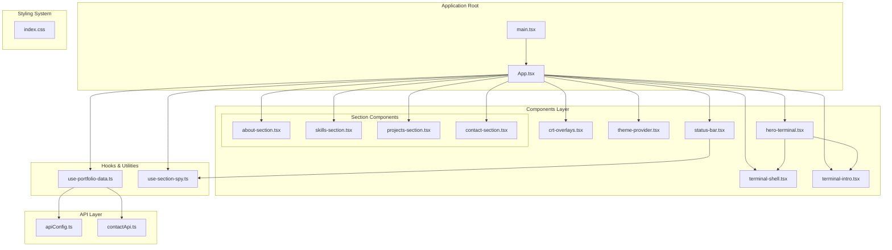
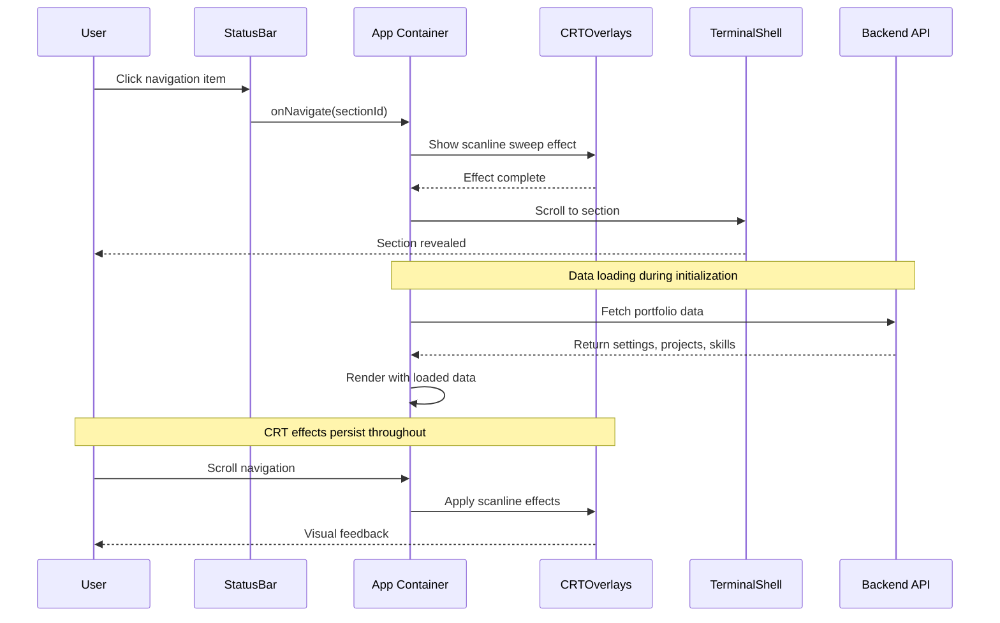
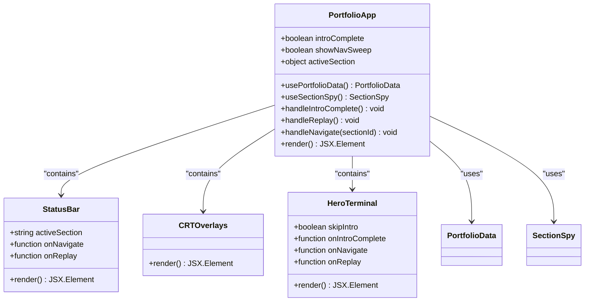
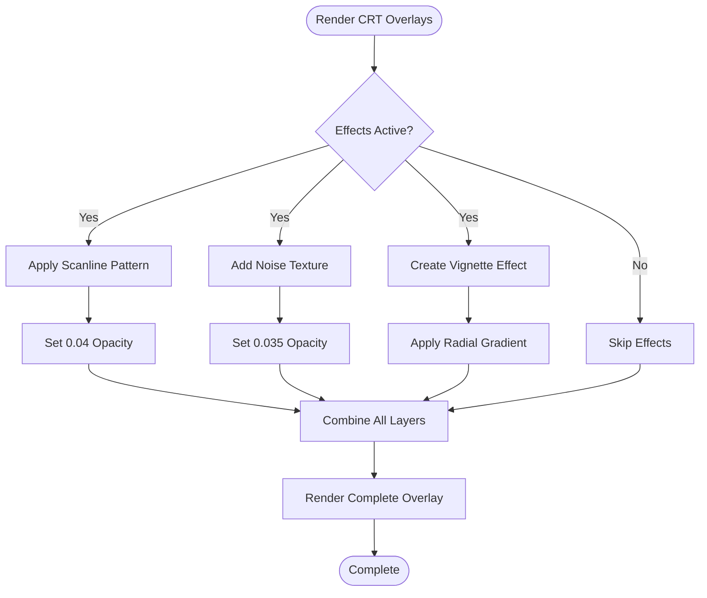
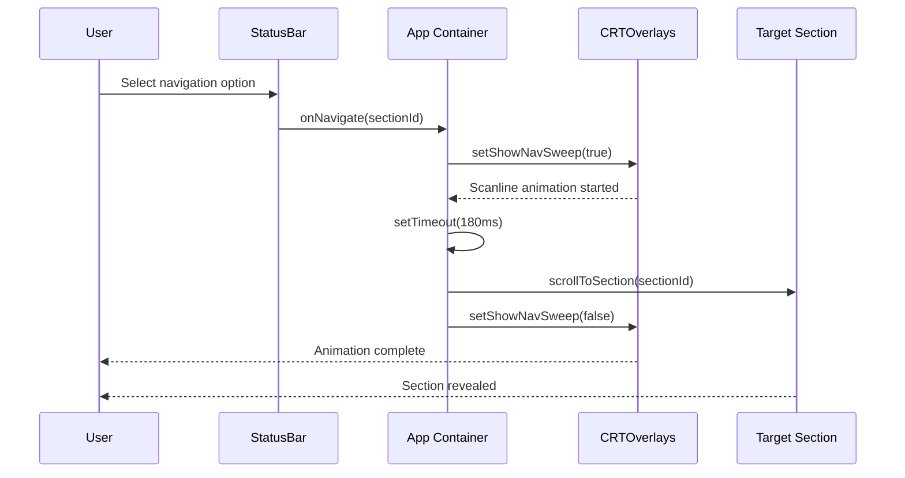
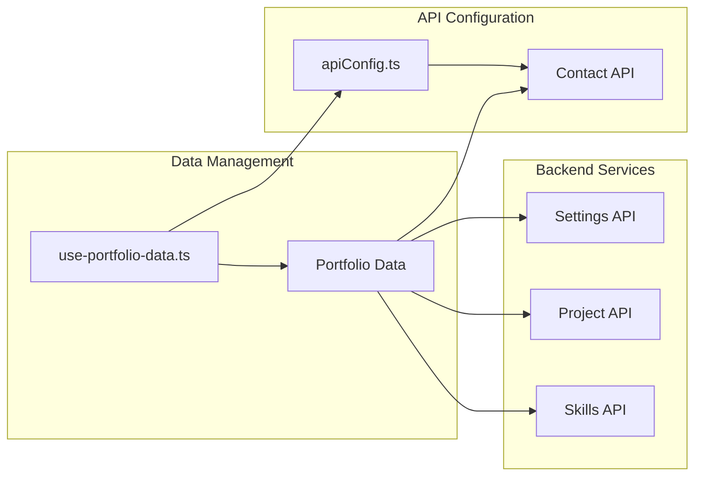

# Terminal Portfolio Application

<cite>
**Referenced Files in This Document**
- [App.tsx](file://portfolio/src/App.tsx)
- [main.tsx](file://portfolio/src/main.tsx)
- [index.css](file://portfolio/src/index.css)
- [crt-overlays.tsx](file://portfolio/src/components/crt-overlays.tsx)
- [hero-terminal.tsx](file://portfolio/src/components/hero-terminal.tsx)
- [status-bar.tsx](file://portfolio/src/components/status-bar.tsx)
- [terminal-intro.tsx](file://portfolio/src/components/terminal-intro.tsx)
- [terminal-shell.tsx](file://portfolio/src/components/terminal-shell.tsx)
- [theme-provider.tsx](file://portfolio/src/components/theme-provider.tsx)
- [use-portfolio-data.ts](file://portfolio/src/hooks/use-portfolio-data.ts)
- [use-section-spy.ts](file://portfolio/src/hooks/use-section-spy.ts)
- [apiConfig.ts](file://portfolio/src/lib/apiConfig.ts)
- [contactApi.ts](file://portfolio/src/api/contactApi.ts)
- [vite.config.ts](file://portfolio/vite.config.ts)
- [package.json](file://portfolio/package.json)
- [tsconfig.json](file://portfolio/tsconfig.json)
- [postcss.config.mjs](file://portfolio/postcss.config.mjs)
- [index.html](file://portfolio/index.html)
</cite>

## Table of Contents
1. [Introduction](#introduction)
2. [Project Structure](#project-structure)
3. [Core Components](#core-components)
4. [Architecture Overview](#architecture-overview)
5. [Detailed Component Analysis](#detailed-component-analysis)
6. [Retro Styling System](#retro-styling-system)
7. [Build Configuration](#build-configuration)
8. [Backend Integration](#backend-integration)
9. [Performance Considerations](#performance-considerations)
10. [Troubleshooting Guide](#troubleshooting-guide)
11. [Conclusion](#conclusion)

## Introduction

The Terminal Portfolio application is a retro-styled web portfolio that emulates a classic terminal interface while delivering modern functionality. This single-page application combines nostalgic CRT aesthetics with contemporary React development practices to create an immersive user experience that feels like navigating through a vintage computer terminal.

The application implements a unique component architecture centered around terminal emulation, featuring animated CRT overlays, a functional status bar, and a shell-like navigation system. It maintains seamless integration with shared backend APIs while preserving the authentic terminal feel throughout the user interface.

## Project Structure

The Terminal Portfolio follows a modular React architecture with clear separation between presentation components, styling systems, and data management layers.

**Diagram sources**
- [main.tsx](file://portfolio/src/main.tsx#L1-L11)
- [App.tsx](file://portfolio/src/App.tsx#L1-L142)
- [index.css](file://portfolio/src/index.css#L1-L226)

**Section sources**
- [main.tsx](file://portfolio/src/main.tsx#L1-L11)
- [App.tsx](file://portfolio/src/App.tsx#L1-L142)

## Core Components

The application's core architecture revolves around several key components that work together to create the terminal emulation experience:

### Terminal Shell Interface
The central navigation system that provides shell-like command functionality and section switching capabilities. It integrates with the CRT overlay system to deliver authentic terminal animations during navigation.

### CRT Overlay Effects
A sophisticated layering system that applies retro visual effects including scanlines, noise textures, and vignetting to recreate the authentic CRT monitor appearance.

### Status Bar Implementation
A functional terminal-style status bar that displays current location, system information, and navigation controls with blinking cursor effects.

### Theme Provider System
A comprehensive theming solution that manages the complete color palette and typography system for the retro terminal aesthetic.

**Section sources**
- [App.tsx](file://portfolio/src/App.tsx#L41-L141)

## Architecture Overview

The Terminal Portfolio implements a layered architecture that separates concerns between presentation, styling, and data management while maintaining tight integration between components.

**Diagram sources**
- [App.tsx](file://portfolio/src/App.tsx#L64-L73)
- [crt-overlays.tsx](file://portfolio/src/components/crt-overlays.tsx)
- [status-bar.tsx](file://portfolio/src/components/status-bar.tsx)

The architecture emphasizes component composition patterns where each visual element serves a specific role in the terminal emulation experience while maintaining loose coupling between major subsystems.

## Detailed Component Analysis

### App Container Component

The main application container orchestrates the entire terminal experience, managing state for intro completion, navigation effects, and data loading.

**Diagram sources**
- [App.tsx](file://portfolio/src/App.tsx#L41-L141)
- [status-bar.tsx](file://portfolio/src/components/status-bar.tsx)
- [crt-overlays.tsx](file://portfolio/src/components/crt-overlays.tsx)
- [hero-terminal.tsx](file://portfolio/src/components/hero-terminal.tsx)

**Section sources**
- [App.tsx](file://portfolio/src/App.tsx#L41-L141)

### CRT Overlay System

The CRT overlay system creates authentic visual effects through layered CSS animations and pseudo-elements.

**Diagram sources**
- [index.css](file://portfolio/src/index.css#L102-L139)

**Section sources**
- [index.css](file://portfolio/src/index.css#L102-L139)

### Terminal Navigation System

The navigation system implements shell-like functionality with animated transitions and visual feedback.

**Diagram sources**
- [App.tsx](file://portfolio/src/App.tsx#L64-L73)

**Section sources**
- [App.tsx](file://portfolio/src/App.tsx#L64-L73)

## Retro Styling System

The styling system implements a comprehensive CRT terminal aesthetic through carefully crafted CSS custom properties and animations.

### Color Palette Architecture

The application defines a complete color system optimized for CRT monitors with high contrast and phosphor glow effects:

| Color Category | Purpose | Implementation |
|---------------|---------|----------------|
| Background | Screen background | `#020304` (dark blue-black) |
| Text Foreground | Primary text | `#D7FFE7` (cyan-green) |
| Accent | Highlights and borders | `#00FF84` (neon green) |
| Panel | UI panels | `#071014` and `#0B161C` |
| Muted | Secondary text | `#8FB3A3` (desaturated cyan) |

### Typography System

The application uses JetBrains Mono as the primary monospace font, ensuring consistent character spacing and retro terminal authenticity. The font system supports both sans-serif and monospace variants for different UI elements.

### Animation Framework

Multiple CSS animations create the authentic terminal experience:

- **Scanline Sweep**: Smooth vertical sweep animation with phosphor persistence
- **Blinking Cursor**: Stepped animation for terminal-style cursor
- **Text Glow**: Subtle neon glow effect for enhanced readability
- **Reduced Motion Support**: Automatic adaptation for accessibility preferences

**Section sources**
- [index.css](file://portfolio/src/index.css#L6-L80)
- [index.css](file://portfolio/src/index.css#L141-L206)

## Build Configuration

The Terminal Portfolio uses Vite as its build tool, configured specifically for optimal performance with animated CSS and TypeScript compilation.

### Vite Configuration Features

The build system includes optimizations tailored for the terminal aesthetic:

- **CSS-in-JS Compatibility**: Supports Tailwind CSS and custom animations
- **Asset Optimization**: Efficient handling of SVG overlays and background textures
- **Development Experience**: Fast hot module replacement with source maps
- **Production Optimizations**: Tree shaking and minification for smooth animations

### Package Dependencies

Key dependencies supporting the terminal experience:

- **React 18**: Latest features with concurrent rendering
- **Tailwind CSS**: Utility-first styling with custom theme
- **TypeScript**: Type safety for component interfaces
- **Vite**: Lightning-fast build tool with excellent DX

**Section sources**
- [vite.config.ts](file://portfolio/vite.config.ts)
- [package.json](file://portfolio/package.json)
- [tsconfig.json](file://portfolio/tsconfig.json)

## Backend Integration

The application integrates with shared backend APIs through a unified configuration system that supports both local development and production environments.

### API Configuration

The API system provides centralized configuration for all backend endpoints:

**Diagram sources**
- [apiConfig.ts](file://portfolio/src/lib/apiConfig.ts)
- [use-portfolio-data.ts](file://portfolio/src/hooks/use-portfolio-data.ts)
- [contactApi.ts](file://portfolio/src/api/contactApi.ts)

### Data Loading Strategy

The application implements intelligent data loading with fallback mechanisms:

- **Primary Data Source**: Server-provided content from shared backend
- **Local Fallback**: Static data for offline scenarios
- **Loading States**: Graceful transitions during data fetch
- **Error Handling**: Robust error management with user feedback

**Section sources**
- [use-portfolio-data.ts](file://portfolio/src/hooks/use-portfolio-data.ts)
- [apiConfig.ts](file://portfolio/src/lib/apiConfig.ts)

## Performance Considerations

The Terminal Portfolio implements several performance optimizations to maintain smooth animations and responsive interactions despite the complex visual effects.

### Animation Performance

- **Hardware Acceleration**: CSS transforms and opacity changes leverage GPU acceleration
- **Animation Timing**: Carefully tuned durations (180ms for scanline sweep) balance realism with performance
- **Reduced Motion Support**: Automatic adaptation for users with motion sensitivity
- **Layer Optimization**: Proper z-index stacking minimizes paint operations

### Memory Management

- **Component Lifecycle**: Proper cleanup of event listeners and timeouts
- **State Management**: Minimal state updates to reduce re-renders
- **Asset Loading**: Efficient handling of SVG overlays and background images

### Rendering Optimization

- **CSS Custom Properties**: Dynamic theming without expensive reflows
- **Container Queries**: Responsive layouts that minimize layout thrashing
- **Intersection Observer**: Lazy loading for off-screen content

## Troubleshooting Guide

Common issues and their solutions for the Terminal Portfolio application:

### CRT Effects Not Appearing

**Symptoms**: Scanlines, noise, or vignette overlays missing
**Causes**: CSS not loaded, z-index conflicts, or browser compatibility issues
**Solutions**: 
- Verify CSS imports in main stylesheet
- Check z-index values (should be 9997-10000 range)
- Test in supported browsers (Chrome, Firefox, Edge)

### Navigation Animations Stuttering

**Symptoms**: Choppy scanline sweep or janky section transitions
**Causes**: CPU throttling, insufficient hardware acceleration, or excessive DOM manipulation
**Solutions**:
- Disable reduced motion preferences temporarily
- Close other resource-intensive applications
- Ensure GPU acceleration is enabled in browser settings

### Data Loading Issues

**Symptoms**: Content not displaying or loading indefinitely
**Causes**: Network connectivity, API endpoint changes, or CORS issues
**Solutions**:
- Check browser console for network errors
- Verify API endpoint configuration
- Test with different network connections

### Build Errors

**Symptoms**: Compilation failures or missing dependencies
**Causes**: Outdated Node.js version, corrupted package cache, or configuration issues
**Solutions**:
- Update Node.js to LTS version
- Clear npm/yarn cache and reinstall dependencies
- Verify TypeScript configuration matches project structure

**Section sources**
- [index.css](file://portfolio/src/index.css#L191-L201)
- [App.tsx](file://portfolio/src/App.tsx#L76-L85)

## Conclusion

The Terminal Portfolio application demonstrates a sophisticated approach to combining nostalgic design elements with modern web development practices. Through careful component architecture, comprehensive styling system, and optimized performance considerations, it delivers an authentic terminal experience that maintains usability and accessibility.

The application's modular design allows for easy maintenance and extension while preserving the core retro aesthetic. The integration with shared backend APIs ensures content consistency across platforms, and the build configuration supports both development flexibility and production performance.

This architectural approach serves as a model for creating immersive web experiences that honor design history while embracing contemporary web standards and user expectations.