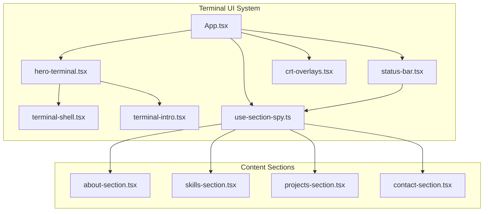
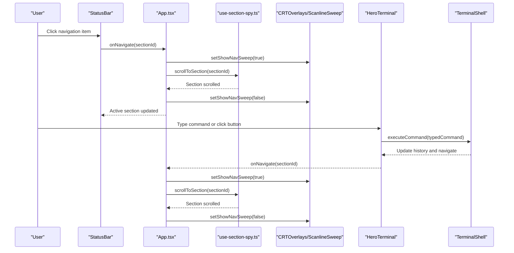
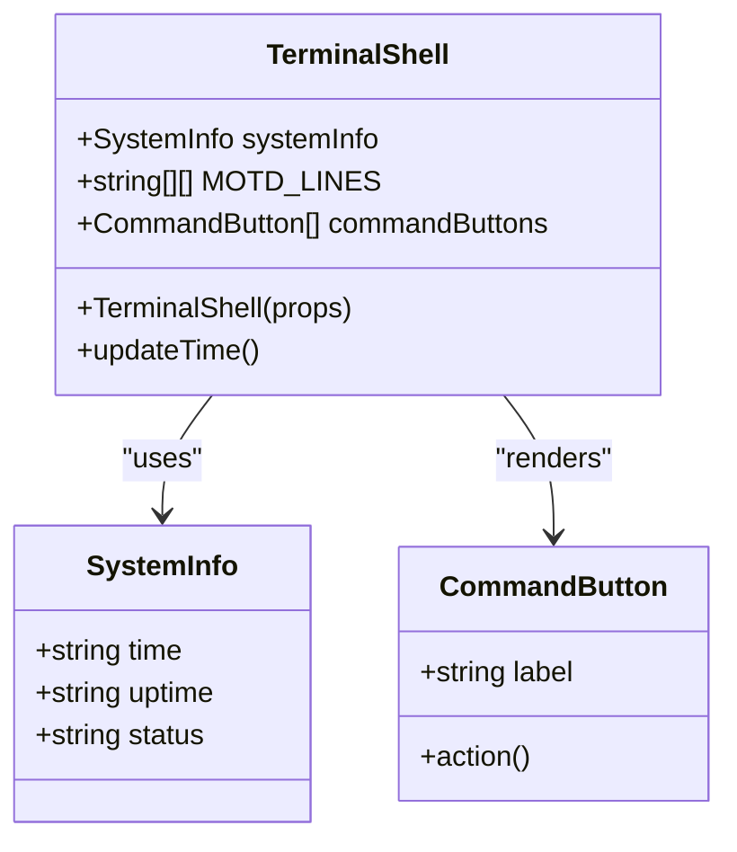
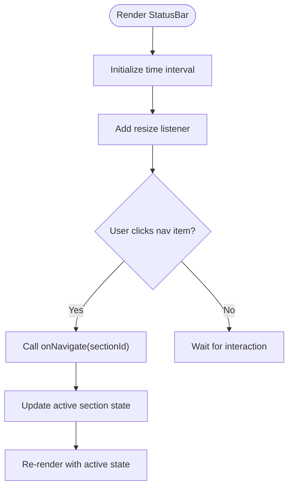
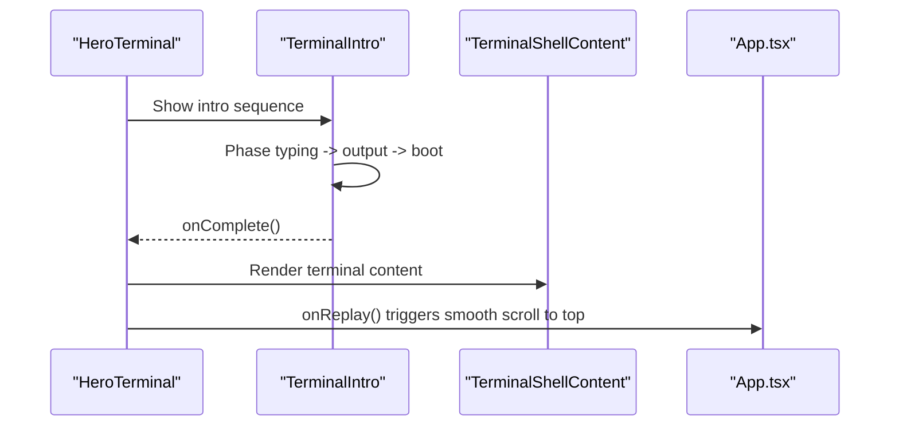
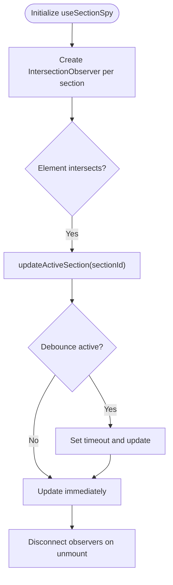
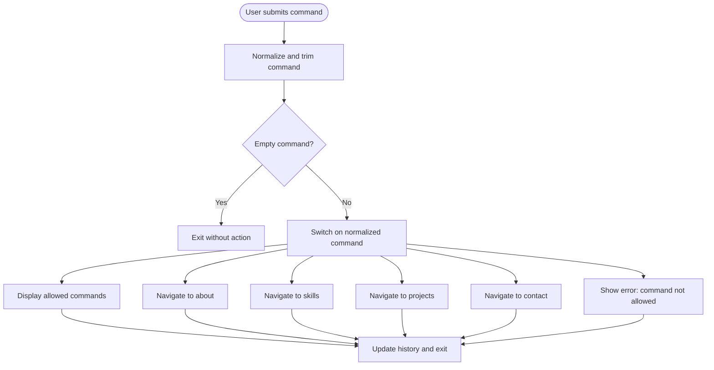
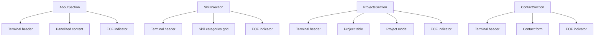
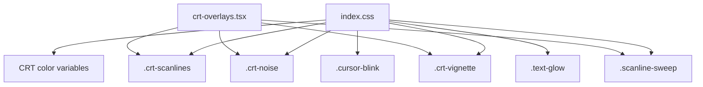
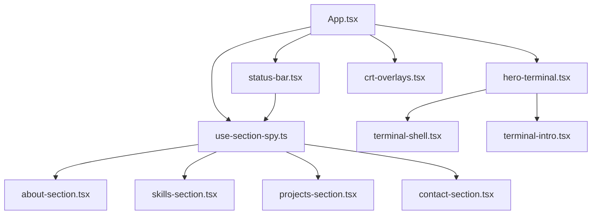

# Terminal UI System

<cite>
**Referenced Files in This Document**
- [App.tsx](file://portfolio/src/App.tsx)
- [terminal-shell.tsx](file://portfolio/src/components/terminal-shell.tsx)
- [status-bar.tsx](file://portfolio/src/components/status-bar.tsx)
- [hero-terminal.tsx](file://portfolio/src/components/hero-terminal.tsx)
- [terminal-intro.tsx](file://portfolio/src/components/terminal-intro.tsx)
- [crt-overlays.tsx](file://portfolio/src/components/crt-overlays.tsx)
- [use-section-spy.ts](file://portfolio/src/hooks/use-section-spy.ts)
- [index.css](file://portfolio/src/index.css)
- [about-section.tsx](file://portfolio/src/components/sections/about-section.tsx)
- [projects-section.tsx](file://portfolio/src/components/sections/projects-section.tsx)
- [skills-section.tsx](file://portfolio/src/components/sections/skills-section.tsx)
- [contact-section.tsx](file://portfolio/src/components/sections/contact-section.tsx)
</cite>

## Table of Contents
1. [Introduction](#introduction)
2. [Project Structure](#project-structure)
3. [Core Components](#core-components)
4. [Architecture Overview](#architecture-overview)
5. [Detailed Component Analysis](#detailed-component-analysis)
6. [Dependency Analysis](#dependency-analysis)
7. [Performance Considerations](#performance-considerations)
8. [Troubleshooting Guide](#troubleshooting-guide)
9. [Conclusion](#conclusion)

## Introduction
This document describes the Terminal UI System that powers the retro terminal portfolio. It explains how the terminal shell component architecture integrates with a status bar navigation system, how section-based content is organized, and how terminal-like navigation patterns and command-driven interactions enable seamless page transitions. It also details the section spy hook for viewport tracking, smooth scrolling mechanics, and the overall CRT aesthetic implementation including intro sequences and navigation sweep animations.

## Project Structure
The Terminal UI System is implemented in the portfolio application under the portfolio/src directory. Key components include:
- Terminal shell and hero terminal components for interactive command execution
- Status bar for contextual navigation
- Intro sequence and CRT overlay animations
- Section components representing portfolio content
- Hook for tracking active sections via viewport intersection
- Global CSS defining CRT terminal aesthetics and animations

**Diagram sources**
- [App.tsx](file://portfolio/src/App.tsx#L41-L141)
- [status-bar.tsx](file://portfolio/src/components/status-bar.tsx#L24-L113)
- [hero-terminal.tsx](file://portfolio/src/components/hero-terminal.tsx#L14-L78)
- [terminal-shell.tsx](file://portfolio/src/components/terminal-shell.tsx#L30-L183)
- [terminal-intro.tsx](file://portfolio/src/components/terminal-intro.tsx#L28-L165)
- [crt-overlays.tsx](file://portfolio/src/components/crt-overlays.tsx#L5-L53)
- [use-section-spy.ts](file://portfolio/src/hooks/use-section-spy.ts#L11-L81)
- [about-section.tsx](file://portfolio/src/components/sections/about-section.tsx#L28-L85)
- [skills-section.tsx](file://portfolio/src/components/sections/skills-section.tsx#L97-L141)
- [projects-section.tsx](file://portfolio/src/components/sections/projects-section.tsx#L596-L661)
- [contact-section.tsx](file://portfolio/src/components/sections/contact-section.tsx#L53-L228)

**Section sources**
- [App.tsx](file://portfolio/src/App.tsx#L41-L141)
- [index.css](file://portfolio/src/index.css#L6-L226)

## Core Components
- Terminal Shell: Provides a terminal interface with command prompts, system info panel, and command buttons. It supports both standalone usage and embedded within the hero terminal.
- Status Bar: Fixed header navigation with prompt, section navigation items, time display, online indicator, and resume link. Integrates with the section spy hook to reflect active section.
- Hero Terminal: Hosts the intro sequence and terminal shell content. Manages intro visibility, sweep animations, and navigation callbacks.
- Terminal Intro: Executes a boot sequence with typing and output animations, then transitions to the main terminal shell.
- CRT Overlays: Applies scanlines, noise, vignette, and scanline sweep animations with reduced motion support.
- Section Spy Hook: Tracks active section via IntersectionObserver with debouncing and provides smooth scrolling to sections.
- Content Sections: About, Skills, Projects, and Contact sections styled to match the terminal aesthetic and integrate with terminal commands.

**Section sources**
- [terminal-shell.tsx](file://portfolio/src/components/terminal-shell.tsx#L30-L183)
- [status-bar.tsx](file://portfolio/src/components/status-bar.tsx#L24-L113)
- [hero-terminal.tsx](file://portfolio/src/components/hero-terminal.tsx#L14-L78)
- [terminal-intro.tsx](file://portfolio/src/components/terminal-intro.tsx#L28-L165)
- [crt-overlays.tsx](file://portfolio/src/components/crt-overlays.tsx#L5-L53)
- [use-section-spy.ts](file://portfolio/src/hooks/use-section-spy.ts#L11-L81)
- [about-section.tsx](file://portfolio/src/components/sections/about-section.tsx#L28-L85)
- [skills-section.tsx](file://portfolio/src/components/sections/skills-section.tsx#L97-L141)
- [projects-section.tsx](file://portfolio/src/components/sections/projects-section.tsx#L596-L661)
- [contact-section.tsx](file://portfolio/src/components/sections/contact-section.tsx#L53-L228)

## Architecture Overview
The system orchestrates navigation between sections using terminal commands and status bar clicks. The status bar reflects the active section, while the hero terminal provides an immersive intro and command-driven navigation. Smooth scrolling and CRT animations enhance the user experience.

**Diagram sources**
- [App.tsx](file://portfolio/src/App.tsx#L46-L73)
- [status-bar.tsx](file://portfolio/src/components/status-bar.tsx#L48-L50)
- [hero-terminal.tsx](file://portfolio/src/components/hero-terminal.tsx#L130-L173)
- [terminal-shell.tsx](file://portfolio/src/components/terminal-shell.tsx#L153-L167)
- [use-section-spy.ts](file://portfolio/src/hooks/use-section-spy.ts#L72-L78)
- [crt-overlays.tsx](file://portfolio/src/components/crt-overlays.tsx#L33-L53)

## Detailed Component Analysis

### Terminal Shell Component
The terminal shell renders a terminal interface with:
- Header with window controls and shell identifier
- Left pane displaying MOTD, help text, command history, and prompt
- Right pane with system info (time, uptime, status, profile, stack)
- Bottom bar with command buttons for quick actions

It maintains system time and uptime, and exposes navigation and download callbacks to the parent container.

**Diagram sources**
- [terminal-shell.tsx](file://portfolio/src/components/terminal-shell.tsx#L5-L63)
- [terminal-shell.tsx](file://portfolio/src/components/terminal-shell.tsx#L31-L56)

**Section sources**
- [terminal-shell.tsx](file://portfolio/src/components/terminal-shell.tsx#L30-L183)

### Status Bar Implementation
The status bar provides contextual navigation with:
- Prompt display that adapts to screen size
- Navigation items mapped to portfolio sections with command labels
- Active section highlighting and glow effect
- Live time display and online indicator
- Resume link and replay button

It listens to resize events to toggle command labels and updates active section state.

**Diagram sources**
- [status-bar.tsx](file://portfolio/src/components/status-bar.tsx#L24-L50)
- [status-bar.tsx](file://portfolio/src/components/status-bar.tsx#L48-L85)

**Section sources**
- [status-bar.tsx](file://portfolio/src/components/status-bar.tsx#L24-L113)

### Hero Terminal and Intro Sequence
The hero terminal hosts:
- Intro sequence with typing and output animations
- Terminal shell content with command history and prompt
- Navigation sweep animation triggered on section transitions
- Download resume handler and replay controls

The intro sequence uses a multi-phase animation (typing, output, boot logs) and respects reduced motion preferences.

**Diagram sources**
- [hero-terminal.tsx](file://portfolio/src/components/hero-terminal.tsx#L29-L37)
- [terminal-intro.tsx](file://portfolio/src/components/terminal-intro.tsx#L28-L112)
- [App.tsx](file://portfolio/src/App.tsx#L59-L61)

**Section sources**
- [hero-terminal.tsx](file://portfolio/src/components/hero-terminal.tsx#L14-L78)
- [terminal-intro.tsx](file://portfolio/src/components/terminal-intro.tsx#L28-L165)

### Section Spy Hook and Smooth Scrolling
The section spy hook:
- Observes section intersections with configurable offset and threshold
- Debounces updates to prevent frequent re-renders
- Provides scrollToSection with smooth scrolling to section start
- Returns active section ID for status bar highlighting

**Diagram sources**
- [use-section-spy.ts](file://portfolio/src/hooks/use-section-spy.ts#L40-L70)
- [use-section-spy.ts](file://portfolio/src/hooks/use-section-spy.ts#L20-L37)

**Section sources**
- [use-section-spy.ts](file://portfolio/src/hooks/use-section-spy.ts#L11-L81)

### Terminal Command-Driven Navigation
Terminal commands in the hero terminal shell:
- help: lists allowed commands
- cat about.txt or about: navigates to about section
- skills --list or skills: navigates to skills section
- ls projects/ or projects: navigates to projects section
- ping pamod or contact: navigates to contact section
- Unknown commands: produce error output

The command execution updates history and triggers navigation callbacks.

**Diagram sources**
- [hero-terminal.tsx](file://portfolio/src/components/hero-terminal.tsx#L130-L173)

**Section sources**
- [hero-terminal.tsx](file://portfolio/src/components/hero-terminal.tsx#L130-L173)

### Section-Based Content Organization
Each content section is structured as a terminal command output:
- Terminal-style header with command prompt
- Panelized content area with CRT styling
- EOF indicators and metadata displays
- Interactive elements (e.g., project modals, skill bars)

Examples:
- About section: displays biographical paragraphs and focus areas
- Skills section: renders categorized skill matrices with progress bars
- Projects section: lists projects in a terminal-like table with modal details
- Contact section: presents a form styled as terminal prompts and outputs

**Diagram sources**
- [about-section.tsx](file://portfolio/src/components/sections/about-section.tsx#L28-L85)
- [skills-section.tsx](file://portfolio/src/components/sections/skills-section.tsx#L97-L141)
- [projects-section.tsx](file://portfolio/src/components/sections/projects-section.tsx#L596-L661)
- [contact-section.tsx](file://portfolio/src/components/sections/contact-section.tsx#L53-L228)

**Section sources**
- [about-section.tsx](file://portfolio/src/components/sections/about-section.tsx#L28-L85)
- [skills-section.tsx](file://portfolio/src/components/sections/skills-section.tsx#L97-L141)
- [projects-section.tsx](file://portfolio/src/components/sections/projects-section.tsx#L596-L661)
- [contact-section.tsx](file://portfolio/src/components/sections/contact-section.tsx#L53-L228)

### CRT Aesthetic and Animations
The CRT aesthetic is implemented via global CSS variables and animations:
- CRT color palette with green-on-black theme
- Scanlines, noise, and vignette overlays
- Scanline sweep animation for navigation transitions
- Blinking cursor animation and text glow effects
- Reduced motion support disables animations

**Diagram sources**
- [index.css](file://portfolio/src/index.css#L6-L39)
- [index.css](file://portfolio/src/index.css#L102-L206)
- [crt-overlays.tsx](file://portfolio/src/components/crt-overlays.tsx#L5-L53)

**Section sources**
- [index.css](file://portfolio/src/index.css#L6-L226)
- [crt-overlays.tsx](file://portfolio/src/components/crt-overlays.tsx#L5-L53)

## Dependency Analysis
The system exhibits clear separation of concerns:
- App orchestrates navigation, intro state, and CRT overlays
- Status bar depends on section spy hook for active state
- Hero terminal embeds terminal shell and intro components
- Section spy hook observes DOM elements and manages scroll behavior
- CRT overlays provide visual enhancements without coupling to logic

**Diagram sources**
- [App.tsx](file://portfolio/src/App.tsx#L41-L141)
- [status-bar.tsx](file://portfolio/src/components/status-bar.tsx#L24-L113)
- [hero-terminal.tsx](file://portfolio/src/components/hero-terminal.tsx#L14-L78)
- [terminal-shell.tsx](file://portfolio/src/components/terminal-shell.tsx#L30-L183)
- [terminal-intro.tsx](file://portfolio/src/components/terminal-intro.tsx#L28-L165)
- [use-section-spy.ts](file://portfolio/src/hooks/use-section-spy.ts#L11-L81)
- [about-section.tsx](file://portfolio/src/components/sections/about-section.tsx#L28-L85)
- [skills-section.tsx](file://portfolio/src/components/sections/skills-section.tsx#L97-L141)
- [projects-section.tsx](file://portfolio/src/components/sections/projects-section.tsx#L596-L661)
- [contact-section.tsx](file://portfolio/src/components/sections/contact-section.tsx#L53-L228)

**Section sources**
- [App.tsx](file://portfolio/src/App.tsx#L41-L141)
- [use-section-spy.ts](file://portfolio/src/hooks/use-section-spy.ts#L11-L81)

## Performance Considerations
- IntersectionObserver with rootMargin and threshold reduces unnecessary recalculations
- Debounced updates in the section spy hook minimize re-renders during rapid scrolling
- Reduced motion detection disables heavy animations for accessibility and performance
- Smooth scrolling is enabled globally with reduced motion fallback
- Memoization of command execution and scroll ref prevent excessive re-renders in terminal content

[No sources needed since this section provides general guidance]

## Troubleshooting Guide
Common issues and resolutions:
- Intro sequence does not complete:
  - Verify localStorage availability and permissions
  - Check reduced motion preference disabling animations
- Navigation does not scroll to sections:
  - Ensure section IDs exist in the DOM
  - Confirm scrollToSection is called with valid sectionId
- Status bar does not highlight active section:
  - Validate activeSection state updates from section spy hook
  - Confirm IntersectionObserver thresholds and offsets
- Terminal commands not recognized:
  - Normalize commands to lowercase and trim whitespace
  - Verify command mapping matches expected inputs

**Section sources**
- [App.tsx](file://portfolio/src/App.tsx#L17-L39)
- [use-section-spy.ts](file://portfolio/src/hooks/use-section-spy.ts#L40-L70)
- [hero-terminal.tsx](file://portfolio/src/components/hero-terminal.tsx#L130-L173)

## Conclusion
The Terminal UI System delivers a cohesive, retro-futuristic experience by combining terminal-like interactions with modern web capabilities. The status bar provides contextual navigation, the hero terminal introduces an engaging intro and command-driven navigation, and the section spy hook ensures accurate viewport tracking with smooth scrolling. The CRT aesthetic and animations enhance immersion while maintaining accessibility and performance.