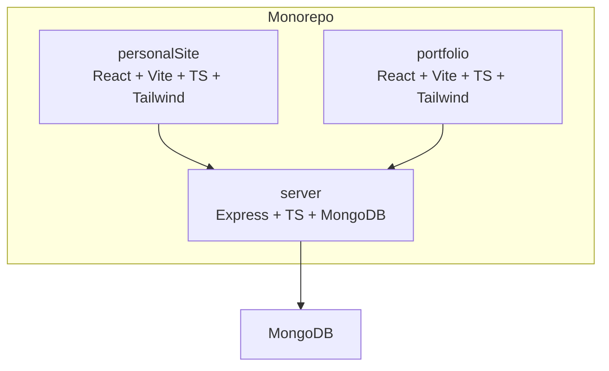
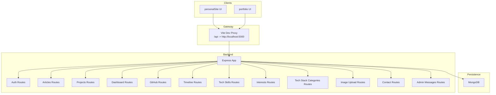
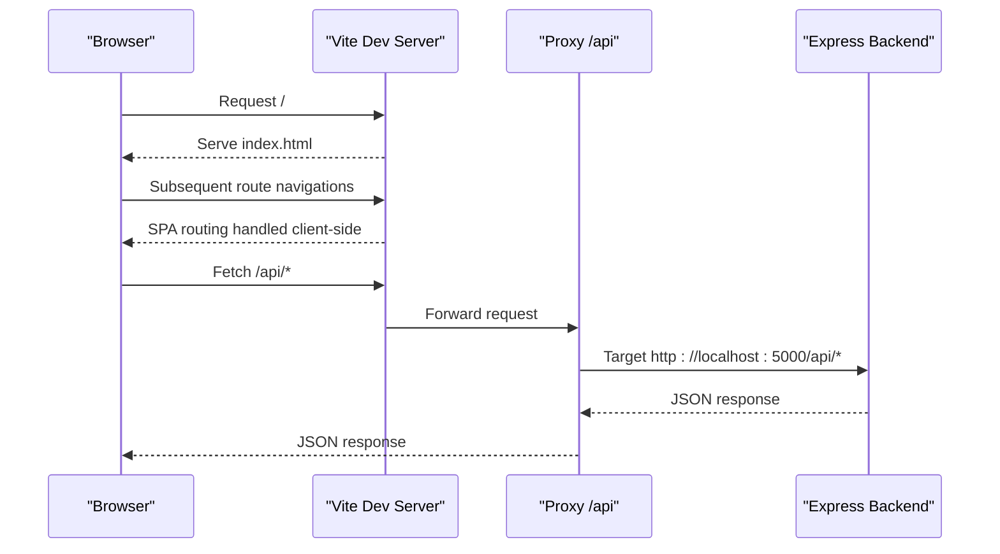
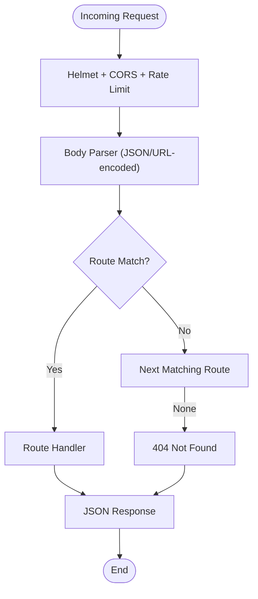
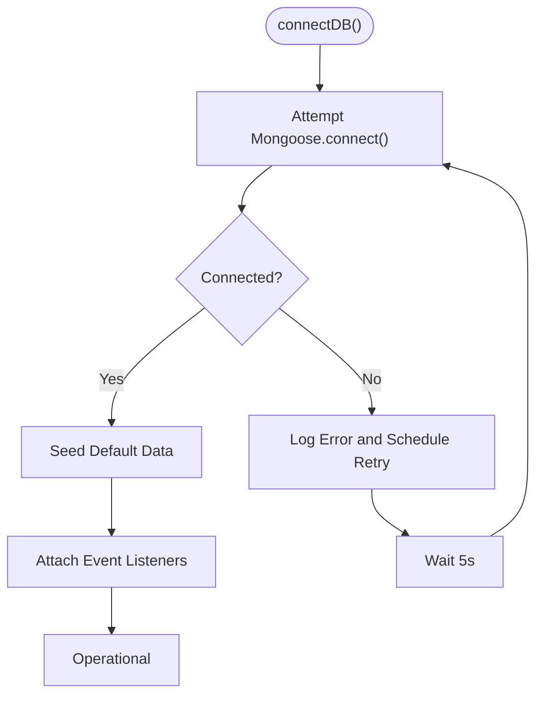
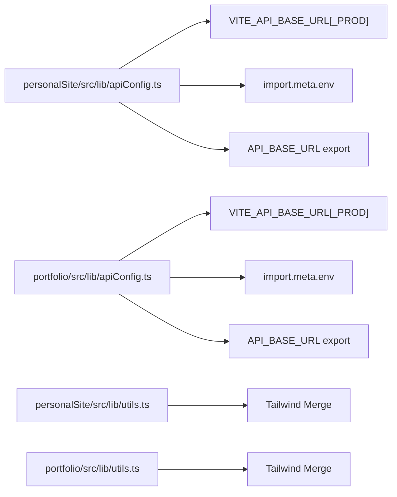
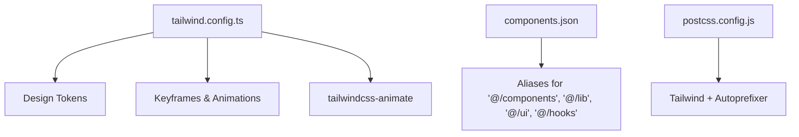
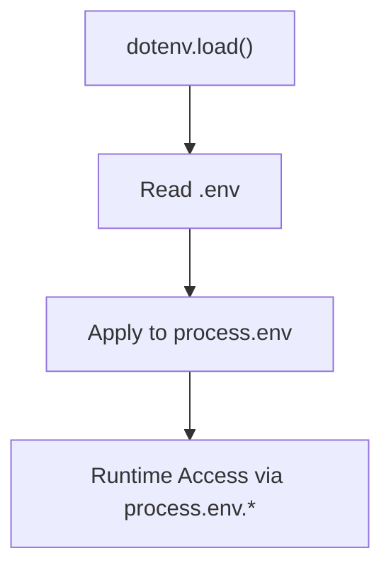
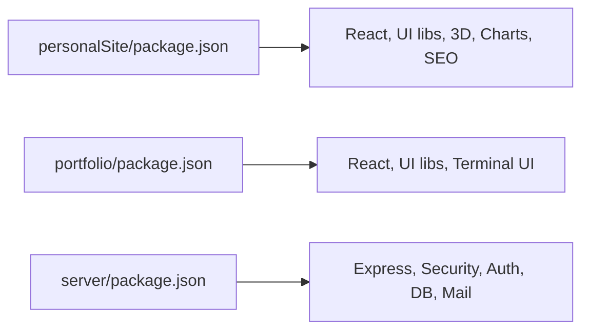

# Technology Stack Integration

<cite>
**Referenced Files in This Document**
- [personalSite/package.json](file://personalSite/package.json)
- [portfolio/package.json](file://portfolio/package.json)
- [server/package.json](file://server/package.json)
- [personalSite/vite.config.ts](file://personalSite/vite.config.ts)
- [portfolio/vite.config.ts](file://portfolio/vite.config.ts)
- [server/src/index.ts](file://server/src/index.ts)
- [server/src/config/database.ts](file://server/src/config/database.ts)
- [personalSite/.env.example](file://personalSite/.env.example)
- [server/.env.example](file://server/.env.example)
- [portfolio/.env.example](file://portfolio/.env.example)
- [personalSite/tailwind.config.ts](file://personalSite/tailwind.config.ts)
- [personalSite/tsconfig.json](file://personalSite/tsconfig.json)
- [personalSite/src/lib/apiConfig.ts](file://personalSite/src/lib/apiConfig.ts)
- [portfolio/src/lib/apiConfig.ts](file://portfolio/src/lib/apiConfig.ts)
- [personalSite/src/lib/utils.ts](file://personalSite/src/lib/utils.ts)
- [portfolio/src/lib/utils.ts](file://portfolio/src/lib/utils.ts)
- [personalSite/components.json](file://personalSite/components.json)
- [personalSite/postcss.config.js](file://personalSite/postcss.config.js)
</cite>

## Table of Contents
1. [Introduction](#introduction)
2. [Project Structure](#project-structure)
3. [Core Components](#core-components)
4. [Architecture Overview](#architecture-overview)
5. [Detailed Component Analysis](#detailed-component-analysis)
6. [Dependency Analysis](#dependency-analysis)
7. [Performance Considerations](#performance-considerations)
8. [Troubleshooting Guide](#troubleshooting-guide)
9. [Conclusion](#conclusion)
10. [Appendices](#appendices)

## Introduction
This document describes the technology stack integration and system-wide design decisions for the Personal Portfolio Platform. The platform is organized as a monorepo containing two frontend applications (a modern React SPA and a retro-styled terminal UI) and a Node.js/Express backend serving a MongoDB database. It leverages Vite for fast builds and development, TypeScript for type safety, Tailwind CSS for styling, and shared configuration patterns across applications. Cross-cutting concerns include environment-driven configuration, API routing, security middleware, and database resilience.

## Project Structure
The repository is a monorepo with three primary packages:
- personalSite: A modern React SPA with shadcn/ui components, Vite build, and SEO prerendering pipeline.
- portfolio: A secondary React application with a terminal-inspired UI and Vite build.
- server: A Node.js/Express backend written in TypeScript, connecting to MongoDB via Mongoose.

Key characteristics:
- Shared UI primitives and utilities live under each app’s src/lib directory.
- Build tooling is centralized via Vite configurations.
- Environment variables are managed per-app with standardized keys.
- Styling is configured via Tailwind CSS with consistent design tokens.

**Diagram sources**
- [personalSite/vite.config.ts](file://personalSite/vite.config.ts#L10-L34)
- [portfolio/vite.config.ts](file://portfolio/vite.config.ts#L1-L16)
- [server/src/index.ts](file://server/src/index.ts#L1-L25)
- [server/src/config/database.ts](file://server/src/config/database.ts#L1-L25)

**Section sources**
- [personalSite/package.json](file://personalSite/package.json#L1-L113)
- [portfolio/package.json](file://portfolio/package.json#L1-L74)
- [server/package.json](file://server/package.json#L1-L40)

## Core Components
- Frontend build and dev servers:
  - personalSite uses Vite with React SWC plugin, HMR, proxy to backend, and history API fallback for SPA routing.
  - portfolio uses Vite with React plugin and a dedicated port override.
- Backend runtime:
  - Express server initializes security middleware (Helmet), CORS with environment-driven origins, rate limiting, body parsing, and routes mounted under /api paths.
- Database connectivity:
  - Mongoose connection with retry logic, event listeners for errors/disconnect/reconnect, and seeding on first successful connection.
- Shared configuration:
  - Environment-driven API base URLs via VITE_* variables for client-side apps.
  - Tailwind CSS configuration with consistent design tokens and aliases.

**Section sources**
- [personalSite/vite.config.ts](file://personalSite/vite.config.ts#L10-L34)
- [portfolio/vite.config.ts](file://portfolio/vite.config.ts#L1-L16)
- [server/src/index.ts](file://server/src/index.ts#L24-L117)
- [server/src/config/database.ts](file://server/src/config/database.ts#L6-L56)
- [personalSite/src/lib/apiConfig.ts](file://personalSite/src/lib/apiConfig.ts#L6-L52)
- [portfolio/src/lib/apiConfig.ts](file://portfolio/src/lib/apiConfig.ts#L6-L18)
- [personalSite/tailwind.config.ts](file://personalSite/tailwind.config.ts#L1-L117)

## Architecture Overview
The system follows a classic web application pattern:
- Two frontend applications serve distinct UI experiences but share the same backend API.
- The backend exposes REST endpoints under /api and serves health checks.
- The database is accessed through Mongoose ODM with resilient connection handling.

**Diagram sources**
- [personalSite/vite.config.ts](file://personalSite/vite.config.ts#L18-L25)
- [server/src/index.ts](file://server/src/index.ts#L102-L117)
- [server/src/config/database.ts](file://server/src/config/database.ts#L14-L44)

## Detailed Component Analysis

### Frontend Build Tooling and Routing
- personalSite:
  - Vite dev server with host "::" and port 3000, HMR overlay disabled, and proxy for /api to backend.
  - History API fallback enabled to support SPA routing.
  - Manual chunk splitting for vendor and UI bundles.
  - Dot-directories included in assets to preserve special files like .well-known.
- portfolio:
  - Vite dev server on port 3000 with React plugin and path alias @ pointing to src.

**Diagram sources**
- [personalSite/vite.config.ts](file://personalSite/vite.config.ts#L12-L33)
- [server/src/index.ts](file://server/src/index.ts#L102-L117)

**Section sources**
- [personalSite/vite.config.ts](file://personalSite/vite.config.ts#L10-L61)
- [portfolio/vite.config.ts](file://portfolio/vite.config.ts#L1-L16)

### Backend API and Middleware
- Security and hardening:
  - Helmet applied globally.
  - CORS configured dynamically based on NODE_ENV and FRONTEND_URL(_DEV|_PROD)/CORS_ORIGINS.
  - Rate limiting set to 100 requests per 15 minutes per IP.
- Request handling:
  - Body parsers for JSON and URL-encoded payloads with size limits.
  - Routes mounted under /api with explicit prefixes for contact and admin endpoints.
- Health and error handling:
  - GET /health endpoint returns service status.
  - Global error handler responds with structured JSON and optional stack traces in development.

**Diagram sources**
- [server/src/index.ts](file://server/src/index.ts#L34-L117)

**Section sources**
- [server/src/index.ts](file://server/src/index.ts#L24-L158)

### Database Connectivity and Resilience
- Connection lifecycle:
  - Reusable connection with timeout and pool sizing tuned for reliability.
  - Event listeners for error, disconnect, and reconnect scenarios.
  - Automatic retry loop on failure with exponential backoff behavior.
- Seeding:
  - On first successful connection, default data is seeded if collections are empty.

**Diagram sources**
- [server/src/config/database.ts](file://server/src/config/database.ts#L6-L56)

**Section sources**
- [server/src/config/database.ts](file://server/src/config/database.ts#L1-L61)

### Shared Library Patterns and Utilities
- API configuration:
  - Environment-aware base URL selection for both apps using VITE_* variables.
  - Normalization of trailing slashes and robust error handling when missing.
- Utility functions:
  - Tailwind class merging helpers exported consistently across apps.

**Diagram sources**
- [personalSite/src/lib/apiConfig.ts](file://personalSite/src/lib/apiConfig.ts#L6-L52)
- [portfolio/src/lib/apiConfig.ts](file://portfolio/src/lib/apiConfig.ts#L6-L18)
- [personalSite/src/lib/utils.ts](file://personalSite/src/lib/utils.ts#L1-L7)
- [portfolio/src/lib/utils.ts](file://portfolio/src/lib/utils.ts#L1-L7)

**Section sources**
- [personalSite/src/lib/apiConfig.ts](file://personalSite/src/lib/apiConfig.ts#L1-L75)
- [portfolio/src/lib/apiConfig.ts](file://portfolio/src/lib/apiConfig.ts#L1-L19)
- [personalSite/src/lib/utils.ts](file://personalSite/src/lib/utils.ts#L1-L7)
- [portfolio/src/lib/utils.ts](file://portfolio/src/lib/utils.ts#L1-L7)

### Styling and Design Tokens
- Tailwind configuration:
  - Dark mode strategy, design tokens, keyframes, animations, shadows, and font families.
  - Plugin registration for animations.
- Aliases and integration:
  - components.json defines aliases for components, lib, ui, hooks, and utils to streamline imports.

**Diagram sources**
- [personalSite/tailwind.config.ts](file://personalSite/tailwind.config.ts#L1-L117)
- [personalSite/components.json](file://personalSite/components.json#L1-L21)
- [personalSite/postcss.config.js](file://personalSite/postcss.config.js#L1-L7)

**Section sources**
- [personalSite/tailwind.config.ts](file://personalSite/tailwind.config.ts#L1-L117)
- [personalSite/components.json](file://personalSite/components.json#L1-L21)
- [personalSite/postcss.config.js](file://personalSite/postcss.config.js#L1-L7)

### Environment Variable Handling
- personalSite:
  - Vite requires VITE_* variables for client consumption.
  - Example includes VITE_API_BASE_URL and VITE_GITHUB_USERNAME.
- server:
  - Uses dotenv to load environment variables.
  - Example includes MONGODB_URI, JWT_SECRET, PORT, FRONTEND_URL, GitHub credentials, admin email, and email delivery settings.
- portfolio:
  - Example includes VITE_API_BASE_URL and VITE_API_BASE_URL_PROD for dev/prod differentiation.

**Diagram sources**
- [server/src/index.ts](file://server/src/index.ts#L22-L22)
- [server/.env.example](file://server/.env.example#L1-L27)

**Section sources**
- [personalSite/.env.example](file://personalSite/.env.example#L1-L10)
- [server/.env.example](file://server/.env.example#L1-L27)
- [portfolio/.env.example](file://portfolio/.env.example#L1-L3)

## Dependency Analysis
- Frontend dependencies:
  - Both personalSite and portfolio rely on React 18+/19, React Router, Radix UI primitives, Tailwind-based UI components, and related ecosystem packages.
  - personalSite includes additional libraries for 3D graphics, charts, animations, and SEO prerendering.
- Backend dependencies:
  - Express, helmet, cors, rate limiting, bcrypt, jsonwebtoken, mongoose, multer, nodemailer, and supporting type definitions.
- Build-time dependencies:
  - Vite, TypeScript, Tailwind CSS, ESLint, and plugins for React and PostCSS.

**Diagram sources**
- [personalSite/package.json](file://personalSite/package.json#L15-L74)
- [portfolio/package.json](file://portfolio/package.json#L11-L60)
- [server/package.json](file://server/package.json#L12-L27)

**Section sources**
- [personalSite/package.json](file://personalSite/package.json#L1-L113)
- [portfolio/package.json](file://portfolio/package.json#L1-L74)
- [server/package.json](file://server/package.json#L1-L40)

## Performance Considerations
- Build optimization:
  - Vite with esbuild minification and manual chunk splitting reduce bundle sizes and improve caching.
  - Source maps disabled in production builds to reduce payload size.
- Network and routing:
  - Proxy configuration avoids CORS complexities during development by routing API traffic through the dev server.
  - History API fallback ensures SPA routing works without server-side route handling.
- Database resilience:
  - Connection pooling and retry loops improve availability and degrade gracefully on failures.
- Styling:
  - Tailwind CSS with deterministic design tokens reduces runtime style computation overhead.

[No sources needed since this section provides general guidance]

## Troubleshooting Guide
- CORS issues:
  - Verify FRONTEND_URL(_DEV|_PROD) and CORS_ORIGINS align with the frontend ports and domains.
- API base URL errors:
  - Ensure VITE_API_BASE_URL[_PROD] is set appropriately for each environment.
- Database connectivity:
  - Confirm MONGODB_URI is reachable and credentials are correct; monitor logs for reconnection attempts.
- Build failures:
  - Check Vite configuration for proxy targets and asset inclusion patterns.
- Environment variables:
  - Ensure dotenv is loaded and variables are present; confirm naming conventions match the examples.

**Section sources**
- [server/src/index.ts](file://server/src/index.ts#L38-L83)
- [personalSite/src/lib/apiConfig.ts](file://personalSite/src/lib/apiConfig.ts#L6-L49)
- [server/src/config/database.ts](file://server/src/config/database.ts#L14-L56)
- [personalSite/vite.config.ts](file://personalSite/vite.config.ts#L18-L33)
- [server/.env.example](file://server/.env.example#L1-L27)
- [personalSite/.env.example](file://personalSite/.env.example#L1-L10)
- [portfolio/.env.example](file://portfolio/.env.example#L1-L3)

## Conclusion
The Personal Portfolio Platform demonstrates a cohesive monorepo architecture integrating modern frontend tooling (Vite, React, TypeScript, Tailwind CSS), a robust backend (Express, TypeScript, Mongoose), and shared configuration patterns. The design emphasizes environment-driven configuration, resilient database connectivity, and developer-friendly build tooling. These choices enable scalable development, maintainable codebases, and straightforward deployment strategies.

[No sources needed since this section summarizes without analyzing specific files]

## Appendices

### Deployment Architecture Considerations
- Containerization:
  - Package the backend as a Node.js container and each frontend as a static site served by an Nginx container or CDN.
- Infrastructure:
  - Use a reverse proxy to route /api to the backend service and static assets to the frontend containers.
- Secrets management:
  - Store sensitive environment variables in a secrets manager and inject them at runtime.

[No sources needed since this section provides general guidance]

### Cross-Cutting Concerns: Logging, Monitoring, and Observability
- Logging:
  - Standardize log formatting and include correlation IDs for request tracing.
- Monitoring:
  - Track backend health endpoints, database connection status, and frontend build artifacts.
- Observability:
  - Instrument key metrics (response times, error rates) and integrate with APM tools.

[No sources needed since this section provides general guidance]