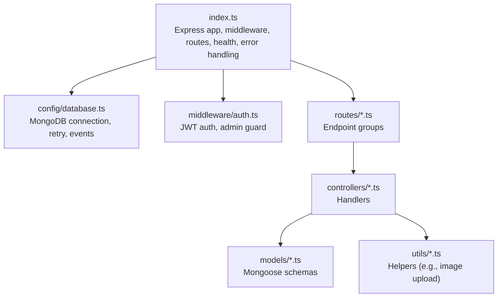
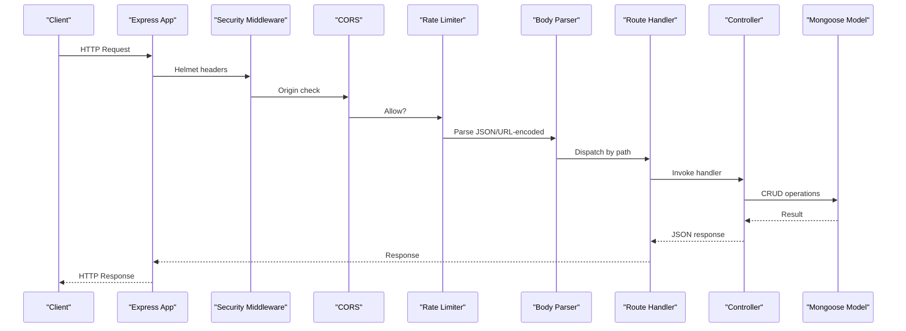
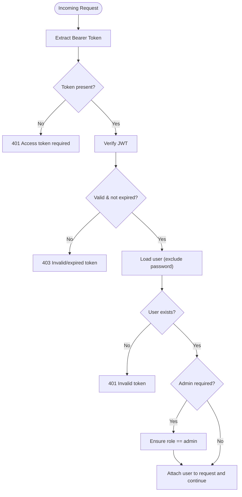
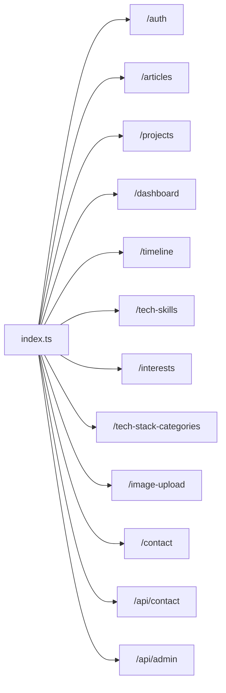
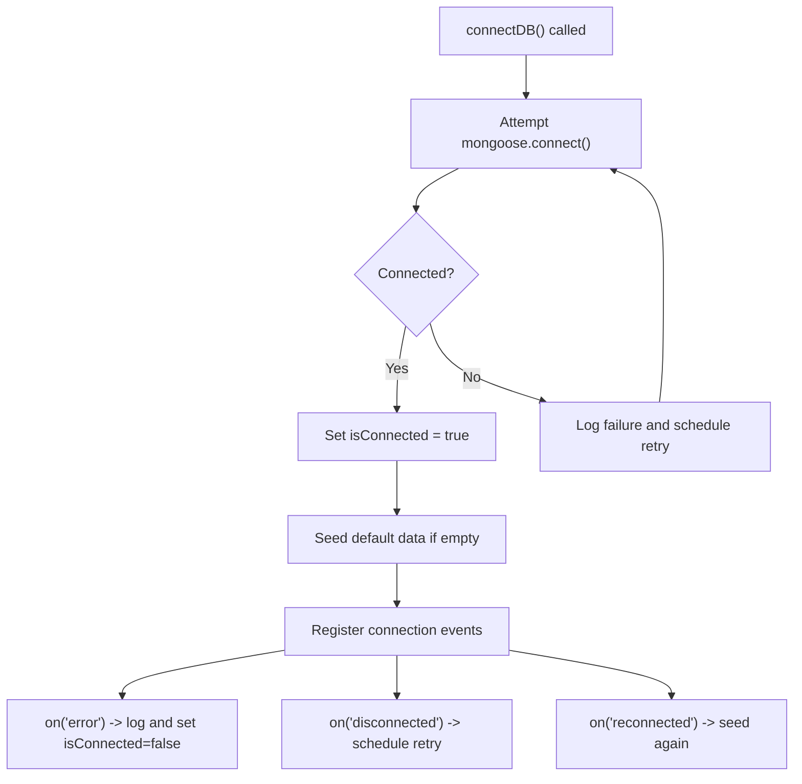
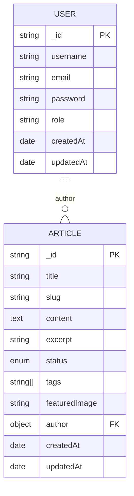
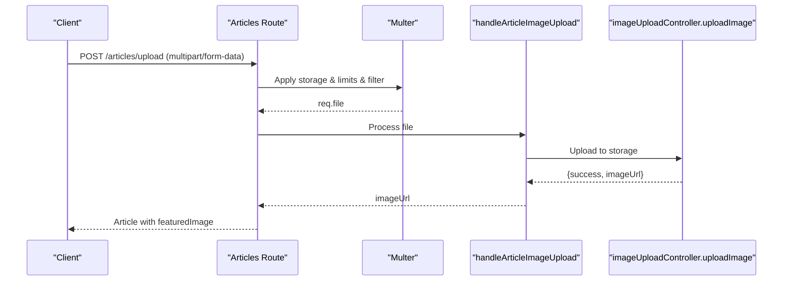
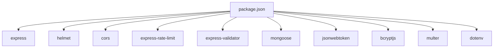

# API Architecture

<cite>
**Referenced Files in This Document**
- [index.ts](file://server/src/index.ts)
- [database.ts](file://server/src/config/database.ts)
- [auth.ts](file://server/src/middleware/auth.ts)
- [auth.ts](file://server/src/routes/auth.ts)
- [authController.ts](file://server/src/controllers/authController.ts)
- [articles.ts](file://server/src/routes/articles.ts)
- [articleController.ts](file://server/src/controllers/articleController.ts)
- [Article.ts](file://server/src/models/Article.ts)
- [User.ts](file://server/src/models/User.ts)
- [imageUploadHandler.ts](file://server/src/utils/imageUploadHandler.ts)
- [package.json](file://server/package.json)
- [.env.example](file://server/.env.example)
</cite>

## Table of Contents
1. [Introduction](#introduction)
2. [Project Structure](#project-structure)
3. [Core Components](#core-components)
4. [Architecture Overview](#architecture-overview)
5. [Detailed Component Analysis](#detailed-component-analysis)
6. [Dependency Analysis](#dependency-analysis)
7. [Performance Considerations](#performance-considerations)
8. [Troubleshooting Guide](#troubleshooting-guide)
9. [Conclusion](#conclusion)
10. [Appendices](#appendices)

## Introduction
This document describes the API architecture of the Express.js backend serving a personal portfolio platform. It covers RESTful design principles, routing organization, middleware stack (security, CORS, rate limiting, authentication, validation, and error handling), database connectivity with MongoDB/Mongoose, and operational best practices. It also outlines request/response flows, API versioning strategy, and security recommendations.

## Project Structure
The server is organized by concerns:
- Entry point initializes Express, middleware, routes, health checks, and error handling.
- Configuration manages database connection with automatic retry and event handling.
- Middleware provides authentication and authorization guards.
- Routes define endpoint groups under logical base paths (/auth, /articles, /projects, etc.).
- Controllers implement business logic and integrate with models and utilities.
- Models define Mongoose schemas and indexes.
- Utilities encapsulate cross-cutting concerns like image upload handling.

**Diagram sources**
- [index.ts](file://server/src/index.ts#L1-L158)
- [database.ts](file://server/src/config/database.ts#L1-L61)
- [auth.ts](file://server/src/middleware/auth.ts#L1-L37)
- [articles.ts](file://server/src/routes/articles.ts#L1-L54)

**Section sources**
- [index.ts](file://server/src/index.ts#L1-L158)
- [package.json](file://server/package.json#L1-L40)

## Core Components
- Express application bootstrap and middleware pipeline
- Security middleware stack: Helmet, CORS, rate limiting
- Authentication middleware: JWT verification and admin enforcement
- Request validation: express-validator for route handlers
- Routing: modular route files grouped by resource
- Database: Mongoose ODM with connection pooling and auto-retry
- Error handling: centralized error middleware

**Section sources**
- [index.ts](file://server/src/index.ts#L24-L140)
- [auth.ts](file://server/src/middleware/auth.ts#L1-L37)
- [database.ts](file://server/src/config/database.ts#L1-L61)
- [package.json](file://server/package.json#L12-L27)

## Architecture Overview
The backend exposes RESTful endpoints under base paths. Requests traverse a layered middleware chain before reaching route handlers. Responses are JSON-formatted. The system integrates with MongoDB via Mongoose for persistence and includes robust security and resilience mechanisms.

**Diagram sources**
- [index.ts](file://server/src/index.ts#L34-L97)
- [auth.ts](file://server/src/middleware/auth.ts#L9-L30)
- [articles.ts](file://server/src/routes/articles.ts#L34-L53)
- [articleController.ts](file://server/src/controllers/articleController.ts#L6-L39)
- [Article.ts](file://server/src/models/Article.ts#L1-L64)

## Detailed Component Analysis

### Security Middleware Stack
- Helmet: Sets strict security headers to mitigate common web vulnerabilities.
- CORS: Dynamically configures allowed origins based on environment variables and defaults. Allows credentials and supports wildcard dev origins.
- Rate Limiting: Applies a sliding-window IP-based cap to reduce abuse.

Operational notes:
- Origins determination considers production vs. development, explicit overrides, and defaults.
- Rate limit window and quota are fixed in code; adjust as needed.

**Section sources**
- [index.ts](file://server/src/index.ts#L34-L93)
- [.env.example](file://server/.env.example#L1-L27)

### Authentication and Authorization Middleware
- Token extraction from Authorization header (Bearer).
- JWT verification using a secret from environment.
- User lookup by decoded subject; sensitive fields excluded.
- Admin guard restricts endpoints to users with admin role.

**Diagram sources**
- [auth.ts](file://server/src/middleware/auth.ts#L9-L37)

**Section sources**
- [auth.ts](file://server/src/middleware/auth.ts#L1-L37)

### Request Validation
- express-validator is used inline within route handlers to validate request bodies and queries.
- Validation failures return structured 400 responses with an errors array.

Example usage patterns:
- Registration: username/email/password length/format constraints.
- Login: presence and normalization of email/password.
- Articles: title/content/status/tags constraints with flexible tags parsing.

**Section sources**
- [authController.ts](file://server/src/controllers/authController.ts#L6-L79)
- [authController.ts](file://server/src/controllers/authController.ts#L81-L133)
- [articleController.ts](file://server/src/controllers/articleController.ts#L90-L194)
- [articleController.ts](file://server/src/controllers/articleController.ts#L196-L259)
- [articleController.ts](file://server/src/controllers/articleController.ts#L261-L371)
- [articleController.ts](file://server/src/controllers/articleController.ts#L373-L439)

### Routing and Endpoint Organization
- Base routes mounted under logical prefixes (/auth, /articles, /projects, /dashboard, /timeline, /tech-skills, /interests, /tech-stack-categories, /image-upload, /contact, /api/contact, /api/admin).
- Public vs. admin endpoints clearly separated; admin routes enforce authentication and role checks.
- Image upload endpoints leverage Multer for multipart/form-data with file size and type constraints.

**Diagram sources**
- [index.ts](file://server/src/index.ts#L102-L116)
- [auth.ts](file://server/src/routes/auth.ts#L1-L11)
- [articles.ts](file://server/src/routes/articles.ts#L1-L54)

**Section sources**
- [index.ts](file://server/src/index.ts#L102-L116)
- [auth.ts](file://server/src/routes/auth.ts#L1-L11)
- [articles.ts](file://server/src/routes/articles.ts#L1-L54)

### Database Connectivity with MongoDB and Mongoose
- Connection pooling: max pool size configured; timeouts tuned for reliability.
- Event-driven lifecycle: error, disconnected, reconnected; automatic retry loop.
- Health check: a simple GET endpoint indicates service availability.
- Post-connect seeding: default data initialization when collections are empty.

**Diagram sources**
- [database.ts](file://server/src/config/database.ts#L6-L56)

**Section sources**
- [database.ts](file://server/src/config/database.ts#L1-L61)

### Models and Data Flow
- Article model defines fields, enums, and indexes optimized for text search and status sorting.
- User model enforces uniqueness and constraints, with pre-save hashing and password comparison helper.
- Controllers orchestrate validation, persistence, population, pagination, and error handling.

**Diagram sources**
- [Article.ts](file://server/src/models/Article.ts#L1-L64)
- [User.ts](file://server/src/models/User.ts#L1-L58)

**Section sources**
- [Article.ts](file://server/src/models/Article.ts#L1-L64)
- [User.ts](file://server/src/models/User.ts#L1-L58)

### Image Upload Handling
- Articles support image upload via dedicated endpoints using Multer memory storage and size/type filters.
- Utility functions encapsulate upload orchestration and return URLs or propagate errors.

**Diagram sources**
- [articles.ts](file://server/src/routes/articles.ts#L15-L30)
- [articles.ts](file://server/src/routes/articles.ts#L51-L52)
- [imageUploadHandler.ts](file://server/src/utils/imageUploadHandler.ts#L7-L45)

**Section sources**
- [articles.ts](file://server/src/routes/articles.ts#L15-L30)
- [articles.ts](file://server/src/routes/articles.ts#L51-L52)
- [imageUploadHandler.ts](file://server/src/utils/imageUploadHandler.ts#L1-L199)

### API Versioning Strategy
- No explicit API versioning is implemented in the current codebase.
- Suggested pattern: prefix routes with /api/v1, /api/v2, and maintain backward compatibility where feasible.

[No sources needed since this section provides general guidance]

### Request/Response Flow Example
- Registration:
  - Client posts to /auth/register with validated fields.
  - Controller validates input, checks uniqueness, creates user, assigns role based on admin email, hashes password via model hooks, generates JWT, and responds with user info and token.
- Fetching Articles:
  - Client GETs /articles with optional pagination, search, and tags.
  - Controller builds query, applies text search and filtering, paginates, and returns articles with metadata.

**Section sources**
- [authController.ts](file://server/src/controllers/authController.ts#L22-L78)
- [articleController.ts](file://server/src/controllers/articleController.ts#L6-L39)

### Error Handling
- Centralized error middleware logs stack traces and returns a generic 500 JSON response; in development, it includes the error message.
- Validation errors return structured 400 responses with an errors array.
- Route-specific handlers return appropriate HTTP codes (400, 401, 403, 404, 500) with concise messages.

**Section sources**
- [index.ts](file://server/src/index.ts#L133-L140)
- [authController.ts](file://server/src/controllers/authController.ts#L24-L27)
- [articleController.ts](file://server/src/controllers/articleController.ts#L80-L87)

## Dependency Analysis
External libraries and their roles:
- express: Web framework and routing.
- helmet: Security headers.
- cors: Cross-origin policy enforcement.
- express-rate-limit: Request throttling.
- express-validator: Validation helpers.
- mongoose: ODM and connection management.
- jsonwebtoken: JWT generation/verification.
- bcryptjs: Password hashing.
- multer: File uploads.
- dotenv: Environment variable loading.

**Diagram sources**
- [package.json](file://server/package.json#L12-L27)

**Section sources**
- [package.json](file://server/package.json#L1-L40)

## Performance Considerations
- Connection pooling: maxPoolSize configured; monitor slow queries and tune timeouts.
- Indexes: Article schema includes text and status/createdAt indexes to optimize search and sorting.
- Payload sizes: Body parser limits increased to support larger payloads; adjust as needed.
- Rate limiting: Tune window and max according to traffic patterns.

**Section sources**
- [database.ts](file://server/src/config/database.ts#L14-L18)
- [Article.ts](file://server/src/models/Article.ts#L60-L63)
- [index.ts](file://server/src/index.ts#L96-L97)
- [index.ts](file://server/src/index.ts#L88-L92)

## Troubleshooting Guide
Common issues and resolutions:
- CORS blocked origin: Verify allowed origins and environment variables; confirm credentials enabled.
- Rate limit exceeded: Reduce client-side polling or increase limits temporarily for legitimate bursts.
- JWT errors: Ensure Authorization header format and secret correctness; check token expiration.
- Database connectivity: Inspect connection logs and retry behavior; confirm URI and network reachability.
- Validation failures: Review returned errors array for missing/invalid fields.

**Section sources**
- [index.ts](file://server/src/index.ts#L38-L83)
- [index.ts](file://server/src/index.ts#L88-L93)
- [auth.ts](file://server/src/middleware/auth.ts#L18-L29)
- [database.ts](file://server/src/config/database.ts#L46-L55)

## Conclusion
The backend follows a clean, modular architecture with strong emphasis on security, validation, and resilience. The routing is organized by domain resources, and the middleware chain ensures consistent handling of authentication, authorization, and error responses. Mongoose provides reliable persistence with automatic retry and event-driven recovery. Adopting API versioning and refining rate limits will further enhance scalability and operability.

## Appendices

### Environment Variables Reference
- MONGODB_URI: MongoDB connection string.
- JWT_SECRET: Secret for signing JWT tokens.
- PORT: Server port.
- FRONTEND_URL(_DEV|_PROD): Allowed frontend origins for CORS.
- CORS_ORIGINS: Comma-separated allowed origins override.
- ADMIN_EMAIL: Email used to auto-assign admin role.
- Additional service credentials for GitHub and email delivery.

**Section sources**
- [.env.example](file://server/.env.example#L1-L27)