# Backend API System

<cite>
**Referenced Files in This Document**
- [index.ts](file://server/src/index.ts)
- [package.json](file://server/package.json)
- [database.ts](file://server/src/config/database.ts)
- [auth.ts](file://server/src/middleware/auth.ts)
- [authController.ts](file://server/src/controllers/authController.ts)
- [User.ts](file://server/src/models/User.ts)
- [auth.ts](file://server/src/routes/auth.ts)
- [articleController.ts](file://server/src/controllers/articleController.ts)
- [Article.ts](file://server/src/models/Article.ts)
- [githubController.ts](file://server/src/controllers/githubController.ts)
- [imageUploadHandler.ts](file://server/src/utils/imageUploadHandler.ts)
- [settingsController.ts](file://server/src/controllers/settingsController.ts)
- [Settings.ts](file://server/src/models/Settings.ts)
- [projectController.ts](file://server/src/controllers/projectController.ts)
- [Project.ts](file://server/src/models/Project.ts)
- [contactController.ts](file://server/src/controllers/contactController.ts)
</cite>

## Table of Contents
1. [Introduction](#introduction)
2. [Project Structure](#project-structure)
3. [Core Components](#core-components)
4. [Architecture Overview](#architecture-overview)
5. [Detailed Component Analysis](#detailed-component-analysis)
6. [Dependency Analysis](#dependency-analysis)
7. [Performance Considerations](#performance-considerations)
8. [Troubleshooting Guide](#troubleshooting-guide)
9. [Conclusion](#conclusion)
10. [Appendices](#appendices)

## Introduction
This document provides comprehensive API documentation for the Backend API System built with Node.js and Express. It covers RESTful endpoint design across major resource groups (authentication, content management, GitHub integration, settings, projects, articles, contact, and media upload), the controller layer architecture with repository pattern implementation, middleware functions for authentication and authorization, and error handling strategies. It also documents database integration using Mongoose ODM, model definitions for users, articles, projects, and other resources, request/response schemas, authentication methods using JWT, API versioning strategies, GitHub API integration, media upload handling with Multer, and the email notification system. Practical examples, common integration patterns, and troubleshooting guidance are included.

## Project Structure
The backend is organized around a layered architecture:
- Entry point initializes Express app, security middleware, CORS, rate limiting, body parsing, routes, health checks, and global error handling.
- Routes define API endpoints grouped by resource.
- Controllers implement business logic and orchestrate data operations.
- Models define Mongoose schemas and indexes.
- Middleware handles authentication and authorization.
- Utilities provide shared helpers (image upload, slug generation).

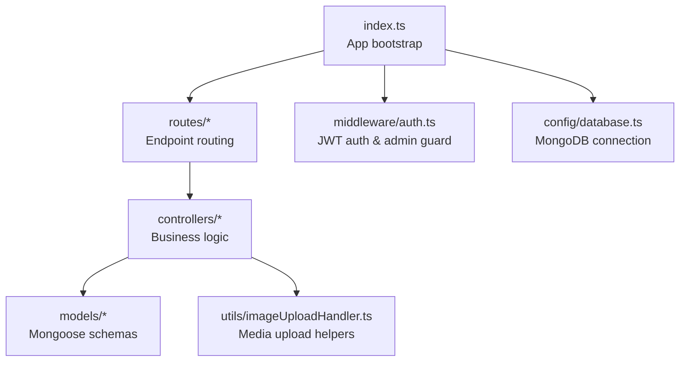

**Diagram sources**
- [index.ts](file://server/src/index.ts#L1-L158)
- [auth.ts](file://server/src/middleware/auth.ts#L1-L37)
- [database.ts](file://server/src/config/database.ts#L1-L61)

**Section sources**
- [index.ts](file://server/src/index.ts#L1-L158)
- [package.json](file://server/package.json#L1-L40)

## Core Components
- Express application with Helmet, CORS, rate limiting, and JSON body parsing.
- Centralized route registration under logical prefixes (/auth, /articles, /github, /settings, /projects, /dashboard, /timeline, /tech-skills, /interests, /tech-stack-categories, /image-upload, /contact).
- Global health check endpoint and centralized error handler.
- Database connection with automatic retry and seeding logic.

Key behaviors:
- CORS dynamically determines allowed origins based on environment variables and defaults.
- Rate limiting restricts requests per IP.
- Environment-driven frontend URL and production/dev origin lists.

**Section sources**
- [index.ts](file://server/src/index.ts#L24-L158)
- [package.json](file://server/package.json#L12-L27)

## Architecture Overview
The system follows a clean architecture with clear separation of concerns:
- Controllers handle HTTP requests and responses.
- Middleware enforces authentication and authorization.
- Models encapsulate data access and validation.
- Utilities centralize cross-cutting concerns like image upload and slug generation.
- Routes bind endpoints to controller actions.

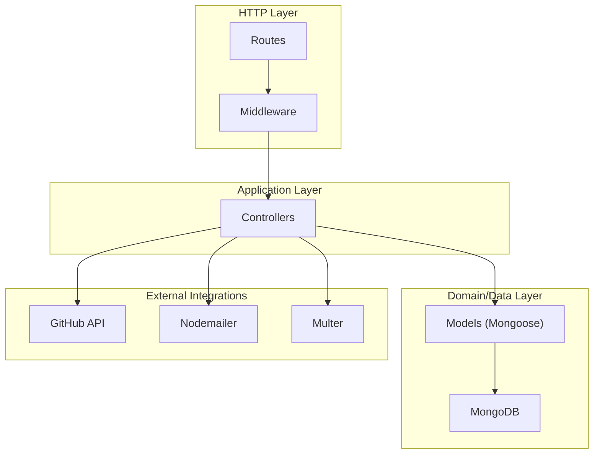

**Diagram sources**
- [index.ts](file://server/src/index.ts#L100-L117)
- [auth.ts](file://server/src/middleware/auth.ts#L9-L37)
- [articleController.ts](file://server/src/controllers/articleController.ts#L1-L453)
- [githubController.ts](file://server/src/controllers/githubController.ts#L1-L177)
- [contactController.ts](file://server/src/controllers/contactController.ts#L1-L438)
- [imageUploadHandler.ts](file://server/src/utils/imageUploadHandler.ts#L1-L199)

## Detailed Component Analysis

### Authentication API
Endpoints:
- POST /auth/register: Validates input, prevents duplicates, hashes password, assigns role based on admin email, generates JWT.
- POST /auth/login: Validates credentials, compares password, generates JWT.
- GET /auth/profile: Returns current user profile (protected).

Security:
- JWT verification middleware extracts token from Authorization header and attaches user to request.
- Admin guard requires role=admin.

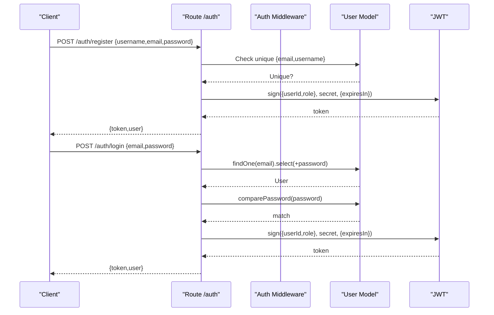

**Diagram sources**
- [auth.ts](file://server/src/middleware/auth.ts#L9-L37)
- [authController.ts](file://server/src/controllers/authController.ts#L6-L142)
- [User.ts](file://server/src/models/User.ts#L14-L58)
- [auth.ts](file://server/src/routes/auth.ts#L1-L11)

**Section sources**
- [authController.ts](file://server/src/controllers/authController.ts#L6-L142)
- [auth.ts](file://server/src/middleware/auth.ts#L9-L37)
- [User.ts](file://server/src/models/User.ts#L14-L58)
- [auth.ts](file://server/src/routes/auth.ts#L1-L11)

### Content Management APIs

#### Articles API
Endpoints:
- GET /articles: Published articles with pagination, search, and tags filtering.
- GET /articles/all: All articles (admin) with optional status filter.
- GET /articles/:id: Get article by ID with author populated.
- POST /articles: Create article (JSON payload).
- POST /articles/upload: Create article with featured image (multipart/form-data).
- PUT /articles/:id: Update article (JSON payload).
- PUT /articles/:id/upload: Update article with featured image (multipart/form-data).
- DELETE /articles/:id: Delete article.

Validation and processing:
- Uses express-validator for request validation.
- Slug generation and uniqueness enforcement.
- Featured image upload via helper that delegates to image upload controller.
- Text search index on title/content/tags for efficient querying.

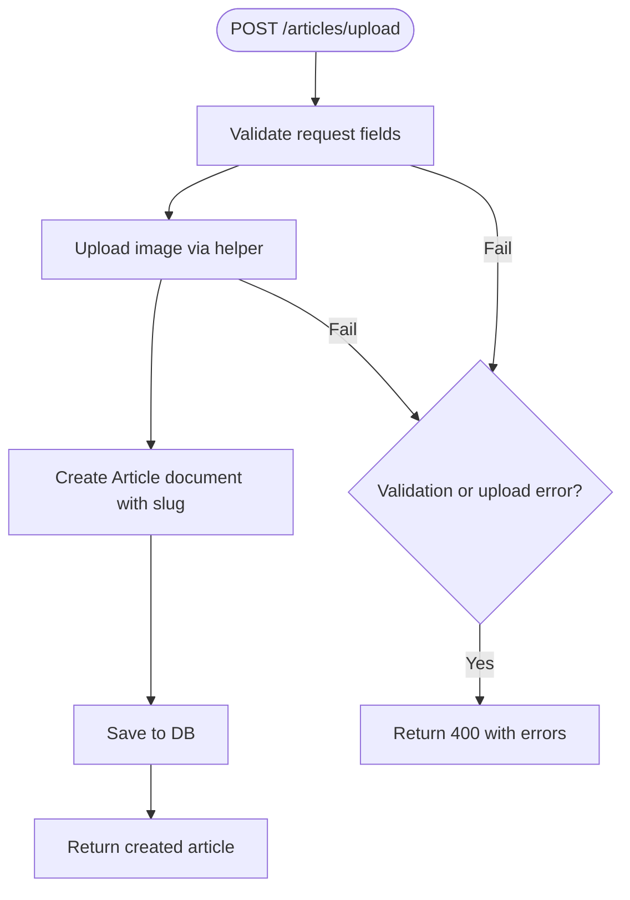

**Diagram sources**
- [articleController.ts](file://server/src/controllers/articleController.ts#L90-L194)
- [imageUploadHandler.ts](file://server/src/utils/imageUploadHandler.ts#L7-L45)

**Section sources**
- [articleController.ts](file://server/src/controllers/articleController.ts#L6-L453)
- [Article.ts](file://server/src/models/Article.ts#L16-L64)

#### Projects API
Endpoints:
- GET /projects: Published projects with search, featured flag, pagination.
- GET /projects/all: All projects (admin) with filters.
- GET /projects/:id: Get project by ID.
- POST /projects: Create project (JSON payload).
- POST /projects/upload: Create project with images (multipart/form-data).
- PUT /projects/:id: Update project (JSON payload).
- PUT /projects/:id/upload: Update project with images (multipart/form-data).
- DELETE /projects/:id: Delete project.

Processing:
- Unique slug resolution with collision avoidance.
- Image upload handling supports single/thumbnail and multiple screenshots.
- Robust validation for tags and languages (array or comma-separated string).
- URL validation for GitHub and live URLs.

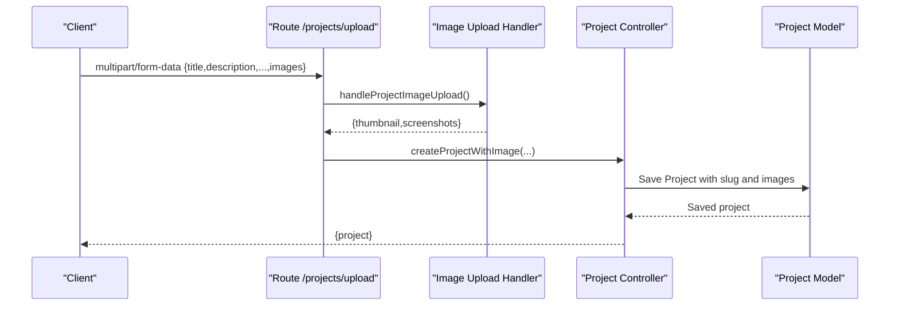

**Diagram sources**
- [projectController.ts](file://server/src/controllers/projectController.ts#L148-L329)
- [imageUploadHandler.ts](file://server/src/utils/imageUploadHandler.ts#L47-L199)
- [Project.ts](file://server/src/models/Project.ts#L19-L97)

**Section sources**
- [projectController.ts](file://server/src/controllers/projectController.ts#L25-L800)
- [Project.ts](file://server/src/models/Project.ts#L19-L97)
- [imageUploadHandler.ts](file://server/src/utils/imageUploadHandler.ts#L47-L199)

#### Settings API
Endpoints:
- GET /settings: Retrieve settings, auto-create defaults if missing.
- PUT /settings: Update settings with nested validation (theme, sections, links, GitHub username).

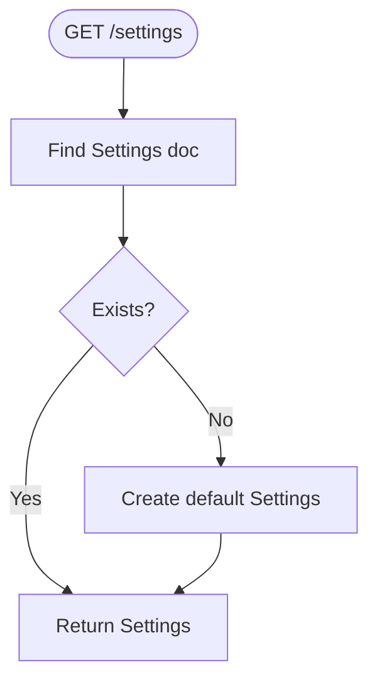

**Diagram sources**
- [settingsController.ts](file://server/src/controllers/settingsController.ts#L5-L19)
- [Settings.ts](file://server/src/models/Settings.ts#L27-L82)

**Section sources**
- [settingsController.ts](file://server/src/controllers/settingsController.ts#L5-L119)
- [Settings.ts](file://server/src/models/Settings.ts#L27-L82)

#### GitHub Integration API
Endpoints:
- GET /github/repos: List repositories for a user with sorting, pagination, and token-based access.
- GET /github/repos/:owner/:repo: Fetch repository details, languages, and top contributors.

Behavior:
- Respects GitHub token for higher rate limits and private repo access.
- Filters out private repos when no token is provided.
- Aggregates language statistics and contributor data.

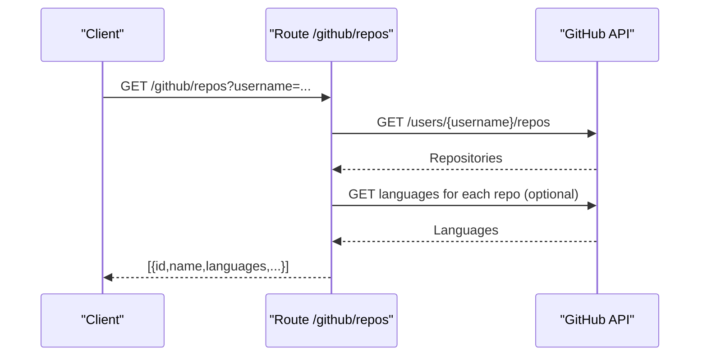

**Diagram sources**
- [githubController.ts](file://server/src/controllers/githubController.ts#L4-L100)

**Section sources**
- [githubController.ts](file://server/src/controllers/githubController.ts#L4-L177)

#### Contact and Email Notifications API
Endpoints:
- POST /contact: Submit contact message; persists and attempts to send emails to admin and user.
- GET /api/contact: List all messages (admin).
- PUT /api/contact/:id/status: Update message status.
- PUT /api/contact/:id/reply: Reply to a message; sends HTML email and stores reply metadata.

Email system:
- Nodemailer transport reused via caching.
- Sends two emails: admin notification and user confirmation.
- Supports HTML replies with optional inclusion of original message.

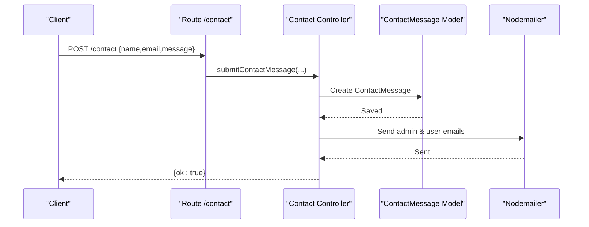

**Diagram sources**
- [contactController.ts](file://server/src/controllers/contactController.ts#L232-L315)

**Section sources**
- [contactController.ts](file://server/src/controllers/contactController.ts#L232-L438)

### Media Upload Handling
- Shared helpers support single/thumbnail and multiple screenshots uploads.
- Delegates to a reusable upload function and returns URLs for storage.
- Handles various upload scenarios (single file, named fields, multiple files).

**Section sources**
- [imageUploadHandler.ts](file://server/src/utils/imageUploadHandler.ts#L7-L199)

### Database Integration and Models
- MongoDB connection with retry, reconnection, and seeding on first connect.
- Models define schemas, indexes, and validation rules:
  - User: username, email, password hash, role.
  - Article: title, slug, content, excerpt, status, tags, author, images.
  - Project: title, slug, description, tags, languages, URLs, images, status, featured.
  - Settings: site-wide configuration with nested objects.
  - ContactMessage: persisted messages with replies and metadata.

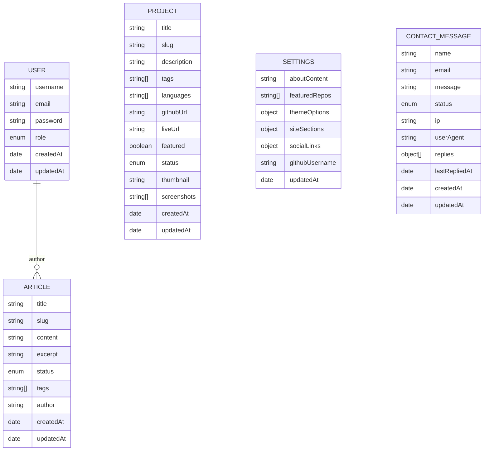

**Diagram sources**
- [User.ts](file://server/src/models/User.ts#L14-L58)
- [Article.ts](file://server/src/models/Article.ts#L16-L64)
- [Project.ts](file://server/src/models/Project.ts#L19-L97)
- [Settings.ts](file://server/src/models/Settings.ts#L27-L82)
- [contactController.ts](file://server/src/controllers/contactController.ts#L4-L105)

**Section sources**
- [database.ts](file://server/src/config/database.ts#L6-L56)
- [User.ts](file://server/src/models/User.ts#L14-L58)
- [Article.ts](file://server/src/models/Article.ts#L16-L64)
- [Project.ts](file://server/src/models/Project.ts#L19-L97)
- [Settings.ts](file://server/src/models/Settings.ts#L27-L82)

### Middleware and Security
- Authentication middleware:
  - Extracts Bearer token from Authorization header.
  - Verifies JWT and loads user without password.
  - Attaches user to request for protected routes.
- Admin guard ensures role=admin.

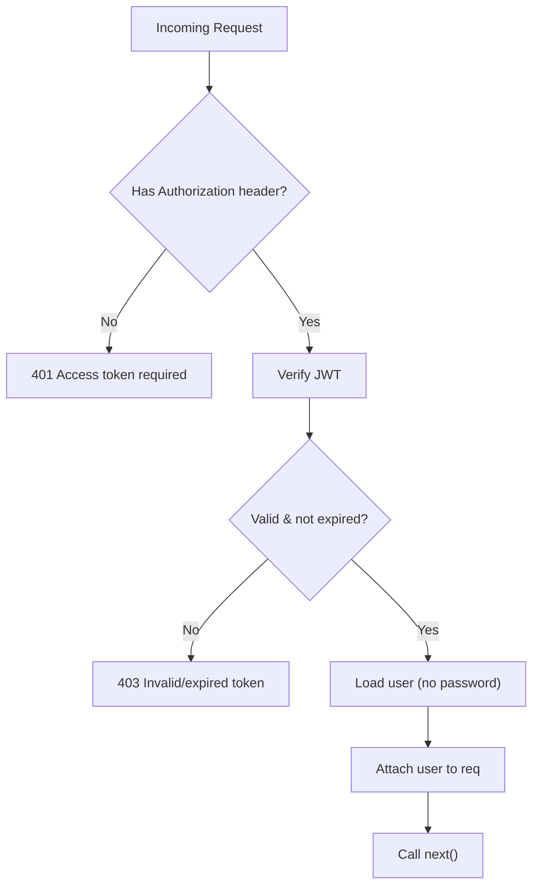

**Diagram sources**
- [auth.ts](file://server/src/middleware/auth.ts#L9-L37)

**Section sources**
- [auth.ts](file://server/src/middleware/auth.ts#L9-L37)

## Dependency Analysis
External libraries and roles:
- express: Web framework and routing.
- helmet: Security headers.
- cors: Cross-origin policy management.
- express-rate-limit: Request throttling.
- express-validator: Request validation.
- jsonwebtoken: JWT signing/verification.
- mongoose: ODM and connection management.
- multer: File uploads.
- nodemailer: Email delivery.
- axios: GitHub API client.

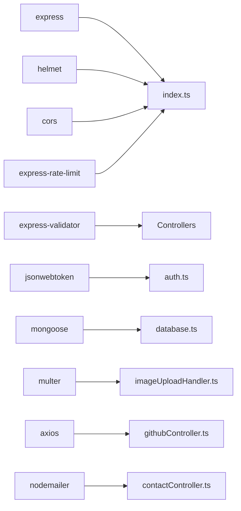

**Diagram sources**
- [package.json](file://server/package.json#L12-L27)
- [index.ts](file://server/src/index.ts#L1-L20)

**Section sources**
- [package.json](file://server/package.json#L12-L27)

## Performance Considerations
- Database indexes:
  - Articles: text index on title/content/tags and compound indexes on status/createdAt.
  - Projects: text index on title/description/tags/languages and compound indexes on featured/createdAt and status/createdAt.
- Pagination and skip/limit usage in queries to control result sets.
- Efficient CORS and rate limiting reduce overhead and protect resources.
- Image upload helper consolidates logic to avoid duplication and potential errors.

[No sources needed since this section provides general guidance]

## Troubleshooting Guide
Common issues and resolutions:
- CORS blocked origin:
  - Ensure FRONTEND_URL or FRONTEND_URL_PROD and/or CORS_ORIGINS are set appropriately for environment.
- Database connectivity:
  - Check MONGODB_URI; the app retries on failure and logs reconnection attempts.
- JWT errors:
  - Missing or invalid Authorization header yields 401; expired/invalid token yields 403.
- Validation failures:
  - express-validator returns structured errors; review returned array for field-specific messages.
- GitHub API rate limits:
  - Provide GITHUB_TOKEN to increase limits; otherwise private repos are filtered and rate limits apply.
- Email notifications:
  - Verify ADMIN_EMAIL, SEND_AS_EMAIL, SEND_AS_NAME, and GOOGLE_APP_PASSWORD are configured; transport is cached to avoid repeated setup.

**Section sources**
- [index.ts](file://server/src/index.ts#L38-L84)
- [database.ts](file://server/src/config/database.ts#L46-L56)
- [auth.ts](file://server/src/middleware/auth.ts#L14-L29)
- [githubController.ts](file://server/src/controllers/githubController.ts#L88-L99)
- [contactController.ts](file://server/src/controllers/contactController.ts#L118-L120)

## Conclusion
The Backend API System provides a robust, secure, and scalable foundation for a personal portfolio platform. It leverages Express and Mongoose to deliver a well-structured REST API with strong validation, JWT-based authentication, and integrated external services for GitHub data and email notifications. The modular design and clear separation of concerns facilitate maintainability and extensibility.

[No sources needed since this section summarizes without analyzing specific files]

## Appendices

### API Versioning Strategy
- Current implementation does not enforce explicit API versioning in routes or headers.
- Suggested approach: prefix routes with /api/v1 or use Accept header with media type versioning for future-proofing.

[No sources needed since this section provides general guidance]

### Practical Usage Examples
- Authentication:
  - Register: POST /auth/register with {username, email, password}.
  - Login: POST /auth/login with {email, password}; store returned token.
  - Profile: GET /auth/profile with Authorization: Bearer <token>.
- Content:
  - Create article: POST /articles with {title, content, status, tags, excerpt?, featuredImage?}.
  - Create project: POST /projects with {title, description, tags[], languages[], status, urls, images}.
  - Fetch repos: GET /github/repos?username=<GH_USER>&per_page=10.
- Settings:
  - Get: GET /settings.
  - Update: PUT /settings with partial settings object.
- Contact:
  - Submit: POST /contact with {name, email, message}.
  - Admin reply: PUT /api/contact/:id/reply with {subject, body, includeOriginal?}.

[No sources needed since this section provides general guidance]