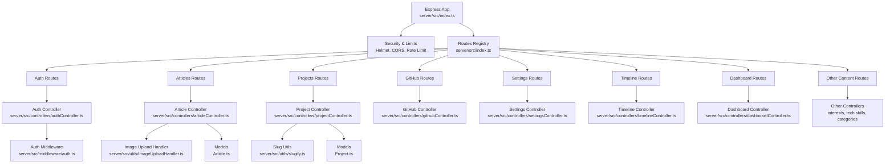
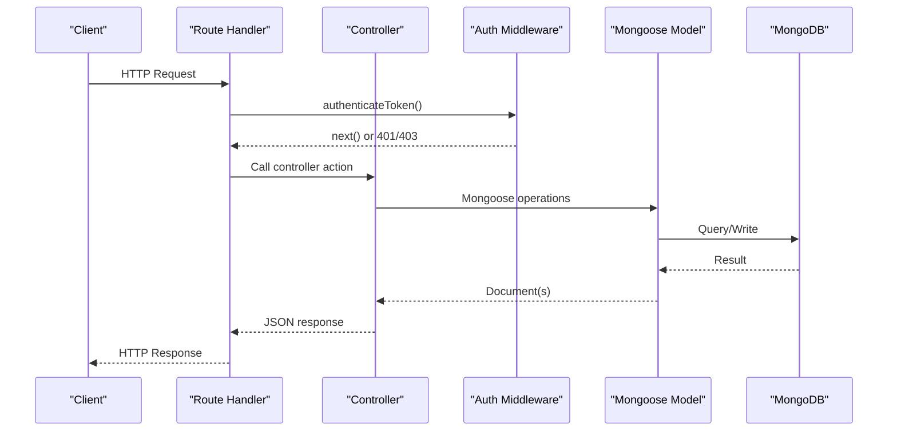
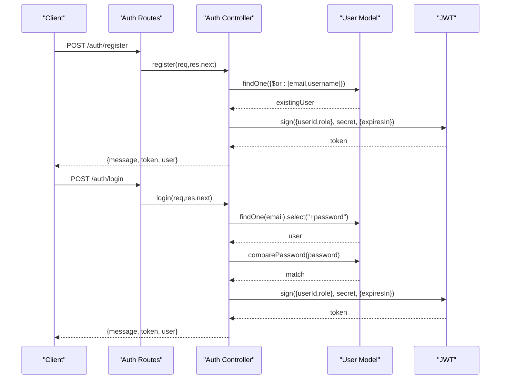
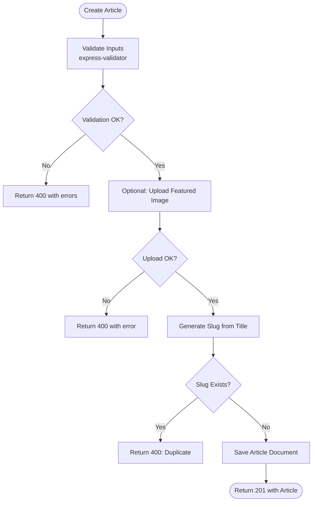
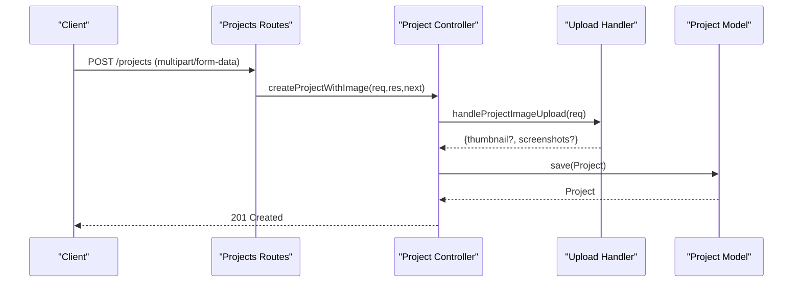
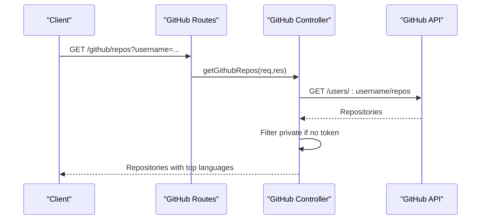
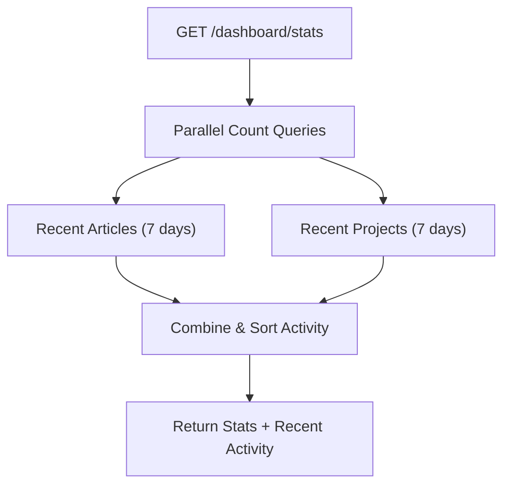
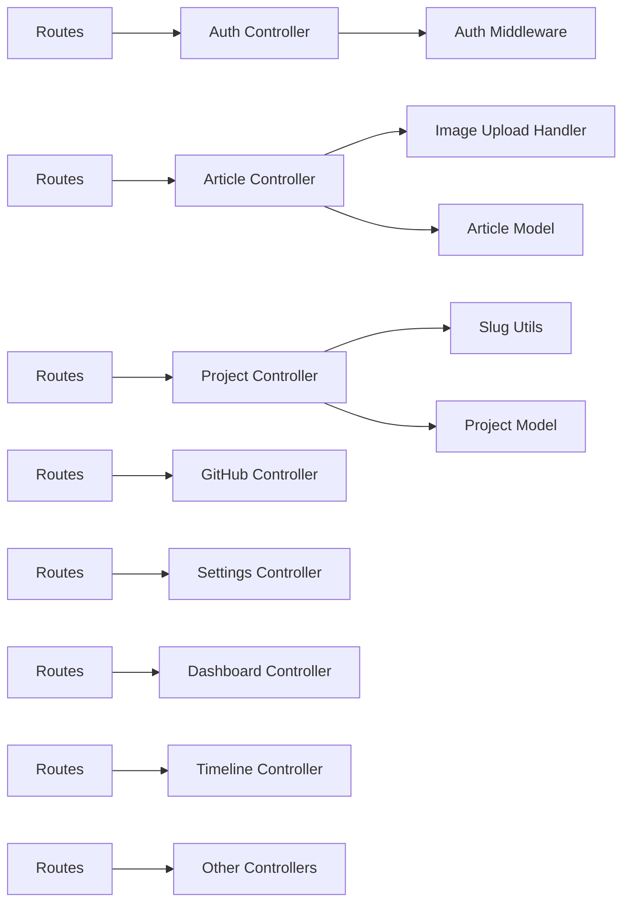

# Controller Layer

<cite>
**Referenced Files in This Document**
- [index.ts](file://server/src/index.ts)
- [auth.ts](file://server/src/middleware/auth.ts)
- [database.ts](file://server/src/config/database.ts)
- [authController.ts](file://server/src/controllers/authController.ts)
- [articleController.ts](file://server/src/controllers/articleController.ts)
- [projectController.ts](file://server/src/controllers/projectController.ts)
- [githubController.ts](file://server/src/controllers/githubController.ts)
- [dashboardController.ts](file://server/src/controllers/dashboardController.ts)
- [settingsController.ts](file://server/src/controllers/settingsController.ts)
- [timelineController.ts](file://server/src/controllers/timelineController.ts)
- [interestsController.ts](file://server/src/controllers/interestsController.ts)
- [techSkillsController.ts](file://server/src/controllers/techSkillsController.ts)
- [techStackCategoryController.ts](file://server/src/controllers/techStackCategoryController.ts)
- [imageUploadHandler.ts](file://server/src/utils/imageUploadHandler.ts)
- [slugify.ts](file://server/src/utils/slugify.ts)
- [Article.ts](file://server/src/models/Article.ts)
- [Project.ts](file://server/src/models/Project.ts)
</cite>

## Table of Contents
1. [Introduction](#introduction)
2. [Project Structure](#project-structure)
3. [Core Components](#core-components)
4. [Architecture Overview](#architecture-overview)
5. [Detailed Component Analysis](#detailed-component-analysis)
6. [Dependency Analysis](#dependency-analysis)
7. [Performance Considerations](#performance-considerations)
8. [Troubleshooting Guide](#troubleshooting-guide)
9. [Conclusion](#conclusion)

## Introduction
This document explains the Express.js backend controller layer and how it implements the controller pattern with repository/data access abstraction. It covers:
- Authentication controller with JWT token generation and validation
- Content management controllers for articles, projects, timeline items, and settings
- GitHub integration controller for repository data fetching and error handling
- Dashboard controllers for analytics and statistics
- Validation middleware integration via express-validator
- Response formatting, error handling strategies, and security considerations
- Parameter handling, business logic patterns, and rate limiting integration

## Project Structure
The server entry initializes middleware, routes, and error handling. Controllers are organized by domain (authentication, content, integrations, dashboards). Validation is applied at the controller level using express-validator. Data access is abstracted behind Mongoose models.

**Diagram sources**
- [index.ts](file://server/src/index.ts#L1-L158)
- [authController.ts](file://server/src/controllers/authController.ts#L1-L142)
- [articleController.ts](file://server/src/controllers/articleController.ts#L1-L453)
- [projectController.ts](file://server/src/controllers/projectController.ts#L1-L926)
- [githubController.ts](file://server/src/controllers/githubController.ts#L1-L177)
- [dashboardController.ts](file://server/src/controllers/dashboardController.ts#L1-L147)
- [settingsController.ts](file://server/src/controllers/settingsController.ts#L1-L119)
- [timelineController.ts](file://server/src/controllers/timelineController.ts#L1-L88)
- [auth.ts](file://server/src/middleware/auth.ts#L1-L37)
- [imageUploadHandler.ts](file://server/src/utils/imageUploadHandler.ts#L1-L199)
- [slugify.ts](file://server/src/utils/slugify.ts#L1-L33)
- [Article.ts](file://server/src/models/Article.ts#L1-L64)
- [Project.ts](file://server/src/models/Project.ts#L1-L97)

**Section sources**
- [index.ts](file://server/src/index.ts#L1-L158)

## Core Components
- Authentication controller: Validates inputs, checks credentials, generates JWT tokens, and exposes profile retrieval.
- Content controllers:
  - Articles: CRUD with image upload support, tag parsing, slug generation, and search/filtering.
  - Projects: CRUD with image upload handling, unique slug resolution, tag/language parsing, URL validation.
  - Settings: CRUD for site-wide configuration with nested field validation.
  - Timeline: CRUD for chronological entries.
  - Interests, Tech Skills, Tech Stack Categories: CRUD for related content.
- GitHub integration controller: Fetches repositories and repository details from the GitHub API with rate-limit-aware error handling.
- Dashboard controller: Aggregates stats and analytics data.
- Middleware: JWT authentication and admin enforcement.
- Utilities: Image upload handler and slug helpers.

**Section sources**
- [authController.ts](file://server/src/controllers/authController.ts#L1-L142)
- [articleController.ts](file://server/src/controllers/articleController.ts#L1-L453)
- [projectController.ts](file://server/src/controllers/projectController.ts#L1-L926)
- [settingsController.ts](file://server/src/controllers/settingsController.ts#L1-L119)
- [timelineController.ts](file://server/src/controllers/timelineController.ts#L1-L88)
- [interestsController.ts](file://server/src/controllers/interestsController.ts#L1-L85)
- [techSkillsController.ts](file://server/src/controllers/techSkillsController.ts#L1-L86)
- [techStackCategoryController.ts](file://server/src/controllers/techStackCategoryController.ts#L1-L86)
- [githubController.ts](file://server/src/controllers/githubController.ts#L1-L177)
- [dashboardController.ts](file://server/src/controllers/dashboardController.ts#L1-L147)
- [auth.ts](file://server/src/middleware/auth.ts#L1-L37)
- [imageUploadHandler.ts](file://server/src/utils/imageUploadHandler.ts#L1-L199)
- [slugify.ts](file://server/src/utils/slugify.ts#L1-L33)

## Architecture Overview
The controller layer follows a clean separation:
- Routes define endpoints and bind middleware.
- Controllers implement business logic, apply validation, and orchestrate data access via models.
- Middleware enforces authentication and admin roles.
- Utilities encapsulate cross-cutting concerns (image handling, slug generation).

**Diagram sources**
- [index.ts](file://server/src/index.ts#L100-L116)
- [auth.ts](file://server/src/middleware/auth.ts#L9-L30)
- [authController.ts](file://server/src/controllers/authController.ts#L6-L79)
- [articleController.ts](file://server/src/controllers/articleController.ts#L90-L194)
- [Article.ts](file://server/src/models/Article.ts#L1-L64)

## Detailed Component Analysis

### Authentication Controller
Implements:
- Registration: input validation, uniqueness check, password hashing, role assignment, JWT issuance.
- Login: input validation, credential verification, JWT issuance.
- Profile retrieval: protected route using authenticated user context.

**Diagram sources**
- [authController.ts](file://server/src/controllers/authController.ts#L6-L133)
- [auth.ts](file://server/src/middleware/auth.ts#L9-L30)

Key implementation patterns:
- Validation pipeline with express-validator and centralized error handling.
- Role-based assignment based on environment variable.
- Secure token generation with expiration.

Security considerations:
- Token verification uses a secret from environment.
- Password comparison is performed via model method.
- Protected profile endpoint relies on middleware.

**Section sources**
- [authController.ts](file://server/src/controllers/authController.ts#L1-L142)
- [auth.ts](file://server/src/middleware/auth.ts#L1-L37)

### Articles Controller
CRUD operations with:
- Search and filtering by status/tags.
- Tag parsing supporting arrays and comma-separated strings.
- Featured image upload integration.
- Slug generation and uniqueness enforcement.

**Diagram sources**
- [articleController.ts](file://server/src/controllers/articleController.ts#L90-L194)
- [imageUploadHandler.ts](file://server/src/utils/imageUploadHandler.ts#L7-L45)

Business logic highlights:
- Robust tag parsing accommodating JSON and CSV formats.
- Slug normalization and uniqueness via database constraint.
- Populate author reference for read endpoints.

**Section sources**
- [articleController.ts](file://server/src/controllers/articleController.ts#L1-L453)
- [imageUploadHandler.ts](file://server/src/utils/imageUploadHandler.ts#L1-L199)
- [Article.ts](file://server/src/models/Article.ts#L1-L64)

### Projects Controller
CRUD with:
- Unique slug resolution with collision avoidance.
- Multi-format tag/language parsing.
- URL validation for GitHub/live links.
- Rich image handling for thumbnails and screenshots.

**Diagram sources**
- [projectController.ts](file://server/src/controllers/projectController.ts#L148-L329)
- [imageUploadHandler.ts](file://server/src/utils/imageUploadHandler.ts#L47-L199)
- [slugify.ts](file://server/src/utils/slugify.ts#L15-L32)

**Section sources**
- [projectController.ts](file://server/src/controllers/projectController.ts#L1-L926)
- [imageUploadHandler.ts](file://server/src/utils/imageUploadHandler.ts#L1-L199)
- [slugify.ts](file://server/src/utils/slugify.ts#L1-L33)
- [Project.ts](file://server/src/models/Project.ts#L1-L97)

### GitHub Integration Controller
Fetches repository lists and details from GitHub API with:
- Query parameter validation.
- Conditional filtering for private repos without token.
- Robust error handling for rate limits and not-found scenarios.

**Diagram sources**
- [githubController.ts](file://server/src/controllers/githubController.ts#L4-L100)

**Section sources**
- [githubController.ts](file://server/src/controllers/githubController.ts#L1-L177)

### Dashboard Controller
Aggregates:
- Counts for articles/projects/users.
- Recent activity across content types.
- Analytics data (monthly trends, top content).

**Diagram sources**
- [dashboardController.ts](file://server/src/controllers/dashboardController.ts#L6-L103)

**Section sources**
- [dashboardController.ts](file://server/src/controllers/dashboardController.ts#L1-L147)

### Settings Controller
Manages site-wide configuration with:
- Nested field validation for theme options, sections, and social links.
- Upsert semantics with default creation if missing.

**Section sources**
- [settingsController.ts](file://server/src/controllers/settingsController.ts#L1-L119)

### Timeline, Interests, Tech Skills, Tech Stack Category Controllers
CRUD endpoints for related content entities with:
- Sorting by order and creation date.
- Validation for required fields and types.

**Section sources**
- [timelineController.ts](file://server/src/controllers/timelineController.ts#L1-L88)
- [interestsController.ts](file://server/src/controllers/interestsController.ts#L1-L85)
- [techSkillsController.ts](file://server/src/controllers/techSkillsController.ts#L1-L86)
- [techStackCategoryController.ts](file://server/src/controllers/techStackCategoryController.ts#L1-L86)

## Dependency Analysis
- Controllers depend on:
  - Models for data access (Article, Project).
  - Middleware for authentication and admin enforcement.
  - Utilities for image handling and slug generation.
- Routes depend on controllers and middleware.
- Database connection is initialized centrally and reused.

**Diagram sources**
- [index.ts](file://server/src/index.ts#L100-L116)
- [auth.ts](file://server/src/middleware/auth.ts#L1-L37)
- [articleController.ts](file://server/src/controllers/articleController.ts#L1-L453)
- [projectController.ts](file://server/src/controllers/projectController.ts#L1-L926)
- [githubController.ts](file://server/src/controllers/githubController.ts#L1-L177)
- [settingsController.ts](file://server/src/controllers/settingsController.ts#L1-L119)
- [dashboardController.ts](file://server/src/controllers/dashboardController.ts#L1-L147)
- [timelineController.ts](file://server/src/controllers/timelineController.ts#L1-L88)
- [imageUploadHandler.ts](file://server/src/utils/imageUploadHandler.ts#L1-L199)
- [slugify.ts](file://server/src/utils/slugify.ts#L1-L33)
- [Article.ts](file://server/src/models/Article.ts#L1-L64)
- [Project.ts](file://server/src/models/Project.ts#L1-L97)

**Section sources**
- [index.ts](file://server/src/index.ts#L1-L158)
- [auth.ts](file://server/src/middleware/auth.ts#L1-L37)
- [database.ts](file://server/src/config/database.ts#L1-L61)

## Performance Considerations
- Database indexing:
  - Articles: text index on title/content/tags and compound indexes for status/createdAt.
  - Projects: text index on title/description/tags/languages and compound indexes for featured/status/createdAt.
- Parallel queries in dashboard reduce round-trips.
- Pagination and skip/limit in listing endpoints prevent large payloads.
- Image upload handling defers to a dedicated utility to minimize controller complexity.

[No sources needed since this section provides general guidance]

## Troubleshooting Guide
Common issues and resolutions:
- Authentication failures:
  - Missing or invalid Authorization header.
  - Expired or malformed JWT token.
  - Non-existent user associated with token.
- Validation errors:
  - express-validator returns structured errors; ensure client sends correct payload shapes.
- Database connectivity:
  - Application continues running without DB; verify logs for reconnection attempts.
- GitHub API errors:
  - Rate limit exceeded or user not found; controller returns appropriate HTTP status codes.

**Section sources**
- [auth.ts](file://server/src/middleware/auth.ts#L9-L30)
- [authController.ts](file://server/src/controllers/authController.ts#L22-L78)
- [githubController.ts](file://server/src/controllers/githubController.ts#L88-L99)
- [database.ts](file://server/src/config/database.ts#L36-L55)

## Conclusion
The controller layer cleanly separates concerns, integrates robust validation, and leverages middleware for security. Data access is abstracted behind Mongoose models, enabling maintainable CRUD operations across content types. The GitHub integration controller demonstrates resilient error handling, while dashboard and settings controllers provide operational insights and configuration management. Together, these components form a secure, extensible backend foundation.