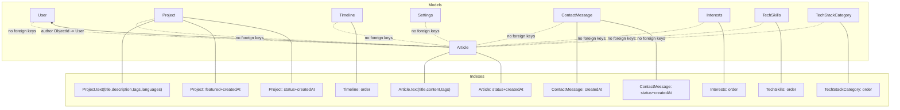
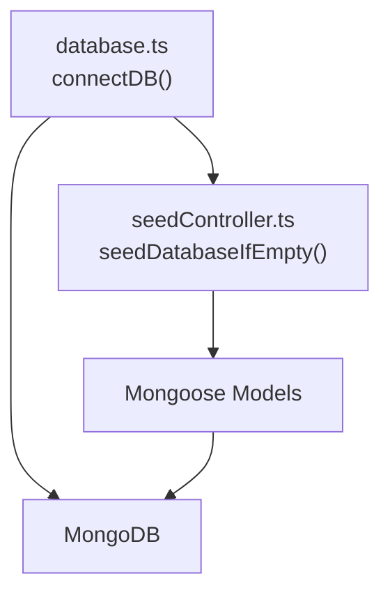
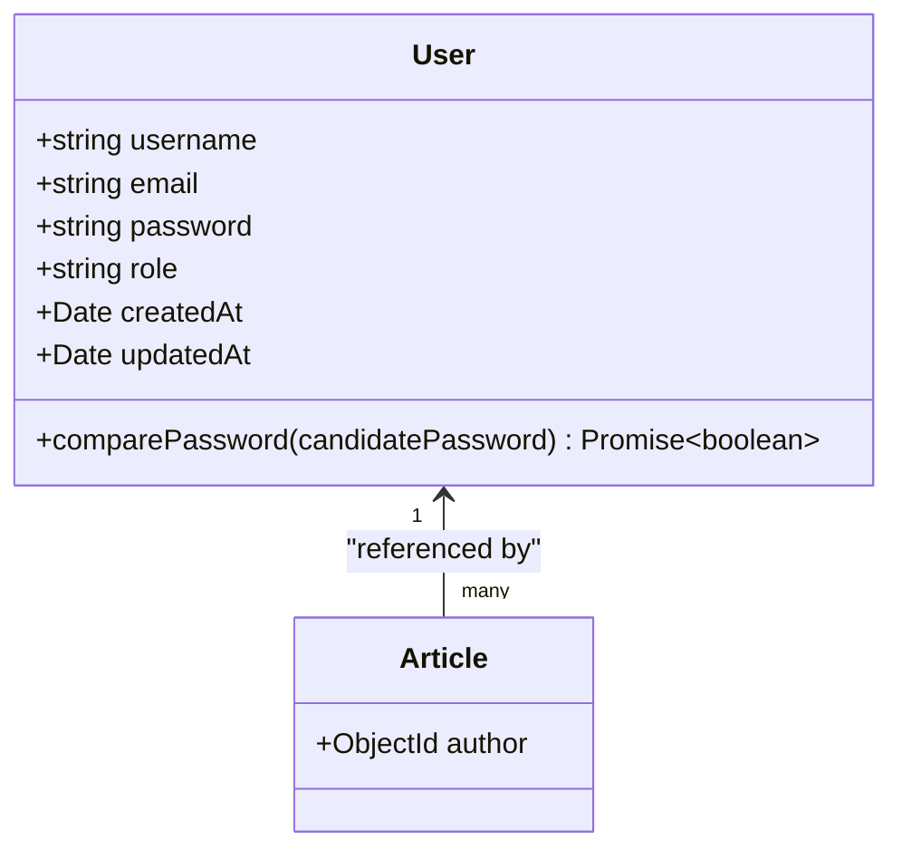
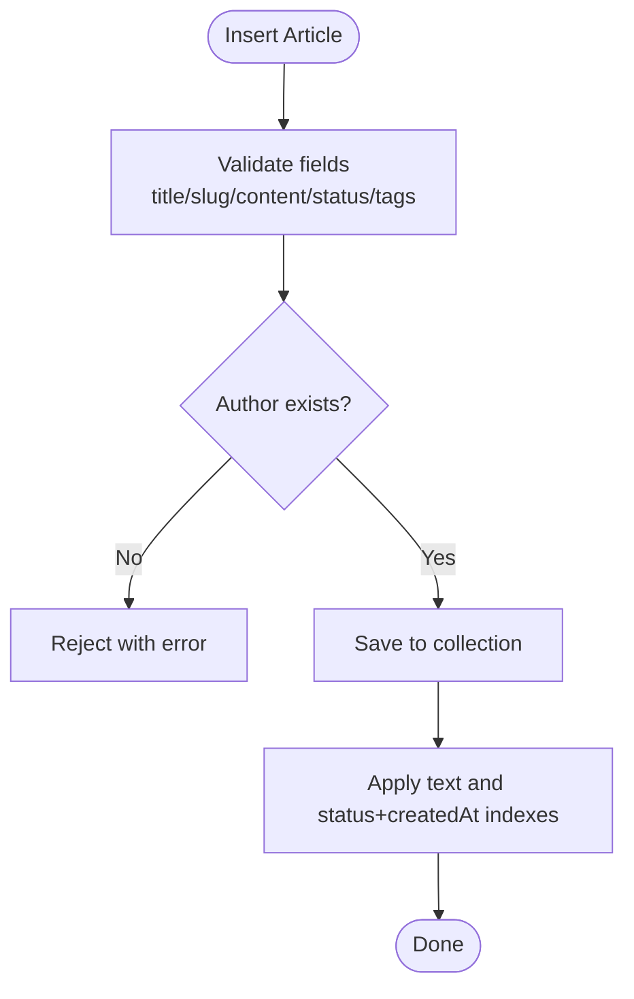
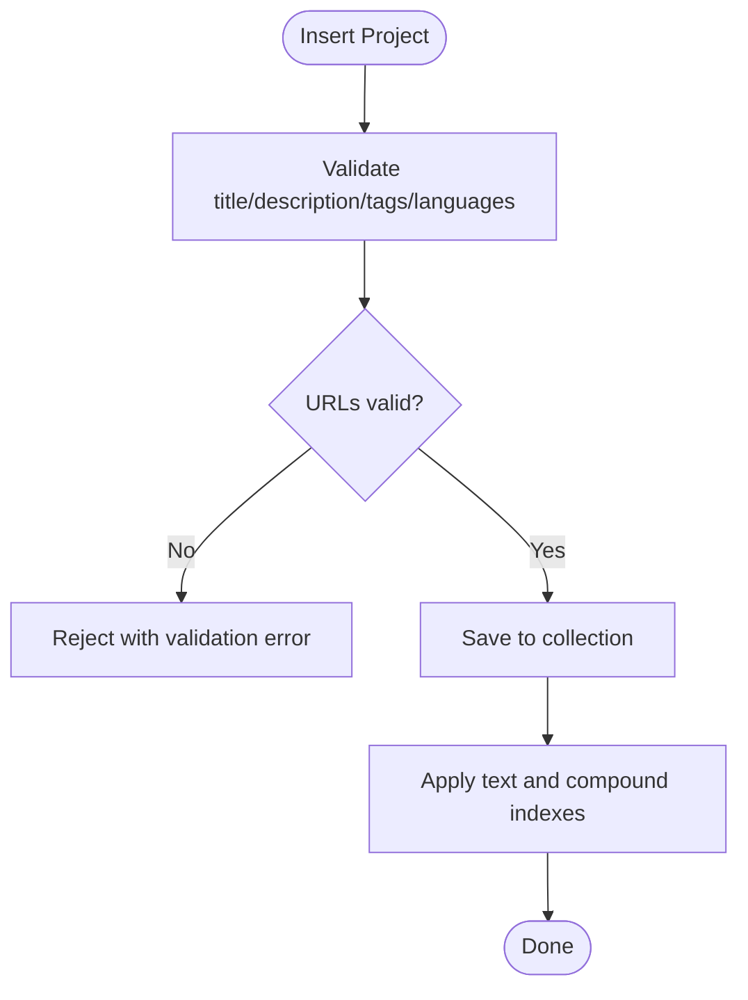
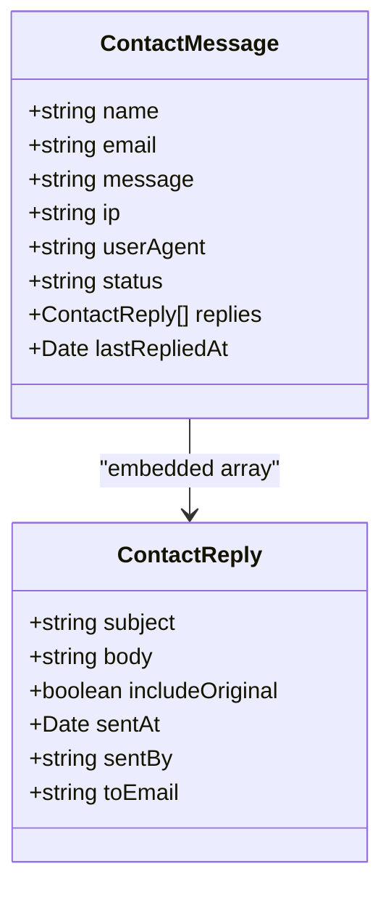
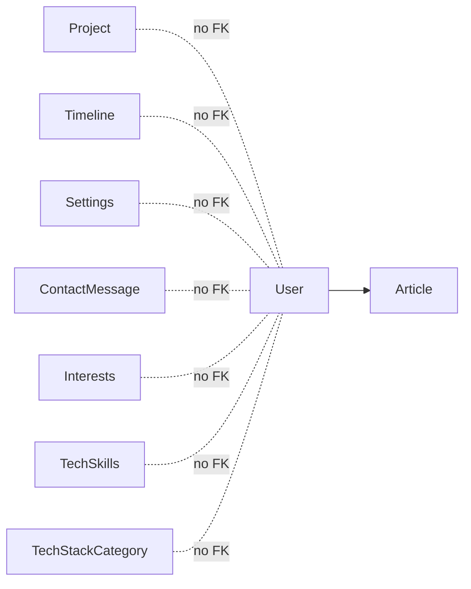

# Data Models

<cite>
**Referenced Files in This Document**
- [User.ts](file://server/src/models/User.ts)
- [Article.ts](file://server/src/models/Article.ts)
- [Project.ts](file://server/src/models/Project.ts)
- [Timeline.ts](file://server/src/models/Timeline.ts)
- [Settings.ts](file://server/src/models/Settings.ts)
- [ContactMessage.ts](file://server/src/models/ContactMessage.ts)
- [Interests.ts](file://server/src/models/Interests.ts)
- [TechSkills.ts](file://server/src/models/TechSkills.ts)
- [TechStackCategory.ts](file://server/src/models/TechStackCategory.ts)
- [database.ts](file://server/src/config/database.ts)
- [seedController.ts](file://server/src/controllers/seedController.ts)
- [index.ts](file://server/src/index.ts)
</cite>

## Table of Contents
1. [Introduction](#introduction)
2. [Project Structure](#project-structure)
3. [Core Components](#core-components)
4. [Architecture Overview](#architecture-overview)
5. [Detailed Component Analysis](#detailed-component-analysis)
6. [Dependency Analysis](#dependency-analysis)
7. [Performance Considerations](#performance-considerations)
8. [Troubleshooting Guide](#troubleshooting-guide)
9. [Conclusion](#conclusion)
10. [Appendices](#appendices)

## Introduction
This document provides comprehensive data model documentation for all MongoDB collections in the portfolio system. It covers Mongoose models for User, Article, Project, Timeline, Settings, ContactMessage, Interests, TechSkills, and TechStackCategory. For each model, we describe entity relationships, field definitions, data types, validation rules, indexing strategies, and performance considerations. We also explain schema design decisions, present examples of insertion and querying patterns, and outline data lifecycle management, soft deletion strategies, and migration approaches.

## Project Structure
The data models are implemented as Mongoose schemas under the server’s models directory. Each model defines:
- An interface extending Mongoose Document
- A Schema with field definitions, validations, and defaults
- Optional indexes for performance
- Export of the Mongoose model

**Diagram sources**
- [Article.ts](file://server/src/models/Article.ts#L16-L61)
- [Project.ts](file://server/src/models/Project.ts#L19-L94)
- [Timeline.ts](file://server/src/models/Timeline.ts#L14-L54)
- [Interests.ts](file://server/src/models/Interests.ts#L11-L33)
- [TechSkills.ts](file://server/src/models/TechSkills.ts#L12-L39)
- [TechStackCategory.ts](file://server/src/models/TechStackCategory.ts#L12-L40)
- [ContactMessage.ts](file://server/src/models/ContactMessage.ts#L69-L120)

**Section sources**
- [User.ts](file://server/src/models/User.ts#L1-L58)
- [Article.ts](file://server/src/models/Article.ts#L1-L64)
- [Project.ts](file://server/src/models/Project.ts#L1-L97)
- [Timeline.ts](file://server/src/models/Timeline.ts#L1-L56)
- [Settings.ts](file://server/src/models/Settings.ts#L1-L82)
- [ContactMessage.ts](file://server/src/models/ContactMessage.ts#L1-L123)
- [Interests.ts](file://server/src/models/Interests.ts#L1-L35)
- [TechSkills.ts](file://server/src/models/TechSkills.ts#L1-L41)
- [TechStackCategory.ts](file://server/src/models/TechStackCategory.ts#L1-L42)

## Core Components
This section summarizes each model’s purpose, key fields, and notable constraints.

- User
  - Purpose: Authentication and authorization for administrators.
  - Key fields: username, email, password, role.
  - Constraints: Unique username and email; role enum; hashed passwords via pre-save hook.
  - Indexes: None declared; relies on uniqueness enforced by schema.
  - Relationships: Articles reference User as author.

- Article
  - Purpose: Blog posts with draft/published lifecycle.
  - Key fields: title, slug, content, excerpt, status, tags, featuredImage, author.
  - Constraints: Text search index; composite index on status and createdAt; author is required ObjectId.
  - Indexes: Text index over title, content, tags; compound index on status and createdAt.

- Project
  - Purpose: Portfolio projects with metadata and links.
  - Key fields: title, slug, description, tags, languages, urls, featured, status, media.
  - Constraints: Validation for GitHub and live URLs; text search index; compound indexes for ordering and status.
  - Indexes: Text index over title, description, tags, languages; compound indexes for featured+createdAt and status+createdAt.

- Timeline
  - Purpose: Work and education timeline entries.
  - Key fields: year, role, company, description, icon, order.
  - Constraints: Order field for display sequencing.
  - Indexes: Compound index on order.

- Settings
  - Purpose: Site-wide configuration and presentation options.
  - Key fields: aboutContent, featuredRepos, themeOptions, siteSections, socialLinks, githubUsername.
  - Constraints: Defaults for most fields; optional GitHub username.
  - Indexes: None declared.

- ContactMessage
  - Purpose: Contact submissions with admin replies and status tracking.
  - Key fields: name, email, message, ip, userAgent, status, replies, lastRepliedAt.
  - Constraints: Embedded reply documents with strict fields; enums for status; indexes on createdAt and status+createdAt.
  - Indexes: createdAt descending; status+createdAt compound.

- Interests
  - Purpose: Personal interests with ordering.
  - Key fields: icon, label, order.
  - Constraints: Ordered list for consistent rendering.
  - Indexes: Compound index on order.

- TechSkills
  - Purpose: Technical skill items with proficiency levels.
  - Key fields: name, level (0–100), category, order.
  - Constraints: Level bounds; ordered list.
  - Indexes: Compound index on order.

- TechStackCategory
  - Purpose: Grouping of related technologies.
  - Key fields: title, icon, skills[], order.
  - Constraints: Required skills array; ordered list.
  - Indexes: Compound index on order.

**Section sources**
- [User.ts](file://server/src/models/User.ts#L4-L56)
- [Article.ts](file://server/src/models/Article.ts#L3-L61)
- [Project.ts](file://server/src/models/Project.ts#L3-L94)
- [Timeline.ts](file://server/src/models/Timeline.ts#L3-L54)
- [Settings.ts](file://server/src/models/Settings.ts#L3-L80)
- [ContactMessage.ts](file://server/src/models/ContactMessage.ts#L14-L120)
- [Interests.ts](file://server/src/models/Interests.ts#L3-L33)
- [TechSkills.ts](file://server/src/models/TechSkills.ts#L3-L39)
- [TechStackCategory.ts](file://server/src/models/TechStackCategory.ts#L3-L40)

## Architecture Overview
The data layer is centered around Mongoose models with explicit indexes for common queries. Relationships are primarily references (ObjectIds) rather than embedded documents, except for ContactMessage replies which are embedded arrays. The application connects to MongoDB via a centralized connection module and seeds default data for several collections upon first-time initialization.

**Diagram sources**
- [database.ts](file://server/src/config/database.ts#L6-L55)
- [seedController.ts](file://server/src/controllers/seedController.ts#L108-L134)

**Section sources**
- [database.ts](file://server/src/config/database.ts#L1-L61)
- [seedController.ts](file://server/src/controllers/seedController.ts#L1-L144)
- [index.ts](file://server/src/index.ts#L28-L32)

## Detailed Component Analysis

### User Model
- Purpose: Store credentials and roles for administrative access.
- Fields and constraints:
  - username: string, required, unique, trimmed, length limits.
  - email: string, required, unique, lowercase, regex validation.
  - password: string, required, minimum length; hashed before save.
  - role: enum ['admin','user'], default 'user'.
  - Timestamps: createdAt, updatedAt managed automatically.
- Methods:
  - comparePassword: async comparison against stored hash.
- Indexes: None declared; uniqueness enforced by schema.
- Relationships:
  - Articles embed author as ObjectId referencing User.

**Diagram sources**
- [User.ts](file://server/src/models/User.ts#L4-L56)
- [Article.ts](file://server/src/models/Article.ts#L51-L55)

**Section sources**
- [User.ts](file://server/src/models/User.ts#L1-L58)

### Article Model
- Purpose: Manage blog posts with lifecycle and SEO-friendly slugs.
- Fields and constraints:
  - title: required, trimmed, max length.
  - slug: required, unique, lowercase.
  - content: required text.
  - excerpt: max length, default empty.
  - status: enum ['draft','published'], default 'draft'.
  - tags: array of strings, trimmed.
  - featuredImage: optional string.
  - author: required ObjectId referencing User.
  - Timestamps: createdAt, updatedAt.
- Indexes:
  - Text index on title, content, tags for full-text search.
  - Compound index on status and createdAt for listing published posts efficiently.
- Relationships:
  - References User via author.

**Diagram sources**
- [Article.ts](file://server/src/models/Article.ts#L16-L61)

**Section sources**
- [Article.ts](file://server/src/models/Article.ts#L1-L64)

### Project Model
- Purpose: Showcase portfolio projects with metadata and links.
- Fields and constraints:
  - title, slug: required, unique, trimmed, max length.
  - description: required, max length.
  - tags: required array of strings.
  - languages: required array of strings.
  - githubUrl: optional; validated as GitHub URL pattern.
  - liveUrl: optional; validated as generic URL pattern.
  - featured: boolean, default false.
  - status: enum ['draft','published'], default 'draft'.
  - thumbnail, screenshots: optional strings.
  - Timestamps: createdAt, updatedAt.
- Indexes:
  - Text index on title, description, tags, languages.
  - Compound index on featured and createdAt for featured-first lists.
  - Compound index on status and createdAt for filtering by publish status.
- Relationships:
  - No foreign key references.

**Diagram sources**
- [Project.ts](file://server/src/models/Project.ts#L19-L94)

**Section sources**
- [Project.ts](file://server/src/models/Project.ts#L1-L97)

### Timeline Model
- Purpose: Chronological entries for work/education.
- Fields and constraints:
  - year, role, description, icon: required, trimmed, max length.
  - company: optional, trimmed, max length.
  - order: number, default 0.
  - Timestamps: createdAt, updatedAt.
- Indexes:
  - Compound index on order for deterministic rendering.
- Relationships:
  - No foreign key references.

**Section sources**
- [Timeline.ts](file://server/src/models/Timeline.ts#L1-L56)

### Settings Model
- Purpose: Centralized site configuration and presentation options.
- Fields and constraints:
  - aboutContent: default welcome text.
  - featuredRepos: array of strings.
  - themeOptions: nested object with color and font defaults.
  - siteSections: booleans controlling visibility of sections.
  - socialLinks: optional links.
  - githubUsername: optional, default from environment.
  - Timestamps: createdAt, updatedAt.
- Indexes:
  - None declared.
- Relationships:
  - No foreign key references.

**Section sources**
- [Settings.ts](file://server/src/models/Settings.ts#L1-L82)

### ContactMessage Model
- Purpose: Capture inbound messages, track status, and support admin replies.
- Fields and constraints:
  - name, email, message: required, trimmed, length limits.
  - ip, userAgent: optional, trimmed, length limits.
  - status: enum ['new','read','replied'], default 'new'.
  - replies: embedded array of reply documents with strict fields and defaults.
  - lastRepliedAt: optional date.
  - Timestamps: createdAt, updatedAt.
- Indexes:
  - createdAt descending.
  - status+createdAt compound.
- Relationships:
  - No foreign key references.

**Diagram sources**
- [ContactMessage.ts](file://server/src/models/ContactMessage.ts#L5-L120)

**Section sources**
- [ContactMessage.ts](file://server/src/models/ContactMessage.ts#L1-L123)

### Interests Model
- Purpose: List personal interests with ordering.
- Fields and constraints:
  - icon, label: required, trimmed, max length.
  - order: number, default 0.
  - Timestamps: createdAt, updatedAt.
- Indexes:
  - Compound index on order.
- Relationships:
  - No foreign key references.

**Section sources**
- [Interests.ts](file://server/src/models/Interests.ts#L1-L35)

### TechSkills Model
- Purpose: Track technical competencies with proficiency levels.
- Fields and constraints:
  - name: required, trimmed, max length.
  - level: required number, min 0, max 100.
  - category: optional, trimmed, max length.
  - order: number, default 0.
  - Timestamps: createdAt, updatedAt.
- Indexes:
  - Compound index on order.
- Relationships:
  - No foreign key references.

**Section sources**
- [TechSkills.ts](file://server/src/models/TechSkills.ts#L1-L41)

### TechStackCategory Model
- Purpose: Group technologies into categories.
- Fields and constraints:
  - title, icon: required, trimmed, max length.
  - skills: required array of strings.
  - order: number, default 0.
  - Timestamps: createdAt, updatedAt.
- Indexes:
  - Compound index on order.
- Relationships:
  - No foreign key references.

**Section sources**
- [TechStackCategory.ts](file://server/src/models/TechStackCategory.ts#L1-L42)

## Dependency Analysis
- Internal dependencies:
  - Article depends on User via author ObjectId.
  - Other models (Project, Timeline, Settings, ContactMessage, Interests, TechSkills, TechStackCategory) do not reference other models.
- External dependencies:
  - Mongoose ODM for schema definition and indexes.
  - bcrypt for password hashing in User.
- Initialization:
  - Centralized connection in database.ts.
  - Seeding of default data for Timeline, Interests, TechSkills, TechStackCategory via seedController.ts.

**Diagram sources**
- [Article.ts](file://server/src/models/Article.ts#L51-L55)
- [User.ts](file://server/src/models/User.ts#L1-L58)

**Section sources**
- [Article.ts](file://server/src/models/Article.ts#L1-L64)
- [User.ts](file://server/src/models/User.ts#L1-L58)
- [seedController.ts](file://server/src/controllers/seedController.ts#L108-L134)

## Performance Considerations
- Indexing strategy:
  - Full-text search: Article and Project define text indexes over content-rich fields to accelerate text searches.
  - Sorting and filtering: Compound indexes on status+createdAt enable efficient listing of published items; featured+createdAt supports featured-first sorting.
  - Ordering: Timeline, Interests, TechSkills, TechStackCategory use order-based indexes to maintain stable sort orders.
  - ContactMessage: Separate indexes on createdAt and status+createdAt optimize inbox views and status-based filtering.
- Query patterns:
  - Use text search for Article and Project listings.
  - Use compound indexes for paginated lists filtered by status and sorted by creation time.
  - Use order-based sorts for timeline and skill/category lists.
- Storage and validation:
  - Embedded arrays (e.g., Project.screenshots, ContactMessage.replies) keep related data close but consider size limits and update frequency.
- Connection and resilience:
  - Centralized connection with retry and reconnection handling ensures availability and reduces downtime impact.

[No sources needed since this section provides general guidance]

## Troubleshooting Guide
- Connection issues:
  - The connection module logs errors and attempts automatic reconnection. Verify environment variables and network connectivity.
- Seeding failures:
  - Seeding runs once when target collections are empty. If seeding fails, inspect logs and ensure permissions for insert operations.
- Validation errors:
  - Common causes include invalid URLs, missing required fields, or out-of-range values (e.g., skill level outside 0–100).
- Index creation:
  - If queries are slow, confirm indexes exist and are being used by the query planner.

**Section sources**
- [database.ts](file://server/src/config/database.ts#L26-L44)
- [seedController.ts](file://server/src/controllers/seedController.ts#L131-L133)

## Conclusion
The portfolio system’s data models are designed for clarity, performance, and maintainability. They leverage Mongoose’s schema enforcement, embedded documents where appropriate, and targeted indexes to support common queries. Relationships are kept lean with explicit references where needed, and default data seeding ensures a ready-to-use baseline. The documented constraints and indexes guide safe insertion and efficient querying patterns.

[No sources needed since this section summarizes without analyzing specific files]

## Appendices

### Field-Level Documentation Reference
- User
  - username: string, required, unique, trimmed, 3–30 chars.
  - email: string, required, unique, lowercase, validated email regex.
  - password: string, required, min 6 chars; hashed before save.
  - role: enum ['admin','user'], default 'user'.
  - createdAt, updatedAt: timestamps.
- Article
  - title: string, required, trimmed, max 200.
  - slug: string, required, unique, lowercase.
  - content: string, required.
  - excerpt: string, max 500, default ''.
  - status: enum ['draft','published'], default 'draft'.
  - tags: array of strings, trimmed.
  - featuredImage: string, optional.
  - author: ObjectId, required, references User.
  - createdAt, updatedAt: timestamps.
- Project
  - title: string, required, trimmed, max 200.
  - slug: string, required, unique, trimmed.
  - description: string, required, max 1000.
  - tags: array of strings, required, trimmed.
  - languages: array of strings, required, trimmed.
  - githubUrl: string, optional, validates GitHub URL pattern.
  - liveUrl: string, optional, validates generic URL pattern.
  - featured: boolean, default false.
  - status: enum ['draft','published'], default 'draft'.
  - thumbnail: string, default ''.
  - screenshots: array of strings.
  - createdAt, updatedAt: timestamps.
- Timeline
  - year: string, required, trimmed, max 50.
  - role: string, required, trimmed, max 100.
  - company: string, optional, trimmed, max 100.
  - description: string, required, trimmed, max 1000.
  - icon: string, required, trimmed, max 50.
  - order: number, default 0.
  - createdAt, updatedAt: timestamps.
- Settings
  - aboutContent: string, default welcome text.
  - featuredRepos: array of strings.
  - themeOptions.primaryColor: string, default blue.
  - themeOptions.secondaryColor: string, default purple.
  - themeOptions.fontFamily: string, default Inter.
  - siteSections.showAbout/showProjects/showArticles/showContact: booleans, default true.
  - socialLinks.github/linkedin/telegram/email: strings, optional.
  - githubUsername: string, optional, default from env.
  - updatedAt: timestamp.
- ContactMessage
  - name: string, required, trimmed, max 80.
  - email: string, required, lowercase, trimmed, max 254.
  - message: string, required, trimmed, max 2000.
  - ip: string, optional, max 128.
  - userAgent: string, optional, max 512.
  - status: enum ['new','read','replied'], default 'new'.
  - replies: embedded array of reply docs with strict fields.
  - lastRepliedAt: Date, optional.
  - createdAt, updatedAt: timestamps.
- Interests
  - icon: string, required, trimmed, max 50.
  - label: string, required, trimmed, max 100.
  - order: number, default 0.
  - createdAt, updatedAt: timestamps.
- TechSkills
  - name: string, required, trimmed, max 100.
  - level: number, required, min 0, max 100.
  - category: string, optional, trimmed, max 50.
  - order: number, default 0.
  - createdAt, updatedAt: timestamps.
- TechStackCategory
  - title: string, required, trimmed, max 100.
  - icon: string, required, trimmed, max 50.
  - skills: array of strings, required, trimmed, max 100.
  - order: number, default 0.
  - createdAt, updatedAt: timestamps.

### Example Insertion Patterns
- Insert a User:
  - Provide username, email, password; role defaults to 'user'. Password is hashed automatically.
  - Reference: [User.ts](file://server/src/models/User.ts#L44-L56)
- Insert an Article:
  - Provide title, slug, content, tags; set status and author ObjectId; optionally set excerpt and featuredImage.
  - Reference: [Article.ts](file://server/src/models/Article.ts#L16-L58)
- Insert a Project:
  - Provide title, slug, description, tags, languages; optionally set urls and images; set status and featured flag.
  - Reference: [Project.ts](file://server/src/models/Project.ts#L19-L89)
- Insert a Timeline entry:
  - Provide year, role, description, icon; set order for display sequence.
  - Reference: [Timeline.ts](file://server/src/models/Timeline.ts#L14-L51)
- Insert Settings:
  - Provide desired overrides; defaults apply otherwise.
  - Reference: [Settings.ts](file://server/src/models/Settings.ts#L27-L80)
- Insert a ContactMessage:
  - Provide name, email, message; status starts as 'new'; replies can be added later.
  - Reference: [ContactMessage.ts](file://server/src/models/ContactMessage.ts#L69-L117)

### Example Querying Patterns
- Find published Articles with text search:
  - Use text index on title, content, tags; filter by status='published' and sort by createdAt desc.
  - Reference: [Article.ts](file://server/src/models/Article.ts#L60-L61)
- Paginate Projects by status and creation time:
  - Use compound index on status+createdAt; apply skip/take for pagination.
  - Reference: [Project.ts](file://server/src/models/Project.ts#L92-L94)
- Retrieve ordered Timeline entries:
  - Sort by order ascending; suitable for rendering a chronological list.
  - Reference: [Timeline.ts](file://server/src/models/Timeline.ts#L54)
- Filter ContactMessages by status and newest first:
  - Use compound index on status+createdAt; sort by createdAt desc.
  - Reference: [ContactMessage.ts](file://server/src/models/ContactMessage.ts#L119-L120)

### Aggregation Pipelines
- Featured Projects with latest first:
  - Match status='published' and featured=true; sort by createdAt desc; limit results.
  - Reference: [Project.ts](file://server/src/models/Project.ts#L92-L94)
- Skills grouped by category:
  - Group by category; sort by order; useful for categorized skill displays.
  - Reference: [TechSkills.ts](file://server/src/models/TechSkills.ts#L38-L39)

### Data Lifecycle Management
- Soft deletion:
  - Not implemented in current models. Consider adding a deletedAt timestamp and a deleted flag to documents requiring soft deletion.
- Status transitions:
  - Article and Project use a status field ('draft' | 'published'); enforce transitions via application logic.
- Data retention:
  - ContactMessage status tracks lifecycle; archived data can be moved to separate collections if needed.

### Migration Approaches
- Adding new fields:
  - Add defaults in schema; run a background job to populate existing documents.
- Renaming fields:
  - Backfill documents; update application queries; deprecate old field after a grace period.
- Index changes:
  - Create new indexes; drop obsolete ones; monitor query performance.

[No sources needed since this section provides general guidance]