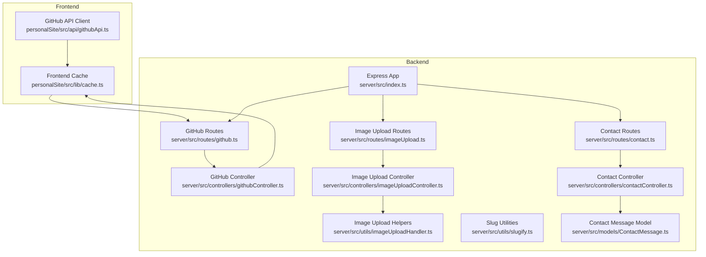
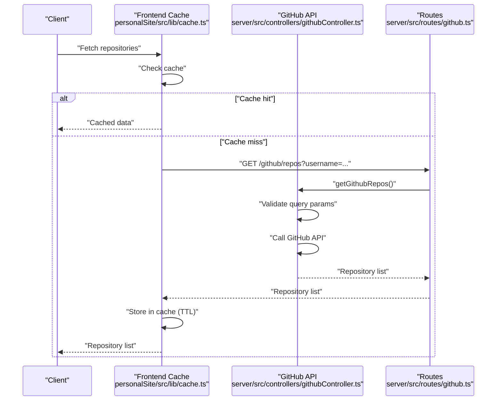
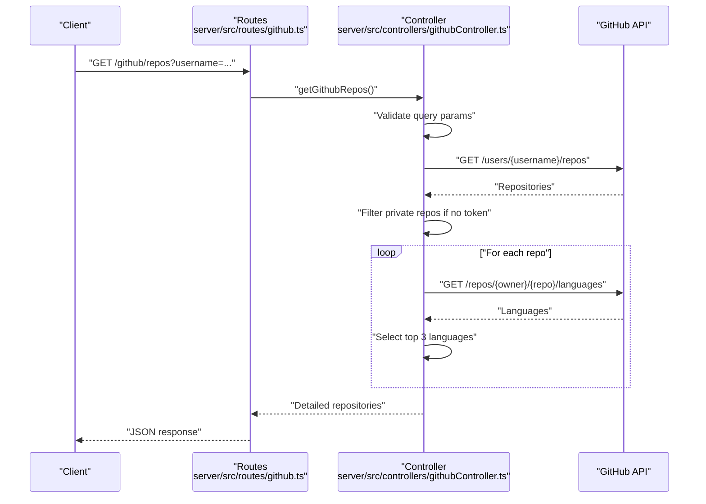
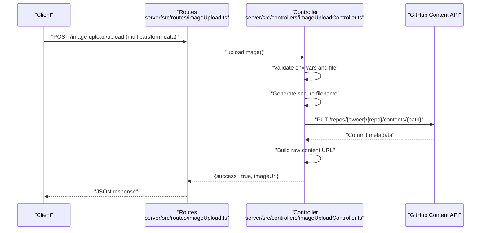
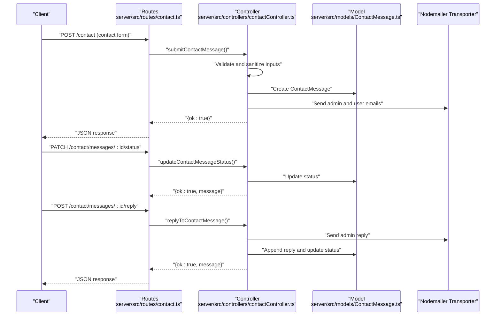
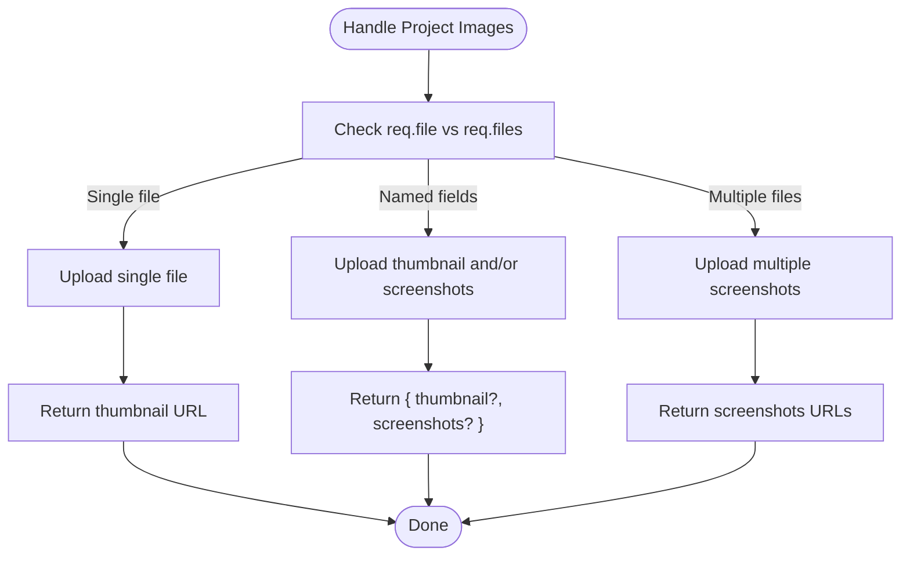
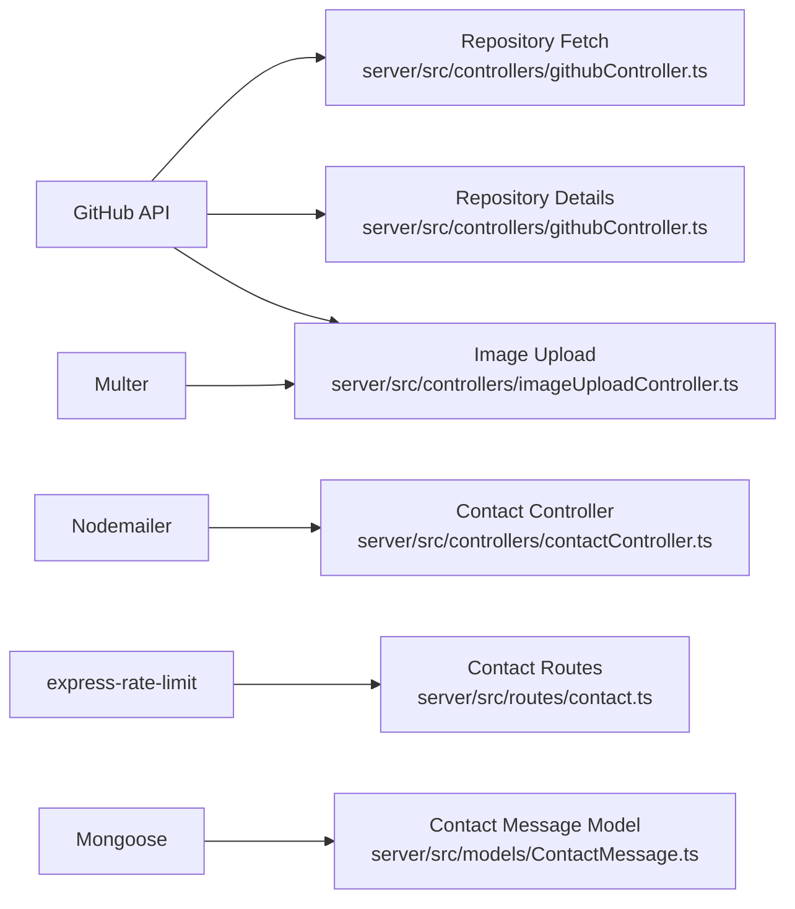

# Integration Services

<cite>
**Referenced Files in This Document**
- [server/src/controllers/githubController.ts](file://server/src/controllers/githubController.ts)
- [server/src/controllers/imageUploadController.ts](file://server/src/controllers/imageUploadController.ts)
- [server/src/controllers/contactController.ts](file://server/src/controllers/contactController.ts)
- [server/src/utils/imageUploadHandler.ts](file://server/src/utils/imageUploadHandler.ts)
- [server/src/utils/slugify.ts](file://server/src/utils/slugify.ts)
- [server/src/routes/github.ts](file://server/src/routes/github.ts)
- [server/src/routes/imageUpload.ts](file://server/src/routes/imageUpload.ts)
- [server/src/routes/contact.ts](file://server/src/routes/contact.ts)
- [server/src/index.ts](file://server/src/index.ts)
- [server/src/models/ContactMessage.ts](file://server/src/models/ContactMessage.ts)
- [server/.env.example](file://server/.env.example)
- [server/package.json](file://server/package.json)
- [personalSite/src/api/githubApi.ts](file://personalSite/src/api/githubApi.ts)
- [personalSite/src/lib/cache.ts](file://personalSite/src/lib/cache.ts)
</cite>

## Table of Contents
1. [Introduction](#introduction)
2. [Project Structure](#project-structure)
3. [Core Components](#core-components)
4. [Architecture Overview](#architecture-overview)
5. [Detailed Component Analysis](#detailed-component-analysis)
6. [Dependency Analysis](#dependency-analysis)
7. [Performance Considerations](#performance-considerations)
8. [Troubleshooting Guide](#troubleshooting-guide)
9. [Conclusion](#conclusion)
10. [Appendices](#appendices)

## Introduction
This document provides comprehensive documentation for third-party integration services in the backend API system. It covers:
- GitHub API integration controller for fetching repository data, including rate limit handling and optional token-based enhancement
- Image upload controller with Multer configuration, file validation, and cloud storage integration via GitHub repository content API
- Contact form processing controller with email notification system, spam prevention, and administrative reply workflow
- Custom utility functions for image upload helpers and slug generation
- Configuration requirements for external services, API keys management, and environment variable setup
- Integration workflows, error handling for external service failures, fallback strategies, security considerations, and monitoring approaches

## Project Structure
The backend integrates with external services through dedicated controllers, routes, and utilities. The frontend caches GitHub API responses to reduce repeated network calls.

**Diagram sources**
- [server/src/index.ts](file://server/src/index.ts#L1-L158)
- [server/src/routes/github.ts](file://server/src/routes/github.ts#L1-L9)
- [server/src/routes/imageUpload.ts](file://server/src/routes/imageUpload.ts#L1-L19)
- [server/src/routes/contact.ts](file://server/src/routes/contact.ts#L1-L28)
- [server/src/controllers/githubController.ts](file://server/src/controllers/githubController.ts#L1-L177)
- [server/src/controllers/imageUploadController.ts](file://server/src/controllers/imageUploadController.ts#L1-L137)
- [server/src/controllers/contactController.ts](file://server/src/controllers/contactController.ts#L1-L438)
- [server/src/utils/imageUploadHandler.ts](file://server/src/utils/imageUploadHandler.ts#L1-L199)
- [server/src/utils/slugify.ts](file://server/src/utils/slugify.ts#L1-L33)
- [server/src/models/ContactMessage.ts](file://server/src/models/ContactMessage.ts#L1-L123)
- [personalSite/src/api/githubApi.ts](file://personalSite/src/api/githubApi.ts#L1-L46)
- [personalSite/src/lib/cache.ts](file://personalSite/src/lib/cache.ts#L1-L137)

**Section sources**
- [server/src/index.ts](file://server/src/index.ts#L1-L158)
- [server/src/routes/github.ts](file://server/src/routes/github.ts#L1-L9)
- [server/src/routes/imageUpload.ts](file://server/src/routes/imageUpload.ts#L1-L19)
- [server/src/routes/contact.ts](file://server/src/routes/contact.ts#L1-L28)

## Core Components
- GitHub API Integration Controller: Fetches repositories and repository details from GitHub, applies optional token-based authentication, filters private repositories when unauthenticated, and handles rate limit and not-found errors.
- Image Upload Controller: Validates image files (type and size), generates secure filenames, uploads to a GitHub repository via the Content API, and returns a raw content URL.
- Contact Form Controller: Implements validation, sanitization, rate limiting, persistence to MongoDB, and email notifications to both admin and user, with administrative reply workflow.
- Utility Functions: Image upload helpers for articles and projects, and slug generation utilities for URL-friendly identifiers.

**Section sources**
- [server/src/controllers/githubController.ts](file://server/src/controllers/githubController.ts#L1-L177)
- [server/src/controllers/imageUploadController.ts](file://server/src/controllers/imageUploadController.ts#L1-L137)
- [server/src/controllers/contactController.ts](file://server/src/controllers/contactController.ts#L1-L438)
- [server/src/utils/imageUploadHandler.ts](file://server/src/utils/imageUploadHandler.ts#L1-L199)
- [server/src/utils/slugify.ts](file://server/src/utils/slugify.ts#L1-L33)

## Architecture Overview
The backend exposes REST endpoints for GitHub integration, image uploads, and contact form processing. The frontend caches GitHub responses to minimize API calls and improve performance.

**Diagram sources**
- [server/src/controllers/githubController.ts](file://server/src/controllers/githubController.ts#L1-L100)
- [server/src/routes/github.ts](file://server/src/routes/github.ts#L1-L9)
- [personalSite/src/lib/cache.ts](file://personalSite/src/lib/cache.ts#L1-L137)
- [personalSite/src/api/githubApi.ts](file://personalSite/src/api/githubApi.ts#L1-L46)

## Detailed Component Analysis

### GitHub API Integration Controller
- Purpose: Fetch GitHub repositories and repository details with optional token-based authentication and filtering of private repositories when unauthenticated.
- Key Features:
  - Query parameter validation and defaults for sorting, pagination, and type filtering.
  - Conditional Authorization header using GITHUB_TOKEN environment variable.
  - Private repository filtering when token is absent.
  - Per-repository language aggregation with top 3 languages.
  - Robust error handling for 404 and 403 responses from GitHub API.
- Error Handling:
  - Returns 400 for missing username.
  - Returns 404 for user not found and 403 for rate limit exceeded.
  - Returns 500 for general server errors.

**Diagram sources**
- [server/src/controllers/githubController.ts](file://server/src/controllers/githubController.ts#L1-L100)
- [server/src/routes/github.ts](file://server/src/routes/github.ts#L1-L9)

**Section sources**
- [server/src/controllers/githubController.ts](file://server/src/controllers/githubController.ts#L1-L177)
- [server/src/routes/github.ts](file://server/src/routes/github.ts#L1-L9)

### Image Upload Controller
- Purpose: Validate and upload images to a GitHub repository via the Content API, returning a raw content URL.
- Key Features:
  - Multer configuration for in-memory storage with 2MB file size limit.
  - MIME type validation (PNG, JPEG, WebP).
  - Cryptographically secure random filename generation with correct extension detection.
  - Hierarchical folder structure for uploads (images/uploads/YYYY/MM/).
  - GitHub API PUT request with Authorization Bearer token and branch specification.
  - Construction of raw content URL for CDN-like access.
- Error Handling:
  - Returns 400 for invalid file type or size.
  - Returns 500 for missing environment variables or GitHub API errors.
  - Logs detailed error information for debugging.

**Diagram sources**
- [server/src/controllers/imageUploadController.ts](file://server/src/controllers/imageUploadController.ts#L1-L137)
- [server/src/routes/imageUpload.ts](file://server/src/routes/imageUpload.ts#L1-L19)

**Section sources**
- [server/src/controllers/imageUploadController.ts](file://server/src/controllers/imageUploadController.ts#L1-L137)
- [server/src/routes/imageUpload.ts](file://server/src/routes/imageUpload.ts#L1-L19)

### Contact Form Processing Controller
- Purpose: Process contact submissions, enforce rate limits, sanitize inputs, persist messages, and send email notifications to admin and user.
- Key Features:
  - Validation using express-validator for name, email, message, and optional company field.
  - Input sanitization and length constraints to prevent abuse.
  - Rate limiting via express-rate-limit middleware on the contact endpoint.
  - Nodemailer transport caching to reuse SMTP connections.
  - MongoDB persistence via ContactMessage model with replies and status tracking.
  - Administrative reply workflow with HTML email rendering and optional inclusion of original message.
- Security Measures:
  - Input sanitization and HTML escaping for email content.
  - IP extraction with X-Forwarded-For support.
  - Environment variable checks for email configuration.
- Error Handling:
  - Returns 400 for validation errors and 429 for rate limit violations.
  - Returns 500 for persistence and email sending failures.

**Diagram sources**
- [server/src/controllers/contactController.ts](file://server/src/controllers/contactController.ts#L1-L438)
- [server/src/routes/contact.ts](file://server/src/routes/contact.ts#L1-L28)
- [server/src/models/ContactMessage.ts](file://server/src/models/ContactMessage.ts#L1-L123)

**Section sources**
- [server/src/controllers/contactController.ts](file://server/src/controllers/contactController.ts#L1-L438)
- [server/src/routes/contact.ts](file://server/src/routes/contact.ts#L1-L28)
- [server/src/models/ContactMessage.ts](file://server/src/models/ContactMessage.ts#L1-L123)

### Custom Utility Functions
- Image Upload Handlers:
  - Helper for article image uploads that delegates to the main upload controller and returns the image URL or throws an error.
  - Helper for project image uploads supporting single file, named fields (thumbnail/screenshots), and multiple file uploads, aggregating results.
- Slug Generation:
  - Converts project titles to URL-friendly slugs with hyphen separation, normalization, and uniqueness enforcement via a provided existence checker.

**Diagram sources**
- [server/src/utils/imageUploadHandler.ts](file://server/src/utils/imageUploadHandler.ts#L1-L199)

**Section sources**
- [server/src/utils/imageUploadHandler.ts](file://server/src/utils/imageUploadHandler.ts#L1-L199)
- [server/src/utils/slugify.ts](file://server/src/utils/slugify.ts#L1-L33)

## Dependency Analysis
External dependencies relevant to integration services:
- GitHub API: Axios for repository data fetching; GitHub Content API for image uploads.
- Email Delivery: Nodemailer for Gmail SMTP with app password authentication.
- File Upload: Multer for in-memory file buffering and size limits.
- Rate Limiting: express-rate-limit for protecting endpoints.
- Database: Mongoose for contact message persistence.

**Diagram sources**
- [server/src/controllers/githubController.ts](file://server/src/controllers/githubController.ts#L1-L177)
- [server/src/controllers/imageUploadController.ts](file://server/src/controllers/imageUploadController.ts#L1-L137)
- [server/src/controllers/contactController.ts](file://server/src/controllers/contactController.ts#L1-L438)
- [server/src/routes/contact.ts](file://server/src/routes/contact.ts#L1-L28)
- [server/src/models/ContactMessage.ts](file://server/src/models/ContactMessage.ts#L1-L123)
- [server/package.json](file://server/package.json#L12-L27)

**Section sources**
- [server/package.json](file://server/package.json#L12-L27)

## Performance Considerations
- Frontend Caching:
  - GitHub API responses are cached in the browser with a 10-minute TTL to reduce network overhead and API calls.
- Backend Rate Limiting:
  - Global rate limiting protects the server from abuse; endpoint-specific rate limiting (contact form) prevents spam.
- Image Upload Efficiency:
  - Files are stored in memory via Multer; ensure adequate memory allocation for large uploads.
- GitHub API Token Benefits:
  - Using GITHUB_TOKEN increases rate limits and enables access to private repositories.

[No sources needed since this section provides general guidance]

## Troubleshooting Guide
- GitHub API Issues:
  - Missing GITHUB_TOKEN leads to reduced rate limits and filtering of private repositories.
  - 403 Forbidden indicates rate limit exhaustion; consider token usage or retry after reset.
  - 404 Not Found indicates invalid username or repository path.
- Image Upload Failures:
  - Verify GITHUB_TOKEN and GITHUB_ASSETS_REPO environment variables are set.
  - Ensure file MIME type is PNG, JPEG, or WebP and size does not exceed 2MB.
  - Check GitHub repository permissions and branch name.
- Contact Form Problems:
  - Ensure ADMIN_EMAIL, SEND_AS_EMAIL, SEND_AS_NAME, and GOOGLE_APP_PASSWORD are configured.
  - Verify rate limit thresholds and IP forwarding headers if behind a proxy.
  - Confirm MongoDB connectivity for message persistence.

**Section sources**
- [server/src/controllers/githubController.ts](file://server/src/controllers/githubController.ts#L88-L100)
- [server/src/controllers/imageUploadController.ts](file://server/src/controllers/imageUploadController.ts#L22-L36)
- [server/src/controllers/contactController.ts](file://server/src/controllers/contactController.ts#L118-L120)
- [server/src/routes/contact.ts](file://server/src/routes/contact.ts#L12-L20)

## Conclusion
The backend integrates seamlessly with GitHub, email, and file storage services through focused controllers and robust error handling. Frontend caching minimizes API load, while backend safeguards protect resources. Proper environment configuration and security practices ensure reliable operation.

[No sources needed since this section summarizes without analyzing specific files]

## Appendices

### Configuration Requirements and Environment Variables
- Database
  - MONGODB_URI: MongoDB connection string
- JWT Secret
  - JWT_SECRET: Secret key for JWT signing
- Port
  - PORT: Server port (default 5000)
- Frontend URL
  - FRONTEND_URL: Base URL for frontend origin
  - FRONTEND_URL_DEV: Development frontend URL
  - FRONTEND_URL_PROD: Production frontend URL
  - CORS_ORIGINS: Comma-separated allowed origins
- GitHub
  - GITHUB_USERNAME: Default GitHub username for repository fetching
  - GITHUB_TOKEN: Optional token for enhanced GitHub API access
- Email Delivery
  - ADMIN_EMAIL: Admin email address
  - SEND_AS_EMAIL: Sender email address
  - SEND_AS_NAME: Sender display name
  - GOOGLE_APP_PASSWORD: App password for Gmail SMTP

**Section sources**
- [server/.env.example](file://server/.env.example#L1-L27)

### API Endpoints Overview
- GitHub
  - GET /github/repos: Fetch repositories with query params (username, sort, direction, page, per_page)
  - GET /github/repo/:owner/:repo: Fetch repository details and contributors
- Image Upload
  - POST /image-upload/upload: Upload image with multipart/form-data (single file)
- Contact
  - POST /contact: Submit contact form with rate limiting
  - GET /contact/messages: List messages (admin)
  - PATCH /contact/messages/:id/status: Update message status (admin)
  - POST /contact/messages/:id/reply: Send admin reply (admin)

**Section sources**
- [server/src/routes/github.ts](file://server/src/routes/github.ts#L1-L9)
- [server/src/routes/imageUpload.ts](file://server/src/routes/imageUpload.ts#L1-L19)
- [server/src/routes/contact.ts](file://server/src/routes/contact.ts#L1-L28)

### Monitoring Approaches
- Logging:
  - Log GitHub API errors and image upload failures for debugging.
  - Log contact email sending failures and persistence errors.
- Health Checks:
  - Use GET /health for basic service health verification.
- Metrics:
  - Track response times and error rates for GitHub API calls.
  - Monitor rate limit events and email delivery outcomes.

**Section sources**
- [server/src/controllers/imageUploadController.ts](file://server/src/controllers/imageUploadController.ts#L113-L114)
- [server/src/controllers/contactController.ts](file://server/src/controllers/contactController.ts#L306-L307)
- [server/src/index.ts](file://server/src/index.ts#L129-L131)