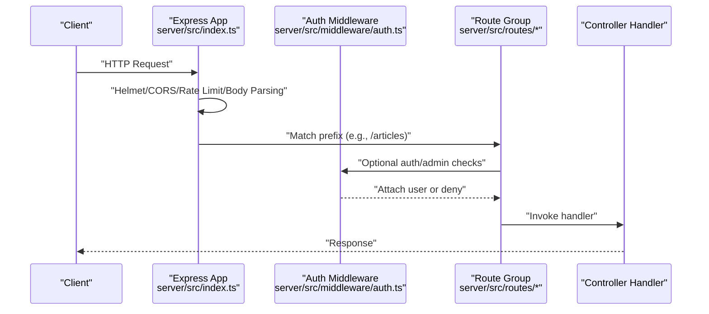
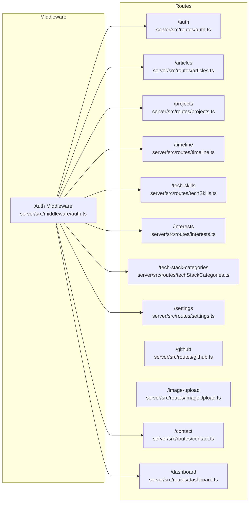

# Route Management

<cite>
**Referenced Files in This Document**
- [index.ts](file://server/src/index.ts)
- [auth.ts](file://server/src/middleware/auth.ts)
- [auth.ts](file://server/src/routes/auth.ts)
- [articles.ts](file://server/src/routes/articles.ts)
- [projects.ts](file://server/src/routes/projects.ts)
- [dashboard.ts](file://server/src/routes/dashboard.ts)
- [github.ts](file://server/src/routes/github.ts)
- [imageUpload.ts](file://server/src/routes/imageUpload.ts)
- [timeline.ts](file://server/src/routes/timeline.ts)
- [techSkills.ts](file://server/src/routes/techSkills.ts)
- [interests.ts](file://server/src/routes/interests.ts)
- [techStackCategories.ts](file://server/src/routes/techStackCategories.ts)
- [settings.ts](file://server/src/routes/settings.ts)
- [contact.ts](file://server/src/routes/contact.ts)
</cite>

## Table of Contents
1. [Introduction](#introduction)
2. [Project Structure](#project-structure)
3. [Core Components](#core-components)
4. [Architecture Overview](#architecture-overview)
5. [Detailed Component Analysis](#detailed-component-analysis)
6. [Dependency Analysis](#dependency-analysis)
7. [Performance Considerations](#performance-considerations)
8. [Troubleshooting Guide](#troubleshooting-guide)
9. [Conclusion](#conclusion)
10. [Appendices](#appendices)

## Introduction
This document describes the route management and API organization for the portfolio backend. It covers how Express routers are mounted, categorized by functional domain, and secured. It also documents route parameter patterns, query parameter handling, request body validation, authentication and role-based access control, response formats, HTTP status codes, error handling, and operational guidance such as rate limiting and image upload constraints.

## Project Structure
The Express application mounts modular route groups under top-level prefixes. Each group encapsulates related endpoints and applies shared middleware (authentication and admin checks) as appropriate.

```mermaid
graph TB
A["Express App<br/>server/src/index.ts"] --> B["/auth<br/>server/src/routes/auth.ts"]
A --> C["/articles<br/>server/src/routes/articles.ts"]
A --> D["/projects<br/>server/src/routes/projects.ts"]
A --> E["/timeline<br/>server/src/routes/timeline.ts"]
A --> F["/tech-skills<br/>server/src/routes/techSkills.ts"]
A --> G["/interests<br/>server/src/routes/interests.ts"]
A --> H["/tech-stack-categories<br/>server/src/routes/techStackCategories.ts"]
A --> I["/image-upload<br/>server/src/routes/imageUpload.ts"]
A --> J["/github<br/>server/src/routes/github.ts"]
A --> K["/settings<br/>server/src/routes/settings.ts"]
A --> L["/contact<br/>server/src/routes/contact.ts"]
A --> M["/dashboard<br/>server/src/routes/dashboard.ts"]
A --> N["/dashboard/enhanced<br/>server/src/routes/enhancedDashboard.ts"]
A --> O["/api/contact<br/>server/src/routes/contact.ts"]
A --> P["/api/admin<br/>server/src/routes/adminMessages.ts"]
```

**Diagram sources**
- [index.ts](file://server/src/index.ts#L102-L116)

**Section sources**
- [index.ts](file://server/src/index.ts#L102-L116)

## Core Components
- Express server bootstrap and middleware pipeline
  - Helmet security headers, CORS configuration with dynamic origins, rate limiting, JSON/URL-encoded body parsing
  - Mounted route groups under top-level paths
- Authentication middleware
  - Token extraction from Authorization header, JWT verification, user lookup, and admin enforcement
- Route groups
  - Authentication routes (/auth): registration, login, profile retrieval
  - Content management routes (/articles, /projects, /timeline, /tech-skills, /interests, /tech-stack-categories, /settings): CRUD with optional image uploads
  - Integration routes (/github, /image-upload): external integrations and media handling
  - Administrative routes (/dashboard, /dashboard/enhanced, /api/admin): stats, analytics, seeding, and admin message management
  - Contact routes (/contact, /api/contact): submission with rate limiting and admin message management

Key security and validation patterns:
- JWT-based authentication enforced via middleware
- Role-based access control for admin-only endpoints
- Multer-based file upload handling with size and MIME-type constraints
- Endpoint-specific rate limiting (e.g., contact submissions)

**Section sources**
- [index.ts](file://server/src/index.ts#L1-L158)
- [auth.ts](file://server/src/middleware/auth.ts#L1-L37)

## Architecture Overview
The backend exposes a REST-like API organized by domain. Requests flow through global middleware (security, CORS, rate limiting, body parsing), then match the appropriate route group, and finally reach controller handlers.

**Diagram sources**
- [index.ts](file://server/src/index.ts#L34-L97)
- [auth.ts](file://server/src/middleware/auth.ts#L9-L30)
- [articles.ts](file://server/src/routes/articles.ts#L40-L48)

## Detailed Component Analysis

### Authentication Routes (/auth)
- Purpose: User registration, login, and profile retrieval
- Endpoints
  - POST /auth/register
  - POST /auth/login
  - GET /auth/profile (protected)
- Authentication
  - Profile endpoint uses token-based authentication middleware
- Request bodies
  - Registration and login endpoints expect JSON payloads conforming to expected fields
- Responses
  - Typical success responses include tokens and user data; errors return structured messages
- Status codes
  - 200 OK, 201 Created, 400 Bad Request, 401 Unauthorized, 403 Forbidden, 500 Internal Server Error

Common usage pattern:
- Register a new user, receive credentials, then log in to obtain a JWT
- Use the JWT in the Authorization header for protected requests

**Section sources**
- [auth.ts](file://server/src/routes/auth.ts#L1-L11)
- [auth.ts](file://server/src/middleware/auth.ts#L9-L30)

### Content Management Routes

#### Articles (/articles)
- Public endpoints
  - GET /articles (published articles)
  - GET /articles/all (admin-only)
  - GET /articles/:id (by ID)
- Admin endpoints
  - Requires authentication and admin role
  - POST /articles (create)
  - PUT /articles/:id (update)
  - DELETE /articles/:id (delete)
- Image upload variants
  - POST /articles/upload (multipart/form-data with featuredImage)
  - PUT /articles/upload/:id (multipart/form-data with featuredImage)
- Route parameter patterns
  - :id for MongoDB ObjectId
- Validation and constraints
  - Multer single file upload with 2 MB size limit and image/* filter
- Status codes
  - 200 OK, 201 Created, 400 Bad Request, 401 Unauthorized, 403 Forbidden, 404 Not Found, 500 Internal Server Error

Example usage:
- Upload an article with an image using multipart/form-data
- Retrieve a published article by ID

**Section sources**
- [articles.ts](file://server/src/routes/articles.ts#L1-L54)

#### Projects (/projects)
- Public endpoints
  - GET /projects (published projects)
  - GET /projects/all (admin-only)
  - GET /projects/slug/:slug (published by slug)
  - GET /projects/:id (published by ID)
- Admin endpoints
  - Requires authentication and admin role
  - POST /projects (create)
  - PUT /projects/:id (update)
  - DELETE /projects/:id (delete)
  - POST /projects/migrate-slugs (one-time slug backfill)
- Image upload variants
  - POST /projects/upload (multipart/form-data with thumbnail and screenshots)
  - PUT /projects/upload/:id (multipart/form-data with thumbnail and screenshots)
- Route parameter patterns
  - :id for MongoDB ObjectId
  - :slug for URL-safe identifiers
- Validation and constraints
  - Multer fields upload with 2 MB size limit and image/* filter
- Status codes
  - 200 OK, 201 Created, 400 Bad Request, 401 Unauthorized, 403 Forbidden, 404 Not Found, 500 Internal Server Error

Example usage:
- Create a project with thumbnail and multiple screenshots
- Retrieve a project by slug for public display

**Section sources**
- [projects.ts](file://server/src/routes/projects.ts#L1-L71)

#### Timeline (/timeline)
- Public endpoints
  - GET /timeline/public (list items)
- Admin endpoints
  - Requires authentication and admin role
  - GET /timeline (list items)
  - GET /timeline/:id (retrieve by ID)
  - POST /timeline (create)
  - PUT /timeline/:id (update)
  - DELETE /timeline/:id (delete)
- Route parameter patterns
  - :id for MongoDB ObjectId
- Status codes
  - 200 OK, 201 Created, 400 Bad Request, 401 Unauthorized, 403 Forbidden, 404 Not Found, 500 Internal Server Error

Example usage:
- Fetch public timeline entries for rendering
- Add or update timeline entries via admin interface

**Section sources**
- [timeline.ts](file://server/src/routes/timeline.ts#L1-L35)

#### Tech Skills (/tech-skills)
- Public endpoints
  - GET /tech-skills/public (list items)
- Admin endpoints
  - Requires authentication and admin role
  - GET /tech-skills (list items)
  - GET /tech-skills/:id (retrieve by ID)
  - POST /tech-skills (create)
  - PUT /tech-skills/:id (update)
  - DELETE /tech-skills/:id (delete)
- Route parameter patterns
  - :id for MongoDB ObjectId
- Status codes
  - 200 OK, 201 Created, 400 Bad Request, 401 Unauthorized, 403 Forbidden, 404 Not Found, 500 Internal Server Error

Example usage:
- Render public skill listings
- Manage skill categories via admin

**Section sources**
- [techSkills.ts](file://server/src/routes/techSkills.ts#L1-L35)

#### Interests (/interests)
- Public endpoints
  - GET /interests/public (list items)
- Admin endpoints
  - Requires authentication and admin role
  - GET /interests (list items)
  - GET /interests/:id (retrieve by ID)
  - POST /interests (create)
  - PUT /interests/:id (update)
  - DELETE /interests/:id (delete)
- Route parameter patterns
  - :id for MongoDB ObjectId
- Status codes
  - 200 OK, 201 Created, 400 Bad Request, 401 Unauthorized, 403 Forbidden, 404 Not Found, 500 Internal Server Error

Example usage:
- Fetch public interests for display
- Update interest metadata via admin

**Section sources**
- [interests.ts](file://server/src/routes/interests.ts#L1-L35)

#### Tech Stack Categories (/tech-stack-categories)
- Public endpoints
  - GET /tech-stack-categories/public (list items)
- Admin endpoints
  - Requires authentication and admin role
  - GET /tech-stack-categories (list items)
  - GET /tech-stack-categories/:id (retrieve by ID)
  - POST /tech-stack-categories (create)
  - PUT /tech-stack-categories/:id (update)
  - DELETE /tech-stack-categories/:id (delete)
- Route parameter patterns
  - :id for MongoDB ObjectId
- Status codes
  - 200 OK, 201 Created, 400 Bad Request, 401 Unauthorized, 403 Forbidden, 404 Not Found, 500 Internal Server Error

Example usage:
- Render public tech stack categories
- Manage categories via admin

**Section sources**
- [techStackCategories.ts](file://server/src/routes/techStackCategories.ts#L1-L35)

#### Settings (/settings)
- Public endpoint
  - GET /settings (retrieves current settings)
- Admin endpoint
  - Requires authentication and admin role
  - PUT /settings (updates settings)
- Status codes
  - 200 OK, 400 Bad Request, 401 Unauthorized, 403 Forbidden, 500 Internal Server Error

Example usage:
- Fetch current site settings for rendering
- Update settings via admin panel

**Section sources**
- [settings.ts](file://server/src/routes/settings.ts#L1-L16)

### Integration Routes

#### GitHub (/github)
- Public endpoints
  - GET /github/repos (fetches repositories)
  - GET /github/repo/:owner/:repo (fetches repository details)
- Route parameter patterns
  - :owner, :repo for repository identifiers
- Status codes
  - 200 OK, 404 Not Found, 500 Internal Server Error

Example usage:
- List repositories for display
- Fetch detailed repo info for cards

**Section sources**
- [github.ts](file://server/src/routes/github.ts#L1-L9)

#### Image Upload (/image-upload)
- Public endpoint
  - POST /image-upload/upload (multipart/form-data with image)
- Validation and constraints
  - Multer single file upload with 2 MB size limit
- Status codes
  - 200 OK, 400 Bad Request, 500 Internal Server Error

Example usage:
- Upload images for articles or projects
- Store returned URLs in content records

**Section sources**
- [imageUpload.ts](file://server/src/routes/imageUpload.ts#L1-L19)

### Administrative Routes

#### Dashboard (/dashboard)
- Admin endpoints
  - Requires authentication and admin role
  - GET /dashboard/stats (dashboard statistics)
  - GET /dashboard/analytics (detailed analytics)
  - POST /dashboard/seed (seed database with defaults)
- Status codes
  - 200 OK, 400 Bad Request, 401 Unauthorized, 403 Forbidden, 500 Internal Server Error

Example usage:
- Load dashboard metrics and analytics
- Seed initial data during setup

**Section sources**
- [dashboard.ts](file://server/src/routes/dashboard.ts#L1-L21)

#### Enhanced Dashboard (/dashboard/enhanced)
- Mounted under /dashboard/enhanced
- Admin-only endpoints for advanced analytics and operations
- Status codes
  - 200 OK, 400 Bad Request, 401 Unauthorized, 403 Forbidden, 500 Internal Server Error

Note: The route group is mounted but not further detailed here; consult the route module for specifics.

**Section sources**
- [index.ts](file://server/src/index.ts#L108)

#### Admin Messages (/api/admin)
- Mounted under /api/admin
- Admin-only endpoints for managing messages
- Status codes
  - 200 OK, 400 Bad Request, 401 Unauthorized, 403 Forbidden, 500 Internal Server Error

Note: The route group is mounted but not further detailed here; consult the route module for specifics.

**Section sources**
- [index.ts](file://server/src/index.ts#L116)

### Contact Routes (/contact, /api/contact)
- Public endpoint
  - POST /contact (submit message) with rate limiting
- Admin endpoints
  - Requires authentication and admin role
  - GET /contact/messages (list messages)
  - PATCH /contact/messages/:id/status (update message status)
- Rate limiting
  - Window 10 minutes, max 5 requests
- Route parameter patterns
  - :id for MongoDB ObjectId
- Status codes
  - 200 OK, 201 Created, 400 Bad Request, 429 Too Many Requests, 401 Unauthorized, 403 Forbidden, 404 Not Found, 500 Internal Server Error

Example usage:
- Submit a contact form while respecting rate limits
- Review and mark messages as read/unread via admin

**Section sources**
- [contact.ts](file://server/src/routes/contact.ts#L1-L28)

## Dependency Analysis
The application composes routes from modular route files and controllers, enforcing authentication and admin roles at the route level or via middleware. Multer integrates for file uploads across several endpoints.

**Diagram sources**
- [auth.ts](file://server/src/middleware/auth.ts#L1-L37)
- [auth.ts](file://server/src/routes/auth.ts#L1-L11)
- [articles.ts](file://server/src/routes/articles.ts#L1-L54)
- [projects.ts](file://server/src/routes/projects.ts#L1-L71)
- [timeline.ts](file://server/src/routes/timeline.ts#L1-L35)
- [techSkills.ts](file://server/src/routes/techSkills.ts#L1-L35)
- [interests.ts](file://server/src/routes/interests.ts#L1-L35)
- [techStackCategories.ts](file://server/src/routes/techStackCategories.ts#L1-L35)
- [settings.ts](file://server/src/routes/settings.ts#L1-L16)
- [github.ts](file://server/src/routes/github.ts#L1-L9)
- [imageUpload.ts](file://server/src/routes/imageUpload.ts#L1-L19)
- [contact.ts](file://server/src/routes/contact.ts#L1-L28)
- [dashboard.ts](file://server/src/routes/dashboard.ts#L1-L21)

**Section sources**
- [index.ts](file://server/src/index.ts#L102-L116)
- [auth.ts](file://server/src/middleware/auth.ts#L1-L37)

## Performance Considerations
- Body size limits: JSON and URL-encoded bodies are capped at 10 MB
- File size limits: Image uploads are capped at 2 MB
- Rate limiting: Global IP-based rate limiting applied to all routes
- Endpoint-specific rate limiting: Contact submissions limited to 5 requests per 10 minutes
- CORS: Origins determined dynamically based on environment and configuration

Recommendations:
- Use pagination for list endpoints when data grows
- Compress responses where feasible
- Cache public reads for frequently accessed resources (e.g., published articles, projects)

**Section sources**
- [index.ts](file://server/src/index.ts#L87-L97)
- [contact.ts](file://server/src/routes/contact.ts#L12-L20)

## Troubleshooting Guide
- Authentication failures
  - Missing or invalid Authorization header
  - Expired or malformed JWT
  - Non-existent user ID in token payload
- Access denied
  - Admin-only endpoints return forbidden when role is not admin
- File upload errors
  - Unsupported MIME type or file too large
  - Missing expected field in multipart payload
- Rate limiting
  - Exceeded request quotas; wait for reset window
- General errors
  - Unexpected server errors return a generic message; in development, internal details may be included

Operational checks:
- Verify CORS origin configuration matches frontend deployment
- Confirm JWT secret and expiration settings align with client expectations
- Validate database connectivity and controller availability

**Section sources**
- [auth.ts](file://server/src/middleware/auth.ts#L14-L29)
- [auth.ts](file://server/src/middleware/auth.ts#L32-L36)
- [articles.ts](file://server/src/routes/articles.ts#L15-L30)
- [projects.ts](file://server/src/routes/projects.ts#L17-L32)
- [imageUpload.ts](file://server/src/routes/imageUpload.ts#L5-L12)
- [contact.ts](file://server/src/routes/contact.ts#L12-L20)
- [index.ts](file://server/src/index.ts#L133-L140)

## Conclusion
The portfolio backend organizes API endpoints by functional domains, enforces authentication and admin roles consistently, and applies robust validation and rate limiting. The modular route structure supports scalable maintenance and clear separation of concerns. Administrators can manage content, settings, and analytics, while public endpoints expose curated data for the frontend.

## Appendices

### Endpoint Reference Summary
- Authentication
  - POST /auth/register
  - POST /auth/login
  - GET /auth/profile
- Articles
  - GET /articles
  - GET /articles/all
  - GET /articles/:id
  - POST /articles
  - PUT /articles/:id
  - DELETE /articles/:id
  - POST /articles/upload
  - PUT /articles/upload/:id
- Projects
  - GET /projects
  - GET /projects/all
  - GET /projects/slug/:slug
  - GET /projects/:id
  - POST /projects
  - PUT /projects/:id
  - DELETE /projects/:id
  - POST /projects/migrate-slugs
  - POST /projects/upload
  - PUT /projects/upload/:id
- Timeline
  - GET /timeline/public
  - GET /timeline
  - GET /timeline/:id
  - POST /timeline
  - PUT /timeline/:id
  - DELETE /timeline/:id
- Tech Skills
  - GET /tech-skills/public
  - GET /tech-skills
  - GET /tech-skills/:id
  - POST /tech-skills
  - PUT /tech-skills/:id
  - DELETE /tech-skills/:id
- Interests
  - GET /interests/public
  - GET /interests
  - GET /interests/:id
  - POST /interests
  - PUT /interests/:id
  - DELETE /interests/:id
- Tech Stack Categories
  - GET /tech-stack-categories/public
  - GET /tech-stack-categories
  - GET /tech-stack-categories/:id
  - POST /tech-stack-categories
  - PUT /tech-stack-categories/:id
  - DELETE /tech-stack-categories/:id
- Settings
  - GET /settings
  - PUT /settings
- GitHub
  - GET /github/repos
  - GET /github/repo/:owner/:repo
- Image Upload
  - POST /image-upload/upload
- Contact
  - POST /contact
  - GET /contact/messages
  - PATCH /contact/messages/:id/status
- Dashboard
  - GET /dashboard/stats
  - GET /dashboard/analytics
  - POST /dashboard/seed
- Additional Mounts
  - /dashboard/enhanced
  - /api/contact
  - /api/admin

### Route Parameter Patterns
- :id → MongoDB ObjectId
- :slug → URL-safe string identifier
- :owner, :repo → Repository owner and name

### Query Parameters
- No explicit query parameter handling is defined in the examined route files; any query support would be implemented within controllers.

### Request Body Validation
- Enforced by middleware and controllers:
  - JSON body parsing with size limits
  - Multer for multipart/form-data with file size and MIME-type constraints
  - Endpoint-specific validation in controllers

### Authentication and Authorization
- JWT-based authentication middleware verifies tokens and attaches user context
- Admin-only routes enforce role-based access control
- Some endpoints are public and do not require authentication

### Response Formats and Status Codes
- Responses are JSON objects; successful operations typically return 200 OK or 201 Created
- Errors return 4xx/5xx with error messages; development mode may include additional details
- Rate-limited endpoints return 429 with a standardized error payload

### Examples of Usage
- Retrieve published articles: GET /articles
- Upload an article with an image: POST /articles/upload with multipart/form-data
- Submit a contact message: POST /contact (subject to rate limits)
- Access admin dashboard stats: GET /dashboard/stats (requires admin)

### Versioning and Deprecation
- No explicit versioning scheme is present in the route prefixes
- Backward compatibility considerations:
  - Prefer adding new endpoints rather than modifying existing ones
  - Maintain stable parameter names and response shapes
  - Introduce deprecation notices before removing endpoints