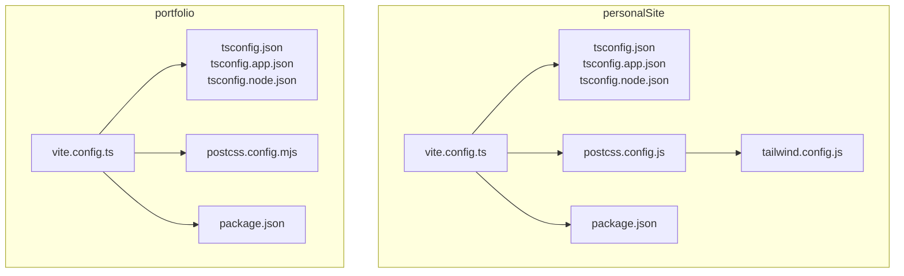
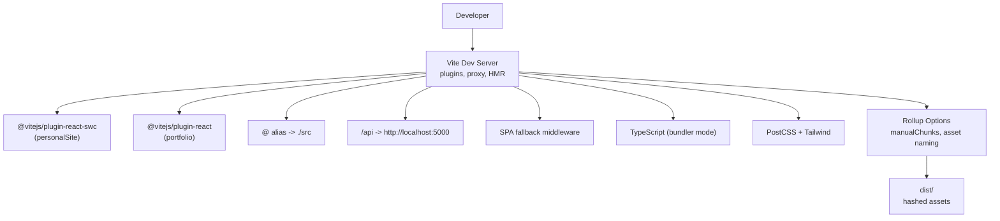
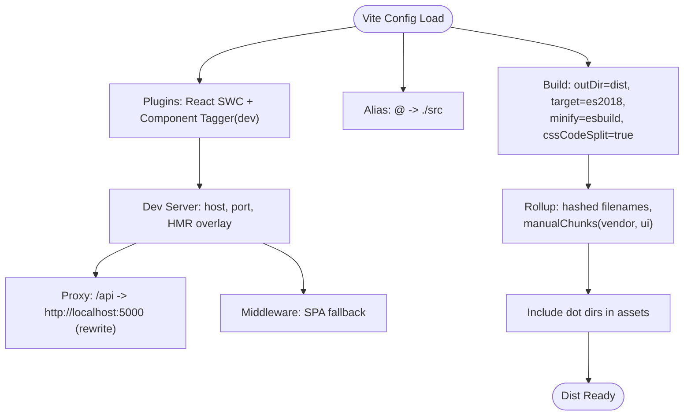
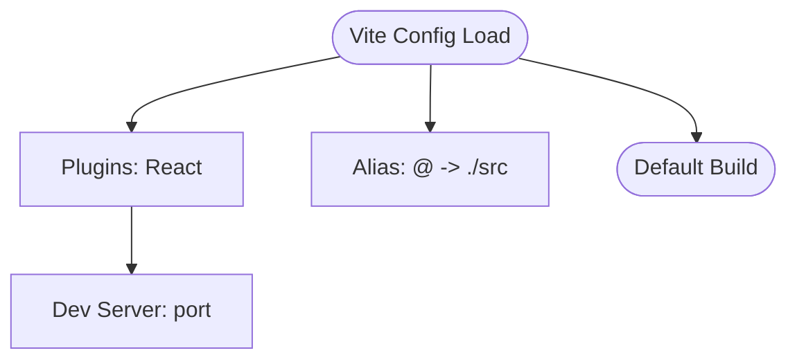
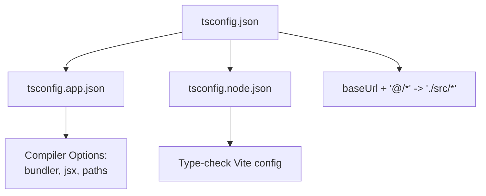
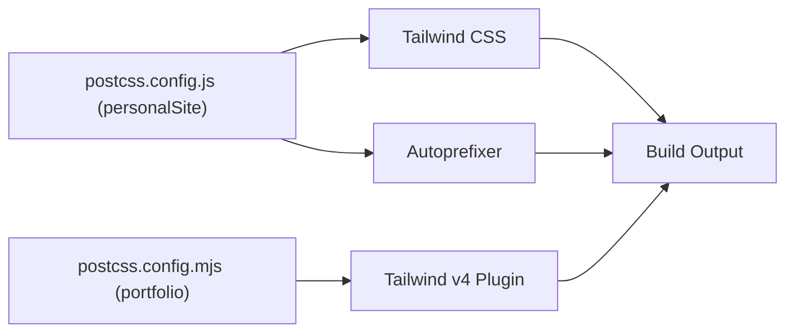
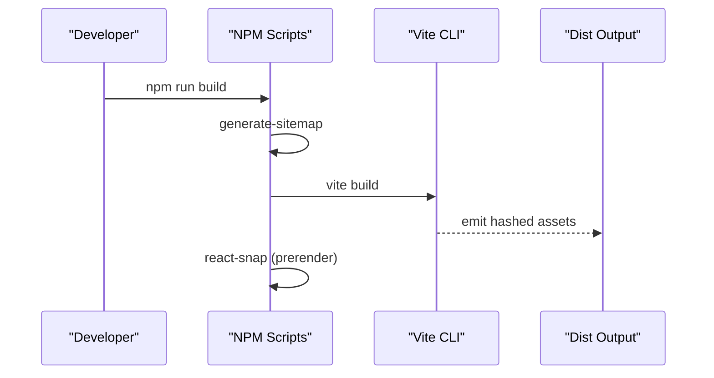
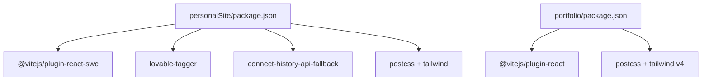

# Build Configuration

<cite>
**Referenced Files in This Document**
- [personalSite/vite.config.ts](file://personalSite/vite.config.ts)
- [personalSite/tsconfig.json](file://personalSite/tsconfig.json)
- [personalSite/tsconfig.app.json](file://personalSite/tsconfig.app.json)
- [personalSite/tsconfig.node.json](file://personalSite/tsconfig.node.json)
- [personalSite/postcss.config.js](file://personalSite/postcss.config.js)
- [personalSite/tailwind.config.js](file://personalSite/tailwind.config.js)
- [personalSite/package.json](file://personalSite/package.json)
- [portfolio/vite.config.ts](file://portfolio/vite.config.ts)
- [portfolio/tsconfig.json](file://portfolio/tsconfig.json)
- [portfolio/tsconfig.app.json](file://portfolio/tsconfig.app.json)
- [portfolio/tsconfig.node.json](file://portfolio/tsconfig.node.json)
- [portfolio/postcss.config.mjs](file://portfolio/postcss.config.mjs)
- [portfolio/package.json](file://portfolio/package.json)
</cite>

## Table of Contents
1. [Introduction](#introduction)
2. [Project Structure](#project-structure)
3. [Core Components](#core-components)
4. [Architecture Overview](#architecture-overview)
5. [Detailed Component Analysis](#detailed-component-analysis)
6. [Dependency Analysis](#dependency-analysis)
7. [Performance Considerations](#performance-considerations)
8. [Troubleshooting Guide](#troubleshooting-guide)
9. [Conclusion](#conclusion)
10. [Appendices](#appendices)

## Introduction
This document explains the build configuration system for two Vite-based applications: personalSite and portfolio. It covers Vite plugin setup (React SWC, component tagger), development server configuration (proxy, HMR, SPA middleware), TypeScript compilation and path aliases, build optimization (chunk splitting, asset naming, Rollup options), PostCSS and Tailwind integration, and environment-specific build targets. It also provides practical guidance for customizing builds, optimizing bundle sizes, and implementing custom plugins.

## Project Structure
Both applications share a similar structure:
- Vite configuration files define dev server, plugins, resolve aliases, and build outputs.
- TypeScript configurations split into app and node contexts with bundler-mode resolution.
- PostCSS and Tailwind integrate via configuration files to process CSS.
- Scripts in package.json orchestrate dev, build, and preview tasks.

**Diagram sources**
- [personalSite/vite.config.ts](file://personalSite/vite.config.ts#L1-L61)
- [personalSite/tsconfig.json](file://personalSite/tsconfig.json#L1-L17)
- [personalSite/tsconfig.app.json](file://personalSite/tsconfig.app.json#L1-L31)
- [personalSite/tsconfig.node.json](file://personalSite/tsconfig.node.json#L1-L23)
- [personalSite/postcss.config.js](file://personalSite/postcss.config.js#L1-L7)
- [personalSite/tailwind.config.js](file://personalSite/tailwind.config.js#L1-L68)
- [personalSite/package.json](file://personalSite/package.json#L1-L113)
- [portfolio/vite.config.ts](file://portfolio/vite.config.ts#L1-L16)
- [portfolio/tsconfig.json](file://portfolio/tsconfig.json#L1-L8)
- [portfolio/tsconfig.app.json](file://portfolio/tsconfig.app.json#L1-L33)
- [portfolio/tsconfig.node.json](file://portfolio/tsconfig.node.json#L1-L27)
- [portfolio/postcss.config.mjs](file://portfolio/postcss.config.mjs#L1-L9)
- [portfolio/package.json](file://portfolio/package.json#L1-L74)

**Section sources**
- [personalSite/vite.config.ts](file://personalSite/vite.config.ts#L1-L61)
- [portfolio/vite.config.ts](file://portfolio/vite.config.ts#L1-L16)
- [personalSite/tsconfig.json](file://personalSite/tsconfig.json#L1-L17)
- [portfolio/tsconfig.json](file://portfolio/tsconfig.json#L1-L8)
- [personalSite/postcss.config.js](file://personalSite/postcss.config.js#L1-L7)
- [portfolio/postcss.config.mjs](file://portfolio/postcss.config.mjs#L1-L9)
- [personalSite/tailwind.config.js](file://personalSite/tailwind.config.js#L1-L68)
- [personalSite/package.json](file://personalSite/package.json#L1-L113)
- [portfolio/package.json](file://portfolio/package.json#L1-L74)

## Core Components
- Vite configuration
  - Plugins: React SWC in personalSite; React in portfolio.
  - Aliases: "@" resolves to "./src".
  - Dev server: port, host, HMR overlay, proxy for "/api", SPA fallback middleware.
  - Build: output directory, target, minification, CSS code splitting, Rollup chunking and asset naming, include dot directories.
- TypeScript configuration
  - Root tsconfig references app and node configs.
  - App config sets bundler mode, JSX, path aliases, strictness, and module detection.
  - Node config sets bundler mode for Vite config type-checking.
- PostCSS and Tailwind
  - personalSite: PostCSS loads Tailwind and Autoprefixer; Tailwind scans HTML and TSX sources.
  - portfolio: PostCSS uses Tailwind v4 plugin; minimal Tailwind config presence in repository.

**Section sources**
- [personalSite/vite.config.ts](file://personalSite/vite.config.ts#L10-L60)
- [portfolio/vite.config.ts](file://portfolio/vite.config.ts#L1-L16)
- [personalSite/tsconfig.json](file://personalSite/tsconfig.json#L1-L17)
- [personalSite/tsconfig.app.json](file://personalSite/tsconfig.app.json#L1-L31)
- [personalSite/tsconfig.node.json](file://personalSite/tsconfig.node.json#L1-L23)
- [portfolio/tsconfig.json](file://portfolio/tsconfig.json#L1-L8)
- [portfolio/tsconfig.app.json](file://portfolio/tsconfig.app.json#L1-L33)
- [portfolio/tsconfig.node.json](file://portfolio/tsconfig.node.json#L1-L27)
- [personalSite/postcss.config.js](file://personalSite/postcss.config.js#L1-L7)
- [personalSite/tailwind.config.js](file://personalSite/tailwind.config.js#L1-L68)
- [portfolio/postcss.config.mjs](file://portfolio/postcss.config.mjs#L1-L9)

## Architecture Overview
The build pipeline for each app:
- Vite orchestrates dev server, plugin transforms, and bundling.
- TypeScript compiles with bundler mode and path aliases.
- PostCSS processes Tailwind utilities and vendor prefixes.
- Build artifacts are emitted to dist with hashed filenames and optimized chunks.

**Diagram sources**
- [personalSite/vite.config.ts](file://personalSite/vite.config.ts#L10-L60)
- [portfolio/vite.config.ts](file://portfolio/vite.config.ts#L1-L16)
- [personalSite/tsconfig.app.json](file://personalSite/tsconfig.app.json#L1-L31)
- [portfolio/tsconfig.app.json](file://portfolio/tsconfig.app.json#L1-L33)
- [personalSite/postcss.config.js](file://personalSite/postcss.config.js#L1-L7)
- [portfolio/postcss.config.mjs](file://portfolio/postcss.config.mjs#L1-L9)

## Detailed Component Analysis

### Vite Configuration: personalSite
- Plugins
  - React SWC for fast JSX transform.
  - Component tagger enabled in development mode to annotate components during dev.
- Dev server
  - Host and port set for local access.
  - HMR overlay disabled for cleaner console output.
  - Proxy for "/api" forwards to backend on localhost:5000 and strips the "/api" prefix.
  - SPA fallback middleware ensures client-side routing works by serving index.html for unmatched routes.
- Resolve aliases
  - "@" resolves to "./src" for concise imports.
- Build
  - Output directory is dist.
  - Target is ES2018.
  - Minification uses esbuild.
  - CSS code splitting enabled.
  - Rollup options:
    - Hashed chunk and asset filenames.
    - Manual chunks for vendor libraries and UI primitives.
  - Includes dot directories (e.g., .well-known) in assets.

**Diagram sources**
- [personalSite/vite.config.ts](file://personalSite/vite.config.ts#L10-L60)

**Section sources**
- [personalSite/vite.config.ts](file://personalSite/vite.config.ts#L10-L60)

### Vite Configuration: portfolio
- Plugins
  - React plugin for JSX transform.
- Dev server
  - Minimal configuration with port set.
- Resolve aliases
  - "@" resolves to "./src".

**Diagram sources**
- [portfolio/vite.config.ts](file://portfolio/vite.config.ts#L1-L16)

**Section sources**
- [portfolio/vite.config.ts](file://portfolio/vite.config.ts#L1-L16)

### TypeScript Compilation and Path Aliases
- Root tsconfig
  - References app and node configs.
  - Defines baseUrl and path alias "@/*" pointing to "./src/*".
- App tsconfig
  - Bundler mode with moduleResolution "bundler", isolated modules, and JSX set to react-jsx.
  - Path aliases mirrored here for editor support.
- Node tsconfig
  - Targets Vite config for type-checking in bundler mode.

**Diagram sources**
- [personalSite/tsconfig.json](file://personalSite/tsconfig.json#L1-L17)
- [personalSite/tsconfig.app.json](file://personalSite/tsconfig.app.json#L1-L31)
- [personalSite/tsconfig.node.json](file://personalSite/tsconfig.node.json#L1-L23)
- [portfolio/tsconfig.json](file://portfolio/tsconfig.json#L1-L8)
- [portfolio/tsconfig.app.json](file://portfolio/tsconfig.app.json#L1-L33)
- [portfolio/tsconfig.node.json](file://portfolio/tsconfig.node.json#L1-L27)

**Section sources**
- [personalSite/tsconfig.json](file://personalSite/tsconfig.json#L1-L17)
- [personalSite/tsconfig.app.json](file://personalSite/tsconfig.app.json#L1-L31)
- [personalSite/tsconfig.node.json](file://personalSite/tsconfig.node.json#L1-L23)
- [portfolio/tsconfig.json](file://portfolio/tsconfig.json#L1-L8)
- [portfolio/tsconfig.app.json](file://portfolio/tsconfig.app.json#L1-L33)
- [portfolio/tsconfig.node.json](file://portfolio/tsconfig.node.json#L1-L27)

### PostCSS and Tailwind Integration
- personalSite
  - PostCSS loads Tailwind and Autoprefixer.
  - Tailwind scans index.html and all TSX/TS under src.
- portfolio
  - PostCSS uses Tailwind v4 plugin.
  - Tailwind configuration presence varies; repository includes a JS stub and TS stub in node_modules.

**Diagram sources**
- [personalSite/postcss.config.js](file://personalSite/postcss.config.js#L1-L7)
- [personalSite/tailwind.config.js](file://personalSite/tailwind.config.js#L1-L68)
- [portfolio/postcss.config.mjs](file://portfolio/postcss.config.mjs#L1-L9)

**Section sources**
- [personalSite/postcss.config.js](file://personalSite/postcss.config.js#L1-L7)
- [personalSite/tailwind.config.js](file://personalSite/tailwind.config.js#L1-L68)
- [portfolio/postcss.config.mjs](file://portfolio/postcss.config.mjs#L1-L9)

### Environment-Specific Build Targets and Scripts
- personalSite
  - Scripts include dev, build, build:dev, SEO sitemap generation, and prerendering via react-snap.
  - Build script runs Vite build and prerenders static routes.
- portfolio
  - Scripts include dev, build, lint, and preview.
  - Dev server runs on a different port than personalSite.

**Diagram sources**
- [personalSite/package.json](file://personalSite/package.json#L6-L13)

**Section sources**
- [personalSite/package.json](file://personalSite/package.json#L6-L13)
- [portfolio/package.json](file://portfolio/package.json#L5-L10)

### Customizing Build Configurations for Different Environments
- Add environment-aware Vite config by returning a function that reads mode and applies overrides for base path, proxy target, or plugin toggles.
- Example patterns:
  - Conditional plugins: enable component tagger only in development.
  - Conditional proxy: switch target based on environment variables.
  - Conditional Rollup options: adjust manualChunks or asset naming per environment.

**Section sources**
- [personalSite/vite.config.ts](file://personalSite/vite.config.ts#L10-L34)

### Optimizing Bundle Sizes
- Chunk splitting
  - Use manualChunks to separate vendor and UI libraries into dedicated chunks.
- Asset naming
  - Hashed filenames improve caching and busting.
- Minification
  - esbuild minifier is configured; keep consistent with production needs.
- CSS code splitting
  - Enabled to split styles into separate chunks.

**Section sources**
- [personalSite/vite.config.ts](file://personalSite/vite.config.ts#L40-L59)

### Implementing Custom Plugins
- Personal site uses a component tagger plugin in development mode. To add custom plugins:
  - Install the plugin as a dev dependency.
  - Register it in the plugins array.
  - Configure options as needed for the plugin’s purpose.

**Section sources**
- [personalSite/vite.config.ts](file://personalSite/vite.config.ts#L34)
- [personalSite/package.json](file://personalSite/package.json#L88)

## Dependency Analysis
- Vite plugins
  - personalSite: @vitejs/plugin-react-swc, lovable-tagger (dev), connect-history-api-fallback.
  - portfolio: @vitejs/plugin-react.
- Tooling
  - PostCSS and Tailwind versions differ between apps; ensure compatibility.
- Scripts
  - personalSite integrates sitemap generation and prerendering; portfolio relies on Vite defaults.

**Diagram sources**
- [personalSite/package.json](file://personalSite/package.json#L75-L95)
- [portfolio/package.json](file://portfolio/package.json#L61-L72)

**Section sources**
- [personalSite/package.json](file://personalSite/package.json#L75-L95)
- [portfolio/package.json](file://portfolio/package.json#L61-L72)

## Performance Considerations
- Sourcemaps
  - Disabled in personalSite build; enable for development debugging if needed.
- Minification
  - esbuild minifier is efficient; ensure it aligns with production requirements.
- Chunking
  - Manual chunks reduce initial payload; review vendor/UI separation.
- Asset handling
  - Hashed filenames and inclusion of dot directories improve caching and support for service workers or web standards.

**Section sources**
- [personalSite/vite.config.ts](file://personalSite/vite.config.ts#L40-L59)

## Troubleshooting Guide
- SPA routing not working
  - Verify the history API fallback middleware is present in dev server middlewares.
- API proxy errors
  - Confirm proxy target matches backend URL and path rewriting removes "/api" prefix.
- Tailwind utilities not applied
  - Ensure Tailwind content globs include relevant files and PostCSS loader is configured.
- HMR overlay clutter
  - Disable overlay in dev server settings if preferred.

**Section sources**
- [personalSite/vite.config.ts](file://personalSite/vite.config.ts#L12-L34)
- [personalSite/postcss.config.js](file://personalSite/postcss.config.js#L1-L7)
- [personalSite/tailwind.config.js](file://personalSite/tailwind.config.js#L4-L6)

## Conclusion
The build systems for personalSite and portfolio are streamlined and purpose-built. personalSite emphasizes developer ergonomics (component tagging), robust dev server features (proxy, SPA middleware), and aggressive build optimization (manual chunks, hashed assets). portfolio favors simplicity with a minimal Vite setup and Tailwind v4 integration. Both leverage TypeScript bundler mode and path aliases for maintainability. Adjustments for environment-specific needs, further chunking strategies, and optional sourcemap toggling can tailor performance and developer experience.

## Appendices
- Practical customization checklist
  - Environment-aware base path and proxy targets.
  - Conditional plugin activation (e.g., component tagger).
  - Manual chunk groups tailored to app usage patterns.
  - Sourcemap toggles for dev/prod parity.
  - PostCSS/Tailwind alignment across apps for consistent styling.