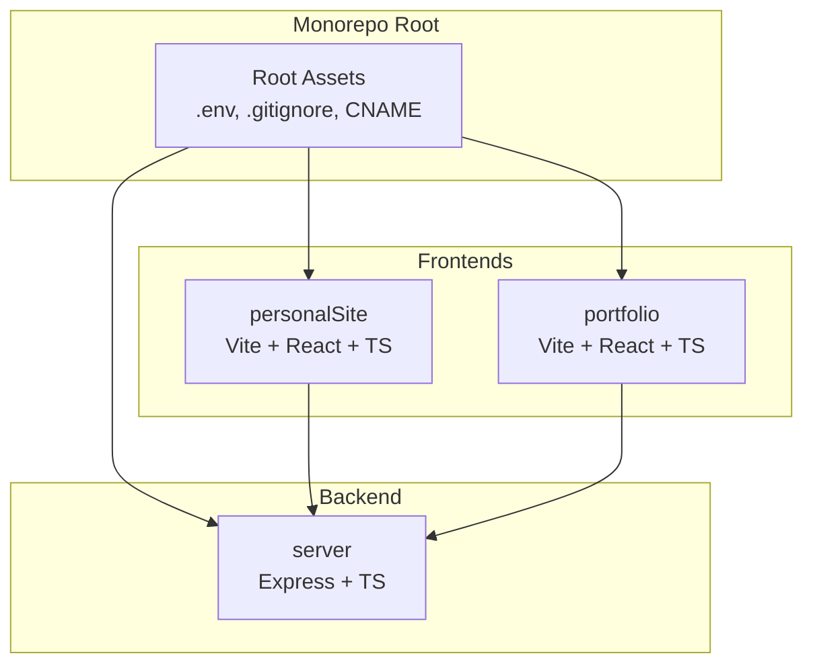
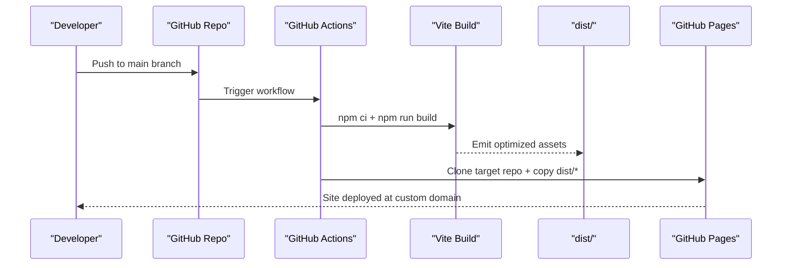
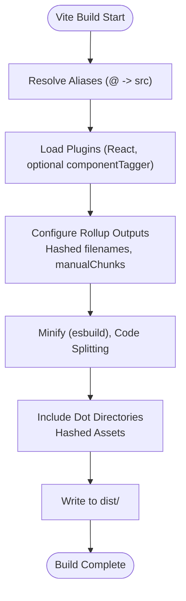
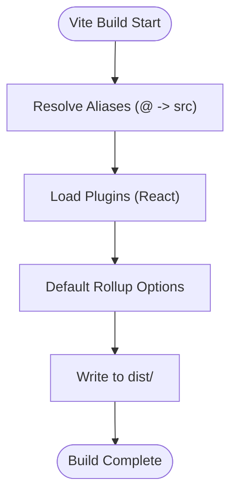
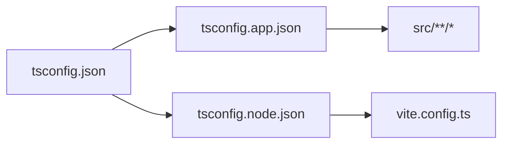
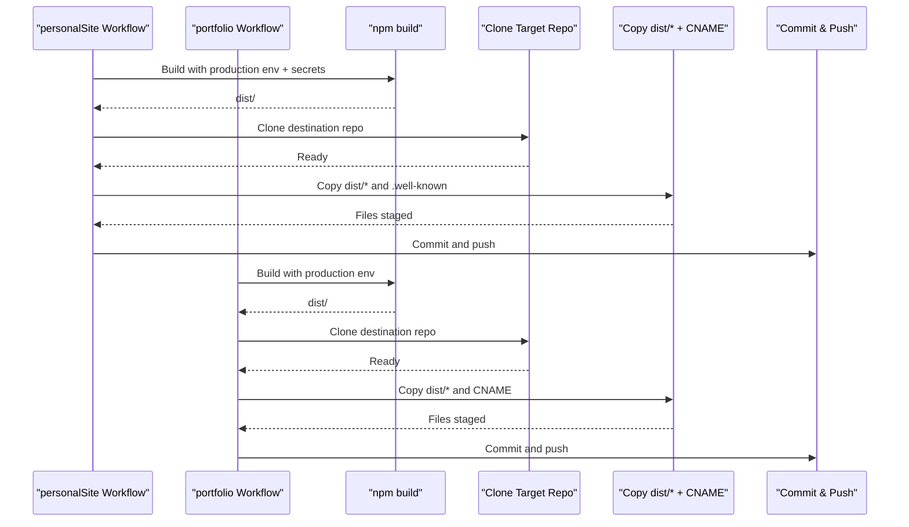
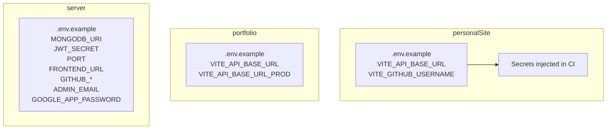
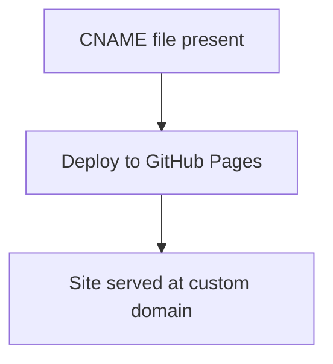
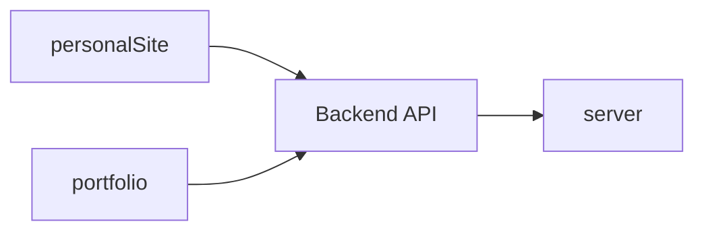

# Build and Deployment

<cite>
**Referenced Files in This Document**
- [personalSite/vite.config.ts](file://personalSite/vite.config.ts)
- [portfolio/vite.config.ts](file://portfolio/vite.config.ts)
- [personalSite/package.json](file://personalSite/package.json)
- [portfolio/package.json](file://portfolio/package.json)
- [server/package.json](file://server/package.json)
- [personalSite/tsconfig.json](file://personalSite/tsconfig.json)
- [personalSite/tsconfig.app.json](file://personalSite/tsconfig.app.json)
- [personalSite/tsconfig.node.json](file://personalSite/tsconfig.node.json)
- [portfolio/tsconfig.app.json](file://portfolio/tsconfig.app.json)
- [portfolio/tsconfig.node.json](file://portfolio/tsconfig.node.json)
- [personalSite/.github/workflows/deploy.yml](file://personalSite/.github/workflows/deploy.yml)
- [portfolio/.github/workflows/deploy.yml](file://portfolio/.github/workflows/deploy.yml)
- [personalSite/.env.example](file://personalSite/.env.example)
- [portfolio/.env.example](file://portfolio/.env.example)
- [server/.env.example](file://server/.env.example)
- [personalSite/CNAME](file://personalSite/CNAME)
- [portfolio/public/CNAME](file://portfolio/public/CNAME)
- [personalSite/scripts/generate-sitemap.mjs](file://personalSite/scripts/generate-sitemap.mjs)
</cite>

## Table of Contents
1. [Introduction](#introduction)
2. [Project Structure](#project-structure)
3. [Core Components](#core-components)
4. [Architecture Overview](#architecture-overview)
5. [Detailed Component Analysis](#detailed-component-analysis)
6. [Dependency Analysis](#dependency-analysis)
7. [Performance Considerations](#performance-considerations)
8. [Troubleshooting Guide](#troubleshooting-guide)
9. [Conclusion](#conclusion)
10. [Appendices](#appendices)

## Introduction
This document explains the Build and Deployment system for the monorepo, focusing on:
- Vite configuration for personalSite and portfolio applications
- TypeScript compilation settings across apps
- Asset optimization and prerendering strategies
- CI/CD workflows using GitHub Actions
- Environment configuration management
- Domain setup via CNAME files
- Deployment targets and continuous deployment strategies
- Environment variable management, build optimization, and performance monitoring
- Examples for customizing builds, staging environments, and rollback procedures
- Troubleshooting guidance for production deployments

## Project Structure
The repository is a monorepo containing:
- personalSite: a Vite + React + TypeScript frontend with prerendering and SEO tooling
- portfolio: a simpler Vite + React + TypeScript frontend
- server: a TypeScript Express backend for APIs and administration
- Shared top-level assets and configuration files

**Section sources**
- [personalSite/vite.config.ts](file://personalSite/vite.config.ts#L1-L61)
- [portfolio/vite.config.ts](file://portfolio/vite.config.ts#L1-L16)
- [personalSite/package.json](file://personalSite/package.json#L1-L113)
- [portfolio/package.json](file://portfolio/package.json#L1-L74)
- [server/package.json](file://server/package.json#L1-L40)

## Core Components
- Build toolchain
  - Vite-based builds for both frontends with optimized Rollup chunking and hashed asset filenames
  - Prerendering pipeline for personalSite using react-snap and a sitemap generator script
- TypeScript compilation
  - Dual tsconfig setup per app: app-specific and node/tooling configs
  - Strictness and module resolution tailored for bundler mode
- CI/CD
  - GitHub Actions workflows to build and deploy to separate GitHub Pages repositories
  - Environment injection via GitHub Secrets for API endpoints and tokens
- Domain and hosting
  - CNAME files configured for custom domains on deployed pages
  - .nojekyll files to prevent GitHub Pages Jekyll processing

**Section sources**
- [personalSite/vite.config.ts](file://personalSite/vite.config.ts#L40-L60)
- [personalSite/package.json](file://personalSite/package.json#L6-L14)
- [personalSite/scripts/generate-sitemap.mjs](file://personalSite/scripts/generate-sitemap.mjs)
- [personalSite/tsconfig.app.json](file://personalSite/tsconfig.app.json#L1-L31)
- [personalSite/tsconfig.node.json](file://personalSite/tsconfig.node.json#L1-L23)
- [portfolio/tsconfig.app.json](file://portfolio/tsconfig.app.json#L1-L33)
- [portfolio/tsconfig.node.json](file://portfolio/tsconfig.node.json#L1-L27)
- [personalSite/.github/workflows/deploy.yml](file://personalSite/.github/workflows/deploy.yml#L1-L81)
- [portfolio/.github/workflows/deploy.yml](file://portfolio/.github/workflows/deploy.yml#L1-L89)
- [personalSite/CNAME](file://personalSite/CNAME#L1-L1)
- [portfolio/public/CNAME](file://portfolio/public/CNAME)

## Architecture Overview
The build and deployment pipeline connects developer machines, CI, and hosting providers as follows:

**Diagram sources**
- [personalSite/.github/workflows/deploy.yml](file://personalSite/.github/workflows/deploy.yml#L24-L81)
- [portfolio/.github/workflows/deploy.yml](file://portfolio/.github/workflows/deploy.yml#L25-L89)
- [personalSite/vite.config.ts](file://personalSite/vite.config.ts#L40-L60)

## Detailed Component Analysis

### Vite Configuration: personalSite
Key characteristics:
- Base path set to root
- Local dev server with HMR, proxy to backend API, and SPA fallback middleware
- Plugin stack includes React and a development-only component tagger
- Build output targeting ES2018 with esbuild minification
- Chunk splitting for vendor and UI libraries
- Hashed asset filenames for long-term caching
- Inclusion of dot-directories (e.g., .well-known) for service verification
- Prerendering via react-snap and sitemap generation

**Diagram sources**
- [personalSite/vite.config.ts](file://personalSite/vite.config.ts#L35-L60)

**Section sources**
- [personalSite/vite.config.ts](file://personalSite/vite.config.ts#L10-L60)
- [personalSite/package.json](file://personalSite/package.json#L6-L14)
- [personalSite/scripts/generate-sitemap.mjs](file://personalSite/scripts/generate-sitemap.mjs)

### Vite Configuration: portfolio
Key characteristics:
- Minimal configuration focused on local dev server and React plugin
- Alias resolution for @ pointing to src
- No explicit build customization in the Vite config

**Diagram sources**
- [portfolio/vite.config.ts](file://portfolio/vite.config.ts#L1-L16)

**Section sources**
- [portfolio/vite.config.ts](file://portfolio/vite.config.ts#L1-L16)

### TypeScript Compilation Settings
- personalSite
  - Root tsconfig orchestrates app and node configs
  - App config targets modern JS, uses bundler module resolution, JSX transform, and relaxed strictness
  - Node config targets tooling files (e.g., vite.config.ts) with strict checks
- portfolio
  - App and node configs mirror personalSite but with stricter lint-time checks and verbatim module syntax
  - Includes bundler-mode type-safe defaults for Vite client types

**Diagram sources**
- [personalSite/tsconfig.json](file://personalSite/tsconfig.json#L1-L17)
- [personalSite/tsconfig.app.json](file://personalSite/tsconfig.app.json#L1-L31)
- [personalSite/tsconfig.node.json](file://personalSite/tsconfig.node.json#L1-L23)
- [portfolio/tsconfig.app.json](file://portfolio/tsconfig.app.json#L1-L33)
- [portfolio/tsconfig.node.json](file://portfolio/tsconfig.node.json#L1-L27)

**Section sources**
- [personalSite/tsconfig.json](file://personalSite/tsconfig.json#L1-L17)
- [personalSite/tsconfig.app.json](file://personalSite/tsconfig.app.json#L1-L31)
- [personalSite/tsconfig.node.json](file://personalSite/tsconfig.node.json#L1-L23)
- [portfolio/tsconfig.app.json](file://portfolio/tsconfig.app.json#L1-L33)
- [portfolio/tsconfig.node.json](file://portfolio/tsconfig.node.json#L1-L27)

### CI/CD Workflows and Deployment
- personalSite
  - Builds with production environment and injects secrets for API base URL and GitHub username
  - Deploys to a dedicated GitHub Pages repository using a personal access token
  - Preserves .well-known directory during deployment
- portfolio
  - Builds with production environment and validates dist output
  - Deploys to a separate GitHub Pages repository, copying CNAME and adding .nojekyll

**Diagram sources**
- [personalSite/.github/workflows/deploy.yml](file://personalSite/.github/workflows/deploy.yml#L24-L81)
- [portfolio/.github/workflows/deploy.yml](file://portfolio/.github/workflows/deploy.yml#L25-L89)

**Section sources**
- [personalSite/.github/workflows/deploy.yml](file://personalSite/.github/workflows/deploy.yml#L1-L81)
- [portfolio/.github/workflows/deploy.yml](file://portfolio/.github/workflows/deploy.yml#L1-L89)

### Environment Configuration Management
- personalSite
  - Example environment variables include API base URL and GitHub username
  - Build scripts integrate sitemap generation and prerendering
- portfolio
  - Example environment variables include development and production API base URLs
- server
  - Example environment variables include MongoDB URI, JWT secret, port, frontend URL, GitHub credentials, and email settings

**Diagram sources**
- [personalSite/.env.example](file://personalSite/.env.example#L1-L10)
- [portfolio/.env.example](file://portfolio/.env.example#L1-L3)
- [server/.env.example](file://server/.env.example#L1-L27)

**Section sources**
- [personalSite/.env.example](file://personalSite/.env.example#L1-L10)
- [portfolio/.env.example](file://portfolio/.env.example#L1-L3)
- [server/.env.example](file://server/.env.example#L1-L27)

### Domain Setup and Hosting
- CNAME files are placed at the root of each application’s distribution to enable custom domains
- GitHub Pages deployment workflows copy CNAME into the target repository and add .nojekyll to avoid Jekyll processing

**Diagram sources**
- [personalSite/CNAME](file://personalSite/CNAME#L1-L1)
- [portfolio/public/CNAME](file://portfolio/public/CNAME)

**Section sources**
- [personalSite/CNAME](file://personalSite/CNAME#L1-L1)
- [portfolio/.github/workflows/deploy.yml](file://portfolio/.github/workflows/deploy.yml#L65-L68)

### Backend Build and Scripts
- server uses TypeScript compilation and nodemon for development
- Production startup runs the compiled JavaScript entrypoint
- Linting configured for TypeScript sources

**Section sources**
- [server/package.json](file://server/package.json#L1-L40)

## Dependency Analysis
- Build-time dependencies
  - personalSite: Vite, React, esbuild minification, react-snap, sitemap generator
  - portfolio: Vite, React
  - server: Express, Mongoose, Helmet, Nodemailer, JWT utilities
- Runtime dependencies
  - Both frontends depend on the backend API base URL configured via environment variables
- CI dependencies
  - GitHub Actions rely on npm caching, Node.js setup, and a personal access token for pushing to target repositories

**Diagram sources**
- [personalSite/package.json](file://personalSite/package.json#L15-L74)
- [portfolio/package.json](file://portfolio/package.json#L11-L60)
- [server/package.json](file://server/package.json#L12-L27)

**Section sources**
- [personalSite/package.json](file://personalSite/package.json#L1-L113)
- [portfolio/package.json](file://portfolio/package.json#L1-L74)
- [server/package.json](file://server/package.json#L1-L40)

## Performance Considerations
- Build optimization
  - Manual chunking separates vendor and UI libraries for improved caching
  - Hashed asset filenames enable long-term caching
  - esbuild minification reduces bundle sizes
- Prerendering
  - personalSite prerenders key routes to improve initial load performance and SEO
- Asset inclusion
  - Dot-directories (e.g., .well-known) included to support domain verification and security challenges
- Network and routing
  - Local dev proxy forwards API requests to the backend for seamless development

**Section sources**
- [personalSite/vite.config.ts](file://personalSite/vite.config.ts#L46-L59)
- [personalSite/package.json](file://personalSite/package.json#L96-L111)

## Troubleshooting Guide
- CI build fails to produce dist
  - Verify the build step completes and the dist directory exists before deployment
  - Check environment variables passed to the build step
- Deployment does not update
  - Ensure the target repository is cloned and files are copied; confirm commit and push steps are executed
  - Validate the presence of CNAME and .nojekyll in the deployment directory
- Custom domain not applied
  - Confirm CNAME file is present in the deployed repository and DNS propagation is complete
- API requests fail in production
  - Ensure VITE_API_BASE_URL is set to the production backend endpoint in CI secrets
  - Verify backend CORS and origin policies allow the frontend origin
- Sitemap or prerendering issues
  - Check sitemap generation script and react-snap include list for route coverage

**Section sources**
- [portfolio/.github/workflows/deploy.yml](file://portfolio/.github/workflows/deploy.yml#L42-L47)
- [personalSite/.github/workflows/deploy.yml](file://personalSite/.github/workflows/deploy.yml#L67-L79)
- [personalSite/.env.example](file://personalSite/.env.example#L4-L8)
- [portfolio/.env.example](file://portfolio/.env.example#L1-L3)

## Conclusion
The monorepo employs a streamlined, efficient build and deployment pipeline:
- Vite-driven builds with optimized chunking and hashing
- Prerendering for personalSite to improve SEO and performance
- GitHub Actions automating deployment to dedicated GitHub Pages repositories
- Clear separation of concerns across frontend apps and backend services
- Environment-driven configuration enabling safe production deployments

## Appendices

### Customizing Build Configurations
- Add or modify Vite plugins and aliases in each application’s Vite config
- Adjust Rollup manualChunks to optimize caching for frequently changing vs. vendor code
- Introduce environment-specific overrides via CI secrets and .env files

**Section sources**
- [personalSite/vite.config.ts](file://personalSite/vite.config.ts#L34-L56)
- [portfolio/vite.config.ts](file://portfolio/vite.config.ts#L9-L15)

### Setting Up Staging Environments
- Create a separate branch (e.g., staging) and a corresponding GitHub Actions workflow
- Use distinct environment variables for staging API endpoints and domain
- Deploy to a test GitHub Pages repository or subpath for validation

**Section sources**
- [personalSite/.github/workflows/deploy.yml](file://personalSite/.github/workflows/deploy.yml#L3-L8)
- [portfolio/.github/workflows/deploy.yml](file://portfolio/.github/workflows/deploy.yml#L3-L8)

### Implementing Rollback Procedures
- Keep previous commits and artifacts pinned in CI
- Re-run a prior successful workflow or manually redeploy the last known-good commit
- For GitHub Pages, revert to the previous commit in the target repository

**Section sources**
- [personalSite/.github/workflows/deploy.yml](file://personalSite/.github/workflows/deploy.yml#L70-L76)
- [portfolio/.github/workflows/deploy.yml](file://portfolio/.github/workflows/deploy.yml#L75-L82)

### SSL and Security Considerations
- Use HTTPS endpoints for VITE_API_BASE_URL in production
- Ensure backend enforces HTTPS and appropriate security headers
- Store secrets in CI provider secrets and avoid committing sensitive values

**Section sources**
- [personalSite/.env.example](file://personalSite/.env.example#L5)
- [portfolio/.env.example](file://portfolio/.env.example#L2)
- [server/.env.example](file://server/.env.example#L1-L27)